# Building Agent-to-Agent Communication Systems with MCP

> TL;DR - Can You Build Agent2Agent Communication on MCP? Yes!

MCP has evolved significantly beyond its original goal of "providing context to LLMs". With recent enhancements including [resumable streams](https://modelcontextprotocol.io/docs/concepts/transports#resumability-and-redelivery), [elicitation](https://modelcontextprotocol.io/specification/2025-06-18/client/elicitation), [sampling](https://modelcontextprotocol.io/specification/2025-06-18/client/sampling), and notifications ([progress](https://modelcontextprotocol.io/specification/2025-06-18/basic/utilities/progress) and [resources](https://modelcontextprotocol.io/specification/2025-06-18/schema#resourceupdatednotification)), MCP now provides a robust foundation for building complex agent-to-agent communication systems.

## The Agent/Tool Misconception

As more developers explore tools with agentic behaviors (run for long periods, may require additional input mid-execution, etc.), a common misconception is that MCP is unsuitable primarily because early examples of its tools primitive focused on simple request-response patterns.

This perception is outdated. The MCP specification has been significantly enhanced over the past few months with capabilities that close the gap for building long-running agentic behavior:

- **Streaming & Partial Results**: Real-time progress updates during execution
- **Resumability**: Clients can reconnect and continue after disconnection
- **Durability**: Results survive server restarts (e.g., via resource links)
- **Multi-turn**: Interactive input mid-execution via elicitation and sampling

These features can be composed to enable complex agentic and multi-agent applications, all deployed on the MCP protocol.

For reference, we will refer to an agent as a "tool" that is available on an MCP server. This implies the existence of a host application which implements an MCP client that establishes a session with the MCP server and can call the agent.

## What Makes an MCP Tool "Agentic"?

Before diving into implementation, let's establish what infrastructure capabilities are needed to support long-running agents.

> We will define an agent as an entity that can operate autonomously over extended periods, capable of handling complex tasks that may require multiple interactions or adjustments based on real-time feedback.

### 1. Streaming & Partial Results

Traditional request-response patterns don't work for long-running tasks. Agents need to provide:

- Real-time progress updates
- Intermediate results

**MCP Support**: Resource update notifications enable streaming partial results, though this requires careful design to avoid conflicts with JSON-RPC's 1:1 request/response model.

| Feature                    | Use Case                                                                                                                                                                       | MCP Support                                                                                |
| -------------------------- | ------------------------------------------------------------------------------------------------------------------------------------------------------------------------------ | ------------------------------------------------------------------------------------------ |
| Real-time Progress Updates | User requests a codebase migration task. The agent streams progress: "10% - Analyzing dependencies... 25% - Converting TypeScript files... 50% - Updating imports..."          | ✅ Progress notifications                                                                  |
| Partial Results            | "Generate a book" task streams partial results, e.g., 1) Story arc outline, 2) Chapter list, 3) Each chapter as completed. Host can inspect, cancel, or redirect at any stage. | ✅ Notifications can be "extended" to include partial results see proposals on PR 383, 776 |

<div align="center" style="font-style: italic; font-size: 0.95em; margin-bottom: 0.5em;">
<strong>Figure 1:</strong> This diagram illustrates how an MCP agent streams real-time progress updates and partial results to the host application during a long-running task, enabling the user to monitor execution in real time.
</div>


### 2. Resumability

Agents must handle network interruptions gracefully:

- Reconnect after (client) disconnection
- Continue from where they left off (message redelivery)

**MCP Support**: MCP StreamableHTTP transport today supports session resumption and message redelivery with session IDs and last event IDs. The important note here is that the server must implement an EventStore that enables event replays on client reconnection.  
Note that there is a community proposal (PR #975) that explores transport-agnostic resumable streams.

| Feature      | Use Case                                                                                                                                                   | MCP Support                                                                |
| ------------ | ---------------------------------------------------------------------------------------------------------------------------------------------------------- | -------------------------------------------------------------------------- |
| Resumability | Client disconnects during long-running task. Upon reconnection, session resumes with missed events replayed, continuing seamlessly from where it left off. | ✅ StreamableHTTP transport with session IDs, event replay, and EventStore |

```mermaid
sequenceDiagram
    participant User
    participant Host as Host App<br/>(MCP Client)
    participant Server as MCP Server<br/>(Agent Tool)
    participant Store as Event Store

    User->>Host: Start task
    Host->>Server: Call tool [session: abc123]
    Server->>Store: Save events

    Note over Host,Server: 💥 Connection lost

    Host->>Server: Reconnect [session: abc123]
    Store-->>Server: Replay events
    Server-->>Host: Catch up + continue
    Host-->>User: ✅ Complete
```

<div align="center" style="font-style: italic; font-size: 0.95em; margin-bottom: 0.5em;">
<strong>Figure 2:</strong> This diagram shows how MCP's StreamableHTTP transport and event store enable seamless session resumption: if the client disconnects, it can reconnect and replay missed events, continuing the task without loss of progress.
</div>



### 3. Durability

Long-running agents need persistent state:

- Results survive server restarts
- Status can be retrieved out-of-band
- Progress tracking across sessions

**MCP Support**: MCP now supports a Resource link return type for tool calls. Today, a possible pattern is to design a tool that creates a resource and immediately returns a resource link. The tool can continue to address the task in the background and update the resource. In turn, the client can choose to poll the state of this resource to get partial or full results (based on what resource updates the server provides) or subscribe to the resource for update notifications.

One limitation here is that polling resources or subscribing for updates can consume resources with implications at scale. There is an open community proposal (including #992) exploring the possibility of including webhooks or triggers that the server can call to notify the client/host application of updates.

| Feature    | Use Case                                                                                                                                        | MCP Support                                                        |
| ---------- | ----------------------------------------------------------------------------------------------------------------------------------------------- | ------------------------------------------------------------------ |
| Durability | Server crashes during data migration task. Results and progress survive restart, client can check status and continue from persistent resource. | ✅ Resource links with persistent storage and status notifications |

Today, a common pattern is to design a tool that creates a resource and immediately returns a resource link. The tool can in the background address the task, issue resource notifications that serve as progress updates or include partial results, and update the content in the resource as needed.

```mermaid
sequenceDiagram
    participant User
    participant Host as Host App<br/>(MCP Client)
    participant Server as MCP Server<br/>(Agent Tool)
    participant DB as Persistent Storage

    User->>Host: Start task
    Host->>Server: Call tool
    Server->>DB: Create resource + updates
    Server-->>Host: 🔗 Resource link

    Note over Server: 💥 Server restart

    User->>Host: Check status
    Host->>Server: Get resource
    Server->>DB: Load state
    Server-->>Host: Current progress
    Server->>DB: Complete + notify
    Host-->>User: ✅ Complete
```

<div align="center" style="font-style: italic; font-size: 0.95em; margin-bottom: 0.5em;">
<strong>Figure 3:</strong> This diagram demonstrates how MCP agents use persistent resources and status notifications to ensure that long-running tasks survive server restarts, allowing clients to check progress and retrieve results even after failures.
</div>



### 4. Multi-Turn Interactions

Agents often need additional input mid-execution:

- Human clarification or approval
- AI assistance for complex decisions
- Dynamic parameter adjustment

**MCP Support**: Fully supported via sampling (for AI input) and elicitation (for human input).

| Feature                 | Use Case                                                                                                                                     | MCP Support                                           |
| ----------------------- | -------------------------------------------------------------------------------------------------------------------------------------------- | ----------------------------------------------------- |
| Multi-Turn Interactions | Travel booking agent requests price confirmation from user, then asks AI to summarize travel data before completing the booking transaction. | ✅ Elicitation for human input, sampling for AI input |

```mermaid
sequenceDiagram
    participant User
    participant Host as Host App<br/>(MCP Client)
    participant Server as MCP Server<br/>(Agent Tool)

    User->>Host: Book flight
    Host->>Server: Call travel_agent

    Server->>Host: Elicitation: "Confirm $500?"
    Note over Host: Elicitation callback (if available)
    Host->>User: 💰 Confirm price?
    User->>Host: "Yes"
    Host->>Server: Confirmed

    Server->>Host: Sampling: "Summarize data"
    Note over Host: AI callback (if available)
    Host->>Server: Report summary

    Server->>Host: ✅ Flight booked
```

<div align="center" style="font-style: italic; font-size: 0.95em; margin-bottom: 0.5em;">
<strong>Figure 4:</strong> This diagram depicts how MCP agents can interactively elicit human input or request AI assistance mid-execution, supporting complex, multi-turn workflows such as confirmations and dynamic decision-making.
</div>



## Implementing Long-Running Agents on MCP - Code Overview

As part of this article, we provide a [code repository](https://github.com/victordibia/ai-tutorials/tree/main/MCP%20Agents) that contains a complete implementation of long-running agents using the MCP Python SDK with StreamableHTTP transport for session resumption and message redelivery. The implementation demonstrates how MCP capabilities can be composed to enable sophisticated agent-like behaviors.

Specifically, we implement a server with two primary agent tools:

- **Travel Agent** - Simulates a travel booking service with price confirmation via elicitation
- **Research Agent** - Performs research tasks with AI-assisted summaries via sampling

Both agents demonstrate real-time progress updates, interactive confirmations, and full session resumption capabilities.

### Key Implementation Concepts

The following sections show server-side agent implementation and client-side host handling for each capability:

#### Streaming & Progress Updates - Real-time Task Status

Streaming enables agents to provide real-time progress updates during long-running tasks, keeping users informed of task status and intermediate results.

**Server Implementation (agent sends progress notifications):**

```python
# From server/server.py - Travel agent sending progress updates
for i, step in enumerate(steps):
    await ctx.session.send_progress_notification(
        progress_token=ctx.request_id,
        progress=i * 25,
        total=100,
        message=step,
        related_request_id=str(ctx.request_id)
    )
    await anyio.sleep(2)  # Simulate work

# Alternative: Log messages for detailed step-by-step updates
await ctx.session.send_log_message(
    level="info",
    data=f"Processing step {current_step}/{steps} ({progress_percent}%)",
    logger="long_running_agent",
    related_request_id=ctx.request_id,
)
```

**Client Implementation (host receives progress updates):**

```python
# From client/client.py - Client handling real-time notifications
async def message_handler(message) -> None:
    if isinstance(message, types.ServerNotification):
        if isinstance(message.root, types.LoggingMessageNotification):
            console.print(f"📡 [dim]{message.root.params.data}[/dim]")
        elif isinstance(message.root, types.ProgressNotification):
            progress = message.root.params
            console.print(f"🔄 [yellow]{progress.message} ({progress.progress}/{progress.total})[/yellow]")

# Register message handler when creating session
async with ClientSession(
    read_stream, write_stream,
    message_handler=message_handler
) as session:
```

#### Elicitation - Requesting User Input

Elicitation enables agents to request user input mid-execution. This is essential for confirmations, clarifications, or approvals during long-running tasks.

**Server Implementation (agent requests confirmation):**

```python
# From server/server.py - Travel agent requesting price confirmation
elicit_result = await ctx.session.elicit(
    message=f"Please confirm the estimated price of $1200 for your trip to {destination}",
    requestedSchema=PriceConfirmationSchema.model_json_schema(),
    related_request_id=ctx.request_id,
)

if elicit_result and elicit_result.action == "accept":
    # Continue with booking
    logger.info(f"User confirmed price: {elicit_result.content}")
elif elicit_result and elicit_result.action == "decline":
    # Cancel the booking
    booking_cancelled = True
```

**Client Implementation (host provides elicitation callback):**

```python
# From client/client.py - Client handling elicitation requests
async def elicitation_callback(context, params):
    console.print(f"💬 Server is asking for confirmation:")
    console.print(f"   {params.message}")

    response = console.input("Do you accept? (y/n): ").strip().lower()

    if response in ['y', 'yes']:
        return types.ElicitResult(
            action="accept",
            content={"confirm": True, "notes": "Confirmed by user"}
        )
    else:
        return types.ElicitResult(
            action="decline",
            content={"confirm": False, "notes": "Declined by user"}
        )

# Register the callback when creating the session
async with ClientSession(
    read_stream, write_stream,
    elicitation_callback=elicitation_callback
) as session:
```

#### Sampling - Requesting AI Assistance

Sampling allows agents to request LLM assistance for complex decisions or content generation during execution. This enables hybrid human-AI workflows.

**Server Implementation (agent requests AI assistance):**

```python
# From server/server.py - Research agent requesting AI summary
sampling_result = await ctx.session.create_message(
    messages=[
        SamplingMessage(
            role="user",
            content=TextContent(type="text", text=f"Please summarize the key findings for research on: {topic}")
        )
    ],
    max_tokens=100,
    related_request_id=ctx.request_id,
)

if sampling_result and sampling_result.content:
    if sampling_result.content.type == "text":
        sampling_summary = sampling_result.content.text
        logger.info(f"Received sampling summary: {sampling_summary}")
```

**Client Implementation (host provides sampling callback):**

```python
# From client/client.py - Client handling sampling requests
async def sampling_callback(context, params):
    message_text = params.messages[0].content.text if params.messages else 'No message'
    console.print(f"🧠 Server requested sampling: {message_text}")

    # In a real application, this could call an LLM API
    # For demo purposes, we provide a mock response
    mock_response = "Based on current research, MCP has evolved significantly..."

    return types.CreateMessageResult(
        role="assistant",
        content=types.TextContent(type="text", text=mock_response),
        model="interactive-client",
        stopReason="endTurn"
    )

# Register the callback when creating the session
async with ClientSession(
    read_stream, write_stream,
    sampling_callback=sampling_callback,
    elicitation_callback=elicitation_callback
) as session:
```

#### Resumability - Session Continuity Across Disconnections

Resumability ensures that long-running agent tasks can survive client disconnections and continue seamlessly upon reconnection. This is implemented through event stores and resumption tokens.

**Event Store Implementation (server holds session state):**

```python
# From server/event_store.py - Simple in-memory event store
class SimpleEventStore(EventStore):
    def __init__(self):
        self._events: list[tuple[StreamId, EventId, JSONRPCMessage]] = []
        self._event_id_counter = 0

    async def store_event(self, stream_id: StreamId, message: JSONRPCMessage) -> EventId:
        """Store an event and return its ID."""
        self._event_id_counter += 1
        event_id = str(self._event_id_counter)
        self._events.append((stream_id, event_id, message))
        return event_id

    async def replay_events_after(self, last_event_id: EventId, send_callback: EventCallback) -> StreamId | None:
        """Replay events after the specified ID for resumption."""
        # Find events after the last known event and replay them
        for _, event_id, message in self._events[start_index:]:
            await send_callback(EventMessage(message, event_id))

# From server/server.py - Passing event store to session manager
def create_server_app(event_store: Optional[EventStore] = None) -> Starlette:
    server = ResumableServer()

    # Create session manager with event store for resumption
    session_manager = StreamableHTTPSessionManager(
        app=server,
        event_store=event_store,  # Event store enables session resumption
        json_response=False,
        security_settings=security_settings,
    )

    return Starlette(routes=[Mount("/mcp", app=session_manager.handle_request)])

# Usage: Initialize with event store
event_store = SimpleEventStore()
app = create_server_app(event_store)
```

**Client Metadata with Resumption Token (client reconnects using stored state):**

```python
# From client/client.py - Client resumption with metadata
if existing_tokens and existing_tokens.get("resumption_token"):
    # Use existing resumption token to continue where we left off
    metadata = ClientMessageMetadata(
        resumption_token=existing_tokens["resumption_token"],
    )
else:
    # Create callback to save resumption token when received
    def enhanced_callback(token: str):
        protocol_version = getattr(session, 'protocol_version', None)
        token_manager.save_tokens(session_id, token, protocol_version, command, args)

    metadata = ClientMessageMetadata(
        on_resumption_token_update=enhanced_callback,
    )

# Send request with resumption metadata
result = await session.send_request(
    types.ClientRequest(
        types.CallToolRequest(
            method="tools/call",
            params=types.CallToolRequestParams(name=command, arguments=args)
        )
    ),
    types.CallToolResult,
    metadata=metadata,
)
```

The host application maintains session IDs and resumption tokens locally, enabling it to reconnect to existing sessions without losing progress or state.

### Code Organization

<div align="center" style="font-style: italic; font-size: 0.95em; margin-bottom: 0.5em;">
<strong>Figure 5:</strong> MCP-based agent system architecture
</div>


**Key Files:**

- **`server/server.py`** - Resumable MCP server with travel and research agents that demonstrate elicitation, sampling, and progress updates
- **`client/client.py`** - Interactive host application with resumption support, callback handlers, and token management
- **`server/event_store.py`** - Event store implementation enabling session resumption and message redelivery

## Extending to Multi-Agent Communication on MCP

The implementation above can be extended to multi-agent systems by enhancing the host application's intelligence and scope:

- **Intelligent Task Decomposition**: Host analyzes complex user requests and breaks them into subtasks for different specialized agents
- **Multi-Server Coordination**: Host maintains connections to multiple MCP servers, each exposing different agent capabilities
- **Task State Management**: Host tracks progress across multiple concurrent agent tasks, handling dependencies and sequencing
- **Resilience & Retries**: Host manages failures, implements retry logic, and reroutes tasks when agents become unavailable
- **Result Synthesis**: Host combines outputs from multiple agents into coherent final results

The host evolves from a simple client to an intelligent orchestrator, coordinating distributed agent capabilities while maintaining the same MCP protocol foundation.

## Conclusion

MCP's enhanced capabilities - resource notifications, elicitation/sampling, resumable streams, and persistent resources - enable complex agent-to-agent interactions while maintaining protocol simplicity.

## Getting Started

Ready to build your own agent2agent system? Follow these steps:

### 1. Run the Demo

```bash
# Start the server with event store for resumption
python -m server.server --port 8006

# In another terminal, run the interactive client
python -m client.client --url http://127.0.0.1:8006/mcp
```

**Available commands in interactive mode:**

- `travel_agent` - Book travel with price confirmation via elicitation
- `research_agent` - Research topics with AI-assisted summaries via sampling
- `list` - Show all available tools
- `clean-tokens` - Clear resumption tokens
- `help` - Show detailed command help
- `quit` - Exit the client

### 2. Test Resumption Capabilities

- Start a long-running agent (e.g., `travel_agent`)
- Interrupt the client during execution (Ctrl+C)
- Restart the client - it will automatically resume from where it left off

### 3. Explore and Extend

- **Explore the examples**: Check out this [mcp-agents](https://github.com/victordibia/ai-tutorials/tree/main/MCP%20Agents)
- **Join the community**: Participate in MCP discussions on GitHub
- **Experiment**: Start with a simple long-running task and gradually add streaming, resumability, and multi-agent coordination

This demonstrates how MCP enables intelligent agent behaviors while maintaining tool-based simplicity.

Overall, the MCP protocol spec is evolving rapidly; the reader is encouraged to review the official documentation website for the most recent updates - https://modelcontextprotocol.io/introduction
