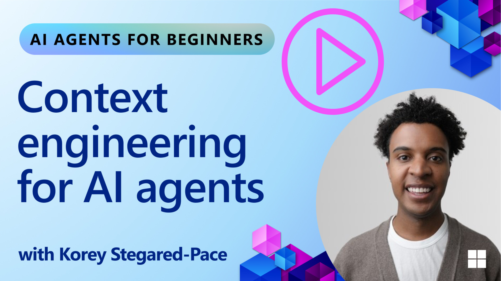
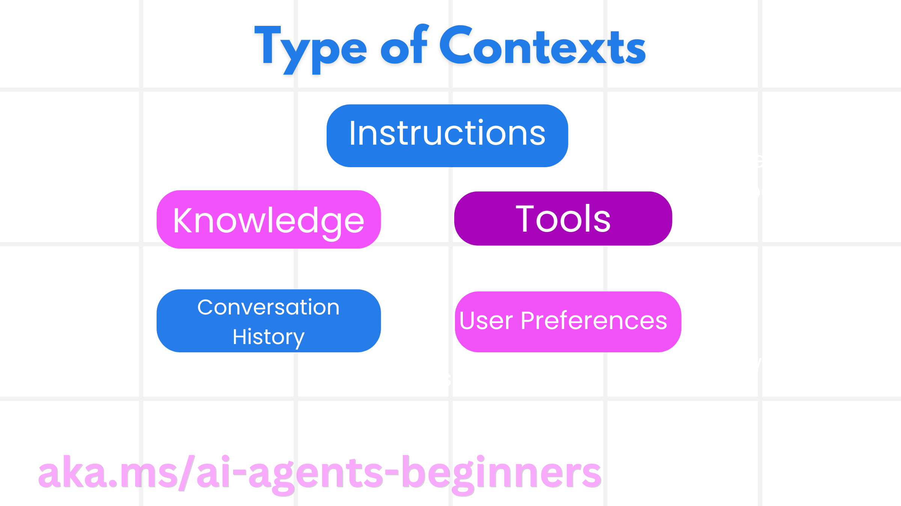
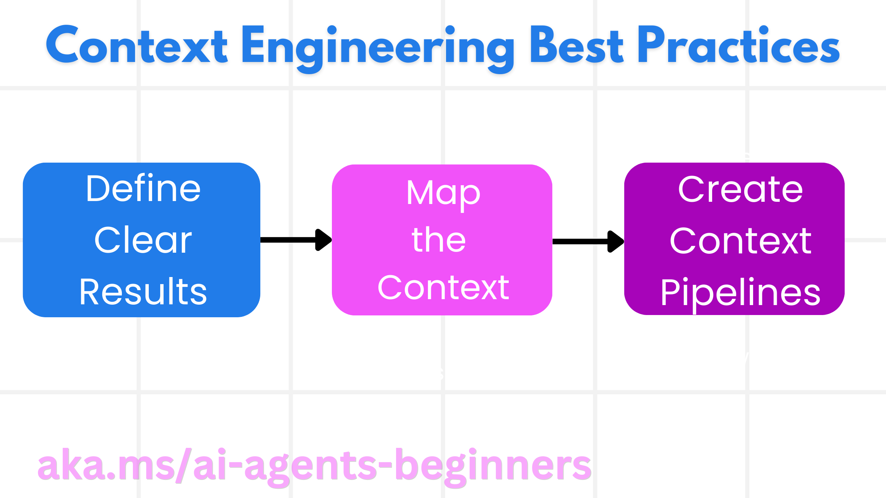

# Context Engineering for AI Agents

> _(Click the image above to view video of this lesson)_

Understanding the complexity of the application you are building an AI agent for is important to making a reliable one. We need to build AI Agents that effectively manage information to address complex needs beyond prompt engineering.

In this lesson, we will look at what context engineering is and its role in building AI agents.

## Introduction

This lesson will cover:

• **What Context Engineering is** and why it's different from prompt engineering.

• **Strategies for effective Context Engineering**, including how to write, select, compress, and isolate information.

• **Common Context Failures** that can derail your AI agent and how to fix them.

## Learning Goals

After completing this lesson, you will know understand how to:

• **Define context engineering** and differentiate it from prompt engineering.

• **Identify the key components of context** in Large Language Model (LLM) applications.

• **Apply strategies for writing, selecting, compressing, and isolating context** to improve agent performance.

• **Recognize common context failures** such as poisoning, distraction, confusion, and clash, and implement mitigation techniques.

## What is Context Engineering?

For AI Agents, context is what drives the planning of an AI Agent to take certain actions. Context Engineering is the practice of making sure the AI Agent has the right information to complete the next step of the task. The context window is limited in size, so as agent builders we need to build systems and processes to manage adding, removing, and condensing the information in the context window.

### Prompt Engineering vs Context Engineering

Prompt engineering is focused on a single set of static instructions to effectively guide the AI Agents with a set of rules.  Context engineering is how to manage a dynamic set of information, including the initial prompt, to ensure that the AI Agent has what it needs over time. The main idea around context engineering is to make this process repeatable and reliable.

### Types of Context

It is important to remember that context is not just one thing. The information  that the AI Agent needs can come from a variety of different sources and it is up to us to ensure the agent has access to these sources:

The types of context an AI agent might need to manage include:

• **Instructions:** These are like the agent's "rules" – prompts, system messages, few-shot examples (showing the AI how to do something), and descriptions of tools it can use. This is where the focus of prompt engineering combines with context engineering.

• **Knowledge:** This covers facts, information retrieved from databases, or long-term memories the agent has accumulated. This includes integrating a Retrieval Augmented Generation (RAG) system if an agent needs access to different knowledge stores and databases.

• **Tools:** These are the definitions of external functions, APIs and MCP Servers that the agent can call, along with the feedback (results) it gets from using them.

• **Conversation History:** The ongoing dialogue with a user. As time passes, these conversations become longer and more complex which means they take up space in the context window.

• **User Preferences:** Information learned about a user's likes or dislikes over time. These could be stored and called upon when making key decisions to help the user.

## Strategies for Effective Context Engineering

### Planning Strategies

Good context engineering starts with good planning. Here is an approach that will help you start to think about how to apply the concept of context engineering:

1. **Define Clear Results** - The results of the tasks that AI Agents will be assigned should be clearly defined. Answer the question - "What will the world look like when the AI Agent is done with its task?" In other words, what change, information, or response should the user have after interacting with the AI Agent.
2. **Map the Context** - Once you have defined the results of the AI Agent, you need to answer the question of "What information does the AI Agent need in order to complete this task?". This way you can start to map the context of where that information can be located.
3. **Create Context Pipelines** - Now that you know where the information is, you need to answer the question "How will the Agent get this information?". This can be done in a variety of ways including RAG, use of MCP servers and other tools.

### Practical Strategies

Planning is important but once the information starts to flow into our agent's context window, we need to have practical strategies to manage it:

#### Managing Context

While some information will be added to the context window automatically, context engineering is about taking a more active role of this information which can be done by a few strategies:

 1. **Agent Scratchpad**
 This allows for an AI Agent to takes notes of relevant information about the current tasks and user interactions during a single session. This should exist outside of the context window in a file or runtime object that the agent can later retrieve during this session if needed.

 2. **Memories**
 Scratchpads are good for managing information outside of the context window of a single session. Memories enable agents to store and retrieve relevant information across multiple sessions. This could include summaries, user preferences and feedback for improvements in the future.

 3. **Compressing Context**
  Once the context window grows and is nearing its limit, techniques such as summarization and trimming can be used. This includes either keeping only the most relevant information or removing older messages.
  
 4. **Multi-Agent Systems**
  Developing multi-agent system is a form of context engineering because each agent has its own context window. How that context is shared and passed to different agents is another thing to plan out when building these systems.
  
 5. **Sandbox Environments**
  If an agent needs to run some code or process large amounts of information in a document, this can take a large amount of tokens to process the results. Instead of having this all stored in the context window, the agent can use a sandbox environment that is able to run this code and only read the results and other relevant information.
  
 6. **Runtime State Objects**
   This is done by creating containers of information to manage situations when the Agent needs to have access to certain information. For a complex task, this would enable an Agent to store the results of each subtask step by step, allowing the context to remain connected only to that specific subtask.
  
### Example of Context Engineering

Let's say we want an AI agent to **"Book me a trip to Paris."**

• A simple  agent using only prompt engineering might just respond: **"Okay, when would you like to go to Paris?**". It only processed your direct question at the time that the user asked.

• An agent using  the context engineering strategies covered would do much more. Before even responding, its system might:

  ◦ **Check your calendar** for available dates (retrieving real-time data).

 ◦ **Recall past travel preferences** (from long-term memory) like your preferred airline, budget, or whether you prefer direct flights.

 ◦ **Identify available tools** for flight and hotel booking.

- Then, an example response could be:  "Hey [Your Name]! I see you're free the first week of October. Shall I look for direct flights to Paris on [Preferred Airline] within your usual budget of [Budget]?". This richer, context-aware response demonstrates the power of context engineering.

## Common Context Failures

### Context Poisoning

**What it is:** When a hallucination (false information generated by the LLM) or an error enters the context and is repeatedly referenced, causing the agent to pursue impossible goals or develop nonsense strategies.

**What to do:** Implement **context validation** and **quarantine**. Validate information before it's added to long-term memory. If potential poisoning is detected, start fresh context threads to prevent the bad information from spreading.

**Travel Booking Example:** Your agent hallucinates a **direct flight from a small local airport to a distant international city** that doesn't actually offer international flights. This non-existent flight detail gets saved into the context. Later, when you ask the agent to book, it keeps trying to find tickets for this impossible route, leading to repeated errors.

**Solution:** Implement a step that **validates flight existence and routes with a real-time API** _before_ adding the flight detail to the agent's working context. If the validation fails, the erroneous information is "quarantined" and not used further.

### Context Distraction

**What it is:** When the context becomes so large that the model focuses too much on the accumulated history instead of using what it learned during training, leading to repetitive or unhelpful actions. Models may begin making mistakes even before the context window is full.

**What to do:** Use **context summarization**. Periodically compress accumulated information into shorter summaries, keeping important details while removing redundant history. This helps "reset" the focus.

**Travel Booking Example:** You've been discussing various dream travel destinations for a long time, including a detailed recounting of your backpacking trip from two years ago. When you finally ask to **"find me a cheap flight for** **next month****,"** the agent gets bogged down in the old, irrelevant details and keeps asking about your backpacking gear or past itineraries, neglecting your current request.

**Solution:** After a certain number of turns or when the context grows too large, the agent should **summarize the most recent and relevant parts of the conversation** – focusing on your current travel dates and destination – and use that condensed summary for the next LLM call, discarding the less relevant historical chat.

### Context Confusion

**What it is:** When unnecessary context, often in the form of too many available tools, causes the model to generate bad responses or call irrelevant tools. Smaller models are especially prone to this.

**What to do:** Implement **tool loadout management** using RAG techniques. Store tool descriptions in a vector database and select _only_ the most relevant tools for each specific task. Research shows limiting tool selections to fewer than 30.

**Travel Booking Example:** Your agent has access to dozens of tools: `book_flight`, `book_hotel`, `rent_car`, `find_tours`, `currency_converter`, `weather_forecast`, `restaurant_reservations`, etc. You ask, **"What's the best way to get around Paris?"** Due to the sheer number of tools, the agent gets confused and attempts to call `book_flight` _within_ Paris, or `rent_car` even though you prefer public transport, because the tool descriptions might overlap or it simply can't discern the best one.

**Solution:** Use **RAG over tool descriptions**. When you ask about getting around Paris, the system dynamically retrieves _only_ the most relevant tools like `rent_car` or `public_transport_info` based on your query, presenting a focused "loadout" of tools to the LLM.

### Context Clash

**What it is:** When conflicting information exists within the context, leading to inconsistent reasoning or bad final responses. This often happens when information arrives in stages, and early, incorrect assumptions remain in the context.

**What to do:** Use **context pruning** and **offloading**. Pruning means removing outdated or conflicting information as new details arrive. Offloading gives the model a separate "scratchpad" workspace to process information without cluttering the main context.

**Travel Booking Example:** You initially tell your agent, **"I want to fly economy class."** Later in the conversation, you change your mind and say, **"Actually, for this trip, let's go business class."** If both instructions remain in the context, the agent might receive conflicting search results or get confused about which preference to prioritize.

**Solution:** Implement **context pruning**. When a new instruction contradicts an old one, the older instruction is removed or explicitly overridden in the context. Alternatively, the agent can use a **scratchpad** to reconcile conflicting preferences before deciding, ensuring only the final, consistent instruction guides its actions.

## Got More Questions About Context Engineering?

Join the [Azure AI Foundry Discord](https://aka.ms/ai-agents/discord) to meet with other learners, attend office hours and get your AI Agents questions answered.
