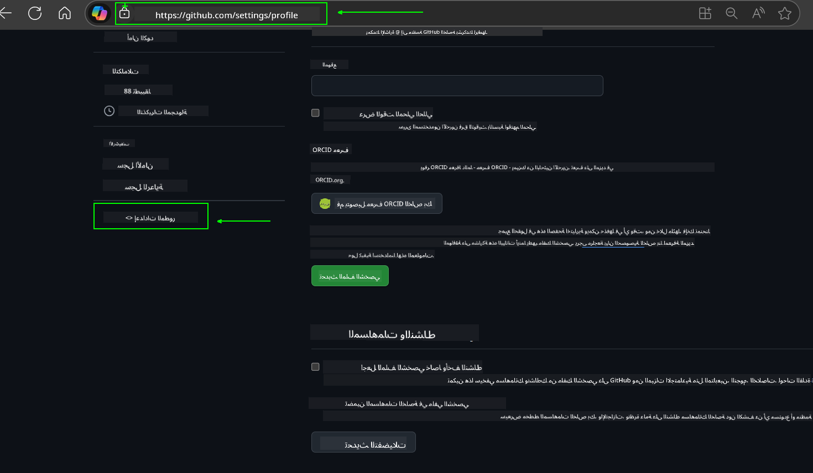
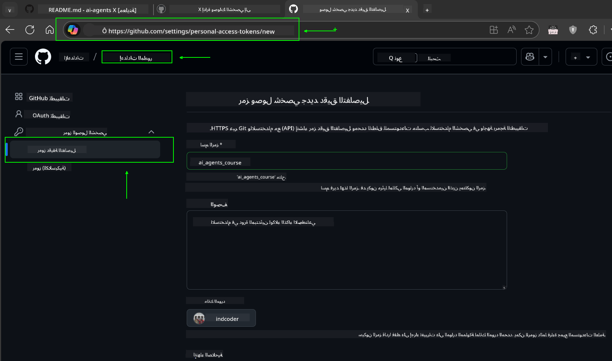
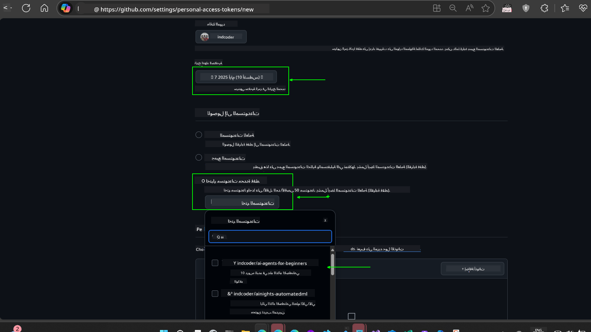
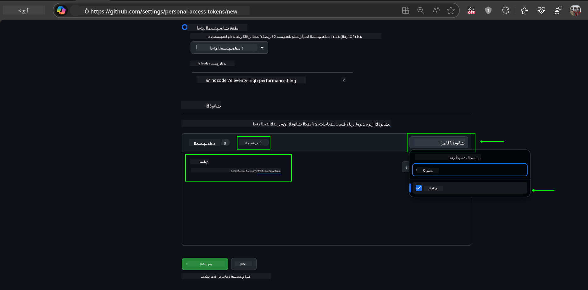
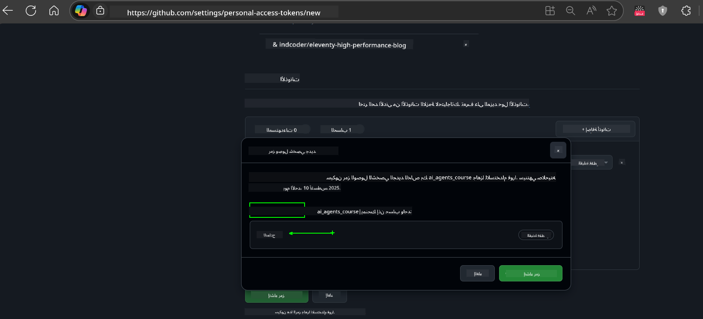
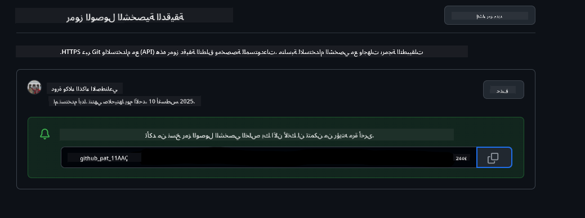
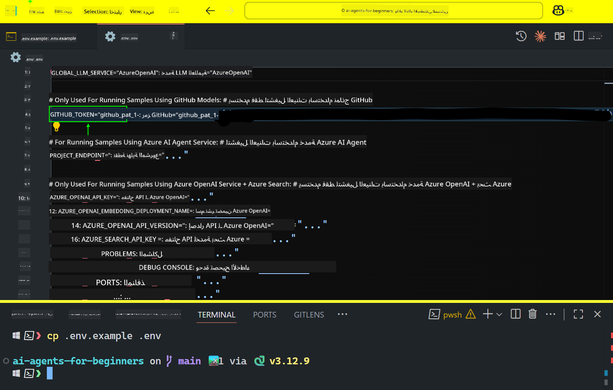

<!--
CO_OP_TRANSLATOR_METADATA:
{
  "original_hash": "c55b973b1562abf5aadf6a4028265ac5",
  "translation_date": "2025-08-29T09:14:27+00:00",
  "source_file": "00-course-setup/README.md",
  "language_code": "ar"
}
-->
# إعداد الدورة

## المقدمة

ستتناول هذه الدرس كيفية تشغيل نماذج التعليمات البرمجية الخاصة بهذه الدورة.

## انضم إلى المتعلمين الآخرين واحصل على المساعدة

قبل أن تبدأ في استنساخ المستودع الخاص بك، انضم إلى [قناة Discord الخاصة بـ AI Agents للمبتدئين](https://aka.ms/ai-agents/discord) للحصول على أي مساعدة في الإعداد، أو للإجابة على أي أسئلة حول الدورة، أو للتواصل مع المتعلمين الآخرين.

## استنساخ أو تفريع هذا المستودع

للبدء، يرجى استنساخ أو تفريع مستودع GitHub. سيتيح لك ذلك إنشاء نسخة خاصة بك من مواد الدورة لتتمكن من تشغيل واختبار وتعديل التعليمات البرمجية!

يمكن القيام بذلك بالنقر على الرابط للحصول على نسخة مفروعة من هذه الدورة في الرابط التالي:


## تشغيل التعليمات البرمجية

تقدم هذه الدورة سلسلة من دفاتر Jupyter التي يمكنك تشغيلها للحصول على تجربة عملية في بناء وكلاء الذكاء الاصطناعي.

تستخدم نماذج التعليمات البرمجية أحد الخيارات التالية:

**يتطلب حساب GitHub - مجاني**:

1) إطار عمل Semantic Kernel Agent + سوق النماذج في GitHub. مُشار إليه بـ (semantic-kernel.ipynb)
2) إطار عمل AutoGen + سوق النماذج في GitHub. مُشار إليه بـ (autogen.ipynb)

**يتطلب اشتراك Azure**:
3) Azure AI Foundry + خدمة Azure AI Agent. مُشار إليه بـ (azureaiagent.ipynb)

نوصي بتجربة جميع الأنواع الثلاثة من الأمثلة لمعرفة أيها يناسبك بشكل أفضل.

أيًا كان الخيار الذي تختاره، سيحدد الخطوات التي تحتاج إلى اتباعها أدناه:

## المتطلبات

- Python 3.12+
  - **ملاحظة**: إذا لم يكن لديك Python3.12 مثبتًا، تأكد من تثبيته. ثم قم بإنشاء بيئة افتراضية باستخدام python3.12 لضمان تثبيت الإصدارات الصحيحة من ملف requirements.txt.
- حساب GitHub - للوصول إلى سوق النماذج في GitHub
- اشتراك Azure - للوصول إلى Azure AI Foundry
- حساب Azure AI Foundry - للوصول إلى خدمة Azure AI Agent

لقد قمنا بتضمين ملف `requirements.txt` في جذر هذا المستودع يحتوي على جميع حزم Python المطلوبة لتشغيل نماذج التعليمات البرمجية.

يمكنك تثبيتها عن طريق تشغيل الأمر التالي في الطرفية في جذر المستودع:

```bash
pip install -r requirements.txt
```
نوصي بإنشاء بيئة Python افتراضية لتجنب أي تعارضات أو مشاكل.

## إعداد VSCode
تأكد من أنك تستخدم الإصدار الصحيح من Python في VSCode.


## الإعداد للأمثلة باستخدام نماذج GitHub

### الخطوة 1: استرجاع رمز الوصول الشخصي (PAT) الخاص بك من GitHub

تستخدم هذه الدورة سوق النماذج في GitHub، مما يوفر وصولًا مجانيًا إلى نماذج اللغة الكبيرة (LLMs) التي ستستخدمها لبناء وكلاء الذكاء الاصطناعي.

للاستفادة من نماذج GitHub، ستحتاج إلى إنشاء [رمز الوصول الشخصي من GitHub](https://docs.github.com/en/authentication/keeping-your-account-and-data-secure/managing-your-personal-access-tokens).

يمكن القيام بذلك من خلال الانتقال إلى حساب GitHub الخاص بك.

يرجى اتباع [مبدأ أقل امتياز](https://docs.github.com/en/get-started/learning-to-code/storing-your-secrets-safely) عند إنشاء الرمز الخاص بك. يعني ذلك أنه يجب عليك منح الرمز فقط الأذونات التي يحتاجها لتشغيل نماذج التعليمات البرمجية في هذه الدورة.

1. اختر خيار `Fine-grained tokens` على الجانب الأيسر من الشاشة من خلال الانتقال إلى **إعدادات المطور**.
   

    ثم اختر `Generate new token`.

    

2. أدخل اسمًا وصفيًا للرمز يعكس الغرض منه، مما يسهل التعرف عليه لاحقًا.

    🔐 توصية مدة الرمز

    المدة الموصى بها: 30 يومًا  
    للحصول على وضع أمني أكثر، يمكنك اختيار فترة أقصر - مثل 7 أيام 🛡️  
    إنها طريقة رائعة لتحديد هدف شخصي وإكمال الدورة بينما تكون في ذروة حماسك للتعلم 🚀.

    

3. قم بتحديد نطاق الرمز ليقتصر على النسخة المفروعة من هذا المستودع.

    

4. قم بتقييد أذونات الرمز: ضمن علامة التبويب **Permissions**، انقر على زر "+ Add permissions". ستظهر قائمة منسدلة. يرجى البحث عن **Models** وتحديد المربع الخاص بها.
    

5. تحقق من الأذونات المطلوبة قبل إنشاء الرمز. 

6. قبل إنشاء الرمز، تأكد من أنك مستعد لتخزين الرمز في مكان آمن مثل مدير كلمات المرور، حيث لن يتم عرضه مرة أخرى بعد إنشائه. 

انسخ الرمز الجديد الذي قمت بإنشائه للتو. ستقوم الآن بإضافته إلى ملف `.env` المضمن في هذه الدورة.

### الخطوة 2: إنشاء ملف `.env`

لإنشاء ملف `.env`، قم بتشغيل الأمر التالي في الطرفية.

```bash
cp .env.example .env
```

سيقوم هذا بنسخ ملف المثال وإنشاء ملف `.env` في الدليل الخاص بك حيث يمكنك ملء القيم لمتغيرات البيئة.

بعد نسخ الرمز الخاص بك، افتح ملف `.env` في محرر النصوص المفضل لديك والصق الرمز في الحقل `GITHUB_TOKEN`.


يجب أن تكون الآن قادرًا على تشغيل نماذج التعليمات البرمجية لهذه الدورة.

## الإعداد للأمثلة باستخدام Azure AI Foundry وخدمة Azure AI Agent

### الخطوة 1: استرجاع نقطة النهاية الخاصة بمشروع Azure الخاص بك

اتبع الخطوات لإنشاء مركز ومشروع في Azure AI Foundry الموجودة هنا: [نظرة عامة على موارد المركز](https://learn.microsoft.com/en-us/azure/ai-foundry/concepts/ai-resources)

بمجرد إنشاء مشروعك، ستحتاج إلى استرجاع سلسلة الاتصال الخاصة بمشروعك.

يمكن القيام بذلك من خلال الانتقال إلى صفحة **نظرة عامة** لمشروعك في بوابة Azure AI Foundry.


### الخطوة 2: إنشاء ملف `.env`

لإنشاء ملف `.env`، قم بتشغيل الأمر التالي في الطرفية.

```bash
cp .env.example .env
```

سيقوم هذا بنسخ ملف المثال وإنشاء ملف `.env` في الدليل الخاص بك حيث يمكنك ملء القيم لمتغيرات البيئة.

بعد نسخ الرمز الخاص بك، افتح ملف `.env` في محرر النصوص المفضل لديك والصق الرمز في الحقل `PROJECT_ENDPOINT`.

### الخطوة 3: تسجيل الدخول إلى Azure

كأفضل ممارسة أمان، سنستخدم [المصادقة بدون مفتاح](https://learn.microsoft.com/azure/developer/ai/keyless-connections?tabs=csharp%2Cazure-cli?WT.mc_id=academic-105485-koreyst) للمصادقة على Azure OpenAI باستخدام Microsoft Entra ID.

بعد ذلك، افتح الطرفية وقم بتشغيل `az login --use-device-code` لتسجيل الدخول إلى حساب Azure الخاص بك.

بمجرد تسجيل الدخول، اختر اشتراكك في الطرفية.

## متغيرات البيئة الإضافية - Azure Search وAzure OpenAI

بالنسبة لدرس Agentic RAG - الدرس الخامس - هناك أمثلة تستخدم Azure Search وAzure OpenAI.

إذا كنت ترغب في تشغيل هذه الأمثلة، ستحتاج إلى إضافة متغيرات البيئة التالية إلى ملف `.env` الخاص بك:

### صفحة النظرة العامة (المشروع)

- `AZURE_SUBSCRIPTION_ID` - تحقق من **تفاصيل المشروع** في صفحة **نظرة عامة** لمشروعك.

- `AZURE_AI_PROJECT_NAME` - انظر إلى أعلى صفحة **نظرة عامة** لمشروعك.

- `AZURE_OPENAI_SERVICE` - ابحث عن هذا في علامة التبويب **القدرات المضمنة** لخدمة **Azure OpenAI** في صفحة **نظرة عامة**.

### مركز الإدارة

- `AZURE_OPENAI_RESOURCE_GROUP` - انتقل إلى **خصائص المشروع** في صفحة **نظرة عامة** لمركز الإدارة.

- `GLOBAL_LLM_SERVICE` - ضمن **الموارد المتصلة**، ابحث عن اسم اتصال **Azure AI Services**. إذا لم يكن مدرجًا، تحقق من **بوابة Azure** ضمن مجموعة الموارد الخاصة بك للحصول على اسم مورد AI Services.

### صفحة النماذج + نقاط النهاية

- `AZURE_OPENAI_EMBEDDING_DEPLOYMENT_NAME` - اختر نموذج التضمين الخاص بك (مثل `text-embedding-ada-002`) ولاحظ **اسم النشر** من تفاصيل النموذج.

- `AZURE_OPENAI_CHAT_DEPLOYMENT_NAME` - اختر نموذج الدردشة الخاص بك (مثل `gpt-4o-mini`) ولاحظ **اسم النشر** من تفاصيل النموذج.

### بوابة Azure

- `AZURE_OPENAI_ENDPOINT` - ابحث عن **خدمات Azure AI**، انقر عليها، ثم انتقل إلى **إدارة الموارد**، **المفاتيح ونقطة النهاية**، قم بالتمرير لأسفل إلى "نقاط النهاية الخاصة بـ Azure OpenAI"، ونسخ النقطة التي تقول "APIs اللغة".

- `AZURE_OPENAI_API_KEY` - من نفس الشاشة، انسخ المفتاح 1 أو المفتاح 2.

- `AZURE_SEARCH_SERVICE_ENDPOINT` - ابحث عن مورد **Azure AI Search** الخاص بك، انقر عليه، وشاهد **نظرة عامة**.

- `AZURE_SEARCH_API_KEY` - ثم انتقل إلى **الإعدادات** ثم **المفاتيح** لنسخ المفتاح الإداري الأساسي أو الثانوي.

### صفحة ويب خارجية

- `AZURE_OPENAI_API_VERSION` - قم بزيارة صفحة [دورة حياة إصدار API](https://learn.microsoft.com/en-us/azure/ai-services/openai/api-version-deprecation#latest-ga-api-release) ضمن **أحدث إصدار API GA**.

### إعداد المصادقة بدون مفتاح

بدلاً من كتابة بيانات الاعتماد الخاصة بك، سنستخدم اتصالًا بدون مفتاح مع Azure OpenAI. للقيام بذلك، سنقوم باستيراد `DefaultAzureCredential` ثم استدعاء وظيفة `DefaultAzureCredential` للحصول على بيانات الاعتماد.

```python
from azure.identity import DefaultAzureCredential, InteractiveBrowserCredential
```

## هل واجهت مشكلة؟

إذا واجهت أي مشاكل أثناء تشغيل هذا الإعداد، انضم إلى قناتنا للحصول على الدعم.

## الدرس التالي

أنت الآن جاهز لتشغيل التعليمات البرمجية لهذه الدورة. نتمنى لك تعلمًا ممتعًا في عالم وكلاء الذكاء الاصطناعي!

[مقدمة إلى وكلاء الذكاء الاصطناعي وحالات الاستخدام الخاصة بهم](../01-intro-to-ai-agents/README.md)

---

**إخلاء المسؤولية**:  
تمت ترجمة هذا المستند باستخدام خدمة الترجمة الآلية [Co-op Translator](https://github.com/Azure/co-op-translator). بينما نسعى لتحقيق الدقة، يرجى العلم أن الترجمات الآلية قد تحتوي على أخطاء أو معلومات غير دقيقة. يجب اعتبار المستند الأصلي بلغته الأصلية هو المصدر الموثوق. للحصول على معلومات حساسة أو هامة، يُوصى بالاستعانة بترجمة بشرية احترافية. نحن غير مسؤولين عن أي سوء فهم أو تفسيرات خاطئة تنشأ عن استخدام هذه الترجمة.