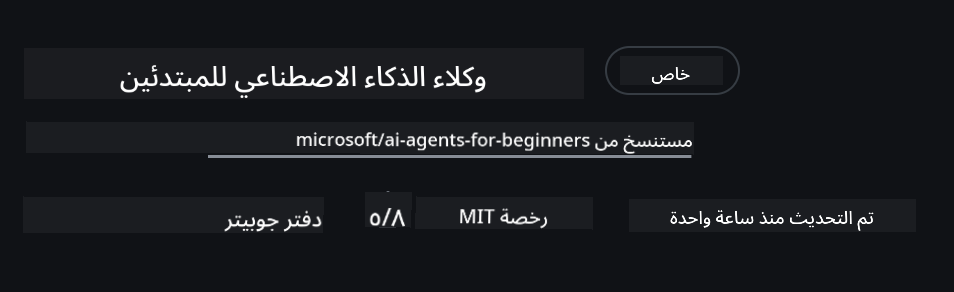
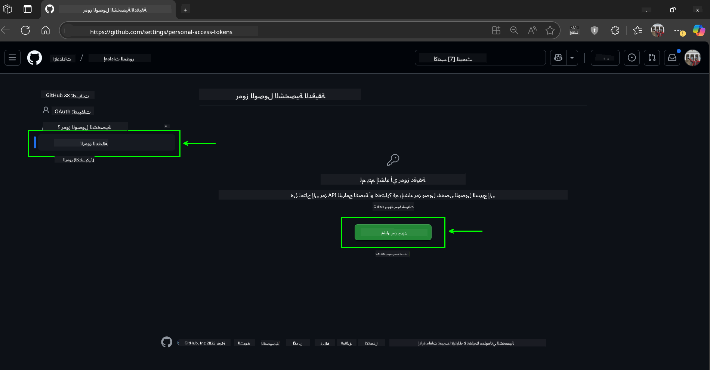
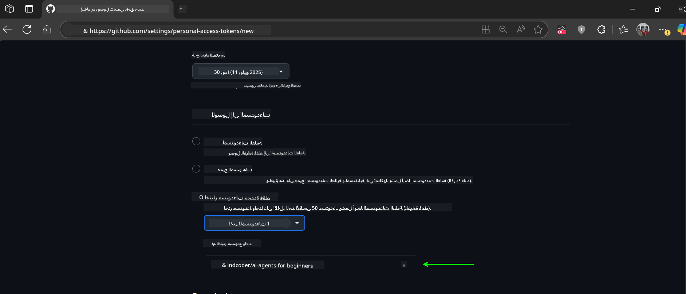
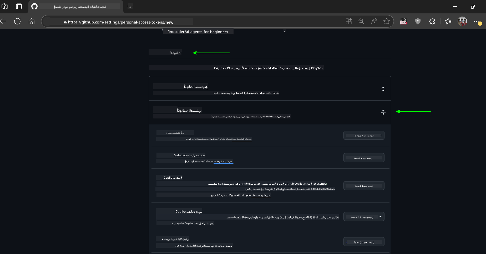
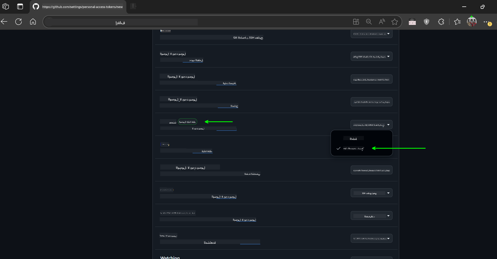
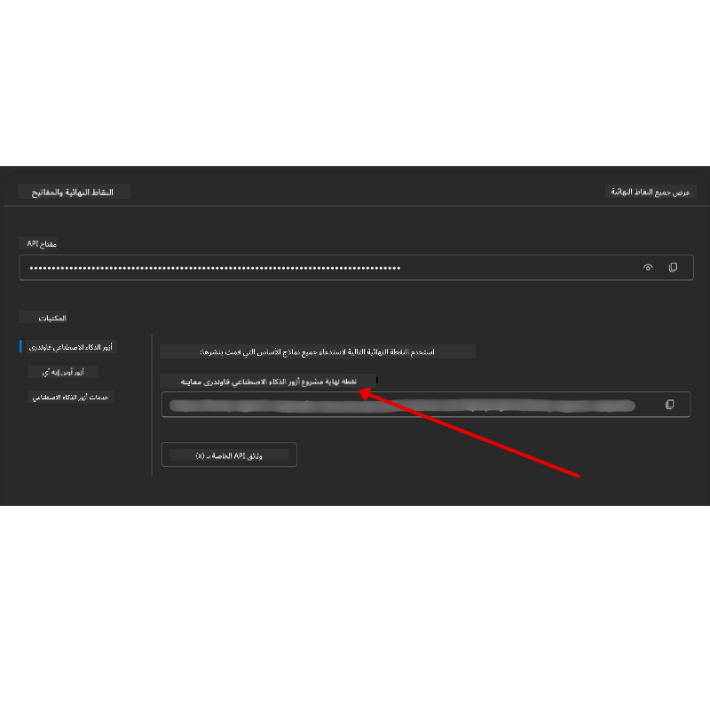

<!--
CO_OP_TRANSLATOR_METADATA:
{
  "original_hash": "c6a79c8f2b56a80370ff7e447765524f",
  "translation_date": "2025-07-23T08:11:13+00:00",
  "source_file": "00-course-setup/README.md",
  "language_code": "ar"
}
-->
# إعداد الدورة

## المقدمة

ستتناول هذه الدرس كيفية تشغيل نماذج الكود الخاصة بهذه الدورة.

## نسخ أو استنساخ هذا المستودع

للبدء، يرجى نسخ أو استنساخ مستودع GitHub. سيتيح لك ذلك إنشاء نسخة خاصة بك من مواد الدورة لتتمكن من تشغيل واختبار وتعديل الكود!

يمكن القيام بذلك بالنقر على الرابط التالي:



## تشغيل الكود

تقدم هذه الدورة سلسلة من دفاتر Jupyter التي يمكنك تشغيلها للحصول على تجربة عملية في بناء وكلاء الذكاء الاصطناعي.

تستخدم نماذج الكود أحد الخيارات التالية:

**يتطلب حساب GitHub - مجاني**:

1) إطار عمل Semantic Kernel Agent + سوق نماذج GitHub. مُشار إليه بـ (semantic-kernel.ipynb)
2) إطار عمل AutoGen + سوق نماذج GitHub. مُشار إليه بـ (autogen.ipynb)

**يتطلب اشتراك Azure**:
3) Azure AI Foundry + خدمة Azure AI Agent. مُشار إليه بـ (azureaiagent.ipynb)

نوصي بتجربة جميع الأنواع الثلاثة من الأمثلة لمعرفة أيها يناسبك بشكل أفضل.

الخيار الذي تختاره سيحدد الخطوات التي تحتاج إلى اتباعها أدناه:

## المتطلبات

- Python 3.12+
  - **NOTE**: إذا لم يكن لديك Python3.12 مثبتًا، تأكد من تثبيته. ثم قم بإنشاء بيئة افتراضية باستخدام python3.12 لضمان تثبيت الإصدارات الصحيحة من ملف requirements.txt.
- حساب GitHub - للوصول إلى سوق نماذج GitHub
- اشتراك Azure - للوصول إلى Azure AI Foundry
- حساب Azure AI Foundry - للوصول إلى خدمة Azure AI Agent

قمنا بتضمين ملف `requirements.txt` في جذر هذا المستودع يحتوي على جميع حزم Python المطلوبة لتشغيل نماذج الكود.

يمكنك تثبيتها عن طريق تشغيل الأمر التالي في الطرفية في جذر المستودع:

```bash
pip install -r requirements.txt
```
نوصي بإنشاء بيئة Python افتراضية لتجنب أي تعارضات أو مشاكل.

## إعداد VSCode
تأكد من أنك تستخدم الإصدار الصحيح من Python في VSCode.


## إعداد نماذج GitHub

### الخطوة 1: استرجاع رمز الوصول الشخصي (PAT) الخاص بك من GitHub

تعتمد هذه الدورة على سوق نماذج GitHub، الذي يوفر وصولًا مجانيًا إلى نماذج اللغة الكبيرة (LLMs) التي ستستخدمها لبناء وكلاء الذكاء الاصطناعي.

للاستفادة من نماذج GitHub، ستحتاج إلى إنشاء [رمز الوصول الشخصي من GitHub](https://docs.github.com/en/authentication/keeping-your-account-and-data-secure/managing-your-personal-access-tokens).

يمكن القيام بذلك من خلال الذهاب إلى حسابك في GitHub.

يرجى اتباع [مبدأ أقل امتياز](https://docs.github.com/en/get-started/learning-to-code/storing-your-secrets-safely) عند إنشاء الرمز الخاص بك. يعني ذلك أنه يجب عليك منح الرمز فقط الأذونات التي يحتاجها لتشغيل نماذج الكود في هذه الدورة.

1. اختر خيار `Fine-grained tokens` على الجانب الأيسر من الشاشة.

    ثم اختر `Generate new token`.

    

1. أدخل اسمًا وصفيًا للرمز يعكس الغرض منه، مما يسهل التعرف عليه لاحقًا. قم بتعيين تاريخ انتهاء الصلاحية (موصى به: 30 يومًا؛ يمكنك اختيار فترة أقصر مثل 7 أيام إذا كنت تفضل وضعًا أكثر أمانًا).

    

1. قم بتحديد نطاق الرمز ليقتصر على النسخة المستنسخة من هذا المستودع.

    

1. قم بتقييد أذونات الرمز: ضمن **Permissions**، قم بتفعيل **Account Permissions**، وانتقل إلى **Models** وقم بتمكين الوصول للقراءة فقط المطلوب لنماذج GitHub.

    

    

انسخ الرمز الجديد الذي قمت بإنشائه الآن. ستقوم بإضافته إلى ملف `.env` المضمن في هذه الدورة.

### الخطوة 2: إنشاء ملف `.env`

لإنشاء ملف `.env`، قم بتشغيل الأمر التالي في الطرفية.

```bash
cp .env.example .env
```

سيقوم هذا بنسخ ملف المثال وإنشاء `.env` في الدليل الخاص بك حيث يمكنك ملء القيم لمتغيرات البيئة.

بعد نسخ الرمز الخاص بك، افتح ملف `.env` في محرر النصوص المفضل لديك والصق الرمز في الحقل `GITHUB_TOKEN`.

يجب أن تكون الآن قادرًا على تشغيل نماذج الكود لهذه الدورة.

## إعداد نماذج Azure AI Foundry وخدمة Azure AI Agent

### الخطوة 1: استرجاع نقطة النهاية لمشروع Azure الخاص بك

اتبع الخطوات لإنشاء مركز ومشروع في Azure AI Foundry الموجودة هنا: [نظرة عامة على موارد المركز](https://learn.microsoft.com/en-us/azure/ai-foundry/concepts/ai-resources)

بمجرد إنشاء مشروعك، ستحتاج إلى استرجاع سلسلة الاتصال الخاصة بمشروعك.

يمكن القيام بذلك من خلال الذهاب إلى صفحة **Overview** لمشروعك في بوابة Azure AI Foundry.



### الخطوة 2: إنشاء ملف `.env`

لإنشاء ملف `.env`، قم بتشغيل الأمر التالي في الطرفية.

```bash
cp .env.example .env
```

سيقوم هذا بنسخ ملف المثال وإنشاء `.env` في الدليل الخاص بك حيث يمكنك ملء القيم لمتغيرات البيئة.

بعد نسخ الرمز الخاص بك، افتح ملف `.env` في محرر النصوص المفضل لديك والصق الرمز في الحقل `PROJECT_ENDPOINT`.

### الخطوة 3: تسجيل الدخول إلى Azure

كأفضل ممارسة أمان، سنستخدم [المصادقة بدون مفتاح](https://learn.microsoft.com/azure/developer/ai/keyless-connections?tabs=csharp%2Cazure-cli?WT.mc_id=academic-105485-koreyst) للمصادقة على Azure OpenAI باستخدام Microsoft Entra ID.

بعد ذلك، افتح الطرفية وقم بتشغيل `az login --use-device-code` لتسجيل الدخول إلى حساب Azure الخاص بك.

بمجرد تسجيل الدخول، اختر اشتراكك في الطرفية.

## متغيرات البيئة الإضافية - Azure Search وAzure OpenAI

بالنسبة لدرس Agentic RAG - الدرس الخامس - هناك نماذج تستخدم Azure Search وAzure OpenAI.

إذا كنت ترغب في تشغيل هذه النماذج، ستحتاج إلى إضافة متغيرات البيئة التالية إلى ملف `.env` الخاص بك:

### صفحة النظرة العامة (المشروع)

- `AZURE_SUBSCRIPTION_ID` - تحقق من **تفاصيل المشروع** في صفحة **Overview** لمشروعك.

- `AZURE_AI_PROJECT_NAME` - انظر إلى أعلى صفحة **Overview** لمشروعك.

- `AZURE_OPENAI_SERVICE` - ابحث عن هذا في علامة التبويب **Included capabilities** لخدمة **Azure OpenAI Service** في صفحة **Overview**.

### مركز الإدارة

- `AZURE_OPENAI_RESOURCE_GROUP` - انتقل إلى **خصائص المشروع** في صفحة **Overview** لمركز الإدارة.

- `GLOBAL_LLM_SERVICE` - ضمن **الموارد المتصلة**، ابحث عن اسم اتصال **Azure AI Services**. إذا لم يكن مدرجًا، تحقق من **بوابة Azure** ضمن مجموعة الموارد الخاصة بك للحصول على اسم مورد AI Services.

### صفحة النماذج + نقاط النهاية

- `AZURE_OPENAI_EMBEDDING_DEPLOYMENT_NAME` - اختر نموذج التضمين الخاص بك (مثل `text-embedding-ada-002`) ولاحظ **اسم النشر** من تفاصيل النموذج.

- `AZURE_OPENAI_CHAT_DEPLOYMENT_NAME` - اختر نموذج الدردشة الخاص بك (مثل `gpt-4o-mini`) ولاحظ **اسم النشر** من تفاصيل النموذج.

### بوابة Azure

- `AZURE_OPENAI_ENDPOINT` - ابحث عن **خدمات Azure AI**، انقر عليها، ثم انتقل إلى **إدارة الموارد**، **المفاتيح ونقطة النهاية**، قم بالتمرير لأسفل إلى "نقاط نهاية Azure OpenAI"، ونسخ النقطة التي تقول "APIs اللغة".

- `AZURE_OPENAI_API_KEY` - من نفس الشاشة، انسخ المفتاح 1 أو المفتاح 2.

- `AZURE_SEARCH_SERVICE_ENDPOINT` - ابحث عن مورد **Azure AI Search** الخاص بك، انقر عليه، وشاهد **Overview**.

- `AZURE_SEARCH_API_KEY` - ثم انتقل إلى **الإعدادات** ثم **المفاتيح** لنسخ المفتاح الإداري الأساسي أو الثانوي.

### صفحة ويب خارجية

- `AZURE_OPENAI_API_VERSION` - قم بزيارة صفحة [دورة حياة إصدار API](https://learn.microsoft.com/en-us/azure/ai-services/openai/api-version-deprecation#latest-ga-api-release) ضمن **أحدث إصدار API GA**.

### إعداد المصادقة بدون مفتاح

بدلاً من كتابة بيانات الاعتماد الخاصة بك، سنستخدم اتصالًا بدون مفتاح مع Azure OpenAI. للقيام بذلك، سنقوم باستيراد `DefaultAzureCredential` ومن ثم استدعاء وظيفة `DefaultAzureCredential` للحصول على بيانات الاعتماد.

```python
from azure.identity import DefaultAzureCredential, InteractiveBrowserCredential
```

## هل واجهت مشكلة؟

إذا واجهت أي مشاكل أثناء تشغيل هذا الإعداد، انضم إلى مجموعتنا.

## الدرس التالي

أنت الآن جاهز لتشغيل نماذج الكود لهذه الدورة. نتمنى لك تعلمًا ممتعًا عن عالم وكلاء الذكاء الاصطناعي!

[مقدمة عن وكلاء الذكاء الاصطناعي وحالات الاستخدام](../01-intro-to-ai-agents/README.md)

**إخلاء المسؤولية**:  
تم ترجمة هذا المستند باستخدام خدمة الترجمة بالذكاء الاصطناعي [Co-op Translator](https://github.com/Azure/co-op-translator). بينما نسعى لتحقيق الدقة، يرجى العلم أن الترجمات الآلية قد تحتوي على أخطاء أو معلومات غير دقيقة. يجب اعتبار المستند الأصلي بلغته الأصلية المصدر الموثوق. للحصول على معلومات حاسمة، يُوصى بالاستعانة بترجمة بشرية احترافية. نحن غير مسؤولين عن أي سوء فهم أو تفسيرات خاطئة تنشأ عن استخدام هذه الترجمة.