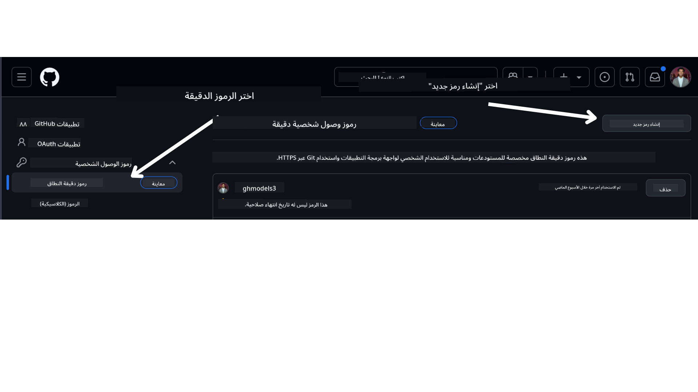

<!--
CO_OP_TRANSLATOR_METADATA:
{
  "original_hash": "76945069b52a49cd0432ae3e0b0ba22e",
  "translation_date": "2025-07-12T07:43:28+00:00",
  "source_file": "00-course-setup/README.md",
  "language_code": "ar"
}
-->
في حساب GitHub الخاص بك.

اختر خيار `Fine-grained tokens` على الجانب الأيسر من شاشتك.

ثم اختر `Generate new token`.



سيُطلب منك إدخال اسم للتوكن الخاص بك، اختيار تاريخ انتهاء الصلاحية (مُوصى به: 30 يومًا)، وتحديد الصلاحيات للتوكن الخاص بك (المستودعات العامة).

من الضروري أيضًا تعديل أذونات هذا التوكن: Permissions -> Models -> يسمح بالوصول إلى نماذج GitHub

انسخ التوكن الجديد الذي أنشأته للتو. ستقوم الآن بإضافته إلى ملف `.env` المرفق في هذا الدورة.

### الخطوة 2: إنشاء ملف `.env` الخاص بك

لإنشاء ملف `.env` الخاص بك، شغّل الأمر التالي في الطرفية.

```bash
cp .env.example .env
```

سيقوم هذا بنسخ ملف المثال وإنشاء ملف `.env` في مجلدك حيث يمكنك ملء القيم لمتغيرات البيئة.

بعد نسخ التوكن، افتح ملف `.env` في محرر النصوص المفضل لديك والصق التوكن في حقل `GITHUB_TOKEN`.

يجب أن تكون الآن قادرًا على تشغيل عينات الكود الخاصة بهذه الدورة.

## الإعداد لتشغيل العينات باستخدام Azure AI Foundry وخدمة Azure AI Agent

### الخطوة 1: استرجاع نقطة نهاية مشروع Azure الخاصة بك

اتبع الخطوات لإنشاء مركز ومشروع في Azure AI Foundry الموجودة هنا: [نظرة عامة على موارد المركز](https://learn.microsoft.com/en-us/azure/ai-foundry/concepts/ai-resources)

بمجرد إنشاء مشروعك، ستحتاج إلى استرجاع سلسلة الاتصال الخاصة بمشروعك.

يمكنك فعل ذلك بالذهاب إلى صفحة **نظرة عامة** لمشروعك في بوابة Azure AI Foundry.


### الخطوة 2: إنشاء ملف `.env` الخاص بك

لإنشاء ملف `.env` الخاص بك، شغّل الأمر التالي في الطرفية.

```bash
cp .env.example .env
```

سيقوم هذا بنسخ ملف المثال وإنشاء ملف `.env` في مجلدك حيث يمكنك ملء القيم لمتغيرات البيئة.

بعد نسخ التوكن، افتح ملف `.env` في محرر النصوص المفضل لديك والصق التوكن في حقل `PROJECT_ENDPOINT`.

### الخطوة 3: تسجيل الدخول إلى Azure

كأفضل ممارسة أمنية، سنستخدم [المصادقة بدون مفتاح](https://learn.microsoft.com/azure/developer/ai/keyless-connections?tabs=csharp%2Cazure-cli?WT.mc_id=academic-105485-koreyst) للمصادقة على Azure OpenAI باستخدام Microsoft Entra ID. قبل أن تتمكن من القيام بذلك، ستحتاج أولاً إلى تثبيت **Azure CLI** وفقًا لـ [تعليمات التثبيت](https://learn.microsoft.com/cli/azure/install-azure-cli?WT.mc_id=academic-105485-koreyst) لنظام التشغيل الخاص بك.

بعد ذلك، افتح الطرفية وشغّل الأمر `az login --use-device-code` لتسجيل الدخول إلى حساب Azure الخاص بك.

بمجرد تسجيل الدخول، اختر اشتراكك في الطرفية.

## متغيرات بيئة إضافية - Azure Search و Azure OpenAI

في درس Agentic RAG - الدرس 5 - هناك عينات تستخدم Azure Search و Azure OpenAI.

إذا كنت ترغب في تشغيل هذه العينات، ستحتاج إلى إضافة متغيرات البيئة التالية إلى ملف `.env` الخاص بك:

### صفحة النظرة العامة (المشروع)

- `AZURE_SUBSCRIPTION_ID` - تحقق من **تفاصيل المشروع** في صفحة **النظرة العامة** لمشروعك.

- `AZURE_AI_PROJECT_NAME` - انظر في أعلى صفحة **النظرة العامة** لمشروعك.

- `AZURE_OPENAI_SERVICE` - ابحث عن هذا في تبويب **القدرات المضمنة** لخدمة **Azure OpenAI** في صفحة **النظرة العامة**.

### مركز الإدارة

- `AZURE_OPENAI_RESOURCE_GROUP` - اذهب إلى **خصائص المشروع** في صفحة **النظرة العامة** لمركز الإدارة.

- `GLOBAL_LLM_SERVICE` - تحت **الموارد المتصلة**، ابحث عن اسم اتصال **خدمات Azure AI**. إذا لم يكن مدرجًا، تحقق من **بوابة Azure** ضمن مجموعة الموارد الخاصة بك لاسم مورد خدمات AI.

### صفحة النماذج ونقاط النهاية

- `AZURE_OPENAI_EMBEDDING_DEPLOYMENT_NAME` - اختر نموذج التضمين الخاص بك (مثل `text-embedding-ada-002`) ودوّن **اسم النشر** من تفاصيل النموذج.

- `AZURE_OPENAI_CHAT_DEPLOYMENT_NAME` - اختر نموذج الدردشة الخاص بك (مثل `gpt-4o-mini`) ودوّن **اسم النشر** من تفاصيل النموذج.

### بوابة Azure

- `AZURE_OPENAI_ENDPOINT` - ابحث عن **خدمات Azure AI**، انقر عليها، ثم اذهب إلى **إدارة الموارد**، **المفاتيح ونقطة النهاية**، ومرر للأسفل إلى "نقاط نهاية Azure OpenAI"، وانسخ النقطة التي تقول "واجهات برمجة التطبيقات اللغوية".

- `AZURE_OPENAI_API_KEY` - من نفس الشاشة، انسخ المفتاح 1 أو المفتاح 2.

- `AZURE_SEARCH_SERVICE_ENDPOINT` - ابحث عن مورد **Azure AI Search** الخاص بك، انقر عليه، واطلع على **النظرة العامة**.

- `AZURE_SEARCH_API_KEY` - ثم اذهب إلى **الإعدادات** ثم **المفاتيح** لنسخ المفتاح الإداري الأساسي أو الثانوي.

### صفحة ويب خارجية

- `AZURE_OPENAI_API_VERSION` - زر صفحة [دورة حياة إصدار API](https://learn.microsoft.com/en-us/azure/ai-services/openai/api-version-deprecation#latest-ga-api-release) تحت **أحدث إصدار GA للـ API**.

### إعداد المصادقة بدون مفتاح

بدلاً من ترميز بيانات الاعتماد الخاصة بك بشكل ثابت، سنستخدم اتصالًا بدون مفتاح مع Azure OpenAI. للقيام بذلك، سنستورد `DefaultAzureCredential` وسنستدعي لاحقًا دالة `DefaultAzureCredential` للحصول على بيانات الاعتماد.

```python
from azure.identity import DefaultAzureCredential, InteractiveBrowserCredential
```

## عالق في مكان ما؟

إذا واجهت أي مشاكل في تشغيل هذا الإعداد، انضم إلى مجتمعنا

أو

.

## الدرس التالي

أنت الآن جاهز لتشغيل كود هذه الدورة. نتمنى لك تعلمًا ممتعًا أكثر عن عالم وكلاء الذكاء الاصطناعي!

[مقدمة إلى وكلاء الذكاء الاصطناعي وحالات استخدام الوكلاء](../01-intro-to-ai-agents/README.md)

**إخلاء المسؤولية**:  
تمت ترجمة هذا المستند باستخدام خدمة الترجمة الآلية [Co-op Translator](https://github.com/Azure/co-op-translator). بينما نسعى لتحقيق الدقة، يرجى العلم أن الترجمات الآلية قد تحتوي على أخطاء أو عدم دقة. يجب اعتبار المستند الأصلي بلغته الأصلية المصدر الموثوق به. للمعلومات الهامة، يُنصح بالاعتماد على الترجمة البشرية المهنية. نحن غير مسؤولين عن أي سوء فهم أو تفسير ناتج عن استخدام هذه الترجمة.