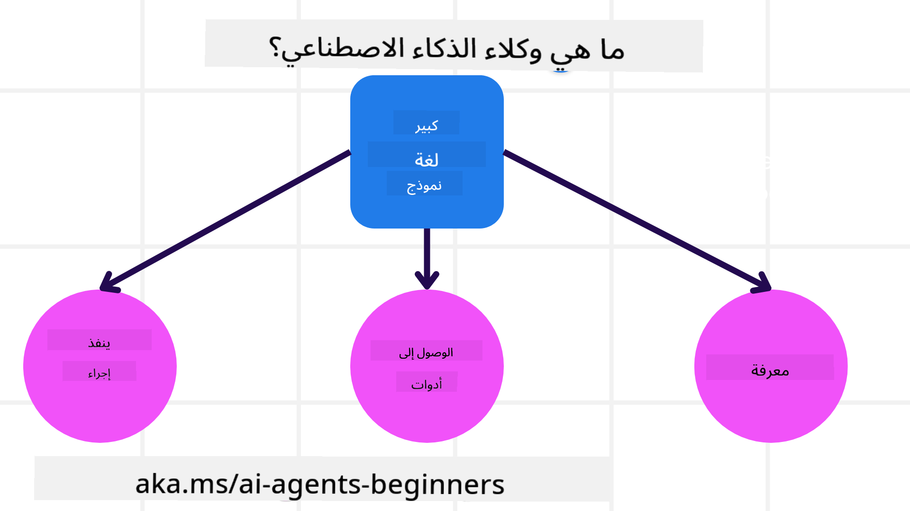
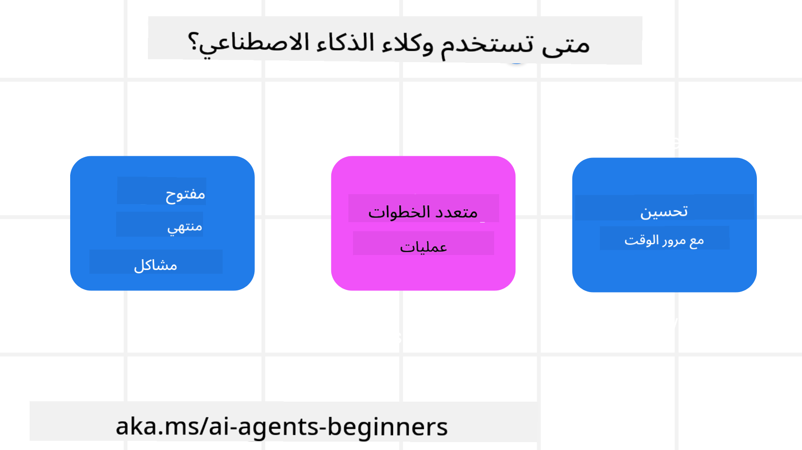

<!--
CO_OP_TRANSLATOR_METADATA:
{
  "original_hash": "d84943abc8f001ad4670418d32c2d899",
  "translation_date": "2025-07-12T08:01:16+00:00",
  "source_file": "01-intro-to-ai-agents/README.md",
  "language_code": "ar"
}
-->
للقاء متعلمين آخرين وبناة وكلاء الذكاء الاصطناعي وطرح أي أسئلة لديك حول هذا الدورة.

لبدء هذه الدورة، نبدأ بفهم أفضل لماهية وكلاء الذكاء الاصطناعي وكيف يمكننا استخدامهم في التطبيقات وسير العمل التي نبنيها.

## مقدمة

تغطي هذه الدرس:

- ما هي وكلاء الذكاء الاصطناعي وما هي الأنواع المختلفة للوكلاء؟
- ما هي حالات الاستخدام الأفضل لوكلاء الذكاء الاصطناعي وكيف يمكنهم مساعدتنا؟
- ما هي بعض اللبنات الأساسية عند تصميم حلول وكيلية؟

## أهداف التعلم
بعد إكمال هذا الدرس، يجب أن تكون قادرًا على:

- فهم مفاهيم وكلاء الذكاء الاصطناعي وكيف تختلف عن حلول الذكاء الاصطناعي الأخرى.
- تطبيق وكلاء الذكاء الاصطناعي بأكثر الطرق كفاءة.
- تصميم حلول وكيلية بشكل منتج لكل من المستخدمين والعملاء.

## تعريف وكلاء الذكاء الاصطناعي وأنواعهم

### ما هي وكلاء الذكاء الاصطناعي؟

وكلاء الذكاء الاصطناعي هم **أنظمة** تُمكّن **نماذج اللغة الكبيرة (LLMs)** من **أداء الأفعال** عن طريق توسيع قدراتهم من خلال منح نماذج اللغة الكبيرة **الوصول إلى الأدوات** و**المعرفة**.

دعونا نجزئ هذا التعريف إلى أجزاء أصغر:

- **النظام** - من المهم التفكير في الوكلاء ليس كمكون واحد فقط، بل كنظام يتكون من عدة مكونات. على المستوى الأساسي، مكونات وكيل الذكاء الاصطناعي هي:
  - **البيئة** - المساحة المحددة التي يعمل فيها وكيل الذكاء الاصطناعي. على سبيل المثال، إذا كان لدينا وكيل حجز سفر، يمكن أن تكون البيئة نظام حجز السفر الذي يستخدمه الوكيل لإكمال المهام.
  - **المستشعرات** - تحتوي البيئات على معلومات وتوفر ردود فعل. يستخدم وكلاء الذكاء الاصطناعي المستشعرات لجمع وتفسير هذه المعلومات حول الحالة الحالية للبيئة. في مثال وكيل حجز السفر، يمكن لنظام الحجز توفير معلومات مثل توفر الفنادق أو أسعار الرحلات.
  - **المشغلات** - بمجرد أن يتلقى وكيل الذكاء الاصطناعي الحالة الحالية للبيئة، يحدد الوكيل للإجراء الحالي ما هو الإجراء الذي يجب تنفيذه لتغيير البيئة. بالنسبة لوكيل حجز السفر، قد يكون ذلك حجز غرفة متاحة للمستخدم.

**نماذج اللغة الكبيرة** - كان مفهوم الوكلاء موجودًا قبل إنشاء نماذج اللغة الكبيرة. ميزة بناء وكلاء الذكاء الاصطناعي باستخدام نماذج اللغة الكبيرة هي قدرتها على تفسير اللغة البشرية والبيانات. تتيح هذه القدرة لنماذج اللغة الكبيرة تفسير معلومات البيئة وتحديد خطة لتغيير البيئة.

**أداء الأفعال** - خارج أنظمة وكلاء الذكاء الاصطناعي، تقتصر نماذج اللغة الكبيرة على الحالات التي يكون فيها الإجراء هو توليد محتوى أو معلومات بناءً على طلب المستخدم. داخل أنظمة وكلاء الذكاء الاصطناعي، يمكن لنماذج اللغة الكبيرة إنجاز المهام من خلال تفسير طلب المستخدم واستخدام الأدوات المتاحة في بيئتها.

**الوصول إلى الأدوات** - الأدوات التي يمكن لنموذج اللغة الكبيرة الوصول إليها تحددها 1) البيئة التي يعمل فيها و 2) مطور وكيل الذكاء الاصطناعي. في مثال وكيل السفر، تقتصر أدوات الوكيل على العمليات المتاحة في نظام الحجز، و/أو يمكن للمطور تقييد وصول الوكيل إلى أدوات الرحلات فقط.

**الذاكرة + المعرفة** - يمكن أن تكون الذاكرة قصيرة الأمد في سياق المحادثة بين المستخدم والوكيل. على المدى الطويل، خارج المعلومات المقدمة من البيئة، يمكن لوكلاء الذكاء الاصطناعي أيضًا استرجاع المعرفة من أنظمة أخرى، خدمات، أدوات، وحتى وكلاء آخرين. في مثال وكيل السفر، قد تكون هذه المعرفة معلومات حول تفضيلات السفر الخاصة بالمستخدم الموجودة في قاعدة بيانات العملاء.

### الأنواع المختلفة للوكلاء

الآن بعد أن لدينا تعريف عام لوكلاء الذكاء الاصطناعي، دعونا نلقي نظرة على بعض أنواع الوكلاء المحددة وكيف يمكن تطبيقها على وكيل حجز السفر.

| **نوع الوكيل**                | **الوصف**                                                                                                                       | **مثال**                                                                                                                                                                                                                   |
| ----------------------------- | ------------------------------------------------------------------------------------------------------------------------------------- | ----------------------------------------------------------------------------------------------------------------------------------------------------------------------------------------------------------------------------- |
| **وكلاء رد الفعل البسيط**      | ينفذون إجراءات فورية بناءً على قواعد محددة مسبقًا.                                                                                  | وكيل السفر يفسر سياق البريد الإلكتروني ويحول شكاوى السفر إلى خدمة العملاء.                                                                                                                          |
| **وكلاء رد الفعل المعتمدين على النموذج** | ينفذون إجراءات بناءً على نموذج للعالم والتغيرات في ذلك النموذج.                                                              | وكيل السفر يعطي أولوية للمسارات التي شهدت تغييرات سعرية كبيرة بناءً على الوصول إلى بيانات الأسعار التاريخية.                                                                                                             |
| **وكلاء قائمون على الأهداف**         | يضعون خططًا لتحقيق أهداف محددة من خلال تفسير الهدف وتحديد الإجراءات اللازمة للوصول إليه.                                  | وكيل السفر يحجز رحلة من خلال تحديد الترتيبات اللازمة للسفر (سيارة، وسائل نقل عامة، رحلات جوية) من الموقع الحالي إلى الوجهة.                                                                                |
| **وكلاء قائمون على المنفعة**      | يأخذون في الاعتبار التفضيلات ويوازنوا بين المقايضات رقميًا لتحديد كيفية تحقيق الأهداف.                                               | وكيل السفر يعظم المنفعة من خلال موازنة الراحة مقابل التكلفة عند حجز السفر.                                                                                                                                          |
| **وكلاء متعلمون**           | يتحسنون مع الوقت من خلال الاستجابة للتغذية الراجعة وتعديل الإجراءات وفقًا لذلك.                                                        | وكيل السفر يتحسن باستخدام ملاحظات العملاء من استبيانات ما بعد الرحلة لإجراء تعديلات على الحجوزات المستقبلية.                                                                                                               |
| **وكلاء هرميون**       | يضمون عدة وكلاء في نظام هرمي، حيث يقوم الوكلاء الأعلى بتقسيم المهام إلى مهام فرعية ليكملها الوكلاء الأدنى. | وكيل السفر يلغي رحلة من خلال تقسيم المهمة إلى مهام فرعية (مثل إلغاء حجوزات محددة) ويكلف الوكلاء الأدنى بإكمالها، مع الإبلاغ للوكيل الأعلى.                                     |
| **أنظمة متعددة الوكلاء (MAS)** | يكمل الوكلاء المهام بشكل مستقل، إما بشكل تعاوني أو تنافسي.                                                           | تعاوني: عدة وكلاء يحجزون خدمات سفر محددة مثل الفنادق، الرحلات، والترفيه. تنافسي: عدة وكلاء يديرون ويتنافسون على تقويم حجز فندق مشترك لحجز العملاء في الفندق. |

## متى نستخدم وكلاء الذكاء الاصطناعي

في القسم السابق، استخدمنا حالة استخدام وكيل السفر لشرح كيف يمكن استخدام أنواع الوكلاء المختلفة في سيناريوهات مختلفة لحجز السفر. سنستمر في استخدام هذا التطبيق طوال الدورة.

لننظر إلى أنواع حالات الاستخدام التي يُفضل استخدام وكلاء الذكاء الاصطناعي فيها:

- **المشاكل المفتوحة النهاية** - السماح لنموذج اللغة الكبيرة بتحديد الخطوات اللازمة لإكمال مهمة لأنه لا يمكن دائمًا ترميزها بشكل ثابت في سير العمل.
- **العمليات متعددة الخطوات** - المهام التي تتطلب مستوى من التعقيد حيث يحتاج وكيل الذكاء الاصطناعي لاستخدام الأدوات أو المعلومات عبر عدة خطوات بدلاً من استرجاع لمرة واحدة.
- **التحسن مع الوقت** - المهام التي يمكن للوكيل تحسينها مع الوقت من خلال تلقي التغذية الراجعة من بيئته أو المستخدمين لتقديم فائدة أفضل.

نغطي المزيد من الاعتبارات لاستخدام وكلاء الذكاء الاصطناعي في درس بناء وكلاء ذكاء اصطناعي موثوقين.

## أساسيات الحلول الوكيلية

### تطوير الوكيل

الخطوة الأولى في تصميم نظام وكيل الذكاء الاصطناعي هي تحديد الأدوات، الإجراءات، والسلوكيات. في هذه الدورة، نركز على استخدام **خدمة Azure AI Agent** لتعريف وكلائنا. تقدم هذه الخدمة ميزات مثل:

- اختيار نماذج مفتوحة مثل OpenAI، Mistral، وLlama
- استخدام بيانات مرخصة من مزودين مثل Tripadvisor
- استخدام أدوات OpenAPI 3.0 المعيارية

### أنماط وكيلية

التواصل مع نماذج اللغة الكبيرة يتم من خلال المطالبات. نظرًا للطبيعة شبه المستقلة لوكلاء الذكاء الاصطناعي، ليس من الممكن أو المطلوب دائمًا إعادة مطالبة نموذج اللغة الكبيرة يدويًا بعد تغيير في البيئة. نستخدم **أنماط وكيلية** تسمح لنا بمطالبة نموذج اللغة الكبيرة عبر عدة خطوات بطريقة أكثر قابلية للتوسع.

تنقسم هذه الدورة إلى بعض الأنماط الوكيلية الشائعة حاليًا.

### أُطُر وكيلية

تسمح الأُطُر الوكيلية للمطورين بتنفيذ الأنماط الوكيلية عبر الكود. توفر هذه الأُطُر قوالب، إضافات، وأدوات لتحسين التعاون بين وكلاء الذكاء الاصطناعي. توفر هذه الفوائد قدرات أفضل للمراقبة واستكشاف الأخطاء وإصلاحها في أنظمة وكلاء الذكاء الاصطناعي.

في هذه الدورة، سنستكشف إطار AutoGen المدفوع بالبحث وإطار Agent الجاهز للإنتاج من Semantic Kernel.

## الدرس السابق

[إعداد الدورة](../00-course-setup/README.md)

## الدرس التالي

[استكشاف الأُطُر الوكيلية](../02-explore-agentic-frameworks/README.md)

**إخلاء المسؤولية**:  
تمت ترجمة هذا المستند باستخدام خدمة الترجمة الآلية [Co-op Translator](https://github.com/Azure/co-op-translator). بينما نسعى لتحقيق الدقة، يرجى العلم أن الترجمات الآلية قد تحتوي على أخطاء أو عدم دقة. يجب اعتبار المستند الأصلي بلغته الأصلية المصدر الموثوق به. للمعلومات الهامة، يُنصح بالاعتماد على الترجمة البشرية المهنية. نحن غير مسؤولين عن أي سوء فهم أو تفسير ناتج عن استخدام هذه الترجمة.