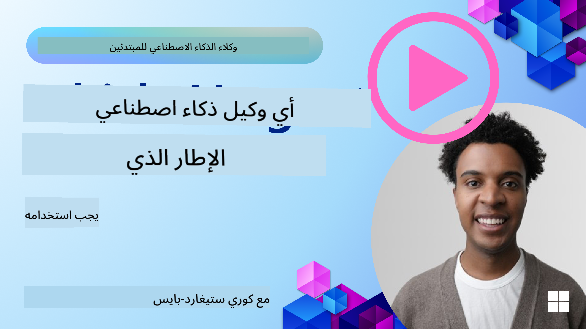

<!--
CO_OP_TRANSLATOR_METADATA:
{
  "original_hash": "a9631d0898fc3c6ecbb3a8a0da7aaba3",
  "translation_date": "2025-08-29T09:17:57+00:00",
  "source_file": "02-explore-agentic-frameworks/README.md",
  "language_code": "ar"
}
-->
[](https://youtu.be/ODwF-EZo_O8?si=1xoy_B9RNQfrYdF7)

> _(اضغط على الصورة أعلاه لمشاهدة فيديو هذا الدرس)_

# استكشاف أطر عمل الوكلاء الذكية

أطر عمل الوكلاء الذكية هي منصات برمجية مصممة لتبسيط إنشاء ونشر وإدارة الوكلاء الذكية. توفر هذه الأطر للمطورين مكونات جاهزة، وتجريدات، وأدوات تسهل تطوير أنظمة الذكاء الاصطناعي المعقدة.

تساعد هذه الأطر المطورين على التركيز على الجوانب الفريدة لتطبيقاتهم من خلال تقديم نهج موحد للتحديات الشائعة في تطوير الوكلاء الذكية. كما تعزز من قابلية التوسع، وسهولة الوصول، والكفاءة في بناء أنظمة الذكاء الاصطناعي.

## المقدمة

سيغطي هذا الدرس:

- ما هي أطر عمل الوكلاء الذكية وما الذي تمكّن المطورين من تحقيقه؟
- كيف يمكن للفرق استخدام هذه الأطر للنمذجة السريعة، والتكرار، وتحسين قدرات الوكلاء؟
- ما هي الفروقات بين الأطر والأدوات التي أنشأتها Microsoft؟
- هل يمكنني دمج أدوات نظام Azure البيئي الحالية مباشرة، أم أحتاج إلى حلول مستقلة؟
- ما هي خدمة Azure AI Agents وكيف يمكن أن تساعدني؟

## أهداف التعلم

تهدف هذه الدرس إلى مساعدتك على فهم:

- دور أطر عمل الوكلاء الذكية في تطوير الذكاء الاصطناعي.
- كيفية الاستفادة من أطر عمل الوكلاء الذكية لبناء وكلاء ذكية.
- القدرات الرئيسية التي توفرها أطر عمل الوكلاء الذكية.
- الفروقات بين AutoGen، وSemantic Kernel، وخدمة Azure AI Agent.

## ما هي أطر عمل الوكلاء الذكية وما الذي تمكّن المطورين من تحقيقه؟

يمكن أن تساعد الأطر التقليدية للذكاء الاصطناعي في دمج الذكاء الاصطناعي في تطبيقاتك وتحسينها بالطرق التالية:

- **التخصيص**: يمكن للذكاء الاصطناعي تحليل سلوك المستخدم وتفضيلاته لتقديم توصيات ومحتوى وتجارب مخصصة.
مثال: تستخدم خدمات البث مثل Netflix الذكاء الاصطناعي لاقتراح الأفلام والعروض بناءً على سجل المشاهدة، مما يعزز من تفاعل المستخدم ورضاه.
- **الأتمتة والكفاءة**: يمكن للذكاء الاصطناعي أتمتة المهام المتكررة، وتبسيط سير العمل، وتحسين الكفاءة التشغيلية.
مثال: تستخدم تطبيقات خدمة العملاء روبوتات الدردشة المدعومة بالذكاء الاصطناعي للتعامل مع الاستفسارات الشائعة، مما يقلل من أوقات الاستجابة ويتيح للوكلاء البشريين التركيز على القضايا الأكثر تعقيدًا.
- **تحسين تجربة المستخدم**: يمكن للذكاء الاصطناعي تحسين تجربة المستخدم العامة من خلال توفير ميزات ذكية مثل التعرف على الصوت، ومعالجة اللغة الطبيعية، والنص التنبؤي.
مثال: تستخدم المساعدات الافتراضية مثل Siri وGoogle Assistant الذكاء الاصطناعي لفهم الأوامر الصوتية والاستجابة لها، مما يسهل على المستخدمين التفاعل مع أجهزتهم.

### يبدو كل هذا رائعًا، إذن لماذا نحتاج إلى إطار عمل للوكلاء الذكية؟

تمثل أطر عمل الوكلاء الذكية شيئًا أكثر من مجرد أطر عمل للذكاء الاصطناعي. فهي مصممة لتمكين إنشاء وكلاء ذكية يمكنها التفاعل مع المستخدمين، والوكلاء الآخرين، والبيئة لتحقيق أهداف محددة. يمكن لهذه الوكلاء أن تظهر سلوكًا ذاتيًا، وتتخذ قرارات، وتتكيف مع الظروف المتغيرة. دعونا نلقي نظرة على بعض القدرات الرئيسية التي توفرها أطر عمل الوكلاء الذكية:

- **التعاون والتنسيق بين الوكلاء**: تمكين إنشاء وكلاء متعددة يمكنها العمل معًا، والتواصل، والتنسيق لحل المهام المعقدة.
- **أتمتة وإدارة المهام**: توفير آليات لأتمتة سير العمل متعدد الخطوات، وتفويض المهام، وإدارة المهام الديناميكية بين الوكلاء.
- **الفهم السياقي والتكيف**: تجهيز الوكلاء بالقدرة على فهم السياق، والتكيف مع البيئات المتغيرة، واتخاذ القرارات بناءً على المعلومات في الوقت الفعلي.

باختصار، تتيح الوكلاء الذكية القيام بالمزيد، وتأخذ الأتمتة إلى المستوى التالي، وتخلق أنظمة أكثر ذكاءً يمكنها التكيف والتعلم من بيئتها.

## كيفية النمذجة السريعة، والتكرار، وتحسين قدرات الوكلاء؟

هذا مجال سريع التطور، ولكن هناك بعض الأمور المشتركة بين معظم أطر عمل الوكلاء الذكية التي يمكن أن تساعدك على النمذجة السريعة والتكرار، وهي المكونات النمطية، الأدوات التعاونية، والتعلم في الوقت الفعلي. دعونا نتعمق في هذه النقاط:

- **استخدام المكونات النمطية**: توفر حزم تطوير البرمجيات (SDKs) مكونات جاهزة مثل موصلات الذكاء الاصطناعي والذاكرة، واستدعاء الوظائف باستخدام اللغة الطبيعية أو الإضافات البرمجية، وقوالب التوجيه، والمزيد.
- **الاستفادة من الأدوات التعاونية**: تصميم وكلاء بأدوار ومهام محددة، مما يتيح اختبار وتحسين سير العمل التعاوني.
- **التعلم في الوقت الفعلي**: تنفيذ حلقات التغذية الراجعة حيث يتعلم الوكلاء من التفاعلات ويعدلون سلوكهم ديناميكيًا.

### استخدام المكونات النمطية

تقدم حزم مثل Microsoft Semantic Kernel وLangChain مكونات جاهزة مثل موصلات الذكاء الاصطناعي، وقوالب التوجيه، وإدارة الذاكرة.

**كيفية استخدام الفرق لهذه المكونات**: يمكن للفرق تجميع هذه المكونات بسرعة لإنشاء نموذج أولي وظيفي دون الحاجة إلى البدء من الصفر، مما يتيح التجريب والتكرار السريع.

**كيفية عملها في الممارسة العملية**: يمكنك استخدام محلل جاهز لاستخراج المعلومات من إدخال المستخدم، ووحدة ذاكرة لتخزين واسترجاع البيانات، ومنشئ توجيهات للتفاعل مع المستخدمين، وكل ذلك دون الحاجة إلى بناء هذه المكونات من البداية.

**مثال على الكود**. دعونا نلقي نظرة على أمثلة حول كيفية استخدام موصل ذكاء اصطناعي جاهز مع Semantic Kernel Python و.Net الذي يستخدم استدعاء الوظائف التلقائي لجعل النموذج يستجيب لإدخال المستخدم:

``` python
# Semantic Kernel Python Example

import asyncio
from typing import Annotated

from semantic_kernel.connectors.ai import FunctionChoiceBehavior
from semantic_kernel.connectors.ai.open_ai import AzureChatCompletion, AzureChatPromptExecutionSettings
from semantic_kernel.contents import ChatHistory
from semantic_kernel.functions import kernel_function
from semantic_kernel.kernel import Kernel

# Define a ChatHistory object to hold the conversation's context
chat_history = ChatHistory()
chat_history.add_user_message("I'd like to go to New York on January 1, 2025")


# Define a sample plugin that contains the function to book travel
class BookTravelPlugin:
    """A Sample Book Travel Plugin"""

    @kernel_function(name="book_flight", description="Book travel given location and date")
    async def book_flight(
        self, date: Annotated[str, "The date of travel"], location: Annotated[str, "The location to travel to"]
    ) -> str:
        return f"Travel was booked to {location} on {date}"

# Create the Kernel
kernel = Kernel()

# Add the sample plugin to the Kernel object
kernel.add_plugin(BookTravelPlugin(), plugin_name="book_travel")

# Define the Azure OpenAI AI Connector
chat_service = AzureChatCompletion(
    deployment_name="YOUR_DEPLOYMENT_NAME", 
    api_key="YOUR_API_KEY", 
    endpoint="https://<your-resource>.azure.openai.com/",
)

# Define the request settings to configure the model with auto-function calling
request_settings = AzureChatPromptExecutionSettings(function_choice_behavior=FunctionChoiceBehavior.Auto())


async def main():
    # Make the request to the model for the given chat history and request settings
    # The Kernel contains the sample that the model will request to invoke
    response = await chat_service.get_chat_message_content(
        chat_history=chat_history, settings=request_settings, kernel=kernel
    )
    assert response is not None

    """
    Note: In the auto function calling process, the model determines it can invoke the 
    `BookTravelPlugin` using the `book_flight` function, supplying the necessary arguments. 
    
    For example:

    "tool_calls": [
        {
            "id": "call_abc123",
            "type": "function",
            "function": {
                "name": "BookTravelPlugin-book_flight",
                "arguments": "{'location': 'New York', 'date': '2025-01-01'}"
            }
        }
    ]

    Since the location and date arguments are required (as defined by the kernel function), if the 
    model lacks either, it will prompt the user to provide them. For instance:

    User: Book me a flight to New York.
    Model: Sure, I'd love to help you book a flight. Could you please specify the date?
    User: I want to travel on January 1, 2025.
    Model: Your flight to New York on January 1, 2025, has been successfully booked. Safe travels!
    """

    print(f"`{response}`")
    # Example AI Model Response: `Your flight to New York on January 1, 2025, has been successfully booked. Safe travels! ✈️🗽`

    # Add the model's response to our chat history context
    chat_history.add_assistant_message(response.content)


if __name__ == "__main__":
    asyncio.run(main())
```
```csharp
// Semantic Kernel C# example

using Microsoft.SemanticKernel;
using Microsoft.SemanticKernel.ChatCompletion;
using System.ComponentModel;
using Microsoft.SemanticKernel.Connectors.AzureOpenAI;

ChatHistory chatHistory = [];
chatHistory.AddUserMessage("I'd like to go to New York on January 1, 2025");

var kernelBuilder = Kernel.CreateBuilder();
kernelBuilder.AddAzureOpenAIChatCompletion(
    deploymentName: "NAME_OF_YOUR_DEPLOYMENT",
    apiKey: "YOUR_API_KEY",
    endpoint: "YOUR_AZURE_ENDPOINT"
);
kernelBuilder.Plugins.AddFromType<BookTravelPlugin>("BookTravel"); 
var kernel = kernelBuilder.Build();

var settings = new AzureOpenAIPromptExecutionSettings()
{
    FunctionChoiceBehavior = FunctionChoiceBehavior.Auto()
};

var chatCompletion = kernel.GetRequiredService<IChatCompletionService>();

var response = await chatCompletion.GetChatMessageContentAsync(chatHistory, settings, kernel);

/*
Behind the scenes, the model recognizes the tool to call, what arguments it already has (location) and (date)
{

"tool_calls": [
    {
        "id": "call_abc123",
        "type": "function",
        "function": {
            "name": "BookTravelPlugin-book_flight",
            "arguments": "{'location': 'New York', 'date': '2025-01-01'}"
        }
    }
]
*/

Console.WriteLine(response.Content);
chatHistory.AddMessage(response!.Role, response!.Content!);

// Example AI Model Response: Your flight to New York on January 1, 2025, has been successfully booked. Safe travels! ✈️🗽

// Define a plugin that contains the function to book travel
public class BookTravelPlugin
{
    [KernelFunction("book_flight")]
    [Description("Book travel given location and date")]
    public async Task<string> BookFlight(DateTime date, string location)
    {
        return await Task.FromResult( $"Travel was booked to {location} on {date}");
    }
}
```

ما يمكنك رؤيته من هذا المثال هو كيفية الاستفادة من محلل جاهز لاستخراج المعلومات الرئيسية من إدخال المستخدم، مثل الأصل، الوجهة، وتاريخ طلب حجز الرحلة. هذا النهج النمطي يسمح لك بالتركيز على المنطق عالي المستوى.

### الاستفادة من الأدوات التعاونية

تسهل أطر مثل CrewAI، Microsoft AutoGen، وSemantic Kernel إنشاء وكلاء متعددة يمكنها العمل معًا.

**كيفية استخدام الفرق لهذه الأدوات**: يمكن للفرق تصميم وكلاء بأدوار ومهام محددة، مما يتيح اختبار وتحسين سير العمل التعاوني وتحسين كفاءة النظام بشكل عام.

**كيفية عملها في الممارسة العملية**: يمكنك إنشاء فريق من الوكلاء حيث يكون لكل وكيل وظيفة متخصصة، مثل استرجاع البيانات، التحليل، أو اتخاذ القرارات. يمكن لهؤلاء الوكلاء التواصل ومشاركة المعلومات لتحقيق هدف مشترك، مثل الإجابة على استفسار المستخدم أو إكمال مهمة.

**مثال على الكود (AutoGen)**:

```python
# creating agents, then create a round robin schedule where they can work together, in this case in order

# Data Retrieval Agent
# Data Analysis Agent
# Decision Making Agent

agent_retrieve = AssistantAgent(
    name="dataretrieval",
    model_client=model_client,
    tools=[retrieve_tool],
    system_message="Use tools to solve tasks."
)

agent_analyze = AssistantAgent(
    name="dataanalysis",
    model_client=model_client,
    tools=[analyze_tool],
    system_message="Use tools to solve tasks."
)

# conversation ends when user says "APPROVE"
termination = TextMentionTermination("APPROVE")

user_proxy = UserProxyAgent("user_proxy", input_func=input)

team = RoundRobinGroupChat([agent_retrieve, agent_analyze, user_proxy], termination_condition=termination)

stream = team.run_stream(task="Analyze data", max_turns=10)
# Use asyncio.run(...) when running in a script.
await Console(stream)
```

ما تراه في الكود السابق هو كيفية إنشاء مهمة تتضمن وكلاء متعددة تعمل معًا لتحليل البيانات. يقوم كل وكيل بأداء وظيفة محددة، ويتم تنفيذ المهمة من خلال تنسيق الوكلاء لتحقيق النتيجة المرجوة. من خلال إنشاء وكلاء مخصصين بأدوار متخصصة، يمكنك تحسين كفاءة وأداء المهام.

### التعلم في الوقت الفعلي

توفر الأطر المتقدمة قدرات لفهم السياق في الوقت الفعلي والتكيف معه.

**كيفية استخدام الفرق لهذه القدرات**: يمكن للفرق تنفيذ حلقات تغذية راجعة حيث يتعلم الوكلاء من التفاعلات ويعدلون سلوكهم ديناميكيًا، مما يؤدي إلى تحسين مستمر وتطوير القدرات.

**كيفية عملها في الممارسة العملية**: يمكن للوكلاء تحليل ملاحظات المستخدم، وبيانات البيئة، ونتائج المهام لتحديث قاعدة معارفهم، وضبط خوارزميات اتخاذ القرار، وتحسين الأداء بمرور الوقت. تتيح عملية التعلم التكرارية هذه للوكلاء التكيف مع الظروف المتغيرة وتفضيلات المستخدم، مما يعزز من فعالية النظام بشكل عام.

## ما هي الفروقات بين الأطر AutoGen، وSemantic Kernel، وخدمة Azure AI Agent؟

هناك العديد من الطرق لمقارنة هذه الأطر، ولكن دعونا نلقي نظرة على بعض الفروقات الرئيسية من حيث التصميم، القدرات، وحالات الاستخدام المستهدفة:

## AutoGen

AutoGen هو إطار عمل مفتوح المصدر تم تطويره بواسطة مختبر Microsoft Research's AI Frontiers. يركز على التطبيقات الموزعة المدفوعة بالأحداث، مما يتيح استخدام LLMs وSLMs متعددة، وأدوات، وأنماط تصميم متعددة للوكلاء.

AutoGen مبني حول مفهوم الوكلاء، وهم كيانات ذاتية يمكنها إدراك بيئتها، واتخاذ القرارات، واتخاذ الإجراءات لتحقيق أهداف محددة. يتواصل الوكلاء من خلال رسائل غير متزامنة، مما يسمح لهم بالعمل بشكل مستقل ومتوازي، مما يعزز من قابلية التوسع واستجابة النظام.

وفقًا لـ Wikipedia، الممثل هو _الوحدة الأساسية للحوسبة المتزامنة. استجابةً للرسالة التي يتلقاها، يمكن للممثل: اتخاذ قرارات محلية، إنشاء المزيد من الممثلين، إرسال المزيد من الرسائل، وتحديد كيفية الاستجابة للرسالة التالية التي يتلقاها_.

**حالات الاستخدام**: أتمتة إنشاء الأكواد، مهام تحليل البيانات، وبناء وكلاء مخصصة لوظائف التخطيط والبحث.

### بعض المفاهيم الأساسية في AutoGen:

- **الوكلاء**. الوكيل هو كيان برمجي يقوم بـ:
  - **التواصل عبر الرسائل**، سواء كانت متزامنة أو غير متزامنة.
  - **الحفاظ على حالته الخاصة**، التي يمكن تعديلها بواسطة الرسائل الواردة.
  - **تنفيذ الإجراءات** استجابةً للرسائل المستلمة أو التغيرات في حالته. قد تشمل هذه الإجراءات تعديل حالة الوكيل، وإنتاج تأثيرات خارجية مثل تحديث سجلات الرسائل، إرسال رسائل جديدة، تنفيذ الأكواد، أو إجراء استدعاءات API.

  هنا مثال قصير على كود لإنشاء وكيل خاص بك بقدرات دردشة:

    ```python
    from autogen_agentchat.agents import AssistantAgent
    from autogen_agentchat.messages import TextMessage
    from autogen_ext.models.openai import OpenAIChatCompletionClient


    class MyAssistant(RoutedAgent):
        def __init__(self, name: str) -> None:
            super().__init__(name)
            model_client = OpenAIChatCompletionClient(model="gpt-4o")
            self._delegate = AssistantAgent(name, model_client=model_client)
    
        @message_handler
        async def handle_my_message_type(self, message: MyMessageType, ctx: MessageContext) -> None:
            print(f"{self.id.type} received message: {message.content}")
            response = await self._delegate.on_messages(
                [TextMessage(content=message.content, source="user")], ctx.cancellation_token
            )
            print(f"{self.id.type} responded: {response.chat_message.content}")
    ```

    في الكود السابق، تم إنشاء `MyAssistant` وهو يرث من `RoutedAgent`. يحتوي على معالج رسائل يطبع محتوى الرسالة ثم يرسل استجابة باستخدام الوكيل `AssistantAgent`. لاحظ بشكل خاص كيف قمنا بتعيين `self._delegate` إلى نسخة من `AssistantAgent`، وهو وكيل جاهز يمكنه التعامل مع إكمالات الدردشة.

    لنخبر AutoGen عن هذا النوع من الوكلاء ونبدأ البرنامج:

    ```python
    
    # main.py
    runtime = SingleThreadedAgentRuntime()
    await MyAgent.register(runtime, "my_agent", lambda: MyAgent())

    runtime.start()  # Start processing messages in the background.
    await runtime.send_message(MyMessageType("Hello, World!"), AgentId("my_agent", "default"))
    ```

    في الكود السابق، يتم تسجيل الوكلاء مع وقت التشغيل ثم يتم إرسال رسالة إلى الوكيل مما ينتج عنه الإخراج التالي:

    ```text
    # Output from the console:
    my_agent received message: Hello, World!
    my_assistant received message: Hello, World!
    my_assistant responded: Hello! How can I assist you today?
    ```

- **الوكلاء المتعددون**. يدعم AutoGen إنشاء وكلاء متعددة يمكنها العمل معًا لتحقيق مهام معقدة. يمكن للوكلاء التواصل، مشاركة المعلومات، وتنسيق أفعالهم لحل المشاكل بكفاءة أكبر. لإنشاء نظام متعدد الوكلاء، يمكنك تعريف أنواع مختلفة من الوكلاء بوظائف وأدوار متخصصة، مثل استرجاع البيانات، التحليل، اتخاذ القرارات، والتفاعل مع المستخدم. دعونا نرى كيف يبدو مثل هذا الإنشاء:

    ```python
    editor_description = "Editor for planning and reviewing the content."

    # Example of declaring an Agent
    editor_agent_type = await EditorAgent.register(
    runtime,
    editor_topic_type,  # Using topic type as the agent type.
    lambda: EditorAgent(
        description=editor_description,
        group_chat_topic_type=group_chat_topic_type,
        model_client=OpenAIChatCompletionClient(
            model="gpt-4o-2024-08-06",
            # api_key="YOUR_API_KEY",
        ),
        ),
    )

    # remaining declarations shortened for brevity

    # Group chat
    group_chat_manager_type = await GroupChatManager.register(
    runtime,
    "group_chat_manager",
    lambda: GroupChatManager(
        participant_topic_types=[writer_topic_type, illustrator_topic_type, editor_topic_type, user_topic_type],
        model_client=OpenAIChatCompletionClient(
            model="gpt-4o-2024-08-06",
            # api_key="YOUR_API_KEY",
        ),
        participant_descriptions=[
            writer_description, 
            illustrator_description, 
            editor_description, 
            user_description
        ],
        ),
    )
    ```

    في الكود السابق، لدينا `GroupChatManager` الذي يتم تسجيله مع وقت التشغيل. هذا المدير مسؤول عن تنسيق التفاعلات بين أنواع مختلفة من الوكلاء، مثل الكتاب، الرسامين، المحررين، والمستخدمين.

- **وقت تشغيل الوكلاء**. يوفر الإطار بيئة وقت تشغيل، تمكن من التواصل بين الوكلاء، إدارة هوياتهم ودورات حياتهم، وفرض حدود الأمان والخصوصية. هذا يعني أنه يمكنك تشغيل وكلائك في بيئة آمنة ومتحكم بها، مما يضمن تفاعلهم بأمان وكفاءة. هناك نوعان من وقت التشغيل يثيران الاهتمام:
  - **وقت تشغيل مستقل**. هذا خيار جيد للتطبيقات ذات العملية الواحدة حيث يتم تنفيذ جميع الوكلاء بنفس لغة البرمجة ويعملون في نفس العملية. إليك توضيح لكيفية عمله:

    *الوكلاء يتواصلون عبر الرسائل من خلال وقت التشغيل، ووقت التشغيل يدير دورة حياة الوكلاء.*

  - **وقت تشغيل موزع للوكلاء**. مناسب للتطبيقات متعددة العمليات حيث يمكن للوكلاء أن يتم تنفيذهم بلغات برمجة مختلفة ويعملون على أجهزة مختلفة. إليك توضيح لكيفية عمله:

## Semantic Kernel + إطار عمل الوكلاء

Semantic Kernel هو حزمة تطوير برمجيات (SDK) جاهزة للمؤسسات لتنسيق الذكاء الاصطناعي. يتكون من موصلات ذكاء اصطناعي وذاكرة، إلى جانب إطار عمل للوكلاء.

### لنبدأ بتغطية بعض المكونات الأساسية:

- **موصلات الذكاء الاصطناعي**: واجهة مع خدمات الذكاء الاصطناعي الخارجية ومصادر البيانات للاستخدام في كل من Python وC#.

  ```python
  # Semantic Kernel Python
  from semantic_kernel.connectors.ai.open_ai import AzureChatCompletion
  from semantic_kernel.kernel import Kernel

  kernel = Kernel()
  kernel.add_service(
    AzureChatCompletion(
        deployment_name="your-deployment-name",
        api_key="your-api-key",
        endpoint="your-endpoint",
    )
  )
  ```  

    ```csharp
    // Semantic Kernel C#
    using Microsoft.SemanticKernel;

    // Create kernel
    var builder = Kernel.CreateBuilder();
    
    // Add a chat completion service:
    builder.Services.AddAzureOpenAIChatCompletion(
        "your-resource-name",
        "your-endpoint",
        "your-resource-key",
        "deployment-model");
    var kernel = builder.Build();
    ```

    هنا مثال بسيط على كيفية إنشاء Kernel وإضافة خدمة إكمال الدردشة. يقوم Semantic Kernel بإنشاء اتصال مع خدمة ذكاء اصطناعي خارجية، في هذه الحالة، Azure OpenAI Chat Completion.

- **الإضافات**: تغلف الوظائف التي يمكن للتطبيق استخدامها. هناك إضافات جاهزة وأخرى مخصصة يمكنك إنشاؤها. مفهوم ذو صلة هو "وظائف التوجيه". بدلاً من تقديم إشارات لغة طبيعية لاستدعاء الوظائف، تقوم ببث وظائف معينة إلى النموذج. بناءً على سياق الدردشة الحالي، قد يختار النموذج استدعاء إحدى هذه الوظائف لإكمال طلب أو استفسار. إليك مثال:

  ```python
  from semantic_kernel.connectors.ai.open_ai.services.azure_chat_completion import AzureChatCompletion


  async def main():
      from semantic_kernel.functions import KernelFunctionFromPrompt
      from semantic_kernel.kernel import Kernel

      kernel = Kernel()
      kernel.add_service(AzureChatCompletion())

      user_input = input("User Input:> ")

      kernel_function = KernelFunctionFromPrompt(
          function_name="SummarizeText",
          prompt="""
          Summarize the provided unstructured text in a sentence that is easy to understand.
          Text to summarize: {{$user_input}}
          """,
      )

      response = await kernel_function.invoke(kernel=kernel, user_input=user_input)
      print(f"Model Response: {response}")

      """
      Sample Console Output:

      User Input:> I like dogs
      Model Response: The text expresses a preference for dogs.
      """


  if __name__ == "__main__":
    import asyncio
    asyncio.run(main())
  ```

    ```csharp
    var userInput = Console.ReadLine();

    // Define semantic function inline.
    string skPrompt = @"Summarize the provided unstructured text in a sentence that is easy to understand.
                        Text to summarize: {{$userInput}}";
    
    // create the function from the prompt
    KernelFunction summarizeFunc = kernel.CreateFunctionFromPrompt(
        promptTemplate: skPrompt,
        functionName: "SummarizeText"
    );

    //then import into the current kernel
    kernel.ImportPluginFromFunctions("SemanticFunctions", [summarizeFunc]);

    ```

    هنا، لديك أولاً قالب توجيه `skPrompt` يترك مساحة للمستخدم لإدخال النص، `$userInput`. ثم تقوم بإنشاء وظيفة Kernel `SummarizeText` ثم استيرادها إلى Kernel باسم الإضافة `SemanticFunctions`. لاحظ اسم الوظيفة الذي يساعد Semantic Kernel على فهم ما تفعله الوظيفة ومتى يجب استدعاؤها.

- **الوظيفة الأصلية**: هناك أيضًا وظائف أصلية يمكن للإطار استدعاؤها مباشرة لتنفيذ المهمة. إليك مثال على وظيفة كهذه تسترجع المحتوى من ملف:

    ```csharp
    public class NativeFunctions {

        [SKFunction, Description("Retrieve content from local file")]
        public async Task<string> RetrieveLocalFile(string fileName, int maxSize = 5000)
        {
            string content = await File.ReadAllTextAsync(fileName);
            if (content.Length <= maxSize) return content;
            return content.Substring(0, maxSize);
        }
    }
    
    //Import native function
    string plugInName = "NativeFunction";
    string functionName = "RetrieveLocalFile";

   //To add the functions to a kernel use the following function
    kernel.ImportPluginFromType<NativeFunctions>();

    ```

- **الذاكرة**: تبسط إدارة السياق لتطبيقات الذكاء الاصطناعي. الفكرة مع الذاكرة هي أن تكون شيئًا يجب أن يعرفه نموذج اللغة الكبير (LLM). يمكنك تخزين هذه المعلومات في مخزن متجهات ينتهي به الأمر إلى أن يكون قاعدة بيانات في الذاكرة أو قاعدة بيانات متجهات أو ما شابه. إليك مثال على سيناريو مبسط جدًا حيث يتم إضافة *حقائق* إلى الذاكرة:

    ```csharp
    var facts = new Dictionary<string,string>();
    facts.Add(
        "Azure Machine Learning; https://learn.microsoft.com/azure/machine-learning/",
        @"Azure Machine Learning is a cloud service for accelerating and
        managing the machine learning project lifecycle. Machine learning professionals,
        data scientists, and engineers can use it in their day-to-day workflows"
    );
    
    facts.Add(
        "Azure SQL Service; https://learn.microsoft.com/azure/azure-sql/",
        @"Azure SQL is a family of managed, secure, and intelligent products
        that use the SQL Server database engine in the Azure cloud."
    );
    
    string memoryCollectionName = "SummarizedAzureDocs";
    
    foreach (var fact in facts) {
        await memoryBuilder.SaveReferenceAsync(
            collection: memoryCollectionName,
            description: fact.Key.Split(";")[1].Trim(),
            text: fact.Value,
            externalId: fact.Key.Split(";")[2].Trim(),
            externalSourceName: "Azure Documentation"
        );
    }
    ```

    يتم بعد ذلك تخزين هذه الحقائق في مجموعة ذاكرة `SummarizedAzureDocs`. هذا مثال مبسط جدًا، ولكن يمكنك أن ترى كيف يمكنك تخزين المعلومات في الذاكرة لاستخدامها من قبل نموذج اللغة الكبير.
إذن هذه هي أساسيات إطار العمل Semantic Kernel، ماذا عن إطار عمل الوكيل؟

## خدمة Azure AI Agent

خدمة Azure AI Agent هي إضافة حديثة، تم تقديمها في مؤتمر Microsoft Ignite 2024. تتيح تطوير ونشر وكلاء الذكاء الاصطناعي باستخدام نماذج أكثر مرونة، مثل الاتصال المباشر بنماذج الذكاء الاصطناعي مفتوحة المصدر مثل Llama 3، Mistral، و Cohere.

توفر خدمة Azure AI Agent آليات أمان قوية للمؤسسات وطرق تخزين البيانات، مما يجعلها مناسبة لتطبيقات المؤسسات.

تعمل بشكل مباشر مع أطر تنسيق متعددة الوكلاء مثل AutoGen وSemantic Kernel.

هذه الخدمة حالياً في العرض العام وتدعم Python وC# لبناء الوكلاء.

باستخدام Semantic Kernel Python، يمكننا إنشاء وكيل Azure AI باستخدام مكون إضافي يحدده المستخدم:

```python
import asyncio
from typing import Annotated

from azure.identity.aio import DefaultAzureCredential

from semantic_kernel.agents import AzureAIAgent, AzureAIAgentSettings, AzureAIAgentThread
from semantic_kernel.contents import ChatMessageContent
from semantic_kernel.contents import AuthorRole
from semantic_kernel.functions import kernel_function


# Define a sample plugin for the sample
class MenuPlugin:
    """A sample Menu Plugin used for the concept sample."""

    @kernel_function(description="Provides a list of specials from the menu.")
    def get_specials(self) -> Annotated[str, "Returns the specials from the menu."]:
        return """
        Special Soup: Clam Chowder
        Special Salad: Cobb Salad
        Special Drink: Chai Tea
        """

    @kernel_function(description="Provides the price of the requested menu item.")
    def get_item_price(
        self, menu_item: Annotated[str, "The name of the menu item."]
    ) -> Annotated[str, "Returns the price of the menu item."]:
        return "$9.99"


async def main() -> None:
    ai_agent_settings = AzureAIAgentSettings.create()

    async with (
        DefaultAzureCredential() as creds,
        AzureAIAgent.create_client(
            credential=creds,
            conn_str=ai_agent_settings.project_connection_string.get_secret_value(),
        ) as client,
    ):
        # Create agent definition
        agent_definition = await client.agents.create_agent(
            model=ai_agent_settings.model_deployment_name,
            name="Host",
            instructions="Answer questions about the menu.",
        )

        # Create the AzureAI Agent using the defined client and agent definition
        agent = AzureAIAgent(
            client=client,
            definition=agent_definition,
            plugins=[MenuPlugin()],
        )

        # Create a thread to hold the conversation
        # If no thread is provided, a new thread will be
        # created and returned with the initial response
        thread: AzureAIAgentThread | None = None

        user_inputs = [
            "Hello",
            "What is the special soup?",
            "How much does that cost?",
            "Thank you",
        ]

        try:
            for user_input in user_inputs:
                print(f"# User: '{user_input}'")
                # Invoke the agent for the specified thread
                response = await agent.get_response(
                    messages=user_input,
                    thread_id=thread,
                )
                print(f"# {response.name}: {response.content}")
                thread = response.thread
        finally:
            await thread.delete() if thread else None
            await client.agents.delete_agent(agent.id)


if __name__ == "__main__":
    asyncio.run(main())
```

### المفاهيم الأساسية

تتضمن خدمة Azure AI Agent المفاهيم الأساسية التالية:

- **الوكيل**. تتكامل خدمة Azure AI Agent مع Azure AI Foundry. داخل AI Foundry، يعمل وكيل الذكاء الاصطناعي كخدمة صغيرة "ذكية" يمكن استخدامها للإجابة على الأسئلة (RAG)، تنفيذ الإجراءات، أو أتمتة سير العمل بالكامل. يتم تحقيق ذلك من خلال الجمع بين قوة نماذج الذكاء الاصطناعي التوليدية والأدوات التي تسمح لها بالوصول إلى مصادر البيانات الحقيقية والتفاعل معها. إليك مثال على وكيل:

    ```python
    agent = project_client.agents.create_agent(
        model="gpt-4o-mini",
        name="my-agent",
        instructions="You are helpful agent",
        tools=code_interpreter.definitions,
        tool_resources=code_interpreter.resources,
    )
    ```

    في هذا المثال، يتم إنشاء وكيل باستخدام النموذج `gpt-4o-mini`، اسم `my-agent`، وتعليمات `You are helpful agent`. يتم تجهيز الوكيل بأدوات وموارد لتنفيذ مهام تفسير الكود.

- **الخيط والرسائل**. الخيط هو مفهوم مهم آخر. يمثل محادثة أو تفاعل بين الوكيل والمستخدم. يمكن استخدام الخيوط لتتبع تقدم المحادثة، تخزين معلومات السياق، وإدارة حالة التفاعل. إليك مثال على خيط:

    ```python
    thread = project_client.agents.create_thread()
    message = project_client.agents.create_message(
        thread_id=thread.id,
        role="user",
        content="Could you please create a bar chart for the operating profit using the following data and provide the file to me? Company A: $1.2 million, Company B: $2.5 million, Company C: $3.0 million, Company D: $1.8 million",
    )
    
    # Ask the agent to perform work on the thread
    run = project_client.agents.create_and_process_run(thread_id=thread.id, agent_id=agent.id)
    
    # Fetch and log all messages to see the agent's response
    messages = project_client.agents.list_messages(thread_id=thread.id)
    print(f"Messages: {messages}")
    ```

    في الكود السابق، يتم إنشاء خيط. بعد ذلك، يتم إرسال رسالة إلى الخيط. من خلال استدعاء `create_and_process_run`، يُطلب من الوكيل تنفيذ العمل على الخيط. أخيراً، يتم جلب الرسائل وتسجيلها لرؤية استجابة الوكيل. تشير الرسائل إلى تقدم المحادثة بين المستخدم والوكيل. من المهم أيضاً فهم أن الرسائل يمكن أن تكون من أنواع مختلفة مثل النص، الصورة، أو الملف، أي أن عمل الوكيل قد نتج عنه على سبيل المثال صورة أو استجابة نصية. كمطور، يمكنك بعد ذلك استخدام هذه المعلومات لمعالجة الاستجابة بشكل أكبر أو تقديمها للمستخدم.

- **التكامل مع أطر الذكاء الاصطناعي الأخرى**. يمكن لخدمة Azure AI Agent التفاعل مع أطر أخرى مثل AutoGen وSemantic Kernel، مما يعني أنه يمكنك بناء جزء من تطبيقك في أحد هذه الأطر واستخدام خدمة الوكيل كمُنسق، أو يمكنك بناء كل شيء في خدمة الوكيل.

**حالات الاستخدام**: تم تصميم خدمة Azure AI Agent لتطبيقات المؤسسات التي تتطلب نشر وكلاء ذكاء اصطناعي آمن وقابل للتوسع ومرن.

## ما الفرق بين هذه الأطر؟

يبدو أن هناك الكثير من التداخل بين هذه الأطر، ولكن هناك بعض الاختلافات الرئيسية من حيث التصميم، القدرات، وحالات الاستخدام المستهدفة:

- **AutoGen**: هو إطار عمل للتجارب يركز على البحث المتقدم في أنظمة الوكلاء المتعددة. إنه المكان الأفضل للتجربة والنمذجة الأولية لأنظمة الوكلاء المتعددة المتطورة.
- **Semantic Kernel**: هو مكتبة وكلاء جاهزة للإنتاج لبناء تطبيقات وكيلية للمؤسسات. يركز على التطبيقات الوكيلية الموزعة المدفوعة بالأحداث، مما يتيح نماذج LLM وSLM متعددة، أدوات، وأنماط تصميم وكيل فردي/متعدد.
- **Azure AI Agent Service**: هو منصة وخدمة نشر في Azure Foundry للوكلاء. يوفر بناء الاتصال بالخدمات المدعومة من Azure مثل Azure OpenAI، Azure AI Search، Bing Search وتنفيذ الكود.

ما زلت غير متأكد أيهما تختار؟

### حالات الاستخدام

دعنا نحاول مساعدتك من خلال استعراض بعض حالات الاستخدام الشائعة:

> س: أنا أجرب وأتعلم وأبني تطبيقات وكلاء إثبات المفهوم، وأريد أن أتمكن من البناء والتجربة بسرعة
>

> ج: سيكون AutoGen خياراً جيداً لهذا السيناريو، حيث يركز على التطبيقات الوكيلية الموزعة المدفوعة بالأحداث ويدعم أنماط تصميم الوكلاء المتعددة المتقدمة.

> س: ما الذي يجعل AutoGen خياراً أفضل من Semantic Kernel وAzure AI Agent Service لهذه الحالة؟
>
> ج: تم تصميم AutoGen خصيصاً للتطبيقات الوكيلية الموزعة المدفوعة بالأحداث، مما يجعله مناسباً لأتمتة مهام توليد الكود وتحليل البيانات. يوفر الأدوات والقدرات اللازمة لبناء أنظمة وكلاء متعددة معقدة بكفاءة.

> س: يبدو أن Azure AI Agent Service يمكن أن يعمل هنا أيضاً، لديه أدوات لتوليد الكود والمزيد؟
>
> ج: نعم، خدمة Azure AI Agent هي خدمة منصة للوكلاء وتضيف قدرات مدمجة لنماذج متعددة، Azure AI Search، Bing Search وAzure Functions. يجعل من السهل بناء وكلائك في بوابة Foundry ونشرهم على نطاق واسع.

> س: ما زلت مرتبكاً فقط أعطني خياراً واحداً
>
> ج: خيار رائع هو بناء تطبيقك في Semantic Kernel أولاً ثم استخدام Azure AI Agent Service لنشر وكيلك. يتيح لك هذا النهج الاحتفاظ بوكلائك بسهولة مع الاستفادة من قوة بناء أنظمة الوكلاء المتعددة في Semantic Kernel. بالإضافة إلى ذلك، يحتوي Semantic Kernel على موصل في AutoGen، مما يجعل من السهل استخدام كلا الإطارين معاً.

دعنا نلخص الاختلافات الرئيسية في جدول:

| الإطار | التركيز | المفاهيم الأساسية | حالات الاستخدام |
| --- | --- | --- | --- |
| AutoGen | التطبيقات الوكيلية الموزعة المدفوعة بالأحداث | وكلاء، شخصيات، وظائف، بيانات | توليد الكود، مهام تحليل البيانات |
| Semantic Kernel | فهم وتوليد محتوى يشبه النص البشري | وكلاء، مكونات معيارية، تعاون | فهم اللغة الطبيعية، توليد المحتوى |
| Azure AI Agent Service | نماذج مرنة، أمان المؤسسات، توليد الكود، استدعاء الأدوات | التعددية، التعاون، تنسيق العمليات | نشر وكلاء ذكاء اصطناعي آمن وقابل للتوسع ومرن |

ما هي حالة الاستخدام المثالية لكل من هذه الأطر؟

## هل يمكنني دمج أدوات النظام البيئي Azure الحالية مباشرة، أم أحتاج إلى حلول مستقلة؟

الإجابة هي نعم، يمكنك دمج أدوات النظام البيئي Azure الحالية مباشرة مع خدمة Azure AI Agent خاصة، لأنها تم بناؤها للعمل بسلاسة مع خدمات Azure الأخرى. يمكنك على سبيل المثال دمج Bing، Azure AI Search، وAzure Functions. هناك أيضاً تكامل عميق مع Azure AI Foundry.

بالنسبة لـ AutoGen وSemantic Kernel، يمكنك أيضاً دمجها مع خدمات Azure، ولكن قد يتطلب منك استدعاء خدمات Azure من الكود الخاص بك. طريقة أخرى للدمج هي استخدام SDKs الخاصة بـ Azure للتفاعل مع خدمات Azure من وكلائك. بالإضافة إلى ذلك، كما ذكرنا، يمكنك استخدام خدمة Azure AI Agent كمُنسق لوكلائك المبنيين في AutoGen أو Semantic Kernel مما يوفر وصولاً سهلاً إلى نظام Azure البيئي.

### هل لديك المزيد من الأسئلة حول أطر عمل وكلاء الذكاء الاصطناعي؟

انضم إلى [Discord الخاص بـ Azure AI Foundry](https://aka.ms/ai-agents/discord) للتواصل مع متعلمين آخرين، حضور ساعات المكتب، والحصول على إجابات لأسئلتك حول وكلاء الذكاء الاصطناعي.

## المراجع

## الدرس السابق

[مقدمة إلى وكلاء الذكاء الاصطناعي وحالات الاستخدام](../01-intro-to-ai-agents/README.md)

## الدرس التالي

[فهم أنماط تصميم الوكلاء](../03-agentic-design-patterns/README.md)

---

**إخلاء المسؤولية**:  
تم ترجمة هذا المستند باستخدام خدمة الترجمة الآلية [Co-op Translator](https://github.com/Azure/co-op-translator). بينما نسعى لتحقيق الدقة، يرجى العلم أن الترجمات الآلية قد تحتوي على أخطاء أو معلومات غير دقيقة. يجب اعتبار المستند الأصلي بلغته الأصلية هو المصدر الموثوق. للحصول على معلومات حساسة أو هامة، يُوصى بالاستعانة بترجمة بشرية احترافية. نحن غير مسؤولين عن أي سوء فهم أو تفسيرات خاطئة ناتجة عن استخدام هذه الترجمة.