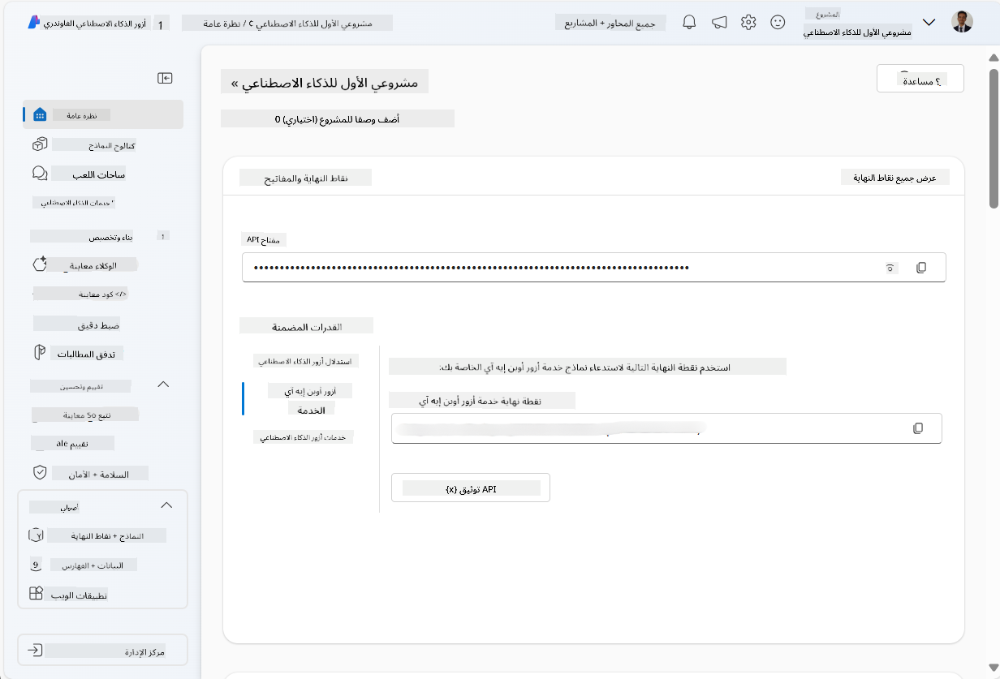
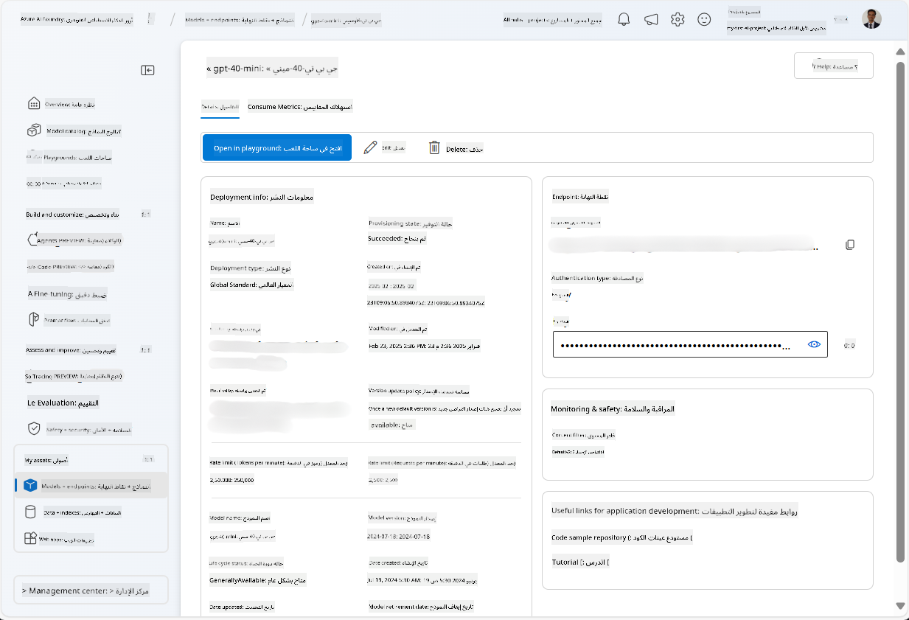
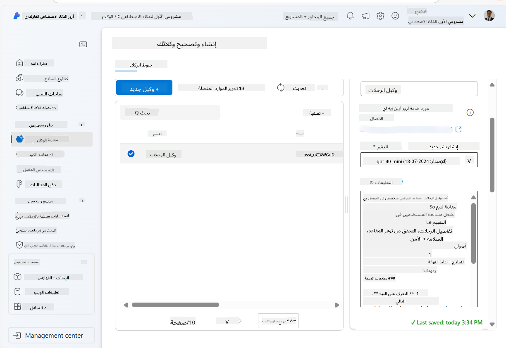
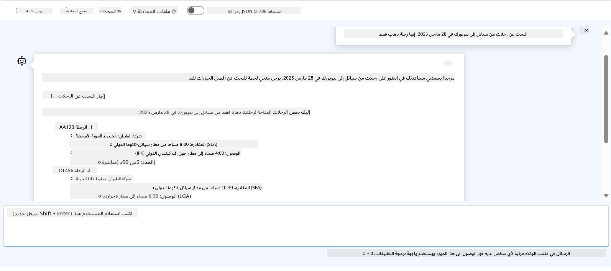

<!--
CO_OP_TRANSLATOR_METADATA:
{
  "original_hash": "7e92870dc0843e13d4dabc620c09d2d9",
  "translation_date": "2025-07-12T08:15:20+00:00",
  "source_file": "02-explore-agentic-frameworks/azure-ai-foundry-agent-creation.md",
  "language_code": "ar"
}
-->
# تطوير خدمة وكيل Azure AI

في هذا التمرين، ستستخدم أدوات خدمة Azure AI Agent في [بوابة Azure AI Foundry](https://ai.azure.com/?WT.mc_id=academic-105485-koreyst) لإنشاء وكيل لحجز الرحلات. سيكون الوكيل قادرًا على التفاعل مع المستخدمين وتقديم معلومات حول الرحلات.

## المتطلبات الأساسية

لإكمال هذا التمرين، تحتاج إلى ما يلي:
1. حساب Azure مع اشتراك نشط. [أنشئ حسابًا مجانًا](https://azure.microsoft.com/free/?WT.mc_id=academic-105485-koreyst).
2. تحتاج إلى أذونات لإنشاء مركز Azure AI Foundry أو أن يكون لديك واحد تم إنشاؤه لك.
    - إذا كان دورك هو Contributor أو Owner، يمكنك اتباع الخطوات في هذا الدليل.

## إنشاء مركز Azure AI Foundry

> **Note:** كان يُعرف Azure AI Foundry سابقًا باسم Azure AI Studio.

1. اتبع هذه الإرشادات من منشور مدونة [Azure AI Foundry](https://learn.microsoft.com/en-us/azure/ai-studio/?WT.mc_id=academic-105485-koreyst) لإنشاء مركز Azure AI Foundry.
2. عند إنشاء مشروعك، أغلق أي نصائح تظهر وراجع صفحة المشروع في بوابة Azure AI Foundry، والتي يجب أن تبدو مشابهة للصورة التالية:

    

## نشر نموذج

1. في اللوحة اليسرى لمشروعك، في قسم **My assets**، اختر صفحة **Models + endpoints**.
2. في صفحة **Models + endpoints**، في علامة تبويب **Model deployments**، من قائمة **+ Deploy model**، اختر **Deploy base model**.
3. ابحث عن نموذج `gpt-4o-mini` في القائمة، ثم حدده وقم بتأكيده.

    > **Note**: تقليل TPM يساعد على تجنب استهلاك الحصة المتاحة في الاشتراك الذي تستخدمه بشكل مفرط.

    

## إنشاء وكيل

الآن بعد أن نشرت نموذجًا، يمكنك إنشاء وكيل. الوكيل هو نموذج ذكاء اصطناعي محادثي يمكن استخدامه للتفاعل مع المستخدمين.

1. في اللوحة اليسرى لمشروعك، في قسم **Build & Customize**، اختر صفحة **Agents**.
2. انقر على **+ Create agent** لإنشاء وكيل جديد. ضمن مربع الحوار **Agent Setup**:
    - أدخل اسمًا للوكيل، مثل `FlightAgent`.
    - تأكد من اختيار نشر نموذج `gpt-4o-mini` الذي أنشأته سابقًا.
    - اضبط **Instructions** حسب التعليمات التي تريد أن يتبعها الوكيل. إليك مثالًا:
    ```
    You are FlightAgent, a virtual assistant specialized in handling flight-related queries. Your role includes assisting users with searching for flights, retrieving flight details, checking seat availability, and providing real-time flight status. Follow the instructions below to ensure clarity and effectiveness in your responses:

    ### Task Instructions:
    1. **Recognizing Intent**:
       - Identify the user's intent based on their request, focusing on one of the following categories:
         - Searching for flights
         - Retrieving flight details using a flight ID
         - Checking seat availability for a specified flight
         - Providing real-time flight status using a flight number
       - If the intent is unclear, politely ask users to clarify or provide more details.
        
    2. **Processing Requests**:
        - Depending on the identified intent, perform the required task:
        - For flight searches: Request details such as origin, destination, departure date, and optionally return date.
        - For flight details: Request a valid flight ID.
        - For seat availability: Request the flight ID and date and validate inputs.
        - For flight status: Request a valid flight number.
        - Perform validations on provided data (e.g., formats of dates, flight numbers, or IDs). If the information is incomplete or invalid, return a friendly request for clarification.

    3. **Generating Responses**:
    - Use a tone that is friendly, concise, and supportive.
    - Provide clear and actionable suggestions based on the output of each task.
    - If no data is found or an error occurs, explain it to the user gently and offer alternative actions (e.g., refine search, try another query).
    
    ```
> [!NOTE]
> للحصول على تعليمات مفصلة، يمكنك الاطلاع على [هذا المستودع](https://github.com/ShivamGoyal03/RoamMind) لمزيد من المعلومات.
    
> بالإضافة إلى ذلك، يمكنك إضافة **قاعدة المعرفة** و**الإجراءات** لتعزيز قدرات الوكيل لتقديم مزيد من المعلومات وأداء مهام تلقائية بناءً على طلبات المستخدم. في هذا التمرين، يمكنك تخطي هذه الخطوات.
    


3. لإنشاء وكيل متعدد الذكاء الاصطناعي جديد، فقط انقر على **New Agent**. سيتم عرض الوكيل الجديد بعد ذلك في صفحة الوكلاء.

## اختبار الوكيل

بعد إنشاء الوكيل، يمكنك اختباره لمعرفة كيفية استجابته لاستفسارات المستخدمين في ملعب بوابة Azure AI Foundry.

1. في أعلى لوحة **Setup** الخاصة بوكيلك، اختر **Try in playground**.
2. في لوحة **Playground**، يمكنك التفاعل مع الوكيل بكتابة الاستفسارات في نافذة الدردشة. على سبيل المثال، يمكنك طلب من الوكيل البحث عن رحلات من سياتل إلى نيويورك في 28 من الشهر.

    > **Note**: قد لا يقدم الوكيل ردودًا دقيقة، حيث لا يتم استخدام بيانات حية في هذا التمرين. الهدف هو اختبار قدرة الوكيل على فهم والرد على استفسارات المستخدم بناءً على التعليمات المقدمة.

    

3. بعد اختبار الوكيل، يمكنك تخصيصه أكثر بإضافة المزيد من النوايا، وبيانات التدريب، والإجراءات لتعزيز قدراته.

## تنظيف الموارد

عند الانتهاء من اختبار الوكيل، يمكنك حذفه لتجنب تكبد تكاليف إضافية.
1. افتح [بوابة Azure](https://portal.azure.com) واطلع على محتويات مجموعة الموارد التي نشرت فيها موارد المركز المستخدمة في هذا التمرين.
2. في شريط الأدوات، اختر **Delete resource group**.
3. أدخل اسم مجموعة الموارد ووافق على رغبتك في حذفها.

## الموارد

- [توثيق Azure AI Foundry](https://learn.microsoft.com/en-us/azure/ai-studio/?WT.mc_id=academic-105485-koreyst)
- [بوابة Azure AI Foundry](https://ai.azure.com/?WT.mc_id=academic-105485-koreyst)
- [البدء مع Azure AI Studio](https://techcommunity.microsoft.com/blog/educatordeveloperblog/getting-started-with-azure-ai-studio/4095602?WT.mc_id=academic-105485-koreyst)
- [أساسيات وكلاء الذكاء الاصطناعي على Azure](https://learn.microsoft.com/en-us/training/modules/ai-agent-fundamentals/?WT.mc_id=academic-105485-koreyst)
- [Azure AI Discord](https://aka.ms/AzureAI/Discord)

**إخلاء المسؤولية**:  
تمت ترجمة هذا المستند باستخدام خدمة الترجمة الآلية [Co-op Translator](https://github.com/Azure/co-op-translator). بينما نسعى لتحقيق الدقة، يرجى العلم أن الترجمات الآلية قد تحتوي على أخطاء أو عدم دقة. يجب اعتبار المستند الأصلي بلغته الأصلية المصدر الموثوق به. للمعلومات الهامة، يُنصح بالاعتماد على الترجمة البشرية المهنية. نحن غير مسؤولين عن أي سوء فهم أو تفسير ناتج عن استخدام هذه الترجمة.