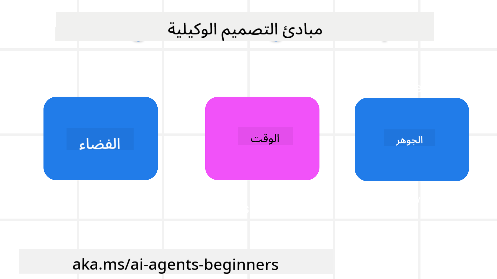

<!--
CO_OP_TRANSLATOR_METADATA:
{
  "original_hash": "4c46e4ff9e349c521e2b0b17f51afa64",
  "translation_date": "2025-08-29T09:20:05+00:00",
  "source_file": "03-agentic-design-patterns/README.md",
  "language_code": "ar"
}
-->

> _(اضغط على الصورة أعلاه لمشاهدة فيديو هذا الدرس)_
# مبادئ تصميم الوكلاء الذكيين

## المقدمة

هناك العديد من الطرق للتفكير في بناء أنظمة الوكلاء الذكيين. نظرًا لأن الغموض يُعتبر ميزة وليس عيبًا في تصميم الذكاء الاصطناعي التوليدي، قد يكون من الصعب على المهندسين تحديد نقطة البداية. لقد قمنا بإنشاء مجموعة من مبادئ تصميم تجربة المستخدم التي تركز على الإنسان لتمكين المطورين من بناء أنظمة وكلاء تركز على العملاء لتلبية احتياجات أعمالهم. هذه المبادئ ليست بنية إلزامية، بل هي نقطة انطلاق للفرق التي تقوم بتعريف وبناء تجارب الوكلاء.

بشكل عام، يجب أن يقوم الوكلاء بـ:

- توسيع وتوسيع قدرات الإنسان (العصف الذهني، حل المشكلات، الأتمتة، إلخ).
- سد الفجوات المعرفية (تزويدي بالمعلومات حول مجالات المعرفة، الترجمة، إلخ).
- تسهيل ودعم التعاون بالطرق التي نفضلها كأفراد للعمل مع الآخرين.
- جعلنا نسخًا أفضل من أنفسنا (مثل مدرب الحياة/منظم المهام، مساعدتنا في تعلم مهارات تنظيم العواطف واليقظة الذهنية، بناء المرونة، إلخ).

## هذا الدرس سيتناول

- ما هي مبادئ تصميم الوكلاء الذكيين
- ما هي بعض الإرشادات التي يجب اتباعها أثناء تنفيذ هذه المبادئ
- ما هي بعض الأمثلة على استخدام هذه المبادئ

## أهداف التعلم

بعد إكمال هذا الدرس، ستكون قادرًا على:

1. شرح ما هي مبادئ تصميم الوكلاء الذكيين
2. شرح الإرشادات لاستخدام مبادئ تصميم الوكلاء الذكيين
3. فهم كيفية بناء وكيل باستخدام مبادئ تصميم الوكلاء الذكيين

## مبادئ تصميم الوكلاء الذكيين

### الوكيل (المكان)

هذا هو البيئة التي يعمل فيها الوكيل. هذه المبادئ توجه كيفية تصميم الوكلاء للتفاعل في العوالم المادية والرقمية.

- **التواصل وليس التهميش** – مساعدة الناس على التواصل مع الآخرين، الأحداث، والمعرفة القابلة للتنفيذ لتمكين التعاون والتواصل.
  - الوكلاء يساعدون في ربط الأحداث، المعرفة، والأشخاص.
  - الوكلاء يقربون الناس من بعضهم البعض. لم يتم تصميمهم لاستبدال أو التقليل من شأن الناس.
- **سهل الوصول ولكنه أحيانًا غير مرئي** – يعمل الوكيل بشكل كبير في الخلفية ولا يتدخل إلا عندما يكون ذلك مناسبًا وملائمًا.
  - الوكيل يمكن الوصول إليه بسهولة من قبل المستخدمين المصرح لهم على أي جهاز أو منصة.
  - الوكيل يدعم المدخلات والمخرجات متعددة الوسائط (الصوت، النص، إلخ).
  - الوكيل يمكنه الانتقال بسلاسة بين المقدمة والخلفية؛ بين الاستباقية والتفاعلية، بناءً على احتياجات المستخدم.
  - الوكيل قد يعمل بشكل غير مرئي، ولكن مسار عملياته في الخلفية وتعاونه مع وكلاء آخرين يكون شفافًا وقابلًا للتحكم من قبل المستخدم.

### الوكيل (الزمن)

هذا هو كيفية عمل الوكيل عبر الزمن. هذه المبادئ توجه كيفية تصميم الوكلاء للتفاعل عبر الماضي، الحاضر، والمستقبل.

- **الماضي**: التفكير في التاريخ الذي يشمل الحالة والسياق.
  - الوكيل يقدم نتائج أكثر صلة بناءً على تحليل بيانات تاريخية غنية تتجاوز الحدث، الأشخاص، أو الحالات فقط.
  - الوكيل ينشئ روابط من الأحداث الماضية ويعكس على الذاكرة للتفاعل مع المواقف الحالية.
- **الحاضر**: التوجيه أكثر من الإشعار.
  - الوكيل يتبنى نهجًا شاملاً للتفاعل مع الناس. عندما يحدث حدث، يتجاوز الوكيل الإشعار الثابت أو الشكلية الثابتة الأخرى. يمكن للوكيل تبسيط التدفقات أو إنشاء إشارات ديناميكية لتوجيه انتباه المستخدم في اللحظة المناسبة.
  - الوكيل يقدم المعلومات بناءً على البيئة السياقية، التغيرات الاجتماعية والثقافية، ومصمم وفقًا لنوايا المستخدم.
  - تفاعل الوكيل يمكن أن يكون تدريجيًا، يتطور/ينمو في التعقيد لتمكين المستخدمين على المدى الطويل.
- **المستقبل**: التكيف والتطور.
  - الوكيل يتكيف مع الأجهزة، المنصات، والوسائط المختلفة.
  - الوكيل يتكيف مع سلوك المستخدم، احتياجات الوصول، وقابل للتخصيص بحرية.
  - الوكيل يتشكل ويتطور من خلال التفاعل المستمر مع المستخدم.

### الوكيل (الجوهر)

هذه هي العناصر الرئيسية في جوهر تصميم الوكيل.

- **احتضان الغموض ولكن بناء الثقة**.
  - مستوى معين من الغموض في الوكيل متوقع. الغموض هو عنصر رئيسي في تصميم الوكلاء.
  - الثقة والشفافية هما طبقتان أساسيتان في تصميم الوكلاء.
  - البشر يتحكمون في تشغيل/إيقاف الوكيل، وحالة الوكيل تكون واضحة دائمًا.

## الإرشادات لتنفيذ هذه المبادئ

عند استخدامك للمبادئ السابقة، استخدم الإرشادات التالية:

1. **الشفافية**: أبلغ المستخدم أن الذكاء الاصطناعي متضمن، كيف يعمل (بما في ذلك الإجراءات السابقة)، وكيفية تقديم الملاحظات وتعديل النظام.
2. **التحكم**: مكن المستخدم من التخصيص، تحديد التفضيلات، والتخصيص، والتحكم في النظام وسماته (بما في ذلك القدرة على النسيان).
3. **الاتساق**: استهدف تجارب متعددة الوسائط متسقة عبر الأجهزة ونقاط النهاية. استخدم عناصر واجهة المستخدم/تجربة المستخدم المألوفة حيثما أمكن (مثل رمز الميكروفون للتفاعل الصوتي) وقلل من العبء المعرفي على العميل قدر الإمكان (مثل استهدف الردود المختصرة، المساعدات البصرية، ومحتوى "تعرف على المزيد").

## كيفية تصميم وكيل سفر باستخدام هذه المبادئ والإرشادات

تخيل أنك تقوم بتصميم وكيل سفر، إليك كيفية التفكير في استخدام مبادئ التصميم والإرشادات:

1. **الشفافية** – أبلغ المستخدم أن وكيل السفر هو وكيل مدعوم بالذكاء الاصطناعي. قدم بعض التعليمات الأساسية حول كيفية البدء (مثل رسالة "مرحبًا"، أمثلة على المطالبات). وثق هذا بوضوح في صفحة المنتج. اعرض قائمة المطالبات التي طلبها المستخدم في الماضي. اجعل من الواضح كيفية تقديم الملاحظات (زر الإعجاب وعدم الإعجاب، زر إرسال الملاحظات، إلخ). وضح بوضوح إذا كان للوكيل قيود على الاستخدام أو الموضوعات.
2. **التحكم** – تأكد من وضوح كيفية تعديل المستخدم للوكيل بعد إنشائه باستخدام أشياء مثل المطالبة النظامية. مكن المستخدم من اختيار مدى تفصيل الوكيل، أسلوب الكتابة الخاص به، وأي تحفظات على ما يجب أن لا يتحدث عنه الوكيل. اسمح للمستخدم بمشاهدة وحذف أي ملفات أو بيانات مرتبطة، مطالبات، ومحادثات سابقة.
3. **الاتساق** – تأكد من أن الرموز الخاصة بمشاركة المطالبات، إضافة ملف أو صورة، ووضع علامة على شخص أو شيء تكون قياسية ومعروفة. استخدم رمز مشبك الورق للإشارة إلى تحميل/مشاركة الملفات مع الوكيل، ورمز الصورة للإشارة إلى تحميل الرسومات.

### هل لديك المزيد من الأسئلة حول أنماط تصميم الوكلاء الذكيين؟

انضم إلى [Azure AI Foundry Discord](https://aka.ms/ai-agents/discord) للتواصل مع متعلمين آخرين، حضور ساعات المكتب، والحصول على إجابات لأسئلتك حول وكلاء الذكاء الاصطناعي.

## موارد إضافية

## الدرس السابق

[استكشاف أطر الوكلاء](../02-explore-agentic-frameworks/README.md)

## الدرس التالي

[نمط تصميم استخدام الأدوات](../04-tool-use/README.md)

---

**إخلاء المسؤولية**:  
تمت ترجمة هذا المستند باستخدام خدمة الترجمة الآلية [Co-op Translator](https://github.com/Azure/co-op-translator). بينما نسعى لتحقيق الدقة، يرجى العلم أن الترجمات الآلية قد تحتوي على أخطاء أو معلومات غير دقيقة. يجب اعتبار المستند الأصلي بلغته الأصلية هو المصدر الموثوق. للحصول على معلومات حساسة أو هامة، يُوصى بالاستعانة بترجمة بشرية احترافية. نحن غير مسؤولين عن أي سوء فهم أو تفسيرات خاطئة تنشأ عن استخدام هذه الترجمة.