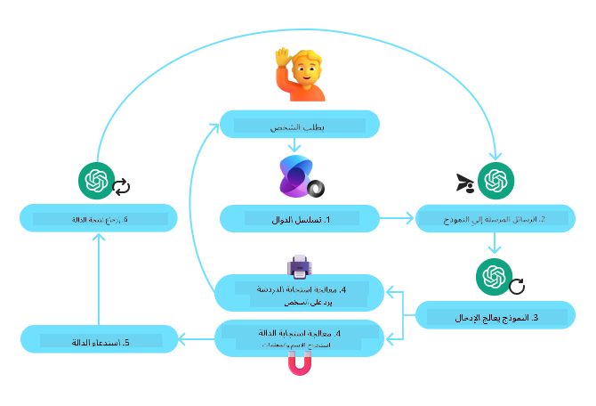

<!--
CO_OP_TRANSLATOR_METADATA:
{
  "original_hash": "88258b03f2893aa2e69eb8fb24baabbc",
  "translation_date": "2025-07-12T09:23:57+00:00",
  "source_file": "04-tool-use/README.md",
  "language_code": "ar"
}
-->
[](https://youtu.be/vieRiPRx-gI?si=cEZ8ApnT6Sus9rhn)

> _(انقر على الصورة أعلاه لمشاهدة فيديو هذا الدرس)_

# نمط تصميم استخدام الأدوات

الأدوات مثيرة للاهتمام لأنها تتيح لوكلاء الذكاء الاصطناعي توسيع نطاق قدراتهم. بدلاً من أن يكون لدى الوكيل مجموعة محدودة من الإجراءات التي يمكنه تنفيذها، بإضافة أداة، يمكن للوكيل الآن أداء مجموعة واسعة من الإجراءات. في هذا الفصل، سنستعرض نمط تصميم استخدام الأدوات، الذي يصف كيف يمكن لوكلاء الذكاء الاصطناعي استخدام أدوات محددة لتحقيق أهدافهم.

## المقدمة

في هذا الدرس، نسعى للإجابة على الأسئلة التالية:

- ما هو نمط تصميم استخدام الأدوات؟
- ما هي حالات الاستخدام التي يمكن تطبيقه عليها؟
- ما هي العناصر/الكتل الأساسية اللازمة لتنفيذ نمط التصميم؟
- ما هي الاعتبارات الخاصة باستخدام نمط تصميم استخدام الأدوات لبناء وكلاء ذكاء اصطناعي موثوقين؟

## أهداف التعلم

بعد إكمال هذا الدرس، ستكون قادرًا على:

- تعريف نمط تصميم استخدام الأدوات وهدفه.
- تحديد حالات الاستخدام التي ينطبق عليها نمط تصميم استخدام الأدوات.
- فهم العناصر الرئيسية اللازمة لتنفيذ نمط التصميم.
- التعرف على الاعتبارات لضمان الموثوقية في وكلاء الذكاء الاصطناعي الذين يستخدمون هذا النمط.

## ما هو نمط تصميم استخدام الأدوات؟

يركز **نمط تصميم استخدام الأدوات** على تمكين نماذج اللغة الكبيرة (LLMs) من التفاعل مع أدوات خارجية لتحقيق أهداف محددة. الأدوات هي أكواد يمكن تنفيذها بواسطة الوكيل لأداء مهام معينة. يمكن أن تكون الأداة دالة بسيطة مثل الآلة الحاسبة، أو استدعاء API لخدمة طرف ثالث مثل البحث عن أسعار الأسهم أو توقعات الطقس. في سياق وكلاء الذكاء الاصطناعي، تُصمم الأدوات ليتم تنفيذها بواسطة الوكلاء استجابةً لـ **استدعاءات الدوال التي يولدها النموذج**.

## ما هي حالات الاستخدام التي يمكن تطبيقه عليها؟

يمكن لوكلاء الذكاء الاصطناعي الاستفادة من الأدوات لإكمال مهام معقدة، استرجاع المعلومات، أو اتخاذ القرارات. يُستخدم نمط تصميم استخدام الأدوات غالبًا في السيناريوهات التي تتطلب تفاعلًا ديناميكيًا مع أنظمة خارجية، مثل قواعد البيانات، خدمات الويب، أو مفسرات الأكواد. هذه القدرة مفيدة لعدة حالات استخدام مختلفة تشمل:

- **استرجاع المعلومات الديناميكي:** يمكن للوكلاء الاستعلام من APIs خارجية أو قواعد بيانات لجلب بيانات محدثة (مثل الاستعلام من قاعدة بيانات SQLite لتحليل البيانات، جلب أسعار الأسهم أو معلومات الطقس).
- **تنفيذ وتفسير الأكواد:** يمكن للوكلاء تنفيذ أكواد أو سكريبتات لحل مسائل رياضية، توليد تقارير، أو إجراء محاكاة.
- **أتمتة سير العمل:** أتمتة المهام المتكررة أو متعددة الخطوات من خلال دمج أدوات مثل جداول المهام، خدمات البريد الإلكتروني، أو خطوط أنابيب البيانات.
- **دعم العملاء:** يمكن للوكلاء التفاعل مع أنظمة إدارة علاقات العملاء، منصات التذاكر، أو قواعد المعرفة لحل استفسارات المستخدمين.
- **توليد وتحرير المحتوى:** يمكن للوكلاء الاستفادة من أدوات مثل مدققات القواعد النحوية، ملخصات النصوص، أو مقيمات سلامة المحتوى للمساعدة في مهام إنشاء المحتوى.

## ما هي العناصر/الكتل الأساسية اللازمة لتنفيذ نمط تصميم استخدام الأدوات؟

تتيح هذه الكتل الأساسية لوكيل الذكاء الاصطناعي أداء مجموعة واسعة من المهام. دعونا نلقي نظرة على العناصر الرئيسية اللازمة لتنفيذ نمط تصميم استخدام الأدوات:

- **مخططات الدوال/الأدوات**: تعريفات مفصلة للأدوات المتاحة، تشمل اسم الدالة، الغرض منها، المعلمات المطلوبة، والمخرجات المتوقعة. تُمكّن هذه المخططات نموذج اللغة الكبير من فهم الأدوات المتاحة وكيفية بناء طلبات صحيحة.

- **منطق تنفيذ الدوال**: يتحكم في كيفية ووقت استدعاء الأدوات بناءً على نية المستخدم وسياق المحادثة. قد يشمل ذلك وحدات التخطيط، آليات التوجيه، أو التدفقات الشرطية التي تحدد استخدام الأدوات بشكل ديناميكي.

- **نظام معالجة الرسائل**: مكونات تدير تدفق المحادثة بين مدخلات المستخدم، ردود نموذج اللغة الكبير، استدعاءات الأدوات، ومخرجات الأدوات.

- **إطار تكامل الأدوات**: البنية التحتية التي تربط الوكيل بالأدوات المختلفة، سواء كانت دوال بسيطة أو خدمات خارجية معقدة.

- **معالجة الأخطاء والتحقق**: آليات للتعامل مع فشل تنفيذ الأدوات، التحقق من المعلمات، وإدارة الردود غير المتوقعة.

- **إدارة الحالة**: تتبع سياق المحادثة، التفاعلات السابقة مع الأدوات، والبيانات المستمرة لضمان الاتساق عبر التفاعلات متعددة الأدوار.

بعد ذلك، دعونا نلقي نظرة أكثر تفصيلًا على استدعاء الدوال/الأدوات.

### استدعاء الدوال/الأدوات

استدعاء الدوال هو الطريقة الأساسية التي نُمكّن بها نماذج اللغة الكبيرة (LLMs) من التفاعل مع الأدوات. سترى غالبًا استخدام مصطلحي "دالة" و"أداة" بالتبادل لأن "الدوال" (كتل من الكود القابل لإعادة الاستخدام) هي "الأدوات" التي يستخدمها الوكلاء لأداء المهام. لكي يتم استدعاء كود دالة معينة، يجب على نموذج اللغة الكبير مقارنة طلب المستخدم مع وصف الدوال. للقيام بذلك، يتم إرسال مخطط يحتوي على أوصاف جميع الدوال المتاحة إلى النموذج. ثم يختار النموذج الدالة الأنسب للمهمة ويُرجع اسمها والمعطيات الخاصة بها. يتم استدعاء الدالة المختارة، ويتم إرسال ردها مرة أخرى إلى النموذج، الذي يستخدم هذه المعلومات للرد على طلب المستخدم.

لكي يتمكن المطورون من تنفيذ استدعاء الدوال للوكلاء، ستحتاج إلى:

1. نموذج LLM يدعم استدعاء الدوال
2. مخطط يحتوي على أوصاف الدوال
3. الكود الخاص بكل دالة موصوفة

لنستخدم مثال الحصول على الوقت الحالي في مدينة لتوضيح ذلك:

1. **تهيئة نموذج LLM يدعم استدعاء الدوال:**

    ليست كل النماذج تدعم استدعاء الدوال، لذا من المهم التأكد من أن النموذج الذي تستخدمه يدعم ذلك. <a href="https://learn.microsoft.com/azure/ai-services/openai/how-to/function-calling" target="_blank">Azure OpenAI</a> يدعم استدعاء الدوال. يمكننا البدء بتهيئة عميل Azure OpenAI.

    ```python
    # Initialize the Azure OpenAI client
    client = AzureOpenAI(
        azure_endpoint = os.getenv("AZURE_OPENAI_ENDPOINT"), 
        api_key=os.getenv("AZURE_OPENAI_API_KEY"),  
        api_version="2024-05-01-preview"
    )
    ```

1. **إنشاء مخطط دالة:**

    بعد ذلك، سنحدد مخطط JSON يحتوي على اسم الدالة، وصف ما تقوم به الدالة، وأسماء ووصف معلمات الدالة.
    ثم نمرر هذا المخطط إلى العميل الذي أنشأناه سابقًا، مع طلب المستخدم للعثور على الوقت في سان فرانسيسكو. من المهم ملاحظة أن **استدعاء الأداة** هو ما يتم إرجاعه، **وليس** الإجابة النهائية على السؤال. كما ذُكر سابقًا، يعيد النموذج اسم الدالة التي اختارها للمهمة، والمعطيات التي سيتم تمريرها إليها.

    ```python
    # Function description for the model to read
    tools = [
        {
            "type": "function",
            "function": {
                "name": "get_current_time",
                "description": "Get the current time in a given location",
                "parameters": {
                    "type": "object",
                    "properties": {
                        "location": {
                            "type": "string",
                            "description": "The city name, e.g. San Francisco",
                        },
                    },
                    "required": ["location"],
                },
            }
        }
    ]
    ```
   
    ```python
  
    # Initial user message
    messages = [{"role": "user", "content": "What's the current time in San Francisco"}] 
  
    # First API call: Ask the model to use the function
      response = client.chat.completions.create(
          model=deployment_name,
          messages=messages,
          tools=tools,
          tool_choice="auto",
      )
  
      # Process the model's response
      response_message = response.choices[0].message
      messages.append(response_message)
  
      print("Model's response:")  

      print(response_message)
  
    ```

    ```bash
    Model's response:
    ChatCompletionMessage(content=None, role='assistant', function_call=None, tool_calls=[ChatCompletionMessageToolCall(id='call_pOsKdUlqvdyttYB67MOj434b', function=Function(arguments='{"location":"San Francisco"}', name='get_current_time'), type='function')])
    ```
  
1. **كود الدالة اللازم لتنفيذ المهمة:**

    بعد أن يختار النموذج الدالة التي يجب تشغيلها، يجب تنفيذ الكود الذي ينفذ المهمة.
    يمكننا تنفيذ الكود للحصول على الوقت الحالي باستخدام Python. سنحتاج أيضًا إلى كتابة كود لاستخراج الاسم والمعطيات من response_message للحصول على النتيجة النهائية.

    ```python
      def get_current_time(location):
        """Get the current time for a given location"""
        print(f"get_current_time called with location: {location}")  
        location_lower = location.lower()
        
        for key, timezone in TIMEZONE_DATA.items():
            if key in location_lower:
                print(f"Timezone found for {key}")  
                current_time = datetime.now(ZoneInfo(timezone)).strftime("%I:%M %p")
                return json.dumps({
                    "location": location,
                    "current_time": current_time
                })
      
        print(f"No timezone data found for {location_lower}")  
        return json.dumps({"location": location, "current_time": "unknown"})
    ```

    ```python
     # Handle function calls
      if response_message.tool_calls:
          for tool_call in response_message.tool_calls:
              if tool_call.function.name == "get_current_time":
     
                  function_args = json.loads(tool_call.function.arguments)
     
                  time_response = get_current_time(
                      location=function_args.get("location")
                  )
     
                  messages.append({
                      "tool_call_id": tool_call.id,
                      "role": "tool",
                      "name": "get_current_time",
                      "content": time_response,
                  })
      else:
          print("No tool calls were made by the model.")  
  
      # Second API call: Get the final response from the model
      final_response = client.chat.completions.create(
          model=deployment_name,
          messages=messages,
      )
  
      return final_response.choices[0].message.content
     ```

    ```bash
      get_current_time called with location: San Francisco
      Timezone found for san francisco
      The current time in San Francisco is 09:24 AM.
     ```

استدعاء الدوال هو جوهر معظم، إن لم يكن كل، تصميم استخدام الأدوات في الوكلاء، ومع ذلك قد يكون تنفيذه من الصفر تحديًا أحيانًا.
كما تعلمنا في [الدرس 2](../../../02-explore-agentic-frameworks) توفر أُطُر العمل الوكيلة كتل بناء جاهزة لتنفيذ استخدام الأدوات.

## أمثلة على استخدام الأدوات مع أُطُر العمل الوكيلة

إليك بعض الأمثلة على كيفية تنفيذ نمط تصميم استخدام الأدوات باستخدام أُطُر عمل وكيلة مختلفة:

### Semantic Kernel

<a href="https://learn.microsoft.com/azure/ai-services/agents/overview" target="_blank">Semantic Kernel</a> هو إطار عمل ذكاء اصطناعي مفتوح المصدر لمطوري .NET وPython وJava الذين يعملون مع نماذج اللغة الكبيرة (LLMs). يبسط عملية استخدام استدعاء الدوال من خلال وصف دوالك ومعلماتها تلقائيًا للنموذج عبر عملية تسمى <a href="https://learn.microsoft.com/semantic-kernel/concepts/ai-services/chat-completion/function-calling/?pivots=programming-language-python#1-serializing-the-functions" target="_blank">التسلسل</a>. كما يدير التواصل ذهابًا وإيابًا بين النموذج وكودك. ميزة أخرى لاستخدام إطار عمل وكيل مثل Semantic Kernel هي أنه يتيح لك الوصول إلى أدوات جاهزة مثل <a href="https://github.com/microsoft/semantic-kernel/blob/main/python/samples/getting_started_with_agents/openai_assistant/step4_assistant_tool_file_search.py" target="_blank">البحث في الملفات</a> و<a href="https://github.com/microsoft/semantic-kernel/blob/main/python/samples/getting_started_with_agents/openai_assistant/step3_assistant_tool_code_interpreter.py" target="_blank">مفسر الأكواد</a>.

يوضح المخطط التالي عملية استدعاء الدوال مع Semantic Kernel:



في Semantic Kernel تُسمى الدوال/الأدوات <a href="https://learn.microsoft.com/semantic-kernel/concepts/plugins/?pivots=programming-language-python" target="_blank">الإضافات (Plugins)</a>. يمكننا تحويل دالة `get_current_time` التي رأيناها سابقًا إلى إضافة عن طريق تحويلها إلى فئة تحتوي على الدالة. يمكننا أيضًا استيراد المزخرف `kernel_function`، الذي يأخذ وصف الدالة. عند إنشاء kernel مع GetCurrentTimePlugin، يقوم kernel تلقائيًا بتسلسل الدالة ومعلماتها، مما ينشئ المخطط لإرساله إلى نموذج اللغة الكبير في العملية.

```python
from semantic_kernel.functions import kernel_function

class GetCurrentTimePlugin:
    async def __init__(self, location):
        self.location = location

    @kernel_function(
        description="Get the current time for a given location"
    )
    def get_current_time(location: str = ""):
        ...

```

```python 
from semantic_kernel import Kernel

# Create the kernel
kernel = Kernel()

# Create the plugin
get_current_time_plugin = GetCurrentTimePlugin(location)

# Add the plugin to the kernel
kernel.add_plugin(get_current_time_plugin)
```
  
### خدمة Azure AI Agent

<a href="https://learn.microsoft.com/azure/ai-services/agents/overview" target="_blank">خدمة Azure AI Agent</a> هي إطار عمل وكيل أحدث مصمم لتمكين المطورين من بناء، نشر، وتوسيع نطاق وكلاء ذكاء اصطناعي عالي الجودة وقابل للتوسعة بأمان دون الحاجة لإدارة موارد الحوسبة والتخزين الأساسية. هي مفيدة بشكل خاص لتطبيقات المؤسسات لأنها خدمة مُدارة بالكامل مع أمان على مستوى المؤسسات.

عند المقارنة مع التطوير باستخدام API الخاص بنموذج اللغة الكبير مباشرة، توفر خدمة Azure AI Agent بعض المزايا، منها:

- استدعاء الأدوات تلقائيًا – لا حاجة لتحليل استدعاء الأداة، تنفيذها، والتعامل مع الرد؛ كل هذا يتم الآن على الخادم
- إدارة البيانات بأمان – بدلاً من إدارة حالة المحادثة بنفسك، يمكنك الاعتماد على الخيوط لتخزين كل المعلومات التي تحتاجها
- أدوات جاهزة للاستخدام – أدوات يمكنك استخدامها للتفاعل مع مصادر بياناتك، مثل Bing، Azure AI Search، وAzure Functions.

يمكن تقسيم الأدوات المتاحة في خدمة Azure AI Agent إلى فئتين:

1. أدوات المعرفة:
    - <a href="https://learn.microsoft.com/azure/ai-services/agents/how-to/tools/bing-grounding?tabs=python&pivots=overview" target="_blank">التأسيس باستخدام Bing Search</a>
    - <a href="https://learn.microsoft.com/azure/ai-services/agents/how-to/tools/file-search?tabs=python&pivots=overview" target="_blank">البحث في الملفات</a>
    - <a href="https://learn.microsoft.com/azure/ai-services/agents/how-to/tools/azure-ai-search?tabs=azurecli%2Cpython&pivots=overview-azure-ai-search" target="_blank">Azure AI Search</a>

2. أدوات الإجراءات:
    - <a href="https://learn.microsoft.com/azure/ai-services/agents/how-to/tools/function-calling?tabs=python&pivots=overview" target="_blank">استدعاء الدوال</a>
    - <a href="https://learn.microsoft.com/azure/ai-services/agents/how-to/tools/code-interpreter?tabs=python&pivots=overview" target="_blank">مفسر الأكواد</a>
    - <a href="https://learn.microsoft.com/azure/ai-services/agents/how-to/tools/openapi-spec?tabs=python&pivots=overview" target="_blank">الأدوات المعرفة بواسطة OpenAI</a>
    - <a href="https://learn.microsoft.com/azure/ai-services/agents/how-to/tools/azure-functions?pivots=overview" target="_blank">وظائف Azure</a>

تتيح لنا خدمة الوكيل استخدام هذه الأدوات معًا كمجموعة أدوات (`toolset`). كما تستخدم `الخيوط` التي تتتبع تاريخ الرسائل من محادثة معينة.

تخيل أنك وكيل مبيعات في شركة تُدعى Contoso. تريد تطوير وكيل محادثة يمكنه الإجابة على الأسئلة المتعلقة ببيانات المبيعات الخاصة بك.

توضح الصورة التالية كيف يمكنك استخدام خدمة Azure AI Agent لتحليل بيانات المبيعات الخاصة بك:


لاستخدام أي من هذه الأدوات مع الخدمة، يمكننا إنشاء عميل وتحديد أداة أو مجموعة أدوات. لتنفيذ ذلك عمليًا، يمكننا استخدام كود Python التالي. سيتمكن نموذج اللغة الكبير من النظر إلى مجموعة الأدوات وتقرير ما إذا كان سيستخدم الدالة التي أنشأها المستخدم، `fetch_sales_data_using_sqlite_query`، أو مفسر الأكواد المدمج بناءً على طلب المستخدم.

```python 
import os
from azure.ai.projects import AIProjectClient
from azure.identity import DefaultAzureCredential
from fecth_sales_data_functions import fetch_sales_data_using_sqlite_query # fetch_sales_data_using_sqlite_query function which can be found in a fetch_sales_data_functions.py file.
from azure.ai.projects.models import ToolSet, FunctionTool, CodeInterpreterTool

project_client = AIProjectClient.from_connection_string(
    credential=DefaultAzureCredential(),
    conn_str=os.environ["PROJECT_CONNECTION_STRING"],
)

# Initialize function calling agent with the fetch_sales_data_using_sqlite_query function and adding it to the toolset
fetch_data_function = FunctionTool(fetch_sales_data_using_sqlite_query)
toolset = ToolSet()
toolset.add(fetch_data_function)

# Initialize Code Interpreter tool and adding it to the toolset. 
code_interpreter = code_interpreter = CodeInterpreterTool()
toolset = ToolSet()
toolset.add(code_interpreter)

agent = project_client.agents.create_agent(
    model="gpt-4o-mini", name="my-agent", instructions="You are helpful agent", 
    toolset=toolset
)
```

## ما هي الاعتبارات الخاصة باستخدام نمط تصميم استخدام الأدوات لبناء وكلاء ذكاء اصطناعي موثوقين؟

من المخاوف الشائعة المتعلقة بـ SQL التي يتم إنشاؤها ديناميكيًا بواسطة نماذج اللغة الكبيرة هي الأمان، خصوصًا خطر حقن SQL أو الإجراءات الخبيثة، مثل حذف أو التلاعب بقاعدة البيانات. بينما هذه المخاوف صحيحة، يمكن التخفيف منها بفعالية من خلال تكوين أذونات الوصول إلى قاعدة البيانات بشكل صحيح. بالنسبة لمعظم قواعد البيانات، يتضمن ذلك تكوين قاعدة البيانات كقراءة فقط. بالنسبة لخدمات قواعد البيانات مثل PostgreSQL أو Azure SQL، يجب تعيين التطبيق بدور قراءة فقط (SELECT).

تشغيل التطبيق في بيئة آمنة يعزز الحماية بشكل أكبر. في سيناريوهات المؤسسات، عادةً ما يتم استخراج البيانات وتحويلها من الأنظمة التشغيلية إلى قاعدة بيانات أو مستودع بيانات للقراءة فقط مع مخطط سهل الاستخدام. يضمن هذا النهج أن تكون البيانات آمنة، ومحسنة للأداء وسهولة الوصول، وأن يكون لدى التطبيق وصول مقيد للقراءة فقط.

## موارد إضافية

-
<a href="https://microsoft.github.io/build-your-first-agent-with-azure-ai-agent-service-workshop/" target="_blank">
ورشة عمل خدمة وكلاء Azure AI  
- [ورشة عمل Contoso Creative Writer متعددة الوكلاء](https://github.com/Azure-Samples/contoso-creative-writer/tree/main/docs/workshop)  
- [دليل استدعاء دوال Semantic Kernel](https://learn.microsoft.com/semantic-kernel/concepts/ai-services/chat-completion/function-calling/?pivots=programming-language-python#1-serializing-the-functions)  
- [مفسر الأكواد في Semantic Kernel](https://github.com/microsoft/semantic-kernel/blob/main/python/samples/getting_started_with_agents/openai_assistant/step3_assistant_tool_code_interpreter.py)  
- [أدوات Autogen](https://microsoft.github.io/autogen/dev/user-guide/core-user-guide/components/tools.html)  

## الدرس السابق

[فهم أنماط التصميم الوكيلية](../03-agentic-design-patterns/README.md)  

## الدرس التالي

[Agentic RAG](../05-agentic-rag/README.md)

**إخلاء المسؤولية**:  
تمت ترجمة هذا المستند باستخدام خدمة الترجمة الآلية [Co-op Translator](https://github.com/Azure/co-op-translator). بينما نسعى لتحقيق الدقة، يرجى العلم أن الترجمات الآلية قد تحتوي على أخطاء أو عدم دقة. يجب اعتبار المستند الأصلي بلغته الأصلية المصدر الموثوق به. للمعلومات الهامة، يُنصح بالاعتماد على الترجمة البشرية المهنية. نحن غير مسؤولين عن أي سوء فهم أو تفسير ناتج عن استخدام هذه الترجمة.