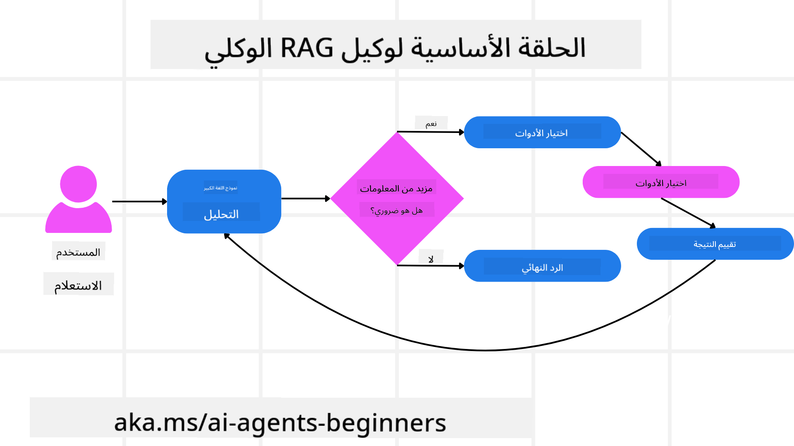
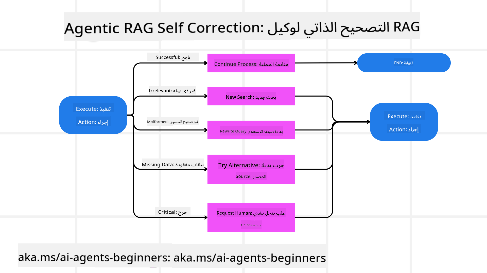
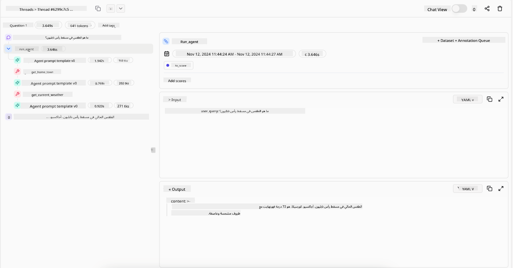
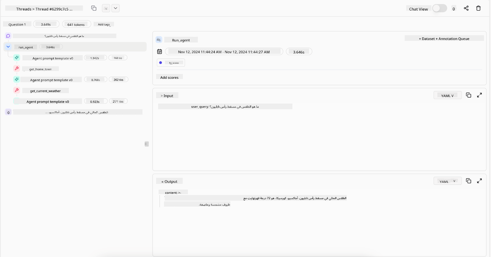

<!--
CO_OP_TRANSLATOR_METADATA:
{
  "original_hash": "7622aa72f9e676e593339f5f694ecd7d",
  "translation_date": "2025-07-12T09:51:05+00:00",
  "source_file": "05-agentic-rag/README.md",
  "language_code": "ar"
}
-->

> _(انقر على الصورة أعلاه لمشاهدة فيديو هذا الدرس)_

# Agentic RAG

يقدم هذا الدرس نظرة شاملة على مفهوم Agentic Retrieval-Augmented Generation (Agentic RAG)، وهو نموذج ناشئ في الذكاء الاصطناعي حيث تقوم نماذج اللغة الكبيرة (LLMs) بالتخطيط الذاتي للخطوات التالية أثناء سحب المعلومات من مصادر خارجية. على عكس أنماط الاسترجاع الثابتة التي تعتمد على الاسترجاع ثم القراءة، يتضمن Agentic RAG استدعاءات متكررة للنموذج اللغوي، تتخللها استدعاءات لأدوات أو وظائف مع مخرجات منظمة. يقوم النظام بتقييم النتائج، وتحسين الاستعلامات، واستدعاء أدوات إضافية عند الحاجة، ويستمر في هذه الدورة حتى يتم التوصل إلى حل مرضٍ.

## المقدمة

سيغطي هذا الدرس:

- **فهم Agentic RAG:** التعرف على النموذج الناشئ في الذكاء الاصطناعي حيث تخطط نماذج اللغة الكبيرة (LLMs) بشكل مستقل لخطواتها التالية أثناء سحب المعلومات من مصادر بيانات خارجية.
- **استيعاب أسلوب الصانع-المدقق التكراري:** فهم دورة الاستدعاءات المتكررة للنموذج اللغوي، مع استدعاءات لأدوات أو وظائف ومخرجات منظمة، مصممة لتحسين الدقة والتعامل مع الاستعلامات غير الصحيحة.
- **استكشاف التطبيقات العملية:** التعرف على السيناريوهات التي يتألق فيها Agentic RAG، مثل البيئات التي تركز على الدقة أولاً، والتفاعلات المعقدة مع قواعد البيانات، وسير العمل الممتد.

## أهداف التعلم

بعد إتمام هذا الدرس، ستتمكن من/تفهم:

- **فهم Agentic RAG:** التعرف على النموذج الناشئ في الذكاء الاصطناعي حيث تخطط نماذج اللغة الكبيرة (LLMs) بشكل مستقل لخطواتها التالية أثناء سحب المعلومات من مصادر بيانات خارجية.
- **أسلوب الصانع-المدقق التكراري:** استيعاب مفهوم دورة الاستدعاءات المتكررة للنموذج اللغوي، مع استدعاءات لأدوات أو وظائف ومخرجات منظمة، مصممة لتحسين الدقة والتعامل مع الاستعلامات غير الصحيحة.
- **امتلاك عملية الاستدلال:** فهم قدرة النظام على امتلاك عملية استدلاله، واتخاذ القرارات حول كيفية التعامل مع المشكلات دون الاعتماد على مسارات محددة مسبقًا.
- **سير العمل:** فهم كيف يقرر النموذج الوكيل بشكل مستقل استرجاع تقارير اتجاهات السوق، وتحديد بيانات المنافسين، وربط مقاييس المبيعات الداخلية، وتوليف النتائج، وتقييم الاستراتيجية.
- **الحلقات التكرارية، تكامل الأدوات، والذاكرة:** التعرف على اعتماد النظام على نمط تفاعل حلقي، مع الحفاظ على الحالة والذاكرة عبر الخطوات لتجنب الحلقات المتكررة واتخاذ قرارات مستنيرة.
- **التعامل مع حالات الفشل والتصحيح الذاتي:** استكشاف آليات التصحيح الذاتي القوية للنظام، بما في ذلك التكرار وإعادة الاستعلام، واستخدام أدوات التشخيص، واللجوء إلى الإشراف البشري.
- **حدود الوكالة:** فهم حدود Agentic RAG، مع التركيز على الاستقلالية الخاصة بالمجال، والاعتماد على البنية التحتية، واحترام الضوابط.
- **حالات الاستخدام العملية والقيمة:** التعرف على السيناريوهات التي يتألق فيها Agentic RAG، مثل البيئات التي تركز على الدقة أولاً، والتفاعلات المعقدة مع قواعد البيانات، وسير العمل الممتد.
- **الحوكمة، الشفافية، والثقة:** التعرف على أهمية الحوكمة والشفافية، بما في ذلك الاستدلال القابل للتفسير، التحكم في التحيز، والإشراف البشري.

## ما هو Agentic RAG؟

Agentic Retrieval-Augmented Generation (Agentic RAG) هو نموذج ناشئ في الذكاء الاصطناعي حيث تقوم نماذج اللغة الكبيرة (LLMs) بالتخطيط الذاتي للخطوات التالية أثناء سحب المعلومات من مصادر خارجية. على عكس أنماط الاسترجاع الثابتة التي تعتمد على الاسترجاع ثم القراءة، يتضمن Agentic RAG استدعاءات متكررة للنموذج اللغوي، تتخللها استدعاءات لأدوات أو وظائف مع مخرجات منظمة. يقوم النظام بتقييم النتائج، وتحسين الاستعلامات، واستدعاء أدوات إضافية عند الحاجة، ويستمر في هذه الدورة حتى يتم التوصل إلى حل مرضٍ. هذا الأسلوب التكراري "صانع-مدقق" يحسن الدقة، ويتعامل مع الاستعلامات غير الصحيحة، ويضمن نتائج عالية الجودة.

يمتلك النظام عملية استدلاله بشكل نشط، يعيد كتابة الاستعلامات الفاشلة، يختار طرق استرجاع مختلفة، ويُدمج أدوات متعددة—مثل البحث المتجهي في Azure AI Search، قواعد بيانات SQL، أو واجهات برمجة التطبيقات المخصصة—قبل إنهاء إجابته. السمة المميزة للنظام الوكلي هي قدرته على امتلاك عملية استدلاله. تعتمد تطبيقات RAG التقليدية على مسارات محددة مسبقًا، لكن النظام الوكلي يحدد بشكل مستقل تسلسل الخطوات بناءً على جودة المعلومات التي يجدها.

## تعريف Agentic Retrieval-Augmented Generation (Agentic RAG)

Agentic Retrieval-Augmented Generation (Agentic RAG) هو نموذج ناشئ في تطوير الذكاء الاصطناعي حيث لا تقتصر نماذج اللغة الكبيرة (LLMs) على سحب المعلومات من مصادر بيانات خارجية فحسب، بل تخطط أيضًا بشكل مستقل لخطواتها التالية. على عكس أنماط الاسترجاع الثابتة أو تسلسلات المطالبات المكتوبة بعناية، يتضمن Agentic RAG دورة من الاستدعاءات المتكررة للنموذج اللغوي، تتخللها استدعاءات لأدوات أو وظائف ومخرجات منظمة. في كل مرحلة، يقوم النظام بتقييم النتائج التي حصل عليها، ويقرر ما إذا كان يجب تحسين استعلاماته، ويستدعي أدوات إضافية عند الحاجة، ويستمر في هذه الدورة حتى يحقق حلاً مرضياً.

هذا الأسلوب التكراري "صانع-مدقق" مصمم لتحسين الدقة، والتعامل مع الاستعلامات غير الصحيحة لقواعد البيانات المنظمة (مثل NL2SQL)، وضمان نتائج متوازنة وعالية الجودة. بدلاً من الاعتماد فقط على سلاسل مطالبات مصممة بعناية، يمتلك النظام عملية استدلاله بشكل نشط. يمكنه إعادة كتابة الاستعلامات الفاشلة، اختيار طرق استرجاع مختلفة، ودمج أدوات متعددة—مثل البحث المتجهي في Azure AI Search، قواعد بيانات SQL، أو واجهات برمجة التطبيقات المخصصة—قبل إنهاء إجابته. هذا يلغي الحاجة إلى أطر تنظيم معقدة للغاية. بدلاً من ذلك، يمكن لدورة بسيطة نسبيًا من "استدعاء LLM → استخدام أداة → استدعاء LLM → ..." أن تنتج مخرجات متطورة وموثوقة.

## امتلاك عملية الاستدلال

السمة المميزة التي تجعل النظام "وكيلًا" هي قدرته على امتلاك عملية استدلاله. غالبًا ما تعتمد تطبيقات RAG التقليدية على تحديد مسار مسبق للنموذج من قبل البشر: سلسلة تفكير تحدد ما يجب استرجاعه ومتى.
لكن عندما يكون النظام وكيلًا حقًا، فإنه يقرر داخليًا كيفية التعامل مع المشكلة. لا يقتصر الأمر على تنفيذ نص برمجي؛ بل يحدد بشكل مستقل تسلسل الخطوات بناءً على جودة المعلومات التي يجدها.
على سبيل المثال، إذا طُلب منه إنشاء استراتيجية إطلاق منتج، فإنه لا يعتمد فقط على مطالبة تحدد كامل سير البحث واتخاذ القرار. بدلاً من ذلك، يقرر النموذج الوكيل بشكل مستقل:

1. استرجاع تقارير اتجاهات السوق الحالية باستخدام Bing Web Grounding
2. تحديد بيانات المنافسين ذات الصلة باستخدام Azure AI Search.
3. ربط مقاييس المبيعات الداخلية التاريخية باستخدام Azure SQL Database.
4. توليف النتائج في استراتيجية متماسكة تُنسق عبر Azure OpenAI Service.
5. تقييم الاستراتيجية للبحث عن ثغرات أو تناقضات، مما يحفز جولة أخرى من الاسترجاع إذا لزم الأمر.
كل هذه الخطوات—تحسين الاستعلامات، اختيار المصادر، التكرار حتى الوصول إلى "رضا" عن الإجابة—يقررها النموذج، وليس مكتوبة مسبقًا من قبل إنسان.

## الحلقات التكرارية، تكامل الأدوات، والذاكرة

يعتمد النظام الوكلي على نمط تفاعل حلقي:

- **الاستدعاء الأولي:** يتم تقديم هدف المستخدم (أي مطالبة المستخدم) إلى النموذج اللغوي.
- **استدعاء الأداة:** إذا حدد النموذج نقصًا في المعلومات أو تعليمات غامضة، يختار أداة أو طريقة استرجاع—مثل استعلام قاعدة بيانات متجهية (مثل البحث الهجين في Azure AI Search عبر بيانات خاصة) أو استعلام SQL منظم—لجمع المزيد من السياق.
- **التقييم والتحسين:** بعد مراجعة البيانات المسترجعة، يقرر النموذج ما إذا كانت المعلومات كافية. إذا لم تكن كذلك، يحسن الاستعلام، يجرب أداة مختلفة، أو يضبط نهجه.
- **التكرار حتى الرضا:** تستمر هذه الدورة حتى يقرر النموذج أن لديه وضوحًا وأدلة كافية لتقديم استجابة نهائية ومدروسة جيدًا.
- **الذاكرة والحالة:** نظرًا لأن النظام يحتفظ بالحالة والذاكرة عبر الخطوات، يمكنه تذكر المحاولات السابقة ونتائجها، مما يتجنب الحلقات المتكررة ويتخذ قرارات أكثر وعيًا أثناء التقدم.

مع مرور الوقت، يخلق هذا إحساسًا بفهم متطور، مما يمكّن النموذج من التنقل في مهام معقدة متعددة الخطوات دون الحاجة إلى تدخل بشري مستمر أو إعادة تشكيل المطالبة.

## التعامل مع حالات الفشل والتصحيح الذاتي

تشمل استقلالية Agentic RAG أيضًا آليات تصحيح ذاتي قوية. عندما يواجه النظام طرقًا مسدودة—مثل استرجاع مستندات غير ذات صلة أو مواجهة استعلامات غير صحيحة—يمكنه:

- **التكرار وإعادة الاستعلام:** بدلاً من تقديم استجابات منخفضة القيمة، يحاول النموذج استراتيجيات بحث جديدة، يعيد كتابة استعلامات قواعد البيانات، أو ينظر إلى مجموعات بيانات بديلة.
- **استخدام أدوات التشخيص:** قد يستدعي النظام وظائف إضافية مصممة لمساعدته في تصحيح خطوات استدلاله أو تأكيد صحة البيانات المسترجعة. ستكون أدوات مثل Azure AI Tracing مهمة لتمكين المراقبة والملاحظة القوية.
- **اللجوء إلى الإشراف البشري:** في السيناريوهات الحساسة أو التي تفشل بشكل متكرر، قد يشير النموذج إلى حالة عدم اليقين ويطلب توجيهًا بشريًا. بمجرد أن يقدم الإنسان ملاحظات تصحيحية، يمكن للنموذج دمج تلك الدروس في المستقبل.

يسمح هذا النهج التكراري والديناميكي للنموذج بالتحسن المستمر، مما يضمن أنه ليس نظامًا يعمل لمرة واحدة فقط، بل يتعلم من أخطائه خلال الجلسة.

## حدود الوكالة

على الرغم من استقلاليته ضمن مهمة معينة، لا يُعتبر Agentic RAG ذكاءً اصطناعيًا عامًا. قدراته "الوكيلية" محصورة بالأدوات، ومصادر البيانات، والسياسات التي يوفرها المطورون البشر. لا يمكنه اختراع أدواته الخاصة أو الخروج عن حدود المجال المحددة. بدلاً من ذلك، يتفوق في تنظيم الموارد المتاحة بشكل ديناميكي.
تشمل الفروقات الرئيسية عن أشكال الذكاء الاصطناعي الأكثر تقدمًا:

1. **الاستقلالية الخاصة بالمجال:** تركز أنظمة Agentic RAG على تحقيق أهداف محددة من قبل المستخدم ضمن مجال معروف، باستخدام استراتيجيات مثل إعادة كتابة الاستعلامات أو اختيار الأدوات لتحسين النتائج.
2. **الاعتماد على البنية التحتية:** تعتمد قدرات النظام على الأدوات والبيانات التي يدمجها المطورون. لا يمكنه تجاوز هذه الحدود دون تدخل بشري.
3. **احترام الضوابط:** تظل الإرشادات الأخلاقية، وقواعد الامتثال، وسياسات العمل مهمة جدًا. حرية الوكيل مقيدة دائمًا بإجراءات السلامة وآليات الإشراف (نأمل ذلك؟).

## حالات الاستخدام العملية والقيمة

يتألق Agentic RAG في السيناريوهات التي تتطلب تحسينًا تكراريًا ودقة:

1. **البيئات التي تركز على الدقة أولاً:** في فحوصات الامتثال، التحليل التنظيمي، أو البحث القانوني، يمكن للنموذج الوكيل التحقق من الحقائق بشكل متكرر، استشارة مصادر متعددة، وإعادة كتابة الاستعلامات حتى ينتج إجابة مدققة تمامًا.
2. **التفاعلات المعقدة مع قواعد البيانات:** عند التعامل مع بيانات منظمة حيث قد تفشل الاستعلامات أو تحتاج إلى تعديل، يمكن للنظام تحسين استعلاماته بشكل مستقل باستخدام Azure SQL أو Microsoft Fabric OneLake، لضمان توافق الاسترجاع النهائي مع نية المستخدم.
3. **سير العمل الممتد:** قد تتطور الجلسات طويلة الأمد مع ظهور معلومات جديدة. يمكن لـ Agentic RAG دمج البيانات الجديدة باستمرار، وتغيير الاستراتيجيات مع تعلّمه المزيد عن مجال المشكلة.

## الحوكمة، الشفافية، والثقة

مع ازدياد استقلالية هذه الأنظمة في استدلالها، تصبح الحوكمة والشفافية أمرًا حيويًا:

- **الاستدلال القابل للتفسير:** يمكن للنموذج تقديم سجل تدقيق للاستعلامات التي أجراها، والمصادر التي استشارها، وخطوات الاستدلال التي اتبعها للوصول إلى استنتاجه. تساعد أدوات مثل Azure AI Content Safety وAzure AI Tracing / GenAIOps في الحفاظ على الشفافية وتقليل المخاطر.
- **التحكم في التحيز والاسترجاع المتوازن:** يمكن للمطورين ضبط استراتيجيات الاسترجاع لضمان النظر في مصادر بيانات متوازنة وتمثيلية، ومراجعة المخرجات بانتظام لاكتشاف التحيز أو الأنماط المنحازة باستخدام نماذج مخصصة لمنظمات علوم البيانات المتقدمة باستخدام Azure Machine Learning.
- **الإشراف البشري والامتثال:** في المهام الحساسة، يظل المراجعة البشرية ضرورية. لا يحل Agentic RAG محل الحكم البشري في القرارات الحساسة—بل يعززه من خلال تقديم خيارات مدققة بشكل أفضل.

وجود أدوات توفر سجلًا واضحًا للإجراءات أمر ضروري. بدونها، قد يكون تصحيح الأخطاء في عملية متعددة الخطوات صعبًا للغاية. انظر المثال التالي من Literal AI (الشركة وراء Chainlit) لتشغيل وكيل:

## الخاتمة

يمثل Agentic RAG تطورًا طبيعيًا في كيفية تعامل أنظمة الذكاء الاصطناعي مع المهام المعقدة والمكثفة بالبيانات. من خلال اعتماد نمط تفاعل حلقي، واختيار الأدوات بشكل مستقل، وتحسين الاستعلامات حتى تحقيق نتيجة عالية الجودة، ينتقل النظام إلى ما هو أبعد من اتباع المطالبات الثابتة ليصبح صانع قرار أكثر تكيفًا ووعيًا بالسياق. وبينما لا يزال مقيدًا بالبنى التحتية والإرشادات الأخلاقية التي يحددها البشر، تتيح هذه القدرات الوكيلة تفاعلات ذكاء اصطناعي أغنى وأكثر ديناميكية، وأكثر فائدة في النهاية لكل من المؤسسات والمستخدمين النهائيين.

## موارد إضافية

- <a href="https://learn.microsoft.com/training/modules/use-own-data-azure-openai" target="_blank">تنفيذ Retrieval Augmented Generation (RAG) مع Azure OpenAI Service: تعلّم كيفية استخدام بياناتك الخاصة مع خدمة Azure OpenAI. يوفر هذا الوحدة التعليمية من Microsoft Learn دليلًا شاملاً حول تنفيذ RAG</a>
</a>
- <a href="https://learn.microsoft.com/azure/ai-studio/concepts/evaluation-approach-gen-ai" target="_blank">تقييم تطبيقات الذكاء الاصطناعي التوليدي باستخدام Azure AI Foundry: تغطي هذه المقالة تقييم ومقارنة النماذج على مجموعات البيانات المتاحة للجمهور، بما في ذلك تطبيقات Agentic AI وهياكل RAG</a>
- <a href="https://weaviate.io/blog/what-is-agentic-rag" target="_blank">ما هو Agentic RAG | Weaviate</a>
- <a href="https://ragaboutit.com/agentic-rag-a-complete-guide-to-agent-based-retrieval-augmented-generation/" target="_blank">Agentic RAG: دليل كامل لتوليد الاسترجاع المعزز المعتمد على الوكلاء – أخبار من generation RAG</a>
- <a href="https://huggingface.co/learn/cookbook/agent_rag" target="_blank">Agentic RAG: عزز أداء RAG الخاص بك بإعادة صياغة الاستعلامات والاستعلام الذاتي! كتاب وصفات الذكاء الاصطناعي مفتوح المصدر من Hugging Face</a>
- <a href="https://youtu.be/aQ4yQXeB1Ss?si=2HUqBzHoeB5tR04U" target="_blank">إضافة طبقات Agentic إلى RAG</a>
- <a href="https://www.youtube.com/watch?v=zeAyuLc_f3Q&t=244s" target="_blank">مستقبل مساعدي المعرفة: جيري ليو</a>
- <a href="https://www.youtube.com/watch?v=AOSjiXP1jmQ" target="_blank">كيفية بناء أنظمة Agentic RAG</a>
- <a href="https://ignite.microsoft.com/sessions/BRK102?source=sessions" target="_blank">استخدام خدمة Azure AI Foundry Agent لتوسيع نطاق وكلاء الذكاء الاصطناعي الخاص بك</a>

### الأوراق الأكاديمية

- <a href="https://arxiv.org/abs/2303.17651" target="_blank">2303.17651 Self-Refine: تحسين تكراري مع تغذية راجعة ذاتية</a>
- <a href="https://arxiv.org/abs/2303.11366" target="_blank">2303.11366 Reflexion: وكلاء لغويون مع تعلم معزز لفظي</a>
- <a href="https://arxiv.org/abs/2305.11738" target="_blank">2305.11738 CRITIC: نماذج اللغة الكبيرة يمكنها تصحيح نفسها من خلال النقد التفاعلي بالأدوات</a>
- <a href="https://arxiv.org/abs/2501.09136" target="_blank">2501.09136 Agentic Retrieval-Augmented Generation: مسح شامل حول Agentic RAG</a>

## الدرس السابق

[نمط تصميم استخدام الأدوات](../04-tool-use/README.md)

## الدرس التالي

[بناء وكلاء ذكاء اصطناعي موثوقين](../06-building-trustworthy-agents/README.md)

**إخلاء مسؤولية**:  
تمت ترجمة هذا المستند باستخدام خدمة الترجمة الآلية [Co-op Translator](https://github.com/Azure/co-op-translator). بينما نسعى لتحقيق الدقة، يرجى العلم أن الترجمات الآلية قد تحتوي على أخطاء أو عدم دقة. يجب اعتبار المستند الأصلي بلغته الأصلية المصدر الموثوق به. للمعلومات الهامة، يُنصح بالاعتماد على الترجمة البشرية المهنية. نحن غير مسؤولين عن أي سوء فهم أو تفسير ناتج عن استخدام هذه الترجمة.