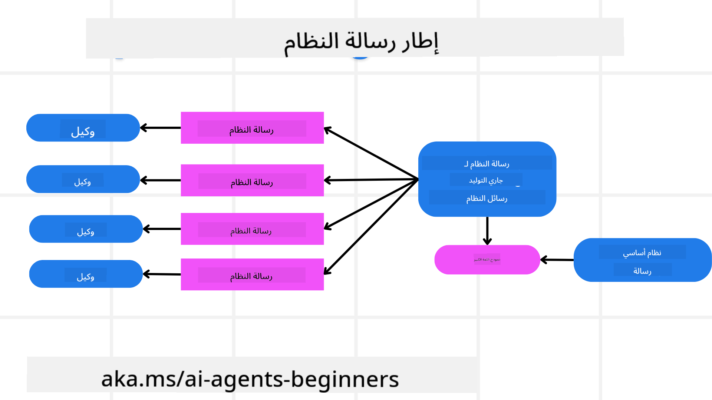
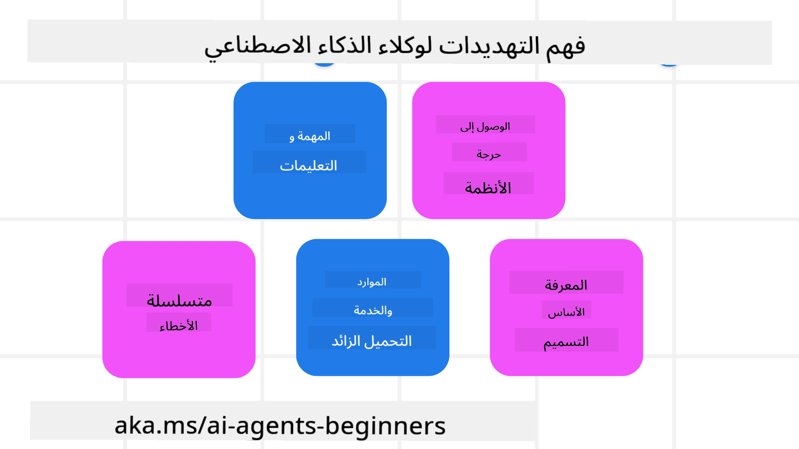
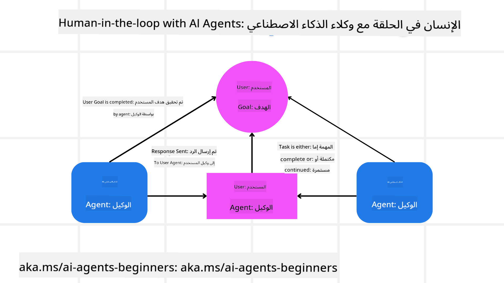

<!--
CO_OP_TRANSLATOR_METADATA:
{
  "original_hash": "f57852cac3a86c4a5ef47f793cc12178",
  "translation_date": "2025-07-12T10:21:55+00:00",
  "source_file": "06-building-trustworthy-agents/README.md",
  "language_code": "ar"
}
-->
[](https://youtu.be/iZKkMEGBCUQ?si=Q-kEbcyHUMPoHp8L)

> _(انقر على الصورة أعلاه لمشاهدة فيديو هذا الدرس)_

# بناء وكلاء ذكاء اصطناعي موثوق بهم

## المقدمة

سيغطي هذا الدرس:

- كيفية بناء ونشر وكلاء ذكاء اصطناعي آمنين وفعّالين  
- اعتبارات أمنية مهمة عند تطوير وكلاء الذكاء الاصطناعي  
- كيفية الحفاظ على خصوصية البيانات والمستخدم عند تطوير وكلاء الذكاء الاصطناعي  

## أهداف التعلم

بعد إتمام هذا الدرس، ستتمكن من:

- التعرف على المخاطر وتقليلها عند إنشاء وكلاء الذكاء الاصطناعي  
- تنفيذ تدابير أمنية لضمان إدارة البيانات والوصول بشكل صحيح  
- إنشاء وكلاء ذكاء اصطناعي يحافظون على خصوصية البيانات ويوفرون تجربة مستخدم عالية الجودة  

## السلامة

لنبدأ أولاً بالنظر في بناء تطبيقات وكيل آمنة. تعني السلامة أن يعمل وكيل الذكاء الاصطناعي كما هو مصمم. كبناة لتطبيقات الوكلاء، لدينا طرق وأدوات لتعظيم السلامة:

### بناء إطار عمل لرسائل النظام

إذا سبق لك بناء تطبيق ذكاء اصطناعي باستخدام نماذج اللغة الكبيرة (LLMs)، فأنت تعرف أهمية تصميم موجه نظام قوي أو رسالة نظام. هذه الموجهات تحدد القواعد العامة والتعليمات والإرشادات لكيفية تفاعل النموذج مع المستخدم والبيانات.

بالنسبة لوكلاء الذكاء الاصطناعي، تكون موجهات النظام أكثر أهمية لأن الوكلاء يحتاجون إلى تعليمات دقيقة للغاية لإكمال المهام التي صممناها لهم.

لإنشاء موجهات نظام قابلة للتوسع، يمكننا استخدام إطار عمل لرسائل النظام لبناء وكيل واحد أو أكثر في تطبيقنا:



#### الخطوة 1: إنشاء رسالة نظام ميتا

سيتم استخدام الموجه الميتا بواسطة نموذج اللغة الكبير لتوليد موجهات النظام للوكلاء الذين ننشئهم. نصممه كقالب حتى نتمكن من إنشاء عدة وكلاء بكفاءة إذا لزم الأمر.

إليك مثال على رسالة نظام ميتا سنعطيها للنموذج:

```plaintext
You are an expert at creating AI agent assistants. 
You will be provided a company name, role, responsibilities and other
information that you will use to provide a system prompt for.
To create the system prompt, be descriptive as possible and provide a structure that a system using an LLM can better understand the role and responsibilities of the AI assistant. 
```

#### الخطوة 2: إنشاء موجه أساسي

الخطوة التالية هي إنشاء موجه أساسي لوصف وكيل الذكاء الاصطناعي. يجب أن تتضمن دور الوكيل، والمهام التي سيكملها، وأي مسؤوليات أخرى للوكيل.

إليك مثالاً:

```plaintext
You are a travel agent for Contoso Travel that is great at booking flights for customers. To help customers you can perform the following tasks: lookup available flights, book flights, ask for preferences in seating and times for flights, cancel any previously booked flights and alert customers on any delays or cancellations of flights.  
```

#### الخطوة 3: تقديم رسالة النظام الأساسية إلى النموذج

الآن يمكننا تحسين رسالة النظام هذه من خلال تقديم رسالة النظام الميتا كرسالة النظام مع رسالة النظام الأساسية الخاصة بنا.

سيؤدي هذا إلى إنتاج رسالة نظام مصممة بشكل أفضل لتوجيه وكلاء الذكاء الاصطناعي لدينا:

```markdown
**Company Name:** Contoso Travel  
**Role:** Travel Agent Assistant

**Objective:**  
You are an AI-powered travel agent assistant for Contoso Travel, specializing in booking flights and providing exceptional customer service. Your main goal is to assist customers in finding, booking, and managing their flights, all while ensuring that their preferences and needs are met efficiently.

**Key Responsibilities:**

1. **Flight Lookup:**
    
    - Assist customers in searching for available flights based on their specified destination, dates, and any other relevant preferences.
    - Provide a list of options, including flight times, airlines, layovers, and pricing.
2. **Flight Booking:**
    
    - Facilitate the booking of flights for customers, ensuring that all details are correctly entered into the system.
    - Confirm bookings and provide customers with their itinerary, including confirmation numbers and any other pertinent information.
3. **Customer Preference Inquiry:**
    
    - Actively ask customers for their preferences regarding seating (e.g., aisle, window, extra legroom) and preferred times for flights (e.g., morning, afternoon, evening).
    - Record these preferences for future reference and tailor suggestions accordingly.
4. **Flight Cancellation:**
    
    - Assist customers in canceling previously booked flights if needed, following company policies and procedures.
    - Notify customers of any necessary refunds or additional steps that may be required for cancellations.
5. **Flight Monitoring:**
    
    - Monitor the status of booked flights and alert customers in real-time about any delays, cancellations, or changes to their flight schedule.
    - Provide updates through preferred communication channels (e.g., email, SMS) as needed.

**Tone and Style:**

- Maintain a friendly, professional, and approachable demeanor in all interactions with customers.
- Ensure that all communication is clear, informative, and tailored to the customer's specific needs and inquiries.

**User Interaction Instructions:**

- Respond to customer queries promptly and accurately.
- Use a conversational style while ensuring professionalism.
- Prioritize customer satisfaction by being attentive, empathetic, and proactive in all assistance provided.

**Additional Notes:**

- Stay updated on any changes to airline policies, travel restrictions, and other relevant information that could impact flight bookings and customer experience.
- Use clear and concise language to explain options and processes, avoiding jargon where possible for better customer understanding.

This AI assistant is designed to streamline the flight booking process for customers of Contoso Travel, ensuring that all their travel needs are met efficiently and effectively.

```

#### الخطوة 4: التكرار والتحسين

تكمن قيمة إطار عمل رسالة النظام هذا في القدرة على توسيع إنشاء رسائل النظام من عدة وكلاء بسهولة بالإضافة إلى تحسين رسائل النظام مع مرور الوقت. من النادر أن تحصل على رسالة نظام تعمل من المحاولة الأولى لحالة الاستخدام الكاملة. القدرة على إجراء تعديلات صغيرة وتحسينات عن طريق تغيير رسالة النظام الأساسية وتشغيلها عبر النظام ستتيح لك مقارنة وتقييم النتائج.

## فهم التهديدات

لبناء وكلاء ذكاء اصطناعي موثوق بهم، من المهم فهم وتقليل المخاطر والتهديدات التي تواجه وكيل الذكاء الاصطناعي الخاص بك. دعونا نلقي نظرة على بعض التهديدات المختلفة لوكلاء الذكاء الاصطناعي وكيف يمكنك التخطيط والاستعداد لها بشكل أفضل.



### المهمة والتعليمات

**الوصف:** يحاول المهاجمون تغيير تعليمات أو أهداف وكيل الذكاء الاصطناعي من خلال التوجيه أو التلاعب بالمدخلات.

**التخفيف:** تنفيذ فحوصات التحقق ومرشحات المدخلات لاكتشاف الموجهات الخطرة المحتملة قبل معالجتها بواسطة وكيل الذكاء الاصطناعي. ونظراً لأن هذه الهجمات تتطلب عادة تفاعلاً متكرراً مع الوكيل، فإن تحديد عدد جولات المحادثة هو طريقة أخرى لمنع هذا النوع من الهجمات.

### الوصول إلى الأنظمة الحرجة

**الوصف:** إذا كان لدى وكيل الذكاء الاصطناعي وصول إلى أنظمة وخدمات تخزن بيانات حساسة، يمكن للمهاجمين اختراق الاتصال بين الوكيل وهذه الخدمات. قد تكون هذه هجمات مباشرة أو محاولات غير مباشرة للحصول على معلومات عن هذه الأنظمة عبر الوكيل.

**التخفيف:** يجب أن يكون لدى وكلاء الذكاء الاصطناعي وصول إلى الأنظمة فقط عند الحاجة لمنع هذا النوع من الهجمات. كما يجب أن يكون الاتصال بين الوكيل والنظام آمناً. تنفيذ المصادقة والتحكم في الوصول هو طريقة أخرى لحماية هذه المعلومات.

### تحميل الموارد والخدمات بشكل مفرط

**الوصف:** يمكن لوكلاء الذكاء الاصطناعي الوصول إلى أدوات وخدمات مختلفة لإكمال المهام. يمكن للمهاجمين استغلال هذه القدرة لمهاجمة هذه الخدمات عن طريق إرسال عدد كبير من الطلبات عبر الوكيل، مما قد يؤدي إلى فشل النظام أو تكاليف مرتفعة.

**التخفيف:** تنفيذ سياسات لتحديد عدد الطلبات التي يمكن لوكيل الذكاء الاصطناعي إرسالها إلى خدمة معينة. تحديد عدد جولات المحادثة والطلبات إلى وكيل الذكاء الاصطناعي هو طريقة أخرى لمنع هذا النوع من الهجمات.

### تسميم قاعدة المعرفة

**الوصف:** هذا النوع من الهجمات لا يستهدف وكيل الذكاء الاصطناعي مباشرة، بل يستهدف قاعدة المعرفة والخدمات الأخرى التي يستخدمها الوكيل. قد يشمل ذلك إفساد البيانات أو المعلومات التي يستخدمها الوكيل لإكمال مهمة، مما يؤدي إلى استجابات متحيزة أو غير مقصودة للمستخدم.

**التخفيف:** إجراء تحقق منتظم من البيانات التي سيستخدمها وكيل الذكاء الاصطناعي في سير العمل الخاص به. التأكد من أن الوصول إلى هذه البيانات آمن ولا يتم تغييره إلا من قبل أشخاص موثوقين لتجنب هذا النوع من الهجمات.

### الأخطاء المتسلسلة

**الوصف:** يصل وكلاء الذكاء الاصطناعي إلى أدوات وخدمات مختلفة لإكمال المهام. يمكن أن تؤدي الأخطاء التي يسببها المهاجمون إلى فشل أنظمة أخرى متصلة بالوكيل، مما يجعل الهجوم أكثر انتشاراً ويصعب تتبعه.

**التخفيف:** إحدى الطرق لتجنب ذلك هي تشغيل وكيل الذكاء الاصطناعي في بيئة محدودة، مثل أداء المهام داخل حاوية Docker، لمنع الهجمات المباشرة على النظام. إنشاء آليات احتياطية ومنطق إعادة المحاولة عند استجابة أنظمة معينة بخطأ هو طريقة أخرى لمنع فشل النظام الأكبر.

## الإنسان في الحلقة

طريقة فعالة أخرى لبناء أنظمة وكلاء ذكاء اصطناعي موثوق بها هي استخدام الإنسان في الحلقة. هذا يخلق تدفقاً حيث يمكن للمستخدمين تقديم ملاحظات للوكلاء أثناء التشغيل. يعمل المستخدمون فعلياً كوكلاء في نظام متعدد الوكلاء من خلال تقديم الموافقة أو إنهاء العملية الجارية.



إليك مقتطف كود يستخدم AutoGen لعرض كيفية تنفيذ هذا المفهوم:

```python

# Create the agents.
model_client = OpenAIChatCompletionClient(model="gpt-4o-mini")
assistant = AssistantAgent("assistant", model_client=model_client)
user_proxy = UserProxyAgent("user_proxy", input_func=input)  # Use input() to get user input from console.

# Create the termination condition which will end the conversation when the user says "APPROVE".
termination = TextMentionTermination("APPROVE")

# Create the team.
team = RoundRobinGroupChat([assistant, user_proxy], termination_condition=termination)

# Run the conversation and stream to the console.
stream = team.run_stream(task="Write a 4-line poem about the ocean.")
# Use asyncio.run(...) when running in a script.
await Console(stream)

```

## الخاتمة

يتطلب بناء وكلاء ذكاء اصطناعي موثوق بهم تصميمًا دقيقًا، وتدابير أمنية قوية، وتكرارًا مستمرًا. من خلال تنفيذ أنظمة موجهات ميتا منظمة، وفهم التهديدات المحتملة، وتطبيق استراتيجيات التخفيف، يمكن للمطورين إنشاء وكلاء ذكاء اصطناعي آمنين وفعّالين. بالإضافة إلى ذلك، يضمن دمج نهج الإنسان في الحلقة بقاء وكلاء الذكاء الاصطناعي متوافقين مع احتياجات المستخدم مع تقليل المخاطر. مع استمرار تطور الذكاء الاصطناعي، سيكون الحفاظ على موقف استباقي تجاه الأمن والخصوصية والاعتبارات الأخلاقية مفتاحًا لتعزيز الثقة والموثوقية في الأنظمة المدفوعة بالذكاء الاصطناعي.

## موارد إضافية

- <a href="https://learn.microsoft.com/azure/ai-studio/responsible-use-of-ai-overview" target="_blank">نظرة عامة على الذكاء الاصطناعي المسؤول</a>  
- <a href="https://learn.microsoft.com/azure/ai-studio/concepts/evaluation-approach-gen-ai" target="_blank">تقييم نماذج الذكاء الاصطناعي التوليدية وتطبيقات الذكاء الاصطناعي</a>  
- <a href="https://learn.microsoft.com/azure/ai-services/openai/concepts/system-message?context=%2Fazure%2Fai-studio%2Fcontext%2Fcontext&tabs=top-techniques" target="_blank">رسائل نظام السلامة</a>  
- <a href="https://blogs.microsoft.com/wp-content/uploads/prod/sites/5/2022/06/Microsoft-RAI-Impact-Assessment-Template.pdf?culture=en-us&country=us" target="_blank">نموذج تقييم المخاطر</a>  

## الدرس السابق

[Agentic RAG](../05-agentic-rag/README.md)

## الدرس التالي

[نمط تصميم التخطيط](../07-planning-design/README.md)

**إخلاء المسؤولية**:  
تمت ترجمة هذا المستند باستخدام خدمة الترجمة الآلية [Co-op Translator](https://github.com/Azure/co-op-translator). بينما نسعى لتحقيق الدقة، يرجى العلم أن الترجمات الآلية قد تحتوي على أخطاء أو عدم دقة. يجب اعتبار المستند الأصلي بلغته الأصلية المصدر الموثوق به. للمعلومات الهامة، يُنصح بالاعتماد على الترجمة البشرية المهنية. نحن غير مسؤولين عن أي سوء فهم أو تفسير ناتج عن استخدام هذه الترجمة.