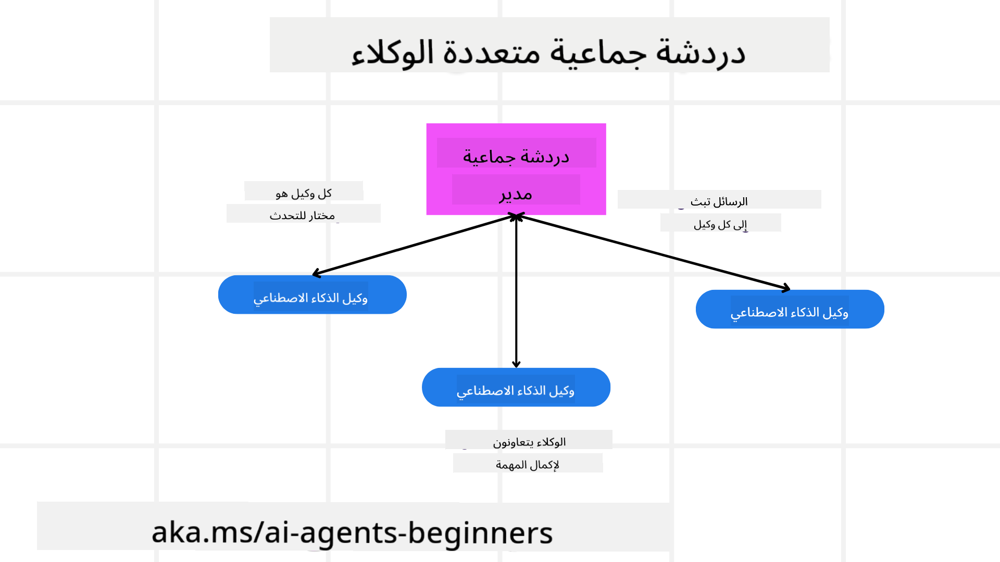
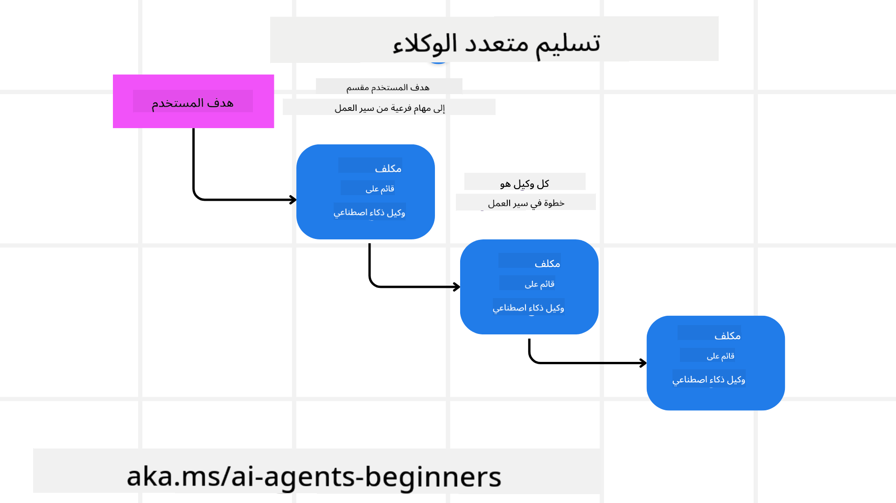
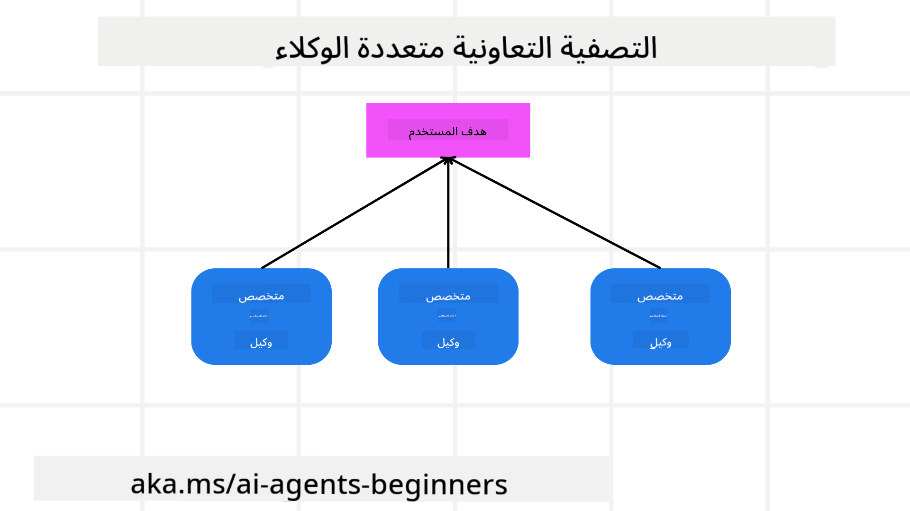

<!--
CO_OP_TRANSLATOR_METADATA:
{
  "original_hash": "c692a8975d7d5b99575a553de1c5e8a7",
  "translation_date": "2025-07-12T10:52:58+00:00",
  "source_file": "08-multi-agent/README.md",
  "language_code": "ar"
}
-->

> _(انقر على الصورة أعلاه لمشاهدة فيديو هذا الدرس)_

# أنماط تصميم متعدد الوكلاء

بمجرد أن تبدأ العمل على مشروع يتضمن عدة وكلاء، ستحتاج إلى النظر في نمط تصميم متعدد الوكلاء. ومع ذلك، قد لا يكون واضحًا على الفور متى يجب الانتقال إلى استخدام عدة وكلاء وما هي المزايا.

## مقدمة

في هذا الدرس، نسعى للإجابة على الأسئلة التالية:

- ما هي السيناريوهات التي يمكن تطبيق نمط متعدد الوكلاء فيها؟
- ما هي مزايا استخدام عدة وكلاء بدلاً من وكيل واحد يقوم بعدة مهام؟
- ما هي اللبنات الأساسية لتطبيق نمط تصميم متعدد الوكلاء؟
- كيف يمكننا الحصول على رؤية لكيفية تفاعل الوكلاء المتعددين مع بعضهم البعض؟

## أهداف التعلم

بعد هذا الدرس، يجب أن تكون قادرًا على:

- تحديد السيناريوهات التي يمكن فيها تطبيق نمط متعدد الوكلاء
- التعرف على مزايا استخدام عدة وكلاء بدلاً من وكيل واحد.
- فهم اللبنات الأساسية لتطبيق نمط تصميم متعدد الوكلاء.

ما هي الصورة الأكبر؟

*الوكلاء المتعددون هم نمط تصميم يسمح لعدة وكلاء بالعمل معًا لتحقيق هدف مشترك*.

يُستخدم هذا النمط على نطاق واسع في مجالات مختلفة، بما في ذلك الروبوتات، الأنظمة الذاتية، والحوسبة الموزعة.

## السيناريوهات التي يمكن فيها تطبيق نمط متعدد الوكلاء

فما هي السيناريوهات التي تعتبر مناسبة لاستخدام عدة وكلاء؟ الجواب هو أن هناك العديد من السيناريوهات التي يكون فيها توظيف عدة وكلاء مفيدًا، خاصة في الحالات التالية:

- **أعباء عمل كبيرة**: يمكن تقسيم أعباء العمل الكبيرة إلى مهام أصغر وتوزيعها على وكلاء مختلفين، مما يسمح بالمعالجة المتوازية وإنجاز أسرع. مثال على ذلك هو مهمة معالجة بيانات ضخمة.
- **مهام معقدة**: مثل أعباء العمل الكبيرة، يمكن تقسيم المهام المعقدة إلى مهام فرعية أصغر وتوزيعها على وكلاء متخصصين في جوانب محددة من المهمة. مثال جيد على ذلك هو المركبات الذاتية القيادة حيث يدير وكلاء مختلفون التنقل، واكتشاف العقبات، والتواصل مع المركبات الأخرى.
- **تخصصات متنوعة**: يمكن أن يمتلك الوكلاء تخصصات مختلفة، مما يسمح لهم بالتعامل مع جوانب مختلفة من المهمة بشكل أكثر فعالية من وكيل واحد. مثال على ذلك في مجال الرعاية الصحية حيث يمكن للوكلاء إدارة التشخيص، خطط العلاج، ومراقبة المرضى.

## مزايا استخدام عدة وكلاء بدلاً من وكيل واحد

يمكن أن يعمل نظام الوكيل الواحد بشكل جيد للمهام البسيطة، لكن للمهام الأكثر تعقيدًا، يمكن لاستخدام عدة وكلاء أن يوفر عدة مزايا:

- **التخصص**: يمكن لكل وكيل أن يكون متخصصًا في مهمة معينة. عدم وجود تخصص في وكيل واحد يعني أن الوكيل قد يحاول القيام بكل شيء لكنه قد يختلط عليه الأمر عند مواجهة مهمة معقدة. قد ينتهي به الأمر بأداء مهمة ليس هو الأنسب لها.
- **القابلية للتوسع**: من الأسهل توسيع النظام بإضافة وكلاء جدد بدلاً من تحميل وكيل واحد بمهام كثيرة.
- **تحمل الأخطاء**: إذا فشل وكيل واحد، يمكن للوكلاء الآخرين الاستمرار في العمل، مما يضمن موثوقية النظام.

لنأخذ مثالًا، لنقم بحجز رحلة لمستخدم. نظام وكيل واحد سيتعين عليه التعامل مع جميع جوانب عملية حجز الرحلة، من إيجاد الرحلات الجوية إلى حجز الفنادق وتأجير السيارات. لتحقيق ذلك بوكيل واحد، يجب أن يمتلك الوكيل أدوات للتعامل مع كل هذه المهام. هذا قد يؤدي إلى نظام معقد ومتكتل يصعب صيانته وتوسيعه. أما نظام متعدد الوكلاء، فيمكن أن يحتوي على وكلاء مختلفين متخصصين في إيجاد الرحلات، حجز الفنادق، وتأجير السيارات. هذا يجعل النظام أكثر مرونة، أسهل في الصيانة، وقابل للتوسع.

قارن هذا بوكالة سفر تديرها عائلة صغيرة مقابل وكالة سفر تعمل كفرنشايز. الوكالة العائلية سيكون لديها وكيل واحد يتعامل مع جميع جوانب حجز الرحلة، بينما الفرنشايز سيكون لديها وكلاء مختلفون يتعاملون مع جوانب مختلفة من عملية الحجز.

## اللبنات الأساسية لتطبيق نمط تصميم متعدد الوكلاء

قبل أن تتمكن من تطبيق نمط تصميم متعدد الوكلاء، تحتاج إلى فهم اللبنات الأساسية التي تشكل هذا النمط.

لنجعل هذا أكثر وضوحًا من خلال النظر مجددًا في مثال حجز رحلة لمستخدم. في هذه الحالة، تشمل اللبنات الأساسية:

- **تواصل الوكلاء**: يحتاج وكلاء إيجاد الرحلات، حجز الفنادق، وتأجير السيارات إلى التواصل وتبادل المعلومات حول تفضيلات وقيود المستخدم. عليك أن تقرر البروتوكولات والأساليب لهذا التواصل. هذا يعني عمليًا أن وكيل إيجاد الرحلات يحتاج إلى التواصل مع وكيل حجز الفنادق لضمان حجز الفندق لنفس تواريخ الرحلة. هذا يعني أن الوكلاء يحتاجون إلى تبادل معلومات حول تواريخ سفر المستخدم، مما يعني أنه يجب أن تقرر *أي الوكلاء يتشاركون المعلومات وكيف يتم تبادلها*.
- **آليات التنسيق**: يحتاج الوكلاء إلى تنسيق أفعالهم لضمان تلبية تفضيلات وقيود المستخدم. قد يكون تفضيل المستخدم هو رغبته في فندق قريب من المطار، في حين أن القيد قد يكون أن سيارات الإيجار متوفرة فقط في المطار. هذا يعني أن وكيل حجز الفنادق يحتاج إلى التنسيق مع وكيل تأجير السيارات لضمان تلبية تفضيلات وقيود المستخدم. هذا يعني أنه يجب أن تقرر *كيف ينسق الوكلاء أفعالهم*.
- **هيكلية الوكيل**: يحتاج الوكلاء إلى هيكل داخلي لاتخاذ القرارات والتعلم من تفاعلاتهم مع المستخدم. هذا يعني أن وكيل إيجاد الرحلات يحتاج إلى هيكل داخلي لاتخاذ قرارات حول الرحلات التي يوصي بها للمستخدم. هذا يعني أنه يجب أن تقرر *كيف يتخذ الوكلاء القرارات ويتعلمون من تفاعلاتهم مع المستخدم*. مثال على كيفية تعلم الوكيل وتحسينه هو أن وكيل إيجاد الرحلات قد يستخدم نموذج تعلم آلي ليقترح رحلات بناءً على تفضيلات المستخدم السابقة.
- **الرؤية في تفاعلات الوكلاء المتعددين**: تحتاج إلى رؤية واضحة لكيفية تفاعل الوكلاء المتعددين مع بعضهم البعض. هذا يعني أنك بحاجة إلى أدوات وتقنيات لتتبع أنشطة وتفاعلات الوكلاء. قد يكون ذلك على شكل أدوات تسجيل ومراقبة، أدوات تصور، ومقاييس أداء.
- **أنماط متعددة الوكلاء**: هناك أنماط مختلفة لتطبيق أنظمة متعددة الوكلاء، مثل الهيكليات المركزية، اللامركزية، والهجينة. عليك أن تختار النمط الذي يناسب حالتك.
- **وجود الإنسان في الحلقة**: في معظم الحالات، سيكون هناك إنسان في الحلقة ويجب أن توجه الوكلاء متى يطلبون تدخل الإنسان. قد يكون ذلك على شكل طلب المستخدم لفندق أو رحلة معينة لم يقترحها الوكلاء، أو طلب تأكيد قبل حجز رحلة أو فندق.

## الرؤية في تفاعلات الوكلاء المتعددين

من المهم أن تكون لديك رؤية واضحة لكيفية تفاعل الوكلاء المتعددين مع بعضهم البعض. هذه الرؤية ضرورية لتصحيح الأخطاء، تحسين الأداء، وضمان فعالية النظام بشكل عام. لتحقيق ذلك، تحتاج إلى أدوات وتقنيات لتتبع أنشطة وتفاعلات الوكلاء. قد يكون ذلك على شكل أدوات تسجيل ومراقبة، أدوات تصور، ومقاييس أداء.

على سبيل المثال، في حالة حجز رحلة لمستخدم، يمكنك أن تمتلك لوحة تحكم تعرض حالة كل وكيل، تفضيلات وقيود المستخدم، والتفاعلات بين الوكلاء. يمكن أن تعرض هذه اللوحة تواريخ سفر المستخدم، الرحلات التي أوصى بها وكيل الرحلات، الفنادق التي أوصى بها وكيل الفنادق، والسيارات التي أوصى بها وكيل تأجير السيارات. هذا يمنحك رؤية واضحة لكيفية تفاعل الوكلاء مع بعضهم البعض وما إذا كانت تفضيلات وقيود المستخدم تُلبى.

لننظر إلى كل من هذه الجوانب بمزيد من التفصيل.

- **أدوات التسجيل والمراقبة**: تريد تسجيل كل إجراء يتخذه وكيل. يمكن أن تخزن سجلات الإجراءات معلومات عن الوكيل الذي قام بالإجراء، نوع الإجراء، وقت الإجراء، ونتيجة الإجراء. يمكن استخدام هذه المعلومات لتصحيح الأخطاء، التحسين، وأكثر.
- **أدوات التصور**: تساعد أدوات التصور على رؤية التفاعلات بين الوكلاء بطريقة أكثر بديهية. على سبيل المثال، يمكن أن يكون لديك رسم بياني يظهر تدفق المعلومات بين الوكلاء. هذا يمكن أن يساعدك في تحديد الاختناقات، عدم الكفاءة، ومشاكل أخرى في النظام.
- **مقاييس الأداء**: تساعد مقاييس الأداء في تتبع فعالية نظام الوكلاء المتعددين. على سبيل المثال، يمكنك تتبع الوقت المستغرق لإكمال مهمة، عدد المهام المكتملة في وحدة زمنية، ودقة التوصيات التي يقدمها الوكلاء. تساعد هذه المعلومات في تحديد مجالات التحسين وتحسين النظام.

## أنماط متعددة الوكلاء

دعونا نغوص في بعض الأنماط العملية التي يمكننا استخدامها لإنشاء تطبيقات متعددة الوكلاء. إليك بعض الأنماط المثيرة التي تستحق النظر:

### الدردشة الجماعية

هذا النمط مفيد عندما تريد إنشاء تطبيق دردشة جماعية حيث يمكن لعدة وكلاء التواصل مع بعضهم البعض. تشمل حالات الاستخدام النموذجية لهذا النمط التعاون بين الفرق، دعم العملاء، والشبكات الاجتماعية.

في هذا النمط، يمثل كل وكيل مستخدمًا في الدردشة الجماعية، ويتم تبادل الرسائل بين الوكلاء باستخدام بروتوكول المراسلة. يمكن للوكلاء إرسال رسائل إلى الدردشة الجماعية، استقبال الرسائل منها، والرد على رسائل الوكلاء الآخرين.

يمكن تنفيذ هذا النمط باستخدام هيكلية مركزية حيث تمر جميع الرسائل عبر خادم مركزي، أو هيكلية لامركزية حيث يتم تبادل الرسائل مباشرة.

### التسليم المتتابع

هذا النمط مفيد عندما تريد إنشاء تطبيق يمكن فيه لوكلاء متعددين تسليم المهام لبعضهم البعض.

تشمل حالات الاستخدام النموذجية لهذا النمط دعم العملاء، إدارة المهام، وأتمتة سير العمل.

في هذا النمط، يمثل كل وكيل مهمة أو خطوة في سير العمل، ويمكن للوكلاء تسليم المهام لوكلاء آخرين بناءً على قواعد محددة مسبقًا.

### التصفية التعاونية

هذا النمط مفيد عندما تريد إنشاء تطبيق يمكن فيه لوكلاء متعددين التعاون لتقديم توصيات للمستخدمين.

سبب رغبتك في تعاون عدة وكلاء هو أن كل وكيل يمكن أن يمتلك خبرة مختلفة ويمكنه المساهمة في عملية التوصية بطرق مختلفة.

لنأخذ مثالًا حيث يريد المستخدم توصية بأفضل سهم للشراء في سوق الأسهم.

- **خبير الصناعة**: يمكن أن يكون أحد الوكلاء خبيرًا في صناعة معينة.
- **التحليل الفني**: وكيل آخر يمكن أن يكون خبيرًا في التحليل الفني.
- **التحليل الأساسي**: ووكيل آخر يمكن أن يكون خبيرًا في التحليل الأساسي. من خلال التعاون، يمكن لهؤلاء الوكلاء تقديم توصية أكثر شمولاً للمستخدم.

## سيناريو: عملية الاسترداد

تخيل سيناريو يحاول فيه العميل استرداد مبلغ لمنتج، قد يكون هناك عدد كبير من الوكلاء المشاركين في هذه العملية، لكن دعنا نقسمهم بين وكلاء مخصصين لهذه العملية ووكلاء عامين يمكن استخدامهم في عمليات أخرى.

**الوكلاء المخصصون لعملية الاسترداد**:

فيما يلي بعض الوكلاء الذين قد يشاركون في عملية الاسترداد:

- **وكيل العميل**: يمثل هذا الوكيل العميل وهو مسؤول عن بدء عملية الاسترداد.
- **وكيل البائع**: يمثل هذا الوكيل البائع وهو مسؤول عن معالجة الاسترداد.
- **وكيل الدفع**: يمثل هذا الوكيل عملية الدفع وهو مسؤول عن إعادة مبلغ الدفع للعميل.
- **وكيل الحلول**: يمثل هذا الوكيل عملية الحلول وهو مسؤول عن حل أي مشكلات تنشأ أثناء عملية الاسترداد.
- **وكيل الامتثال**: يمثل هذا الوكيل عملية الامتثال وهو مسؤول عن ضمان أن عملية الاسترداد تتوافق مع اللوائح والسياسات.

**الوكلاء العامون**:

يمكن استخدام هؤلاء الوكلاء في أجزاء أخرى من عملك.

- **وكيل الشحن**: يمثل هذا الوكيل عملية الشحن وهو مسؤول عن إعادة المنتج إلى البائع. يمكن استخدام هذا الوكيل في كل من عملية الاسترداد والشحن العام للمنتج عبر عملية شراء مثلاً.
- **وكيل التغذية الراجعة**: يمثل هذا الوكيل عملية جمع التغذية الراجعة وهو مسؤول عن جمع ملاحظات العملاء. يمكن جمع التغذية الراجعة في أي وقت وليس فقط أثناء عملية الاسترداد.
- **وكيل التصعيد**: يمثل هذا الوكيل عملية التصعيد وهو مسؤول عن تصعيد المشكلات إلى مستوى دعم أعلى. يمكنك استخدام هذا النوع من الوكلاء لأي عملية تحتاج فيها إلى تصعيد مشكلة.
- **وكيل الإشعارات**: يمثل هذا الوكيل عملية الإشعارات وهو مسؤول عن إرسال الإشعارات للعميل في مراحل مختلفة من عملية الاسترداد.
- **وكيل التحليلات**: يمثل هذا الوكيل عملية التحليلات وهو مسؤول عن تحليل البيانات المتعلقة بعملية الاسترداد.
- **وكيل التدقيق**: يمثل هذا الوكيل عملية التدقيق وهو مسؤول عن تدقيق عملية الاسترداد لضمان تنفيذها بشكل صحيح.
- **وكيل التقارير**: يمثل هذا الوكيل عملية التقارير وهو مسؤول عن إنشاء تقارير حول عملية الاسترداد.
- **وكيل المعرفة**: يمثل هذا الوكيل عملية المعرفة وهو مسؤول عن الحفاظ على قاعدة معرفية من المعلومات المتعلقة بعملية الاسترداد. قد يكون هذا الوكيل ملمًا بكل من الاستردادات وأجزاء أخرى من عملك.
- **وكيل الأمان**: يمثل هذا الوكيل عملية الأمان وهو مسؤول عن ضمان أمان عملية الاسترداد.
- **وكيل الجودة**: يمثل هذا الوكيل عملية الجودة وهو مسؤول عن ضمان جودة عملية الاسترداد.

هناك عدد كبير من الوكلاء المذكورين سابقًا، سواء للعمليات المحددة للاسترداد أو للوكلاء العامين الذين يمكن استخدامهم في أجزاء أخرى من عملك. نأمل أن يمنحك هذا فكرة عن كيفية اتخاذ قرار بشأن الوكلاء الذين ستستخدمهم في نظامك متعدد الوكلاء.

## المهمة
## الدرس السابق

[تصميم التخطيط](../07-planning-design/README.md)

## الدرس التالي

[التفكير فوق المعرفي في وكلاء الذكاء الاصطناعي](../09-metacognition/README.md)

**إخلاء المسؤولية**:  
تمت ترجمة هذا المستند باستخدام خدمة الترجمة الآلية [Co-op Translator](https://github.com/Azure/co-op-translator). بينما نسعى لتحقيق الدقة، يرجى العلم أن الترجمات الآلية قد تحتوي على أخطاء أو عدم دقة. يجب اعتبار المستند الأصلي بلغته الأصلية المصدر الموثوق به. للمعلومات الهامة، يُنصح بالاعتماد على الترجمة البشرية المهنية. نحن غير مسؤولين عن أي سوء فهم أو تفسير ناتج عن استخدام هذه الترجمة.