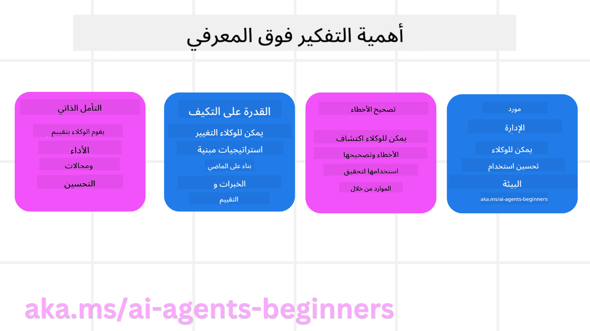
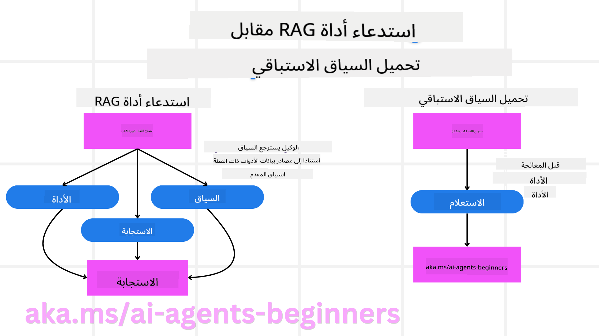

<!--
CO_OP_TRANSLATOR_METADATA:
{
  "original_hash": "8cbf460468c802c7994aa62e0e0779c9",
  "translation_date": "2025-07-12T11:52:51+00:00",
  "source_file": "09-metacognition/README.md",
  "language_code": "ar"
}
-->
[](https://youtu.be/His9R6gw6Ec?si=3_RMb8VprNvdLRhX)

> _(انقر على الصورة أعلاه لمشاهدة فيديو هذا الدرس)_
# التفكير فوق المعرفي في وكلاء الذكاء الاصطناعي

## مقدمة

مرحبًا بك في درس التفكير فوق المعرفي في وكلاء الذكاء الاصطناعي! هذا الفصل موجه للمبتدئين المهتمين بكيفية تفكير وكلاء الذكاء الاصطناعي في عمليات تفكيرهم الخاصة. بنهاية هذا الدرس، ستفهم المفاهيم الأساسية وستكون مجهزًا بأمثلة عملية لتطبيق التفكير فوق المعرفي في تصميم وكلاء الذكاء الاصطناعي.

## أهداف التعلم

بعد إتمام هذا الدرس، ستكون قادرًا على:

1. فهم تداعيات حلقات الاستدلال في تعريفات الوكلاء.
2. استخدام تقنيات التخطيط والتقييم لمساعدة الوكلاء على تصحيح أنفسهم.
3. إنشاء وكلاء خاصين بك قادرين على التلاعب بالكود لإنجاز المهام.

## مقدمة في التفكير فوق المعرفي

يشير التفكير فوق المعرفي إلى العمليات المعرفية العليا التي تتضمن التفكير في التفكير نفسه. بالنسبة لوكلاء الذكاء الاصطناعي، يعني هذا القدرة على تقييم وتعديل أفعالهم بناءً على الوعي الذاتي والتجارب السابقة. التفكير فوق المعرفي، أو "التفكير في التفكير"، هو مفهوم مهم في تطوير أنظمة الذكاء الاصطناعي الوكيلية. يتضمن وعي الأنظمة الذكية بعملياتها الداخلية وقدرتها على مراقبة وتنظيم وتكييف سلوكها وفقًا لذلك. تمامًا كما نفعل عندما نقرأ الموقف أو ننظر إلى مشكلة. هذا الوعي الذاتي يمكن أن يساعد أنظمة الذكاء الاصطناعي على اتخاذ قرارات أفضل، واكتشاف الأخطاء، وتحسين أدائها مع مرور الوقت - مما يعيدنا إلى اختبار تورينج والنقاش حول ما إذا كان الذكاء الاصطناعي سيهيمن على العالم.

في سياق أنظمة الذكاء الاصطناعي الوكيلية، يمكن للتفكير فوق المعرفي أن يساعد في معالجة عدة تحديات، مثل:
- الشفافية: ضمان قدرة أنظمة الذكاء الاصطناعي على شرح استدلالها وقراراتها.
- الاستدلال: تعزيز قدرة أنظمة الذكاء الاصطناعي على تجميع المعلومات واتخاذ قرارات سليمة.
- التكيف: السماح لأنظمة الذكاء الاصطناعي بالتأقلم مع بيئات جديدة وظروف متغيرة.
- الإدراك: تحسين دقة أنظمة الذكاء الاصطناعي في التعرف على البيانات وتفسيرها من بيئتها.

### ما هو التفكير فوق المعرفي؟

التفكير فوق المعرفي، أو "التفكير في التفكير"، هو عملية معرفية عليا تتضمن الوعي الذاتي والتنظيم الذاتي لعمليات التفكير. في مجال الذكاء الاصطناعي، يمكّن التفكير فوق المعرفي الوكلاء من تقييم وتكييف استراتيجياتهم وأفعالهم، مما يؤدي إلى تحسين قدرات حل المشكلات واتخاذ القرارات. بفهم التفكير فوق المعرفي، يمكنك تصميم وكلاء ذكاء اصطناعي ليسوا فقط أكثر ذكاءً، بل وأكثر قدرة على التكيف والكفاءة. في التفكير فوق المعرفي الحقيقي، سترى الذكاء الاصطناعي يستدل صراحةً على استدلاله الخاص.

مثال: "فضلت الرحلات الأرخص لأن... قد أفوّت الرحلات المباشرة، لذا دعني أراجع مرة أخرى."
متابعة كيف ولماذا اختار مسارًا معينًا.
- ملاحظة أنه ارتكب أخطاء لأنه اعتمد بشكل مفرط على تفضيلات المستخدم من المرة السابقة، لذا يغير استراتيجيته في اتخاذ القرار وليس فقط التوصية النهائية.
- تشخيص أنماط مثل: "كلما رأيت المستخدم يذكر 'الازدحام الشديد'، يجب ألا أزيل فقط بعض المعالم، بل أيضًا أعكس أن طريقتي في اختيار 'أفضل المعالم' خاطئة إذا كنت دائمًا أرتب حسب الشعبية."

### أهمية التفكير فوق المعرفي في وكلاء الذكاء الاصطناعي

يلعب التفكير فوق المعرفي دورًا حيويًا في تصميم وكلاء الذكاء الاصطناعي لعدة أسباب:



- التأمل الذاتي: يمكن للوكلاء تقييم أدائهم وتحديد مجالات التحسين.
- القدرة على التكيف: يمكن للوكلاء تعديل استراتيجياتهم بناءً على التجارب السابقة والبيئات المتغيرة.
- تصحيح الأخطاء: يمكن للوكلاء اكتشاف وتصحيح الأخطاء بشكل مستقل، مما يؤدي إلى نتائج أكثر دقة.
- إدارة الموارد: يمكن للوكلاء تحسين استخدام الموارد، مثل الوقت والطاقة الحاسوبية، من خلال التخطيط وتقييم أفعالهم.

## مكونات وكيل الذكاء الاصطناعي

قبل الغوص في عمليات التفكير فوق المعرفي، من الضروري فهم المكونات الأساسية لوكيل الذكاء الاصطناعي. يتكون وكيل الذكاء الاصطناعي عادةً من:

- الشخصية: شخصية وخصائص الوكيل التي تحدد كيفية تفاعله مع المستخدمين.
- الأدوات: القدرات والوظائف التي يمكن للوكيل تنفيذها.
- المهارات: المعرفة والخبرة التي يمتلكها الوكيل.

تعمل هذه المكونات معًا لإنشاء "وحدة خبرة" يمكنها أداء مهام محددة.

**مثال**:
تخيل وكيل سفر، يقدم خدمات لا تقتصر على تخطيط عطلتك فقط، بل يضبط مساره بناءً على البيانات الحية وتجارب رحلات العملاء السابقة.

### مثال: التفكير فوق المعرفي في خدمة وكيل السفر

تخيل أنك تصمم خدمة وكيل سفر مدعومة بالذكاء الاصطناعي. هذا الوكيل، "وكيل السفر"، يساعد المستخدمين في تخطيط عطلاتهم. لدمج التفكير فوق المعرفي، يحتاج وكيل السفر إلى تقييم وتعديل أفعاله بناءً على الوعي الذاتي والتجارب السابقة. إليك كيف يمكن أن يلعب التفكير فوق المعرفي دورًا:

#### المهمة الحالية

المهمة الحالية هي مساعدة المستخدم في تخطيط رحلة إلى باريس.

#### خطوات إتمام المهمة

1. **جمع تفضيلات المستخدم**: اسأل المستخدم عن تواريخ السفر، الميزانية، الاهتمامات (مثل المتاحف، المأكولات، التسوق)، وأي متطلبات خاصة.
2. **استرجاع المعلومات**: ابحث عن خيارات الرحلات، الإقامة، المعالم، والمطاعم التي تتناسب مع تفضيلات المستخدم.
3. **توليد التوصيات**: قدم جدولًا شخصيًا يتضمن تفاصيل الرحلات، حجوزات الفنادق، والأنشطة المقترحة.
4. **التعديل بناءً على الملاحظات**: اطلب من المستخدم ملاحظاته على التوصيات وقم بإجراء التعديلات اللازمة.

#### الموارد المطلوبة

- الوصول إلى قواعد بيانات حجز الرحلات والفنادق.
- معلومات عن معالم باريس والمطاعم.
- بيانات ملاحظات المستخدم من التفاعلات السابقة.

#### الخبرة والتأمل الذاتي

يستخدم وكيل السفر التفكير فوق المعرفي لتقييم أدائه والتعلم من التجارب السابقة. على سبيل المثال:

1. **تحليل ملاحظات المستخدم**: يراجع وكيل السفر ملاحظات المستخدم لتحديد التوصيات التي لاقت قبولًا وتلك التي لم تكن كذلك. ويعدل اقتراحاته المستقبلية بناءً على ذلك.
2. **القدرة على التكيف**: إذا ذكر المستخدم سابقًا عدم رغبته في الأماكن المزدحمة، سيتجنب وكيل السفر اقتراح الأماكن السياحية الشهيرة خلال أوقات الذروة في المستقبل.
3. **تصحيح الأخطاء**: إذا ارتكب وكيل السفر خطأً في حجز سابق، مثل اقتراح فندق محجوز بالكامل، يتعلم التحقق من التوافر بدقة أكبر قبل تقديم التوصيات.

#### مثال عملي للمطور

إليك مثالًا مبسطًا لكود وكيل السفر عند دمج التفكير فوق المعرفي:

```python
class Travel_Agent:
    def __init__(self):
        self.user_preferences = {}
        self.experience_data = []

    def gather_preferences(self, preferences):
        self.user_preferences = preferences

    def retrieve_information(self):
        # Search for flights, hotels, and attractions based on preferences
        flights = search_flights(self.user_preferences)
        hotels = search_hotels(self.user_preferences)
        attractions = search_attractions(self.user_preferences)
        return flights, hotels, attractions

    def generate_recommendations(self):
        flights, hotels, attractions = self.retrieve_information()
        itinerary = create_itinerary(flights, hotels, attractions)
        return itinerary

    def adjust_based_on_feedback(self, feedback):
        self.experience_data.append(feedback)
        # Analyze feedback and adjust future recommendations
        self.user_preferences = adjust_preferences(self.user_preferences, feedback)

# Example usage
travel_agent = Travel_Agent()
preferences = {
    "destination": "Paris",
    "dates": "2025-04-01 to 2025-04-10",
    "budget": "moderate",
    "interests": ["museums", "cuisine"]
}
travel_agent.gather_preferences(preferences)
itinerary = travel_agent.generate_recommendations()
print("Suggested Itinerary:", itinerary)
feedback = {"liked": ["Louvre Museum"], "disliked": ["Eiffel Tower (too crowded)"]}
travel_agent.adjust_based_on_feedback(feedback)
```

#### لماذا التفكير فوق المعرفي مهم

- **التأمل الذاتي**: يمكن للوكلاء تحليل أدائهم وتحديد مجالات التحسين.
- **القدرة على التكيف**: يمكن للوكلاء تعديل استراتيجياتهم بناءً على الملاحظات والظروف المتغيرة.
- **تصحيح الأخطاء**: يمكن للوكلاء اكتشاف وتصحيح الأخطاء بشكل مستقل.
- **إدارة الموارد**: يمكن للوكلاء تحسين استخدام الموارد مثل الوقت والطاقة الحاسوبية.

بدمج التفكير فوق المعرفي، يمكن لوكيل السفر تقديم توصيات سفر أكثر تخصيصًا ودقة، مما يعزز تجربة المستخدم بشكل عام.

---

## 2. التخطيط في الوكلاء

التخطيط هو مكون حاسم في سلوك وكيل الذكاء الاصطناعي. يتضمن تحديد الخطوات اللازمة لتحقيق هدف معين، مع مراعاة الحالة الحالية، الموارد، والعقبات المحتملة.

### عناصر التخطيط

- **المهمة الحالية**: تحديد المهمة بوضوح.
- **خطوات إتمام المهمة**: تقسيم المهمة إلى خطوات قابلة للإدارة.
- **الموارد المطلوبة**: تحديد الموارد اللازمة.
- **الخبرة**: الاستفادة من التجارب السابقة لتوجيه التخطيط.

**مثال**:
إليك الخطوات التي يحتاج وكيل السفر لاتخاذها لمساعدة المستخدم في تخطيط رحلته بفعالية:

### خطوات وكيل السفر

1. **جمع تفضيلات المستخدم**
   - اسأل المستخدم عن تفاصيل تواريخ السفر، الميزانية، الاهتمامات، وأي متطلبات خاصة.
   - أمثلة: "متى تخطط للسفر؟" "ما هو نطاق ميزانيتك؟" "ما الأنشطة التي تستمتع بها في العطلة؟"

2. **استرجاع المعلومات**
   - ابحث عن خيارات السفر المناسبة بناءً على تفضيلات المستخدم.
   - **الرحلات**: ابحث عن الرحلات المتاحة ضمن ميزانية المستخدم وتواريخ السفر المفضلة.
   - **الإقامة**: ابحث عن فنادق أو عقارات للإيجار تتناسب مع تفضيلات المستخدم من حيث الموقع والسعر والمرافق.
   - **المعالم والمطاعم**: حدد المعالم والأنشطة وخيارات الطعام الشهيرة التي تتماشى مع اهتمامات المستخدم.

3. **توليد التوصيات**
   - اجمع المعلومات المسترجعة في جدول زمني مخصص.
   - قدم تفاصيل مثل خيارات الرحلات، حجوزات الفنادق، والأنشطة المقترحة، مع تخصيص التوصيات حسب تفضيلات المستخدم.

4. **عرض الجدول الزمني للمستخدم**
   - شارك الجدول المقترح مع المستخدم للمراجعة.
   - مثال: "إليك جدول مقترح لرحلتك إلى باريس. يتضمن تفاصيل الرحلات، حجوزات الفنادق، وقائمة بالأنشطة والمطاعم المقترحة. أخبرني برأيك!"

5. **جمع الملاحظات**
   - اطلب من المستخدم ملاحظاته على الجدول المقترح.
   - أمثلة: "هل تعجبك خيارات الرحلات؟" "هل الفندق مناسب لاحتياجاتك؟" "هل هناك أنشطة ترغب في إضافتها أو إزالتها؟"

6. **التعديل بناءً على الملاحظات**
   - عدل الجدول بناءً على ملاحظات المستخدم.
   - أجرِ التغييرات اللازمة على توصيات الرحلات، الإقامة، والأنشطة لتتناسب بشكل أفضل مع تفضيلات المستخدم.

7. **التأكيد النهائي**
   - قدم الجدول المحدث للمستخدم للتأكيد النهائي.
   - مثال: "لقد أجريت التعديلات بناءً على ملاحظاتك. إليك الجدول المحدث. هل كل شيء يبدو جيدًا؟"

8. **الحجز وتأكيد الحجوزات**
   - بمجرد موافقة المستخدم على الجدول، تابع حجز الرحلات، الإقامة، وأي أنشطة مخططة مسبقًا.
   - أرسل تفاصيل التأكيد إلى المستخدم.

9. **تقديم الدعم المستمر**
   - كن متاحًا لمساعدة المستخدم في أي تغييرات أو طلبات إضافية قبل وأثناء الرحلة.
   - مثال: "إذا احتجت إلى أي مساعدة إضافية خلال رحلتك، لا تتردد في التواصل معي في أي وقت!"

### مثال تفاعل

```python
class Travel_Agent:
    def __init__(self):
        self.user_preferences = {}
        self.experience_data = []

    def gather_preferences(self, preferences):
        self.user_preferences = preferences

    def retrieve_information(self):
        flights = search_flights(self.user_preferences)
        hotels = search_hotels(self.user_preferences)
        attractions = search_attractions(self.user_preferences)
        return flights, hotels, attractions

    def generate_recommendations(self):
        flights, hotels, attractions = self.retrieve_information()
        itinerary = create_itinerary(flights, hotels, attractions)
        return itinerary

    def adjust_based_on_feedback(self, feedback):
        self.experience_data.append(feedback)
        self.user_preferences = adjust_preferences(self.user_preferences, feedback)

# Example usage within a booing request
travel_agent = Travel_Agent()
preferences = {
    "destination": "Paris",
    "dates": "2025-04-01 to 2025-04-10",
    "budget": "moderate",
    "interests": ["museums", "cuisine"]
}
travel_agent.gather_preferences(preferences)
itinerary = travel_agent.generate_recommendations()
print("Suggested Itinerary:", itinerary)
feedback = {"liked": ["Louvre Museum"], "disliked": ["Eiffel Tower (too crowded)"]}
travel_agent.adjust_based_on_feedback(feedback)
```

## 3. نظام RAG التصحيحي

لنبدأ أولًا بفهم الفرق بين أداة RAG وتحميل السياق الاستباقي



### التوليد المعزز بالاسترجاع (RAG)

يجمع RAG بين نظام استرجاع ونموذج توليدي. عند تقديم استعلام، يقوم نظام الاسترجاع بجلب مستندات أو بيانات ذات صلة من مصدر خارجي، وتُستخدم هذه المعلومات المسترجعة لتعزيز مدخلات النموذج التوليدي. هذا يساعد النموذج على توليد ردود أكثر دقة وملائمة للسياق.

في نظام RAG، يسترجع الوكيل معلومات ذات صلة من قاعدة معرفة ويستخدمها لتوليد ردود أو أفعال مناسبة.

### نهج RAG التصحيحي

يركز نهج RAG التصحيحي على استخدام تقنيات RAG لتصحيح الأخطاء وتحسين دقة وكلاء الذكاء الاصطناعي. يتضمن ذلك:

1. **تقنية التوجيه**: استخدام توجيهات محددة لإرشاد الوكيل في استرجاع المعلومات ذات الصلة.
2. **الأداة**: تنفيذ خوارزميات وآليات تمكّن الوكيل من تقييم مدى ملاءمة المعلومات المسترجعة وتوليد ردود دقيقة.
3. **التقييم**: تقييم أداء الوكيل باستمرار وإجراء التعديلات لتحسين دقته وكفاءته.

#### مثال: RAG التصحيحي في وكيل البحث

تخيل وكيل بحث يسترجع معلومات من الويب للإجابة على استفسارات المستخدمين. قد يتضمن نهج RAG التصحيحي:

1. **تقنية التوجيه**: صياغة استعلامات البحث بناءً على مدخلات المستخدم.
2. **الأداة**: استخدام معالجة اللغة الطبيعية وخوارزميات التعلم الآلي لترتيب وتصفية نتائج البحث.
3. **التقييم**: تحليل ملاحظات المستخدم لتحديد وتصحيح الأخطاء في المعلومات المسترجعة.

### RAG التصحيحي في وكيل السفر

يعزز RAG التصحيحي قدرة الذكاء الاصطناعي على استرجاع وتوليد المعلومات مع تصحيح أي أخطاء. لنرَ كيف يمكن لوكيل السفر استخدام نهج RAG التصحيحي لتقديم توصيات سفر أكثر دقة وملاءمة.

يتضمن ذلك:

- **تقنية التوجيه:** استخدام توجيهات محددة لإرشاد الوكيل في استرجاع المعلومات ذات الصلة.
- **الأداة:** تنفيذ خوارزميات وآليات تمكّن الوكيل من تقييم مدى ملاءمة المعلومات المسترجعة وتوليد ردود دقيقة.
- **التقييم:** تقييم أداء الوكيل باستمرار وإجراء التعديلات لتحسين دقته وكفاءته.

#### خطوات تنفيذ RAG التصحيحي في وكيل السفر

1. **التفاعل الأولي مع المستخدم**
   - يجمع وكيل السفر تفضيلات المستخدم الأولية، مثل الوجهة، تواريخ السفر، الميزانية، والاهتمامات.
   - مثال:

     ```python
     preferences = {
         "destination": "Paris",
         "dates": "2025-04-01 to 2025-04-10",
         "budget": "moderate",
         "interests": ["museums", "cuisine"]
     }
     ```

2. **استرجاع المعلومات**
   - يسترجع وكيل السفر معلومات عن الرحلات، الإقامة، المعالم، والمطاعم بناءً على تفضيلات المستخدم.
   - مثال:

     ```python
     flights = search_flights(preferences)
     hotels = search_hotels(preferences)
     attractions = search_attractions(preferences)
     ```

3. **توليد التوصيات الأولية**
   - يستخدم وكيل السفر المعلومات المسترجعة لتوليد جدول زمني مخصص.
   - مثال:

     ```python
     itinerary = create_itinerary(flights, hotels, attractions)
     print("Suggested Itinerary:", itinerary)
     ```

4. **جمع ملاحظات المستخدم**
   - يطلب وكيل السفر ملاحظات المستخدم على التوصيات الأولية.
   - مثال:

     ```python
     feedback = {
         "liked": ["Louvre Museum"],
         "disliked": ["Eiffel Tower (too crowded)"]
     }
     ```

5. **عملية RAG التصحيحي**
   - **تقنية التوجيه**: يصيغ وكيل السفر استعلامات بحث جديدة بناءً على ملاحظات المستخدم.
     - مثال:

       ```python
       if "disliked" in feedback:
           preferences["avoid"] = feedback["disliked"]
       ```

   - **الأداة**: يستخدم وكيل السفر خوارزميات لترتيب وتصفية نتائج البحث الجديدة، مع التركيز على الملاءمة بناءً على ملاحظات المستخدم.
     - مثال:

       ```python
       new_attractions = search_attractions(preferences)
       new_itinerary = create_itinerary(flights, hotels, new_attractions)
       print("Updated Itinerary:", new_itinerary)
       ```

   - **التقييم**: يقيم وكيل السفر باستمرار مدى ملاءمة ودقة توصياته من خلال تحليل ملاحظات المستخدم وإجراء التعديلات اللازمة.
     - مثال:

       ```python
       def adjust_preferences(preferences, feedback):
           if "liked" in feedback:
               preferences["favorites"] = feedback["liked"]
           if "disliked" in feedback:
               preferences["avoid"] = feedback["disliked"]
           return preferences

       preferences = adjust_preferences(preferences, feedback)
       ```

#### مثال عملي

إليك مثالًا مبسطًا لكود Python يدمج نهج RAG التصحيحي في وكيل السفر:
### التحميل المسبق للسياق

التحميل المسبق للسياق يعني تحميل المعلومات ذات الصلة أو الخلفية في النموذج قبل معالجة الاستعلام. هذا يعني أن النموذج يمتلك هذه المعلومات منذ البداية، مما يساعده على توليد ردود أكثر وعيًا دون الحاجة إلى استرجاع بيانات إضافية أثناء العملية.

إليك مثال مبسط لكيفية تنفيذ التحميل المسبق للسياق في تطبيق وكيل سفر باستخدام بايثون:

```python
class TravelAgent:
    def __init__(self):
        # Pre-load popular destinations and their information
        self.context = {
            "Paris": {"country": "France", "currency": "Euro", "language": "French", "attractions": ["Eiffel Tower", "Louvre Museum"]},
            "Tokyo": {"country": "Japan", "currency": "Yen", "language": "Japanese", "attractions": ["Tokyo Tower", "Shibuya Crossing"]},
            "New York": {"country": "USA", "currency": "Dollar", "language": "English", "attractions": ["Statue of Liberty", "Times Square"]},
            "Sydney": {"country": "Australia", "currency": "Dollar", "language": "English", "attractions": ["Sydney Opera House", "Bondi Beach"]}
        }

    def get_destination_info(self, destination):
        # Fetch destination information from pre-loaded context
        info = self.context.get(destination)
        if info:
            return f"{destination}:\nCountry: {info['country']}\nCurrency: {info['currency']}\nLanguage: {info['language']}\nAttractions: {', '.join(info['attractions'])}"
        else:
            return f"Sorry, we don't have information on {destination}."

# Example usage
travel_agent = TravelAgent()
print(travel_agent.get_destination_info("Paris"))
print(travel_agent.get_destination_info("Tokyo"))
```

#### الشرح

1. **التهيئة (`__init__` method)**: تقوم فئة `TravelAgent` بتحميل قاموس يحتوي على معلومات عن وجهات شهيرة مثل باريس، طوكيو، نيويورك، وسيدني. يشمل هذا القاموس تفاصيل مثل البلد، العملة، اللغة، والمعالم الرئيسية لكل وجهة.

2. **استرجاع المعلومات (`get_destination_info` method)**: عند استعلام المستخدم عن وجهة معينة، تقوم هذه الطريقة بجلب المعلومات ذات الصلة من القاموس المحمّل مسبقًا.

من خلال التحميل المسبق للسياق، يمكن لتطبيق وكيل السفر الرد بسرعة على استفسارات المستخدمين دون الحاجة لاسترجاع المعلومات من مصدر خارجي في الوقت الفعلي، مما يجعل التطبيق أكثر كفاءة واستجابة.

### بدء الخطة بهدف قبل التكرار

بدء الخطة بهدف يعني الانطلاق بهدف واضح أو نتيجة مستهدفة في الذهن. من خلال تحديد هذا الهدف مسبقًا، يمكن للنموذج استخدامه كمرشد خلال عملية التكرار. هذا يساعد على ضمان أن كل تكرار يقرب الخطة من تحقيق النتيجة المرجوة، مما يجعل العملية أكثر كفاءة وتركيزًا.

إليك مثالًا لكيفية بدء خطة سفر بهدف قبل التكرار لوكيل سفر باستخدام بايثون:

### السيناريو

يريد وكيل السفر تخطيط عطلة مخصصة لعميل. الهدف هو إنشاء مسار سفر يزيد من رضا العميل بناءً على تفضيلاته وميزانيته.

### الخطوات

1. تحديد تفضيلات العميل وميزانيته.
2. بدء الخطة الأولية بناءً على هذه التفضيلات.
3. التكرار لتحسين الخطة، مع التركيز على رضا العميل.

#### كود بايثون

```python
class TravelAgent:
    def __init__(self, destinations):
        self.destinations = destinations

    def bootstrap_plan(self, preferences, budget):
        plan = []
        total_cost = 0

        for destination in self.destinations:
            if total_cost + destination['cost'] <= budget and self.match_preferences(destination, preferences):
                plan.append(destination)
                total_cost += destination['cost']

        return plan

    def match_preferences(self, destination, preferences):
        for key, value in preferences.items():
            if destination.get(key) != value:
                return False
        return True

    def iterate_plan(self, plan, preferences, budget):
        for i in range(len(plan)):
            for destination in self.destinations:
                if destination not in plan and self.match_preferences(destination, preferences) and self.calculate_cost(plan, destination) <= budget:
                    plan[i] = destination
                    break
        return plan

    def calculate_cost(self, plan, new_destination):
        return sum(destination['cost'] for destination in plan) + new_destination['cost']

# Example usage
destinations = [
    {"name": "Paris", "cost": 1000, "activity": "sightseeing"},
    {"name": "Tokyo", "cost": 1200, "activity": "shopping"},
    {"name": "New York", "cost": 900, "activity": "sightseeing"},
    {"name": "Sydney", "cost": 1100, "activity": "beach"},
]

preferences = {"activity": "sightseeing"}
budget = 2000

travel_agent = TravelAgent(destinations)
initial_plan = travel_agent.bootstrap_plan(preferences, budget)
print("Initial Plan:", initial_plan)

refined_plan = travel_agent.iterate_plan(initial_plan, preferences, budget)
print("Refined Plan:", refined_plan)
```

#### شرح الكود

1. **التهيئة (`__init__` method)**: يتم تهيئة فئة `TravelAgent` بقائمة من الوجهات المحتملة، كل منها يحتوي على خصائص مثل الاسم، التكلفة، ونوع النشاط.

2. **بدء الخطة (`bootstrap_plan` method)**: تنشئ هذه الطريقة خطة سفر أولية بناءً على تفضيلات العميل وميزانيته. تقوم بالتكرار عبر قائمة الوجهات وتضيفها إلى الخطة إذا كانت تتوافق مع تفضيلات العميل وتناسب الميزانية.

3. **مطابقة التفضيلات (`match_preferences` method)**: تتحقق هذه الطريقة مما إذا كانت الوجهة تتطابق مع تفضيلات العميل.

4. **تكرار الخطة (`iterate_plan` method)**: تقوم هذه الطريقة بتحسين الخطة الأولية بمحاولة استبدال كل وجهة في الخطة بوجهة أفضل، مع مراعاة تفضيلات العميل وقيود الميزانية.

5. **حساب التكلفة (`calculate_cost` method)**: تحسب هذه الطريقة التكلفة الإجمالية للخطة الحالية، بما في ذلك الوجهة الجديدة المحتملة.

#### مثال على الاستخدام

- **الخطة الأولية**: ينشئ وكيل السفر خطة أولية بناءً على تفضيلات العميل للمعالم السياحية وميزانية قدرها 2000 دولار.
- **الخطة المحسنة**: يقوم وكيل السفر بتكرار الخطة، محسنًا تفضيلات العميل والميزانية.

من خلال بدء الخطة بهدف واضح (مثل تعظيم رضا العميل) والتكرار لتحسينها، يمكن لوكيل السفر إنشاء مسار سفر مخصص ومحسن للعميل. يضمن هذا النهج توافق خطة السفر مع تفضيلات العميل وميزانيته منذ البداية ويتحسن مع كل تكرار.

### الاستفادة من نماذج اللغة الكبيرة لإعادة الترتيب والتقييم

يمكن استخدام نماذج اللغة الكبيرة (LLMs) لإعادة الترتيب والتقييم من خلال تقييم مدى ملاءمة وجودة المستندات المسترجعة أو الردود المولدة. إليك كيف يعمل ذلك:

**الاسترجاع:** الخطوة الأولى تسترجع مجموعة من المستندات أو الردود المحتملة بناءً على الاستعلام.

**إعادة الترتيب:** يقوم النموذج بتقييم هذه المرشحات ويعيد ترتيبها بناءً على مدى ملاءمتها وجودتها. تضمن هذه الخطوة عرض المعلومات الأكثر صلة وجودة أولاً.

**التقييم:** يمنح النموذج درجات لكل مرشح تعكس مدى ملاءمته وجودته. يساعد ذلك في اختيار أفضل رد أو مستند للمستخدم.

باستخدام نماذج اللغة الكبيرة لإعادة الترتيب والتقييم، يمكن للنظام تقديم معلومات أكثر دقة وملاءمة للسياق، مما يحسن تجربة المستخدم بشكل عام.

إليك مثالًا لكيفية استخدام وكيل السفر لنموذج لغة كبير لإعادة الترتيب وتقييم وجهات السفر بناءً على تفضيلات المستخدم في بايثون:

#### السيناريو - السفر بناءً على التفضيلات

يريد وكيل السفر التوصية بأفضل وجهات السفر للعميل بناءً على تفضيلاته. سيساعد النموذج في إعادة ترتيب وتقييم الوجهات لضمان عرض الخيارات الأكثر ملاءمة.

#### الخطوات:

1. جمع تفضيلات المستخدم.
2. استرجاع قائمة بالوجهات المحتملة.
3. استخدام النموذج لإعادة الترتيب وتقييم الوجهات بناءً على تفضيلات المستخدم.

إليك كيفية تحديث المثال السابق لاستخدام خدمات Azure OpenAI:

#### المتطلبات

1. يجب أن يكون لديك اشتراك في Azure.
2. إنشاء مورد Azure OpenAI والحصول على مفتاح API الخاص بك.

#### كود بايثون مثال

```python
import requests
import json

class TravelAgent:
    def __init__(self, destinations):
        self.destinations = destinations

    def get_recommendations(self, preferences, api_key, endpoint):
        # Generate a prompt for the Azure OpenAI
        prompt = self.generate_prompt(preferences)
        
        # Define headers and payload for the request
        headers = {
            'Content-Type': 'application/json',
            'Authorization': f'Bearer {api_key}'
        }
        payload = {
            "prompt": prompt,
            "max_tokens": 150,
            "temperature": 0.7
        }
        
        # Call the Azure OpenAI API to get the re-ranked and scored destinations
        response = requests.post(endpoint, headers=headers, json=payload)
        response_data = response.json()
        
        # Extract and return the recommendations
        recommendations = response_data['choices'][0]['text'].strip().split('\n')
        return recommendations

    def generate_prompt(self, preferences):
        prompt = "Here are the travel destinations ranked and scored based on the following user preferences:\n"
        for key, value in preferences.items():
            prompt += f"{key}: {value}\n"
        prompt += "\nDestinations:\n"
        for destination in self.destinations:
            prompt += f"- {destination['name']}: {destination['description']}\n"
        return prompt

# Example usage
destinations = [
    {"name": "Paris", "description": "City of lights, known for its art, fashion, and culture."},
    {"name": "Tokyo", "description": "Vibrant city, famous for its modernity and traditional temples."},
    {"name": "New York", "description": "The city that never sleeps, with iconic landmarks and diverse culture."},
    {"name": "Sydney", "description": "Beautiful harbour city, known for its opera house and stunning beaches."},
]

preferences = {"activity": "sightseeing", "culture": "diverse"}
api_key = 'your_azure_openai_api_key'
endpoint = 'https://your-endpoint.com/openai/deployments/your-deployment-name/completions?api-version=2022-12-01'

travel_agent = TravelAgent(destinations)
recommendations = travel_agent.get_recommendations(preferences, api_key, endpoint)
print("Recommended Destinations:")
for rec in recommendations:
    print(rec)
```

#### شرح الكود - حجز التفضيلات

1. **التهيئة**: يتم تهيئة فئة `TravelAgent` بقائمة من وجهات السفر المحتملة، كل منها يحتوي على خصائص مثل الاسم والوصف.

2. **الحصول على التوصيات (`get_recommendations` method)**: تنشئ هذه الطريقة موجهًا لخدمة Azure OpenAI بناءً على تفضيلات المستخدم وتقوم بإرسال طلب HTTP POST إلى API الخاص بـ Azure OpenAI للحصول على وجهات معاد ترتيبها ومقيمة.

3. **إنشاء الموجه (`generate_prompt` method)**: تبني هذه الطريقة موجهًا لـ Azure OpenAI، يشمل تفضيلات المستخدم وقائمة الوجهات. يوجه الموجه النموذج لإعادة ترتيب وتقييم الوجهات بناءً على التفضيلات المقدمة.

4. **استدعاء API**: تُستخدم مكتبة `requests` لإرسال طلب HTTP POST إلى نقطة نهاية Azure OpenAI. يحتوي الرد على الوجهات المعاد ترتيبها والمقيمة.

5. **مثال على الاستخدام**: يجمع وكيل السفر تفضيلات المستخدم (مثل الاهتمام بالمعالم السياحية والثقافة المتنوعة) ويستخدم خدمة Azure OpenAI للحصول على توصيات معاد ترتيبها ومقيمة لوجهات السفر.

تأكد من استبدال `your_azure_openai_api_key` بمفتاح API الخاص بك و`https://your-endpoint.com/...` بعنوان نقطة النهاية الفعلي لنشر Azure OpenAI الخاص بك.

باستخدام النموذج لإعادة الترتيب والتقييم، يمكن لوكيل السفر تقديم توصيات سفر أكثر تخصيصًا وملاءمة للعملاء، مما يعزز تجربتهم بشكل عام.

### RAG: تقنية التوجيه مقابل الأداة

يمكن أن يكون استرجاع المعلومات المعزز بالتوليد (RAG) تقنية توجيه وأداة في تطوير وكلاء الذكاء الاصطناعي. فهم الفرق بينهما يساعدك على استخدام RAG بشكل أكثر فعالية في مشاريعك.

#### RAG كتقنية توجيه

**ما هي؟**

- كتقنية توجيه، تتضمن RAG صياغة استعلامات أو موجهات محددة لتوجيه استرجاع المعلومات ذات الصلة من مجموعة كبيرة من البيانات أو قاعدة بيانات. تُستخدم هذه المعلومات بعد ذلك لتوليد ردود أو إجراءات.

**كيف تعمل:**

1. **صياغة الموجهات**: إنشاء موجهات أو استعلامات منظمة جيدًا بناءً على المهمة أو مدخلات المستخدم.
2. **استرجاع المعلومات**: استخدام الموجهات للبحث عن بيانات ذات صلة من قاعدة معرفة أو مجموعة بيانات موجودة مسبقًا.
3. **توليد الرد**: دمج المعلومات المسترجعة مع نماذج الذكاء الاصطناعي التوليدية لإنتاج رد شامل ومتسق.

**مثال في وكيل السفر**:

- مدخل المستخدم: "أريد زيارة المتاحف في باريس."
- الموجه: "ابحث عن أفضل المتاحف في باريس."
- المعلومات المسترجعة: تفاصيل عن متحف اللوفر، متحف أورسيه، إلخ.
- الرد المولد: "إليك بعض أفضل المتاحف في باريس: متحف اللوفر، متحف أورسيه، ومركز بومبيدو."

#### RAG كأداة

**ما هي؟**

- كأداة، RAG هو نظام متكامل يدمج عملية الاسترجاع والتوليد تلقائيًا، مما يسهل على المطورين تنفيذ وظائف ذكاء اصطناعي معقدة دون الحاجة لصياغة موجهات يدوية لكل استعلام.

**كيف تعمل:**

1. **التكامل**: تضمين RAG ضمن بنية وكيل الذكاء الاصطناعي، مما يسمح له بالتعامل تلقائيًا مع مهام الاسترجاع والتوليد.
2. **الأتمتة**: تدير الأداة العملية بأكملها، من استقبال مدخلات المستخدم إلى توليد الرد النهائي، دون الحاجة لموجهات صريحة لكل خطوة.
3. **الكفاءة**: تعزز أداء الوكيل من خلال تبسيط عملية الاسترجاع والتوليد، مما يتيح ردودًا أسرع وأكثر دقة.

**مثال في وكيل السفر**:

- مدخل المستخدم: "أريد زيارة المتاحف في باريس."
- أداة RAG: تسترجع تلقائيًا معلومات عن المتاحف وتولد ردًا.
- الرد المولد: "إليك بعض أفضل المتاحف في باريس: متحف اللوفر، متحف أورسيه، ومركز بومبيدو."

### المقارنة

| الجانب                 | تقنية التوجيه                                         | الأداة                                               |
|------------------------|------------------------------------------------------|-----------------------------------------------------|
| **يدوي مقابل تلقائي**  | صياغة الموجهات يدويًا لكل استعلام.                   | عملية تلقائية للاسترجاع والتوليد.                     |
| **التحكم**             | توفر تحكمًا أكبر في عملية الاسترجاع.                  | تبسط وتؤتمت عملية الاسترجاع والتوليد.                |
| **المرونة**            | تسمح بموجهات مخصصة بناءً على الاحتياجات المحددة.      | أكثر كفاءة للتطبيقات واسعة النطاق.                   |
| **التعقيد**            | تتطلب صياغة وتعديل الموجهات.                          | أسهل في التكامل ضمن بنية وكيل الذكاء الاصطناعي.      |

### أمثلة عملية

**مثال تقنية التوجيه:**

```python
def search_museums_in_paris():
    prompt = "Find top museums in Paris"
    search_results = search_web(prompt)
    return search_results

museums = search_museums_in_paris()
print("Top Museums in Paris:", museums)
```

**مثال الأداة:**

```python
class Travel_Agent:
    def __init__(self):
        self.rag_tool = RAGTool()

    def get_museums_in_paris(self):
        user_input = "I want to visit museums in Paris."
        response = self.rag_tool.retrieve_and_generate(user_input)
        return response

travel_agent = Travel_Agent()
museums = travel_agent.get_museums_in_paris()
print("Top Museums in Paris:", museums)
```

### تقييم الملاءمة

تقييم الملاءمة هو جانب حاسم في أداء وكيل الذكاء الاصطناعي. يضمن أن المعلومات المسترجعة والمولدة من قبل الوكيل مناسبة ودقيقة ومفيدة للمستخدم. دعونا نستعرض كيفية تقييم الملاءمة في وكلاء الذكاء الاصطناعي، مع أمثلة وتقنيات عملية.

#### المفاهيم الأساسية في تقييم الملاءمة

1. **الوعي بالسياق**:
   - يجب أن يفهم الوكيل سياق استعلام المستخدم لاسترجاع وتوليد معلومات ملائمة.
   - مثال: إذا طلب المستخدم "أفضل المطاعم في باريس"، يجب أن يأخذ الوكيل في الاعتبار تفضيلات المستخدم مثل نوع المطبخ والميزانية.

2. **الدقة**:
   - يجب أن تكون المعلومات المقدمة من الوكيل صحيحة وموثوقة ومحدثة.
   - مثال: التوصية بالمطاعم المفتوحة حاليًا والتي تحظى بتقييمات جيدة بدلاً من الخيارات القديمة أو المغلقة.

3. **نية المستخدم**:
   - يجب أن يستنتج الوكيل نية المستخدم وراء الاستعلام لتقديم المعلومات الأكثر ملاءمة.
   - مثال: إذا طلب المستخدم "فنادق بأسعار معقولة"، يجب أن يعطي الوكيل الأولوية للخيارات الاقتصادية.

4. **حلقة التغذية الراجعة**:
   - جمع وتحليل ملاحظات المستخدم باستمرار يساعد الوكيل على تحسين عملية تقييم الملاءمة.
   - مثال: دمج تقييمات المستخدمين وردود أفعالهم على التوصيات السابقة لتحسين الردود المستقبلية.

#### تقنيات عملية لتقييم الملاءمة

1. **تقييم الملاءمة بالنقاط**:
   - تعيين درجة ملاءمة لكل عنصر مسترجع بناءً على مدى تطابقه مع استعلام وتفضيلات المستخدم.
   - مثال:

     ```python
     def relevance_score(item, query):
         score = 0
         if item['category'] in query['interests']:
             score += 1
         if item['price'] <= query['budget']:
             score += 1
         if item['location'] == query['destination']:
             score += 1
         return score
     ```

2. **الترشيح والترتيب**:
   - تصفية العناصر غير الملائمة وترتيب الباقي بناءً على درجات الملاءمة.
   - مثال:

     ```python
     def filter_and_rank(items, query):
         ranked_items = sorted(items, key=lambda item: relevance_score(item, query), reverse=True)
         return ranked_items[:10]  # Return top 10 relevant items
     ```

3. **معالجة اللغة الطبيعية (NLP)**:
   - استخدام تقنيات NLP لفهم استعلام المستخدم واسترجاع المعلومات الملائمة.
   - مثال:

     ```python
     def process_query(query):
         # Use NLP to extract key information from the user's query
         processed_query = nlp(query)
         return processed_query
     ```

4. **دمج ملاحظات المستخدم**:
   - جمع ملاحظات المستخدم حول التوصيات المقدمة واستخدامها لضبط تقييمات الملاءمة المستقبلية.
   - مثال:

     ```python
     def adjust_based_on_feedback(feedback, items):
         for item in items:
             if item['name'] in feedback['liked']:
                 item['relevance'] += 1
             if item['name'] in feedback['disliked']:
                 item['relevance'] -= 1
         return items
     ```

#### مثال: تقييم الملاءمة في وكيل السفر

إليك مثالًا عمليًا لكيفية تقييم وكيل السفر لملاءمة توصيات السفر:

```python
class Travel_Agent:
    def __init__(self):
        self.user_preferences = {}
        self.experience_data = []

    def gather_preferences(self, preferences):
        self.user_preferences = preferences

    def retrieve_information(self):
        flights = search_flights(self.user_preferences)
        hotels = search_hotels(self.user_preferences)
        attractions = search_attractions(self.user_preferences)
        return flights, hotels, attractions

    def generate_recommendations(self):
        flights, hotels, attractions = self.retrieve_information()
        ranked_hotels = self.filter_and_rank(hotels, self.user_preferences)
        itinerary = create_itinerary(flights, ranked_hotels, attractions)
        return itinerary

    def filter_and_rank(self, items, query):
        ranked_items = sorted(items, key=lambda item: self.relevance_score(item, query), reverse=True)
        return ranked_items[:10]  # Return top 10 relevant items

    def relevance_score(self, item, query):
        score = 0
        if item['category'] in query['interests']:
            score += 1
        if item['price'] <= query['budget']:
            score += 1
        if item['location'] == query['destination']:
            score += 1
        return score

    def adjust_based_on_feedback(self, feedback, items):
        for item in items:
            if item['name'] in feedback['liked']:
                item['relevance'] += 1
            if item['name'] in feedback['disliked']:
                item['relevance'] -= 1
        return items

# Example usage
travel_agent = Travel_Agent()
preferences = {
    "destination": "Paris",
    "dates": "2025-04-01 to 2025-04-10",
    "budget": "moderate",
    "interests": ["museums", "cuisine"]
}
travel_agent.gather_preferences(preferences)
itinerary = travel_agent.generate_recommendations()
print("Suggested Itinerary:", itinerary)
feedback = {"liked": ["Louvre Museum"], "disliked": ["Eiffel Tower (too crowded)"]}
updated_items = travel_agent.adjust_based_on_feedback(feedback, itinerary['hotels'])
print("Updated Itinerary with Feedback:", updated_items)
```

### البحث بناءً على النية

البحث بناءً على النية يعني فهم وتفسير الغرض أو الهدف الكامن وراء استعلام المستخدم لاسترجاع وتوليد المعلومات الأكثر ملاءمة وفائدة. يتجاوز هذا النهج مجرد مطابقة الكلمات المفتاحية ويركز على استيعاب الاحتياجات والسياق الفعلي للمستخدم.

#### المفاهيم الأساسية في البحث بناءً على النية

1. **فهم نية المستخدم**:
   - يمكن تصنيف نية المستخدم إلى ثلاثة أنواع رئيسية: معلوماتية، تنقلية، ومعاملاتية.
     - **النية المعلوماتية**: يسعى المستخدم للحصول على معلومات حول موضوع معين (مثال: "ما هي أفضل المتاحف في باريس؟").
     - **النية التنقلية**: يريد المستخدم الانتقال إلى موقع أو صفحة محددة (مثال: "الموقع الرسمي لمتحف اللوفر").
     - **النية المعاملاتية**: يهدف المستخدم إلى إجراء معاملة، مثل حجز رحلة أو شراء (مثال: "حجز رحلة إلى باريس").

2. **الوعي بالسياق**:
   - تحليل سياق استعلام المستخدم يساعد في تحديد نيته بدقة. يشمل ذلك النظر في التفاعلات السابقة، تفضيلات المستخدم، والتفاصيل الخاصة بالاستعلام الحالي.

3. **معالجة اللغة الطبيعية (NLP)**:
   - تُستخدم تقنيات NLP لفهم وتفسير الاستعلامات اللغوية الطبيعية المقدمة من المستخدمين، بما في ذلك مهام مثل التعرف على الكيانات، تحليل المشاعر، وتحليل الاستعلام.

4. **التخصيص**:
   - تخصيص نتائج البحث بناءً على تاريخ المستخدم، تفضيلاته، وملاحظاته يعزز من ملاءمة المعلومات المسترجعة.
#### مثال عملي: البحث مع وجود نية في وكيل السفر

لنأخذ وكيل السفر كمثال لنرى كيف يمكن تنفيذ البحث مع وجود نية.

1. **جمع تفضيلات المستخدم**

   ```python
   class Travel_Agent:
       def __init__(self):
           self.user_preferences = {}

       def gather_preferences(self, preferences):
           self.user_preferences = preferences
   ```

2. **فهم نية المستخدم**

   ```python
   def identify_intent(query):
       if "book" in query or "purchase" in query:
           return "transactional"
       elif "website" in query or "official" in query:
           return "navigational"
       else:
           return "informational"
   ```

3. **الوعي بالسياق**

   ```python
   def analyze_context(query, user_history):
       # Combine current query with user history to understand context
       context = {
           "current_query": query,
           "user_history": user_history
       }
       return context
   ```

4. **البحث وتخصيص النتائج**

   ```python
   def search_with_intent(query, preferences, user_history):
       intent = identify_intent(query)
       context = analyze_context(query, user_history)
       if intent == "informational":
           search_results = search_information(query, preferences)
       elif intent == "navigational":
           search_results = search_navigation(query)
       elif intent == "transactional":
           search_results = search_transaction(query, preferences)
       personalized_results = personalize_results(search_results, user_history)
       return personalized_results

   def search_information(query, preferences):
       # Example search logic for informational intent
       results = search_web(f"best {preferences['interests']} in {preferences['destination']}")
       return results

   def search_navigation(query):
       # Example search logic for navigational intent
       results = search_web(query)
       return results

   def search_transaction(query, preferences):
       # Example search logic for transactional intent
       results = search_web(f"book {query} to {preferences['destination']}")
       return results

   def personalize_results(results, user_history):
       # Example personalization logic
       personalized = [result for result in results if result not in user_history]
       return personalized[:10]  # Return top 10 personalized results
   ```

5. **مثال على الاستخدام**

   ```python
   travel_agent = Travel_Agent()
   preferences = {
       "destination": "Paris",
       "interests": ["museums", "cuisine"]
   }
   travel_agent.gather_preferences(preferences)
   user_history = ["Louvre Museum website", "Book flight to Paris"]
   query = "best museums in Paris"
   results = search_with_intent(query, preferences, user_history)
   print("Search Results:", results)
   ```

---

## 4. توليد الكود كأداة

تستخدم وكلاء توليد الكود نماذج الذكاء الاصطناعي لكتابة وتنفيذ الكود، مما يساعد في حل المشكلات المعقدة وأتمتة المهام.

### وكلاء توليد الكود

تعتمد وكلاء توليد الكود على نماذج الذكاء الاصطناعي التوليدية لكتابة وتنفيذ الكود. يمكن لهذه الوكلاء حل المشكلات المعقدة، أتمتة المهام، وتقديم رؤى قيمة من خلال توليد وتشغيل الكود بلغات برمجة مختلفة.

#### التطبيقات العملية

1. **توليد الكود التلقائي**: إنشاء مقاطع كود لمهام محددة، مثل تحليل البيانات، جمع البيانات من الويب، أو التعلم الآلي.
2. **استخدام SQL كـ RAG**: استخدام استعلامات SQL لاسترجاع ومعالجة البيانات من قواعد البيانات.
3. **حل المشكلات**: إنشاء وتنفيذ كود لحل مشكلات معينة، مثل تحسين الخوارزميات أو تحليل البيانات.

#### مثال: وكيل توليد الكود لتحليل البيانات

تخيل أنك تصمم وكيل توليد كود. إليك كيف يمكن أن يعمل:

1. **المهمة**: تحليل مجموعة بيانات لتحديد الاتجاهات والأنماط.
2. **الخطوات**:
   - تحميل مجموعة البيانات إلى أداة تحليل البيانات.
   - توليد استعلامات SQL لتصفية وتجميع البيانات.
   - تنفيذ الاستعلامات واسترجاع النتائج.
   - استخدام النتائج لتوليد تصورات ورؤى.
3. **الموارد المطلوبة**: الوصول إلى مجموعة البيانات، أدوات تحليل البيانات، وقدرات SQL.
4. **الخبرة**: استخدام نتائج التحليل السابقة لتحسين دقة وملاءمة التحليلات المستقبلية.

### مثال: وكيل توليد الكود لوكيل السفر

في هذا المثال، سنصمم وكيل توليد كود، وكيل السفر، لمساعدة المستخدمين في تخطيط رحلاتهم من خلال توليد وتنفيذ الكود. يمكن لهذا الوكيل التعامل مع مهام مثل جلب خيارات السفر، تصفية النتائج، وتجميع خطة الرحلة باستخدام الذكاء الاصطناعي التوليدي.

#### نظرة عامة على وكيل توليد الكود

1. **جمع تفضيلات المستخدم**: يجمع مدخلات المستخدم مثل الوجهة، تواريخ السفر، الميزانية، والاهتمامات.
2. **توليد الكود لجلب البيانات**: ينشئ مقاطع كود لاسترجاع بيانات عن الرحلات الجوية، الفنادق، والمعالم السياحية.
3. **تنفيذ الكود المولد**: يشغل الكود المولد لجلب المعلومات في الوقت الحقيقي.
4. **توليد خطة الرحلة**: يجمع البيانات المسترجعة في خطة سفر مخصصة.
5. **التعديل بناءً على الملاحظات**: يستقبل ملاحظات المستخدم ويعيد توليد الكود إذا لزم الأمر لتحسين النتائج.

#### التنفيذ خطوة بخطوة

1. **جمع تفضيلات المستخدم**

   ```python
   class Travel_Agent:
       def __init__(self):
           self.user_preferences = {}

       def gather_preferences(self, preferences):
           self.user_preferences = preferences
   ```

2. **توليد الكود لجلب البيانات**

   ```python
   def generate_code_to_fetch_data(preferences):
       # Example: Generate code to search for flights based on user preferences
       code = f"""
       def search_flights():
           import requests
           response = requests.get('https://api.example.com/flights', params={preferences})
           return response.json()
       """
       return code

   def generate_code_to_fetch_hotels(preferences):
       # Example: Generate code to search for hotels
       code = f"""
       def search_hotels():
           import requests
           response = requests.get('https://api.example.com/hotels', params={preferences})
           return response.json()
       """
       return code
   ```

3. **تنفيذ الكود المولد**

   ```python
   def execute_code(code):
       # Execute the generated code using exec
       exec(code)
       result = locals()
       return result

   travel_agent = Travel_Agent()
   preferences = {
       "destination": "Paris",
       "dates": "2025-04-01 to 2025-04-10",
       "budget": "moderate",
       "interests": ["museums", "cuisine"]
   }
   travel_agent.gather_preferences(preferences)
   
   flight_code = generate_code_to_fetch_data(preferences)
   hotel_code = generate_code_to_fetch_hotels(preferences)
   
   flights = execute_code(flight_code)
   hotels = execute_code(hotel_code)

   print("Flight Options:", flights)
   print("Hotel Options:", hotels)
   ```

4. **توليد خطة الرحلة**

   ```python
   def generate_itinerary(flights, hotels, attractions):
       itinerary = {
           "flights": flights,
           "hotels": hotels,
           "attractions": attractions
       }
       return itinerary

   attractions = search_attractions(preferences)
   itinerary = generate_itinerary(flights, hotels, attractions)
   print("Suggested Itinerary:", itinerary)
   ```

5. **التعديل بناءً على الملاحظات**

   ```python
   def adjust_based_on_feedback(feedback, preferences):
       # Adjust preferences based on user feedback
       if "liked" in feedback:
           preferences["favorites"] = feedback["liked"]
       if "disliked" in feedback:
           preferences["avoid"] = feedback["disliked"]
       return preferences

   feedback = {"liked": ["Louvre Museum"], "disliked": ["Eiffel Tower (too crowded)"]}
   updated_preferences = adjust_based_on_feedback(feedback, preferences)
   
   # Regenerate and execute code with updated preferences
   updated_flight_code = generate_code_to_fetch_data(updated_preferences)
   updated_hotel_code = generate_code_to_fetch_hotels(updated_preferences)
   
   updated_flights = execute_code(updated_flight_code)
   updated_hotels = execute_code(updated_hotel_code)
   
   updated_itinerary = generate_itinerary(updated_flights, updated_hotels, attractions)
   print("Updated Itinerary:", updated_itinerary)
   ```

### الاستفادة من الوعي البيئي والتفكير المنطقي

يمكن أن يعزز فهم مخطط الجدول عملية توليد الاستعلامات من خلال الاستفادة من الوعي البيئي والتفكير المنطقي.

إليك مثال على كيفية القيام بذلك:

1. **فهم المخطط**: سيفهم النظام مخطط الجدول ويستخدم هذه المعلومات كأساس لتوليد الاستعلامات.
2. **التعديل بناءً على الملاحظات**: سيعدل النظام تفضيلات المستخدم بناءً على الملاحظات ويفكر في الحقول التي يجب تحديثها في المخطط.
3. **توليد وتنفيذ الاستعلامات**: سيولد النظام استعلامات وينفذها لجلب بيانات الرحلات والفنادق المحدثة بناءً على التفضيلات الجديدة.

فيما يلي مثال محدث لكود Python يدمج هذه المفاهيم:

```python
def adjust_based_on_feedback(feedback, preferences, schema):
    # Adjust preferences based on user feedback
    if "liked" in feedback:
        preferences["favorites"] = feedback["liked"]
    if "disliked" in feedback:
        preferences["avoid"] = feedback["disliked"]
    # Reasoning based on schema to adjust other related preferences
    for field in schema:
        if field in preferences:
            preferences[field] = adjust_based_on_environment(feedback, field, schema)
    return preferences

def adjust_based_on_environment(feedback, field, schema):
    # Custom logic to adjust preferences based on schema and feedback
    if field in feedback["liked"]:
        return schema[field]["positive_adjustment"]
    elif field in feedback["disliked"]:
        return schema[field]["negative_adjustment"]
    return schema[field]["default"]

def generate_code_to_fetch_data(preferences):
    # Generate code to fetch flight data based on updated preferences
    return f"fetch_flights(preferences={preferences})"

def generate_code_to_fetch_hotels(preferences):
    # Generate code to fetch hotel data based on updated preferences
    return f"fetch_hotels(preferences={preferences})"

def execute_code(code):
    # Simulate execution of code and return mock data
    return {"data": f"Executed: {code}"}

def generate_itinerary(flights, hotels, attractions):
    # Generate itinerary based on flights, hotels, and attractions
    return {"flights": flights, "hotels": hotels, "attractions": attractions}

# Example schema
schema = {
    "favorites": {"positive_adjustment": "increase", "negative_adjustment": "decrease", "default": "neutral"},
    "avoid": {"positive_adjustment": "decrease", "negative_adjustment": "increase", "default": "neutral"}
}

# Example usage
preferences = {"favorites": "sightseeing", "avoid": "crowded places"}
feedback = {"liked": ["Louvre Museum"], "disliked": ["Eiffel Tower (too crowded)"]}
updated_preferences = adjust_based_on_feedback(feedback, preferences, schema)

# Regenerate and execute code with updated preferences
updated_flight_code = generate_code_to_fetch_data(updated_preferences)
updated_hotel_code = generate_code_to_fetch_hotels(updated_preferences)

updated_flights = execute_code(updated_flight_code)
updated_hotels = execute_code(updated_hotel_code)

updated_itinerary = generate_itinerary(updated_flights, updated_hotels, feedback["liked"])
print("Updated Itinerary:", updated_itinerary)
```

#### شرح - الحجز بناءً على الملاحظات

1. **الوعي بالمخطط**: قاموس `schema` يحدد كيفية تعديل التفضيلات بناءً على الملاحظات. يشمل حقول مثل `favorites` و `avoid` مع التعديلات المقابلة.
2. **تعديل التفضيلات (`adjust_based_on_feedback` method)**: تعدل هذه الطريقة التفضيلات بناءً على ملاحظات المستخدم والمخطط.
3. **التعديلات بناءً على البيئة (`adjust_based_on_environment` method)**: تخصص هذه الطريقة التعديلات بناءً على المخطط والملاحظات.
4. **توليد وتنفيذ الاستعلامات**: يولد النظام كودًا لجلب بيانات الرحلات والفنادق المحدثة بناءً على التفضيلات المعدلة ويُحاكي تنفيذ هذه الاستعلامات.
5. **توليد خطة الرحلة**: ينشئ النظام خطة رحلة محدثة بناءً على بيانات الرحلات، الفنادق، والمعالم الجديدة.

من خلال جعل النظام واعيًا بالبيئة ومنطقيًا بناءً على المخطط، يمكنه توليد استعلامات أكثر دقة وملاءمة، مما يؤدي إلى توصيات سفر أفضل وتجربة مستخدم أكثر تخصيصًا.

### استخدام SQL كتقنية توليد معززة بالاسترجاع (RAG)

تُعد SQL (لغة الاستعلامات الهيكلية) أداة قوية للتفاعل مع قواعد البيانات. عند استخدامها كجزء من نهج التوليد المعزز بالاسترجاع (RAG)، يمكن لـ SQL استرجاع البيانات ذات الصلة من قواعد البيانات لإعلام وتوليد الردود أو الإجراءات في وكلاء الذكاء الاصطناعي. دعونا نستعرض كيف يمكن استخدام SQL كتقنية RAG في سياق وكيل السفر.

#### المفاهيم الأساسية

1. **التفاعل مع قواعد البيانات**:
   - تُستخدم SQL لاستعلام قواعد البيانات، استرجاع المعلومات ذات الصلة، ومعالجة البيانات.
   - مثال: جلب تفاصيل الرحلات الجوية، معلومات الفنادق، والمعالم السياحية من قاعدة بيانات السفر.

2. **الدمج مع RAG**:
   - تُولد استعلامات SQL بناءً على مدخلات وتفضيلات المستخدم.
   - تُستخدم البيانات المسترجعة بعد ذلك لتوليد توصيات أو إجراءات مخصصة.

3. **توليد استعلامات ديناميكية**:
   - يولد وكيل الذكاء الاصطناعي استعلامات SQL ديناميكية بناءً على السياق واحتياجات المستخدم.
   - مثال: تخصيص استعلامات SQL لتصفية النتائج بناءً على الميزانية، التواريخ، والاهتمامات.

#### التطبيقات

- **توليد الكود التلقائي**: إنشاء مقاطع كود لمهام محددة.
- **SQL كـ RAG**: استخدام استعلامات SQL لمعالجة البيانات.
- **حل المشكلات**: إنشاء وتنفيذ كود لحل المشكلات.

**مثال**: وكيل تحليل بيانات:

1. **المهمة**: تحليل مجموعة بيانات لاكتشاف الاتجاهات.
2. **الخطوات**:
   - تحميل مجموعة البيانات.
   - توليد استعلامات SQL لتصفية البيانات.
   - تنفيذ الاستعلامات واسترجاع النتائج.
   - توليد تصورات ورؤى.
3. **الموارد**: الوصول إلى مجموعة البيانات، قدرات SQL.
4. **الخبرة**: استخدام النتائج السابقة لتحسين التحليلات المستقبلية.

#### مثال عملي: استخدام SQL في وكيل السفر

1. **جمع تفضيلات المستخدم**

   ```python
   class Travel_Agent:
       def __init__(self):
           self.user_preferences = {}

       def gather_preferences(self, preferences):
           self.user_preferences = preferences
   ```

2. **توليد استعلامات SQL**

   ```python
   def generate_sql_query(table, preferences):
       query = f"SELECT * FROM {table} WHERE "
       conditions = []
       for key, value in preferences.items():
           conditions.append(f"{key}='{value}'")
       query += " AND ".join(conditions)
       return query
   ```

3. **تنفيذ استعلامات SQL**

   ```python
   import sqlite3

   def execute_sql_query(query, database="travel.db"):
       connection = sqlite3.connect(database)
       cursor = connection.cursor()
       cursor.execute(query)
       results = cursor.fetchall()
       connection.close()
       return results
   ```

4. **توليد التوصيات**

   ```python
   def generate_recommendations(preferences):
       flight_query = generate_sql_query("flights", preferences)
       hotel_query = generate_sql_query("hotels", preferences)
       attraction_query = generate_sql_query("attractions", preferences)
       
       flights = execute_sql_query(flight_query)
       hotels = execute_sql_query(hotel_query)
       attractions = execute_sql_query(attraction_query)
       
       itinerary = {
           "flights": flights,
           "hotels": hotels,
           "attractions": attractions
       }
       return itinerary

   travel_agent = Travel_Agent()
   preferences = {
       "destination": "Paris",
       "dates": "2025-04-01 to 2025-04-10",
       "budget": "moderate",
       "interests": ["museums", "cuisine"]
   }
   travel_agent.gather_preferences(preferences)
   itinerary = generate_recommendations(preferences)
   print("Suggested Itinerary:", itinerary)
   ```

#### أمثلة على استعلامات SQL

1. **استعلام الرحلات**

   ```sql
   SELECT * FROM flights WHERE destination='Paris' AND dates='2025-04-01 to 2025-04-10' AND budget='moderate';
   ```

2. **استعلام الفنادق**

   ```sql
   SELECT * FROM hotels WHERE destination='Paris' AND budget='moderate';
   ```

3. **استعلام المعالم**

   ```sql
   SELECT * FROM attractions WHERE destination='Paris' AND interests='museums, cuisine';
   ```

من خلال الاستفادة من SQL كجزء من تقنية التوليد المعزز بالاسترجاع (RAG)، يمكن لوكلاء الذكاء الاصطناعي مثل وكيل السفر استرجاع البيانات ذات الصلة واستخدامها ديناميكيًا لتقديم توصيات دقيقة وشخصية.

### مثال على التفكير فوق المعرفي (Metacognition)

لذلك، لتوضيح تنفيذ التفكير فوق المعرفي، دعونا ننشئ وكيلًا بسيطًا *يعكس عملية اتخاذ قراره* أثناء حل مشكلة. في هذا المثال، سنبني نظامًا يحاول فيه الوكيل تحسين اختيار الفندق، ثم يقيم تفكيره الخاص ويعدل استراتيجيته عندما يرتكب أخطاء أو يتخذ قرارات غير مثالية.

سنحاكي هذا باستخدام مثال بسيط حيث يختار الوكيل الفنادق بناءً على مزيج من السعر والجودة، لكنه سيقوم بـ "التفكير" في قراراته ويعدلها وفقًا لذلك.

#### كيف يوضح هذا التفكير فوق المعرفي:

1. **القرار الأولي**: سيختار الوكيل أرخص فندق، دون فهم تأثير الجودة.
2. **التفكير والتقييم**: بعد الاختيار الأولي، سيتحقق الوكيل مما إذا كان الفندق "سيئًا" بناءً على ملاحظات المستخدم. إذا وجد أن جودة الفندق منخفضة جدًا، فإنه يعكس تفكيره.
3. **تعديل الاستراتيجية**: يعدل الوكيل استراتيجيته بناءً على تفكيره، فينتقل من "الأرخص" إلى "الأعلى جودة"، مما يحسن عملية اتخاذ القرار في المحاولات المستقبلية.

إليك مثالًا:

```python
class HotelRecommendationAgent:
    def __init__(self):
        self.previous_choices = []  # Stores the hotels chosen previously
        self.corrected_choices = []  # Stores the corrected choices
        self.recommendation_strategies = ['cheapest', 'highest_quality']  # Available strategies

    def recommend_hotel(self, hotels, strategy):
        """
        Recommend a hotel based on the chosen strategy.
        The strategy can either be 'cheapest' or 'highest_quality'.
        """
        if strategy == 'cheapest':
            recommended = min(hotels, key=lambda x: x['price'])
        elif strategy == 'highest_quality':
            recommended = max(hotels, key=lambda x: x['quality'])
        else:
            recommended = None
        self.previous_choices.append((strategy, recommended))
        return recommended

    def reflect_on_choice(self):
        """
        Reflect on the last choice made and decide if the agent should adjust its strategy.
        The agent considers if the previous choice led to a poor outcome.
        """
        if not self.previous_choices:
            return "No choices made yet."

        last_choice_strategy, last_choice = self.previous_choices[-1]
        # Let's assume we have some user feedback that tells us whether the last choice was good or not
        user_feedback = self.get_user_feedback(last_choice)

        if user_feedback == "bad":
            # Adjust strategy if the previous choice was unsatisfactory
            new_strategy = 'highest_quality' if last_choice_strategy == 'cheapest' else 'cheapest'
            self.corrected_choices.append((new_strategy, last_choice))
            return f"Reflecting on choice. Adjusting strategy to {new_strategy}."
        else:
            return "The choice was good. No need to adjust."

    def get_user_feedback(self, hotel):
        """
        Simulate user feedback based on hotel attributes.
        For simplicity, assume if the hotel is too cheap, the feedback is "bad".
        If the hotel has quality less than 7, feedback is "bad".
        """
        if hotel['price'] < 100 or hotel['quality'] < 7:
            return "bad"
        return "good"

# Simulate a list of hotels (price and quality)
hotels = [
    {'name': 'Budget Inn', 'price': 80, 'quality': 6},
    {'name': 'Comfort Suites', 'price': 120, 'quality': 8},
    {'name': 'Luxury Stay', 'price': 200, 'quality': 9}
]

# Create an agent
agent = HotelRecommendationAgent()

# Step 1: The agent recommends a hotel using the "cheapest" strategy
recommended_hotel = agent.recommend_hotel(hotels, 'cheapest')
print(f"Recommended hotel (cheapest): {recommended_hotel['name']}")

# Step 2: The agent reflects on the choice and adjusts strategy if necessary
reflection_result = agent.reflect_on_choice()
print(reflection_result)

# Step 3: The agent recommends again, this time using the adjusted strategy
adjusted_recommendation = agent.recommend_hotel(hotels, 'highest_quality')
print(f"Adjusted hotel recommendation (highest_quality): {adjusted_recommendation['name']}")
```

#### قدرات التفكير فوق المعرفي للوكلاء

النقطة الأساسية هنا هي قدرة الوكيل على:
- تقييم خياراته السابقة وعملية اتخاذ القرار.
- تعديل استراتيجيته بناءً على هذا التفكير، أي التفكير فوق المعرفي في التطبيق.

هذا شكل بسيط من التفكير فوق المعرفي حيث يكون النظام قادرًا على تعديل عملية تفكيره بناءً على الملاحظات الداخلية.

### الخلاصة

التفكير فوق المعرفي هو أداة قوية يمكن أن تعزز بشكل كبير قدرات وكلاء الذكاء الاصطناعي. من خلال دمج العمليات فوق المعرفية، يمكنك تصميم وكلاء أكثر ذكاءً، قابلية للتكيف، وفعالية. استخدم الموارد الإضافية لاستكشاف عالم التفكير فوق المعرفي المثير في وكلاء الذكاء الاصطناعي.

## الدرس السابق

[نمط تصميم الوكلاء المتعددين](../08-multi-agent/README.md)

## الدرس التالي

[وكلاء الذكاء الاصطناعي في الإنتاج](../10-ai-agents-production/README.md)

**إخلاء المسؤولية**:  
تمت ترجمة هذا المستند باستخدام خدمة الترجمة الآلية [Co-op Translator](https://github.com/Azure/co-op-translator). بينما نسعى لتحقيق الدقة، يرجى العلم أن الترجمات الآلية قد تحتوي على أخطاء أو عدم دقة. يجب اعتبار المستند الأصلي بلغته الأصلية المصدر الموثوق به. للمعلومات الهامة، يُنصح بالترجمة البشرية المهنية. نحن غير مسؤولين عن أي سوء فهم أو تفسير ناتج عن استخدام هذه الترجمة.