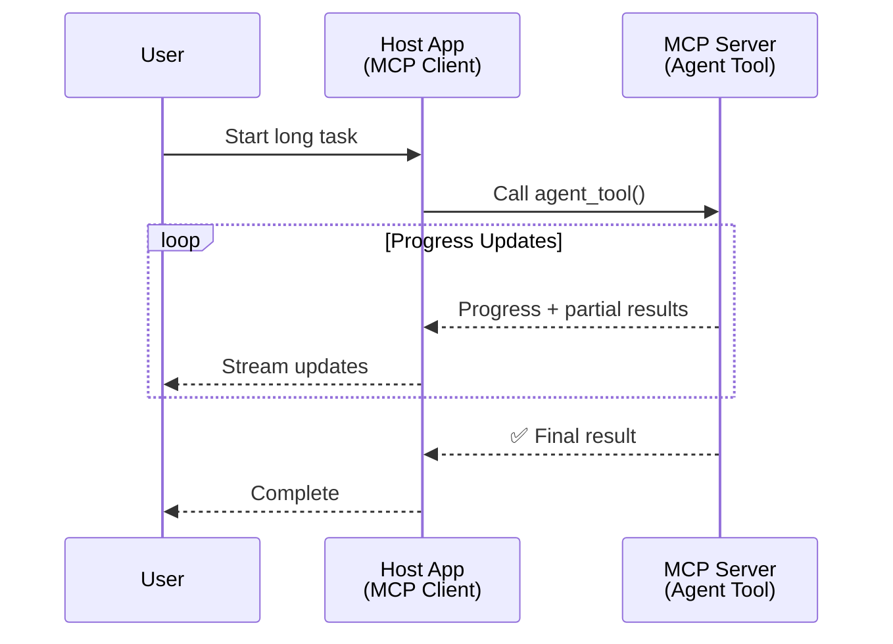
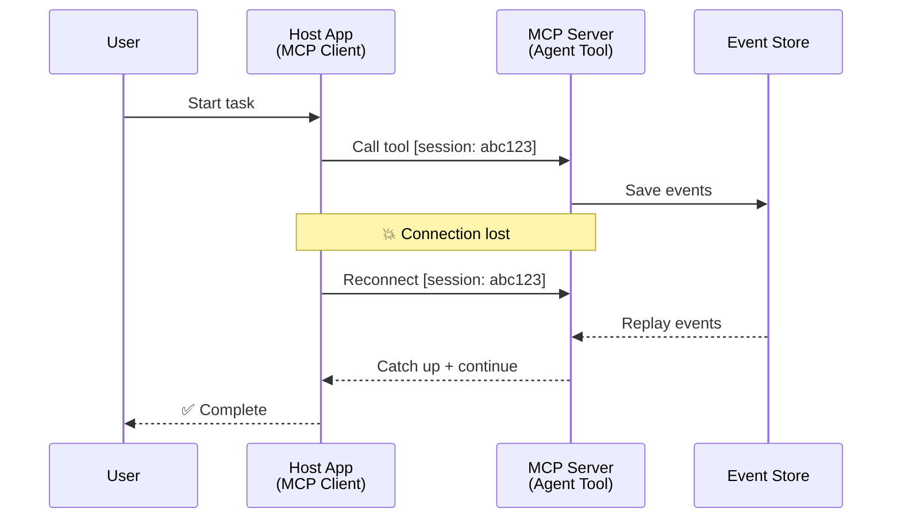
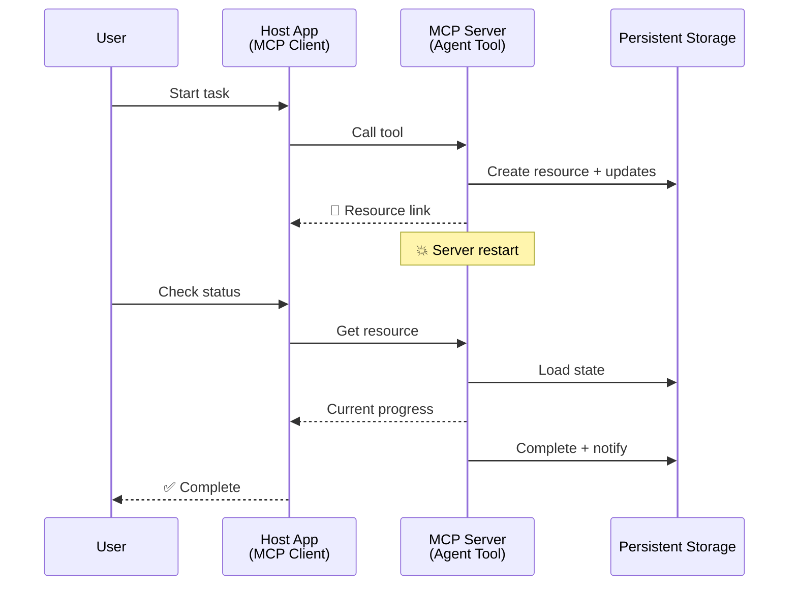
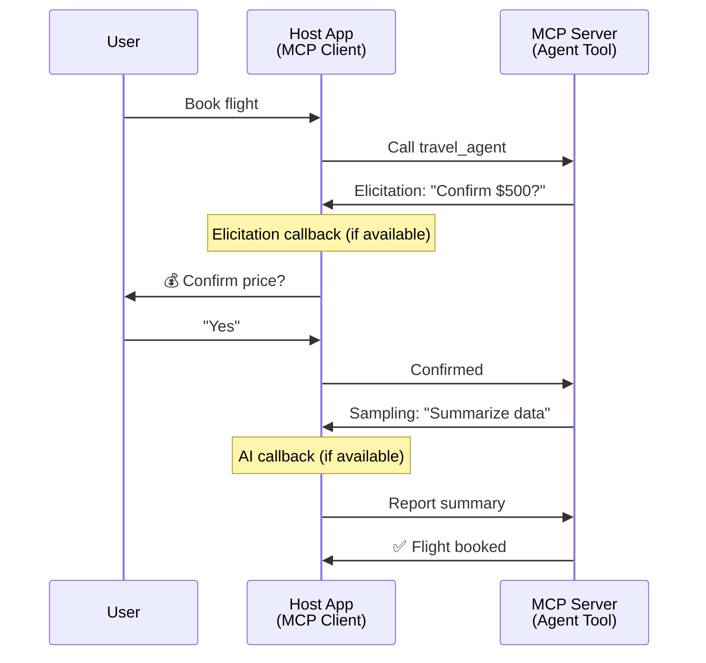
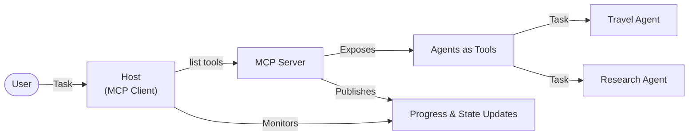

<!--
CO_OP_TRANSLATOR_METADATA:
{
  "original_hash": "5cc6836626047aa055e8960c8484a7d0",
  "translation_date": "2025-08-29T10:49:24+00:00",
  "source_file": "11-agentic-protocols/code_samples/mcp-agents/README.md",
  "language_code": "ar"
}
-->
# بناء أنظمة تواصل بين الوكلاء باستخدام MCP

> ملخص سريع - هل يمكنك بناء تواصل بين الوكلاء باستخدام MCP؟ نعم!

لقد تطور MCP بشكل كبير عن هدفه الأصلي "توفير السياق لنماذج اللغة الكبيرة". مع التحسينات الأخيرة التي تشمل [التدفقات القابلة للاستئناف](https://modelcontextprotocol.io/docs/concepts/transports#resumability-and-redelivery)، [الاستدعاء](https://modelcontextprotocol.io/specification/2025-06-18/client/elicitation)، [أخذ العينات](https://modelcontextprotocol.io/specification/2025-06-18/client/sampling)، والإشعارات ([التقدم](https://modelcontextprotocol.io/specification/2025-06-18/basic/utilities/progress) و[الموارد](https://modelcontextprotocol.io/specification/2025-06-18/schema#resourceupdatednotification))، أصبح MCP الآن يوفر أساسًا قويًا لبناء أنظمة تواصل معقدة بين الوكلاء.

## سوء الفهم حول الوكيل/الأداة

مع استكشاف المزيد من المطورين للأدوات ذات السلوكيات الوكالية (تشغيل لفترات طويلة، قد تتطلب إدخالًا إضافيًا أثناء التنفيذ، إلخ)، هناك سوء فهم شائع بأن MCP غير مناسب، ويرجع ذلك أساسًا إلى أن الأمثلة المبكرة لخاصية الأدوات ركزت على أنماط طلب-استجابة بسيطة.

هذا التصور أصبح قديمًا. لقد تم تعزيز مواصفات MCP بشكل كبير خلال الأشهر القليلة الماضية بقدرات تغلق الفجوة لبناء سلوكيات وكالية طويلة الأمد:

- **التدفق والنتائج الجزئية**: تحديثات تقدمية في الوقت الفعلي أثناء التنفيذ
- **القابلية للاستئناف**: يمكن للعملاء إعادة الاتصال والمتابعة بعد الانقطاع
- **الاستمرارية**: تبقى النتائج حتى بعد إعادة تشغيل الخادم (مثل الروابط إلى الموارد)
- **التفاعلية متعددة الأدوار**: إدخال تفاعلي أثناء التنفيذ عبر الاستدعاء وأخذ العينات

يمكن تركيب هذه الميزات لتمكين تطبيقات وكالية معقدة ومتعددة الوكلاء، يتم نشرها جميعًا على بروتوكول MCP.

للمرجعية، سنشير إلى الوكيل كـ "أداة" متاحة على خادم MCP. وهذا يعني وجود تطبيق مضيف ينفذ عميل MCP الذي ينشئ جلسة مع خادم MCP ويمكنه استدعاء الوكيل.

## ما الذي يجعل أداة MCP "وكالية"؟

قبل الغوص في التنفيذ، دعونا نحدد ما هي القدرات التحتية المطلوبة لدعم الوكلاء الذين يعملون لفترات طويلة.

> سنعرف الوكيل ككيان يمكنه العمل بشكل مستقل لفترات طويلة، وقادر على التعامل مع مهام معقدة قد تتطلب تفاعلات متعددة أو تعديلات بناءً على التغذية الراجعة في الوقت الفعلي.

### 1. التدفق والنتائج الجزئية

أنماط الطلب-الاستجابة التقليدية لا تعمل مع المهام طويلة الأمد. يحتاج الوكلاء إلى تقديم:

- تحديثات تقدمية في الوقت الفعلي
- نتائج وسيطة

**دعم MCP**: إشعارات تحديث الموارد تمكن من تدفق النتائج الجزئية، على الرغم من أن هذا يتطلب تصميمًا دقيقًا لتجنب التعارضات مع نموذج الطلب/الاستجابة 1:1 الخاص بـ JSON-RPC.

| الميزة                     | حالة الاستخدام                                                                                                                                                                       | دعم MCP                                                                                     |
| -------------------------- | ----------------------------------------------------------------------------------------------------------------------------------------------------------------------------------- | ------------------------------------------------------------------------------------------ |
| تحديثات التقدم في الوقت الفعلي | يطلب المستخدم مهمة ترحيل قاعدة بيانات. يقوم الوكيل بتدفق التقدم: "10% - تحليل التبعيات... 25% - تحويل ملفات TypeScript... 50% - تحديث الواردات..."                          | ✅ إشعارات التقدم                                                                          |
| النتائج الجزئية            | مهمة "إنشاء كتاب" تدفق النتائج الجزئية، مثل: 1) مخطط القصة، 2) قائمة الفصول، 3) كل فصل عند اكتماله. يمكن للمضيف الفحص أو الإلغاء أو إعادة التوجيه في أي مرحلة. | ✅ يمكن "تمديد" الإشعارات لتشمل النتائج الجزئية، انظر المقترحات على PR 383، 776          |

<div align="center" style="font-style: italic; font-size: 0.95em; margin-bottom: 0.5em;">
<strong>الشكل 1:</strong> يوضح هذا الرسم البياني كيف يقوم وكيل MCP بتدفق تحديثات التقدم في الوقت الفعلي والنتائج الجزئية إلى تطبيق المضيف أثناء مهمة طويلة الأمد، مما يمكن المستخدم من مراقبة التنفيذ في الوقت الفعلي.
</div>



### 2. القابلية للاستئناف

يجب أن يتعامل الوكلاء مع انقطاعات الشبكة بسلاسة:

- إعادة الاتصال بعد انقطاع (من جهة العميل)
- المتابعة من حيث توقفوا (إعادة تسليم الرسائل)

**دعم MCP**: يدعم نقل StreamableHTTP الخاص بـ MCP اليوم استئناف الجلسات وإعادة تسليم الرسائل باستخدام معرفات الجلسات ومعرفات الأحداث الأخيرة. الملاحظة المهمة هنا هي أن الخادم يجب أن ينفذ EventStore الذي يمكنه إعادة تشغيل الأحداث عند إعادة اتصال العميل.  
لاحظ أن هناك اقتراحًا مجتمعيًا (PR #975) يستكشف التدفقات القابلة للاستئناف غير المعتمدة على النقل.

| الميزة      | حالة الاستخدام                                                                                                                                                   | دعم MCP                                                                |
| ------------ | --------------------------------------------------------------------------------------------------------------------------------------------------------------- | ---------------------------------------------------------------------- |
| القابلية للاستئناف | ينقطع العميل أثناء مهمة طويلة الأمد. عند إعادة الاتصال، تستأنف الجلسة مع إعادة تشغيل الأحداث الفائتة، مما يتيح المتابعة بسلاسة من حيث توقفت. | ✅ نقل StreamableHTTP مع معرفات الجلسات، إعادة تشغيل الأحداث، وEventStore |

<div align="center" style="font-style: italic; font-size: 0.95em; margin-bottom: 0.5em;">
<strong>الشكل 2:</strong> يوضح هذا الرسم البياني كيف يمكن لنقل StreamableHTTP الخاص بـ MCP ومخزن الأحداث تمكين استئناف الجلسات بسلاسة: إذا انقطع العميل، يمكنه إعادة الاتصال وإعادة تشغيل الأحداث الفائتة، ومتابعة المهمة دون فقدان التقدم.
</div>



### 3. الاستمرارية

يحتاج الوكلاء الذين يعملون لفترات طويلة إلى حالة دائمة:

- تبقى النتائج حتى بعد إعادة تشغيل الخادم
- يمكن استرجاع الحالة خارج النطاق
- تتبع التقدم عبر الجلسات

**دعم MCP**: يدعم MCP الآن نوع إرجاع رابط الموارد لاستدعاءات الأدوات. اليوم، يمكن تصميم نمط محتمل يتمثل في إنشاء أداة مورد وإرجاع رابط المورد فورًا. يمكن للأداة متابعة معالجة المهمة في الخلفية وتحديث المورد. بدوره، يمكن للعميل اختيار استقصاء حالة هذا المورد للحصول على نتائج جزئية أو كاملة (بناءً على تحديثات الموارد التي يوفرها الخادم) أو الاشتراك في المورد للحصول على إشعارات التحديث.

أحد القيود هنا هو أن استقصاء الموارد أو الاشتراك للحصول على التحديثات يمكن أن يستهلك الموارد مع تأثيرات على النطاق. هناك اقتراح مجتمعي مفتوح (بما في ذلك #992) يستكشف إمكانية تضمين webhooks أو مشغلات يمكن للخادم استدعاؤها لإخطار تطبيق العميل/المضيف بالتحديثات.

| الميزة    | حالة الاستخدام                                                                                                                                        | دعم MCP                                                        |
| ---------- | ----------------------------------------------------------------------------------------------------------------------------------------------------- | ---------------------------------------------------------------- |
| الاستمرارية | يتعطل الخادم أثناء مهمة ترحيل البيانات. تبقى النتائج والتقدم بعد إعادة التشغيل، ويمكن للعميل التحقق من الحالة والمتابعة من المورد الدائم. | ✅ روابط الموارد مع التخزين الدائم وإشعارات الحالة             |

اليوم، النمط الشائع هو تصميم أداة تنشئ موردًا وتعيد رابط المورد فورًا. يمكن للأداة معالجة المهمة في الخلفية، إصدار إشعارات الموارد التي تعمل كتحديثات تقدمية أو تتضمن نتائج جزئية، وتحديث المحتوى في المورد حسب الحاجة.

<div align="center" style="font-style: italic; font-size: 0.95em; margin-bottom: 0.5em;">
<strong>الشكل 3:</strong> يوضح هذا الرسم البياني كيف تستخدم وكلاء MCP الموارد الدائمة وإشعارات الحالة لضمان بقاء المهام طويلة الأمد بعد إعادة تشغيل الخادم، مما يسمح للعملاء بالتحقق من التقدم واسترجاع النتائج حتى بعد الفشل.
</div>



### 4. التفاعلات متعددة الأدوار

غالبًا ما يحتاج الوكلاء إلى إدخال إضافي أثناء التنفيذ:

- توضيح أو موافقة بشرية
- مساعدة الذكاء الاصطناعي لاتخاذ قرارات معقدة
- تعديل ديناميكي للمعلمات

**دعم MCP**: مدعوم بالكامل عبر أخذ العينات (لإدخال الذكاء الاصطناعي) والاستدعاء (لإدخال البشر).

| الميزة                 | حالة الاستخدام                                                                                                                                     | دعم MCP                                           |
| ----------------------- | -------------------------------------------------------------------------------------------------------------------------------------------------- | ------------------------------------------------- |
| التفاعلات متعددة الأدوار | يطلب وكيل حجز السفر تأكيد السعر من المستخدم، ثم يطلب من الذكاء الاصطناعي تلخيص بيانات السفر قبل إتمام عملية الحجز. | ✅ الاستدعاء لإدخال البشر، أخذ العينات لإدخال الذكاء الاصطناعي |

<div align="center" style="font-style: italic; font-size: 0.95em; margin-bottom: 0.5em;">
<strong>الشكل 4:</strong> يوضح هذا الرسم البياني كيف يمكن لوكلاء MCP طلب إدخال بشري تفاعلي أو طلب مساعدة الذكاء الاصطناعي أثناء التنفيذ، مما يدعم سير العمل المعقد متعدد الأدوار مثل التأكيدات واتخاذ القرارات الديناميكية.
</div>



## تنفيذ وكلاء طويلة الأمد على MCP - نظرة عامة على الكود

كجزء من هذا المقال، نوفر [مستودع كود](https://github.com/victordibia/ai-tutorials/tree/main/MCP%20Agents) يحتوي على تنفيذ كامل لوكلاء طويلة الأمد باستخدام MCP Python SDK مع نقل StreamableHTTP لاستئناف الجلسات وإعادة تسليم الرسائل. يوضح التنفيذ كيف يمكن تركيب قدرات MCP لتمكين سلوكيات وكالية متطورة.

على وجه التحديد، ننفذ خادمًا يحتوي على أداتين رئيسيتين للوكيل:

- **وكيل السفر** - يحاكي خدمة حجز السفر مع تأكيد السعر عبر الاستدعاء
- **وكيل البحث** - ينفذ مهام البحث مع ملخصات بمساعدة الذكاء الاصطناعي عبر أخذ العينات

يظهر كلا الوكيلين تحديثات تقدمية في الوقت الفعلي، تأكيدات تفاعلية، وقدرات استئناف الجلسات الكاملة.

### مفاهيم التنفيذ الرئيسية

توضح الأقسام التالية تنفيذ الوكيل على جانب الخادم ومعالجة المضيف على جانب العميل لكل قدرة:

#### التدفق وتحديثات التقدم - حالة المهمة في الوقت الفعلي

يتيح التدفق للوكلاء تقديم تحديثات تقدمية في الوقت الفعلي أثناء المهام طويلة الأمد، مما يبقي المستخدمين على اطلاع بحالة المهمة والنتائج الوسيطة.

**تنفيذ الخادم (الوكيل يرسل إشعارات التقدم):**

```python
# From server/server.py - Travel agent sending progress updates
for i, step in enumerate(steps):
    await ctx.session.send_progress_notification(
        progress_token=ctx.request_id,
        progress=i * 25,
        total=100,
        message=step,
        related_request_id=str(ctx.request_id)
    )
    await anyio.sleep(2)  # Simulate work

# Alternative: Log messages for detailed step-by-step updates
await ctx.session.send_log_message(
    level="info",
    data=f"Processing step {current_step}/{steps} ({progress_percent}%)",
    logger="long_running_agent",
    related_request_id=ctx.request_id,
)
```

**تنفيذ العميل (المضيف يستقبل تحديثات التقدم):**

```python
# From client/client.py - Client handling real-time notifications
async def message_handler(message) -> None:
    if isinstance(message, types.ServerNotification):
        if isinstance(message.root, types.LoggingMessageNotification):
            console.print(f"📡 [dim]{message.root.params.data}[/dim]")
        elif isinstance(message.root, types.ProgressNotification):
            progress = message.root.params
            console.print(f"🔄 [yellow]{progress.message} ({progress.progress}/{progress.total})[/yellow]")

# Register message handler when creating session
async with ClientSession(
    read_stream, write_stream,
    message_handler=message_handler
) as session:
```

#### الاستدعاء - طلب إدخال المستخدم

يتيح الاستدعاء للوكلاء طلب إدخال المستخدم أثناء التنفيذ. هذا ضروري للتأكيدات أو التوضيحات أو الموافقات أثناء المهام طويلة الأمد.

**تنفيذ الخادم (الوكيل يطلب التأكيد):**

```python
# From server/server.py - Travel agent requesting price confirmation
elicit_result = await ctx.session.elicit(
    message=f"Please confirm the estimated price of $1200 for your trip to {destination}",
    requestedSchema=PriceConfirmationSchema.model_json_schema(),
    related_request_id=ctx.request_id,
)

if elicit_result and elicit_result.action == "accept":
    # Continue with booking
    logger.info(f"User confirmed price: {elicit_result.content}")
elif elicit_result and elicit_result.action == "decline":
    # Cancel the booking
    booking_cancelled = True
```

**تنفيذ العميل (المضيف يوفر رد الاستدعاء):**

```python
# From client/client.py - Client handling elicitation requests
async def elicitation_callback(context, params):
    console.print(f"💬 Server is asking for confirmation:")
    console.print(f"   {params.message}")

    response = console.input("Do you accept? (y/n): ").strip().lower()

    if response in ['y', 'yes']:
        return types.ElicitResult(
            action="accept",
            content={"confirm": True, "notes": "Confirmed by user"}
        )
    else:
        return types.ElicitResult(
            action="decline",
            content={"confirm": False, "notes": "Declined by user"}
        )

# Register the callback when creating the session
async with ClientSession(
    read_stream, write_stream,
    elicitation_callback=elicitation_callback
) as session:
```

#### أخذ العينات - طلب مساعدة الذكاء الاصطناعي

يتيح أخذ العينات للوكلاء طلب مساعدة نماذج اللغة الكبيرة لاتخاذ قرارات معقدة أو إنشاء محتوى أثناء التنفيذ. هذا يمكّن سير العمل الهجين بين البشر والذكاء الاصطناعي.

**تنفيذ الخادم (الوكيل يطلب مساعدة الذكاء الاصطناعي):**

```python
# From server/server.py - Research agent requesting AI summary
sampling_result = await ctx.session.create_message(
    messages=[
        SamplingMessage(
            role="user",
            content=TextContent(type="text", text=f"Please summarize the key findings for research on: {topic}")
        )
    ],
    max_tokens=100,
    related_request_id=ctx.request_id,
)

if sampling_result and sampling_result.content:
    if sampling_result.content.type == "text":
        sampling_summary = sampling_result.content.text
        logger.info(f"Received sampling summary: {sampling_summary}")
```

**تنفيذ العميل (المضيف يوفر رد أخذ العينات):**

```python
# From client/client.py - Client handling sampling requests
async def sampling_callback(context, params):
    message_text = params.messages[0].content.text if params.messages else 'No message'
    console.print(f"🧠 Server requested sampling: {message_text}")

    # In a real application, this could call an LLM API
    # For demo purposes, we provide a mock response
    mock_response = "Based on current research, MCP has evolved significantly..."

    return types.CreateMessageResult(
        role="assistant",
        content=types.TextContent(type="text", text=mock_response),
        model="interactive-client",
        stopReason="endTurn"
    )

# Register the callback when creating the session
async with ClientSession(
    read_stream, write_stream,
    sampling_callback=sampling_callback,
    elicitation_callback=elicitation_callback
) as session:
```

#### القابلية للاستئناف - استمرارية الجلسة عبر الانقطاعات

تضمن القابلية للاستئناف أن المهام طويلة الأمد للوكيل يمكن أن تبقى بعد انقطاعات العميل وتستمر بسلاسة عند إعادة الاتصال. يتم تنفيذ ذلك من خلال مخازن الأحداث ورموز الاستئناف.

**تنفيذ مخزن الأحداث (الخادم يحتفظ بحالة الجلسة):**

```python
# From server/event_store.py - Simple in-memory event store
class SimpleEventStore(EventStore):
    def __init__(self):
        self._events: list[tuple[StreamId, EventId, JSONRPCMessage]] = []
        self._event_id_counter = 0

    async def store_event(self, stream_id: StreamId, message: JSONRPCMessage) -> EventId:
        """Store an event and return its ID."""
        self._event_id_counter += 1
        event_id = str(self._event_id_counter)
        self._events.append((stream_id, event_id, message))
        return event_id

    async def replay_events_after(self, last_event_id: EventId, send_callback: EventCallback) -> StreamId | None:
        """Replay events after the specified ID for resumption."""
        # Find events after the last known event and replay them
        for _, event_id, message in self._events[start_index:]:
            await send_callback(EventMessage(message, event_id))

# From server/server.py - Passing event store to session manager
def create_server_app(event_store: Optional[EventStore] = None) -> Starlette:
    server = ResumableServer()

    # Create session manager with event store for resumption
    session_manager = StreamableHTTPSessionManager(
        app=server,
        event_store=event_store,  # Event store enables session resumption
        json_response=False,
        security_settings=security_settings,
    )

    return Starlette(routes=[Mount("/mcp", app=session_manager.handle_request)])

# Usage: Initialize with event store
event_store = SimpleEventStore()
app = create_server_app(event_store)
```

**بيانات العميل مع رمز الاستئناف (العميل يعيد الاتصال باستخدام الحالة المخزنة):**

```python
# From client/client.py - Client resumption with metadata
if existing_tokens and existing_tokens.get("resumption_token"):
    # Use existing resumption token to continue where we left off
    metadata = ClientMessageMetadata(
        resumption_token=existing_tokens["resumption_token"],
    )
else:
    # Create callback to save resumption token when received
    def enhanced_callback(token: str):
        protocol_version = getattr(session, 'protocol_version', None)
        token_manager.save_tokens(session_id, token, protocol_version, command, args)

    metadata = ClientMessageMetadata(
        on_resumption_token_update=enhanced_callback,
    )

# Send request with resumption metadata
result = await session.send_request(
    types.ClientRequest(
        types.CallToolRequest(
            method="tools/call",
            params=types.CallToolRequestParams(name=command, arguments=args)
        )
    ),
    types.CallToolResult,
    metadata=metadata,
)
```

يحافظ تطبيق المضيف على معرفات الجلسات ورموز الاستئناف محليًا، مما يمكنه من إعادة الاتصال بالجلسات الحالية دون فقدان التقدم أو الحالة.

### تنظيم الكود

<div align="center" style="font-style: italic; font-size: 0.95em; margin-bottom: 0.5em;">
<strong>الشكل 5:</strong> بنية نظام الوكيل المستند إلى MCP
</div>



**الملفات الرئيسية:**

- **`server/server.py`** - خادم MCP قابل للاستئناف مع وكلاء السفر والبحث الذين يظهرون الاستدعاء وأخذ العينات وتحديثات التقدم
- **`client/client.py`** - تطبيق مضيف تفاعلي مع دعم الاستئناف، معالجات ردود الاستدعاء، وإدارة الرموز
- **`server/event_store.py`** - تنفيذ مخزن الأحداث الذي يمكن من استئناف الجلسات وإعادة تسليم الرسائل

## التوسع إلى أنظمة متعددة الوكلاء على MCP

يمكن توسيع التنفيذ أعلاه إلى أنظمة متعددة الوكلاء من خلال تعزيز ذكاء تطبيق المضيف ونطاقه:

- **تفكيك المهام الذكي**: يحلل المضيف طلبات المستخدم المعقدة ويقسمها إلى مهام فرعية لوكلاء متخصصين مختلفين
- **تنسيق متعدد الخوادم**: يحافظ المضيف على اتصالات مع خوادم MCP متعددة، كل منها يعرض قدرات وكلاء مختلفة
- **إدارة حالة المهام**: يتتبع المضيف التقدم عبر مهام الوكلاء المتزامنة المتعددة، معالجًا التبعيات والتسلسل
- **المرونة وإعادة المحاولات**: يدير المضيف الفشل، ينفذ منطق إعادة المحاولة، ويعيد توجيه المهام عندما تصبح الوكلاء غير متاحة
- **تركيب النتائج**: يجمع المضيف المخرجات من وكلاء متعددين في نتائج نهائية متماسكة

يتطور المضيف من عميل بسيط إلى منسق ذكي، ينسق قدرات الوكلاء الموزعة مع الحفاظ على نفس أساس بروتوكول MCP.

## الخاتمة

تمكن قدرات MCP المحسنة - إشعارات الموارد، الاستدعاء/أخذ العينات، التدفقات القابلة للاستئناف، والموارد الدائمة - من تفاعلات معقدة بين الوكلاء مع الحفاظ على بساطة البروتوكول.

## البدء

جاهز لبناء نظام وكيل إلى وكيل خاص بك؟ اتبع هذه الخطوات:

### 1. تشغيل العرض التوضيحي

```bash
# Start the server with event store for resumption
python -m server.server --port 8006

# In another terminal, run the interactive client
python -m client.client --url http://127.0.0.1:8006/mcp
```

**الأوامر المتاحة في الوضع التفاعلي:**

- `travel_agent` - حجز السفر مع تأكيد السعر عبر الاستدعاء
- `research_agent` - البحث في المواضيع مع ملخصات بمساعدة الذكاء الاصطناعي عبر أخذ العينات
- `list` - عرض جميع الأدوات المتاحة
- `clean-tokens` - مسح رموز الاستئناف
- `help` - عرض مساعدة الأوامر التفصيلية
- `quit` - الخروج من العميل

### 2. اختبار قدرات الاستئناف

- ابدأ وكيلًا طويل الأمد (مثل `travel_agent`)
- قم بمقاطعة العميل أثناء التنفيذ (Ctrl+C)
- أعد تشغيل العميل - سيستأنف تلقائيًا من حيث توقف

### 3. استكشاف وتوسيع

- **استكشاف الأمثلة**: تحقق من هذا [mcp-agents](https://github.com/victordibia/ai-tutorials/tree/main/MCP%20Agents)
- **الانضمام إلى المجتمع**: شارك في مناقشات MCP على GitHub
- **التجربة**: ابدأ بمهمة طويلة الأمد بسيطة وأضف تدريجيًا التدفق، القابلية للاستئناف، وتنسيق الوكلاء المتعددين

يوضح هذا كيف يمكن لـ MCP تمكين سلوكيات الوكلاء الذكية مع الحفاظ على بساطة الأدوات.

بشكل عام، تتطور مواصفات بروتوكول MCP بسرعة؛ يُشجع القارئ على مراجعة موقع الوثائق الرسمي للحصول على أحدث التحديثات - https://modelcontextprotocol.io/introduction

---

**إخلاء المسؤولية**:  
تمت ترجمة هذا المستند باستخدام خدمة الترجمة بالذكاء الاصطناعي [Co-op Translator](https://github.com/Azure/co-op-translator). بينما نسعى لتحقيق الدقة، يرجى العلم أن الترجمات الآلية قد تحتوي على أخطاء أو معلومات غير دقيقة. يجب اعتبار المستند الأصلي بلغته الأصلية هو المصدر الموثوق. للحصول على معلومات حساسة أو هامة، يُوصى بالاستعانة بترجمة بشرية احترافية. نحن غير مسؤولين عن أي سوء فهم أو تفسيرات خاطئة تنشأ عن استخدام هذه الترجمة.