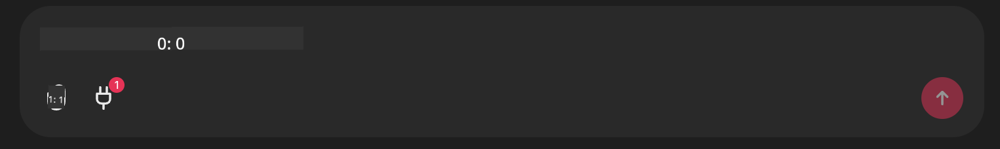

<!--
CO_OP_TRANSLATOR_METADATA:
{
  "original_hash": "9bf0395cbc541ce8db2a9699c8678dfc",
  "translation_date": "2025-07-12T14:20:04+00:00",
  "source_file": "11-mcp/code_samples/github-mcp/README.md",
  "language_code": "ar"
}
-->
# مثال على خادم Github MCP

## الوصف

هذا عرض توضيحي تم إنشاؤه لمسابقة AI Agents Hackathon التي استضافها Microsoft Reactor.

يُستخدم هذا الأداة لتوصية مشاريع الهاكاثون بناءً على مستودعات Github الخاصة بالمستخدم.  
يتم ذلك من خلال:

1. **Github Agent** - استخدام خادم Github MCP لاسترجاع المستودعات والمعلومات المتعلقة بها.  
2. **Hackathon Agent** - يأخذ البيانات من Github Agent ويبتكر أفكار مشاريع هاكاثون إبداعية بناءً على المشاريع، اللغات التي يستخدمها المستخدم ومسارات المشاريع في مسابقة AI Agents hackathon.  
3. **Events Agent** - بناءً على اقتراحات Hackathon Agent، يقوم Events Agent بتوصية الفعاليات ذات الصلة من سلسلة AI Agent Hackathon.

## تشغيل الكود

### متغيرات البيئة

يستخدم هذا العرض التوضيحي Azure Open AI Service، Semantic Kernel، خادم Github MCP و Azure AI Search.

تأكد من تعيين متغيرات البيئة المناسبة لاستخدام هذه الأدوات:

```python
AZURE_OPENAI_CHAT_DEPLOYMENT_NAME=""
AZURE_OPENAI_EMBEDDING_DEPLOYMENT_NAME=""
AZURE_OPENAI_ENDPOINT=""
AZURE_OPENAI_API_KEY=""
AZURE_OPENAI_API_VERSION=""
AZURE_SEARCH_SERVICE_ENDPOINT=""
AZURE_SEARCH_API_KEY=""
```

## تشغيل خادم Chainlit

للاتصال بخادم MCP، يستخدم هذا العرض التوضيحي Chainlit كواجهة دردشة.

لتشغيل الخادم، استخدم الأمر التالي في الطرفية:

```bash
chainlit run app.py -w
```

سيبدأ هذا خادم Chainlit على `localhost:8000` بالإضافة إلى ملء فهرس Azure AI Search الخاص بك بمحتوى `event-descriptions.md`.

## الاتصال بخادم MCP

للاتصال بخادم Github MCP، اختر أيقونة "القابس" أسفل مربع الدردشة "Type your message here..":



من هناك يمكنك النقر على "Connect an MCP" لإضافة الأمر للاتصال بخادم Github MCP:

```bash
npx -y @modelcontextprotocol/server-github --env GITHUB_PERSONAL_ACCESS_TOKEN=[YOUR PERSONAL ACCESS TOKEN]
```

استبدل "[YOUR PERSONAL ACCESS TOKEN]" برمز الوصول الشخصي الخاص بك.

بعد الاتصال، يجب أن ترى (1) بجانب أيقونة القابس لتأكيد الاتصال. إذا لم يحدث ذلك، حاول إعادة تشغيل خادم chainlit باستخدام `chainlit run app.py -w`.

## استخدام العرض التوضيحي

لبدء سير عمل الوكيل لتوصية مشاريع الهاكاثون، يمكنك كتابة رسالة مثل:

"Recommend hackathon projects for the Github user koreyspace"

سيقوم Router Agent بتحليل طلبك وتحديد أفضل مجموعة من الوكلاء (GitHub، Hackathon، وEvents) المناسبة لمعالجة استفسارك. يعمل الوكلاء معًا لتقديم توصيات شاملة بناءً على تحليل مستودعات GitHub، ابتكار المشاريع، والفعاليات التقنية ذات الصلة.

**إخلاء المسؤولية**:  
تمت ترجمة هذا المستند باستخدام خدمة الترجمة الآلية [Co-op Translator](https://github.com/Azure/co-op-translator). بينما نسعى لتحقيق الدقة، يرجى العلم أن الترجمات الآلية قد تحتوي على أخطاء أو عدم دقة. يجب اعتبار المستند الأصلي بلغته الأصلية المصدر الموثوق به. للمعلومات الهامة، يُنصح بالترجمة البشرية المهنية. نحن غير مسؤولين عن أي سوء فهم أو تفسير ناتج عن استخدام هذه الترجمة.