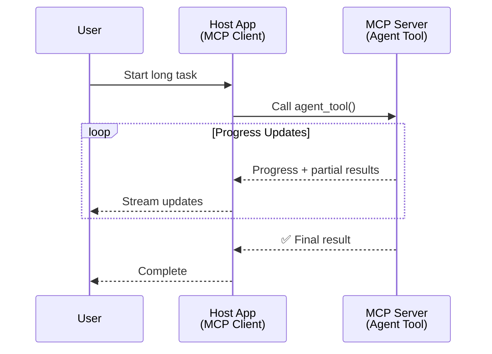
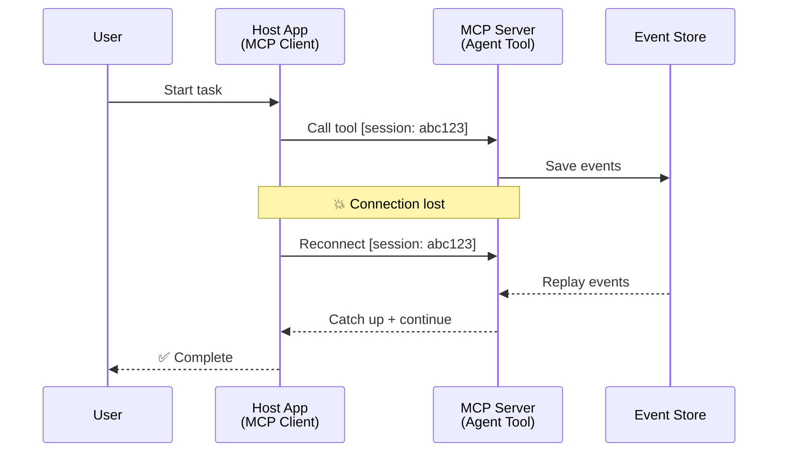
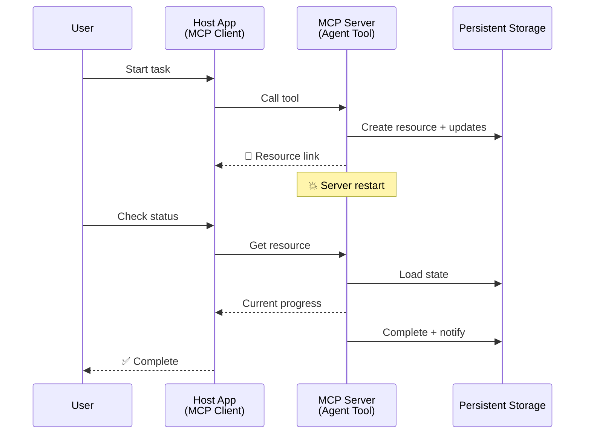
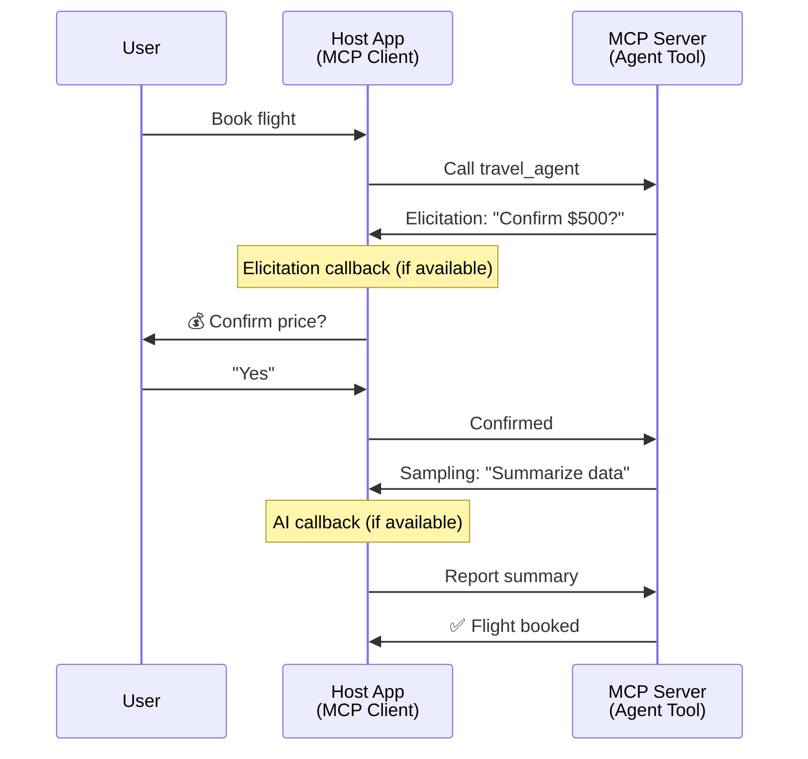

<!--
CO_OP_TRANSLATOR_METADATA:
{
  "original_hash": "5cc6836626047aa055e8960c8484a7d0",
  "translation_date": "2025-08-21T14:17:17+00:00",
  "source_file": "11-mcp/code_samples/mcp-agents/README.md",
  "language_code": "ar"
}
-->
# بناء أنظمة تواصل بين الوكلاء باستخدام MCP

> خلاصة - هل يمكنك بناء تواصل بين الوكلاء باستخدام MCP؟ نعم!

لقد تطور MCP بشكل كبير عن هدفه الأصلي "توفير السياق لنماذج اللغة الكبيرة". مع التحسينات الأخيرة التي تشمل [التدفقات القابلة للاستئناف](https://modelcontextprotocol.io/docs/concepts/transports#resumability-and-redelivery)، [الاستنباط](https://modelcontextprotocol.io/specification/2025-06-18/client/elicitation)، [أخذ العينات](https://modelcontextprotocol.io/specification/2025-06-18/client/sampling)، والإشعارات ([التقدم](https://modelcontextprotocol.io/specification/2025-06-18/basic/utilities/progress) و[الموارد](https://modelcontextprotocol.io/specification/2025-06-18/schema#resourceupdatednotification))، أصبح MCP الآن يوفر أساسًا قويًا لبناء أنظمة تواصل معقدة بين الوكلاء.

## سوء الفهم حول الوكيل/الأداة

مع استكشاف المزيد من المطورين للأدوات ذات السلوكيات الوكيلة (تشغيل لفترات طويلة، قد تتطلب إدخالًا إضافيًا أثناء التنفيذ، إلخ)، هناك سوء فهم شائع بأن MCP غير مناسب، ويرجع ذلك أساسًا إلى أن الأمثلة المبكرة لخاصية الأدوات ركزت على أنماط الطلب-الاستجابة البسيطة.

هذا التصور أصبح قديمًا. لقد تم تعزيز مواصفات MCP بشكل كبير خلال الأشهر القليلة الماضية بقدرات تغلق الفجوة لبناء سلوكيات وكيلة طويلة الأمد:

- **التدفق والنتائج الجزئية**: تحديثات تقدمية في الوقت الفعلي أثناء التنفيذ
- **القابلية للاستئناف**: يمكن للعملاء إعادة الاتصال والمتابعة بعد الانقطاع
- **الاستمرارية**: النتائج تبقى محفوظة حتى بعد إعادة تشغيل الخادم (مثل الروابط إلى الموارد)
- **التفاعلية متعددة الأدوار**: إدخال تفاعلي أثناء التنفيذ عبر الاستنباط وأخذ العينات

يمكن تركيب هذه الميزات لتمكين تطبيقات وكيلة معقدة ومتعددة الوكلاء، يتم نشرها جميعًا على بروتوكول MCP.

للتوضيح، سنشير إلى الوكيل كـ "أداة" متاحة على خادم MCP. وهذا يعني وجود تطبيق مضيف ينفذ عميل MCP يقوم بإنشاء جلسة مع خادم MCP ويمكنه استدعاء الوكيل.

## ما الذي يجعل أداة MCP "وكيلة"؟

قبل الغوص في التنفيذ، دعونا نحدد ما هي القدرات التحتية المطلوبة لدعم الوكلاء طويلة الأمد.

> سنعرف الوكيل ككيان يمكنه العمل بشكل مستقل لفترات طويلة، وقادر على التعامل مع مهام معقدة قد تتطلب تفاعلات متعددة أو تعديلات بناءً على التغذية الراجعة في الوقت الفعلي.

### 1. التدفق والنتائج الجزئية

أنماط الطلب-الاستجابة التقليدية لا تعمل مع المهام طويلة الأمد. يحتاج الوكلاء إلى تقديم:

- تحديثات تقدمية في الوقت الفعلي
- نتائج وسيطة

**دعم MCP**: إشعارات تحديث الموارد تمكن من تدفق النتائج الجزئية، على الرغم من أن هذا يتطلب تصميمًا دقيقًا لتجنب التعارضات مع نموذج الطلب/الاستجابة 1:1 الخاص بـ JSON-RPC.

| الميزة                     | حالة الاستخدام                                                                                                                                                                       | دعم MCP                                                                                     |
| -------------------------- | ------------------------------------------------------------------------------------------------------------------------------------------------------------------------------------ | ------------------------------------------------------------------------------------------ |
| تحديثات التقدم في الوقت الفعلي | يطلب المستخدم مهمة ترحيل قاعدة بيانات. يقوم الوكيل بتدفق التقدم: "10% - تحليل التبعيات... 25% - تحويل ملفات TypeScript... 50% - تحديث الواردات..."                          | ✅ إشعارات التقدم                                                                          |
| النتائج الجزئية            | مهمة "إنشاء كتاب" تقوم بتدفق النتائج الجزئية، مثل: 1) مخطط القصة، 2) قائمة الفصول، 3) كل فصل عند اكتماله. يمكن للمضيف فحص، إلغاء، أو إعادة توجيه في أي مرحلة. | ✅ يمكن "تمديد" الإشعارات لتشمل النتائج الجزئية، انظر المقترحات على PR 383، 776          |

<strong>الشكل 1:</strong> يوضح هذا الرسم البياني كيف يقوم وكيل MCP بتدفق تحديثات التقدم في الوقت الفعلي والنتائج الجزئية إلى التطبيق المضيف أثناء مهمة طويلة الأمد، مما يمكن المستخدم من مراقبة التنفيذ في الوقت الفعلي.

### 2. القابلية للاستئناف

يجب أن يتعامل الوكلاء مع انقطاعات الشبكة بسلاسة:

- إعادة الاتصال بعد انقطاع العميل
- المتابعة من حيث توقفت (إعادة تسليم الرسائل)

**دعم MCP**: يدعم نقل StreamableHTTP في MCP اليوم استئناف الجلسات وإعادة تسليم الرسائل باستخدام معرفات الجلسات ومعرفات الأحداث الأخيرة. الملاحظة المهمة هنا هي أن الخادم يجب أن ينفذ EventStore الذي يمكنه إعادة تشغيل الأحداث عند إعادة اتصال العميل.  
لاحظ أن هناك اقتراحًا مجتمعيًا (PR #975) يستكشف التدفقات القابلة للاستئناف غير المعتمدة على النقل.

| الميزة      | حالة الاستخدام                                                                                                                                                   | دعم MCP                                                                |
| ------------ | ---------------------------------------------------------------------------------------------------------------------------------------------------------- | -------------------------------------------------------------------------- |
| القابلية للاستئناف | ينقطع العميل أثناء مهمة طويلة الأمد. عند إعادة الاتصال، تستأنف الجلسة مع إعادة تشغيل الأحداث الفائتة، مما يتيح الاستمرار بسلاسة من حيث توقفت. | ✅ نقل StreamableHTTP مع معرفات الجلسات، إعادة تشغيل الأحداث، وEventStore |

<strong>الشكل 2:</strong> يوضح هذا الرسم البياني كيف يمكن لنقل StreamableHTTP وEventStore في MCP تمكين استئناف الجلسات بسلاسة: إذا انقطع العميل، يمكنه إعادة الاتصال وإعادة تشغيل الأحداث الفائتة، مما يتيح استمرار المهمة دون فقدان التقدم.

### 3. الاستمرارية

تحتاج الوكلاء طويلة الأمد إلى حالة مستمرة:

- النتائج تبقى محفوظة بعد إعادة تشغيل الخادم
- يمكن استرجاع الحالة خارج النطاق
- تتبع التقدم عبر الجلسات

**دعم MCP**: يدعم MCP الآن نوع إرجاع رابط الموارد لاستدعاءات الأدوات. اليوم، يمكن تصميم أداة تقوم بإنشاء مورد وتعيد فورًا رابطًا لهذا المورد. يمكن للأداة متابعة معالجة المهمة في الخلفية وتحديث المورد. بدوره، يمكن للعميل اختيار استقصاء حالة هذا المورد للحصول على نتائج جزئية أو كاملة (بناءً على تحديثات الموارد التي يوفرها الخادم) أو الاشتراك في المورد لتلقي إشعارات التحديث.

أحد القيود هنا هو أن استقصاء الموارد أو الاشتراك في التحديثات يمكن أن يستهلك الموارد مع تأثيرات على النطاق. هناك اقتراح مجتمعي مفتوح (بما في ذلك #992) يستكشف إمكانية تضمين webhooks أو مشغلات يمكن للخادم استدعاؤها لإخطار العميل/التطبيق المضيف بالتحديثات.

| الميزة    | حالة الاستخدام                                                                                                                                        | دعم MCP                                                        |
| ---------- | ----------------------------------------------------------------------------------------------------------------------------------------------- | ------------------------------------------------------------------ |
| الاستمرارية | يتعطل الخادم أثناء مهمة ترحيل البيانات. تبقى النتائج والتقدم محفوظة بعد إعادة التشغيل، ويمكن للعميل التحقق من الحالة والمتابعة من المورد المستمر. | ✅ روابط الموارد مع التخزين المستمر وإشعارات الحالة |

اليوم، النمط الشائع هو تصميم أداة تقوم بإنشاء مورد وتعيد فورًا رابطًا لهذا المورد. يمكن للأداة معالجة المهمة في الخلفية، إصدار إشعارات الموارد التي تعمل كتحديثات تقدمية أو تتضمن نتائج جزئية، وتحديث المحتوى في المورد حسب الحاجة.

<strong>الشكل 3:</strong> يوضح هذا الرسم البياني كيف تستخدم وكلاء MCP الموارد المستمرة وإشعارات الحالة لضمان بقاء المهام طويلة الأمد بعد إعادة تشغيل الخادم، مما يسمح للعملاء بالتحقق من التقدم واسترجاع النتائج حتى بعد الفشل.

### 4. التفاعلات متعددة الأدوار

غالبًا ما يحتاج الوكلاء إلى إدخال إضافي أثناء التنفيذ:

- توضيح أو موافقة بشرية
- مساعدة الذكاء الاصطناعي لاتخاذ قرارات معقدة
- تعديل ديناميكي للمعلمات

**دعم MCP**: مدعوم بالكامل عبر أخذ العينات (لإدخال الذكاء الاصطناعي) والاستنباط (لإدخال البشر).

| الميزة                 | حالة الاستخدام                                                                                                                                     | دعم MCP                                           |
| ----------------------- | -------------------------------------------------------------------------------------------------------------------------------------------- | ----------------------------------------------------- |
| التفاعلات متعددة الأدوار | وكيل حجز السفر يطلب تأكيد السعر من المستخدم، ثم يطلب من الذكاء الاصطناعي تلخيص بيانات السفر قبل إكمال عملية الحجز. | ✅ الاستنباط لإدخال البشر، أخذ العينات لإدخال الذكاء الاصطناعي |

<strong>الشكل 4:</strong> يوضح هذا الرسم البياني كيف يمكن لوكلاء MCP طلب إدخال بشري تفاعلي أو مساعدة الذكاء الاصطناعي أثناء التنفيذ، مما يدعم سير العمل المعقد متعدد الأدوار مثل التأكيدات واتخاذ القرارات الديناميكية.

## تنفيذ الوكلاء طويلة الأمد على MCP - نظرة عامة على الكود

كجزء من هذه المقالة، نقدم [مستودع كود](https://github.com/victordibia/ai-tutorials/tree/main/MCP%20Agents) يحتوي على تنفيذ كامل للوكلاء طويلة الأمد باستخدام MCP Python SDK مع نقل StreamableHTTP لاستئناف الجلسات وإعادة تسليم الرسائل. يوضح التنفيذ كيف يمكن تركيب قدرات MCP لتمكين سلوكيات وكيلة متطورة.

...

**إخلاء المسؤولية**:  
تمت ترجمة هذا المستند باستخدام خدمة الترجمة الآلية [Co-op Translator](https://github.com/Azure/co-op-translator). بينما نسعى لتحقيق الدقة، يرجى العلم أن الترجمات الآلية قد تحتوي على أخطاء أو عدم دقة. يجب اعتبار المستند الأصلي بلغته الأصلية هو المصدر الموثوق. للحصول على معلومات حساسة أو هامة، يُوصى بالاستعانة بترجمة بشرية احترافية. نحن غير مسؤولين عن أي سوء فهم أو تفسيرات خاطئة تنشأ عن استخدام هذه الترجمة.