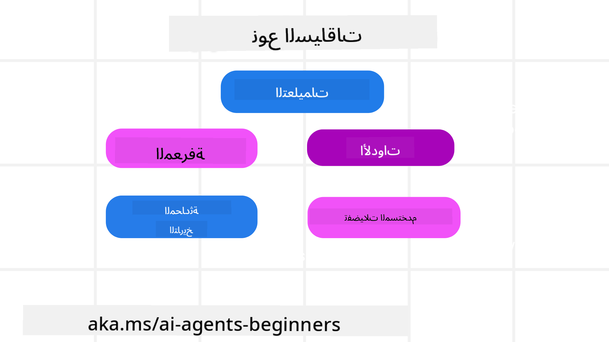

<!--
CO_OP_TRANSLATOR_METADATA:
{
  "original_hash": "cb7e50f471905ce6fdb92a30269a7a98",
  "translation_date": "2025-09-04T09:44:41+00:00",
  "source_file": "12-context-engineering/README.md",
  "language_code": "ar"
}
-->
# هندسة السياق لوكلاء الذكاء الاصطناعي

> _(اضغط على الصورة أعلاه لمشاهدة فيديو الدرس)_

فهم تعقيد التطبيق الذي تقوم ببناء وكيل ذكاء اصطناعي له أمر مهم لضمان موثوقيته. نحن بحاجة إلى بناء وكلاء ذكاء اصطناعي يديرون المعلومات بفعالية لتلبية احتياجات معقدة تتجاوز مجرد هندسة التوجيهات.

في هذا الدرس، سنستعرض ما هي هندسة السياق ودورها في بناء وكلاء الذكاء الاصطناعي.

## المقدمة

سيتناول هذا الدرس:

• **ما هي هندسة السياق** ولماذا تختلف عن هندسة التوجيهات.

• **استراتيجيات فعالة لهندسة السياق**، بما في ذلك كيفية كتابة، اختيار، ضغط، وعزل المعلومات.

• **الأخطاء الشائعة في السياق** التي قد تعرقل أداء وكيل الذكاء الاصطناعي وكيفية إصلاحها.

## أهداف التعلم

بعد إكمال هذا الدرس، ستتمكن من:

• **تعريف هندسة السياق** والتمييز بينها وبين هندسة التوجيهات.

• **تحديد المكونات الرئيسية للسياق** في تطبيقات النماذج اللغوية الكبيرة (LLM).

• **تطبيق استراتيجيات كتابة، اختيار، ضغط، وعزل السياق** لتحسين أداء الوكيل.

• **التعرف على الأخطاء الشائعة في السياق** مثل التسمم، التشتيت، الارتباك، والتضارب، وتطبيق تقنيات التخفيف.

## ما هي هندسة السياق؟

بالنسبة لوكلاء الذكاء الاصطناعي، السياق هو ما يوجه تخطيط الوكيل لاتخاذ إجراءات معينة. هندسة السياق هي ممارسة ضمان أن يكون لدى وكيل الذكاء الاصطناعي المعلومات الصحيحة لإكمال الخطوة التالية من المهمة. نافذة السياق محدودة الحجم، لذا كمنشئي وكلاء، نحتاج إلى بناء أنظمة وعمليات لإدارة إضافة، إزالة، وتكثيف المعلومات داخل نافذة السياق.

### هندسة التوجيهات مقابل هندسة السياق

تركز هندسة التوجيهات على مجموعة ثابتة من التعليمات لتوجيه وكلاء الذكاء الاصطناعي بشكل فعال بمجموعة من القواعد. أما هندسة السياق فتتعلق بكيفية إدارة مجموعة ديناميكية من المعلومات، بما في ذلك التوجيه الأولي، لضمان أن يكون لدى وكيل الذكاء الاصطناعي ما يحتاجه مع مرور الوقت. الفكرة الرئيسية في هندسة السياق هي جعل هذه العملية قابلة للتكرار والموثوقية.

### أنواع السياق

من المهم أن نتذكر أن السياق ليس شيئًا واحدًا فقط. المعلومات التي يحتاجها وكيل الذكاء الاصطناعي يمكن أن تأتي من مصادر متنوعة، ويقع على عاتقنا ضمان وصول الوكيل إلى هذه المصادر:

تشمل أنواع السياق التي قد يحتاج وكيل الذكاء الاصطناعي إلى إدارتها:

• **التعليمات:** هذه بمثابة "القواعد" الخاصة بالوكيل – التوجيهات، رسائل النظام، أمثلة قليلة (توضيح كيفية القيام بشيء ما)، ووصف الأدوات التي يمكنه استخدامها. هنا يتداخل تركيز هندسة التوجيهات مع هندسة السياق.

• **المعرفة:** تشمل الحقائق، المعلومات المسترجعة من قواعد البيانات، أو الذكريات طويلة الأمد التي جمعها الوكيل. يتضمن ذلك دمج نظام استرجاع معزز بالتوليد (RAG) إذا كان الوكيل يحتاج إلى الوصول إلى مصادر معرفة وقواعد بيانات مختلفة.

• **الأدوات:** تشمل تعريفات الوظائف الخارجية، واجهات برمجة التطبيقات (APIs)، وخوادم MCP التي يمكن للوكيل استدعاؤها، بالإضافة إلى التغذية الراجعة (النتائج) التي يحصل عليها من استخدامها.

• **تاريخ المحادثة:** الحوار الجاري مع المستخدم. مع مرور الوقت، تصبح هذه المحادثات أطول وأكثر تعقيدًا مما يعني أنها تشغل مساحة في نافذة السياق.

• **تفضيلات المستخدم:** المعلومات التي يتم تعلمها حول ما يحبه أو يكرهه المستخدم مع مرور الوقت. يمكن استدعاء هذه المعلومات عند اتخاذ قرارات رئيسية لمساعدة المستخدم.

## استراتيجيات فعالة لهندسة السياق

### استراتيجيات التخطيط

تبدأ هندسة السياق الجيدة بتخطيط جيد. إليك نهجًا يساعدك على التفكير في كيفية تطبيق مفهوم هندسة السياق:

1. **تحديد النتائج بوضوح** - يجب أن تكون نتائج المهام التي سيتم تعيينها لوكلاء الذكاء الاصطناعي محددة بوضوح. أجب عن السؤال - "كيف سيبدو العالم عندما ينتهي وكيل الذكاء الاصطناعي من مهمته؟" بمعنى آخر، ما هو التغيير أو المعلومات أو الاستجابة التي يجب أن يحصل عليها المستخدم بعد التفاعل مع وكيل الذكاء الاصطناعي.

2. **رسم خريطة السياق** - بمجرد تحديد نتائج وكيل الذكاء الاصطناعي، تحتاج إلى الإجابة على سؤال "ما هي المعلومات التي يحتاجها وكيل الذكاء الاصطناعي لإكمال هذه المهمة؟". بهذه الطريقة يمكنك البدء في رسم خريطة السياق لتحديد مكان وجود تلك المعلومات.

3. **إنشاء خطوط أنابيب السياق** - الآن بعد أن عرفت مكان وجود المعلومات، تحتاج إلى الإجابة على سؤال "كيف سيحصل الوكيل على هذه المعلومات؟". يمكن القيام بذلك بطرق متنوعة بما في ذلك RAG، استخدام خوادم MCP وأدوات أخرى.

### استراتيجيات عملية

التخطيط مهم، ولكن بمجرد أن تبدأ المعلومات في التدفق إلى نافذة السياق الخاصة بالوكيل، نحتاج إلى استراتيجيات عملية لإدارتها:

#### إدارة السياق

بينما ستتم إضافة بعض المعلومات إلى نافذة السياق تلقائيًا، فإن هندسة السياق تتعلق باتخاذ دور أكثر نشاطًا تجاه هذه المعلومات، ويمكن القيام بذلك من خلال بعض الاستراتيجيات:

1. **دفتر ملاحظات الوكيل**  
   يسمح للوكيل بتدوين ملاحظات حول المعلومات ذات الصلة بالمهام الحالية وتفاعلات المستخدم خلال جلسة واحدة. يجب أن يكون هذا خارج نافذة السياق في ملف أو كائن وقت تشغيل يمكن للوكيل استرجاعه لاحقًا خلال هذه الجلسة إذا لزم الأمر.

2. **الذكريات**  
   دفاتر الملاحظات جيدة لإدارة المعلومات خارج نافذة السياق لجلسة واحدة. الذكريات تمكن الوكلاء من تخزين واسترجاع المعلومات ذات الصلة عبر جلسات متعددة. يمكن أن تشمل الملخصات، تفضيلات المستخدم، والتغذية الراجعة للتحسينات المستقبلية.

3. **ضغط السياق**  
   عندما تنمو نافذة السياق وتقترب من حدها، يمكن استخدام تقنيات مثل التلخيص والتقليم. يشمل ذلك الاحتفاظ فقط بالمعلومات الأكثر صلة أو إزالة الرسائل القديمة.

4. **أنظمة الوكلاء المتعددة**  
   تطوير نظام وكلاء متعدد هو شكل من أشكال هندسة السياق لأن لكل وكيل نافذة سياق خاصة به. كيفية مشاركة وتمرير هذا السياق بين الوكلاء هو أمر آخر يجب التخطيط له عند بناء هذه الأنظمة.

5. **بيئات الحماية**  
   إذا كان الوكيل بحاجة إلى تشغيل بعض الأكواد أو معالجة كميات كبيرة من المعلومات في مستند، فقد يتطلب ذلك عددًا كبيرًا من الرموز لمعالجة النتائج. بدلاً من تخزين كل هذا في نافذة السياق، يمكن للوكيل استخدام بيئة حماية قادرة على تشغيل هذا الكود وقراءة النتائج والمعلومات ذات الصلة فقط.

6. **كائنات حالة وقت التشغيل**  
   يتم ذلك عن طريق إنشاء حاويات معلومات لإدارة الحالات التي يحتاج فيها الوكيل إلى الوصول إلى معلومات معينة. بالنسبة لمهمة معقدة، سيمكن ذلك الوكيل من تخزين نتائج كل خطوة فرعية على حدة، مما يسمح للسياق بالبقاء متصلاً فقط بتلك الخطوة الفرعية المحددة.

### مثال على هندسة السياق

لنفترض أننا نريد من وكيل ذكاء اصطناعي أن **"يحجز لي رحلة إلى باريس."**

• وكيل بسيط يستخدم فقط هندسة التوجيهات قد يرد ببساطة: **"حسنًا، متى تريد الذهاب إلى باريس؟"**. حيث يعالج فقط سؤالك المباشر في الوقت الذي طرح فيه المستخدم السؤال.

• أما الوكيل الذي يستخدم استراتيجيات هندسة السياق التي تم تناولها فسيقوم بالمزيد. قبل حتى أن يرد، قد يقوم نظامه بـ:

  ◦ **التحقق من جدولك الزمني** لمعرفة التواريخ المتاحة (استرجاع بيانات في الوقت الفعلي).

  ◦ **استدعاء تفضيلات السفر السابقة** (من الذاكرة طويلة الأمد) مثل شركة الطيران المفضلة، الميزانية، أو ما إذا كنت تفضل الرحلات المباشرة.

  ◦ **تحديد الأدوات المتاحة** لحجز الرحلات والفنادق.

- ثم، قد يكون الرد مثالياً: "مرحبًا [اسمك]! أرى أنك متفرغ في الأسبوع الأول من أكتوبر. هل أبحث عن رحلات مباشرة إلى باريس على [شركة الطيران المفضلة] ضمن ميزانيتك المعتادة [الميزانية]؟". هذا الرد الغني والواعي بالسياق يوضح قوة هندسة السياق.

## الأخطاء الشائعة في السياق

### تسمم السياق

**ما هو:** عندما تدخل هلوسة (معلومات خاطئة يولدها النموذج اللغوي) أو خطأ إلى السياق ويتم الرجوع إليه بشكل متكرر، مما يؤدي إلى سعي الوكيل وراء أهداف مستحيلة أو تطوير استراتيجيات غير منطقية.

**ما يجب فعله:** تنفيذ **التحقق من السياق** و**العزل**. تحقق من صحة المعلومات قبل إضافتها إلى الذاكرة طويلة الأمد. إذا تم اكتشاف تسمم محتمل، ابدأ خيوط سياق جديدة لمنع انتشار المعلومات السيئة.

**مثال على حجز السفر:** يهلوس وكيلك بوجود **رحلة مباشرة من مطار محلي صغير إلى مدينة دولية بعيدة** لا تقدم رحلات دولية. يتم حفظ هذا التفصيل غير الموجود في السياق. لاحقًا، عندما تطلب من الوكيل الحجز، يستمر في محاولة العثور على تذاكر لهذا المسار المستحيل، مما يؤدي إلى أخطاء متكررة.

**الحل:** تنفيذ خطوة **للتحقق من وجود الرحلات والمسارات باستخدام واجهة برمجة تطبيقات في الوقت الفعلي** _قبل_ إضافة تفاصيل الرحلة إلى سياق الوكيل. إذا فشل التحقق، يتم "عزل" المعلومات الخاطئة وعدم استخدامها مرة أخرى.

### تشتيت السياق

**ما هو:** عندما يصبح السياق كبيرًا جدًا بحيث يركز النموذج بشكل مفرط على التاريخ المتراكم بدلاً من استخدام ما تعلمه أثناء التدريب، مما يؤدي إلى تكرار أو تصرفات غير مفيدة. قد تبدأ النماذج في ارتكاب الأخطاء حتى قبل أن تمتلئ نافذة السياق.

**ما يجب فعله:** استخدام **تلخيص السياق**. قم بضغط المعلومات المتراكمة بشكل دوري إلى ملخصات أقصر، مع الاحتفاظ بالتفاصيل المهمة وإزالة التاريخ الزائد. يساعد هذا في "إعادة ضبط" التركيز.

**مثال على حجز السفر:** كنت تناقش وجهات السفر المفضلة لديك لفترة طويلة، بما في ذلك تفاصيل رحلتك السابقة للتخييم قبل عامين. عندما تطلب أخيرًا **"ابحث لي عن رحلة رخيصة للشهر المقبل"**، يتشتت الوكيل بالتفاصيل القديمة وغير ذات الصلة ويستمر في سؤالك عن معدات التخييم أو مساراتك السابقة، متجاهلاً طلبك الحالي.

**الحل:** بعد عدد معين من التبادلات أو عندما يصبح السياق كبيرًا جدًا، يجب على الوكيل **تلخيص الأجزاء الأكثر حداثة وذات الصلة من المحادثة** – مع التركيز على تواريخ السفر الحالية والوجهة – واستخدام هذا الملخص المكثف للاتصال التالي بالنموذج اللغوي، مع التخلص من المحادثات التاريخية الأقل صلة.

### ارتباك السياق

**ما هو:** عندما يتسبب السياق غير الضروري، غالبًا في شكل عدد كبير جدًا من الأدوات المتاحة، في توليد النموذج استجابات سيئة أو استدعاء أدوات غير ذات صلة. النماذج الأصغر تكون عرضة لذلك بشكل خاص.

**ما يجب فعله:** تنفيذ **إدارة تحميل الأدوات** باستخدام تقنيات RAG. قم بتخزين أوصاف الأدوات في قاعدة بيانات متجهية وحدد _فقط_ الأدوات الأكثر صلة بكل مهمة محددة. تظهر الأبحاث أن تقليل عدد الأدوات إلى أقل من 30 يساعد.

**مثال على حجز السفر:** وكيلك لديه وصول إلى عشرات الأدوات: `book_flight`، `book_hotel`، `rent_car`، `find_tours`، `currency_converter`، `weather_forecast`، `restaurant_reservations`، إلخ. تسأل، **"ما هي أفضل طريقة للتنقل في باريس؟"**. بسبب العدد الكبير من الأدوات، يتشتت الوكيل ويحاول استدعاء `book_flight` _داخل_ باريس، أو `rent_car` رغم أنك تفضل وسائل النقل العامة، لأن أوصاف الأدوات قد تتداخل أو ببساطة لا يستطيع تحديد الأفضل.

**الحل:** استخدام **RAG على أوصاف الأدوات**. عندما تسأل عن التنقل في باريس، يقوم النظام باسترجاع _فقط_ الأدوات الأكثر صلة مثل `rent_car` أو `public_transport_info` بناءً على استفسارك، مما يقدم "تحميلًا" مركّزًا من الأدوات للنموذج اللغوي.

### تضارب السياق

**ما هو:** عندما توجد معلومات متضاربة داخل السياق، مما يؤدي إلى استنتاجات غير متسقة أو استجابات سيئة. يحدث هذا غالبًا عندما تصل المعلومات على مراحل، وتبقى الافتراضات المبكرة غير الصحيحة في السياق.

**ما يجب فعله:** استخدام **تقليم السياق** و**التفريغ**. يشمل التقليم إزالة المعلومات القديمة أو المتضاربة عند وصول تفاصيل جديدة. التفريغ يمنح النموذج مساحة عمل منفصلة لمعالجة المعلومات دون تشويش السياق الرئيسي.

**مثال على حجز السفر:** تخبر وكيلك في البداية، **"أريد السفر في الدرجة الاقتصادية."** لاحقًا في المحادثة، تغير رأيك وتقول، **"في الواقع، لهذه الرحلة، دعنا نختار الدرجة الأولى."** إذا بقيت كلتا التعليمات في السياق، قد يحصل الوكيل على نتائج بحث متضاربة أو يختلط عليه الأمر بشأن أي تفضيل يجب أن يعطيه الأولوية.

**الحل:** تنفيذ **تقليم السياق**. عندما تتعارض تعليمات جديدة مع تعليمات قديمة، يتم إزالة التعليمات القديمة أو تجاوزها صراحةً في السياق. بدلاً من ذلك، يمكن للوكيل استخدام **دفتر ملاحظات** للتوفيق بين التفضيلات المتضاربة قبل اتخاذ القرار، مما يضمن أن التعليمات النهائية والمتسقة فقط هي التي توجه أفعاله.

## هل لديك المزيد من الأسئلة حول هندسة السياق؟

انضم إلى [خادم Discord الخاص بـ Azure AI Foundry](https://aka.ms/ai-agents/discord) للتواصل مع متعلمين آخرين، وحضور ساعات الاستفسار، والحصول على إجابات لأسئلتك حول وكلاء الذكاء الاصطناعي.

---

**إخلاء المسؤولية**:  
تم ترجمة هذه الوثيقة باستخدام خدمة الترجمة بالذكاء الاصطناعي [Co-op Translator](https://github.com/Azure/co-op-translator). بينما نسعى لتحقيق الدقة، يرجى العلم أن الترجمات الآلية قد تحتوي على أخطاء أو معلومات غير دقيقة. يجب اعتبار الوثيقة الأصلية بلغتها الأصلية المصدر الموثوق. للحصول على معلومات حاسمة، يُوصى بالاستعانة بترجمة بشرية احترافية. نحن غير مسؤولين عن أي سوء فهم أو تفسيرات خاطئة تنشأ عن استخدام هذه الترجمة.