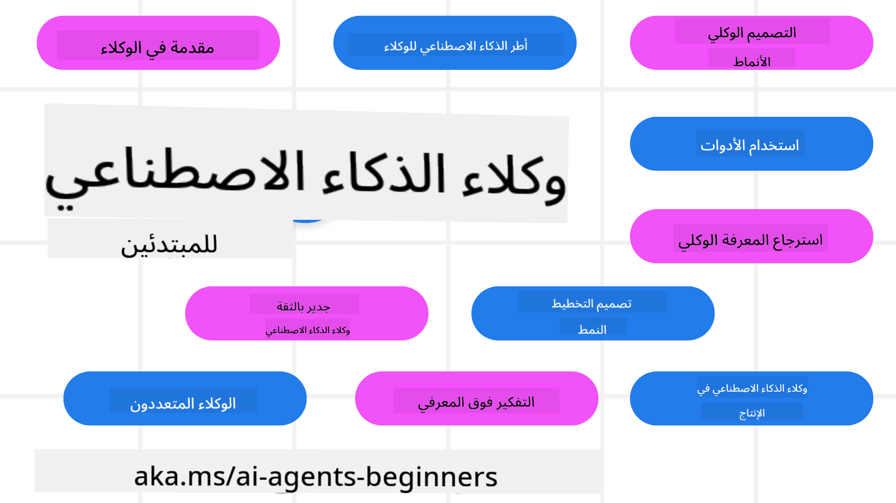

<!--
CO_OP_TRANSLATOR_METADATA:
{
  "original_hash": "6b07046397366e6f6f4524c9ddeba1e1",
  "translation_date": "2025-07-12T14:41:39+00:00",
  "source_file": "README.md",
  "language_code": "ar"
}
-->
# وكلاء الذكاء الاصطناعي للمبتدئين - دورة تعليمية

## 11 درسًا تعلمك كل ما تحتاجه لبدء بناء وكلاء الذكاء الاصطناعي

  
  
  
  

### 🌐 دعم متعدد اللغات

#### مدعوم عبر GitHub Action (آلي ومحدث دائمًا)

[الفرنسية](../fr/README.md) | [الإسبانية](../es/README.md) | [الألمانية](../de/README.md) | [الروسية](../ru/README.md) | [العربية](./README.md) | [الفارسية](../fa/README.md) | [الأردية](../ur/README.md) | [الصينية المبسطة](../zh/README.md) | [الصينية التقليدية، ماكاو](../mo/README.md) | [الصينية التقليدية، هونغ كونغ](../hk/README.md) | [الصينية التقليدية، تايوان](../tw/README.md) | [اليابانية](../ja/README.md) | [الكورية](../ko/README.md) | [الهندية](../hi/README.md) | [البنغالية](../bn/README.md) | [الماراثية](../mr/README.md) | [النيبالية](../ne/README.md) | [البنجابية (غورموخي)](../pa/README.md) | [البرتغالية (البرتغال)](../pt/README.md) | [البرتغالية (البرازيل)](../br/README.md) | [الإيطالية](../it/README.md) | [البولندية](../pl/README.md) | [التركية](../tr/README.md) | [اليونانية](../el/README.md) | [التايلاندية](../th/README.md) | [السويدية](../sv/README.md) | [الدنماركية](../da/README.md) | [النرويجية](../no/README.md) | [الفنلندية](../fi/README.md) | [الهولندية](../nl/README.md) | [العبرية](../he/README.md) | [الفيتنامية](../vi/README.md) | [الإندونيسية](../id/README.md) | [الماليزية](../ms/README.md) | [التاغالوغ (الفلبينية)](../tl/README.md) | [السواحلية](../sw/README.md) | [الهنغارية](../hu/README.md) | [التشيكية](../cs/README.md) | [السلوفاكية](../sk/README.md) | [الرومانية](../ro/README.md) | [البلغارية](../bg/README.md) | [الصربية (السيريلية)](../sr/README.md) | [الكرواتية](../hr/README.md) | [السلوفينية](../sl/README.md) | [الأوكرانية](../uk/README.md) | [البورمية (ميانمار)](../my/README.md)

**إذا كنت ترغب في دعم لغات ترجمة إضافية، فهي مدرجة [هنا](https://github.com/Azure/co-op-translator/blob/main/getting_started/supported-languages.md)**

  
  

## 🌱 البداية

تتضمن هذه الدورة 11 درسًا تغطي أساسيات بناء وكلاء الذكاء الاصطناعي. كل درس يغطي موضوعًا خاصًا به، لذا يمكنك البدء من أي مكان تريده!

تتوفر هذه الدورة بدعم متعدد اللغات. اطلع على [اللغات المتاحة هنا](../..).

إذا كانت هذه هي المرة الأولى التي تبني فيها باستخدام نماذج الذكاء الاصطناعي التوليدي، تحقق من دورتنا [الذكاء الاصطناعي التوليدي للمبتدئين](https://aka.ms/genai-beginners) التي تتضمن 21 درسًا حول البناء باستخدام GenAI.

لا تنسَ [وضع نجمة (🌟) على هذا المستودع](https://docs.github.com/en/get-started/exploring-projects-on-github/saving-repositories-with-stars?WT.mc_id=academic-105485-koreyst) و[تفرع هذا المستودع](https://github.com/microsoft/ai-agents-for-beginners/fork) لتشغيل الكود.

### ما تحتاجه

كل درس في هذه الدورة يتضمن أمثلة برمجية، يمكن العثور عليها في مجلد code_samples. يمكنك [تفرع هذا المستودع](https://github.com/microsoft/ai-agents-for-beginners/fork) لإنشاء نسختك الخاصة.

تستخدم أمثلة الكود في هذه التمارين Azure AI Foundry و GitHub Model Catalogs للتفاعل مع نماذج اللغة:

- [Github Models](https://aka.ms/ai-agents-beginners/github-models) - مجاني / محدود  
- [Azure AI Foundry](https://aka.ms/ai-agents-beginners/ai-foundry) - يتطلب حساب Azure

تستخدم هذه الدورة أيضًا أطر عمل وخدمات وكلاء الذكاء الاصطناعي التالية من مايكروسوفت:

- [Azure AI Agent Service](https://aka.ms/ai-agents-beginners/ai-agent-service)  
- [Semantic Kernel](https://aka.ms/ai-agents-beginners/semantic-kernel)  
- [AutoGen](https://aka.ms/ai-agents/autogen)

لمزيد من المعلومات حول تشغيل الكود لهذه الدورة، اطلع على [إعداد الدورة](./00-course-setup/README.md).

## 🙏 هل تريد المساعدة؟

هل لديك اقتراحات أو وجدت أخطاء إملائية أو برمجية؟ [افتح قضية](https://github.com/microsoft/ai-agents-for-beginners/issues?WT.mc_id=academic-105485-koreyst) أو [أنشئ طلب سحب](https://github.com/microsoft/ai-agents-for-beginners/pulls?WT.mc_id=academic-105485-koreyst)

إذا واجهت صعوبة أو كان لديك أي أسئلة حول بناء وكلاء الذكاء الاصطناعي، انضم إلى [مجتمع Azure AI Foundry على ديسكورد](https://discord.gg/kzRShWzttr)

إذا كان لديك ملاحظات على المنتج أو أخطاء أثناء البناء، زر [منتدى مطوري Azure AI Foundry](https://aka.ms/azureaifoundry/forum)

## 📂 كل درس يتضمن

- درسًا مكتوبًا موجودًا في README وفيديو قصير  
- أمثلة كود بايثون تدعم Azure AI Foundry و Github Models (مجاني)  
- روابط لموارد إضافية لمواصلة التعلم

## 🗃️ الدروس

| **الدرس**                                | **النص والكود**                                     | **الفيديو**                                                | **تعلم إضافي**                                                                         |
|------------------------------------------|----------------------------------------------------|------------------------------------------------------------|----------------------------------------------------------------------------------------|
| مقدمة في وكلاء الذكاء الاصطناعي وحالات استخدام الوكلاء | [رابط](./01-intro-to-ai-agents/README.md)           | [فيديو](https://youtu.be/3zgm60bXmQk?si=z8QygFvYQv-9WtO1)  | [رابط](https://aka.ms/ai-agents-beginners/collection?WT.mc_id=academic-105485-koreyst) |
| استكشاف أُطُر الوكلاء الذكية              | [رابط](./02-explore-agentic-frameworks/README.md)   | [فيديو](https://youtu.be/ODwF-EZo_O8?si=Vawth4hzVaHv-u0H)  | [رابط](https://aka.ms/ai-agents-beginners/collection?WT.mc_id=academic-105485-koreyst) |
| فهم أنماط تصميم الوكلاء الذكية            | [رابط](./03-agentic-design-patterns/README.md)      | [فيديو](https://youtu.be/m9lM8qqoOEA?si=BIzHwzstTPL8o9GF)  | [رابط](https://aka.ms/ai-agents-beginners/collection?WT.mc_id=academic-105485-koreyst) |
| نمط تصميم استخدام الأدوات                 | [رابط](./04-tool-use/README.md)                     | [فيديو](https://youtu.be/vieRiPRx-gI?si=2z6O2Xu2cu_Jz46N)  | [رابط](https://aka.ms/ai-agents-beginners/collection?WT.mc_id=academic-105485-koreyst) |
| الوكيل الذكي RAG                          | [رابط](./05-agentic-rag/README.md)                  | [فيديو](https://youtu.be/WcjAARvdL7I?si=gKPWsQpKiIlDH9A3)  | [رابط](https://aka.ms/ai-agents-beginners/collection?WT.mc_id=academic-105485-koreyst) |
| بناء وكلاء ذكاء اصطناعي موثوقين           | [رابط](./06-building-trustworthy-agents/README.md)  | [فيديو](https://youtu.be/iZKkMEGBCUQ?si=jZjpiMnGFOE9L8OK ) | [رابط](https://aka.ms/ai-agents-beginners/collection?WT.mc_id=academic-105485-koreyst) |
| نمط تصميم التخطيط                         | [رابط](./07-planning-design/README.md)              | [فيديو](https://youtu.be/kPfJ2BrBCMY?si=6SC_iv_E5-mzucnC)  | [رابط](https://aka.ms/ai-agents-beginners/collection?WT.mc_id=academic-105485-koreyst) |
| نمط تصميم الوكلاء المتعددين               | [رابط](./08-multi-agent/README.md)                  | [فيديو](https://youtu.be/V6HpE9hZEx0?si=rMgDhEu7wXo2uo6g)  | [رابط](https://aka.ms/ai-agents-beginners/collection?WT.mc_id=academic-105485-koreyst) |
| نمط تصميم الإدراك الذاتي                   | [رابط](./09-metacognition/README.md)                | [فيديو](https://youtu.be/His9R6gw6Ec?si=8gck6vvdSNCt6OcF)  | [رابط](https://aka.ms/ai-agents-beginners/collection?WT.mc_id=academic-105485-koreyst) |
| وكلاء الذكاء الاصطناعي في الإنتاج         | [رابط](./10-ai-agents-production/README.md)         | [فيديو](https://youtu.be/l4TP6IyJxmQ?si=31dnhexRo6yLRJDl)  | [رابط](https://aka.ms/ai-agents-beginners/collection?WT.mc_id=academic-105485-koreyst) |
| وكلاء الذكاء الاصطناعي مع MCP              | [رابط](./11-mcp/README.md)                          |                                                            | [رابط](https://aka.ms/mcp-for-beginners)                                               |

## 🎒 دورات أخرى

فريقنا يقدم دورات أخرى! اطلع على:
- [**جديد** بروتوكول سياق النموذج (MCP) للمبتدئين](https://github.com/microsoft/mcp-for-beginners?WT.mc_id=academic-105485-koreyst)
- [الذكاء الاصطناعي التوليدي للمبتدئين باستخدام .NET](https://github.com/microsoft/Generative-AI-for-beginners-dotnet?WT.mc_id=academic-105485-koreyst)
- [الذكاء الاصطناعي التوليدي للمبتدئين](https://github.com/microsoft/generative-ai-for-beginners?WT.mc_id=academic-105485-koreyst)
- [تعلم الآلة للمبتدئين](https://aka.ms/ml-beginners?WT.mc_id=academic-105485-koreyst)
- [علوم البيانات للمبتدئين](https://aka.ms/datascience-beginners?WT.mc_id=academic-105485-koreyst)
- [الذكاء الاصطناعي للمبتدئين](https://aka.ms/ai-beginners?WT.mc_id=academic-105485-koreyst)
- [الأمن السيبراني للمبتدئين](https://github.com/microsoft/Security-101??WT.mc_id=academic-96948-sayoung)
- [تطوير الويب للمبتدئين](https://aka.ms/webdev-beginners?WT.mc_id=academic-105485-koreyst)
- [إنترنت الأشياء للمبتدئين](https://aka.ms/iot-beginners?WT.mc_id=academic-105485-koreyst)
- [تطوير الواقع الممتد للمبتدئين](https://github.com/microsoft/xr-development-for-beginners?WT.mc_id=academic-105485-koreyst)
- [إتقان GitHub Copilot للبرمجة التشاركية بالذكاء الاصطناعي](https://aka.ms/GitHubCopilotAI?WT.mc_id=academic-105485-koreyst)
- [إتقان GitHub Copilot لمطوري C#/.NET](https://github.com/microsoft/mastering-github-copilot-for-dotnet-csharp-developers?WT.mc_id=academic-105485-koreyst)
- [اختر مغامرتك الخاصة مع Copilot](https://github.com/microsoft/CopilotAdventures?WT.mc_id=academic-105485-koreyst)

## 🌟 شكر المجتمع

شكر خاص لـ [Shivam Goyal](https://www.linkedin.com/in/shivam2003/) على مساهمته بأمثلة كود مهمة توضح Agentic RAG.

## المساهمة

يرحب هذا المشروع بالمساهمات والاقتراحات. معظم المساهمات تتطلب منك الموافقة على
اتفاقية ترخيص المساهم (CLA) التي تؤكد أنك تملك الحق، وأنك بالفعل تمنحنا
الحقوق لاستخدام مساهمتك. لمزيد من التفاصيل، يرجى زيارة
<https://cla.opensource.microsoft.com>.

عند تقديم طلب سحب (pull request)، سيقوم بوت CLA تلقائيًا بتحديد ما إذا كنت بحاجة إلى تقديم
اتفاقية CLA وتزيين طلب السحب بشكل مناسب (مثل: فحص الحالة، تعليق). فقط اتبع التعليمات
التي يقدمها البوت. ستحتاج إلى القيام بذلك مرة واحدة فقط عبر جميع المستودعات التي تستخدم اتفاقية CLA الخاصة بنا.

اعتمد هذا المشروع [مدونة قواعد السلوك مفتوحة المصدر من مايكروسوفت](https://opensource.microsoft.com/codeofconduct/).
لمزيد من المعلومات، راجع [الأسئلة الشائعة حول مدونة قواعد السلوك](https://opensource.microsoft.com/codeofconduct/faq/) أو
تواصل مع [opencode@microsoft.com](mailto:opencode@microsoft.com) لأي أسئلة أو تعليقات إضافية.

## العلامات التجارية

قد يحتوي هذا المشروع على علامات تجارية أو شعارات لمشاريع أو منتجات أو خدمات. الاستخدام المصرح به لعلامات مايكروسوفت
أو شعاراتها يخضع ويجب أن يتبع
[إرشادات العلامات التجارية والعلامات التجارية لمايكروسوفت](https://www.microsoft.com/legal/intellectualproperty/trademarks/usage/general).
يجب ألا يسبب استخدام علامات مايكروسوفت أو شعاراتها في نسخ معدلة من هذا المشروع أي لبس أو يوحي برعاية مايكروسوفت.
أي استخدام لعلامات تجارية أو شعارات طرف ثالث يخضع لسياسات تلك الأطراف.

**إخلاء المسؤولية**:  
تمت ترجمة هذا المستند باستخدام خدمة الترجمة الآلية [Co-op Translator](https://github.com/Azure/co-op-translator). بينما نسعى لتحقيق الدقة، يرجى العلم أن الترجمات الآلية قد تحتوي على أخطاء أو عدم دقة. يجب اعتبار المستند الأصلي بلغته الأصلية المصدر الموثوق به. للمعلومات الهامة، يُنصح بالترجمة البشرية المهنية. نحن غير مسؤولين عن أي سوء فهم أو تفسير ناتج عن استخدام هذه الترجمة.