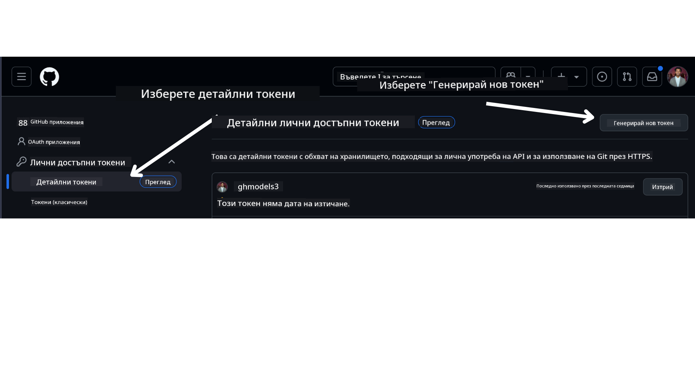

<!--
CO_OP_TRANSLATOR_METADATA:
{
  "original_hash": "76945069b52a49cd0432ae3e0b0ba22e",
  "translation_date": "2025-07-12T07:57:20+00:00",
  "source_file": "00-course-setup/README.md",
  "language_code": "bg"
}
-->
Вече трябва да имате собствена форкната версия на този курс на следния линк:


## Стартиране на кода

Този курс предлага серия от Jupyter тетрадки, които можете да стартирате, за да придобиете практически опит в създаването на AI агенти.

Примерите с код използват:

**Изисква GitHub акаунт - безплатно**:

1) Semantic Kernel Agent Framework + GitHub Models Marketplace. Обозначено като (semantic-kernel.ipynb)
2) AutoGen Framework + GitHub Models Marketplace. Обозначено като (autogen.ipynb)

**Изисква Azure абонамент**:
3) Azure AI Foundry + Azure AI Agent Service. Обозначено като (azureaiagent.ipynb)

Препоръчваме ви да изпробвате всички три вида примери, за да видите кой работи най-добре за вас.

Която и опция да изберете, тя ще определи кои стъпки за настройка трябва да следвате по-долу:

## Изисквания

- Python 3.12+
  - **NOTE**: Ако нямате инсталиран Python 3.12, уверете се, че го инсталирате. След това създайте виртуална среда с python3.12, за да се гарантира, че правилните версии се инсталират от файла requirements.txt.
- GitHub акаунт - за достъп до GitHub Models Marketplace
- Azure абонамент - за достъп до Azure AI Foundry
- Azure AI Foundry акаунт - за достъп до Azure AI Agent Service

В корена на това хранилище сме включили файл `requirements.txt`, който съдържа всички необходими Python пакети за стартиране на примерите с код.

Можете да ги инсталирате, като изпълните следната команда в терминала си в корена на хранилището:

```bash
pip install -r requirements.txt
```
Препоръчваме да създадете виртуална Python среда, за да избегнете конфликти и проблеми.

## Настройка на VSCode
Уверете се, че използвате правилната версия на Python във VSCode.


## Настройка за примери с GitHub Models

### Стъпка 1: Вземете своя GitHub Personal Access Token (PAT)

В момента този курс използва GitHub Models Marketplace, за да предложи безплатен достъп до големи езикови модели (LLMs), които ще се използват за създаване на AI агенти.

За да получите достъп до тази услуга, трябва да създадете GitHub Personal Access Token.

Това може да стане, като отидете във вашия

в GitHub акаунт.

Изберете опцията `Fine-grained tokens` в лявата част на екрана.

След това изберете `Generate new token`.



Ще бъдете подканени да въведете име за вашия токен, да изберете дата на изтичане (Препоръчително: 30 дни) и да изберете обхватите на токена (Public Repositories).

Също така е необходимо да редактирате разрешенията на този токен: Permissions -> Models -> Позволява достъп до GitHub Models

Копирайте новия токен, който току-що създадохте. Сега ще го добавите във файла `.env`, включен в този курс.

### Стъпка 2: Създайте своя `.env` файл

За да създадете `.env` файла, изпълнете следната команда в терминала си.

```bash
cp .env.example .env
```

Това ще копира примерния файл и ще създаде `.env` във вашата директория, където трябва да попълните стойностите на променливите на средата.

След като копирате токена, отворете `.env` файла в любимия си текстов редактор и поставете токена в полето `GITHUB_TOKEN`.

Сега трябва да можете да стартирате примерите с код от този курс.

## Настройка за примери с Azure AI Foundry и Azure AI Agent Service

### Стъпка 1: Вземете Endpoint на вашия Azure проект

Следвайте стъпките за създаване на хъб и проект в Azure AI Foundry, описани тук: [Hub resources overview](https://learn.microsoft.com/en-us/azure/ai-foundry/concepts/ai-resources)

След като създадете проекта си, трябва да вземете връзката (connection string) за проекта.

Това може да стане, като отидете на страницата **Overview** на вашия проект в портала на Azure AI Foundry.


### Стъпка 2: Създайте своя `.env` файл

За да създадете `.env` файла, изпълнете следната команда в терминала си.

```bash
cp .env.example .env
```

Това ще копира примерния файл и ще създаде `.env` във вашата директория, където трябва да попълните стойностите на променливите на средата.

След като копирате връзката, отворете `.env` файла в любимия си текстов редактор и поставете връзката в полето `PROJECT_ENDPOINT`.

### Стъпка 3: Влезте в Azure

Като добра практика за сигурност, ще използваме [keyless authentication](https://learn.microsoft.com/azure/developer/ai/keyless-connections?tabs=csharp%2Cazure-cli?WT.mc_id=academic-105485-koreyst) за удостоверяване в Azure OpenAI с Microsoft Entra ID. Преди да го направите, първо трябва да инсталирате **Azure CLI** според [инструкциите за инсталация](https://learn.microsoft.com/cli/azure/install-azure-cli?WT.mc_id=academic-105485-koreyst) за вашата операционна система.

След това отворете терминал и изпълнете `az login --use-device-code`, за да влезете в своя Azure акаунт.

След като влезете, изберете своя абонамент в терминала.

## Допълнителни променливи на средата - Azure Search и Azure OpenAI

За урока Agentic RAG - Урок 5 - има примери, които използват Azure Search и Azure OpenAI.

Ако искате да стартирате тези примери, трябва да добавите следните променливи на средата във вашия `.env` файл:

### Страница Overview (Проект)

- `AZURE_SUBSCRIPTION_ID` - Проверете **Project details** на страницата **Overview** на вашия проект.

- `AZURE_AI_PROJECT_NAME` - Вижте в горната част на страницата **Overview** на вашия проект.

- `AZURE_OPENAI_SERVICE` - Намерете това в раздела **Included capabilities** за **Azure OpenAI Service** на страницата **Overview**.

### Management Center

- `AZURE_OPENAI_RESOURCE_GROUP` - Отидете на **Project properties** на страницата **Overview** в **Management Center**.

- `GLOBAL_LLM_SERVICE` - Под **Connected resources** намерете името на връзката за **Azure AI Services**. Ако не е посочено, проверете в **Azure портала** в групата ресурси за името на AI Services ресурса.

### Страница Models + Endpoints

- `AZURE_OPENAI_EMBEDDING_DEPLOYMENT_NAME` - Изберете своя embedding модел (например `text-embedding-ada-002`) и отбележете **Deployment name** от детайлите на модела.

- `AZURE_OPENAI_CHAT_DEPLOYMENT_NAME` - Изберете своя чат модел (например `gpt-4o-mini`) и отбележете **Deployment name** от детайлите на модела.

### Azure портал

- `AZURE_OPENAI_ENDPOINT` - Потърсете **Azure AI services**, кликнете върху него, след това отидете на **Resource Management**, **Keys and Endpoint**, превъртете надолу до "Azure OpenAI endpoints" и копирайте този, който е за "Language APIs".

- `AZURE_OPENAI_API_KEY` - От същия екран копирайте KEY 1 или KEY 2.

- `AZURE_SEARCH_SERVICE_ENDPOINT` - Намерете своя ресурс **Azure AI Search**, кликнете върху него и вижте **Overview**.

- `AZURE_SEARCH_API_KEY` - След това отидете на **Settings** и после на **Keys**, за да копирате основния или вторичния администраторски ключ.

### Външна уебстраница

- `AZURE_OPENAI_API_VERSION` - Посетете страницата [API version lifecycle](https://learn.microsoft.com/en-us/azure/ai-services/openai/api-version-deprecation#latest-ga-api-release) под **Latest GA API release**.

### Настройка на keyless authentication

Вместо да кодираме твърдо вашите идентификационни данни, ще използваме keyless връзка с Azure OpenAI. За целта ще импортираме `DefaultAzureCredential` и по-късно ще извикаме функцията `DefaultAzureCredential`, за да получим удостоверението.

```python
from azure.identity import DefaultAzureCredential, InteractiveBrowserCredential
```

## Заклещили ли сте се някъде?

Ако имате проблеми със стартирането на тази настройка, присъединете се към нашия

или

.

## Следващ урок

Вече сте готови да стартирате кода за този курс. Приятно учене и откриване на света на AI агентите!

[Introduction to AI Agents and Agent Use Cases](../01-intro-to-ai-agents/README.md)

**Отказ от отговорност**:  
Този документ е преведен с помощта на AI преводаческа услуга [Co-op Translator](https://github.com/Azure/co-op-translator). Въпреки че се стремим към точност, моля, имайте предвид, че автоматизираните преводи могат да съдържат грешки или неточности. Оригиналният документ на неговия първичен език трябва да се счита за авторитетен източник. За критична информация се препоръчва професионален човешки превод. Ние не носим отговорност за каквито и да е недоразумения или неправилни тълкувания, произтичащи от използването на този превод.