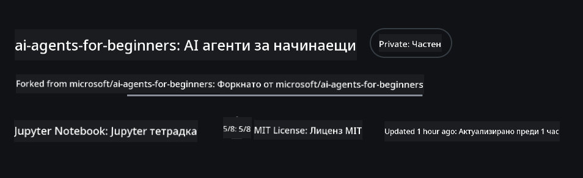
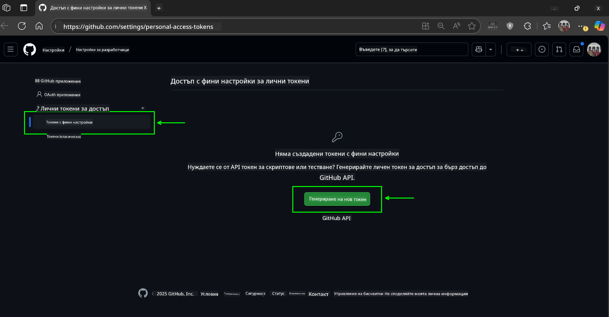
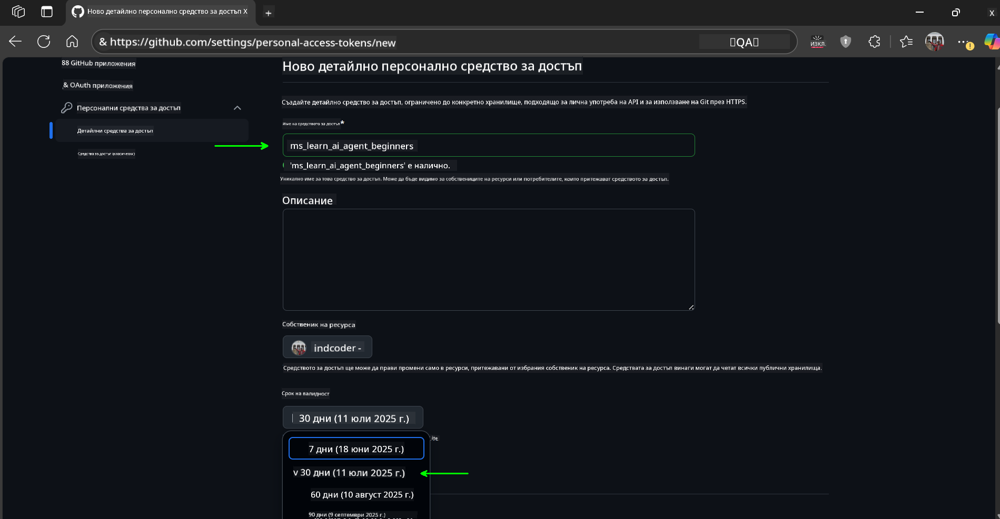
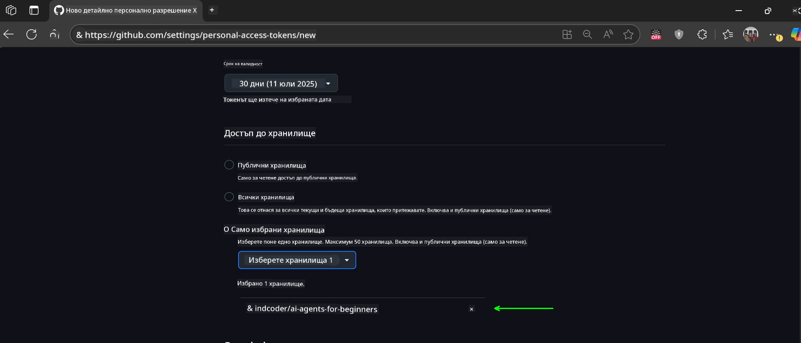
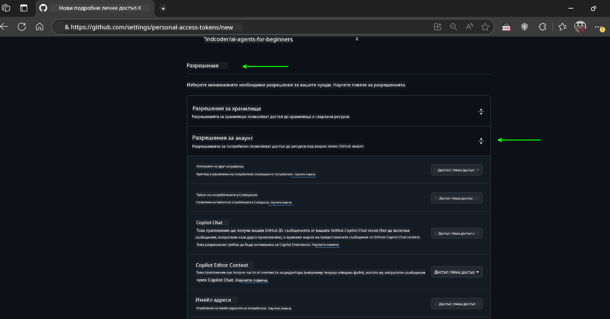
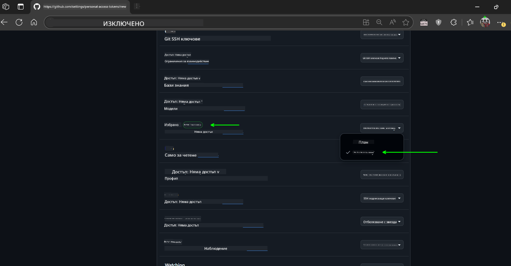
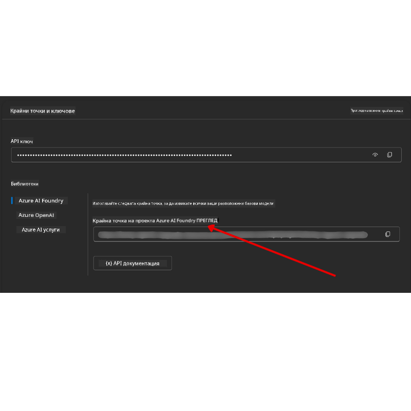

<!--
CO_OP_TRANSLATOR_METADATA:
{
  "original_hash": "c6a79c8f2b56a80370ff7e447765524f",
  "translation_date": "2025-07-23T09:13:14+00:00",
  "source_file": "00-course-setup/README.md",
  "language_code": "bg"
}
-->
# Настройка на курса

## Въведение

Този урок ще обхване как да стартирате примерите с код от този курс.

## Клониране или форкване на това хранилище

За да започнете, моля, клонирайте или направете форк на GitHub хранилището. Това ще създаде ваша собствена версия на материалите от курса, за да можете да стартирате, тествате и променяте кода!

Това може да се направи, като кликнете върху линка към

Вече трябва да имате ваша собствена форкната версия на курса на следния линк:



## Стартиране на кода

Този курс предлага серия от Jupyter Notebooks, които можете да стартирате, за да получите практически опит в изграждането на AI агенти.

Примерите с код използват следното:

**Изисква GitHub акаунт - Безплатно**:

1) Semantic Kernel Agent Framework + GitHub Models Marketplace. Обозначено като (semantic-kernel.ipynb)
2) AutoGen Framework + GitHub Models Marketplace. Обозначено като (autogen.ipynb)

**Изисква Azure абонамент**:
3) Azure AI Foundry + Azure AI Agent Service. Обозначено като (azureaiagent.ipynb)

Препоръчваме ви да изпробвате и трите типа примери, за да видите кой работи най-добре за вас.

Който и вариант да изберете, той ще определи кои стъпки за настройка трябва да следвате по-долу:

## Изисквания

- Python 3.12+
  - **ЗАБЕЛЕЖКА**: Ако нямате инсталиран Python 3.12, уверете се, че го инсталирате. След това създайте вашата виртуална среда (venv) с python3.12, за да гарантирате, че правилните версии са инсталирани от файла requirements.txt.
- GitHub акаунт - За достъп до GitHub Models Marketplace
- Azure абонамент - За достъп до Azure AI Foundry
- Azure AI Foundry акаунт - За достъп до Azure AI Agent Service

В кореновата директория на това хранилище сме включили файл `requirements.txt`, който съдържа всички необходими Python пакети за стартиране на примерите с код.

Можете да ги инсталирате, като изпълните следната команда в терминала в кореновата директория на хранилището:

```bash
pip install -r requirements.txt
```
Препоръчваме създаването на Python виртуална среда, за да избегнете конфликти и проблеми.

## Настройка на VSCode
Уверете се, че използвате правилната версия на Python в VSCode.


## Настройка за примери с GitHub модели

### Стъпка 1: Получаване на вашия GitHub Personal Access Token (PAT)

Този курс използва GitHub Models Marketplace, предоставяйки безплатен достъп до големи езикови модели (LLMs), които ще използвате за изграждане на AI агенти.

За да използвате GitHub моделите, трябва да създадете [GitHub Personal Access Token](https://docs.github.com/en/authentication/keeping-your-account-and-data-secure/managing-your-personal-access-tokens).

Това може да се направи, като отидете на вашия GitHub акаунт.

Моля, следвайте [Принципа на минималните привилегии](https://docs.github.com/en/get-started/learning-to-code/storing-your-secrets-safely), когато създавате вашия токен. Това означава, че трябва да дадете на токена само разрешенията, които са необходими за стартиране на примерите с код от този курс.

1. Изберете опцията `Fine-grained tokens` от лявата страна на екрана.

    След това изберете `Generate new token`.

    

1. Въведете описателно име за вашия токен, което отразява неговата цел, за да бъде лесно разпознаваем по-късно. Задайте дата на изтичане (препоръчително: 30 дни; можете да изберете по-кратък период, например 7 дни, ако предпочитате по-сигурен подход).

    

1. Ограничете обхвата на токена до вашия форк на това хранилище.

    

1. Ограничете разрешенията на токена: Под **Permissions**, активирайте **Account Permissions**, преминете към **Models** и активирайте само необходимия достъп за четене за GitHub модели.

    

    

Копирайте новия токен, който току-що създадохте. Сега ще го добавите към вашия `.env` файл, включен в този курс.

### Стъпка 2: Създаване на вашия `.env` файл

За да създадете вашия `.env` файл, изпълнете следната команда в терминала.

```bash
cp .env.example .env
```

Това ще копира примерния файл и ще създаде `.env` във вашата директория, където ще попълните стойностите за променливите на средата.

С копирания токен отворете `.env` файла в любимия си текстов редактор и го поставете в полето `GITHUB_TOKEN`.

Вече трябва да можете да стартирате примерите с код от този курс.

## Настройка за примери с Azure AI Foundry и Azure AI Agent Service

### Стъпка 1: Получаване на вашия Azure Project Endpoint

Следвайте стъпките за създаване на хъб и проект в Azure AI Foundry, описани тук: [Hub resources overview](https://learn.microsoft.com/en-us/azure/ai-foundry/concepts/ai-resources)

След като създадете вашия проект, ще трябва да получите низ за връзка към вашия проект.

Това може да се направи, като отидете на страницата **Overview** на вашия проект в Azure AI Foundry портала.



### Стъпка 2: Създаване на вашия `.env` файл

За да създадете вашия `.env` файл, изпълнете следната команда в терминала.

```bash
cp .env.example .env
```

Това ще копира примерния файл и ще създаде `.env` във вашата директория, където ще попълните стойностите за променливите на средата.

С копирания токен отворете `.env` файла в любимия си текстов редактор и го поставете в полето `PROJECT_ENDPOINT`.

### Стъпка 3: Вход в Azure

Като най-добра практика за сигурност ще използваме [автентикация без ключове](https://learn.microsoft.com/azure/developer/ai/keyless-connections?tabs=csharp%2Cazure-cli?WT.mc_id=academic-105485-koreyst), за да се удостоверим в Azure OpenAI с Microsoft Entra ID.

След това отворете терминал и изпълнете `az login --use-device-code`, за да влезете във вашия Azure акаунт.

След като влезете, изберете вашия абонамент в терминала.

## Допълнителни променливи на средата - Azure Search и Azure OpenAI

За урока Agentic RAG - Урок 5 - има примери, които използват Azure Search и Azure OpenAI.

Ако искате да стартирате тези примери, ще трябва да добавите следните променливи на средата към вашия `.env` файл:

### Страница Overview (Проект)

- `AZURE_SUBSCRIPTION_ID` - Проверете **Project details** на страницата **Overview** на вашия проект.

- `AZURE_AI_PROJECT_NAME` - Вижте горната част на страницата **Overview** за вашия проект.

- `AZURE_OPENAI_SERVICE` - Намерете това в таба **Included capabilities** за **Azure OpenAI Service** на страницата **Overview**.

### Център за управление

- `AZURE_OPENAI_RESOURCE_GROUP` - Отидете на **Project properties** на страницата **Overview** на **Management Center**.

- `GLOBAL_LLM_SERVICE` - Под **Connected resources**, намерете името на връзката **Azure AI Services**. Ако не е изброено, проверете **Azure portal** под вашата ресурсна група за името на ресурса AI Services.

### Страница Models + Endpoints

- `AZURE_OPENAI_EMBEDDING_DEPLOYMENT_NAME` - Изберете вашия модел за вграждане (например `text-embedding-ada-002`) и отбележете **Deployment name** от детайлите на модела.

- `AZURE_OPENAI_CHAT_DEPLOYMENT_NAME` - Изберете вашия чат модел (например `gpt-4o-mini`) и отбележете **Deployment name** от детайлите на модела.

### Azure портал

- `AZURE_OPENAI_ENDPOINT` - Намерете **Azure AI services**, кликнете върху него, след това отидете на **Resource Management**, **Keys and Endpoint**, превъртете надолу до "Azure OpenAI endpoints" и копирайте този, който казва "Language APIs".

- `AZURE_OPENAI_API_KEY` - От същия екран копирайте KEY 1 или KEY 2.

- `AZURE_SEARCH_SERVICE_ENDPOINT` - Намерете вашия **Azure AI Search** ресурс, кликнете върху него и вижте **Overview**.

- `AZURE_SEARCH_API_KEY` - След това отидете на **Settings** и след това **Keys**, за да копирате основния или вторичния администраторски ключ.

### Външна уеб страница

- `AZURE_OPENAI_API_VERSION` - Посетете страницата [API version lifecycle](https://learn.microsoft.com/en-us/azure/ai-services/openai/api-version-deprecation#latest-ga-api-release) под **Latest GA API release**.

### Настройка на автентикация без ключове

Вместо да кодирате вашите идентификационни данни, ще използваме връзка без ключове с Azure OpenAI. За целта ще импортираме `DefaultAzureCredential` и по-късно ще извикаме функцията `DefaultAzureCredential`, за да получим идентификационните данни.

```python
from azure.identity import DefaultAzureCredential, InteractiveBrowserCredential
```

## Нуждаете се от помощ?

Ако имате проблеми със стартирането на тази настройка, присъединете се към нашия

## Следващ урок

Вече сте готови да стартирате кода за този курс. Приятно учене за света на AI агентите!

[Въведение в AI агенти и случаи на употреба](../01-intro-to-ai-agents/README.md)

**Отказ от отговорност**:  
Този документ е преведен с помощта на AI услуга за превод [Co-op Translator](https://github.com/Azure/co-op-translator). Въпреки че се стремим към точност, моля, имайте предвид, че автоматизираните преводи може да съдържат грешки или неточности. Оригиналният документ на неговия роден език трябва да се счита за авторитетен източник. За критична информация се препоръчва професионален човешки превод. Ние не носим отговорност за недоразумения или погрешни интерпретации, произтичащи от използването на този превод.