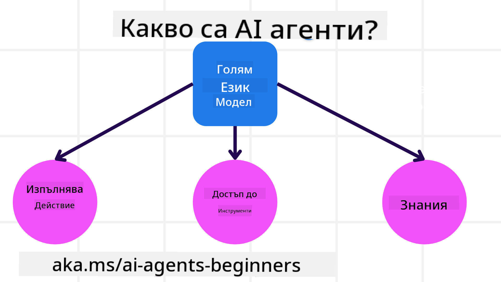
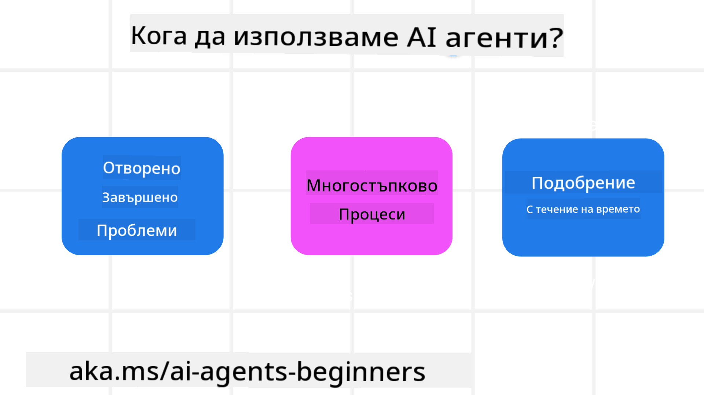

<!--
CO_OP_TRANSLATOR_METADATA:
{
  "original_hash": "d84943abc8f001ad4670418d32c2d899",
  "translation_date": "2025-07-12T08:12:23+00:00",
  "source_file": "01-intro-to-ai-agents/README.md",
  "language_code": "bg"
}
-->
да се срещнете с други учащи и създатели на AI агенти и да зададете всички въпроси, които имате относно този курс.

За да започнем този курс, първо ще разберем по-добре какво представляват AI агентите и как можем да ги използваме в приложенията и работните процеси, които създаваме.

## Въведение

Този урок обхваща:

- Какво са AI агенти и какви са различните типове агенти?
- За кои случаи на употреба AI агентите са най-подходящи и как могат да ни помогнат?
- Какви са основните градивни елементи при проектирането на агентни решения?

## Цели на обучението
След завършване на този урок, трябва да можете да:

- Разбирате концепциите за AI агенти и как те се различават от други AI решения.
- Използвате AI агенти по най-ефективния начин.
- Проектирате агентни решения продуктивно както за потребителите, така и за клиентите.

## Определяне на AI агенти и типове AI агенти

### Какво са AI агенти?

AI агентите са **системи**, които позволяват на **големи езикови модели (LLMs)** да **извършват действия**, като разширяват техните възможности чрез предоставяне на LLMs **достъп до инструменти** и **знания**.

Нека разгледаме тази дефиниция на по-малки части:

- **Система** - Важно е да мислим за агентите не като за един компонент, а като за система от много компоненти. На базово ниво компонентите на AI агент са:
  - **Околна среда** - Определеното пространство, в което AI агентът оперира. Например, ако имаме AI агент за резервации на пътувания, околната среда може да бъде системата за резервации, която агентът използва, за да изпълнява задачи.
  - **Сензори** - Околните среди съдържат информация и предоставят обратна връзка. AI агентите използват сензори, за да събират и интерпретират тази информация за текущото състояние на околната среда. В примера с агента за резервации, системата може да предоставя информация като наличност на хотели или цени на полети.
  - **Изпълнители (актуатори)** - След като AI агентът получи текущото състояние на околната среда, за текущата задача агентът определя какво действие да извърши, за да промени околната среда. За агента за резервации това може да бъде резервация на налична стая за потребителя.

**Големи езикови модели** - Концепцията за агенти съществуваше преди създаването на LLMs. Предимството на изграждането на AI агенти с LLMs е тяхната способност да интерпретират човешки език и данни. Тази способност позволява на LLMs да интерпретират информацията от околната среда и да дефинират план за промяна на околната среда.

**Извършване на действия** - Извън системите на AI агенти, LLMs са ограничени до ситуации, в които действието е генериране на съдържание или информация въз основа на подадена заявка от потребителя. В системите на AI агенти, LLMs могат да изпълняват задачи, като интерпретират заявката на потребителя и използват наличните инструменти в тяхната среда.

**Достъп до инструменти** - До какви инструменти LLM има достъп се определя от 1) средата, в която оперира, и 2) разработчика на AI агента. В примера с агента за пътувания, инструментите на агента са ограничени от операциите, налични в системата за резервации, и/или разработчикът може да ограничи достъпа на агента до полети.

**Памет и знания** - Паметта може да бъде краткосрочна в контекста на разговора между потребителя и агента. В дългосрочен план, извън информацията, предоставена от околната среда, AI агентите могат също да извличат знания от други системи, услуги, инструменти и дори други агенти. В примера с агента за пътувания, тези знания могат да бъдат информация за предпочитанията на потребителя, съхранявана в база данни на клиенти.

### Различните типове агенти

Сега, когато имаме обща дефиниция за AI агенти, нека разгледаме някои конкретни типове агенти и как биха се приложили към AI агент за резервации на пътувания.

| **Тип агент**                 | **Описание**                                                                                                                        | **Пример**                                                                                                                                                                                                                   |
| ----------------------------- | ---------------------------------------------------------------------------------------------------------------------------------- | ----------------------------------------------------------------------------------------------------------------------------------------------------------------------------------------------------------------------------- |
| **Прости рефлексни агенти**  | Извършват незабавни действия въз основа на предварително зададени правила.                                                        | Агентът за пътувания интерпретира контекста на имейл и препраща оплаквания за пътувания към обслужване на клиенти.                                                                                                            |
| **Рефлексни агенти с модел** | Извършват действия въз основа на модел на света и промени в този модел.                                                           | Агентът за пътувания приоритизира маршрути с значителни ценови промени, базирайки се на достъп до исторически данни за цени.                                                                                                  |
| **Агенти, базирани на цели** | Създават планове за постигане на конкретни цели, като интерпретират целта и определят действия за нейното постигане.              | Агентът за пътувания резервира пътуване, като определя необходимите транспортни средства (кола, обществен транспорт, полети) от текущото местоположение до дестинацията.                                                        |
| **Агенти, базирани на полезност** | Вземат предвид предпочитания и числено претеглят компромиси, за да определят как да постигнат целите.                             | Агентът за пътувания максимизира полезността, като претегля удобството спрямо разходите при резервация на пътуване.                                                                                                          |
| **Обучаващи се агенти**      | Подобряват се с времето, като реагират на обратна връзка и съответно коригират действията си.                                     | Агентът за пътувания се подобрява, използвайки обратна връзка от анкети след пътуване, за да направи корекции в бъдещи резервации.                                                                                            |
| **Йерархични агенти**         | Съдържат множество агенти в йерархична система, като по-висшестоящите агенти разделят задачи на подзадачи за по-нисшестоящите агенти. | Агентът за пътувания отменя пътуване, като разделя задачата на подзадачи (например, анулиране на конкретни резервации) и възлага на по-нисшестоящите агенти да ги изпълнят, докладвайки обратно на по-висшестоящия агент.             |
| **Мултиагентни системи (MAS)** | Агентите изпълняват задачи независимо, кооперативно или конкурентно.                                                              | Кооперативно: Множество агенти резервират конкретни услуги като хотели, полети и развлечения. Конкурентно: Множество агенти управляват и се конкурират за споделен календар за резервации на хотел, за да настанят клиенти.         |

## Кога да използваме AI агенти

В предишния раздел използвахме примера с агента за пътувания, за да обясним как различните типове агенти могат да се използват в различни сценарии на резервации. Ще продължим да използваме това приложение през целия курс.

Нека разгледаме типовете случаи на употреба, за които AI агентите са най-подходящи:

- **Отворени проблеми** - позволява на LLM да определи необходимите стъпки за изпълнение на задача, тъй като не винаги може да бъде предварително кодирано в работния процес.
- **Многостъпкови процеси** - задачи, които изискват ниво на сложност, при което AI агентът трябва да използва инструменти или информация през няколко стъпки, а не само еднократно извличане.
- **Подобрение с времето** - задачи, при които агентът може да се подобрява с времето, като получава обратна връзка от средата или потребителите, за да предоставя по-добра полезност.

Повече съображения за използването на AI агенти разглеждаме в урока "Изграждане на надеждни AI агенти".

## Основи на агентните решения

### Разработка на агенти

Първата стъпка при проектирането на AI агентна система е да се дефинират инструментите, действията и поведението. В този курс се фокусираме върху използването на **Azure AI Agent Service** за дефиниране на нашите агенти. Той предлага функции като:

- Избор на отворени модели като OpenAI, Mistral и Llama
- Използване на лицензирани данни чрез доставчици като Tripadvisor
- Използване на стандартизирани OpenAPI 3.0 инструменти

### Агентни модели

Комуникацията с LLM става чрез подканяне (prompts). Поради полуавтономния характер на AI агентите, не винаги е възможно или необходимо ръчно да се подава нова подканваща заявка към LLM след промяна в околната среда. Използваме **агентни модели**, които ни позволяват да подканваме LLM през няколко стъпки по по-мащабируем начин.

Този курс е разделен на някои от настоящите популярни агентни модели.

### Агентни рамки

Агентните рамки позволяват на разработчиците да прилагат агентни модели чрез код. Тези рамки предлагат шаблони, плъгини и инструменти за по-добро сътрудничество между AI агенти. Тези предимства осигуряват възможности за по-добра наблюдаемост и отстраняване на проблеми в системите на AI агенти.

В този курс ще разгледаме изследователската рамка AutoGen и готовата за продукция рамка Agent от Semantic Kernel.

## Предишен урок

[Настройка на курса](../00-course-setup/README.md)

## Следващ урок

[Изследване на агентни рамки](../02-explore-agentic-frameworks/README.md)

**Отказ от отговорност**:  
Този документ е преведен с помощта на AI преводаческа услуга [Co-op Translator](https://github.com/Azure/co-op-translator). Въпреки че се стремим към точност, моля, имайте предвид, че автоматизираните преводи могат да съдържат грешки или неточности. Оригиналният документ на неговия роден език трябва да се счита за авторитетен източник. За критична информация се препоръчва професионален човешки превод. Ние не носим отговорност за каквито и да е недоразумения или неправилни тълкувания, произтичащи от използването на този превод.