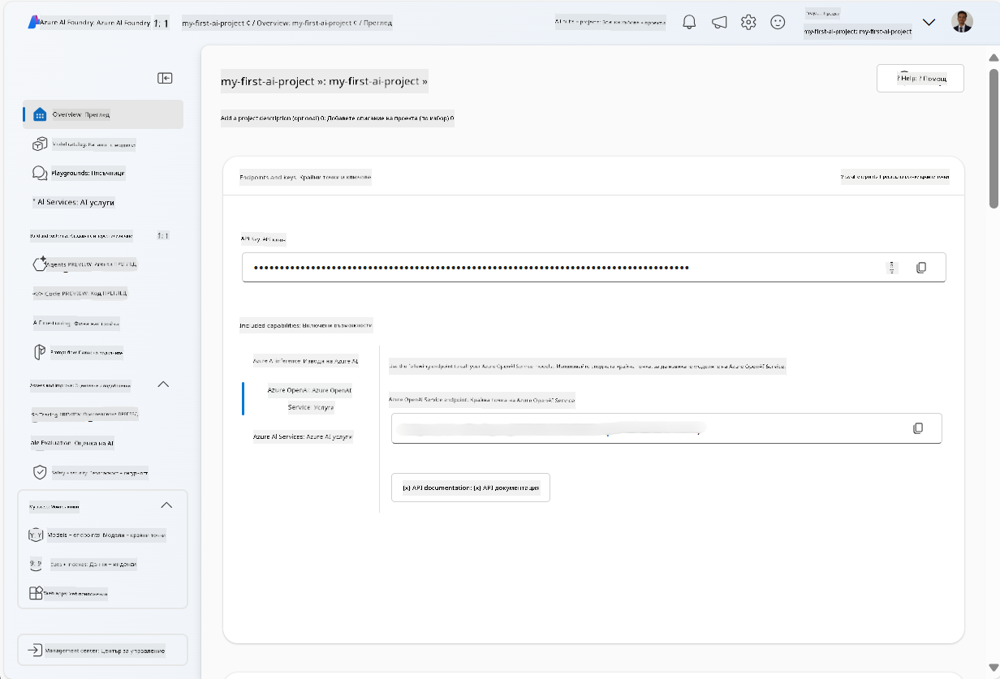
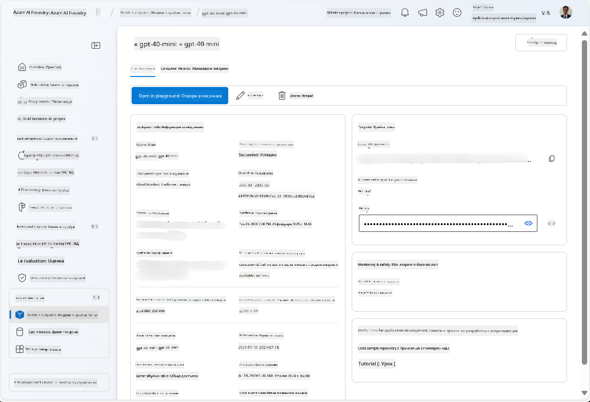
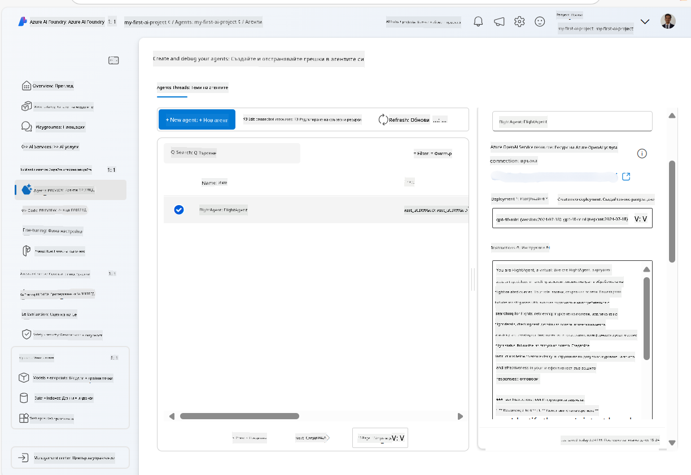
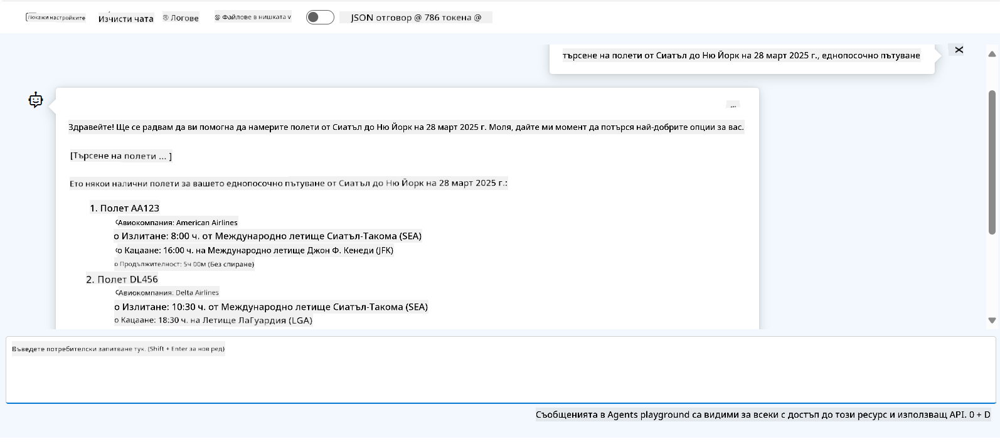

<!--
CO_OP_TRANSLATOR_METADATA:
{
  "original_hash": "7e92870dc0843e13d4dabc620c09d2d9",
  "translation_date": "2025-07-12T08:22:38+00:00",
  "source_file": "02-explore-agentic-frameworks/azure-ai-foundry-agent-creation.md",
  "language_code": "bg"
}
-->
# Разработка на Azure AI Agent Service

В това упражнение ще използвате инструментите на Azure AI Agent service в [Azure AI Foundry портала](https://ai.azure.com/?WT.mc_id=academic-105485-koreyst), за да създадете агент за резервация на полети. Агентът ще може да взаимодейства с потребителите и да предоставя информация за полети.

## Предварителни изисквания

За да завършите това упражнение, ви е необходимо следното:
1. Azure акаунт с активен абонамент. [Създайте акаунт безплатно](https://azure.microsoft.com/free/?WT.mc_id=academic-105485-koreyst).
2. Необходими са ви права за създаване на Azure AI Foundry hub или такъв да бъде създаден за вас.
    - Ако вашата роля е Contributor или Owner, можете да следвате стъпките в този урок.

## Създаване на Azure AI Foundry hub

> **Note:** Azure AI Foundry преди беше известен като Azure AI Studio.

1. Следвайте указанията от [Azure AI Foundry](https://learn.microsoft.com/en-us/azure/ai-studio/?WT.mc_id=academic-105485-koreyst) блог поста за създаване на Azure AI Foundry hub.
2. Когато проектът ви е създаден, затворете всички показани съвети и прегледайте страницата на проекта в Azure AI Foundry портала, която трябва да изглежда подобно на следното изображение:

    

## Разгръщане на модел

1. В панела отляво за вашия проект, в секцията **My assets**, изберете страницата **Models + endpoints**.
2. В страницата **Models + endpoints**, в таба **Model deployments**, в менюто **+ Deploy model**, изберете **Deploy base model**.
3. Потърсете модела `gpt-4o-mini` в списъка, след това го изберете и потвърдете.

    > **Note**: Намаляването на TPM помага да се избегне прекомерната употреба на квотата, налична в абонамента, който използвате.

    

## Създаване на агент

След като сте разположили модел, можете да създадете агент. Агентът е разговорен AI модел, който може да взаимодейства с потребителите.

1. В панела отляво за вашия проект, в секцията **Build & Customize**, изберете страницата **Agents**.
2. Кликнете върху **+ Create agent**, за да създадете нов агент. В диалоговия прозорец **Agent Setup**:
    - Въведете име за агента, например `FlightAgent`.
    - Уверете се, че е избрано разгръщането на модела `gpt-4o-mini`, което създадохте по-рано.
    - Задайте **Instructions** според подканата, която искате агентът да следва. Ето пример:
    ```
    You are FlightAgent, a virtual assistant specialized in handling flight-related queries. Your role includes assisting users with searching for flights, retrieving flight details, checking seat availability, and providing real-time flight status. Follow the instructions below to ensure clarity and effectiveness in your responses:

    ### Task Instructions:
    1. **Recognizing Intent**:
       - Identify the user's intent based on their request, focusing on one of the following categories:
         - Searching for flights
         - Retrieving flight details using a flight ID
         - Checking seat availability for a specified flight
         - Providing real-time flight status using a flight number
       - If the intent is unclear, politely ask users to clarify or provide more details.
        
    2. **Processing Requests**:
        - Depending on the identified intent, perform the required task:
        - For flight searches: Request details such as origin, destination, departure date, and optionally return date.
        - For flight details: Request a valid flight ID.
        - For seat availability: Request the flight ID and date and validate inputs.
        - For flight status: Request a valid flight number.
        - Perform validations on provided data (e.g., formats of dates, flight numbers, or IDs). If the information is incomplete or invalid, return a friendly request for clarification.

    3. **Generating Responses**:
    - Use a tone that is friendly, concise, and supportive.
    - Provide clear and actionable suggestions based on the output of each task.
    - If no data is found or an error occurs, explain it to the user gently and offer alternative actions (e.g., refine search, try another query).
    
    ```
> [!NOTE]
> За по-подробна подканваща инструкция, можете да разгледате [този репозиторий](https://github.com/ShivamGoyal03/RoamMind) за повече информация.
    
> Освен това, можете да добавите **Knowledge Base** и **Actions**, за да разширите възможностите на агента да предоставя повече информация и да изпълнява автоматизирани задачи според заявките на потребителите. За това упражнение можете да пропуснете тези стъпки.
    


3. За да създадете нов мулти-AI агент, просто кликнете върху **New Agent**. Новосъздаденият агент ще се покаже на страницата Agents.

## Тест на агента

След създаването на агента, можете да го тествате, за да видите как отговаря на потребителски запитвания в Azure AI Foundry портала в секцията playground.

1. В горната част на панела **Setup** за вашия агент изберете **Try in playground**.
2. В панела **Playground** можете да взаимодействате с агента, като въвеждате запитвания в чат прозореца. Например, можете да помолите агента да търси полети от Сиатъл до Ню Йорк на 28-ми.

    > **Note**: Агентът може да не дава точни отговори, тъй като в това упражнение не се използват реални данни в реално време. Целта е да се тества способността на агента да разбира и отговаря на потребителски запитвания според зададените инструкции.

    

3. След тестването на агента, можете да го персонализирате допълнително, като добавите повече intents, тренировъчни данни и действия, за да подобрите възможностите му.

## Почистване на ресурсите

Когато приключите с тестването на агента, можете да го изтриете, за да избегнете допълнителни разходи.
1. Отворете [Azure портала](https://portal.azure.com) и прегледайте съдържанието на ресурсната група, където сте разположили ресурсите на хъба, използвани в това упражнение.
2. В лентата с инструменти изберете **Delete resource group**.
3. Въведете името на ресурсната група и потвърдете, че искате да я изтриете.

## Ресурси

- [Документация на Azure AI Foundry](https://learn.microsoft.com/en-us/azure/ai-studio/?WT.mc_id=academic-105485-koreyst)
- [Azure AI Foundry портал](https://ai.azure.com/?WT.mc_id=academic-105485-koreyst)
- [Започване с Azure AI Studio](https://techcommunity.microsoft.com/blog/educatordeveloperblog/getting-started-with-azure-ai-studio/4095602?WT.mc_id=academic-105485-koreyst)
- [Основи на AI агентите в Azure](https://learn.microsoft.com/en-us/training/modules/ai-agent-fundamentals/?WT.mc_id=academic-105485-koreyst)
- [Azure AI Discord](https://aka.ms/AzureAI/Discord)

**Отказ от отговорност**:  
Този документ е преведен с помощта на AI преводаческа услуга [Co-op Translator](https://github.com/Azure/co-op-translator). Въпреки че се стремим към точност, моля, имайте предвид, че автоматизираните преводи могат да съдържат грешки или неточности. Оригиналният документ на неговия роден език трябва да се счита за авторитетен източник. За критична информация се препоръчва професионален човешки превод. Ние не носим отговорност за каквито и да е недоразумения или неправилни тълкувания, произтичащи от използването на този превод.