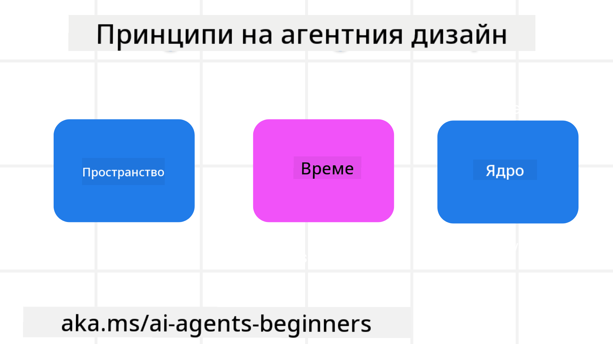

<!--
CO_OP_TRANSLATOR_METADATA:
{
  "original_hash": "4c46e4ff9e349c521e2b0b17f51afa64",
  "translation_date": "2025-08-29T21:11:32+00:00",
  "source_file": "03-agentic-design-patterns/README.md",
  "language_code": "bg"
}
-->

> _(Кликнете върху изображението по-горе, за да гледате видеото на този урок)_
# Принципи на проектиране на AI агенти

## Въведение

Съществуват много начини за изграждане на AI агентни системи. Тъй като неяснотата е характеристика, а не грешка в дизайна на генеративния AI, понякога е трудно за инженерите да определят откъде да започнат. Създадохме набор от принципи за дизайн, ориентирани към потребителя, за да помогнем на разработчиците да изграждат системи, фокусирани върху клиента, които да отговарят на техните бизнес нужди. Тези принципи не представляват предписателна архитектура, а по-скоро отправна точка за екипи, които дефинират и изграждат агентни преживявания.

По принцип, агентите трябва да:

- Разширяват и мащабират човешките възможности (мозъчна атака, решаване на проблеми, автоматизация и др.)
- Запълват пропуски в знанията (да ме информират за нови области, превод и др.)
- Улесняват и подкрепят сътрудничеството по начините, по които предпочитаме да работим с другите
- Правят ни по-добри версии на самите нас (напр. личен треньор/организатор, помощ в емоционалната регулация и умения за осъзнатост, изграждане на устойчивост и др.)

## Този урок ще обхване

- Какви са принципите на агентния дизайн
- Какви насоки да следваме при прилагането на тези принципи
- Примери за използване на принципите на дизайна

## Цели на обучението

След завършване на този урок ще можете да:

1. Обясните какво представляват принципите на агентния дизайн
2. Обясните насоките за използване на принципите на агентния дизайн
3. Разберете как да изградите агент, използвайки принципите на агентния дизайн

## Принципите на агентния дизайн

### Агент (Пространство)

Това е средата, в която агентът функционира. Тези принципи информират как да проектираме агенти за взаимодействие във физическия и дигиталния свят.

- **Свързване, а не заместване** – помагат за свързване на хора с други хора, събития и приложими знания, за да се улесни сътрудничеството и връзката.
  - Агентите помагат за свързване на събития, знания и хора.
  - Агентите сближават хората. Те не са създадени, за да заменят или омаловажават хората.
- **Лесно достъпни, но понякога невидими** – агентът основно работи на заден план и се намесва само когато е уместно и подходящо.
  - Агентът е лесно откриваем и достъпен за оторизирани потребители на всяко устройство или платформа.
  - Агентът поддържа мултимодални входове и изходи (звук, глас, текст и др.).
  - Агентът може безпроблемно да преминава между преден и заден план; между проактивен и реактивен режим, в зависимост от нуждите на потребителя.
  - Агентът може да работи в невидима форма, но процесите му на заден план и сътрудничеството с други агенти са прозрачни и контролируеми от потребителя.

### Агент (Време)

Това е начинът, по който агентът функционира във времето. Тези принципи информират как да проектираме агенти, които взаимодействат с миналото, настоящето и бъдещето.

- **Минало**: Отразяване на историята, която включва както състояние, така и контекст.
  - Агентът предоставя по-релевантни резултати въз основа на анализ на по-богати исторически данни, а не само на събития, хора или състояния.
  - Агентът създава връзки от минали събития и активно отразява паметта, за да се ангажира с текущи ситуации.
- **Сега**: Подтикване, а не просто уведомяване.
  - Агентът въплъщава цялостен подход към взаимодействие с хората. Когато се случи събитие, агентът надхвърля статичните уведомления или други формалности. Той може да опрости процеси или динамично да генерира подсказки, за да насочи вниманието на потребителя в точния момент.
  - Агентът предоставя информация въз основа на контекстуална среда, социални и културни промени и е съобразен с намеренията на потребителя.
  - Взаимодействието с агента може да бъде постепенно, развиващо се/нарастващо в сложност, за да овласти потребителите в дългосрочен план.
- **Бъдеще**: Адаптиране и еволюция.
  - Агентът се адаптира към различни устройства, платформи и модалности.
  - Агентът се адаптира към поведението на потребителя, нуждите от достъпност и е свободно персонализируем.
  - Агентът се формира и еволюира чрез непрекъснато взаимодействие с потребителя.

### Агент (Сърцевина)

Това са ключовите елементи в основата на дизайна на агента.

- **Приемане на несигурността, но изграждане на доверие**.
  - Определено ниво на несигурност на агента е очаквано. Несигурността е ключов елемент в дизайна на агента.
  - Доверието и прозрачността са основни слоеве в дизайна на агента.
  - Хората контролират кога агентът е включен/изключен, а статусът на агента е ясно видим по всяко време.

## Насоки за прилагане на тези принципи

Когато използвате горепосочените принципи на дизайна, следвайте следните насоки:

1. **Прозрачност**: Информирайте потребителя, че AI е включен, как функционира (включително минали действия) и как да дава обратна връзка и да модифицира системата.
2. **Контрол**: Позволете на потребителя да персонализира, задава предпочитания и има контрол върху системата и нейните атрибути (включително възможността за забравяне).
3. **Последователност**: Стремете се към последователни, мултимодални преживявания на различни устройства и крайни точки. Използвайте познати UI/UX елементи, където е възможно (напр. икона на микрофон за гласово взаимодействие) и намалете когнитивното натоварване на клиента колкото е възможно повече (напр. кратки отговори, визуални помощни средства и съдържание „Научете повече“).

## Как да проектираме туристически агент, използвайки тези принципи и насоки

Представете си, че проектирате туристически агент. Ето как бихте могли да използвате принципите и насоките за дизайн:

1. **Прозрачност** – Информирайте потребителя, че туристическият агент е AI-базиран. Осигурете основни инструкции за започване (напр. съобщение „Здравей“, примерни подсказки). Ясно документирайте това на продуктовата страница. Покажете списъка с подсказки, които потребителят е задал в миналото. Направете ясно как да се дава обратна връзка (палец нагоре и надолу, бутон „Изпрати обратна връзка“ и др.). Ясно посочете дали агентът има ограничения за употреба или теми.
2. **Контрол** – Уверете се, че е ясно как потребителят може да модифицира агента след създаването му, например чрез системния подсказващ текст. Позволете на потребителя да избира колко подробен да бъде агентът, неговия стил на писане и всякакви ограничения за теми, които агентът не трябва да обсъжда. Дайте възможност на потребителя да преглежда и изтрива свързани файлове или данни, подсказки и минали разговори.
3. **Последователност** – Уверете се, че иконите за споделяне на подсказка, добавяне на файл или снимка и маркиране на някого или нещо са стандартни и разпознаваеми. Използвайте икона на кламер, за да обозначите качване/споделяне на файл с агента, и икона на изображение за качване на графики.

### Имате още въпроси относно моделите за дизайн на AI агенти?

Присъединете се към [Azure AI Foundry Discord](https://aka.ms/ai-agents/discord), за да се срещнете с други обучаващи се, да присъствате на консултации и да получите отговори на вашите въпроси за AI агенти.

## Допълнителни ресурси

## Предишен урок

[Изследване на агентни рамки](../02-explore-agentic-frameworks/README.md)

## Следващ урок

[Модел за дизайн на използване на инструменти](../04-tool-use/README.md)

---

**Отказ от отговорност**:  
Този документ е преведен с помощта на AI услуга за превод [Co-op Translator](https://github.com/Azure/co-op-translator). Въпреки че се стремим към точност, моля, имайте предвид, че автоматизираните преводи може да съдържат грешки или неточности. Оригиналният документ на неговия роден език трябва да се счита за авторитетен източник. За критична информация се препоръчва професионален човешки превод. Ние не носим отговорност за недоразумения или погрешни интерпретации, произтичащи от използването на този превод.