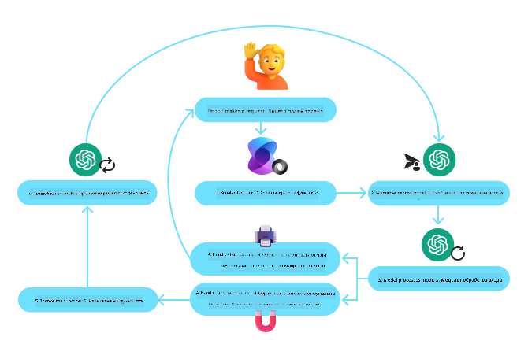
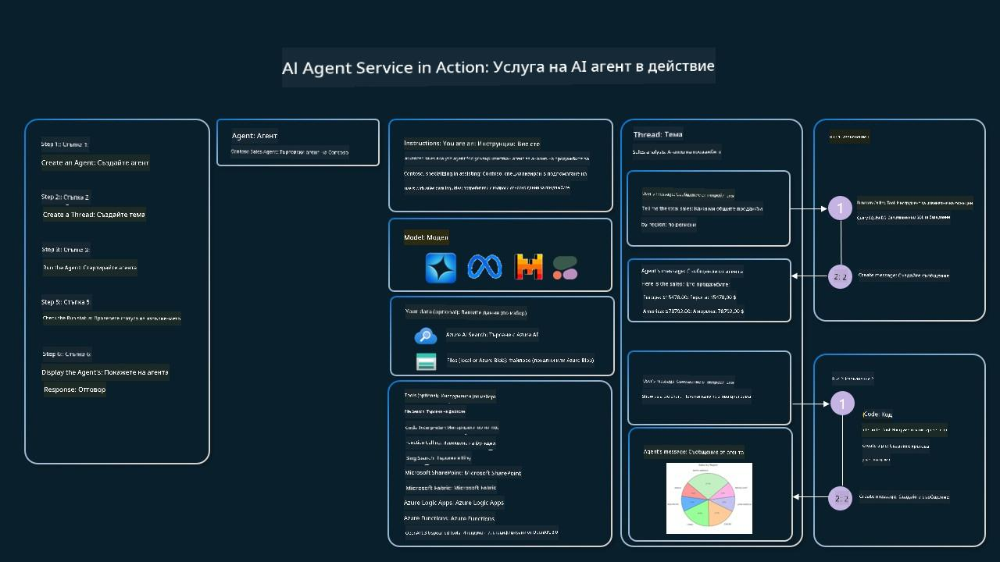

<!--
CO_OP_TRANSLATOR_METADATA:
{
  "original_hash": "88258b03f2893aa2e69eb8fb24baabbc",
  "translation_date": "2025-07-12T09:44:34+00:00",
  "source_file": "04-tool-use/README.md",
  "language_code": "bg"
}
-->
[](https://youtu.be/vieRiPRx-gI?si=cEZ8ApnT6Sus9rhn)

> _(Кликнете върху изображението по-горе, за да гледате видеото на този урок)_

# Дизайнерски модел за използване на инструменти

Инструментите са интересни, защото позволяват на AI агентите да имат по-широк набор от възможности. Вместо агентът да разполага с ограничен набор от действия, които може да изпълнява, чрез добавяне на инструмент, агентът вече може да извършва много по-голям обхват от действия. В тази глава ще разгледаме дизайнерския модел за използване на инструменти, който описва как AI агентите могат да използват конкретни инструменти, за да постигнат целите си.

## Въведение

В този урок ще се опитаме да отговорим на следните въпроси:

- Какво представлява дизайнерският модел за използване на инструменти?
- В какви случаи може да се прилага?
- Какви са елементите/строителните блокове, необходими за реализиране на този модел?
- Какви са специалните съображения при използването на дизайнерския модел за изграждане на надеждни AI агенти?

## Цели на обучението

След завършване на този урок ще можете да:

- Дефинирате дизайнерския модел за използване на инструменти и неговата цел.
- Идентифицирате случаи, в които този модел е приложим.
- Разберете ключовите елементи, необходими за реализиране на модела.
- Разпознавате съображенията за осигуряване на надеждност при AI агенти, използващи този модел.

## Какво представлява дизайнерският модел за използване на инструменти?

**Дизайнерският модел за използване на инструменти** се фокусира върху даването на възможност на LLM (големи езикови модели) да взаимодействат с външни инструменти, за да постигнат конкретни цели. Инструментите са код, който може да бъде изпълнен от агент за извършване на действия. Инструмент може да бъде проста функция, като калкулатор, или API повикване към външна услуга, например за проверка на борсови цени или прогноза за времето. В контекста на AI агентите, инструментите са проектирани да се изпълняват от агентите в отговор на **функционални повиквания, генерирани от модела**.

## В какви случаи може да се прилага?

AI агентите могат да използват инструменти за изпълнение на сложни задачи, извличане на информация или вземане на решения. Дизайнерският модел за използване на инструменти често се прилага в ситуации, изискващи динамично взаимодействие с външни системи, като бази данни, уеб услуги или интерпретатори на код. Тази възможност е полезна за различни случаи, включително:

- **Динамично извличане на информация:** Агентите могат да правят заявки към външни API или бази данни, за да получат актуални данни (например, заявка към SQLite база данни за анализ на данни, получаване на борсови цени или информация за времето).
- **Изпълнение и интерпретация на код:** Агентите могат да изпълняват код или скриптове за решаване на математически задачи, генериране на отчети или провеждане на симулации.
- **Автоматизация на работни процеси:** Автоматизиране на повтарящи се или многоетапни процеси чрез интегриране на инструменти като планировчици на задачи, имейл услуги или потоци за обработка на данни.
- **Поддръжка на клиенти:** Агентите могат да взаимодействат с CRM системи, платформи за тикети или бази знания, за да разрешават запитвания на потребителите.
- **Генериране и редактиране на съдържание:** Агентите могат да използват инструменти като граматически проверяващи, обобщители на текст или оценители на безопасността на съдържанието, за да подпомогнат създаването на съдържание.

## Какви са елементите/строителните блокове, необходими за реализиране на дизайнерския модел за използване на инструменти?

Тези строителни блокове позволяват на AI агента да изпълнява широк спектър от задачи. Нека разгледаме ключовите елементи, необходими за реализиране на този модел:

- **Схеми на функции/инструменти:** Подробни дефиниции на наличните инструменти, включително името на функцията, целта ѝ, необходимите параметри и очакваните резултати. Тези схеми позволяват на LLM да разбере какви инструменти са налични и как да конструира валидни заявки.

- **Логика за изпълнение на функции:** Управлява кога и как се извикват инструментите въз основа на намерението на потребителя и контекста на разговора. Това може да включва модули за планиране, механизми за маршрутизиране или условни потоци, които динамично определят използването на инструменти.

- **Система за обработка на съобщения:** Компоненти, които управляват потока на разговора между входовете на потребителя, отговорите на LLM, повикванията към инструменти и техните резултати.

- **Рамка за интеграция на инструменти:** Инфраструктура, която свързва агента с различни инструменти, било то прости функции или сложни външни услуги.

- **Обработка на грешки и валидация:** Механизми за справяне с неуспехи при изпълнение на инструменти, валидиране на параметри и управление на неочаквани отговори.

- **Управление на състоянието:** Следи контекста на разговора, предишните взаимодействия с инструменти и постоянните данни, за да осигури последователност при многократни взаимодействия.

Следва да разгледаме по-подробно извикването на функции/инструменти.

### Извикване на функции/инструменти

Извикването на функции е основният начин, по който позволяваме на големите езикови модели (LLM) да взаимодействат с инструменти. Често ще видите термините „функция“ и „инструмент“ използвани взаимозаменяемо, тъй като „функциите“ (блокове от многократно използваем код) са „инструментите“, които агентите използват за изпълнение на задачи. За да бъде извикан кодът на функция, LLM трябва да сравни заявката на потребителя с описанието на функциите. За целта се изпраща схема, съдържаща описанията на всички налични функции към LLM. След това LLM избира най-подходящата функция за задачата и връща нейното име и аргументи. Избраната функция се извиква, отговорът ѝ се изпраща обратно към LLM, който използва информацията, за да отговори на заявката на потребителя.

За разработчиците, които искат да реализират извикване на функции за агенти, са необходими:

1. LLM модел, който поддържа извикване на функции
2. Схема, съдържаща описания на функциите
3. Код за всяка описана функция

Нека илюстрираме с пример за получаване на текущото време в даден град:

1. **Инициализиране на LLM, който поддържа извикване на функции:**

    Не всички модели поддържат извикване на функции, затова е важно да проверите дали използваният от вас LLM го прави. <a href="https://learn.microsoft.com/azure/ai-services/openai/how-to/function-calling" target="_blank">Azure OpenAI</a> поддържа извикване на функции. Можем да започнем с инициализиране на клиента за Azure OpenAI.

    ```python
    # Initialize the Azure OpenAI client
    client = AzureOpenAI(
        azure_endpoint = os.getenv("AZURE_OPENAI_ENDPOINT"), 
        api_key=os.getenv("AZURE_OPENAI_API_KEY"),  
        api_version="2024-05-01-preview"
    )
    ```

1. **Създаване на схема за функция:**

    След това ще дефинираме JSON схема, която съдържа името на функцията, описание на това какво прави функцията, както и имената и описанията на параметрите ѝ. След това ще предадем тази схема на клиента, създаден по-рано, заедно със заявката на потребителя за намиране на времето в Сан Франциско. Важно е да се отбележи, че се връща **повикване на инструмент**, а **не** крайният отговор на въпроса. Както беше споменато по-рано, LLM връща името на функцията, която е избрал за задачата, и аргументите, които ще ѝ бъдат подадени.

    ```python
    # Function description for the model to read
    tools = [
        {
            "type": "function",
            "function": {
                "name": "get_current_time",
                "description": "Get the current time in a given location",
                "parameters": {
                    "type": "object",
                    "properties": {
                        "location": {
                            "type": "string",
                            "description": "The city name, e.g. San Francisco",
                        },
                    },
                    "required": ["location"],
                },
            }
        }
    ]
    ```
   
    ```python
  
    # Initial user message
    messages = [{"role": "user", "content": "What's the current time in San Francisco"}] 
  
    # First API call: Ask the model to use the function
      response = client.chat.completions.create(
          model=deployment_name,
          messages=messages,
          tools=tools,
          tool_choice="auto",
      )
  
      # Process the model's response
      response_message = response.choices[0].message
      messages.append(response_message)
  
      print("Model's response:")  

      print(response_message)
  
    ```

    ```bash
    Model's response:
    ChatCompletionMessage(content=None, role='assistant', function_call=None, tool_calls=[ChatCompletionMessageToolCall(id='call_pOsKdUlqvdyttYB67MOj434b', function=Function(arguments='{"location":"San Francisco"}', name='get_current_time'), type='function')])
    ```
  
1. **Кодът на функцията, необходим за изпълнение на задачата:**

    След като LLM е избрал коя функция трябва да се изпълни, кодът, който изпълнява задачата, трябва да бъде реализиран и изпълнен. Можем да реализираме кода за получаване на текущото време на Python. Също така ще трябва да напишем код, който извлича името и аргументите от response_message, за да получим крайния резултат.

    ```python
      def get_current_time(location):
        """Get the current time for a given location"""
        print(f"get_current_time called with location: {location}")  
        location_lower = location.lower()
        
        for key, timezone in TIMEZONE_DATA.items():
            if key in location_lower:
                print(f"Timezone found for {key}")  
                current_time = datetime.now(ZoneInfo(timezone)).strftime("%I:%M %p")
                return json.dumps({
                    "location": location,
                    "current_time": current_time
                })
      
        print(f"No timezone data found for {location_lower}")  
        return json.dumps({"location": location, "current_time": "unknown"})
    ```

    ```python
     # Handle function calls
      if response_message.tool_calls:
          for tool_call in response_message.tool_calls:
              if tool_call.function.name == "get_current_time":
     
                  function_args = json.loads(tool_call.function.arguments)
     
                  time_response = get_current_time(
                      location=function_args.get("location")
                  )
     
                  messages.append({
                      "tool_call_id": tool_call.id,
                      "role": "tool",
                      "name": "get_current_time",
                      "content": time_response,
                  })
      else:
          print("No tool calls were made by the model.")  
  
      # Second API call: Get the final response from the model
      final_response = client.chat.completions.create(
          model=deployment_name,
          messages=messages,
      )
  
      return final_response.choices[0].message.content
     ```

    ```bash
      get_current_time called with location: San Francisco
      Timezone found for san francisco
      The current time in San Francisco is 09:24 AM.
     ```

Извикването на функции е в основата на повечето, ако не и на всички, дизайнерски модели за използване на инструменти от агенти, но реализирането му от нулата понякога може да бъде предизвикателство. Както научихме в [Урок 2](../../../02-explore-agentic-frameworks), агентските рамки ни предоставят предварително изградени строителни блокове за реализиране на използването на инструменти.

## Примери за използване на инструменти с агентски рамки

Ето няколко примера как можете да реализирате дизайнерския модел за използване на инструменти с различни агентски рамки:

### Semantic Kernel

<a href="https://learn.microsoft.com/azure/ai-services/agents/overview" target="_blank">Semantic Kernel</a> е отворена AI рамка за разработчици на .NET, Python и Java, работещи с големи езикови модели (LLM). Тя опростява процеса на използване на извикване на функции, като автоматично описва вашите функции и техните параметри на модела чрез процес, наречен <a href="https://learn.microsoft.com/semantic-kernel/concepts/ai-services/chat-completion/function-calling/?pivots=programming-language-python#1-serializing-the-functions" target="_blank">сериализация</a>. Освен това управлява двупосочната комуникация между модела и вашия код. Друго предимство на използването на агентска рамка като Semantic Kernel е, че ви позволява да използвате предварително изградени инструменти като <a href="https://github.com/microsoft/semantic-kernel/blob/main/python/samples/getting_started_with_agents/openai_assistant/step4_assistant_tool_file_search.py" target="_blank">Търсене на файлове</a> и <a href="https://github.com/microsoft/semantic-kernel/blob/main/python/samples/getting_started_with_agents/openai_assistant/step3_assistant_tool_code_interpreter.py" target="_blank">Интерпретатор на код</a>.

Следната диаграма илюстрира процеса на извикване на функции с Semantic Kernel:



В Semantic Kernel функциите/инструментите се наричат <a href="https://learn.microsoft.com/semantic-kernel/concepts/plugins/?pivots=programming-language-python" target="_blank">плъгини</a>. Можем да превърнем функцията `get_current_time`, която видяхме по-рано, в плъгин, като я направим клас с функцията вътре. Можем също да импортираме декоратора `kernel_function`, който приема описанието на функцията. Когато създадете kernel с GetCurrentTimePlugin, kernel автоматично сериализира функцията и нейните параметри, създавайки схемата, която се изпраща към LLM.

```python
from semantic_kernel.functions import kernel_function

class GetCurrentTimePlugin:
    async def __init__(self, location):
        self.location = location

    @kernel_function(
        description="Get the current time for a given location"
    )
    def get_current_time(location: str = ""):
        ...

```

```python 
from semantic_kernel import Kernel

# Create the kernel
kernel = Kernel()

# Create the plugin
get_current_time_plugin = GetCurrentTimePlugin(location)

# Add the plugin to the kernel
kernel.add_plugin(get_current_time_plugin)
```
  
### Azure AI Agent Service

<a href="https://learn.microsoft.com/azure/ai-services/agents/overview" target="_blank">Azure AI Agent Service</a> е по-нова агентска рамка, предназначена да даде възможност на разработчиците да изграждат, внедряват и мащабират сигурно висококачествени и разширяеми AI агенти, без да се налага да управляват изчислителните и съхранителните ресурси. Тя е особено полезна за корпоративни приложения, тъй като е напълно управлявана услуга с корпоративно ниво на сигурност.

В сравнение с разработката директно с LLM API, Azure AI Agent Service предлага някои предимства, включително:

- Автоматично извикване на инструменти – няма нужда да се парсира повикване на инструмент, да се извиква инструментът и да се обработва отговорът; всичко това вече се извършва на сървърната страна
- Сигурно управлявани данни – вместо да управлявате собственото си състояние на разговора, можете да разчитате на нишки (threads), които съхраняват цялата необходима информация
- Готови за използване инструменти – инструменти, с които можете да взаимодействате с вашите източници на данни, като Bing, Azure AI Search и Azure Functions.

Инструментите, налични в Azure AI Agent Service, могат да се разделят на две категории:

1. Инструменти за знания:
    - <a href="https://learn.microsoft.com/azure/ai-services/agents/how-to/tools/bing-grounding?tabs=python&pivots=overview" target="_blank">Основа с Bing Search</a>
    - <a href="https://learn.microsoft.com/azure/ai-services/agents/how-to/tools/file-search?tabs=python&pivots=overview" target="_blank">Търсене на файлове</a>
    - <a href="https://learn.microsoft.com/azure/ai-services/agents/how-to/tools/azure-ai-search?tabs=azurecli%2Cpython&pivots=overview-azure-ai-search" target="_blank">Azure AI Search</a>

2. Инструменти за действия:
    - <a href="https://learn.microsoft.com/azure/ai-services/agents/how-to/tools/function-calling?tabs=python&pivots=overview" target="_blank">Извикване на функции</a>
    - <a href="https://learn.microsoft.com/azure/ai-services/agents/how-to/tools/code-interpreter?tabs=python&pivots=overview" target="_blank">Интерпретатор на код</a>
    - <a href="https://learn.microsoft.com/azure/ai-services/agents/how-to/tools/openapi-spec?tabs=python&pivots=overview" target="_blank">Инструменти, дефинирани от OpenAI</a>
    - <a href="https://learn.microsoft.com/azure/ai-services/agents/how-to/tools/azure-functions?pivots=overview" target="_blank">Azure Functions</a>

Agent Service ни позволява да използваме тези инструменти заедно като `toolset`. Той също така използва `threads`, които следят историята на съобщенията от конкретен разговор.

Представете си, че сте търговски агент в компания на име Contoso. Искате да разработите разговорен агент, който може да отговаря на въпроси за вашите продажбени данни.

Следното изображение илюстрира как бихте могли да използвате Azure AI Agent Service за анализ на вашите продажбени данни:



За да използваме някой от тези инструменти с услугата, можем да създадем клиент и да дефинираме инструмент или набор от инструменти. За практическа реализация можем да използваме следния Python код. LLM ще може да разгледа toolset-а и да реши дали да използва потребителската функция `fetch_sales_data_using_sqlite_query` или предварително изградения Code Interpreter в зависимост от заявката на потребителя.

```python 
import os
from azure.ai.projects import AIProjectClient
from azure.identity import DefaultAzureCredential
from fecth_sales_data_functions import fetch_sales_data_using_sqlite_query # fetch_sales_data_using_sqlite_query function which can be found in a fetch_sales_data_functions.py file.
from azure.ai.projects.models import ToolSet, FunctionTool, CodeInterpreterTool

project_client = AIProjectClient.from_connection_string(
    credential=DefaultAzureCredential(),
    conn_str=os.environ["PROJECT_CONNECTION_STRING"],
)

# Initialize function calling agent with the fetch_sales_data_using_sqlite_query function and adding it to the toolset
fetch_data_function = FunctionTool(fetch_sales_data_using_sqlite_query)
toolset = ToolSet()
toolset.add(fetch_data_function)

# Initialize Code Interpreter tool and adding it to the toolset. 
code_interpreter = code_interpreter = CodeInterpreterTool()
toolset = ToolSet()
toolset.add(code_interpreter)

agent = project_client.agents.create_agent(
    model="gpt-4o-mini", name="my-agent", instructions="You are helpful agent", 
    toolset=toolset
)
```

## Какви са специалните съображения при използването на дизайнерския модел за изграждане на надеждни AI агенти?

Често срещан проблем при динамично генериран SQL от LLM е сигурността, особено рискът от SQL инжекции или злонамерени действия, като изтриване или манипулиране на базата данни. Въпреки че тези опасения са основателни, те могат ефективно да бъдат смекчени чрез правилна конфигурация на разрешенията за достъп до базата данни. За повечето бази данни това включва
<a href="https://microsoft.github.io/build-your-first-agent-with-azure-ai-agent-service-workshop/" target="_blank">
Azure AI Agents Service Workshop</a>
- <a href="https://github.com/Azure-Samples/contoso-creative-writer/tree/main/docs/workshop" target="_blank">Contoso Creative Writer Мулти-Агент Работилница</a>
- <a href="https://learn.microsoft.com/semantic-kernel/concepts/ai-services/chat-completion/function-calling/?pivots=programming-language-python#1-serializing-the-functions" target="_blank">Урок за извикване на функции в Semantic Kernel</a>
- <a href="https://github.com/microsoft/semantic-kernel/blob/main/python/samples/getting_started_with_agents/openai_assistant/step3_assistant_tool_code_interpreter.py" target="_blank">Semantic Kernel Интерпретатор на код</a>
- <a href="https://microsoft.github.io/autogen/dev/user-guide/core-user-guide/components/tools.html" target="_blank">Autogen Инструменти</a>

## Предишен урок

[Разбиране на агентните дизайн модели](../03-agentic-design-patterns/README.md)

## Следващ урок

[Agentic RAG](../05-agentic-rag/README.md)

**Отказ от отговорност**:  
Този документ е преведен с помощта на AI преводаческа услуга [Co-op Translator](https://github.com/Azure/co-op-translator). Въпреки че се стремим към точност, моля, имайте предвид, че автоматизираните преводи могат да съдържат грешки или неточности. Оригиналният документ на неговия роден език трябва да се счита за авторитетен източник. За критична информация се препоръчва професионален човешки превод. Ние не носим отговорност за каквито и да е недоразумения или неправилни тълкувания, произтичащи от използването на този превод.