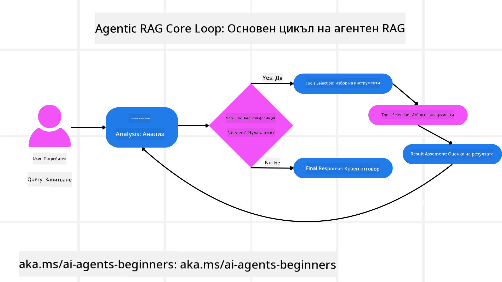
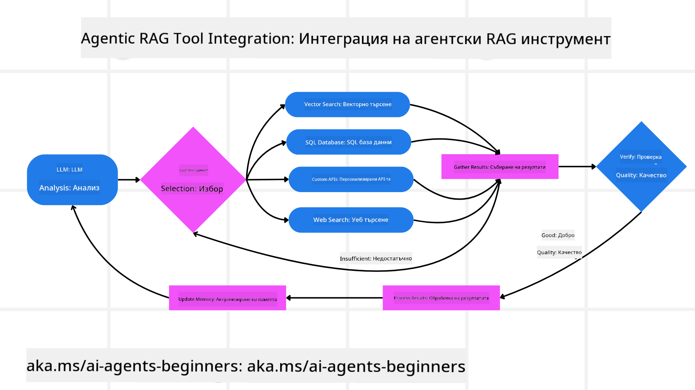
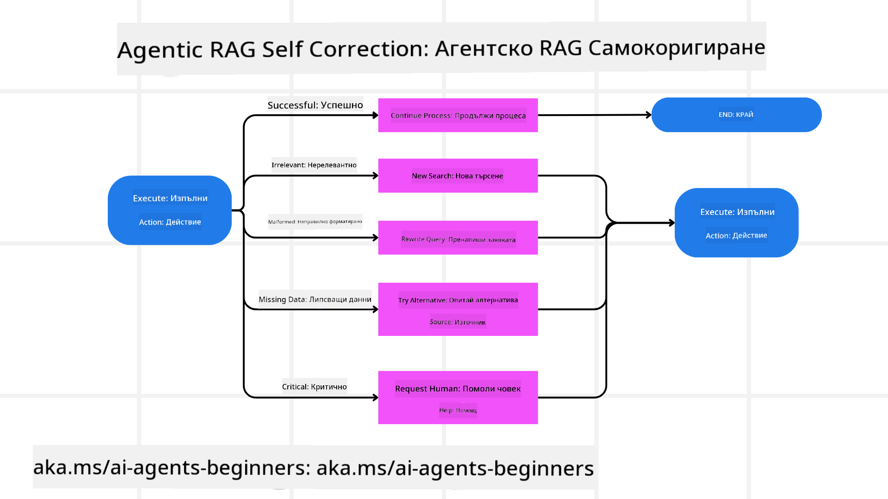

<!--
CO_OP_TRANSLATOR_METADATA:
{
  "original_hash": "7622aa72f9e676e593339f5f694ecd7d",
  "translation_date": "2025-07-12T10:12:50+00:00",
  "source_file": "05-agentic-rag/README.md",
  "language_code": "bg"
}
-->

> _(Кликнете върху изображението по-горе, за да гледате видеото на този урок)_

# Agentic RAG

Този урок предоставя изчерпателен преглед на Agentic Retrieval-Augmented Generation (Agentic RAG) — нова парадигма в изкуствения интелект, при която големите езикови модели (LLMs) автономно планират следващите си стъпки, като извличат информация от външни източници. За разлика от статичните модели „извличане, след това четене“, Agentic RAG включва итеративни повиквания към LLM, редуващи се с извиквания на инструменти или функции и структурирани изходи. Системата оценява резултатите, усъвършенства заявките, при необходимост използва допълнителни инструменти и продължава този цикъл, докато не постигне задоволително решение.

## Въведение

В този урок ще разгледаме

- **Разбиране на Agentic RAG:** Запознайте се с новата парадигма в ИИ, при която големите езикови модели (LLMs) автономно планират следващите си стъпки, като извличат информация от външни източници на данни.
- **Осъзнаване на итеративния Maker-Checker стил:** Разберете цикъла от итеративни повиквания към LLM, редуващи се с извиквания на инструменти или функции и структурирани изходи, предназначени да подобрят точността и да се справят с неправилно формулирани заявки.
- **Изследване на практическите приложения:** Идентифицирайте ситуации, в които Agentic RAG се отличава, като среди, където точността е на първо място, сложни взаимодействия с бази данни и разширени работни потоци.

## Цели на обучението

След завършване на този урок ще можете да/ще разбирате:

- **Разбиране на Agentic RAG:** Запознайте се с новата парадигма в ИИ, при която големите езикови модели (LLMs) автономно планират следващите си стъпки, като извличат информация от външни източници на данни.
- **Итеративен Maker-Checker стил:** Разберете концепцията за цикъл от итеративни повиквания към LLM, редуващи се с извиквания на инструменти или функции и структурирани изходи, предназначени да подобрят точността и да се справят с неправилно формулирани заявки.
- **Контрол върху процеса на разсъждение:** Осъзнайте способността на системата да контролира своя процес на разсъждение, вземайки решения как да подхожда към проблемите без да разчита на предварително зададени пътища.
- **Работен поток:** Разберете как агентен модел самостоятелно решава да извлече доклади за пазарни тенденции, да идентифицира данни за конкуренти, да корелира вътрешни продажбени метрики, да синтезира резултатите и да оцени стратегията.
- **Итеративни цикли, интеграция на инструменти и памет:** Научете за зависимостта на системата от цикличен модел на взаимодействие, поддържайки състояние и памет през стъпките, за да избегне повторения и да взема информирани решения.
- **Справяне с грешки и самокорекция:** Изследвайте здравите механизми за самокорекция на системата, включително итерации и повторни заявки, използване на диагностични инструменти и прибягване до човешки надзор.
- **Граници на агентността:** Разберете ограниченията на Agentic RAG, съсредоточавайки се върху автономия в специфични домейни, зависимост от инфраструктура и спазване на защитни механизми.
- **Практически случаи и стойност:** Идентифицирайте ситуации, в които Agentic RAG се отличава, като среди, където точността е на първо място, сложни взаимодействия с бази данни и разширени работни потоци.
- **Управление, прозрачност и доверие:** Научете за значението на управлението и прозрачността, включително обяснимо разсъждение, контрол на пристрастията и човешки надзор.

## Какво е Agentic RAG?

Agentic Retrieval-Augmented Generation (Agentic RAG) е нова парадигма в изкуствения интелект, при която големите езикови модели (LLMs) автономно планират следващите си стъпки, като извличат информация от външни източници. За разлика от статичните модели „извличане, след това четене“, Agentic RAG включва итеративни повиквания към LLM, редуващи се с извиквания на инструменти или функции и структурирани изходи. Системата оценява резултатите, усъвършенства заявките, при необходимост използва допълнителни инструменти и продължава този цикъл, докато не постигне задоволително решение. Този итеративен „maker-checker“ стил подобрява точността, справя се с неправилно формулирани заявки и гарантира висококачествени резултати.

Системата активно контролира своя процес на разсъждение, пренаписва неуспешни заявки, избира различни методи за извличане и интегрира множество инструменти — като векторно търсене в Azure AI Search, SQL бази данни или персонализирани API — преди да финализира отговора си. Отличителната черта на агентната система е способността ѝ да контролира процеса на разсъждение. Традиционните реализации на RAG разчитат на предварително зададени пътища, но агентната система автономно определя последователността на стъпките въз основа на качеството на намерената информация.

## Дефиниране на Agentic Retrieval-Augmented Generation (Agentic RAG)

Agentic Retrieval-Augmented Generation (Agentic RAG) е нова парадигма в развитието на ИИ, при която LLM не само извличат информация от външни източници на данни, но и автономно планират следващите си стъпки. За разлика от статичните модели „извличане, след това четене“ или внимателно скриптирани последователности от заявки, Agentic RAG включва цикъл от итеративни повиквания към LLM, редуващи се с извиквания на инструменти или функции и структурирани изходи. При всяка стъпка системата оценява получените резултати, решава дали да усъвършенства заявките си, при необходимост използва допълнителни инструменти и продължава този цикъл, докато не постигне задоволително решение.

Този итеративен „maker-checker“ стил на работа е предназначен да подобри точността, да се справи с неправилно формулирани заявки към структурирани бази данни (например NL2SQL) и да осигури балансирани, висококачествени резултати. Вместо да разчита само на внимателно разработени вериги от заявки, системата активно контролира процеса си на разсъждение. Тя може да пренаписва неуспешни заявки, да избира различни методи за извличане и да интегрира множество инструменти — като векторно търсене в Azure AI Search, SQL бази данни или персонализирани API — преди да финализира отговора си. Това премахва нуждата от прекалено сложни оркестрационни рамки. Вместо това, относително прост цикъл „LLM повикване → използване на инструмент → LLM повикване → …“ може да доведе до сложни и добре обосновани изходи.

## Контрол върху процеса на разсъждение

Отличителната черта, която прави една система „агентна“, е способността ѝ да контролира процеса си на разсъждение. Традиционните реализации на RAG често разчитат на хора, които предварително задават път за модела: верига от мисли, която очертава какво да се извлече и кога.
Но когато една система е наистина агентна, тя вътрешно решава как да подхожда към проблема. Тя не просто изпълнява скрипт; автономно определя последователността на стъпките въз основа на качеството на намерената информация.
Например, ако ѝ бъде поискано да създаде стратегия за пускане на продукт, тя не разчита само на заявка, която описва целия изследователски и вземателен на решения работен поток. Вместо това агентният модел самостоятелно решава да:

1. Извлече актуални доклади за пазарни тенденции, използвайки Bing Web Grounding
2. Идентифицира релевантни данни за конкуренти чрез Azure AI Search.
3. Корелира исторически вътрешни продажбени метрики чрез Azure SQL Database.
4. Синтезира резултатите в цялостна стратегия, оркестрирана чрез Azure OpenAI Service.
5. Оцени стратегията за пропуски или несъответствия, като при необходимост инициира нов кръг на извличане.
Всички тези стъпки — усъвършенстване на заявки, избор на източници, итерации докато моделът е „доволен“ от отговора — се решават от модела, а не са предварително скриптирани от човек.

## Итеративни цикли, интеграция на инструменти и памет

Агентната система разчита на цикличен модел на взаимодействие:

- **Първоначално повикване:** Целта на потребителя (т.е. потребителската заявка) се подава на LLM.
- **Извикване на инструмент:** Ако моделът установи липсваща информация или неясни инструкции, той избира инструмент или метод за извличане — като заявка към векторна база данни (например хибридно търсене в Azure AI Search върху частни данни) или структурирано SQL повикване — за да събере повече контекст.
- **Оценка и усъвършенстване:** След преглед на върнатите данни, моделът решава дали информацията е достатъчна. Ако не, усъвършенства заявката, опитва друг инструмент или коригира подхода си.
- **Повтаряне докато е доволен:** Този цикъл продължава, докато моделът прецени, че има достатъчна яснота и доказателства, за да предостави окончателен, добре обоснован отговор.
- **Памет и състояние:** Тъй като системата поддържа състояние и памет през стъпките, тя може да си спомня предишни опити и техните резултати, избягвайки повторения и вземайки по-информирани решения в процеса.

С течение на времето това създава усещане за развиващо се разбиране, позволявайки на модела да навигира сложни, многостъпкови задачи без нужда от постоянна човешка намеса или пренаписване на заявката.

## Справяне с грешки и самокорекция

Автономията на Agentic RAG включва и здрави механизми за самокорекция. Когато системата срещне задънени улици — като извличане на нерелевантни документи или неправилно формулирани заявки — тя може да:

- **Итерира и повтаря заявките:** Вместо да връща нискокачествени отговори, моделът опитва нови стратегии за търсене, пренаписва заявки към бази данни или разглежда алтернативни набори от данни.
- **Използва диагностични инструменти:** Системата може да извика допълнителни функции, предназначени да ѝ помогнат да отстрани грешки в процеса на разсъждение или да потвърди точността на извлечените данни. Инструменти като Azure AI Tracing ще бъдат важни за осигуряване на надеждна наблюдаемост и мониторинг.
- **Прибягва до човешки надзор:** При критични или повтарящи се неуспехи моделът може да сигнализира за несигурност и да поиска човешка помощ. След като човек предостави корективна обратна връзка, моделът може да я интегрира за бъдещи сесии.

Този итеративен и динамичен подход позволява на модела да се усъвършенства непрекъснато, гарантирайки, че не е просто система за еднократни отговори, а такава, която се учи от грешките си в рамките на дадена сесия.

## Граници на агентността

Въпреки автономията си в рамките на задача, Agentic RAG не е еквивалент на изкуствен общ интелект. Неговите „агентни“ възможности са ограничени до инструментите, източниците на данни и политиките, предоставени от човешките разработчици. Той не може да изобретява свои собствени инструменти или да излиза извън зададените домейн граници. Вместо това, той се отличава с динамично оркестриране на наличните ресурси.
Ключови разлики спрямо по-напреднали форми на ИИ включват:

1. **Автономия в специфичен домейн:** Agentic RAG системите са фокусирани върху постигане на потребителски дефинирани цели в познат домейн, използвайки стратегии като пренаписване на заявки или избор на инструменти за подобряване на резултатите.
2. **Зависимост от инфраструктура:** Възможностите на системата зависят от инструментите и данните, интегрирани от разработчиците. Тя не може да надхвърли тези граници без човешка намеса.
3. **Спазване на защитни механизми:** Етичните насоки, правилата за съответствие и бизнес политиките остават изключително важни. Свободата на агента винаги е ограничена от мерки за безопасност и механизми за надзор (надяваме се).

## Практически случаи и стойност

Agentic RAG се отличава в ситуации, изискващи итеративно усъвършенстване и прецизност:

1. **Среда с приоритет на точността:** При проверки за съответствие, регулаторен анализ или правни изследвания агентният модел може многократно да проверява факти, да консултира множество източници и да пренаписва заявки, докато не предостави изцяло проверен отговор.
2. **Сложни взаимодействия с бази данни:** При работа със структурирани данни, където заявките често могат да се провалят или да се нуждаят от корекция, системата може автономно да усъвършенства заявките си, използвайки Azure SQL или Microsoft Fabric OneLake, гарантирайки, че крайното извличане съответства на намерението на потребителя.
3. **Разширени работни потоци:** По-дълги сесии могат да се развиват с появата на нова информация. Agentic RAG може непрекъснато да интегрира нови данни, променяйки стратегиите си, докато научава повече за проблемната област.

## Управление, прозрачност и доверие

С нарастващата автономия в процеса на разсъждение, управлението и прозрачността са от ключово значение:

- **Обяснимо разсъждение:** Моделът може да предостави одитен след на направените заявки, консултираните източници и стъпките на разсъждение, които е предприел, за да достигне до заключението си. Инструменти като Azure AI Content Safety и Azure AI Tracing / GenAIOps помагат за поддържане на прозрачност и намаляване на рисковете.
- **Контрол на пристрастията и балансирано извличане:** Разработчиците могат да настройват стратегии за извличане, за да гарантират, че се разглеждат балансирани и представителни източници на данни, и редовно да проверяват изходите за откриване на пристрастия или изкривявания, използвайки персонализирани модели за напреднали организации за наука за данни с Azure Machine Learning.
- **Човешки надзор и съответствие:** При чувствителни задачи човешкият
</a>
- <a href="https://learn.microsoft.com/azure/ai-studio/concepts/evaluation-approach-gen-ai" target="_blank">Оценка на генеративни AI приложения с Azure AI Foundry: Тази статия разглежда оценката и сравнението на модели върху публично достъпни набори от данни, включително Agentic AI приложения и RAG архитектури</a>
- <a href="https://weaviate.io/blog/what-is-agentic-rag" target="_blank">Какво е Agentic RAG | Weaviate</a>
- <a href="https://ragaboutit.com/agentic-rag-a-complete-guide-to-agent-based-retrieval-augmented-generation/" target="_blank">Agentic RAG: Пълен наръчник за агентно базирано извличане с допълнително генериране – Новини от generation RAG</a>
- <a href="https://huggingface.co/learn/cookbook/agent_rag" target="_blank">Agentic RAG: ускорете своя RAG с преформулиране на заявки и само-заявяване! Hugging Face Open-Source AI Cookbook</a>
- <a href="https://youtu.be/aQ4yQXeB1Ss?si=2HUqBzHoeB5tR04U" target="_blank">Добавяне на агентни слоеве към RAG</a>
- <a href="https://www.youtube.com/watch?v=zeAyuLc_f3Q&t=244s" target="_blank">Бъдещето на помощниците за знания: Джери Лю</a>
- <a href="https://www.youtube.com/watch?v=AOSjiXP1jmQ" target="_blank">Как да изградим Agentic RAG системи</a>
- <a href="https://ignite.microsoft.com/sessions/BRK102?source=sessions" target="_blank">Използване на Azure AI Foundry Agent Service за мащабиране на вашите AI агенти</a>

### Академични статии

- <a href="https://arxiv.org/abs/2303.17651" target="_blank">2303.17651 Self-Refine: Итеративно усъвършенстване със самообратна връзка</a>
- <a href="https://arxiv.org/abs/2303.11366" target="_blank">2303.11366 Reflexion: Езикови агенти с вербално подсилващо обучение</a>
- <a href="https://arxiv.org/abs/2305.11738" target="_blank">2305.11738 CRITIC: Големи езикови модели могат да се само-коригират чрез интерактивна критика с инструменти</a>
- <a href="https://arxiv.org/abs/2501.09136" target="_blank">2501.09136 Agentic Retrieval-Augmented Generation: Преглед на Agentic RAG</a>

## Предишен урок

[Tool Use Design Pattern](../04-tool-use/README.md)

## Следващ урок

[Building Trustworthy AI Agents](../06-building-trustworthy-agents/README.md)

**Отказ от отговорност**:  
Този документ е преведен с помощта на AI преводаческа услуга [Co-op Translator](https://github.com/Azure/co-op-translator). Въпреки че се стремим към точност, моля, имайте предвид, че автоматизираните преводи могат да съдържат грешки или неточности. Оригиналният документ на неговия роден език трябва да се счита за авторитетен източник. За критична информация се препоръчва професионален човешки превод. Ние не носим отговорност за каквито и да е недоразумения или неправилни тълкувания, произтичащи от използването на този превод.