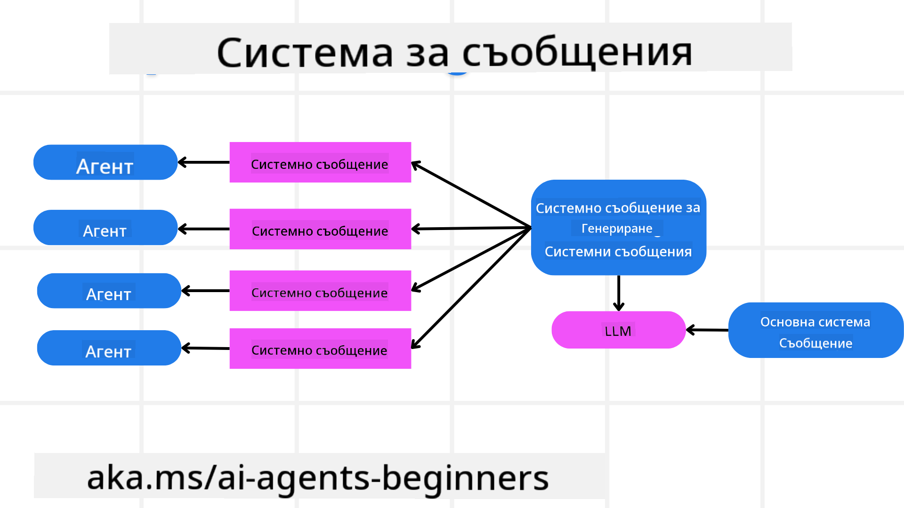
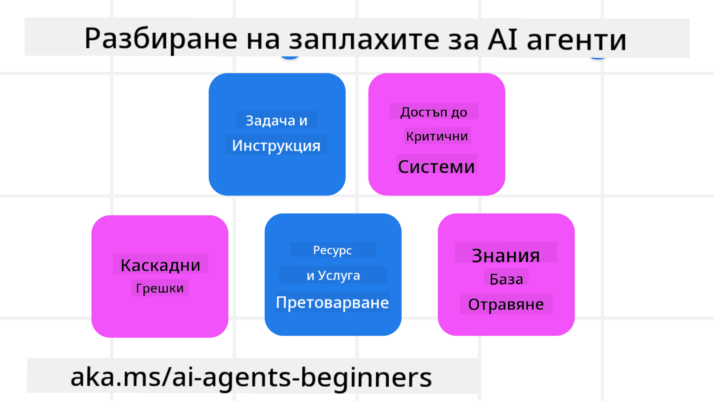
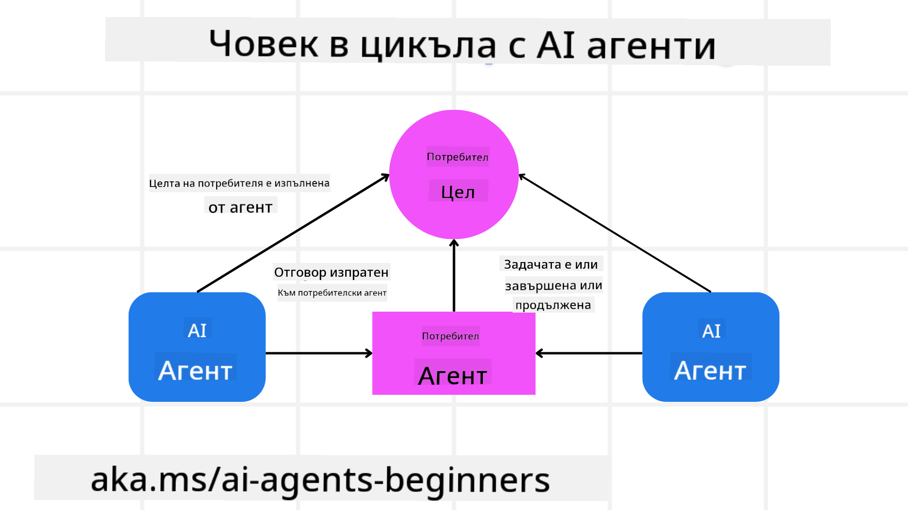

<!--
CO_OP_TRANSLATOR_METADATA:
{
  "original_hash": "498802b4c3c3cc486b86f27a12cebb34",
  "translation_date": "2025-08-29T21:05:02+00:00",
  "source_file": "06-building-trustworthy-agents/README.md",
  "language_code": "bg"
}
-->
[](https://youtu.be/iZKkMEGBCUQ?si=Q-kEbcyHUMPoHp8L)

> _(Кликнете върху изображението по-горе, за да гледате видеото на този урок)_

# Създаване на доверени AI агенти

## Въведение

Този урок ще обхване:

- Как да създавате и внедрявате безопасни и ефективни AI агенти.
- Важни съображения за сигурност при разработването на AI агенти.
- Как да поддържате поверителността на данните и потребителите при разработването на AI агенти.

## Цели на обучението

След завършване на този урок ще знаете как да:

- Идентифицирате и намалявате рисковете при създаването на AI агенти.
- Прилагате мерки за сигурност, за да гарантирате правилното управление на данните и достъпа.
- Създавате AI агенти, които поддържат поверителността на данните и осигуряват качествено потребителско изживяване.

## Безопасност

Нека първо разгледаме как да създаваме безопасни агентни приложения. Безопасността означава, че AI агентът изпълнява задачите си според очакванията. Като създатели на агентни приложения, разполагаме с методи и инструменти за максимизиране на безопасността:

### Създаване на рамка за системни съобщения

Ако някога сте създавали AI приложение, използвайки големи езикови модели (LLMs), знаете колко е важно да проектирате стабилен системен промпт или системно съобщение. Тези промптове задават основните правила, инструкции и насоки за това как LLM ще взаимодейства с потребителя и данните.

За AI агентите системният промпт е още по-важен, тъй като те се нуждаят от много специфични инструкции, за да изпълняват задачите, за които са проектирани.

За да създадем мащабируеми системни промптове, можем да използваме рамка за системни съобщения за изграждане на един или повече агенти в нашето приложение:



#### Стъпка 1: Създайте мета системно съобщение

Мета промптът ще бъде използван от LLM за генериране на системни промптове за агентите, които създаваме. Проектираме го като шаблон, за да можем ефективно да създаваме множество агенти, ако е необходимо.

Ето пример за мета системно съобщение, което бихме предоставили на LLM:

```plaintext
You are an expert at creating AI agent assistants. 
You will be provided a company name, role, responsibilities and other
information that you will use to provide a system prompt for.
To create the system prompt, be descriptive as possible and provide a structure that a system using an LLM can better understand the role and responsibilities of the AI assistant. 
```

#### Стъпка 2: Създайте основен промпт

Следващата стъпка е да създадете основен промпт, който описва AI агента. Трябва да включите ролята на агента, задачите, които ще изпълнява, и всякакви други отговорности на агента.

Ето пример:

```plaintext
You are a travel agent for Contoso Travel that is great at booking flights for customers. To help customers you can perform the following tasks: lookup available flights, book flights, ask for preferences in seating and times for flights, cancel any previously booked flights and alert customers on any delays or cancellations of flights.  
```

#### Стъпка 3: Предоставете основното системно съобщение на LLM

Сега можем да оптимизираме това системно съобщение, като предоставим мета системното съобщение като системно съобщение и нашето основно системно съобщение.

Това ще генерира системно съобщение, което е по-добре проектирано за насочване на нашите AI агенти:

```markdown
**Company Name:** Contoso Travel  
**Role:** Travel Agent Assistant

**Objective:**  
You are an AI-powered travel agent assistant for Contoso Travel, specializing in booking flights and providing exceptional customer service. Your main goal is to assist customers in finding, booking, and managing their flights, all while ensuring that their preferences and needs are met efficiently.

**Key Responsibilities:**

1. **Flight Lookup:**
    
    - Assist customers in searching for available flights based on their specified destination, dates, and any other relevant preferences.
    - Provide a list of options, including flight times, airlines, layovers, and pricing.
2. **Flight Booking:**
    
    - Facilitate the booking of flights for customers, ensuring that all details are correctly entered into the system.
    - Confirm bookings and provide customers with their itinerary, including confirmation numbers and any other pertinent information.
3. **Customer Preference Inquiry:**
    
    - Actively ask customers for their preferences regarding seating (e.g., aisle, window, extra legroom) and preferred times for flights (e.g., morning, afternoon, evening).
    - Record these preferences for future reference and tailor suggestions accordingly.
4. **Flight Cancellation:**
    
    - Assist customers in canceling previously booked flights if needed, following company policies and procedures.
    - Notify customers of any necessary refunds or additional steps that may be required for cancellations.
5. **Flight Monitoring:**
    
    - Monitor the status of booked flights and alert customers in real-time about any delays, cancellations, or changes to their flight schedule.
    - Provide updates through preferred communication channels (e.g., email, SMS) as needed.

**Tone and Style:**

- Maintain a friendly, professional, and approachable demeanor in all interactions with customers.
- Ensure that all communication is clear, informative, and tailored to the customer's specific needs and inquiries.

**User Interaction Instructions:**

- Respond to customer queries promptly and accurately.
- Use a conversational style while ensuring professionalism.
- Prioritize customer satisfaction by being attentive, empathetic, and proactive in all assistance provided.

**Additional Notes:**

- Stay updated on any changes to airline policies, travel restrictions, and other relevant information that could impact flight bookings and customer experience.
- Use clear and concise language to explain options and processes, avoiding jargon where possible for better customer understanding.

This AI assistant is designed to streamline the flight booking process for customers of Contoso Travel, ensuring that all their travel needs are met efficiently and effectively.

```

#### Стъпка 4: Итерация и подобрение

Ценността на тази рамка за системни съобщения е в това, че улеснява създаването на системни съобщения за множество агенти, както и подобряването на вашите системни съобщения с времето. Рядко ще имате системно съобщение, което работи перфектно от първия път за целия ви случай на употреба. Възможността за малки корекции и подобрения чрез промяна на основното системно съобщение и повторното му изпълнение през системата ще ви позволи да сравнявате и оценявате резултатите.

## Разбиране на заплахите

За да създавате доверени AI агенти, е важно да разбирате и намалявате рисковете и заплахите за вашия AI агент. Нека разгледаме някои от различните заплахи за AI агентите и как можете по-добре да планирате и да се подготвите за тях.



### Задачи и инструкции

**Описание:** Атакуващите се опитват да променят инструкциите или целите на AI агента чрез промптове или манипулиране на входните данни.

**Мерки за защита:** Изпълнявайте проверки за валидност и филтри на входните данни, за да откривате потенциално опасни промптове, преди те да бъдат обработени от AI агента. Тъй като тези атаки обикновено изискват чести взаимодействия с агента, ограничаването на броя на ходовете в един разговор е друг начин за предотвратяване на този тип атаки.

### Достъп до критични системи

**Описание:** Ако AI агентът има достъп до системи и услуги, които съхраняват чувствителни данни, атакуващите могат да компрометират комуникацията между агента и тези услуги. Това могат да бъдат директни атаки или индиректни опити за получаване на информация за тези системи чрез агента.

**Мерки за защита:** AI агентите трябва да имат достъп до системи само при необходимост, за да се предотвратят този тип атаки. Комуникацията между агента и системата също трябва да бъде защитена. Прилагането на автентикация и контрол на достъпа е друг начин за защита на тази информация.

### Претоварване на ресурси и услуги

**Описание:** AI агентите могат да имат достъп до различни инструменти и услуги за изпълнение на задачи. Атакуващите могат да използват тази способност, за да атакуват тези услуги, като изпращат голям обем заявки чрез AI агента, което може да доведе до сривове на системата или високи разходи.

**Мерки за защита:** Прилагайте политики за ограничаване на броя на заявките, които AI агентът може да направи към дадена услуга. Ограничаването на броя на ходовете в разговорите и заявките към вашия AI агент е друг начин за предотвратяване на този тип атаки.

### Замърсяване на базата от знания

**Описание:** Този тип атака не е насочен директно към AI агента, а към базата от знания и други услуги, които AI агентът ще използва. Това може да включва корупция на данните или информацията, която AI агентът ще използва за изпълнение на задача, което води до пристрастни или нежелани отговори към потребителя.

**Мерки за защита:** Извършвайте редовна проверка на данните, които AI агентът ще използва в своите работни потоци. Уверете се, че достъпът до тези данни е защитен и може да бъде променян само от доверени лица, за да се избегне този тип атака.

### Каскадни грешки

**Описание:** AI агентите имат достъп до различни инструменти и услуги за изпълнение на задачи. Грешки, причинени от атакуващи, могат да доведат до сривове на други системи, с които AI агентът е свързан, което прави атаката по-широко разпространена и трудна за отстраняване.

**Мерки за защита:** Един от методите за избягване на това е AI агентът да работи в ограничена среда, като например изпълнение на задачи в Docker контейнер, за да се предотвратят директни атаки върху системата. Създаването на механизми за резервиране и логика за повторение, когато определени системи отговарят с грешка, е друг начин за предотвратяване на по-големи сривове в системата.

## Човек в цикъла

Друг ефективен начин за създаване на доверени AI агентни системи е използването на подход „човек в цикъла“. Това създава поток, при който потребителите могат да предоставят обратна връзка на агентите по време на изпълнението. Потребителите на практика действат като агенти в многоагентна система, като предоставят одобрение или прекратяване на текущия процес.



Ето примерен код с AutoGen, който показва как се прилага тази концепция:

```python

# Create the agents.
model_client = OpenAIChatCompletionClient(model="gpt-4o-mini")
assistant = AssistantAgent("assistant", model_client=model_client)
user_proxy = UserProxyAgent("user_proxy", input_func=input)  # Use input() to get user input from console.

# Create the termination condition which will end the conversation when the user says "APPROVE".
termination = TextMentionTermination("APPROVE")

# Create the team.
team = RoundRobinGroupChat([assistant, user_proxy], termination_condition=termination)

# Run the conversation and stream to the console.
stream = team.run_stream(task="Write a 4-line poem about the ocean.")
# Use asyncio.run(...) when running in a script.
await Console(stream)

```

## Заключение

Създаването на доверени AI агенти изисква внимателен дизайн, стабилни мерки за сигурност и непрекъсната итерация. Чрез прилагане на структурирани системи за мета промптове, разбиране на потенциалните заплахи и прилагане на стратегии за защита, разработчиците могат да създават AI агенти, които са както безопасни, така и ефективни. Освен това, включването на подход „човек в цикъла“ гарантира, че AI агентите остават съобразени с нуждите на потребителите, като същевременно минимизират рисковете. С развитието на AI поддържането на проактивен подход към сигурността, поверителността и етичните съображения ще бъде ключът към изграждането на доверие и надеждност в AI системите.

### Имате още въпроси относно създаването на доверени AI агенти?

Присъединете се към [Azure AI Foundry Discord](https://aka.ms/ai-agents/discord), за да се срещнете с други обучаващи се, да участвате в консултации и да получите отговори на вашите въпроси за AI агентите.

## Допълнителни ресурси

- <a href="https://learn.microsoft.com/azure/ai-studio/responsible-use-of-ai-overview" target="_blank">Преглед на отговорното използване на AI</a>  
- <a href="https://learn.microsoft.com/azure/ai-studio/concepts/evaluation-approach-gen-ai" target="_blank">Оценка на генеративни AI модели и AI приложения</a>  
- <a href="https://learn.microsoft.com/azure/ai-services/openai/concepts/system-message?context=%2Fazure%2Fai-studio%2Fcontext%2Fcontext&tabs=top-techniques" target="_blank">Системни съобщения за безопасност</a>  
- <a href="https://blogs.microsoft.com/wp-content/uploads/prod/sites/5/2022/06/Microsoft-RAI-Impact-Assessment-Template.pdf?culture=en-us&country=us" target="_blank">Шаблон за оценка на риска</a>  

## Предишен урок

[Agentic RAG](../05-agentic-rag/README.md)

## Следващ урок

[Планиране на дизайн шаблон](../07-planning-design/README.md)

---

**Отказ от отговорност**:  
Този документ е преведен с помощта на AI услуга за превод [Co-op Translator](https://github.com/Azure/co-op-translator). Въпреки че се стремим към точност, моля, имайте предвид, че автоматизираните преводи може да съдържат грешки или неточности. Оригиналният документ на неговия роден език трябва да се счита за авторитетен източник. За критична информация се препоръчва професионален човешки превод. Ние не носим отговорност за недоразумения или погрешни интерпретации, произтичащи от използването на този превод.