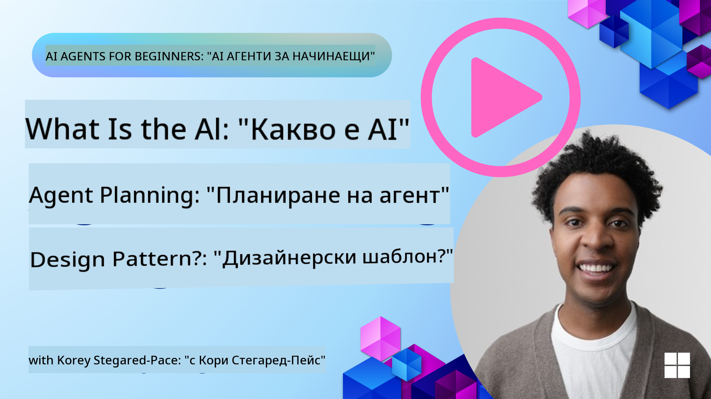
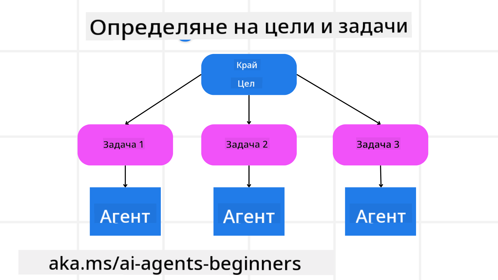

<!--
CO_OP_TRANSLATOR_METADATA:
{
  "original_hash": "a28d30590704ea13b6a08d4793cf9c2b",
  "translation_date": "2025-08-29T21:11:10+00:00",
  "source_file": "07-planning-design/README.md",
  "language_code": "bg"
}
-->
[](https://youtu.be/kPfJ2BrBCMY?si=9pYpPXp0sSbK91Dr)

> _(Кликнете върху изображението по-горе, за да гледате видеото на този урок)_

# Планиране на дизайн

## Въведение

Този урок ще обхване:

* Определяне на ясна обща цел и разбиване на сложна задача на управляеми задачи.
* Използване на структурирани изходни данни за по-надеждни и машинно четими отговори.
* Прилагане на подход, базиран на събития, за справяне с динамични задачи и неочаквани входни данни.

## Цели на обучението

След завършване на този урок ще имате разбиране за:

* Идентифициране и задаване на обща цел за AI агент, като се гарантира, че той ясно знае какво трябва да бъде постигнато.
* Разбиване на сложна задача на управляеми подзадачи и организирането им в логическа последователност.
* Осигуряване на агентите с подходящи инструменти (например инструменти за търсене или анализ на данни), вземане на решения кога и как да се използват и справяне с неочаквани ситуации, които възникват.
* Оценка на резултатите от подзадачите, измерване на производителността и итерация на действията за подобряване на крайния резултат.

## Определяне на общата цел и разбиване на задача



Повечето задачи от реалния свят са твърде сложни, за да бъдат решени в една стъпка. AI агентът се нуждае от кратка цел, която да насочва неговото планиране и действия. Например, разгледайте целта:

    "Създайте 3-дневен план за пътуване."

Въпреки че е лесно да се формулира, тя все пак се нуждае от уточнение. Колкото по-ясна е целта, толкова по-добре агентът (и всеки човешки сътрудник) може да се фокусира върху постигането на правилния резултат, като например създаване на подробен план с опции за полети, препоръки за хотели и предложения за дейности.

### Разбиване на задачи

Големите или сложни задачи стават по-управляеми, когато се разделят на по-малки, целенасочени подзадачи. 
За примера с плана за пътуване, можете да разделите целта на:

* Резервация на полети
* Резервация на хотели
* Наемане на автомобил
* Персонализация

Всяка подзадача може да бъде обработена от специализирани агенти или процеси. Един агент може да се специализира в търсенето на най-добрите оферти за полети, друг да се фокусира върху резервации на хотели и т.н. Координиращ или „низходящ“ агент може след това да обедини тези резултати в един цялостен план за крайния потребител.

Този модулен подход позволява и постепенно подобрение. Например, можете да добавите специализирани агенти за препоръки за храна или местни дейности и да усъвършенствате плана с времето.

### Структуриран изход

Големите езикови модели (LLMs) могат да генерират структуриран изход (например JSON), който е по-лесен за анализиране и обработка от низходящи агенти или услуги. Това е особено полезно в контекста на многоагентна система, където можем да изпълним тези задачи след получаване на изхода от планирането. Вижте това за бърз преглед.

Следният Python код демонстрира прост планиращ агент, който разбива целта на подзадачи и генерира структуриран план:

```python
from pydantic import BaseModel
from enum import Enum
from typing import List, Optional, Union
import json
import os
from typing import Optional
from pprint import pprint
from autogen_core.models import UserMessage, SystemMessage, AssistantMessage
from autogen_ext.models.azure import AzureAIChatCompletionClient
from azure.core.credentials import AzureKeyCredential

class AgentEnum(str, Enum):
    FlightBooking = "flight_booking"
    HotelBooking = "hotel_booking"
    CarRental = "car_rental"
    ActivitiesBooking = "activities_booking"
    DestinationInfo = "destination_info"
    DefaultAgent = "default_agent"
    GroupChatManager = "group_chat_manager"

# Travel SubTask Model
class TravelSubTask(BaseModel):
    task_details: str
    assigned_agent: AgentEnum  # we want to assign the task to the agent

class TravelPlan(BaseModel):
    main_task: str
    subtasks: List[TravelSubTask]
    is_greeting: bool

client = AzureAIChatCompletionClient(
    model="gpt-4o-mini",
    endpoint="https://models.inference.ai.azure.com",
    # To authenticate with the model you will need to generate a personal access token (PAT) in your GitHub settings.
    # Create your PAT token by following instructions here: https://docs.github.com/en/authentication/keeping-your-account-and-data-secure/managing-your-personal-access-tokens
    credential=AzureKeyCredential(os.environ["GITHUB_TOKEN"]),
    model_info={
        "json_output": False,
        "function_calling": True,
        "vision": True,
        "family": "unknown",
    },
)

# Define the user message
messages = [
    SystemMessage(content="""You are an planner agent.
    Your job is to decide which agents to run based on the user's request.
                      Provide your response in JSON format with the following structure:
{'main_task': 'Plan a family trip from Singapore to Melbourne.',
 'subtasks': [{'assigned_agent': 'flight_booking',
               'task_details': 'Book round-trip flights from Singapore to '
                               'Melbourne.'}
    Below are the available agents specialised in different tasks:
    - FlightBooking: For booking flights and providing flight information
    - HotelBooking: For booking hotels and providing hotel information
    - CarRental: For booking cars and providing car rental information
    - ActivitiesBooking: For booking activities and providing activity information
    - DestinationInfo: For providing information about destinations
    - DefaultAgent: For handling general requests""", source="system"),
    UserMessage(
        content="Create a travel plan for a family of 2 kids from Singapore to Melboune", source="user"),
]

response = await client.create(messages=messages, extra_create_args={"response_format": 'json_object'})

response_content: Optional[str] = response.content if isinstance(
    response.content, str) else None
if response_content is None:
    raise ValueError("Response content is not a valid JSON string" )

pprint(json.loads(response_content))

# # Ensure the response content is a valid JSON string before loading it
# response_content: Optional[str] = response.content if isinstance(
#     response.content, str) else None
# if response_content is None:
#     raise ValueError("Response content is not a valid JSON string")

# # Print the response content after loading it as JSON
# pprint(json.loads(response_content))

# Validate the response content with the MathReasoning model
# TravelPlan.model_validate(json.loads(response_content))
```

### Планиращ агент с многоагентна оркестрация

В този пример, агентът Semantic Router получава заявка от потребителя (например, "Имам нужда от план за хотел за моето пътуване.").

Планиращият агент:

* Получава хотелския план: Планиращият агент взема съобщението на потребителя и, въз основа на системен промпт (включително детайли за наличните агенти), генерира структуриран план за пътуване.
* Списък с агенти и техните инструменти: Регистърът на агенти съдържа списък с агенти (например за полети, хотели, наемане на автомобили и дейности) заедно с функциите или инструментите, които те предлагат.
* Насочва плана към съответните агенти: В зависимост от броя на подзадачите, планиращият агент или изпраща съобщението директно към специализиран агент (за сценарии с една задача), или координира чрез мениджър за групов чат за многоагентно сътрудничество.
* Обобщава резултата: Накрая, планиращият агент обобщава генерирания план за яснота.

Следният Python код илюстрира тези стъпки:

```python

from pydantic import BaseModel

from enum import Enum
from typing import List, Optional, Union

class AgentEnum(str, Enum):
    FlightBooking = "flight_booking"
    HotelBooking = "hotel_booking"
    CarRental = "car_rental"
    ActivitiesBooking = "activities_booking"
    DestinationInfo = "destination_info"
    DefaultAgent = "default_agent"
    GroupChatManager = "group_chat_manager"

# Travel SubTask Model

class TravelSubTask(BaseModel):
    task_details: str
    assigned_agent: AgentEnum # we want to assign the task to the agent

class TravelPlan(BaseModel):
    main_task: str
    subtasks: List[TravelSubTask]
    is_greeting: bool
import json
import os
from typing import Optional

from autogen_core.models import UserMessage, SystemMessage, AssistantMessage
from autogen_ext.models.openai import AzureOpenAIChatCompletionClient

# Create the client with type-checked environment variables

client = AzureOpenAIChatCompletionClient(
    azure_deployment=os.getenv("AZURE_OPENAI_DEPLOYMENT_NAME"),
    model=os.getenv("AZURE_OPENAI_DEPLOYMENT_NAME"),
    api_version=os.getenv("AZURE_OPENAI_API_VERSION"),
    azure_endpoint=os.getenv("AZURE_OPENAI_ENDPOINT"),
    api_key=os.getenv("AZURE_OPENAI_API_KEY"),
)

from pprint import pprint

# Define the user message

messages = [
    SystemMessage(content="""You are an planner agent.
    Your job is to decide which agents to run based on the user's request.
    Below are the available agents specialized in different tasks:
    - FlightBooking: For booking flights and providing flight information
    - HotelBooking: For booking hotels and providing hotel information
    - CarRental: For booking cars and providing car rental information
    - ActivitiesBooking: For booking activities and providing activity information
    - DestinationInfo: For providing information about destinations
    - DefaultAgent: For handling general requests""", source="system"),
    UserMessage(content="Create a travel plan for a family of 2 kids from Singapore to Melbourne", source="user"),
]

response = await client.create(messages=messages, extra_create_args={"response_format": TravelPlan})

# Ensure the response content is a valid JSON string before loading it

response_content: Optional[str] = response.content if isinstance(response.content, str) else None
if response_content is None:
    raise ValueError("Response content is not a valid JSON string")

# Print the response content after loading it as JSON

pprint(json.loads(response_content))
```

Следващият изход от предишния код може да бъде използван за насочване към `assigned_agent` и обобщаване на плана за пътуване за крайния потребител.

```json
{
    "is_greeting": "False",
    "main_task": "Plan a family trip from Singapore to Melbourne.",
    "subtasks": [
        {
            "assigned_agent": "flight_booking",
            "task_details": "Book round-trip flights from Singapore to Melbourne."
        },
        {
            "assigned_agent": "hotel_booking",
            "task_details": "Find family-friendly hotels in Melbourne."
        },
        {
            "assigned_agent": "car_rental",
            "task_details": "Arrange a car rental suitable for a family of four in Melbourne."
        },
        {
            "assigned_agent": "activities_booking",
            "task_details": "List family-friendly activities in Melbourne."
        },
        {
            "assigned_agent": "destination_info",
            "task_details": "Provide information about Melbourne as a travel destination."
        }
    ]
}
```

Примерен notebook с предишния код е наличен [тук](07-autogen.ipynb).

### Итеративно планиране

Някои задачи изискват обратна връзка или повторно планиране, при което резултатът от една подзадача влияе върху следващата. Например, ако агентът открие неочакван формат на данни при резервация на полети, може да се наложи да адаптира стратегията си, преди да премине към резервация на хотели.

Освен това, обратната връзка от потребителя (например, ако човек реши, че предпочита по-ранен полет) може да предизвика частично повторно планиране. Този динамичен, итеративен подход гарантира, че крайното решение съответства на реалните ограничения и променящите се предпочитания на потребителя.

Примерен код:

```python
from autogen_core.models import UserMessage, SystemMessage, AssistantMessage
#.. same as previous code and pass on the user history, current plan
messages = [
    SystemMessage(content="""You are a planner agent to optimize the
    Your job is to decide which agents to run based on the user's request.
    Below are the available agents specialized in different tasks:
    - FlightBooking: For booking flights and providing flight information
    - HotelBooking: For booking hotels and providing hotel information
    - CarRental: For booking cars and providing car rental information
    - ActivitiesBooking: For booking activities and providing activity information
    - DestinationInfo: For providing information about destinations
    - DefaultAgent: For handling general requests""", source="system"),
    UserMessage(content="Create a travel plan for a family of 2 kids from Singapore to Melbourne", source="user"),
    AssistantMessage(content=f"Previous travel plan - {TravelPlan}", source="assistant")
]
# .. re-plan and send the tasks to respective agents
```

За по-цялостно планиране, разгледайте Magnetic One за решаване на сложни задачи.

## Обобщение

В тази статия разгледахме пример за това как можем да създадем планиращ агент, който динамично избира наличните агенти, които са дефинирани. Изходът от планиращия агент разбива задачите и назначава агентите, за да бъдат изпълнени. Предполага се, че агентите имат достъп до функциите/инструментите, които са необходими за изпълнение на задачата. Освен агентите, можете да включите и други шаблони като рефлексия, обобщение и ротационен чат, за да персонализирате допълнително.

## Допълнителни ресурси

* AutoGen Magnetic One - Общ многоагентен система за решаване на сложни задачи, която е постигнала впечатляващи резултати на множество предизвикателни бенчмаркове за агенти. Референция:

. В тази имплементация оркестраторът създава план, специфичен за задачата, и делегира тези задачи на наличните агенти. Освен планиране, оркестраторът използва механизъм за проследяване, за да наблюдава напредъка на задачата и да планира отново, ако е необходимо.

### Имате още въпроси относно шаблона за планиране?

Присъединете се към [Azure AI Foundry Discord](https://aka.ms/ai-agents/discord), за да се срещнете с други обучаващи се, да присъствате на часове за въпроси и да получите отговори на вашите въпроси за AI агенти.

## Предишен урок

[Създаване на надеждни AI агенти](../06-building-trustworthy-agents/README.md)

## Следващ урок

[Шаблон за многоагентен дизайн](../08-multi-agent/README.md)

---

**Отказ от отговорност**:  
Този документ е преведен с помощта на AI услуга за превод [Co-op Translator](https://github.com/Azure/co-op-translator). Въпреки че се стремим към точност, моля, имайте предвид, че автоматизираните преводи може да съдържат грешки или неточности. Оригиналният документ на неговия роден език трябва да се счита за авторитетен източник. За критична информация се препоръчва професионален човешки превод. Ние не носим отговорност за недоразумения или погрешни интерпретации, произтичащи от използването на този превод.