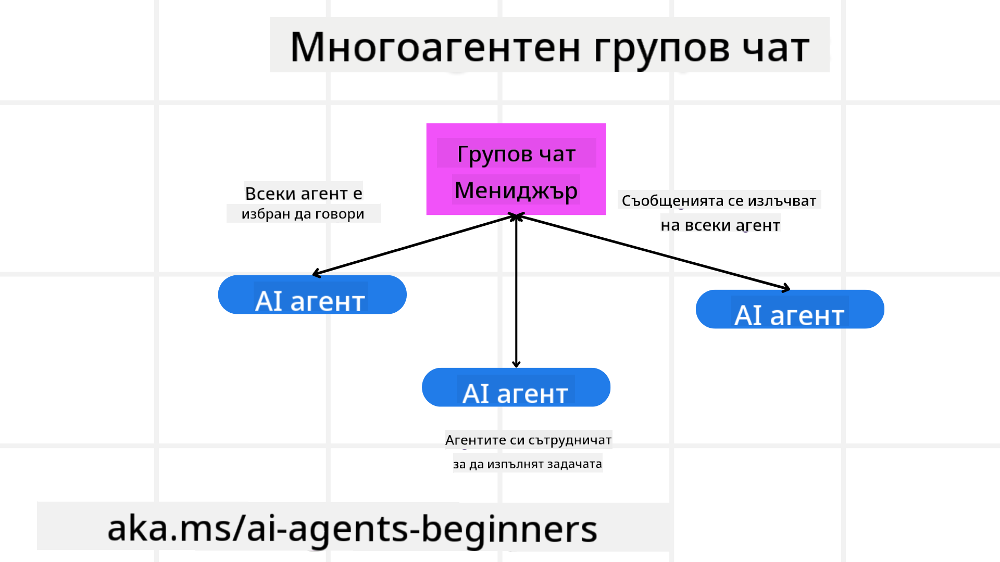
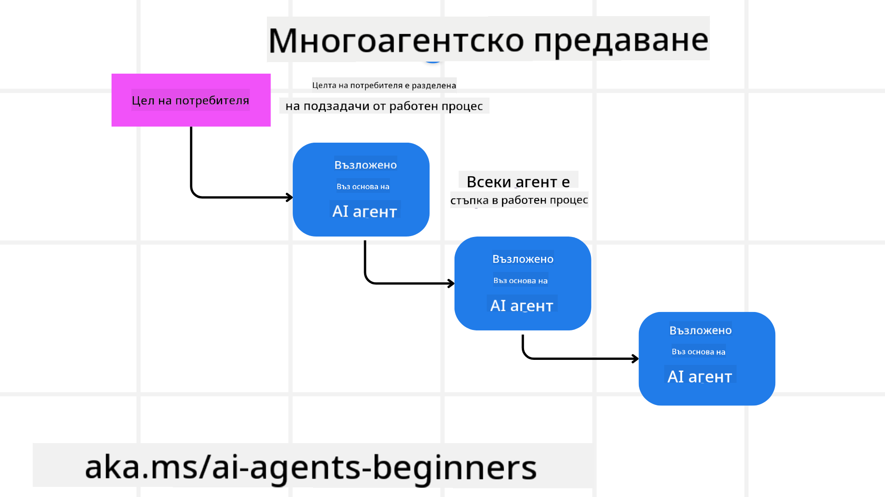
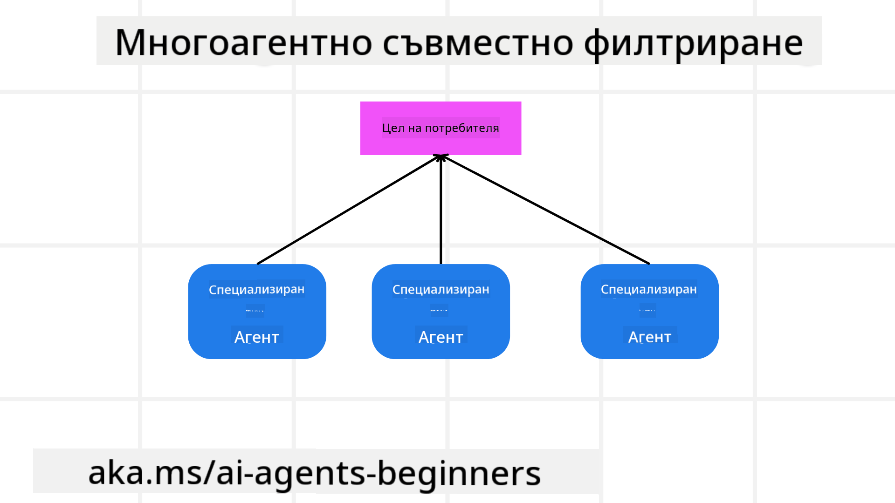

<!--
CO_OP_TRANSLATOR_METADATA:
{
  "original_hash": "c692a8975d7d5b99575a553de1c5e8a7",
  "translation_date": "2025-07-12T11:27:23+00:00",
  "source_file": "08-multi-agent/README.md",
  "language_code": "bg"
}
-->

> _(Кликнете върху изображението по-горе, за да гледате видеото на този урок)_

# Многоагентни дизайн модели

Веднага щом започнете работа по проект, включващ множество агенти, ще трябва да обмислите многоагентния дизайн модел. Въпреки това, може да не е веднага ясно кога да преминете към многоагенти и какви са предимствата.

## Въведение

В този урок ще се опитаме да отговорим на следните въпроси:

- В какви ситуации многоагентните системи са приложими?
- Какви са предимствата на използването на многоагенти спрямо един единствен агент, който изпълнява множество задачи?
- Какви са основните елементи при реализирането на многоагентния дизайн модел?
- Как да имаме видимост върху взаимодействието между множество агенти?

## Цели на обучението

След този урок трябва да можете да:

- Разпознавате ситуации, в които многоагентните системи са приложими
- Осъзнавате предимствата на използването на многоагенти спрямо един единствен агент
- Разбирате основните елементи при реализирането на многоагентния дизайн модел

Каква е по-голямата картина?

*Многоагентните системи са дизайн модел, който позволява на множество агенти да работят заедно, за да постигнат обща цел*.

Този модел се използва широко в различни области, включително роботика, автономни системи и разпределени изчисления.

## Ситуации, в които многоагентните системи са приложими

Кои ситуации са подходящи за използване на многоагенти? Отговорът е, че има много случаи, в които използването на множество агенти е полезно, особено в следните ситуации:

- **Големи натоварвания**: Големите натоварвания могат да се разделят на по-малки задачи и да се възложат на различни агенти, което позволява паралелна обработка и по-бързо изпълнение. Пример за това е при обработка на големи обеми данни.
- **Сложни задачи**: Сложните задачи, подобно на големите натоварвания, могат да се разбият на по-малки подзадачи и да се възложат на различни агенти, всеки от които се специализира в определен аспект на задачата. Добър пример за това са автономните превозни средства, където различни агенти управляват навигацията, откриването на препятствия и комуникацията с други превозни средства.
- **Разнообразна експертиза**: Различните агенти могат да притежават разнообразна експертиза, което им позволява да се справят по-ефективно с различни аспекти на задачата, отколкото един единствен агент. За този случай добър пример е здравеопазването, където агенти могат да управляват диагностика, планове за лечение и наблюдение на пациентите.

## Предимства на използването на многоагенти спрямо един единствен агент

Една система с един агент може да работи добре при прости задачи, но при по-сложни задачи използването на множество агенти може да донесе няколко предимства:

- **Специализация**: Всеки агент може да бъде специализиран за конкретна задача. Липсата на специализация в един агент означава, че имате агент, който може да прави всичко, но може да се обърка при сложни задачи. Например, той може да изпълни задача, за която не е най-подходящ.
- **Мащабируемост**: По-лесно е да се мащабира системата чрез добавяне на повече агенти, отколкото да се претоварва един агент.
- **Толерантност към грешки**: Ако един агент се повреди, другите могат да продължат да функционират, осигурявайки надеждност на системата.

Нека вземем пример – да резервираме пътуване за потребител. Система с един агент би трябвало да се справи с всички аспекти на процеса – от намиране на полети до резервация на хотели и коли под наем. За да се постигне това с един агент, той трябва да разполага с инструменти за всички тези задачи. Това може да доведе до сложна и монолитна система, която е трудна за поддръжка и мащабиране. От друга страна, многоагентна система може да има различни агенти, специализирани в намиране на полети, резервация на хотели и коли под наем. Това прави системата по-модулна, по-лесна за поддръжка и мащабируема.

Сравнете това с туристическа агенция, управлявана като малък семеен бизнес, спрямо туристическа агенция, управлявана като франчайз. Семейният бизнес би имал един агент, който се занимава с всички аспекти на резервацията, докато франчайзът би имал различни агенти, които се грижат за различните аспекти.

## Основни елементи при реализирането на многоагентния дизайн модел

Преди да реализирате многоагентния дизайн модел, трябва да разберете основните елементи, които го изграждат.

Нека направим това по-конкретно, като отново разгледаме примера с резервацията на пътуване за потребител. В този случай основните елементи включват:

- **Комуникация между агенти**: Агентите за намиране на полети, резервация на хотели и коли под наем трябва да комуникират и да споделят информация за предпочитанията и ограниченията на потребителя. Трябва да решите протоколите и методите за тази комуникация. Конкретно това означава, че агентът за намиране на полети трябва да комуникира с агента за резервация на хотели, за да се увери, че хотелът е резервиран за същите дати като полета. Това означава, че агентите трябва да споделят информация за датите на пътуване на потребителя, което изисква да решите *кои агенти споделят информация и как*.
- **Механизми за координация**: Агентите трябва да координират действията си, за да гарантират, че предпочитанията и ограниченията на потребителя са изпълнени. Например, потребителят може да предпочита хотел близо до летището, докато ограничението е, че колите под наем са налични само на летището. Това означава, че агентът за резервация на хотели трябва да координира с агента за коли под наем, за да се увери, че предпочитанията и ограниченията са спазени. Това изисква да решите *как агентите координират действията си*.
- **Архитектура на агента**: Агентите трябва да имат вътрешна структура, която им позволява да вземат решения и да се учат от взаимодействията си с потребителя. Това означава, че агентът за намиране на полети трябва да има структура, която му позволява да решава кои полети да препоръчва на потребителя. Това изисква да решите *как агентите вземат решения и се учат от взаимодействията с потребителя*. Пример за това как агентът се учи и подобрява може да бъде използването на машинно обучение за препоръчване на полети въз основа на предишни предпочитания на потребителя.
- **Видимост върху взаимодействията между многоагентите**: Трябва да имате видимост как множество агенти взаимодействат помежду си. Това означава, че трябва да разполагате с инструменти и техники за проследяване на дейностите и взаимодействията на агентите. Това може да бъде под формата на логиране и мониторинг, визуализационни инструменти и показатели за производителност.
- **Многоагентни модели**: Съществуват различни модели за реализиране на многоагентни системи, като централизирана, децентрализирана и хибридна архитектура. Трябва да изберете модела, който най-добре отговаря на вашия случай.
- **Човек в цикъла**: В повечето случаи ще има човек в цикъла и трябва да инструктирате агентите кога да искат човешка намеса. Това може да бъде под формата на потребител, който иска конкретен хотел или полет, който агентите не са препоръчали, или иска потвърждение преди резервация.

## Видимост върху взаимодействията между многоагентите

Важно е да имате видимост как множество агенти взаимодействат помежду си. Тази видимост е от съществено значение за отстраняване на грешки, оптимизация и осигуряване на ефективността на цялата система. За да постигнете това, трябва да разполагате с инструменти и техники за проследяване на дейностите и взаимодействията на агентите. Това може да бъде под формата на логиране и мониторинг, визуализационни инструменти и показатели за производителност.

Например, при резервация на пътуване за потребител, можете да имате табло, което показва статуса на всеки агент, предпочитанията и ограниченията на потребителя и взаимодействията между агентите. Това табло може да показва датите на пътуване, полетите, препоръчани от агента за полети, хотелите, препоръчани от агента за хотели, и колите под наем, препоръчани от агента за коли под наем. Това ще ви даде ясен поглед върху това как агентите взаимодействат и дали предпочитанията и ограниченията на потребителя са изпълнени.

Нека разгледаме всеки от тези аспекти по-подробно.

- **Инструменти за логиране и мониторинг**: Желаете да имате логове за всяко действие, предприето от агент. Запис в лог може да съдържа информация за агента, който е извършил действието, самото действие, времето на извършване и резултата от действието. Тази информация може да се използва за отстраняване на грешки, оптимизация и други.
- **Визуализационни инструменти**: Те могат да ви помогнат да видите взаимодействията между агентите по-интуитивно. Например, можете да имате графика, която показва потока на информация между агентите. Това може да ви помогне да идентифицирате тесни места, неефективности и други проблеми в системата.
- **Показатели за производителност**: Те могат да ви помогнат да следите ефективността на многоагентната система. Например, можете да следите времето за изпълнение на задача, броя на завършените задачи за единица време и точността на препоръките, направени от агентите. Тази информация може да ви помогне да откриете области за подобрение и да оптимизирате системата.

## Многоагентни модели

Нека разгледаме някои конкретни модели, които можем да използваме за създаване на многоагентни приложения. Ето някои интересни модели, които си заслужава да се обмислят:

### Групов чат

Този модел е полезен, когато искате да създадете приложение за групов чат, в което множество агенти могат да комуникират помежду си. Типични случаи на използване включват екипна колаборация, клиентска поддръжка и социални мрежи.

В този модел всеки агент представлява потребител в груповия чат, а съобщенията се обменят между агентите чрез протокол за съобщения. Агентите могат да изпращат съобщения към груповия чат, да получават съобщения от него и да отговарят на съобщения от други агенти.

Този модел може да бъде реализиран чрез централизирана архитектура, където всички съобщения минават през централен сървър, или чрез децентрализирана архитектура, където съобщенията се обменят директно.

### Прехвърляне на задачи

Този модел е полезен, когато искате да създадете приложение, в което множество агенти могат да прехвърлят задачи помежду си.

Типични случаи на използване включват клиентска поддръжка, управление на задачи и автоматизация на работни потоци.

В този модел всеки агент представлява задача или стъпка в работния поток, а агентите могат да прехвърлят задачи на други агенти според предварително зададени правила.

### Съвместна филтрация

Този модел е полезен, когато искате да създадете приложение, в което множество агенти могат да си сътрудничат, за да правят препоръки на потребителите.

Причината да искате множество агенти да си сътрудничат е, че всеки агент може да има различна експертиза и да допринася по различен начин за процеса на препоръчване.

Нека вземем пример, в който потребител иска препоръка за най-добрата акция за покупка на фондовия пазар.

- **Експерт по индустрията**: Един агент може да е експерт в конкретна индустрия.
- **Технически анализ**: Друг агент може да е експерт в техническия анализ.
- **Фундаментален анализ**: Трети агент може да е експерт във фундаменталния анализ. Чрез сътрудничество тези агенти могат да предоставят по-пълна препоръка на потребителя.

## Сценарий: Процес на възстановяване на суми

Разгледайте сценарий, в който клиент се опитва да получи възстановяване на сума за продукт. В този процес могат да участват доста агенти, но нека ги разделим на агенти, специфични за този процес, и общи агенти, които могат да се използват и в други процеси.

**Агенти, специфични за процеса на възстановяване:**

Следват някои агенти, които могат да участват в процеса на възстановяване:

- **Агент на клиента**: Този агент представлява клиента и е отговорен за иницииране на процеса на възстановяване.
- **Агент на продавача**: Този агент представлява продавача и е отговорен за обработка на възстановяването.
- **Агент на плащането**: Този агент представлява процеса на плащане и е отговорен за възстановяване на сумата на клиента.
- **Агент за разрешаване**: Този агент представлява процеса на разрешаване и е отговорен за решаване на възникнали проблеми по време на процеса.
- **Агент за съответствие**: Този агент представлява процеса на съответствие и гарантира, че процесът на възстановяване отговаря на регулациите и политиките.

**Общи агенти:**

Тези агенти могат да се използват и в други части на вашия бизнес.

- **Агент за доставка**: Този агент представлява процеса на доставка и е отговорен за връщането на продукта на продавача. Този агент може да се използва както за процеса на възстановяване, така и за обща доставка на продукт при покупка.
- **Агент за обратна връзка**: Този агент представлява процеса на събиране на обратна връзка от клиента. Обратната връзка може да се събира по всяко време, не само по време на процеса на възстановяване.
- **Агент за ескалация**: Този агент представлява процеса на ескалация и е отговорен за прехвърляне на проблеми към по-високо ниво на поддръжка. Можете да използвате този тип агент за всеки процес, в който е необходимо ескалиране.
- **Агент за уведомления**: Този агент представлява процеса на уведомяване и е отговорен за изпращане на известия към клиента на различни етапи от процеса на възстановяване.
- **Агент за анализи**: Този агент представлява процеса на анализ и е отговорен за анализиране на данни, свързани с процеса на възстановяване.
- **Агент за одит**: Този агент представлява процеса на одит и е отговорен за проверка дали процесът на възстановяване се изпълнява правилно.
- **Агент за отчети**: Този агент представлява процеса на генериране на отчети за процеса на възстановяване.
- **Агент за знания**: Този агент представлява процеса на управление на знания и поддържа база данни с информация, свързана с процеса на възстановяване. Този агент може да е запознат както с възстанов
## Предишен урок

[Планиране на дизайна](../07-planning-design/README.md)

## Следващ урок

[Метакогниция при AI агенти](../09-metacognition/README.md)

**Отказ от отговорност**:  
Този документ е преведен с помощта на AI преводаческа услуга [Co-op Translator](https://github.com/Azure/co-op-translator). Въпреки че се стремим към точност, моля, имайте предвид, че автоматизираните преводи могат да съдържат грешки или неточности. Оригиналният документ на неговия роден език трябва да се счита за авторитетен източник. За критична информация се препоръчва професионален човешки превод. Ние не носим отговорност за каквито и да е недоразумения или неправилни тълкувания, произтичащи от използването на този превод.