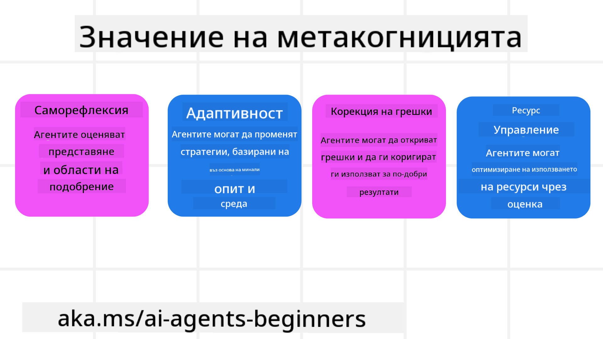
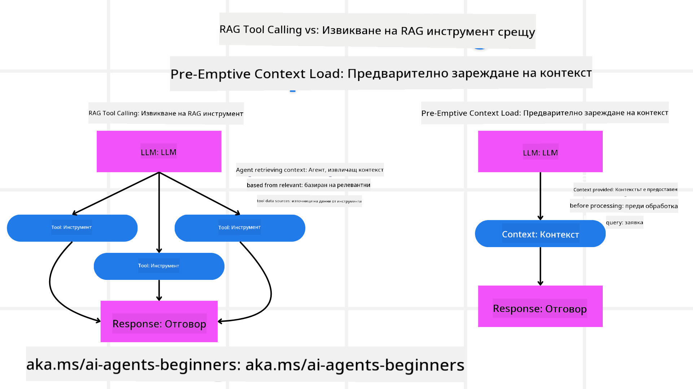

<!--
CO_OP_TRANSLATOR_METADATA:
{
  "original_hash": "8cbf460468c802c7994aa62e0e0779c9",
  "translation_date": "2025-07-12T13:19:24+00:00",
  "source_file": "09-metacognition/README.md",
  "language_code": "bg"
}
-->
[](https://youtu.be/His9R6gw6Ec?si=3_RMb8VprNvdLRhX)

> _(Кликнете върху изображението по-горе, за да гледате видеото на този урок)_
# Метакогниция при AI агенти

## Въведение

Добре дошли в урока за метакогниция при AI агенти! Тази глава е предназначена за начинаещи, които се интересуват как AI агентите могат да мислят за собствените си мисловни процеси. В края на урока ще разберете ключови концепции и ще имате практически примери за прилагане на метакогниция в дизайна на AI агенти.

## Цели на обучението

След завършване на този урок ще можете да:

1. Разберете последиците от цикли на разсъждение в дефинициите на агенти.
2. Използвате техники за планиране и оценка, за да подпомогнете самокоригиращи се агенти.
3. Създавате собствени агенти, способни да манипулират код за изпълнение на задачи.

## Въведение в метакогницията

Метакогницията се отнася до по-високите когнитивни процеси, които включват мислене за собственото мислене. За AI агентите това означава способността да оценяват и коригират действията си въз основа на самосъзнание и минал опит. Метакогницията, или „мислене за мисленето“, е важна концепция при разработването на агентни AI системи. Тя включва AI системи, които са наясно със собствените си вътрешни процеси и могат да наблюдават, регулират и адаптират поведението си съответно. Подобно на това, което правим, когато „четем стаята“ или разглеждаме проблем. Това самосъзнание помага на AI системите да вземат по-добри решения, да откриват грешки и да подобряват представянето си с времето – отново връзка с теста на Тюринг и дебата дали AI ще поеме контрола.

В контекста на агентните AI системи, метакогницията може да помогне за решаването на няколко предизвикателства, като например:
- Прозрачност: Осигуряване на възможност AI системите да обясняват своите разсъждения и решения.
- Разсъждение: Подобряване на способността на AI системите да синтезират информация и да вземат обосновани решения.
- Адаптация: Позволяване на AI системите да се приспособяват към нови среди и променящи се условия.
- Възприятие: Подобряване на точността на AI системите при разпознаване и интерпретиране на данни от околната среда.

### Какво е метакогниция?

Метакогницията, или „мислене за мисленето“, е по-висок когнитивен процес, който включва самосъзнание и саморегулация на собствените когнитивни процеси. В сферата на AI, метакогницията дава възможност на агентите да оценяват и адаптират своите стратегии и действия, водещо до подобрено решаване на проблеми и вземане на решения. Като разберете метакогницията, можете да проектирате AI агенти, които не само са по-интелигентни, но и по-адаптивни и ефективни. В истинската метакогниция AI би разсъждавал явно за собственото си разсъждение.

Пример: „Приоритизирах по-евтини полети, защото... може да изпускам директни полети, затова ще проверя отново.“
Следене на начина или причината, поради която е избрал определен маршрут.
- Забелязване, че е направил грешки, защото е разчитал прекалено много на предпочитанията на потребителя от предишния път, затова променя стратегията си за вземане на решения, а не само крайното препоръчване.
- Диагностициране на модели като: „Всеки път, когато потребителят споменава ‘прекалено претъпкано’, не трябва само да премахвам определени атракции, но и да осъзная, че методът ми за избор на ‘топ атракции’ е погрешен, ако винаги ги класирам по популярност.“

### Значението на метакогницията при AI агенти

Метакогницията играе ключова роля в дизайна на AI агенти по няколко причини:



- Саморефлексия: Агентите могат да оценяват собственото си представяне и да идентифицират области за подобрение.
- Адаптивност: Агентите могат да променят стратегиите си въз основа на минал опит и променящи се условия.
- Корекция на грешки: Агентите могат автономно да откриват и коригират грешки, водещо до по-точни резултати.
- Управление на ресурси: Агентите могат да оптимизират използването на ресурси, като време и изчислителна мощ, чрез планиране и оценка на действията си.

## Компоненти на AI агент

Преди да навлезем в метакогнитивните процеси, е важно да разберем основните компоненти на AI агент. Един AI агент обикновено се състои от:

- Персона: Личността и характеристиките на агента, които определят как той взаимодейства с потребителите.
- Инструменти: Възможностите и функциите, които агентът може да изпълнява.
- Умения: Знанията и експертизата, които агентът притежава.

Тези компоненти работят заедно, за да създадат „единица за експертиза“, която може да изпълнява конкретни задачи.

**Пример**:
Помислете за туристически агент, който не само планира вашата почивка, но и коригира маршрута си въз основа на данни в реално време и предишен опит на клиентите.

### Пример: Метакогниция в туристически агент

Представете си, че проектирате туристически агент, задвижван от AI. Този агент, „Travel Agent“, помага на потребителите да планират ваканциите си. За да включите метакогниция, Travel Agent трябва да оценява и коригира действията си въз основа на самосъзнание и минал опит. Ето как метакогницията може да играе роля:

#### Текуща задача

Текущата задача е да помогне на потребител да планира пътуване до Париж.

#### Стъпки за изпълнение на задачата

1. **Събиране на предпочитанията на потребителя**: Попитайте потребителя за дати на пътуване, бюджет, интереси (напр. музеи, кухня, пазаруване) и специфични изисквания.
2. **Извличане на информация**: Търсене на полети, настаняване, атракции и ресторанти, които съответстват на предпочитанията на потребителя.
3. **Генериране на препоръки**: Предоставяне на персонализиран маршрут с детайли за полети, хотелски резервации и предложени дейности.
4. **Корекция въз основа на обратна връзка**: Попитайте потребителя за мнение относно препоръките и направете необходимите корекции.

#### Необходими ресурси

- Достъп до бази данни за полети и хотелски резервации.
- Информация за парижки атракции и ресторанти.
- Данни за обратна връзка от предишни взаимодействия с потребители.

#### Опит и саморефлексия

Travel Agent използва метакогниция, за да оцени представянето си и да се учи от минал опит. Например:

1. **Анализ на обратната връзка от потребителите**: Travel Agent преглежда мненията, за да определи кои препоръки са били добре приети и кои не, и съответно коригира бъдещите си предложения.
2. **Адаптивност**: Ако потребителят е споменал, че не харесва претъпкани места, Travel Agent ще избягва да препоръчва популярни туристически обекти в пикови часове.
3. **Корекция на грешки**: Ако Travel Agent е направил грешка при предишна резервация, например е предложил хотел, който е бил изцяло резервиран, той се учи да проверява наличността по-стриктно преди да прави препоръки.

#### Практически пример за разработчик

Ето опростен пример на код за Travel Agent, включващ метакогниция:

```python
class Travel_Agent:
    def __init__(self):
        self.user_preferences = {}
        self.experience_data = []

    def gather_preferences(self, preferences):
        self.user_preferences = preferences

    def retrieve_information(self):
        # Search for flights, hotels, and attractions based on preferences
        flights = search_flights(self.user_preferences)
        hotels = search_hotels(self.user_preferences)
        attractions = search_attractions(self.user_preferences)
        return flights, hotels, attractions

    def generate_recommendations(self):
        flights, hotels, attractions = self.retrieve_information()
        itinerary = create_itinerary(flights, hotels, attractions)
        return itinerary

    def adjust_based_on_feedback(self, feedback):
        self.experience_data.append(feedback)
        # Analyze feedback and adjust future recommendations
        self.user_preferences = adjust_preferences(self.user_preferences, feedback)

# Example usage
travel_agent = Travel_Agent()
preferences = {
    "destination": "Paris",
    "dates": "2025-04-01 to 2025-04-10",
    "budget": "moderate",
    "interests": ["museums", "cuisine"]
}
travel_agent.gather_preferences(preferences)
itinerary = travel_agent.generate_recommendations()
print("Suggested Itinerary:", itinerary)
feedback = {"liked": ["Louvre Museum"], "disliked": ["Eiffel Tower (too crowded)"]}
travel_agent.adjust_based_on_feedback(feedback)
```

#### Защо метакогницията е важна

- **Саморефлексия**: Агентите могат да анализират представянето си и да откриват области за подобрение.
- **Адаптивност**: Агентите могат да променят стратегии въз основа на обратна връзка и променящи се условия.
- **Корекция на грешки**: Агентите могат автономно да откриват и коригират грешки.
- **Управление на ресурси**: Агентите могат да оптимизират използването на ресурси като време и изчислителна мощ.

Чрез включване на метакогниция, Travel Agent може да предоставя по-персонализирани и точни препоръки за пътуване, подобрявайки цялостното потребителско изживяване.

---

## 2. Планиране при агенти

Планирането е ключов компонент от поведението на AI агентите. То включва очертаване на стъпките, необходими за постигане на цел, като се вземат предвид текущото състояние, ресурсите и възможните препятствия.

### Елементи на планирането

- **Текуща задача**: Ясно дефиниране на задачата.
- **Стъпки за изпълнение на задачата**: Разбиване на задачата на управляеми стъпки.
- **Необходими ресурси**: Идентифициране на нужните ресурси.
- **Опит**: Използване на минал опит за информиране на планирането.

**Пример**:
Ето стъпките, които Travel Agent трябва да предприеме, за да помогне ефективно на потребител при планиране на пътуване:

### Стъпки за Travel Agent

1. **Събиране на предпочитанията на потребителя**
   - Попитайте потребителя за детайли относно дати на пътуване, бюджет, интереси и специфични изисквания.
   - Примери: „Кога планирате да пътувате?“ „Какъв е вашият бюджет?“ „Какви дейности предпочитате по време на ваканция?“

2. **Извличане на информация**
   - Търсене на подходящи опции за пътуване според предпочитанията на потребителя.
   - **Полети**: Търсене на налични полети в рамките на бюджета и предпочитаните дати.
   - **Настаняване**: Намиране на хотели или наеми, които отговарят на предпочитанията за локация, цена и удобства.
   - **Атракции и ресторанти**: Идентифициране на популярни атракции, дейности и заведения, съобразени с интересите на потребителя.

3. **Генериране на препоръки**
   - Съставяне на персонализиран маршрут.
   - Предоставяне на детайли като опции за полети, хотелски резервации и предложени дейности, съобразени с предпочитанията на потребителя.

4. **Представяне на маршрута на потребителя**
   - Споделяне на предложеното пътуване за преглед.
   - Пример: „Ето предложен маршрут за вашето пътуване до Париж. Включва детайли за полети, хотелски резервации и списък с препоръчани дейности и ресторанти. Споделете мнението си!“

5. **Събиране на обратна връзка**
   - Попитайте потребителя за мнение относно предложението.
   - Примери: „Харесвате ли опциите за полети?“ „Подходящ ли е хотелът за вашите нужди?“ „Има ли дейности, които искате да добавите или премахнете?“

6. **Корекция въз основа на обратна връзка**
   - Модифициране на маршрута според мнението на потребителя.
   - Направете необходимите промени в препоръките за полети, настаняване и дейности, за да отговарят по-добре на предпочитанията.

7. **Крайно потвърждение**
   - Представяне на актуализирания маршрут за окончателно одобрение.
   - Пример: „Направих корекциите според вашата обратна връзка. Ето актуализирания маршрут. Всичко ли е наред?“

8. **Резервация и потвърждение**
   - След одобрение от потребителя, пристъпете към резервация на полети, настаняване и планирани дейности.
   - Изпратете потвърждения на потребителя.

9. **Осигуряване на постоянна подкрепа**
   - Бъдете на разположение за помощ при промени или допълнителни заявки преди и по време на пътуването.
   - Пример: „Ако имате нужда от допълнителна помощ по време на пътуването, не се колебайте да се свържете с мен по всяко време!“

### Пример за взаимодействие

```python
class Travel_Agent:
    def __init__(self):
        self.user_preferences = {}
        self.experience_data = []

    def gather_preferences(self, preferences):
        self.user_preferences = preferences

    def retrieve_information(self):
        flights = search_flights(self.user_preferences)
        hotels = search_hotels(self.user_preferences)
        attractions = search_attractions(self.user_preferences)
        return flights, hotels, attractions

    def generate_recommendations(self):
        flights, hotels, attractions = self.retrieve_information()
        itinerary = create_itinerary(flights, hotels, attractions)
        return itinerary

    def adjust_based_on_feedback(self, feedback):
        self.experience_data.append(feedback)
        self.user_preferences = adjust_preferences(self.user_preferences, feedback)

# Example usage within a booing request
travel_agent = Travel_Agent()
preferences = {
    "destination": "Paris",
    "dates": "2025-04-01 to 2025-04-10",
    "budget": "moderate",
    "interests": ["museums", "cuisine"]
}
travel_agent.gather_preferences(preferences)
itinerary = travel_agent.generate_recommendations()
print("Suggested Itinerary:", itinerary)
feedback = {"liked": ["Louvre Museum"], "disliked": ["Eiffel Tower (too crowded)"]}
travel_agent.adjust_based_on_feedback(feedback)
```

## 3. Коригираща RAG система

Първо нека разберем разликата между RAG Tool и Pre-emptive Context Load



### Retrieval-Augmented Generation (RAG)

RAG комбинира система за извличане с генеративен модел. Когато се направи заявка, системата за извличане намира релевантни документи или данни от външен източник, а тази информация се използва за обогатяване на входа към генеративния модел. Това помага на модела да генерира по-точни и контекстуално релевантни отговори.

В RAG система агентът извлича релевантна информация от база знания и я използва за генериране на подходящи отговори или действия.

### Коригиращ RAG подход

Коригиращият RAG подход се фокусира върху използването на RAG техники за коригиране на грешки и подобряване на точността на AI агентите. Това включва:

1. **Техника за подканване**: Използване на специфични подканващи фрази, за да насочат агента към извличане на релевантна информация.
2. **Инструмент**: Прилагане на алгоритми и механизми, които позволяват на агента да оценява релевантността на извлечената информация и да генерира точни отговори.
3. **Оценка**: Непрекъснато оценяване на представянето на агента и правене на корекции за подобряване на точността и ефективността.

#### Пример: Коригиращ RAG в търсещ агент

Помислете за търсещ агент, който извлича информация от уеб, за да отговаря на потребителски запитвания. Коригиращият RAG подход може да включва:

1. **Техника за подканване**: Формулиране на търсещи заявки въз основа на входа на потребителя.
2. **Инструмент**: Използване на алгоритми за обработка на естествен език и машинно обучение за класиране и филтриране на резултатите.
3. **Оценка**: Анализ на обратната връзка от потребителите за идентифициране и коригиране на неточности в извлечената информация.

### Коригиращ RAG в Travel Agent

Коригиращият RAG (Retrieval-Augmented Generation) подобрява способността на AI да извлича и генерира информация, като коригира неточности. Нека видим как Travel Agent може да използва този подход, за да предоставя по-точни и релевантни препоръки за пътуване.

Това включва:

- **Техника за подканване:** Използване на специфични подканващи фрази, за да насочи агента към извличане на релевантна информация.
- **Инструмент:** Прилагане на алгоритми и механизми, които позволяват на агента да оценява релевантността на извлечената информация и да генерира
### Предварително зареждане на контекст

Предварителното зареждане на контекст включва зареждане на релевантна информация или фон в модела преди обработката на заявка. Това означава, че моделът има достъп до тази информация от самото начало, което му помага да генерира по-информирани отговори, без да се налага да търси допълнителни данни по време на процеса.

Ето един опростен пример как може да изглежда предварителното зареждане на контекст за приложение на туристически агент на Python:

```python
class TravelAgent:
    def __init__(self):
        # Pre-load popular destinations and their information
        self.context = {
            "Paris": {"country": "France", "currency": "Euro", "language": "French", "attractions": ["Eiffel Tower", "Louvre Museum"]},
            "Tokyo": {"country": "Japan", "currency": "Yen", "language": "Japanese", "attractions": ["Tokyo Tower", "Shibuya Crossing"]},
            "New York": {"country": "USA", "currency": "Dollar", "language": "English", "attractions": ["Statue of Liberty", "Times Square"]},
            "Sydney": {"country": "Australia", "currency": "Dollar", "language": "English", "attractions": ["Sydney Opera House", "Bondi Beach"]}
        }

    def get_destination_info(self, destination):
        # Fetch destination information from pre-loaded context
        info = self.context.get(destination)
        if info:
            return f"{destination}:\nCountry: {info['country']}\nCurrency: {info['currency']}\nLanguage: {info['language']}\nAttractions: {', '.join(info['attractions'])}"
        else:
            return f"Sorry, we don't have information on {destination}."

# Example usage
travel_agent = TravelAgent()
print(travel_agent.get_destination_info("Paris"))
print(travel_agent.get_destination_info("Tokyo"))
```

#### Обяснение

1. **Инициализация (`__init__` метод)**: Класът `TravelAgent` предварително зарежда речник с информация за популярни дестинации като Париж, Токио, Ню Йорк и Сидни. Този речник включва детайли като държава, валута, език и основни забележителности за всяка дестинация.

2. **Извличане на информация (`get_destination_info` метод)**: Когато потребителят зададе въпрос за конкретна дестинация, методът `get_destination_info` извлича съответната информация от предварително заредения речник с контекст.

Чрез предварително зареждане на контекста, приложението на туристическия агент може бързо да отговаря на запитванията на потребителите, без да се налага да търси тази информация в реално време от външен източник. Това прави приложението по-ефективно и отзивчиво.

### Стартиране на план с цел преди итерации

Стартирането на план с цел означава започване с ясна цел или желан резултат. Като дефинира тази цел предварително, моделът може да я използва като водещ принцип през целия итеративен процес. Това помага всяка итерация да се приближава към постигането на желания резултат, правейки процеса по-ефективен и фокусиран.

Ето пример как може да стартирате план за пътуване с цел преди итерации за туристически агент на Python:

### Сценарий

Туристически агент иска да планира персонализирана ваканция за клиент. Целта е да се създаде пътуване, което максимизира удовлетворението на клиента, базирано на неговите предпочитания и бюджет.

### Стъпки

1. Дефиниране на предпочитанията и бюджета на клиента.
2. Стартиране на първоначалния план въз основа на тези предпочитания.
3. Итеративно усъвършенстване на плана, оптимизирайки за удовлетворението на клиента.

#### Python код

```python
class TravelAgent:
    def __init__(self, destinations):
        self.destinations = destinations

    def bootstrap_plan(self, preferences, budget):
        plan = []
        total_cost = 0

        for destination in self.destinations:
            if total_cost + destination['cost'] <= budget and self.match_preferences(destination, preferences):
                plan.append(destination)
                total_cost += destination['cost']

        return plan

    def match_preferences(self, destination, preferences):
        for key, value in preferences.items():
            if destination.get(key) != value:
                return False
        return True

    def iterate_plan(self, plan, preferences, budget):
        for i in range(len(plan)):
            for destination in self.destinations:
                if destination not in plan and self.match_preferences(destination, preferences) and self.calculate_cost(plan, destination) <= budget:
                    plan[i] = destination
                    break
        return plan

    def calculate_cost(self, plan, new_destination):
        return sum(destination['cost'] for destination in plan) + new_destination['cost']

# Example usage
destinations = [
    {"name": "Paris", "cost": 1000, "activity": "sightseeing"},
    {"name": "Tokyo", "cost": 1200, "activity": "shopping"},
    {"name": "New York", "cost": 900, "activity": "sightseeing"},
    {"name": "Sydney", "cost": 1100, "activity": "beach"},
]

preferences = {"activity": "sightseeing"}
budget = 2000

travel_agent = TravelAgent(destinations)
initial_plan = travel_agent.bootstrap_plan(preferences, budget)
print("Initial Plan:", initial_plan)

refined_plan = travel_agent.iterate_plan(initial_plan, preferences, budget)
print("Refined Plan:", refined_plan)
```

#### Обяснение на кода

1. **Инициализация (`__init__` метод)**: Класът `TravelAgent` се инициализира със списък от потенциални дестинации, всяка с атрибути като име, цена и тип дейност.

2. **Стартиране на плана (`bootstrap_plan` метод)**: Този метод създава първоначален план за пътуване въз основа на предпочитанията и бюджета на клиента. Той преминава през списъка с дестинации и ги добавя към плана, ако съвпадат с предпочитанията и са в рамките на бюджета.

3. **Съвпадение на предпочитанията (`match_preferences` метод)**: Този метод проверява дали дадена дестинация отговаря на предпочитанията на клиента.

4. **Итерация на плана (`iterate_plan` метод)**: Този метод усъвършенства първоначалния план, като се опитва да замени всяка дестинация с по-подходяща, като взема предвид предпочитанията и бюджетните ограничения на клиента.

5. **Изчисляване на разходите (`calculate_cost` метод)**: Този метод изчислява общата цена на текущия план, включително потенциална нова дестинация.

#### Пример за използване

- **Първоначален план**: Туристическият агент създава първоначален план въз основа на предпочитанията на клиента за разглеждане на забележителности и бюджет от 2000 долара.
- **Усъвършенстван план**: Туристическият агент итеративно усъвършенства плана, оптимизирайки го спрямо предпочитанията и бюджета на клиента.

Чрез стартиране на плана с ясна цел (например максимизиране на удовлетворението на клиента) и итеративно усъвършенстване, туристическият агент може да създаде персонализиран и оптимизиран маршрут за пътуване. Този подход гарантира, че планът съответства на предпочитанията и бюджета на клиента от самото начало и се подобрява с всяка итерация.

### Използване на LLM за пренареждане и оценяване

Големите езикови модели (LLM) могат да се използват за пренареждане и оценяване чрез оценка на релевантността и качеството на извлечените документи или генерирани отговори. Ето как работи това:

**Извличане:** Първоначалната стъпка извлича набор от кандидат-документи или отговори въз основа на заявката.

**Пренареждане:** LLM оценява тези кандидати и ги пренарежда според тяхната релевантност и качество. Тази стъпка гарантира, че най-релевантната и качествена информация се показва първо.

**Оценяване:** LLM присвоява оценки на всеки кандидат, отразявайки тяхната релевантност и качество. Това помага за избора на най-добрия отговор или документ за потребителя.

Чрез използване на LLM за пренареждане и оценяване, системата може да предостави по-точна и контекстуално релевантна информация, подобрявайки цялостното потребителско изживяване.

Ето пример как туристически агент може да използва Голям езиков модел (LLM) за пренареждане и оценяване на дестинации според предпочитанията на потребителя на Python:

#### Сценарий - Пътуване според предпочитания

Туристически агент иска да препоръча най-добрите дестинации на клиент според неговите предпочитания. LLM ще помогне за пренареждане и оценяване на дестинациите, за да се гарантира, че най-релевантните опции са представени.

#### Стъпки:

1. Събиране на предпочитанията на потребителя.
2. Извличане на списък с потенциални дестинации.
3. Използване на LLM за пренареждане и оценяване на дестинациите според предпочитанията.

Ето как може да актуализирате предишния пример, за да използвате Azure OpenAI Services:

#### Изисквания

1. Трябва да имате абонамент за Azure.
2. Създайте ресурс Azure OpenAI и вземете своя API ключ.

#### Примерен Python код

```python
import requests
import json

class TravelAgent:
    def __init__(self, destinations):
        self.destinations = destinations

    def get_recommendations(self, preferences, api_key, endpoint):
        # Generate a prompt for the Azure OpenAI
        prompt = self.generate_prompt(preferences)
        
        # Define headers and payload for the request
        headers = {
            'Content-Type': 'application/json',
            'Authorization': f'Bearer {api_key}'
        }
        payload = {
            "prompt": prompt,
            "max_tokens": 150,
            "temperature": 0.7
        }
        
        # Call the Azure OpenAI API to get the re-ranked and scored destinations
        response = requests.post(endpoint, headers=headers, json=payload)
        response_data = response.json()
        
        # Extract and return the recommendations
        recommendations = response_data['choices'][0]['text'].strip().split('\n')
        return recommendations

    def generate_prompt(self, preferences):
        prompt = "Here are the travel destinations ranked and scored based on the following user preferences:\n"
        for key, value in preferences.items():
            prompt += f"{key}: {value}\n"
        prompt += "\nDestinations:\n"
        for destination in self.destinations:
            prompt += f"- {destination['name']}: {destination['description']}\n"
        return prompt

# Example usage
destinations = [
    {"name": "Paris", "description": "City of lights, known for its art, fashion, and culture."},
    {"name": "Tokyo", "description": "Vibrant city, famous for its modernity and traditional temples."},
    {"name": "New York", "description": "The city that never sleeps, with iconic landmarks and diverse culture."},
    {"name": "Sydney", "description": "Beautiful harbour city, known for its opera house and stunning beaches."},
]

preferences = {"activity": "sightseeing", "culture": "diverse"}
api_key = 'your_azure_openai_api_key'
endpoint = 'https://your-endpoint.com/openai/deployments/your-deployment-name/completions?api-version=2022-12-01'

travel_agent = TravelAgent(destinations)
recommendations = travel_agent.get_recommendations(preferences, api_key, endpoint)
print("Recommended Destinations:")
for rec in recommendations:
    print(rec)
```

#### Обяснение на кода - Preference Booker

1. **Инициализация**: Класът `TravelAgent` се инициализира със списък от потенциални дестинации, всяка с атрибути като име и описание.

2. **Получаване на препоръки (`get_recommendations` метод)**: Този метод генерира заявка за Azure OpenAI услугата въз основа на предпочитанията на потребителя и прави HTTP POST заявка към Azure OpenAI API, за да получи пренаредени и оценени дестинации.

3. **Генериране на заявка (`generate_prompt` метод)**: Този метод създава заявка за Azure OpenAI, включваща предпочитанията на потребителя и списъка с дестинации. Заявката насочва модела да пренареди и оцени дестинациите според предоставените предпочитания.

4. **API заявка**: Използва се библиотеката `requests` за HTTP POST заявка към Azure OpenAI API. Отговорът съдържа пренаредените и оценени дестинации.

5. **Пример за използване**: Туристическият агент събира предпочитанията на потребителя (например интерес към разглеждане на забележителности и разнообразна култура) и използва Azure OpenAI услугата, за да получи пренаредени и оценени препоръки за дестинации.

Не забравяйте да замените `your_azure_openai_api_key` с вашия реален API ключ за Azure OpenAI и `https://your-endpoint.com/...` с реалния URL на вашия Azure OpenAI endpoint.

Чрез използване на LLM за пренареждане и оценяване, туристическият агент може да предостави по-персонализирани и релевантни препоръки за пътуване на клиентите, подобрявайки тяхното цялостно изживяване.

### RAG: Техника за подаване на заявки срещу инструмент

Retrieval-Augmented Generation (RAG) може да бъде както техника за подаване на заявки, така и инструмент при разработката на AI агенти. Разбирането на разликата между двете може да ви помогне да използвате RAG по-ефективно в проектите си.

#### RAG като техника за подаване на заявки

**Какво представлява?**

- Като техника за подаване на заявки, RAG включва формулиране на конкретни въпроси или заявки, които насочват извличането на релевантна информация от голям корпус или база данни. Тази информация след това се използва за генериране на отговори или действия.

**Как работи:**

1. **Формулиране на заявки**: Създаване на добре структурирани заявки или въпроси, базирани на задачата или входа на потребителя.
2. **Извличане на информация**: Използване на заявките за търсене на релевантни данни от предварително съществуваща база знания или набор от данни.
3. **Генериране на отговор**: Комбиниране на извлечената информация с генеративни AI модели за създаване на пълен и последователен отговор.

**Пример в туристически агент**:

- Вход от потребителя: "Искам да посетя музеи в Париж."
- Заявка: "Намери най-добрите музеи в Париж."
- Извлечена информация: Детайли за Лувъра, Музея Орсе и др.
- Генериран отговор: "Ето някои от най-добрите музеи в Париж: Лувър, Музей Орсе и Център Помпиду."

#### RAG като инструмент

**Какво представлява?**

- Като инструмент, RAG е интегрирана система, която автоматизира процеса на извличане и генериране, улеснявайки разработчиците при имплементиране на сложни AI функционалности без ръчно създаване на заявки за всяка заявка.

**Как работи:**

1. **Интеграция**: Вграждане на RAG в архитектурата на AI агента, позволяващо автоматично управление на задачите по извличане и генериране.
2. **Автоматизация**: Инструментът управлява целия процес – от получаване на входа от потребителя до генериране на крайния отговор, без нужда от ръчни заявки за всяка стъпка.
3. **Ефективност**: Подобрява производителността на агента чрез оптимизиране на процеса на извличане и генериране, позволявайки по-бързи и точни отговори.

**Пример в туристически агент**:

- Вход от потребителя: "Искам да посетя музеи в Париж."
- RAG инструмент: Автоматично извлича информация за музеите и генерира отговор.
- Генериран отговор: "Ето някои от най-добрите музеи в Париж: Лувър, Музей Орсе и Център Помпиду."

### Сравнение

| Аспект                 | Техника за подаване на заявки                          | Инструмент                                         |
|------------------------|-------------------------------------------------------|---------------------------------------------------|
| **Ръчно срещу автоматично** | Ръчно формулиране на заявки за всяка заявка          | Автоматизиран процес за извличане и генериране    |
| **Контрол**             | Повече контрол върху процеса на извличане             | Оптимизира и автоматизира извличането и генерирането |
| **Гъвкавост**           | Позволява персонализирани заявки според нуждите       | По-ефективен за мащабни реализации                 |
| **Сложност**            | Изисква създаване и настройка на заявки               | По-лесен за интеграция в архитектурата на AI агент |

### Практически примери

**Пример за техника за подаване на заявки:**

```python
def search_museums_in_paris():
    prompt = "Find top museums in Paris"
    search_results = search_web(prompt)
    return search_results

museums = search_museums_in_paris()
print("Top Museums in Paris:", museums)
```

**Пример за инструмент:**

```python
class Travel_Agent:
    def __init__(self):
        self.rag_tool = RAGTool()

    def get_museums_in_paris(self):
        user_input = "I want to visit museums in Paris."
        response = self.rag_tool.retrieve_and_generate(user_input)
        return response

travel_agent = Travel_Agent()
museums = travel_agent.get_museums_in_paris()
print("Top Museums in Paris:", museums)
```

### Оценка на релевантността

Оценката на релевантността е ключов аспект от представянето на AI агенти. Тя гарантира, че информацията, извлечена и генерирана от агента, е подходяща, точна и полезна за потребителя. Нека разгледаме как да оценяваме релевантността в AI агенти, включително практически примери и техники.

#### Основни понятия при оценка на релевантността

1. **Осъзнаване на контекста**:
   - Агентът трябва да разбира контекста на заявката на потребителя, за да извлича и генерира релевантна информация.
   - Пример: Ако потребителят пита за "най-добрите ресторанти в Париж", агентът трябва да вземе предвид предпочитанията на потребителя, като тип кухня и бюджет.

2. **Точност**:
   - Информацията, предоставена от агента, трябва да е фактологично вярна и актуална.
   - Пример: Препоръчване на ресторанти, които в момента са отворени и имат добри отзиви, вместо остарели или затворени опции.

3. **Намерение на потребителя**:
   - Агентът трябва да разбира намерението зад заявката, за да предостави най-релевантната информация.
   - Пример: Ако потребителят търси "бюджетни хотели", агентът трябва да приоритизира достъпни опции.

4. **Обратна връзка**:
   - Непрекъснатото събиране и анализиране на обратна връзка от потребителите помага на агента да усъвършенства процеса на оценка на релевантността.
   - Пример: Включване на оценки и коментари от потребители за предишни препоръки, за да се подобрят бъдещите отговори.

#### Практически техники за оценка на релевантността

1. **Оценяване на релевантността**:
   - Присвояване на оценка за релевантност на всеки извлечен елемент според това колко добре съвпада с заявката и предпочитанията на потребителя.
   - Пример:

     ```python
     def relevance_score(item, query):
         score = 0
         if item['category'] in query['interests']:
             score += 1
         if item['price'] <= query['budget']:
             score += 1
         if item['location'] == query['destination']:
             score += 1
         return score
     ```

2. **Филтриране и класиране**:
   - Филтриране на нерелевантни елементи и класиране на останалите според оценките за релевантност.
   - Пример:

     ```python
     def filter_and_rank(items, query):
         ranked_items = sorted(items, key=lambda item: relevance_score(item, query), reverse=True)
         return ranked_items[:10]  # Return top 10 relevant items
     ```

3. **Обработка на естествен език (NLP)**:
   - Използване на NLP техники за разбиране на заявката на потребителя и извличане на релевантна информация.
   - Пример:

     ```python
     def process_query(query):
         # Use NLP to extract key information from the user's query
         processed_query = nlp(query)
         return processed_query
     ```

4. **Интеграция на обратна връзка от потребители**:
   - Събиране на обратна връзка за предоставените препоръки и използването ѝ за коригиране на бъдещите оценки на релевантността.
   - Пример:

     ```python
     def adjust_based_on_feedback(feedback, items):
         for item in items:
             if item['name'] in feedback['liked']:
                 item['relevance'] += 1
             if item['name'] in feedback['disliked']:
                 item['relevance'] -= 1
         return items
     ```

#### Пример: Оценка на релевантността в туристически агент

Ето един практичен пример как Travel Agent може да оцени релевантността на препоръките за пътуване:

```python
class Travel_Agent:
    def __init__(self):
        self.user_preferences = {}
        self.experience_data = []

    def gather_preferences(self, preferences):
        self.user_preferences = preferences

    def retrieve_information(self):
        flights = search_flights(self.user_preferences)
        hotels = search_hotels(self.user_preferences)
        attractions = search_attractions(self.user_preferences)
        return flights, hotels, attractions

    def generate_recommendations(self):
        flights, hotels, attractions = self.retrieve_information()
        ranked_hotels = self.filter_and_rank(hotels, self.user_preferences)
        itinerary = create_itinerary(flights, ranked_hotels, attractions)
        return itinerary

    def filter_and_rank(self, items, query):
        ranked_items = sorted(items, key=lambda item: self.relevance_score(item, query), reverse=True)
        return ranked_items[:10]  # Return top 10 relevant items

    def relevance_score(self, item, query):
        score = 0
        if item['category'] in query['interests']:
            score += 1
        if item['price'] <= query['budget']:
            score += 1
        if item['location'] == query['destination']:
            score += 1
        return score

    def adjust_based_on_feedback(self, feedback, items):
        for item in items:
            if item['name'] in feedback['liked']:
                item['relevance'] += 1
            if item['name'] in feedback['disliked']:
                item['relevance'] -= 1
        return items

# Example usage
travel_agent = Travel_Agent()
preferences = {
    "destination": "Paris",
    "dates": "2025-04-01 to 2025-04-10",
    "budget": "moderate",
    "interests": ["museums", "cuisine"]
}
travel_agent.gather_preferences(preferences)
itinerary = travel_agent.generate_recommendations()
print("Suggested Itinerary:", itinerary)
feedback = {"liked": ["Louvre Museum"], "disliked": ["Eiffel Tower (too crowded)"]}
updated_items = travel_agent.adjust_based_on_feedback(feedback, itinerary['hotels'])
print("Updated Itinerary with Feedback:", updated_items)
```

### Търсене с намерение

Търсенето с намерение включва разбиране и интерпретиране на основната цел или мотив зад заявката на потребителя, за да се извлече и генерира най-релевантната и полезна информация. Този подход надхвърля просто съвпадение на ключови думи и се фокусира върху разбирането на действителните нужди и контекст на потребителя.

#### Основни понятия при търсене с намерение

1. **Разбиране на намерението на потребителя**:
   - Намерението на потребителя може да се класифицира в три основни типа: информационно, навигационно и транзакционно.
     - **Информационно намерение**: Потребителят търси информация по дадена тема (например "К
#### Практически пример: Търсене с намерение в Travel Agent

Нека вземем Travel Agent като пример, за да видим как може да се реализира търсене с намерение.

1. **Събиране на предпочитанията на потребителя**

   ```python
   class Travel_Agent:
       def __init__(self):
           self.user_preferences = {}

       def gather_preferences(self, preferences):
           self.user_preferences = preferences
   ```

2. **Разбиране на намерението на потребителя**

   ```python
   def identify_intent(query):
       if "book" in query or "purchase" in query:
           return "transactional"
       elif "website" in query or "official" in query:
           return "navigational"
       else:
           return "informational"
   ```

3. **Осъзнаване на контекста**

   ```python
   def analyze_context(query, user_history):
       # Combine current query with user history to understand context
       context = {
           "current_query": query,
           "user_history": user_history
       }
       return context
   ```

4. **Търсене и персонализиране на резултатите**

   ```python
   def search_with_intent(query, preferences, user_history):
       intent = identify_intent(query)
       context = analyze_context(query, user_history)
       if intent == "informational":
           search_results = search_information(query, preferences)
       elif intent == "navigational":
           search_results = search_navigation(query)
       elif intent == "transactional":
           search_results = search_transaction(query, preferences)
       personalized_results = personalize_results(search_results, user_history)
       return personalized_results

   def search_information(query, preferences):
       # Example search logic for informational intent
       results = search_web(f"best {preferences['interests']} in {preferences['destination']}")
       return results

   def search_navigation(query):
       # Example search logic for navigational intent
       results = search_web(query)
       return results

   def search_transaction(query, preferences):
       # Example search logic for transactional intent
       results = search_web(f"book {query} to {preferences['destination']}")
       return results

   def personalize_results(results, user_history):
       # Example personalization logic
       personalized = [result for result in results if result not in user_history]
       return personalized[:10]  # Return top 10 personalized results
   ```

5. **Пример за използване**

   ```python
   travel_agent = Travel_Agent()
   preferences = {
       "destination": "Paris",
       "interests": ["museums", "cuisine"]
   }
   travel_agent.gather_preferences(preferences)
   user_history = ["Louvre Museum website", "Book flight to Paris"]
   query = "best museums in Paris"
   results = search_with_intent(query, preferences, user_history)
   print("Search Results:", results)
   ```

---

## 4. Генериране на код като инструмент

Агенти за генериране на код използват AI модели, за да пишат и изпълняват код, решавайки сложни задачи и автоматизирайки процеси.

### Агенти за генериране на код

Агентите за генериране на код използват генеративни AI модели, за да пишат и изпълняват код. Тези агенти могат да решават сложни проблеми, да автоматизират задачи и да предоставят ценни прозрения чрез генериране и изпълнение на код на различни програмни езици.

#### Практически приложения

1. **Автоматизирано генериране на код**: Създаване на кодови фрагменти за конкретни задачи, като анализ на данни, уеб скрейпинг или машинно обучение.
2. **SQL като RAG**: Използване на SQL заявки за извличане и манипулиране на данни от бази данни.
3. **Решаване на проблеми**: Създаване и изпълнение на код за решаване на конкретни проблеми, като оптимизиране на алгоритми или анализ на данни.

#### Пример: Агент за генериране на код за анализ на данни

Представете си, че проектирате агент за генериране на код. Ето как може да работи:

1. **Задача**: Анализ на набор от данни за идентифициране на тенденции и модели.
2. **Стъпки**:
   - Зареждане на набора от данни в инструмент за анализ.
   - Генериране на SQL заявки за филтриране и агрегиране на данните.
   - Изпълнение на заявките и извличане на резултатите.
   - Използване на резултатите за създаване на визуализации и прозрения.
3. **Необходими ресурси**: Достъп до набора от данни, инструменти за анализ и SQL възможности.
4. **Опит**: Използване на предишни резултати от анализи за подобряване на точността и релевантността на бъдещите анализи.

### Пример: Агент за генериране на код за Travel Agent

В този пример ще проектираме агент за генериране на код, Travel Agent, който да помага на потребителите при планиране на пътувания чрез генериране и изпълнение на код. Този агент може да се справя със задачи като извличане на опции за пътуване, филтриране на резултати и съставяне на маршрут с помощта на генеративен AI.

#### Преглед на агента за генериране на код

1. **Събиране на предпочитанията на потребителя**: Събира входни данни като дестинация, дати на пътуване, бюджет и интереси.
2. **Генериране на код за извличане на данни**: Създава кодови фрагменти за извличане на информация за полети, хотели и атракции.
3. **Изпълнение на генерирания код**: Стартира генерирания код за получаване на актуална информация.
4. **Генериране на маршрут**: Събира получените данни в персонализиран план за пътуване.
5. **Настройване според обратна връзка**: Получава обратна връзка от потребителя и при необходимост генерира нов код за подобряване на резултатите.

#### Стъпка по стъпка реализация

1. **Събиране на предпочитанията на потребителя**

   ```python
   class Travel_Agent:
       def __init__(self):
           self.user_preferences = {}

       def gather_preferences(self, preferences):
           self.user_preferences = preferences
   ```

2. **Генериране на код за извличане на данни**

   ```python
   def generate_code_to_fetch_data(preferences):
       # Example: Generate code to search for flights based on user preferences
       code = f"""
       def search_flights():
           import requests
           response = requests.get('https://api.example.com/flights', params={preferences})
           return response.json()
       """
       return code

   def generate_code_to_fetch_hotels(preferences):
       # Example: Generate code to search for hotels
       code = f"""
       def search_hotels():
           import requests
           response = requests.get('https://api.example.com/hotels', params={preferences})
           return response.json()
       """
       return code
   ```

3. **Изпълнение на генерирания код**

   ```python
   def execute_code(code):
       # Execute the generated code using exec
       exec(code)
       result = locals()
       return result

   travel_agent = Travel_Agent()
   preferences = {
       "destination": "Paris",
       "dates": "2025-04-01 to 2025-04-10",
       "budget": "moderate",
       "interests": ["museums", "cuisine"]
   }
   travel_agent.gather_preferences(preferences)
   
   flight_code = generate_code_to_fetch_data(preferences)
   hotel_code = generate_code_to_fetch_hotels(preferences)
   
   flights = execute_code(flight_code)
   hotels = execute_code(hotel_code)

   print("Flight Options:", flights)
   print("Hotel Options:", hotels)
   ```

4. **Генериране на маршрут**

   ```python
   def generate_itinerary(flights, hotels, attractions):
       itinerary = {
           "flights": flights,
           "hotels": hotels,
           "attractions": attractions
       }
       return itinerary

   attractions = search_attractions(preferences)
   itinerary = generate_itinerary(flights, hotels, attractions)
   print("Suggested Itinerary:", itinerary)
   ```

5. **Настройване според обратна връзка**

   ```python
   def adjust_based_on_feedback(feedback, preferences):
       # Adjust preferences based on user feedback
       if "liked" in feedback:
           preferences["favorites"] = feedback["liked"]
       if "disliked" in feedback:
           preferences["avoid"] = feedback["disliked"]
       return preferences

   feedback = {"liked": ["Louvre Museum"], "disliked": ["Eiffel Tower (too crowded)"]}
   updated_preferences = adjust_based_on_feedback(feedback, preferences)
   
   # Regenerate and execute code with updated preferences
   updated_flight_code = generate_code_to_fetch_data(updated_preferences)
   updated_hotel_code = generate_code_to_fetch_hotels(updated_preferences)
   
   updated_flights = execute_code(updated_flight_code)
   updated_hotels = execute_code(updated_hotel_code)
   
   updated_itinerary = generate_itinerary(updated_flights, updated_hotels, attractions)
   print("Updated Itinerary:", updated_itinerary)
   ```

### Използване на осъзнаване на околната среда и разсъждения

Въз основа на схемата на таблицата може да се подобри процесът на генериране на заявки чрез използване на осъзнаване на околната среда и разсъждения.

Ето пример как това може да се направи:

1. **Разбиране на схемата**: Системата ще разбира схемата на таблицата и ще използва тази информация, за да обоснове генерирането на заявките.
2. **Настройване според обратна връзка**: Системата ще коригира предпочитанията на потребителя въз основа на обратна връзка и ще преценява кои полета в схемата трябва да се актуализират.
3. **Генериране и изпълнение на заявки**: Системата ще генерира и изпълнява заявки за извличане на актуализирани данни за полети и хотели според новите предпочитания.

Ето актуализиран пример на Python код, който включва тези концепции:

```python
def adjust_based_on_feedback(feedback, preferences, schema):
    # Adjust preferences based on user feedback
    if "liked" in feedback:
        preferences["favorites"] = feedback["liked"]
    if "disliked" in feedback:
        preferences["avoid"] = feedback["disliked"]
    # Reasoning based on schema to adjust other related preferences
    for field in schema:
        if field in preferences:
            preferences[field] = adjust_based_on_environment(feedback, field, schema)
    return preferences

def adjust_based_on_environment(feedback, field, schema):
    # Custom logic to adjust preferences based on schema and feedback
    if field in feedback["liked"]:
        return schema[field]["positive_adjustment"]
    elif field in feedback["disliked"]:
        return schema[field]["negative_adjustment"]
    return schema[field]["default"]

def generate_code_to_fetch_data(preferences):
    # Generate code to fetch flight data based on updated preferences
    return f"fetch_flights(preferences={preferences})"

def generate_code_to_fetch_hotels(preferences):
    # Generate code to fetch hotel data based on updated preferences
    return f"fetch_hotels(preferences={preferences})"

def execute_code(code):
    # Simulate execution of code and return mock data
    return {"data": f"Executed: {code}"}

def generate_itinerary(flights, hotels, attractions):
    # Generate itinerary based on flights, hotels, and attractions
    return {"flights": flights, "hotels": hotels, "attractions": attractions}

# Example schema
schema = {
    "favorites": {"positive_adjustment": "increase", "negative_adjustment": "decrease", "default": "neutral"},
    "avoid": {"positive_adjustment": "decrease", "negative_adjustment": "increase", "default": "neutral"}
}

# Example usage
preferences = {"favorites": "sightseeing", "avoid": "crowded places"}
feedback = {"liked": ["Louvre Museum"], "disliked": ["Eiffel Tower (too crowded)"]}
updated_preferences = adjust_based_on_feedback(feedback, preferences, schema)

# Regenerate and execute code with updated preferences
updated_flight_code = generate_code_to_fetch_data(updated_preferences)
updated_hotel_code = generate_code_to_fetch_hotels(updated_preferences)

updated_flights = execute_code(updated_flight_code)
updated_hotels = execute_code(updated_hotel_code)

updated_itinerary = generate_itinerary(updated_flights, updated_hotels, feedback["liked"])
print("Updated Itinerary:", updated_itinerary)
```

#### Обяснение - Резервация въз основа на обратна връзка

1. **Осъзнаване на схемата**: Речникът `schema` определя как да се коригират предпочитанията според обратната връзка. Включва полета като `favorites` и `avoid` с съответните корекции.
2. **Настройване на предпочитанията (`adjust_based_on_feedback` метод)**: Този метод коригира предпочитанията според обратната връзка и схемата.
3. **Настройки базирани на околната среда (`adjust_based_on_environment` метод)**: Този метод персонализира корекциите според схемата и обратната връзка.
4. **Генериране и изпълнение на заявки**: Системата генерира код за извличане на актуализирани данни за полети и хотели според коригираните предпочитания и симулира изпълнението на тези заявки.
5. **Генериране на маршрут**: Системата създава актуализиран маршрут въз основа на новите данни за полети, хотели и атракции.

Чрез правене на системата осъзната за околната среда и използване на разсъждения върху схемата, тя може да генерира по-точни и релевантни заявки, което води до по-добри препоръки за пътуване и по-персонализирано потребителско изживяване.

### Използване на SQL като Retrieval-Augmented Generation (RAG) техника

SQL (Structured Query Language) е мощен инструмент за работа с бази данни. Когато се използва като част от Retrieval-Augmented Generation (RAG) подход, SQL може да извлича релевантни данни от бази данни, за да информира и генерира отговори или действия в AI агенти. Нека разгледаме как SQL може да се използва като RAG техника в контекста на Travel Agent.

#### Ключови концепции

1. **Взаимодействие с база данни**:
   - SQL се използва за заявки към бази данни, извличане на релевантна информация и манипулиране на данни.
   - Пример: Извличане на детайли за полети, информация за хотели и атракции от база данни за пътувания.

2. **Интеграция с RAG**:
   - SQL заявките се генерират въз основа на входа и предпочитанията на потребителя.
   - Извлечените данни се използват за създаване на персонализирани препоръки или действия.

3. **Динамично генериране на заявки**:
   - AI агентът генерира динамични SQL заявки според контекста и нуждите на потребителя.
   - Пример: Персонализиране на SQL заявки за филтриране на резултати според бюджет, дати и интереси.

#### Приложения

- **Автоматизирано генериране на код**: Създаване на кодови фрагменти за конкретни задачи.
- **SQL като RAG**: Използване на SQL заявки за манипулиране на данни.
- **Решаване на проблеми**: Създаване и изпълнение на код за решаване на проблеми.

**Пример**: Агент за анализ на данни:

1. **Задача**: Анализ на набор от данни за откриване на тенденции.
2. **Стъпки**:
   - Зареждане на набора от данни.
   - Генериране на SQL заявки за филтриране на данни.
   - Изпълнение на заявки и извличане на резултати.
   - Създаване на визуализации и прозрения.
3. **Ресурси**: Достъп до набор от данни, SQL възможности.
4. **Опит**: Използване на предишни резултати за подобряване на бъдещи анализи.

#### Практически пример: Използване на SQL в Travel Agent

1. **Събиране на предпочитанията на потребителя**

   ```python
   class Travel_Agent:
       def __init__(self):
           self.user_preferences = {}

       def gather_preferences(self, preferences):
           self.user_preferences = preferences
   ```

2. **Генериране на SQL заявки**

   ```python
   def generate_sql_query(table, preferences):
       query = f"SELECT * FROM {table} WHERE "
       conditions = []
       for key, value in preferences.items():
           conditions.append(f"{key}='{value}'")
       query += " AND ".join(conditions)
       return query
   ```

3. **Изпълнение на SQL заявки**

   ```python
   import sqlite3

   def execute_sql_query(query, database="travel.db"):
       connection = sqlite3.connect(database)
       cursor = connection.cursor()
       cursor.execute(query)
       results = cursor.fetchall()
       connection.close()
       return results
   ```

4. **Генериране на препоръки**

   ```python
   def generate_recommendations(preferences):
       flight_query = generate_sql_query("flights", preferences)
       hotel_query = generate_sql_query("hotels", preferences)
       attraction_query = generate_sql_query("attractions", preferences)
       
       flights = execute_sql_query(flight_query)
       hotels = execute_sql_query(hotel_query)
       attractions = execute_sql_query(attraction_query)
       
       itinerary = {
           "flights": flights,
           "hotels": hotels,
           "attractions": attractions
       }
       return itinerary

   travel_agent = Travel_Agent()
   preferences = {
       "destination": "Paris",
       "dates": "2025-04-01 to 2025-04-10",
       "budget": "moderate",
       "interests": ["museums", "cuisine"]
   }
   travel_agent.gather_preferences(preferences)
   itinerary = generate_recommendations(preferences)
   print("Suggested Itinerary:", itinerary)
   ```

#### Примерни SQL заявки

1. **Заявка за полети**

   ```sql
   SELECT * FROM flights WHERE destination='Paris' AND dates='2025-04-01 to 2025-04-10' AND budget='moderate';
   ```

2. **Заявка за хотели**

   ```sql
   SELECT * FROM hotels WHERE destination='Paris' AND budget='moderate';
   ```

3. **Заявка за атракции**

   ```sql
   SELECT * FROM attractions WHERE destination='Paris' AND interests='museums, cuisine';
   ```

Чрез използване на SQL като част от Retrieval-Augmented Generation (RAG) техника, AI агенти като Travel Agent могат динамично да извличат и използват релевантни данни, за да предоставят точни и персонализирани препоръки.

### Пример за метакогниция

За да демонстрираме реализация на метакогниция, нека създадем прост агент, който *разсъждава върху процеса на вземане на решения*, докато решава проблем. В този пример ще изградим система, в която агентът се опитва да оптимизира избора на хотел, но след това оценява собственото си разсъждение и коригира стратегията си, когато направи грешки или подоптимални избори.

Ще симулираме това с базов пример, при който агентът избира хотели на база комбинация от цена и качество, но „разсъждава“ върху решенията си и се коригира съответно.

#### Как това илюстрира метакогниция:

1. **Първоначално решение**: Агентът избира най-евтиния хотел, без да отчита качеството.
2. **Разсъждение и оценка**: След първоначалния избор агентът проверява дали хотелът е „лош“ избор чрез обратна връзка от потребителя. Ако установи, че качеството е било твърде ниско, той разсъждава върху своето решение.
3. **Коригиране на стратегията**: Агентът коригира стратегията си въз основа на разсъжденията и преминава от „най-евтин“ към „най-високо качество“, подобрявайки процеса на вземане на решения в бъдещи итерации.

Ето пример:

```python
class HotelRecommendationAgent:
    def __init__(self):
        self.previous_choices = []  # Stores the hotels chosen previously
        self.corrected_choices = []  # Stores the corrected choices
        self.recommendation_strategies = ['cheapest', 'highest_quality']  # Available strategies

    def recommend_hotel(self, hotels, strategy):
        """
        Recommend a hotel based on the chosen strategy.
        The strategy can either be 'cheapest' or 'highest_quality'.
        """
        if strategy == 'cheapest':
            recommended = min(hotels, key=lambda x: x['price'])
        elif strategy == 'highest_quality':
            recommended = max(hotels, key=lambda x: x['quality'])
        else:
            recommended = None
        self.previous_choices.append((strategy, recommended))
        return recommended

    def reflect_on_choice(self):
        """
        Reflect on the last choice made and decide if the agent should adjust its strategy.
        The agent considers if the previous choice led to a poor outcome.
        """
        if not self.previous_choices:
            return "No choices made yet."

        last_choice_strategy, last_choice = self.previous_choices[-1]
        # Let's assume we have some user feedback that tells us whether the last choice was good or not
        user_feedback = self.get_user_feedback(last_choice)

        if user_feedback == "bad":
            # Adjust strategy if the previous choice was unsatisfactory
            new_strategy = 'highest_quality' if last_choice_strategy == 'cheapest' else 'cheapest'
            self.corrected_choices.append((new_strategy, last_choice))
            return f"Reflecting on choice. Adjusting strategy to {new_strategy}."
        else:
            return "The choice was good. No need to adjust."

    def get_user_feedback(self, hotel):
        """
        Simulate user feedback based on hotel attributes.
        For simplicity, assume if the hotel is too cheap, the feedback is "bad".
        If the hotel has quality less than 7, feedback is "bad".
        """
        if hotel['price'] < 100 or hotel['quality'] < 7:
            return "bad"
        return "good"

# Simulate a list of hotels (price and quality)
hotels = [
    {'name': 'Budget Inn', 'price': 80, 'quality': 6},
    {'name': 'Comfort Suites', 'price': 120, 'quality': 8},
    {'name': 'Luxury Stay', 'price': 200, 'quality': 9}
]

# Create an agent
agent = HotelRecommendationAgent()

# Step 1: The agent recommends a hotel using the "cheapest" strategy
recommended_hotel = agent.recommend_hotel(hotels, 'cheapest')
print(f"Recommended hotel (cheapest): {recommended_hotel['name']}")

# Step 2: The agent reflects on the choice and adjusts strategy if necessary
reflection_result = agent.reflect_on_choice()
print(reflection_result)

# Step 3: The agent recommends again, this time using the adjusted strategy
adjusted_recommendation = agent.recommend_hotel(hotels, 'highest_quality')
print(f"Adjusted hotel recommendation (highest_quality): {adjusted_recommendation['name']}")
```

#### Метакогнитивни способности на агентите

Ключово тук е способността на агента да:
- Оценява предишните си избори и процеса на вземане на решения.
- Коригира стратегията си въз основа на това разсъждение, т.е. метакогниция в действие.

Това е проста форма на метакогниция, при която системата може да коригира процеса си на разсъждение въз основа на вътрешна обратна връзка.

### Заключение

Метакогницията е мощен инструмент, който може значително да подобри възможностите на AI агентите. Чрез включване на метакогнитивни процеси можете да проектирате агенти, които са по-интелигентни, адаптивни и ефективни. Използвайте допълнителните ресурси, за да изследвате по-задълбочено вълнуващия свят на метакогницията в AI агентите.

## Предишен урок

[Multi-Agent Design Pattern](../08-multi-agent/README.md)

## Следващ урок

[AI Agents in Production](../10-ai-agents-production/README.md)

**Отказ от отговорност**:  
Този документ е преведен с помощта на AI преводаческа услуга [Co-op Translator](https://github.com/Azure/co-op-translator). Въпреки че се стремим към точност, моля, имайте предвид, че автоматизираните преводи могат да съдържат грешки или неточности. Оригиналният документ на неговия роден език трябва да се счита за авторитетен източник. За критична информация се препоръчва професионален човешки превод. Ние не носим отговорност за каквито и да е недоразумения или неправилни тълкувания, произтичащи от използването на този превод.