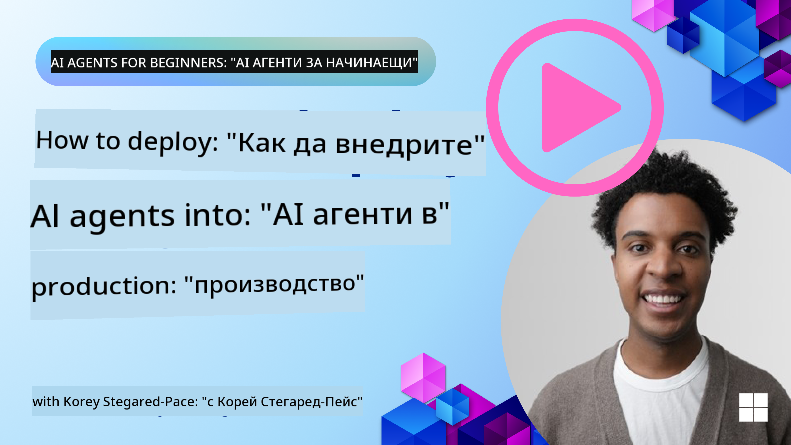

<!--
CO_OP_TRANSLATOR_METADATA:
{
  "original_hash": "1ad5de6a6388d02c145a92dd04358bab",
  "translation_date": "2025-07-12T13:42:15+00:00",
  "source_file": "10-ai-agents-production/README.md",
  "language_code": "bg"
}
-->

> _(Кликнете върху изображението по-горе, за да гледате видеото на този урок)_
# AI агенти в продукция

## Въведение

В този урок ще разгледаме:

- Как ефективно да планирате внедряването на вашия AI агент в продукция.
- Чести грешки и проблеми, с които може да се сблъскате при внедряване на AI агент в продукция.
- Как да управлявате разходите, като същевременно поддържате производителността на вашия AI агент.

## Цели на обучението

След завършване на този урок ще знаете/разберете:

- Техники за подобряване на производителността, разходите и ефективността на система с AI агент в продукция.
- Какво и как да оценявате при вашите AI агенти.
- Как да контролирате разходите при внедряване на AI агенти в продукция.

Важно е да внедрявате AI агенти, на които може да се има доверие. Вижте и урока "Building Trustworthy AI Agents".

## Оценка на AI агенти

Преди, по време и след внедряването на AI агенти е критично да имате подходяща система за оценка на вашите AI агенти. Това ще гарантира, че системата ви е съобразена с вашите и потребителските цели.

За да оцените AI агент, е важно да можете да оцените не само изхода на агента, но и цялата система, в която работи вашият AI агент. Това включва, но не се ограничава до:

- Първоначалната заявка към модела.
- Способността на агента да разпознава намерението на потребителя.
- Способността на агента да избира правилния инструмент за изпълнение на задачата.
- Отговора на инструмента към заявката на агента.
- Способността на агента да интерпретира отговора на инструмента.
- Обратната връзка от потребителя към отговора на агента.

Това ви позволява да идентифицирате области за подобрение по по-модулен начин. След това можете да наблюдавате ефекта от промените в моделите, подсказките, инструментите и други компоненти с по-голяма ефективност.

## Чести проблеми и възможни решения с AI агенти

| **Проблем**                                    | **Възможно решение**                                                                                                                                                                                                       |
| ---------------------------------------------- | -------------------------------------------------------------------------------------------------------------------------------------------------------------------------------------------------------------------------- |
| AI агентът не изпълнява задачите последователно | - Изяснете и усъвършенствайте подсказката, дадена на AI агента; бъдете конкретни относно целите. - Определете дали разделянето на задачите на подзадачи и обработката им от няколко агента може да помогне.               |
| AI агентът влиза в непрекъснати цикли          | - Осигурете ясни условия за прекратяване, за да знае агентът кога да спре процеса. - За сложни задачи, изискващи разсъждение и планиране, използвайте по-голям модел, специализиран за такива задачи.                      |
| Извикванията на инструменти от AI агента не работят добре | - Тествайте и валидирайте изхода на инструмента извън системата на агента. - Усъвършенствайте параметрите, подсказките и имената на инструментите.                                                                        |
| Мултиагентна система не работи последователно | - Усъвършенствайте подсказките, дадени на всеки агент, за да са специфични и различни един от друг. - Изградете йерархична система с "рутингов" или контролиращ агент, който да определя кой агент е най-подходящ.          |

## Управление на разходите

Ето някои стратегии за управление на разходите при внедряване на AI агенти в продукция:

- **Кеширане на отговори** - Идентифицирането на често срещани заявки и задачи и предоставянето на отговорите им преди да преминат през вашата агентна система е добър начин за намаляване на обема на подобни заявки. Можете дори да внедрите поток, който да определя колко сходна е дадена заявка с кешираните, използвайки по-прости AI модели.

- **Използване на по-малки модели** - Малките езикови модели (SLM) могат да се справят добре с определени агентни случаи и значително да намалят разходите. Както беше споменато по-рано, изграждането на система за оценка, която да сравнява производителността с по-големи модели, е най-добрият начин да разберете колко добре ще се представи SLM във вашия случай.

- **Използване на рутер модел** - Подобна стратегия е да използвате разнообразие от модели и размери. Можете да използвате LLM/SLM или безсървърна функция, която да насочва заявките според сложността към най-подходящите модели. Това също помага за намаляване на разходите, като същевременно осигурява производителност при правилните задачи.

## Поздравления

Това е последният урок от "AI Agents for Beginners".

Планираме да продължим да добавяме уроци въз основа на обратна връзка и промени в тази постоянно развиваща се индустрия, така че посетете ни отново в близко бъдеще.

Ако искате да продължите да учите и да изграждате с AI агенти, присъединете се към <a href="https://discord.gg/kzRShWzttr" target="_blank">Azure AI Community Discord</a>.

Там провеждаме работилници, кръгли маси и сесии "питай ме всичко".

Имаме и колекция Learn с допълнителни материали, които могат да ви помогнат да започнете да изграждате AI агенти в продукция.

## Предишен урок

[Metacognition Design Pattern](../09-metacognition/README.md)

**Отказ от отговорност**:  
Този документ е преведен с помощта на AI преводаческа услуга [Co-op Translator](https://github.com/Azure/co-op-translator). Въпреки че се стремим към точност, моля, имайте предвид, че автоматизираните преводи могат да съдържат грешки или неточности. Оригиналният документ на неговия роден език трябва да се счита за авторитетен източник. За критична информация се препоръчва професионален човешки превод. Ние не носим отговорност за каквито и да е недоразумения или неправилни тълкувания, произтичащи от използването на този превод.