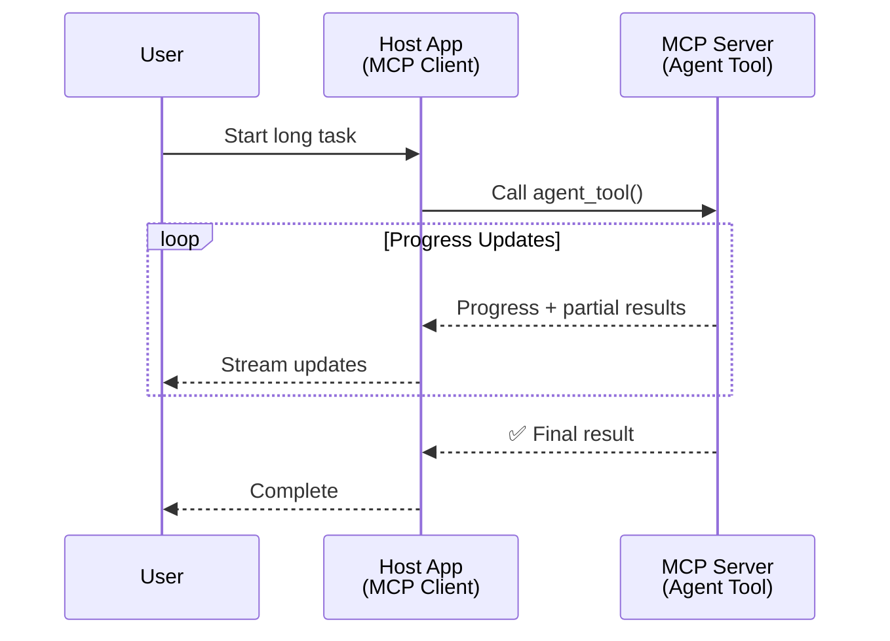
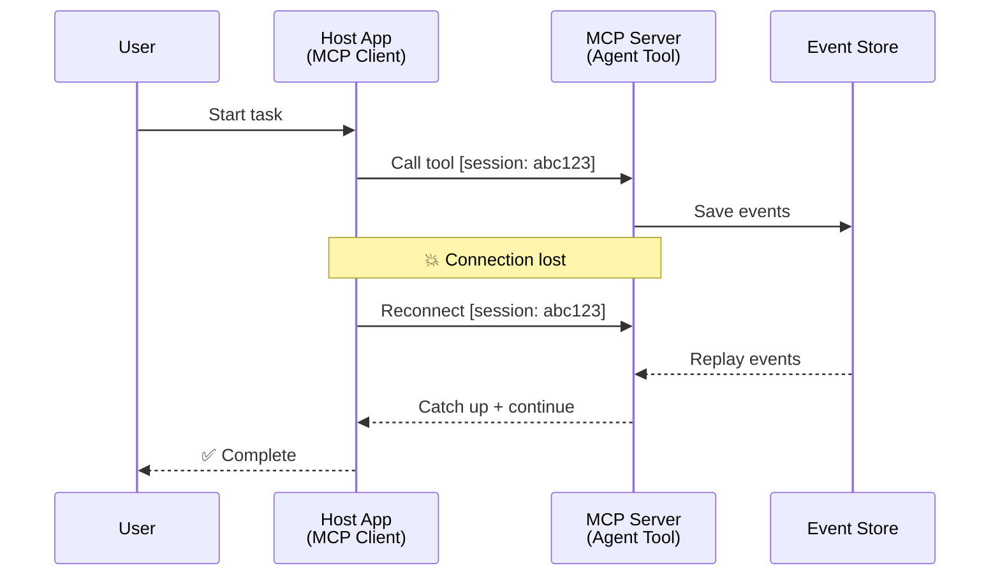
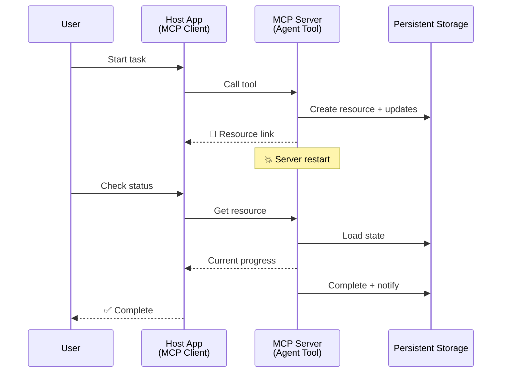
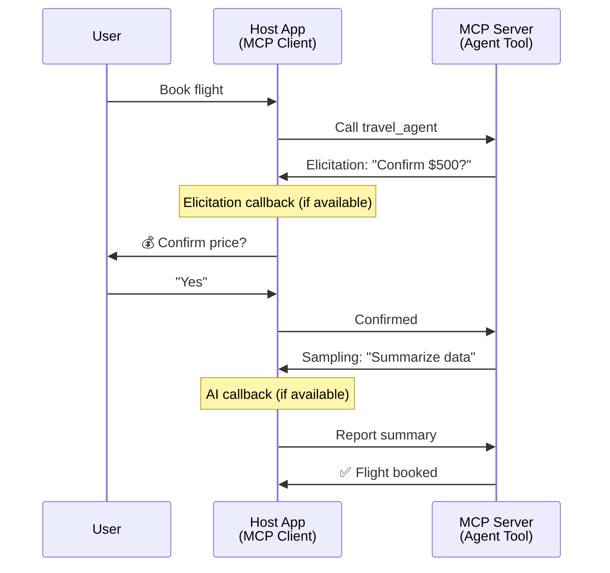

<!--
CO_OP_TRANSLATOR_METADATA:
{
  "original_hash": "5cc6836626047aa055e8960c8484a7d0",
  "translation_date": "2025-08-29T21:21:50+00:00",
  "source_file": "11-agentic-protocols/code_samples/mcp-agents/README.md",
  "language_code": "bg"
}
-->
# Създаване на системи за комуникация между агенти с MCP

> Накратко - Можете ли да изградите комуникация между агенти с MCP? Да!

MCP се е развил значително отвъд първоначалната си цел да "осигурява контекст за LLMs". С последните подобрения, включително [възобновяеми потоци](https://modelcontextprotocol.io/docs/concepts/transports#resumability-and-redelivery), [елицитация](https://modelcontextprotocol.io/specification/2025-06-18/client/elicitation), [семплиране](https://modelcontextprotocol.io/specification/2025-06-18/client/sampling) и известия ([прогрес](https://modelcontextprotocol.io/specification/2025-06-18/basic/utilities/progress) и [ресурси](https://modelcontextprotocol.io/specification/2025-06-18/schema#resourceupdatednotification)), MCP вече предоставя стабилна основа за изграждане на сложни системи за комуникация между агенти.

## Заблудата за агенти/инструменти

С увеличаването на броя на разработчиците, които изследват инструменти с агентно поведение (работят за дълги периоди, може да изискват допълнителен вход по време на изпълнение и т.н.), често срещана заблуда е, че MCP не е подходящ, главно защото ранните примери за неговия примитив за инструменти се фокусираха върху прости модели на заявка-отговор.

Това възприятие е остаряло. Спецификацията на MCP беше значително подобрена през последните месеци с възможности, които запълват празнината за изграждане на дългосрочно агентно поведение:

- **Потоци и частични резултати**: Актуализации в реално време по време на изпълнение
- **Възобновяемост**: Клиентите могат да се свържат отново и да продължат след прекъсване
- **Устойчивост**: Резултатите оцеляват при рестартиране на сървъра (например чрез връзки към ресурси)
- **Многоходови взаимодействия**: Интерактивен вход по време на изпълнение чрез елицитация и семплиране

Тези функции могат да бъдат комбинирани за създаване на сложни агентни и мултиагентни приложения, всички внедрени върху протокола MCP.

За справка, ще наричаме агент "инструмент", който е наличен на MCP сървър. Това предполага съществуването на хост приложение, което имплементира MCP клиент, установява сесия с MCP сървъра и може да извиква агента.

## Какво прави един MCP инструмент "агентен"?

Преди да преминем към имплементацията, нека установим какви инфраструктурни възможности са необходими за поддръжка на дългосрочни агенти.

> Ще дефинираме агент като субект, който може да работи автономно за продължителни периоди, способен да се справя със сложни задачи, които може да изискват множество взаимодействия или корекции въз основа на обратна връзка в реално време.

### 1. Потоци и частични резултати

Традиционните модели на заявка-отговор не работят за дългосрочни задачи. Агенти трябва да предоставят:

- Актуализации за прогреса в реално време
- Междинни резултати

**Поддръжка от MCP**: Известията за актуализация на ресурси позволяват поточно предаване на частични резултати, въпреки че това изисква внимателен дизайн, за да се избегнат конфликти с модела 1:1 на заявка/отговор на JSON-RPC.

| Функция                    | Пример за употреба                                                                                                                                                                       | Поддръжка от MCP                                                                                |
| -------------------------- | ------------------------------------------------------------------------------------------------------------------------------------------------------------------------------ | ------------------------------------------------------------------------------------------ |
| Актуализации за прогреса в реално време | Потребителят заявява задача за миграция на кодова база. Агентът предава прогреса: "10% - Анализ на зависимости... 25% - Конвертиране на TypeScript файлове... 50% - Актуализиране на импорти..."          | ✅ Известия за прогрес                                                                  |
| Частични резултати            | Задача "Генериране на книга" предава частични резултати, напр. 1) Очертание на сюжетната линия, 2) Списък с глави, 3) Всяка завършена глава. Хостът може да инспектира, отмени или пренасочи на всеки етап. | ✅ Известията могат да бъдат "разширени", за да включват частични резултати, вижте предложенията в PR 383, 776 |

<strong>Фигура 1:</strong> Тази диаграма илюстрира как MCP агент предава актуализации за прогреса в реално време и частични резултати към хост приложението по време на дългосрочна задача, позволявайки на потребителя да следи изпълнението в реално време.

### 2. Възобновяемост

Агентите трябва да се справят с прекъсвания на мрежата безпроблемно:

- Повторно свързване след (клиентско) прекъсване
- Продължаване от мястото, където са спрели (повторно предаване на съобщения)

**Поддръжка от MCP**: MCP StreamableHTTP транспортът днес поддържа възобновяване на сесии и повторно предаване на съобщения с идентификатори на сесии и идентификатори на последни събития. Важна бележка тук е, че сървърът трябва да имплементира EventStore, който позволява повторно възпроизвеждане на събития при повторно свързване на клиента.  
Имайте предвид, че има предложение от общността (PR #975), което изследва транспортно-независими възобновяеми потоци.

| Функция      | Пример за употреба                                                                                                                                                   | Поддръжка от MCP                                                                |
| ------------ | ---------------------------------------------------------------------------------------------------------------------------------------------------------- | -------------------------------------------------------------------------- |
| Възобновяемост | Клиентът се прекъсва по време на дългосрочна задача. При повторно свързване сесията се възобновява с възпроизвеждане на пропуснатите събития, продължавайки безпроблемно от мястото, където е спряла. | ✅ StreamableHTTP транспорт с идентификатори на сесии, възпроизвеждане на събития и EventStore |

<strong>Фигура 2:</strong> Тази диаграма показва как StreamableHTTP транспортът и EventStore на MCP позволяват безпроблемно възобновяване на сесии: ако клиентът се прекъсне, той може да се свърже отново и да възпроизведе пропуснатите събития, продължавайки задачата без загуба на прогрес.

### 3. Устойчивост

Дългосрочните агенти се нуждаят от постоянна състояние:

- Резултатите оцеляват при рестартиране на сървъра
- Статусът може да бъде извлечен извън сесията
- Проследяване на прогреса между сесиите

**Поддръжка от MCP**: MCP вече поддържа тип връзка към ресурс като резултат от извикване на инструмент. Днес възможен модел е да се проектира инструмент, който създава ресурс и веднага връща връзка към него. Инструментът може да продължи да обработва задачата във фонов режим и да актуализира ресурса. От своя страна клиентът може да избере да проверява състоянието на този ресурс, за да получи частични или пълни резултати (въз основа на това какви актуализации на ресурса предоставя сървърът) или да се абонира за ресурса за известия за актуализации.

Едно ограничение тук е, че проверката на ресурси или абонирането за актуализации може да консумира ресурси с последствия при мащаб. Има отворено предложение от общността (включително #992), което изследва възможността за включване на уеб куки или тригери, които сървърът може да извика, за да уведоми клиента/хост приложението за актуализации.

| Функция    | Пример за употреба                                                                                                                                        | Поддръжка от MCP                                                        |
| ---------- | ----------------------------------------------------------------------------------------------------------------------------------------------- | ------------------------------------------------------------------ |
| Устойчивост | Сървърът се срива по време на задача за миграция на данни. Резултатите и прогресът оцеляват при рестартиране, клиентът може да провери състоянието и да продължи от постоянния ресурс. | ✅ Връзки към ресурси с постоянна памет и известия за статус |

Днес често срещан модел е да се проектира инструмент, който създава ресурс и веднага връща връзка към него. Инструментът може във фонов режим да обработва задачата, да издава известия за ресурса, които служат като актуализации за прогреса или включват частични резултати, и да актуализира съдържанието в ресурса според нуждите.

<strong>Фигура 3:</strong> Тази диаграма демонстрира как MCP агентите използват постоянни ресурси и известия за статус, за да гарантират, че дългосрочните задачи оцеляват при рестартиране на сървъра, позволявайки на клиентите да проверяват прогреса и да извличат резултати дори след сривове.

### 4. Многоходови взаимодействия

Агентите често се нуждаят от допълнителен вход по време на изпълнение:

- Уточнения или одобрения от човек
- Помощ от AI за сложни решения
- Динамично регулиране на параметри

**Поддръжка от MCP**: Напълно поддържано чрез семплиране (за AI вход) и елицитация (за човешки вход).

| Функция                 | Пример за употреба                                                                                                                                     | Поддръжка от MCP                                           |
| ----------------------- | -------------------------------------------------------------------------------------------------------------------------------------------- | ----------------------------------------------------- |
| Многоходови взаимодействия | Агенция за резервации на пътувания иска потвърждение на цена от потребителя, след което моли AI да обобщи данните за пътуването преди завършване на транзакцията. | ✅ Елицитация за човешки вход, семплиране за AI вход |

<strong>Фигура 4:</strong> Тази диаграма показва как MCP агентите могат интерактивно да изискват човешки вход или да поискат помощ от AI по време на изпълнение, поддържайки сложни, многоходови работни потоци като потвърждения и динамично вземане на решения.

## Имплементация на дългосрочни агенти върху MCP - Преглед на кода

Като част от тази статия предоставяме [репозитория с код](https://github.com/victordibia/ai-tutorials/tree/main/MCP%20Agents), който съдържа пълна имплементация на дългосрочни агенти, използвайки MCP Python SDK със StreamableHTTP транспорт за възобновяване на сесии и повторно предаване на съобщения. Имплементацията демонстрира как възможностите на MCP могат да бъдат комбинирани, за да се позволят сложни агентни поведения.

...

---

**Отказ от отговорност**:  
Този документ е преведен с помощта на AI услуга за превод [Co-op Translator](https://github.com/Azure/co-op-translator). Въпреки че се стремим към точност, моля, имайте предвид, че автоматизираните преводи може да съдържат грешки или неточности. Оригиналният документ на неговия роден език трябва да се счита за авторитетен източник. За критична информация се препоръчва професионален човешки превод. Ние не носим отговорност за недоразумения или погрешни интерпретации, произтичащи от използването на този превод.