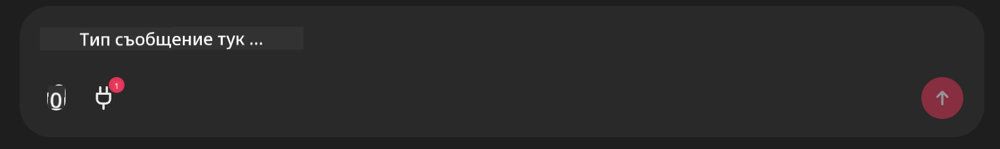

<!--
CO_OP_TRANSLATOR_METADATA:
{
  "original_hash": "9bf0395cbc541ce8db2a9699c8678dfc",
  "translation_date": "2025-07-12T14:24:48+00:00",
  "source_file": "11-mcp/code_samples/github-mcp/README.md",
  "language_code": "bg"
}
-->
# Github MCP Server Пример

## Описание

Това беше демонстрация, създадена за AI Agents Hackathon, организиран от Microsoft Reactor.

Инструментът се използва за препоръчване на проекти за хакатон въз основа на Github репозиториите на потребителя.  
Това се постига чрез:

1. **Github Agent** - Използва Github MCP Server за извличане на репозитории и информация за тях.  
2. **Hackathon Agent** - Взема данните от Github Agent и предлага креативни идеи за проекти за хакатон, базирани на проектите, езиците, които потребителят използва, и тематичните направления на AI Agents хакатона.  
3. **Events Agent** - Въз основа на предложението на Hackathon Agent, Events Agent препоръчва подходящи събития от серията AI Agent Hackathon.

## Стартиране на кода

### Променливи на средата

Тази демонстрация използва Azure Open AI Service, Semantic Kernel, Github MCP Server и Azure AI Search.

Уверете се, че имате правилно зададени променливи на средата, за да използвате тези инструменти:

```python
AZURE_OPENAI_CHAT_DEPLOYMENT_NAME=""
AZURE_OPENAI_EMBEDDING_DEPLOYMENT_NAME=""
AZURE_OPENAI_ENDPOINT=""
AZURE_OPENAI_API_KEY=""
AZURE_OPENAI_API_VERSION=""
AZURE_SEARCH_SERVICE_ENDPOINT=""
AZURE_SEARCH_API_KEY=""
```

## Стартиране на Chainlit сървъра

За да се свържете с MCP сървъра, тази демонстрация използва Chainlit като чат интерфейс.

За да стартирате сървъра, използвайте следната команда в терминала си:

```bash
chainlit run app.py -w
```

Това ще стартира вашия Chainlit сървър на `localhost:8000` и ще попълни Azure AI Search индекса с съдържанието на `event-descriptions.md`.

## Свързване с MCP сървъра

За да се свържете с Github MCP Server, изберете иконата "щепсел" под полето за чат "Type your message here..":



Оттам можете да кликнете на "Connect an MCP", за да добавите командата за свързване с Github MCP Server:

```bash
npx -y @modelcontextprotocol/server-github --env GITHUB_PERSONAL_ACCESS_TOKEN=[YOUR PERSONAL ACCESS TOKEN]
```

Заменете "[YOUR PERSONAL ACCESS TOKEN]" с вашия реален Personal Access Token.

След свързване, трябва да видите (1) до иконата на щепсела, което потвърждава, че връзката е установена. Ако не, опитайте да рестартирате chainlit сървъра с `chainlit run app.py -w`.

## Използване на демонстрацията

За да стартирате работния процес на агента за препоръчване на проекти за хакатон, можете да напишете съобщение като:

"Recommend hackathon projects for the Github user koreyspace"

Router Agent ще анализира вашето запитване и ще определи коя комбинация от агенти (GitHub, Hackathon и Events) е най-подходяща за обработка на заявката ви. Агентите работят заедно, за да предоставят изчерпателни препоръки, базирани на анализ на Github репозитории, идеи за проекти и подходящи технологични събития.

**Отказ от отговорност**:  
Този документ е преведен с помощта на AI преводаческа услуга [Co-op Translator](https://github.com/Azure/co-op-translator). Въпреки че се стремим към точност, моля, имайте предвид, че автоматизираните преводи могат да съдържат грешки или неточности. Оригиналният документ на неговия роден език трябва да се счита за авторитетен източник. За критична информация се препоръчва професионален човешки превод. Ние не носим отговорност за каквито и да е недоразумения или неправилни тълкувания, произтичащи от използването на този превод.