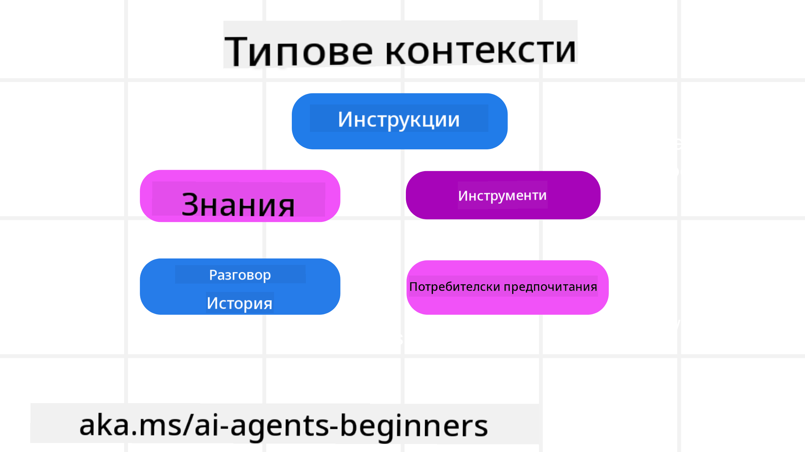
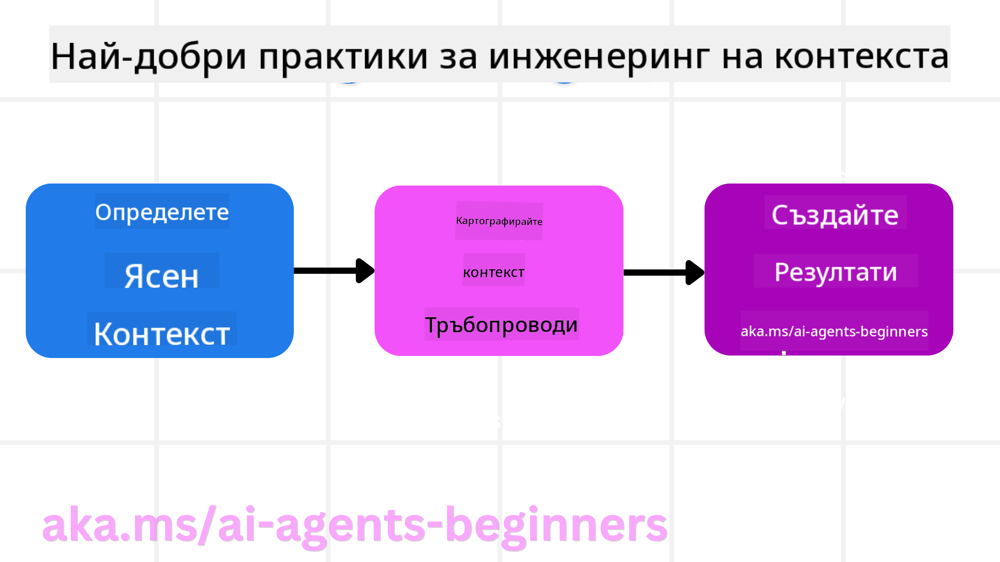

<!--
CO_OP_TRANSLATOR_METADATA:
{
  "original_hash": "cb7e50f471905ce6fdb92a30269a7a98",
  "translation_date": "2025-09-04T10:28:03+00:00",
  "source_file": "12-context-engineering/README.md",
  "language_code": "bg"
}
-->
# Инженеринг на контекста за AI агенти

> _(Кликнете върху изображението по-горе, за да гледате видеото на този урок)_

Разбирането на сложността на приложението, за което изграждате AI агент, е важно за създаването на надежден такъв. Трябва да изграждаме AI агенти, които ефективно управляват информацията, за да отговорят на сложни нужди, надхвърлящи инженеринг на подсказките.

В този урок ще разгледаме какво представлява инженерингът на контекста и неговата роля в изграждането на AI агенти.

## Въведение

Този урок ще обхване:

• **Какво е инженеринг на контекста** и защо е различен от инженеринг на подсказките.

• **Стратегии за ефективен инженеринг на контекста**, включително как да пишем, избираме, компресираме и изолираме информация.

• **Чести грешки в контекста**, които могат да провалят вашия AI агент, и как да ги поправим.

## Цели на обучението

След завършване на този урок ще знаете как да:

• **Дефинирате инженеринг на контекста** и да го разграничите от инженеринг на подсказките.

• **Идентифицирате ключовите компоненти на контекста** в приложенията с големи езикови модели (LLM).

• **Прилагате стратегии за писане, избор, компресиране и изолиране на контекста**, за да подобрите производителността на агента.

• **Разпознавате чести грешки в контекста**, като отравяне, разсейване, объркване и конфликт, и да внедрите техники за тяхното смекчаване.

## Какво е инженеринг на контекста?

За AI агенти контекстът е това, което управлява планирането на действията на агента. Инженерингът на контекста е практиката да се гарантира, че AI агентът разполага с правилната информация, за да изпълни следващата стъпка от задачата. Контекстният прозорец е ограничен по размер, така че като създатели на агенти трябва да изградим системи и процеси за управление на добавянето, премахването и кондензирането на информацията в контекстния прозорец.

### Инженеринг на подсказките срещу инженеринг на контекста

Инженерингът на подсказките се фокусира върху един набор от статични инструкции, които ефективно насочват AI агентите с набор от правила. Инженерингът на контекста е свързан с управлението на динамичен набор от информация, включително началната подсказка, за да се гарантира, че AI агентът разполага с необходимото с течение на времето. Основната идея на инженеринга на контекста е да направи този процес повторяем и надежден.

### Видове контекст

Важно е да запомним, че контекстът не е само едно нещо. Информацията, от която AI агентът се нуждае, може да идва от различни източници, и е наша задача да гарантираме, че агентът има достъп до тези източници:

Видовете контекст, които AI агентът може да се наложи да управлява, включват:

• **Инструкции:** Това са като "правилата" на агента – подсказки, системни съобщения, примери с малко изстрели (показващи на AI как да направи нещо) и описания на инструменти, които може да използва. Тук се комбинират инженерингът на подсказките и инженерингът на контекста.

• **Знания:** Това обхваща факти, информация, извлечена от бази данни, или дългосрочни спомени, които агентът е натрупал. Това включва интегриране на система за генериране с допълнително извличане (RAG), ако агентът се нуждае от достъп до различни хранилища на знания и бази данни.

• **Инструменти:** Това са дефинициите на външни функции, API-та и MCP сървъри, които агентът може да извика, заедно с обратната връзка (резултатите), която получава от използването им.

• **История на разговорите:** Текущият диалог с потребителя. С течение на времето тези разговори стават по-дълги и сложни, което означава, че заемат място в контекстния прозорец.

• **Предпочитания на потребителя:** Информация, научена за предпочитанията на потребителя с течение на времето. Те могат да бъдат съхранени и използвани при вземане на ключови решения, за да помогнат на потребителя.

## Стратегии за ефективен инженеринг на контекста

### Стратегии за планиране

Добрият инженеринг на контекста започва с добро планиране. Ето подход, който ще ви помогне да започнете да мислите как да приложите концепцията за инженеринг на контекста:

1. **Дефинирайте ясни резултати** - Резултатите от задачите, които AI агентите ще бъдат назначени, трябва да бъдат ясно дефинирани. Отговорете на въпроса - "Как ще изглежда светът, когато AI агентът приключи задачата си?" С други думи, каква промяна, информация или отговор трябва да има потребителят след взаимодействие с AI агента.

2. **Картографирайте контекста** - След като сте дефинирали резултатите от AI агента, трябва да отговорите на въпроса "Каква информация е необходима на AI агента, за да изпълни тази задача?". По този начин можете да започнете да картографирате контекста на местата, където тази информация може да бъде намерена.

3. **Създайте контекстни тръбопроводи** - Сега, когато знаете къде е информацията, трябва да отговорите на въпроса "Как агентът ще получи тази информация?". Това може да се направи по различни начини, включително RAG, използване на MCP сървъри и други инструменти.

### Практически стратегии

Планирането е важно, но след като информацията започне да влиза в контекстния прозорец на агента, трябва да имаме практически стратегии за управление:

#### Управление на контекста

Докато част от информацията ще бъде добавена към контекстния прозорец автоматично, инженерингът на контекста е свързан с по-активно управление на тази информация, което може да се направи чрез няколко стратегии:

1. **Бележник на агента**  
Позволява на AI агента да води бележки за релевантна информация относно текущите задачи и взаимодействията с потребителя по време на една сесия. Това трябва да съществува извън контекстния прозорец в файл или обект на изпълнение, който агентът може да извлече по-късно, ако е необходимо.

2. **Спомени**  
Бележниците са добри за управление на информация извън контекстния прозорец на една сесия. Спомените позволяват на агентите да съхраняват и извличат релевантна информация през множество сесии. Това може да включва резюмета, предпочитания на потребителя и обратна връзка за подобрения в бъдеще.

3. **Компресиране на контекста**  
Когато контекстният прозорец се разраства и наближава своя лимит, могат да се използват техники като обобщение и съкращаване. Това включва запазване само на най-релевантната информация или премахване на по-стари съобщения.

4. **Системи с множество агенти**  
Разработването на система с множество агенти е форма на инженеринг на контекста, защото всеки агент има свой контекстен прозорец. Как този контекст се споделя и предава между различните агенти е още един аспект, който трябва да се планира при изграждането на тези системи.

5. **Пясъчни среди**  
Ако агентът трябва да изпълни код или обработи големи количества информация в документ, това може да изисква голямо количество токени за обработка на резултатите. Вместо всичко това да се съхранява в контекстния прозорец, агентът може да използва пясъчна среда, която може да изпълни този код и да прочете само резултатите и друга релевантна информация.

6. **Обекти за състояние на изпълнение**  
Това се прави чрез създаване на контейнери за информация, за да се управляват ситуации, когато агентът трябва да има достъп до определена информация. За сложна задача това би позволило на агента да съхранява резултатите от всяка подзадача стъпка по стъпка, позволявайки контекстът да остане свързан само с конкретната подзадача.

### Пример за инженеринг на контекста

Да кажем, че искаме AI агент да **"Резервира ми пътуване до Париж."**

• Прост агент, използващ само инженеринг на подсказките, може просто да отговори: **"Добре, кога искате да отидете в Париж?"**. Той обработва само вашия директен въпрос в момента, когато потребителят го зададе.

• Агент, използващ стратегиите за инженеринг на контекста, разгледани тук, би направил много повече. Преди дори да отговори, неговата система може:

  ◦ **Да провери вашия календар** за налични дати (извличане на данни в реално време).

 ◦ **Да си припомни предишни предпочитания за пътуване** (от дългосрочна памет), като предпочитана авиокомпания, бюджет или дали предпочитате директни полети.

 ◦ **Да идентифицира налични инструменти** за резервация на полети и хотели.

- След това примерен отговор може да бъде: **"Здравейте [Вашето име]! Виждам, че сте свободни през първата седмица на октомври. Да потърся ли директни полети до Париж с [Предпочитана авиокомпания] в рамките на вашия обичаен бюджет от [Бюджет]?"**. Този по-богат, контекстуално осведомен отговор демонстрира силата на инженеринга на контекста.

## Чести грешки в контекста

### Отравяне на контекста

**Какво представлява:** Когато халюцинация (фалшива информация, генерирана от LLM) или грешка попадне в контекста и се препраща многократно, причинявайки на агента да преследва невъзможни цели или да разработва безсмислени стратегии.

**Какво да направите:** Внедрете **валидация на контекста** и **карантина**. Валидирайте информацията, преди тя да бъде добавена към дългосрочната памет. Ако се открие потенциално отравяне, започнете нови контекстни нишки, за да предотвратите разпространението на грешната информация.

**Пример за резервация на пътуване:** Вашият агент халюцинира **директен полет от малко местно летище до далечен международен град**, който всъщност не предлага международни полети. Тази несъществуваща информация за полета се запазва в контекста. По-късно, когато поискате от агента да резервира, той продължава да търси билети за този невъзможен маршрут, водейки до повтарящи се грешки.

**Решение:** Внедрете стъпка, която **валидира съществуването на полети и маршрути чрез API в реално време** _преди_ добавянето на детайлите за полета към работния контекст на агента. Ако валидацията се провали, грешната информация се "карантинира" и не се използва повече.

### Разсейване на контекста

**Какво представлява:** Когато контекстът стане толкова голям, че моделът се фокусира твърде много върху натрупаната история, вместо да използва наученото по време на обучението, водейки до повтарящи се или неефективни действия. Моделите могат да започнат да правят грешки дори преди контекстният прозорец да се запълни.

**Какво да направите:** Използвайте **обобщение на контекста**. Периодично компресирайте натрупаната информация в по-кратки резюмета, запазвайки важните детайли, докато премахвате излишната история. Това помага за "нулиране" на фокуса.

**Пример за резервация на пътуване:** Водите дълъг разговор за различни мечтани дестинации, включително подробно описание на вашето пътуване с раница отпреди две години. Когато най-накрая поискате **"намери ми евтин полет за следващия месец"**, агентът се заплита в старите, нерелевантни детайли и продължава да пита за вашето оборудване за раница или минали маршрути, пренебрегвайки текущата ви заявка.

**Решение:** След определен брой завои или когато контекстът стане твърде голям, агентът трябва **да обобщи най-новите и релевантни части от разговора** – фокусирайки се върху текущите ви дати за пътуване и дестинация – и да използва това кондензирано резюме за следващото LLM извикване, като изхвърли по-малко релевантната историческа информация.

### Объркване в контекста

**Какво представлява:** Когато ненужен контекст, често под формата на твърде много налични инструменти, кара модела да генерира лоши отговори или да извиква нерелевантни инструменти. По-малките модели са особено податливи на това.

**Какво да направите:** Внедрете **управление на инструменталния набор** с помощта на RAG техники. Съхранявайте описанията на инструментите в векторна база данни и избирайте _само_ най-релевантните инструменти за всяка конкретна задача. Изследванията показват, че ограничаването на избора на инструменти до по-малко от 30 е ефективно.

**Пример за резервация на пътуване:** Вашият агент има достъп до десетки инструменти: `book_flight`, `book_hotel`, `rent_car`, `find_tours`, `currency_converter`, `weather_forecast`, `restaurant_reservations` и др. Питате, **"Какъв е най-добрият начин да се придвижвам в Париж?"** Поради големия брой инструменти, агентът се обърква и се опитва да извика `book_flight` _в рамките_ на Париж или `rent_car`, въпреки че предпочитате обществен транспорт, защото описанията на инструментите може да се припокриват или просто не може да определи най-добрия.

**Решение:** Използвайте **RAG върху описанията на инструментите**. Когато питате за придвижване в Париж, системата динамично извлича _само_ най-релевантните инструменти като `rent_car` или `public_transport_info` въз основа на вашето запитване, представяйки фокусиран "набор" от инструменти на LLM.

### Конфликт в контекста

**Какво представлява:** Когато противоречива информация съществува в контекста, водейки до несъгласувано разсъждение или лоши крайни отговори. Това често се случва, когато информацията пристига на етапи, а ранните, грешни предположения остават в контекста.

**Какво да направите:** Използвайте **подрязване на контекста** и **извънтоварване**. Подрязването означава премахване на остаряла или противоречива информация, когато пристигат нови детайли. Извънтоварването дава на модела отделно работно пространство ("бележник"), за да обработва информация, без да претоварва основния контекст.

**Пример за резервация на пътуване:** Първоначално казвате на агента, **"

---

**Отказ от отговорност**:  
Този документ е преведен с помощта на AI услуга за превод [Co-op Translator](https://github.com/Azure/co-op-translator). Въпреки че се стремим към точност, моля, имайте предвид, че автоматизираните преводи може да съдържат грешки или неточности. Оригиналният документ на неговия роден език трябва да се счита за авторитетен източник. За критична информация се препоръчва професионален човешки превод. Не носим отговорност за недоразумения или погрешни интерпретации, произтичащи от използването на този превод.