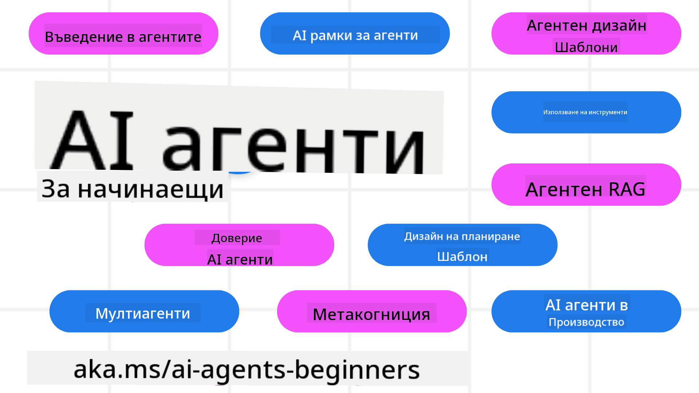

<!--
CO_OP_TRANSLATOR_METADATA:
{
  "original_hash": "9b4c2650691b24b20e0c912d01a466a2",
  "translation_date": "2025-08-21T13:53:37+00:00",
  "source_file": "README.md",
  "language_code": "bg"
}
-->
# AI Агенти за Начинаещи - Курс

## 11 урока, които ще ви научат на всичко необходимо, за да започнете да създавате AI агенти

### 🌐 Поддръжка на много езици

#### Поддържано чрез GitHub Action (Автоматизирано и винаги актуално)

[Френски](../fr/README.md) | [Испански](../es/README.md) | [Немски](../de/README.md) | [Руски](../ru/README.md) | [Арабски](../ar/README.md) | [Персийски (Фарси)](../fa/README.md) | [Урду](../ur/README.md) | [Китайски (опростен)](../zh/README.md) | [Китайски (традиционен, Макао)](../mo/README.md) | [Китайски (традиционен, Хонг Конг)](../hk/README.md) | [Китайски (традиционен, Тайван)](../tw/README.md) | [Японски](../ja/README.md) | [Корейски](../ko/README.md) | [Хинди](../hi/README.md) | [Бенгалски](../bn/README.md) | [Маратхи](../mr/README.md) | [Непалски](../ne/README.md) | [Пенджабски (Гурмукхи)](../pa/README.md) | [Португалски (Португалия)](../pt/README.md) | [Португалски (Бразилия)](../br/README.md) | [Италиански](../it/README.md) | [Полски](../pl/README.md) | [Турски](../tr/README.md) | [Гръцки](../el/README.md) | [Тайландски](../th/README.md) | [Шведски](../sv/README.md) | [Датски](../da/README.md) | [Норвежки](../no/README.md) | [Фински](../fi/README.md) | [Холандски](../nl/README.md) | [Иврит](../he/README.md) | [Виетнамски](../vi/README.md) | [Индонезийски](../id/README.md) | [Малайски](../ms/README.md) | [Тагалог (Филипински)](../tl/README.md) | [Суахили](../sw/README.md) | [Унгарски](../hu/README.md) | [Чешки](../cs/README.md) | [Словашки](../sk/README.md) | [Румънски](../ro/README.md) | [Български](./README.md) | [Сръбски (Кирилица)](../sr/README.md) | [Хърватски](../hr/README.md) | [Словенски](../sl/README.md) | [Украински](../uk/README.md) | [Бирмански (Мианмар)](../my/README.md)

**Ако искате да добавите допълнителни езици, списъкът с поддържаните езици е [тук](https://github.com/Azure/co-op-translator/blob/main/getting_started/supported-languages.md)**

## 🌱 Първи стъпки

Този курс включва 11 урока, които обхващат основите на създаването на AI агенти. Всеки урок разглежда отделна тема, така че можете да започнете оттам, където ви е удобно!

Курсът поддържа много езици. Вижте [наличните езици тук](../..).

Ако за първи път работите с генеративни AI модели, разгледайте нашия курс [Генеративен AI за Начинаещи](https://aka.ms/genai-beginners), който включва 21 урока за работа с GenAI.

Не забравяйте да [добавите звезда (🌟) към това хранилище](https://docs.github.com/en/get-started/exploring-projects-on-github/saving-repositories-with-stars?WT.mc_id=academic-105485-koreyst) и да [разклоните това хранилище](https://github.com/microsoft/ai-agents-for-beginners/fork), за да стартирате кода.

### Какво ви е необходимо

Всеки урок в този курс включва примери за код, които се намират в папката code_samples. Можете да [разклоните това хранилище](https://github.com/microsoft/ai-agents-for-beginners/fork), за да създадете свое собствено копие.

Примерите за код в тези упражнения използват Azure AI Foundry и GitHub Model Catalogs за взаимодействие с езикови модели:

- [Github Models](https://aka.ms/ai-agents-beginners/github-models) - Безплатно / Ограничено
- [Azure AI Foundry](https://aka.ms/ai-agents-beginners/ai-foundry) - Изисква се акаунт в Azure

Този курс също така използва следните рамки и услуги за AI агенти от Microsoft:

- [Azure AI Agent Service](https://aka.ms/ai-agents-beginners/ai-agent-service)
- [Semantic Kernel](https://aka.ms/ai-agents-beginners/semantic-kernel)
- [AutoGen](https://aka.ms/ai-agents/autogen)

За повече информация относно стартирането на кода за този курс, посетете [Настройка на курса](./00-course-setup/README.md).

## 🙏 Искате да помогнете?

Имате предложения или сте открили правописни или кодови грешки? [Създайте проблем](https://github.com/microsoft/ai-agents-for-beginners/issues?WT.mc_id=academic-105485-koreyst) или [Създайте заявка за промяна](https://github.com/microsoft/ai-agents-for-beginners/pulls?WT.mc_id=academic-105485-koreyst)

Ако се затруднявате или имате въпроси относно създаването на AI агенти, присъединете се към нашата [Azure AI Foundry Community Discord](https://discord.gg/kzRShWzttr)

Ако имате обратна връзка за продукта или срещнете грешки по време на работа, посетете нашия [Azure AI Foundry Developer Forum](https://aka.ms/azureaifoundry/forum)

## 📂 Всеки урок включва

- Писмен урок, разположен в README, и кратко видео
- Примери за код на Python, поддържащи Azure AI Foundry и Github Models (Безплатно)
- Връзки към допълнителни ресурси за продължаване на обучението ви

## 🗃️ Уроци

| **Урок**                                 | **Текст и Код**                                  | **Видео**                                                  | **Допълнително обучение**                                                             |
|------------------------------------------|-------------------------------------------------|------------------------------------------------------------|---------------------------------------------------------------------------------------|
| Въведение в AI агенти и случаи на употреба | [Връзка](./01-intro-to-ai-agents/README.md)     | [Видео](https://youtu.be/3zgm60bXmQk?si=z8QygFvYQv-9WtO1)  | [Връзка](https://aka.ms/ai-agents-beginners/collection?WT.mc_id=academic-105485-koreyst) |
| Изследване на рамки за AI агенти          | [Връзка](./02-explore-agentic-frameworks/README.md) | [Видео](https://youtu.be/ODwF-EZo_O8?si=Vawth4hzVaHv-u0H)  | [Връзка](https://aka.ms/ai-agents-beginners/collection?WT.mc_id=academic-105485-koreyst) |
| Разбиране на дизайн модели за AI агенти   | [Връзка](./03-agentic-design-patterns/README.md) | [Видео](https://youtu.be/m9lM8qqoOEA?si=BIzHwzstTPL8o9GF)  | [Връзка](https://aka.ms/ai-agents-beginners/collection?WT.mc_id=academic-105485-koreyst) |
| Дизайн модел за използване на инструменти | [Връзка](./04-tool-use/README.md)               | [Видео](https://youtu.be/vieRiPRx-gI?si=2z6O2Xu2cu_Jz46N)  | [Връзка](https://aka.ms/ai-agents-beginners/collection?WT.mc_id=academic-105485-koreyst) |
| Агентен RAG                              | [Връзка](./05-agentic-rag/README.md)            | [Видео](https://youtu.be/WcjAARvdL7I?si=gKPWsQpKiIlDH9A3)  | [Връзка](https://aka.ms/ai-agents-beginners/collection?WT.mc_id=academic-105485-koreyst) |
| Създаване на надеждни AI агенти           | [Връзка](./06-building-trustworthy-agents/README.md) | [Видео](https://youtu.be/iZKkMEGBCUQ?si=jZjpiMnGFOE9L8OK)  | [Връзка](https://aka.ms/ai-agents-beginners/collection?WT.mc_id=academic-105485-koreyst) |
| Дизайн модел за планиране                 | [Връзка](./07-planning-design/README.md)        | [Видео](https://youtu.be/kPfJ2BrBCMY?si=6SC_iv_E5-mzucnC)  | [Връзка](https://aka.ms/ai-agents-beginners/collection?WT.mc_id=academic-105485-koreyst) |
| Дизайн модел за множество агенти          | [Връзка](./08-multi-agent/README.md)            | [Видео](https://youtu.be/V6HpE9hZEx0?si=rMgDhEu7wXo2uo6g)  | [Връзка](https://aka.ms/ai-agents-beginners/collection?WT.mc_id=academic-105485-koreyst) |
| Дизайн модел за метакогниция              | [Връзка](./09-metacognition/README.md)          | [Видео](https://youtu.be/His9R6gw6Ec?si=8gck6vvdSNCt6OcF)  | [Връзка](https://aka.ms/ai-agents-beginners/collection?WT.mc_id=academic-105485-koreyst) |
| AI агенти в продукция                    | [Връзка](./10-ai-agents-production/README.md)   | [Видео](https://youtu.be/l4TP6IyJxmQ?si=31dnhexRo6yLRJDl)  | [Връзка](https://aka.ms/ai-agents-beginners/collection?WT.mc_id=academic-105485-koreyst) |
| AI агенти с MCP                          | [Връзка](./11-mcp/README.md)                    |                                                            | [Връзка](https://aka.ms/mcp-for-beginners)                                               |

## 🎒 Други курсове

Нашият екип създава и други курсове! Вижте:
- [**НОВО** Протокол за контекст на модела (MCP) за начинаещи](https://github.com/microsoft/mcp-for-beginners?WT.mc_id=academic-105485-koreyst)
- [Генеративен AI за начинаещи с .NET](https://github.com/microsoft/Generative-AI-for-beginners-dotnet?WT.mc_id=academic-105485-koreyst)
- [Генеративен AI за начинаещи](https://github.com/microsoft/generative-ai-for-beginners?WT.mc_id=academic-105485-koreyst)
- [Генеративен AI за начинаещи с Java](https://github.com/microsoft/generative-ai-for-beginners-java?WT.mc_id=academic-105485-koreyst)
- [Машинно обучение за начинаещи](https://aka.ms/ml-beginners?WT.mc_id=academic-105485-koreyst)
- [Наука за данни за начинаещи](https://aka.ms/datascience-beginners?WT.mc_id=academic-105485-koreyst)
- [AI за начинаещи](https://aka.ms/ai-beginners?WT.mc_id=academic-105485-koreyst)
- [Киберсигурност за начинаещи](https://github.com/microsoft/Security-101??WT.mc_id=academic-96948-sayoung)
- [Уеб разработка за начинаещи](https://aka.ms/webdev-beginners?WT.mc_id=academic-105485-koreyst)
- [IoT за начинаещи](https://aka.ms/iot-beginners?WT.mc_id=academic-105485-koreyst)
- [XR разработка за начинаещи](https://github.com/microsoft/xr-development-for-beginners?WT.mc_id=academic-105485-koreyst)
- [Овладяване на GitHub Copilot за AI програмиране в двойка](https://aka.ms/GitHubCopilotAI?WT.mc_id=academic-105485-koreyst)
- [Овладяване на GitHub Copilot за C#/.NET разработчици](https://github.com/microsoft/mastering-github-copilot-for-dotnet-csharp-developers?WT.mc_id=academic-105485-koreyst)
- [Избери своето собствено приключение с Copilot](https://github.com/microsoft/CopilotAdventures?WT.mc_id=academic-105485-koreyst)

## 🌟 Благодарности към общността

Благодарности на [Шивам Гоял](https://www.linkedin.com/in/shivam2003/) за предоставянето на важни примери за код, демонстриращи Agentic RAG. 

## Принос

Този проект приветства приноси и предложения. Повечето приноси изискват от вас да се съгласите с
Лицензионно споразумение за приносител (CLA), което декларира, че имате право и действително предоставяте
правата за използване на вашия принос. За подробности, посетете 
<https://cla.opensource.microsoft.com>.

Когато изпратите pull request, ботът CLA автоматично ще определи дали трябва да предоставите
CLA и ще отбележи PR съответно (например, проверка на статус, коментар). Просто следвайте инструкциите,
предоставени от бота. Ще трябва да направите това само веднъж за всички хранилища, използващи нашия CLA.

Този проект е приел [Кодекса за поведение на Microsoft Open Source](https://opensource.microsoft.com/codeofconduct/).
За повече информация вижте [Често задавани въпроси за Кодекса за поведение](https://opensource.microsoft.com/codeofconduct/faq/) или
се свържете с [opencode@microsoft.com](mailto:opencode@microsoft.com) за допълнителни въпроси или коментари.

## Търговски марки

Този проект може да съдържа търговски марки или лога за проекти, продукти или услуги. Употребата на търговски марки или лога на Microsoft трябва да бъде съобразена с
[Насоките за търговски марки и бранд на Microsoft](https://www.microsoft.com/legal/intellectualproperty/trademarks/usage/general).
Употребата на търговски марки или лога на Microsoft в модифицирани версии на този проект не трябва да създава объркване или да предполага спонсорство от Microsoft.
Употребата на търговски марки или лога на трети страни трябва да бъде съобразена с политиките на съответните трети страни.

**Отказ от отговорност**:  
Този документ е преведен с помощта на AI услуга за превод [Co-op Translator](https://github.com/Azure/co-op-translator). Въпреки че се стремим към точност, моля, имайте предвид, че автоматичните преводи може да съдържат грешки или неточности. Оригиналният документ на неговия изходен език трябва да се счита за авторитетен източник. За критична информация се препоръчва професионален човешки превод. Не носим отговорност за каквито и да е недоразумения или погрешни интерпретации, произтичащи от използването на този превод.