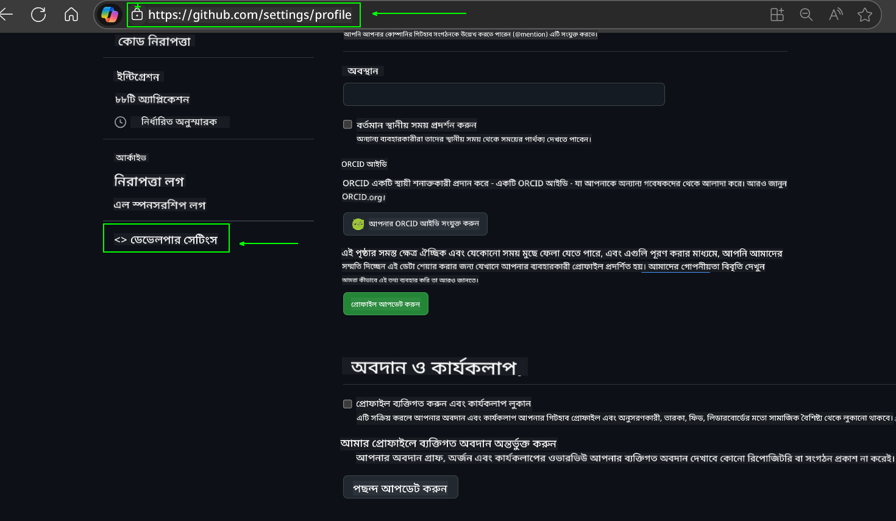
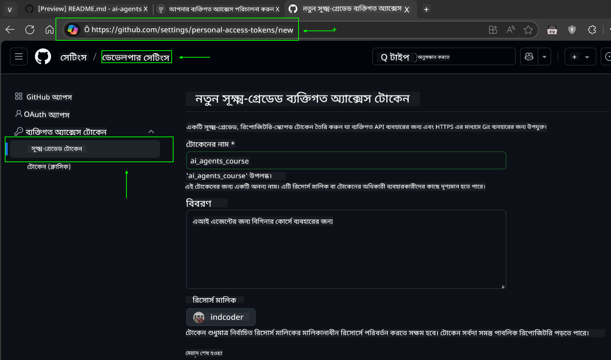
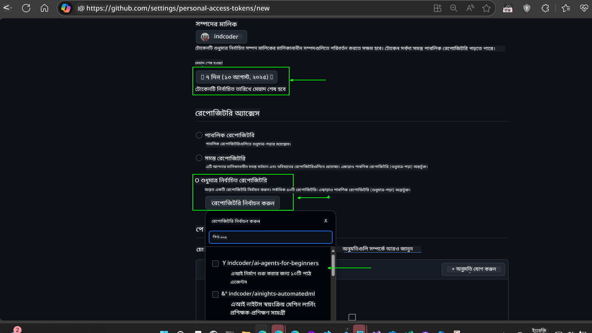
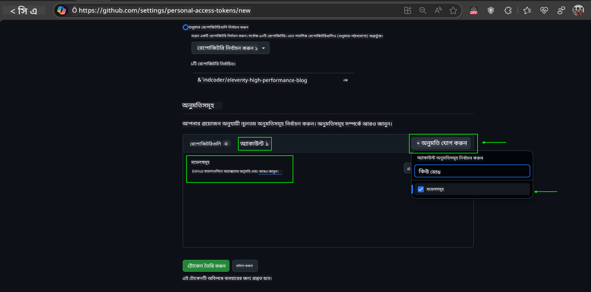
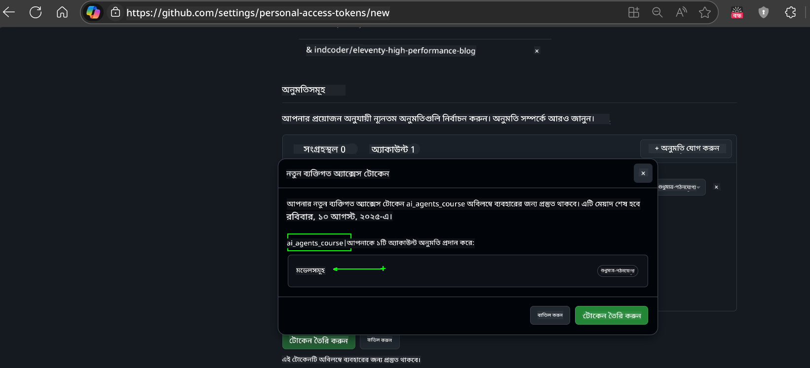
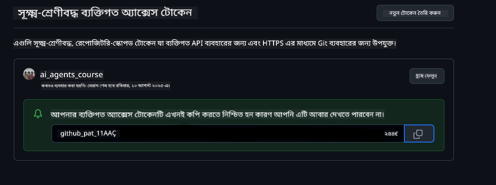
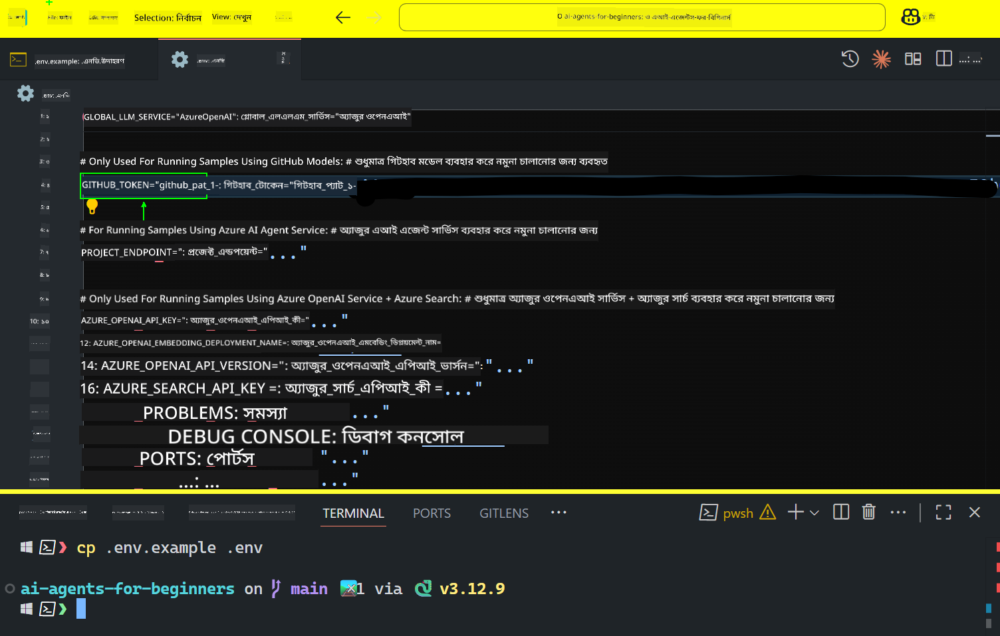

<!--
CO_OP_TRANSLATOR_METADATA:
{
  "original_hash": "c55b973b1562abf5aadf6a4028265ac5",
  "translation_date": "2025-08-29T12:13:34+00:00",
  "source_file": "00-course-setup/README.md",
  "language_code": "bn"
}
-->
# কোর্স সেটআপ

## পরিচিতি

এই পাঠে আমরা এই কোর্সের কোড নমুনাগুলি কীভাবে চালাতে হয় তা শিখব।

## অন্যান্য শিক্ষার্থীদের সাথে যোগ দিন এবং সাহায্য নিন

আপনার রিপোজিটরি ক্লোন করার আগে, [AI Agents For Beginners Discord চ্যানেল](https://aka.ms/ai-agents/discord)-এ যোগ দিন। এখানে আপনি সেটআপ সংক্রান্ত সাহায্য পেতে পারেন, কোর্স সম্পর্কিত যেকোনো প্রশ্ন করতে পারেন, অথবা অন্যান্য শিক্ষার্থীদের সাথে সংযোগ স্থাপন করতে পারেন।

## এই রিপোজিটরি ক্লোন বা ফর্ক করুন

শুরু করার জন্য, দয়া করে GitHub রিপোজিটরি ক্লোন বা ফর্ক করুন। এটি আপনার নিজের কোর্স উপকরণের একটি সংস্করণ তৈরি করবে, যাতে আপনি কোড চালাতে, পরীক্ষা করতে এবং পরিবর্তন করতে পারেন!

এটি করতে, লিঙ্কে ক্লিক করুন:


## কোড চালানো

এই কোর্সটি একটি সিরিজ জুপিটার নোটবুক সরবরাহ করে, যা আপনাকে AI এজেন্ট তৈরি করার হাতে-কলমে অভিজ্ঞতা দেবে।

কোড নমুনাগুলি নিম্নলিখিত পদ্ধতিগুলির উপর ভিত্তি করে তৈরি:

**GitHub অ্যাকাউন্ট প্রয়োজন - ফ্রি**:

1) Semantic Kernel Agent Framework + GitHub Models Marketplace। লেবেল করা হয়েছে (semantic-kernel.ipynb)
2) AutoGen Framework + GitHub Models Marketplace। লেবেল করা হয়েছে (autogen.ipynb)

**Azure সাবস্ক্রিপশন প্রয়োজন**:
3) Azure AI Foundry + Azure AI Agent Service। লেবেল করা হয়েছে (azureaiagent.ipynb)

আমরা আপনাকে তিনটি উদাহরণই চেষ্টা করার পরামর্শ দিই, যাতে আপনি বুঝতে পারেন কোনটি আপনার জন্য সবচেয়ে কার্যকর।

আপনি যেকোনো একটি পদ্ধতি বেছে নিলে, নিচের সেটআপ ধাপগুলি সেই অনুযায়ী অনুসরণ করতে হবে:

## প্রয়োজনীয়তা

- Python 3.12+
  - **NOTE**: যদি আপনার Python 3.12 ইনস্টল না থাকে, তাহলে এটি ইনস্টল করুন। তারপর `python3.12` ব্যবহার করে আপনার `venv` তৈরি করুন, যাতে `requirements.txt` ফাইল থেকে সঠিক সংস্করণগুলি ইনস্টল হয়।
- একটি GitHub অ্যাকাউন্ট - GitHub Models Marketplace-এ অ্যাক্সেসের জন্য
- Azure সাবস্ক্রিপশন - Azure AI Foundry-এ অ্যাক্সেসের জন্য
- Azure AI Foundry অ্যাকাউন্ট - Azure AI Agent Service-এ অ্যাক্সেসের জন্য

আমরা এই রিপোজিটরির মূল ফোল্ডারে একটি `requirements.txt` ফাইল অন্তর্ভুক্ত করেছি, যেখানে কোড নমুনাগুলি চালানোর জন্য প্রয়োজনীয় সমস্ত Python প্যাকেজের তালিকা রয়েছে।

আপনি নিম্নলিখিত কমান্ডটি চালিয়ে সেগুলি ইনস্টল করতে পারেন:

```bash
pip install -r requirements.txt
```

আমরা কোনো দ্বন্দ্ব বা সমস্যা এড়াতে একটি Python ভার্চুয়াল এনভায়রনমেন্ট তৈরি করার পরামর্শ দিই।

## VSCode সেটআপ করুন

সুনিশ্চিত করুন যে আপনি VSCode-এ সঠিক Python সংস্করণ ব্যবহার করছেন।


## GitHub মডেল ব্যবহার করে নমুনাগুলির জন্য সেটআপ

### ধাপ ১: আপনার GitHub Personal Access Token (PAT) সংগ্রহ করুন

এই কোর্সটি GitHub Models Marketplace ব্যবহার করে, যা আপনাকে বড় ভাষার মডেল (LLMs) বিনামূল্যে ব্যবহার করার সুযোগ দেয়, যা আপনি AI এজেন্ট তৈরি করতে ব্যবহার করবেন।

GitHub মডেল ব্যবহার করতে, আপনাকে একটি [GitHub Personal Access Token](https://docs.github.com/en/authentication/keeping-your-account-and-data-secure/managing-your-personal-access-tokens) তৈরি করতে হবে।

এটি আপনার GitHub অ্যাকাউন্টে গিয়ে করা যেতে পারে।

[Principle of Least Privilege](https://docs.github.com/en/get-started/learning-to-code/storing-your-secrets-safely) অনুসরণ করুন যখন আপনি আপনার টোকেন তৈরি করবেন। এর মানে হলো টোকেনকে শুধুমাত্র সেই অনুমতিগুলি দিন যা এই কোর্সের কোড নমুনাগুলি চালানোর জন্য প্রয়োজন।

1. **Developer settings**-এ গিয়ে বাম দিকে `Fine-grained tokens` বিকল্পটি নির্বাচন করুন।
   

    তারপর `Generate new token` নির্বাচন করুন।

    

2. আপনার টোকেনের জন্য একটি বর্ণনামূলক নাম লিখুন, যা এর উদ্দেশ্য প্রতিফলিত করে এবং পরে এটি সহজে চেনা যায়।

    🔐 **টোকেনের মেয়াদকাল সুপারিশ**

    সুপারিশকৃত মেয়াদকাল: ৩০ দিন  
    আরও নিরাপদ অবস্থানের জন্য, আপনি একটি ছোট সময়কাল বেছে নিতে পারেন—যেমন ৭ দিন 🛡️।  
    এটি একটি ব্যক্তিগত লক্ষ্য নির্ধারণ করার এবং কোর্সটি সম্পূর্ণ করার একটি দুর্দান্ত উপায় 🚀।

    

3. টোকেনের স্কোপ আপনার এই রিপোজিটরির ফর্কে সীমাবদ্ধ করুন।

    

4. টোকেনের অনুমতিগুলি সীমাবদ্ধ করুন: **Permissions**-এর অধীনে, **Account** ট্যাবে ক্লিক করুন এবং "+ Add permissions" বোতামে ক্লিক করুন। একটি ড্রপডাউন মেনু আসবে। **Models** খুঁজুন এবং চেকবক্সটি চেক করুন।
    

5. টোকেন তৈরি করার আগে প্রয়োজনীয় অনুমতিগুলি যাচাই করুন। 

6. টোকেন তৈরি করার আগে নিশ্চিত করুন যে আপনি এটি একটি নিরাপদ স্থানে সংরক্ষণ করতে প্রস্তুত, যেমন একটি পাসওয়ার্ড ম্যানেজার ভল্ট, কারণ এটি তৈরি হওয়ার পরে আর দেখানো হবে না। 

আপনার সদ্য তৈরি করা টোকেনটি কপি করুন। এখন এটি এই কোর্সে অন্তর্ভুক্ত `.env` ফাইলে যোগ করুন।

### ধাপ ২: আপনার `.env` ফাইল তৈরি করুন

আপনার টার্মিনালে নিম্নলিখিত কমান্ডটি চালিয়ে `.env` ফাইল তৈরি করুন:

```bash
cp .env.example .env
```

এটি উদাহরণ ফাইলটি কপি করবে এবং আপনার ডিরেক্টরিতে একটি `.env` তৈরি করবে, যেখানে আপনি পরিবেশ ভেরিয়েবলের মানগুলি পূরণ করবেন।

আপনার টোকেনটি কপি করে `.env` ফাইলটি আপনার পছন্দের টেক্সট এডিটরে খুলুন এবং `GITHUB_TOKEN` ফিল্ডে এটি পেস্ট করুন।  


এখন আপনি এই কোর্সের কোড নমুনাগুলি চালাতে সক্ষম হওয়া উচিত।

## Azure AI Foundry এবং Azure AI Agent Service ব্যবহার করে নমুনাগুলির জন্য সেটআপ

### ধাপ ১: আপনার Azure প্রকল্পের এন্ডপয়েন্ট সংগ্রহ করুন

Azure AI Foundry-তে একটি হাব এবং প্রকল্প তৈরি করার ধাপগুলি অনুসরণ করুন: [Hub resources overview](https://learn.microsoft.com/en-us/azure/ai-foundry/concepts/ai-resources)

আপনার প্রকল্প তৈরি করার পরে, আপনাকে আপনার প্রকল্পের সংযোগ স্ট্রিং সংগ্রহ করতে হবে।

এটি Azure AI Foundry পোর্টালের **Overview** পৃষ্ঠায় গিয়ে করা যেতে পারে।


### ধাপ ২: আপনার `.env` ফাইল তৈরি করুন

আপনার টার্মিনালে নিম্নলিখিত কমান্ডটি চালিয়ে `.env` ফাইল তৈরি করুন:

```bash
cp .env.example .env
```

এটি উদাহরণ ফাইলটি কপি করবে এবং আপনার ডিরেক্টরিতে একটি `.env` তৈরি করবে, যেখানে আপনি পরিবেশ ভেরিয়েবলের মানগুলি পূরণ করবেন।

আপনার টোকেনটি কপি করে `.env` ফাইলটি আপনার পছন্দের টেক্সট এডিটরে খুলুন এবং `PROJECT_ENDPOINT` ফিল্ডে এটি পেস্ট করুন।

### ধাপ ৩: Azure-এ সাইন ইন করুন

নিরাপত্তার সেরা অনুশীলন হিসাবে, আমরা [keyless authentication](https://learn.microsoft.com/azure/developer/ai/keyless-connections?tabs=csharp%2Cazure-cli?WT.mc_id=academic-105485-koreyst) ব্যবহার করব Microsoft Entra ID দিয়ে Azure OpenAI-তে প্রমাণীকরণের জন্য।

পরবর্তী ধাপে, একটি টার্মিনাল খুলুন এবং `az login --use-device-code` কমান্ডটি চালিয়ে আপনার Azure অ্যাকাউন্টে সাইন ইন করুন।

সাইন ইন করার পরে, টার্মিনালে আপনার সাবস্ক্রিপশন নির্বাচন করুন।

## অতিরিক্ত পরিবেশ ভেরিয়েবল - Azure Search এবং Azure OpenAI

Agentic RAG পাঠ - পাঠ ৫ - এর জন্য কিছু নমুনা রয়েছে যা Azure Search এবং Azure OpenAI ব্যবহার করে।

যদি আপনি এই নমুনাগুলি চালাতে চান, তবে আপনাকে `.env` ফাইলে নিম্নলিখিত পরিবেশ ভেরিয়েবলগুলি যোগ করতে হবে:

### Overview Page (Project)

- `AZURE_SUBSCRIPTION_ID` - আপনার প্রকল্পের **Overview** পৃষ্ঠার **Project details**-এ দেখুন।
- `AZURE_AI_PROJECT_NAME` - আপনার প্রকল্পের **Overview** পৃষ্ঠার শীর্ষে দেখুন।
- `AZURE_OPENAI_SERVICE` - **Overview** পৃষ্ঠার **Included capabilities** ট্যাবে **Azure OpenAI Service**-এ দেখুন।

### Management Center

- `AZURE_OPENAI_RESOURCE_GROUP` - **Management Center**-এর **Overview** পৃষ্ঠার **Project properties**-এ যান।
- `GLOBAL_LLM_SERVICE` - **Connected resources**-এর অধীনে **Azure AI Services** সংযোগের নাম খুঁজুন। যদি তালিকাভুক্ত না থাকে, তবে **Azure portal**-এ আপনার রিসোর্স গ্রুপের অধীনে AI Services রিসোর্সের নাম দেখুন।

### Models + Endpoints Page

- `AZURE_OPENAI_EMBEDDING_DEPLOYMENT_NAME` - আপনার এমবেডিং মডেল (যেমন, `text-embedding-ada-002`) নির্বাচন করুন এবং মডেল বিবরণ থেকে **Deployment name** নোট করুন।
- `AZURE_OPENAI_CHAT_DEPLOYMENT_NAME` - আপনার চ্যাট মডেল (যেমন, `gpt-4o-mini`) নির্বাচন করুন এবং মডেল বিবরণ থেকে **Deployment name** নোট করুন।

### Azure Portal

- `AZURE_OPENAI_ENDPOINT` - **Azure AI services**-এ যান, তারপর **Resource Management**, **Keys and Endpoint**-এ যান, এবং "Azure OpenAI endpoints"-এ স্ক্রোল করুন এবং "Language APIs" কপি করুন।
- `AZURE_OPENAI_API_KEY` - একই স্ক্রিন থেকে KEY 1 বা KEY 2 কপি করুন।
- `AZURE_SEARCH_SERVICE_ENDPOINT` - আপনার **Azure AI Search** রিসোর্স খুঁজুন, এটি ক্লিক করুন এবং **Overview** দেখুন।
- `AZURE_SEARCH_API_KEY` - তারপর **Settings** এবং **Keys**-এ যান এবং প্রাথমিক বা মাধ্যমিক অ্যাডমিন কী কপি করুন।

### External Webpage

- `AZURE_OPENAI_API_VERSION` - [API version lifecycle](https://learn.microsoft.com/en-us/azure/ai-services/openai/api-version-deprecation#latest-ga-api-release) পৃষ্ঠায় যান এবং **Latest GA API release** দেখুন।

### Keyless Authentication সেটআপ করুন

আপনার শংসাপত্রগুলি হার্ডকোড করার পরিবর্তে, আমরা Azure OpenAI-এর সাথে একটি keyless সংযোগ ব্যবহার করব। এটি করতে, আমরা `DefaultAzureCredential` ইমপোর্ট করব এবং পরে `DefaultAzureCredential` ফাংশন কল করব শংসাপত্র পেতে।

```python
from azure.identity import DefaultAzureCredential, InteractiveBrowserCredential
```

## কোথাও আটকে গেছেন?

যদি এই সেটআপ চালানোর সময় কোনো সমস্যা হয়, আমাদের Discord চ্যানেলে যোগ দিন।

## পরবর্তী পাঠ

এখন আপনি এই কোর্সের কোড চালানোর জন্য প্রস্তুত। AI এজেন্টের জগৎ সম্পর্কে আরও জানার জন্য শুভকামনা!

[AI এজেন্ট এবং এজেন্ট ব্যবহারের ক্ষেত্রে পরিচিতি](../01-intro-to-ai-agents/README.md)

---

**অস্বীকৃতি**:  
এই নথিটি AI অনুবাদ পরিষেবা [Co-op Translator](https://github.com/Azure/co-op-translator) ব্যবহার করে অনুবাদ করা হয়েছে। আমরা যথাসাধ্য সঠিকতার জন্য চেষ্টা করি, তবে অনুগ্রহ করে মনে রাখবেন যে স্বয়ংক্রিয় অনুবাদে ত্রুটি বা অসঙ্গতি থাকতে পারে। মূল ভাষায় থাকা নথিটিকে প্রামাণিক উৎস হিসেবে বিবেচনা করা উচিত। গুরুত্বপূর্ণ তথ্যের জন্য, পেশাদার মানব অনুবাদ সুপারিশ করা হয়। এই অনুবাদ ব্যবহারের ফলে কোনো ভুল বোঝাবুঝি বা ভুল ব্যাখ্যা হলে আমরা দায়ী থাকব না।