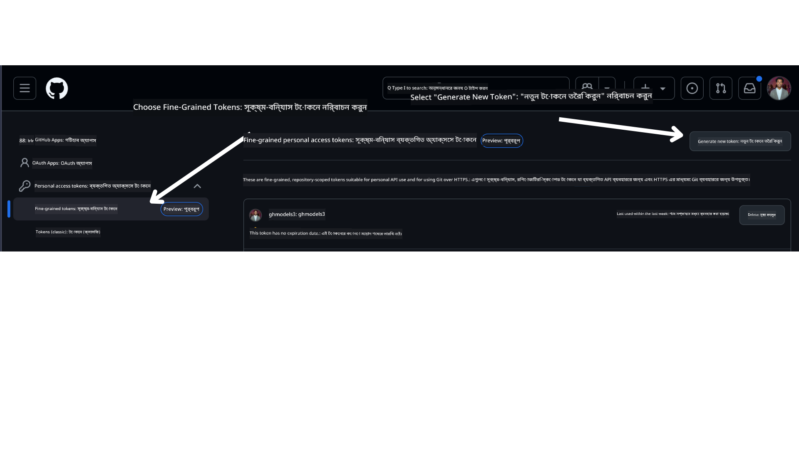

<!--
CO_OP_TRANSLATOR_METADATA:
{
  "original_hash": "76945069b52a49cd0432ae3e0b0ba22e",
  "translation_date": "2025-07-12T07:47:09+00:00",
  "source_file": "00-course-setup/README.md",
  "language_code": "bn"
}
-->
আপনার এখন এই কোর্সের নিজের ফর্ক করা সংস্করণ নিচের লিঙ্কে থাকা উচিত:


## কোড চালানো

এই কোর্সে একটি সিরিজ Jupyter Notebooks দেওয়া হয়েছে যা আপনি চালিয়ে AI এজেন্ট তৈরি করার হাতে-কলমে অভিজ্ঞতা অর্জন করতে পারবেন।

কোড স্যাম্পলগুলো ব্যবহার করে:

**GitHub অ্যাকাউন্ট প্রয়োজন - ফ্রি**:

1) Semantic Kernel Agent Framework + GitHub Models Marketplace। (semantic-kernel.ipynb) নামে লেবেল করা
2) AutoGen Framework + GitHub Models Marketplace। (autogen.ipynb) নামে লেবেল করা

**Azure সাবস্ক্রিপশন প্রয়োজন**:
3) Azure AI Foundry + Azure AI Agent Service। (azureaiagent.ipynb) নামে লেবেল করা

আমরা আপনাকে উৎসাহিত করি সব তিন ধরনের উদাহরণ চেষ্টা করতে, দেখার জন্য কোনটি আপনার জন্য সবচেয়ে ভালো কাজ করে।

আপনি যেই অপশনটি বেছে নেবেন, তা নির্ধারণ করবে নিচের কোন সেটআপ ধাপগুলো অনুসরণ করতে হবে:

## প্রয়োজনীয়তা

- Python 3.12+
  - **NOTE**: যদি আপনার কাছে Python3.12 ইনস্টল না থাকে, তাহলে অবশ্যই এটি ইনস্টল করুন। তারপর python3.12 ব্যবহার করে আপনার venv তৈরি করুন যাতে requirements.txt ফাইল থেকে সঠিক ভার্সনগুলো ইনস্টল হয়।
- একটি GitHub অ্যাকাউন্ট - GitHub Models Marketplace অ্যাক্সেসের জন্য
- Azure সাবস্ক্রিপশন - Azure AI Foundry অ্যাক্সেসের জন্য
- Azure AI Foundry অ্যাকাউন্ট - Azure AI Agent Service অ্যাক্সেসের জন্য

আমরা এই রিপোজিটরির রুটে একটি `requirements.txt` ফাইল অন্তর্ভুক্ত করেছি যা কোড স্যাম্পল চালানোর জন্য প্রয়োজনীয় সব Python প্যাকেজ ধারণ করে।

আপনি নিচের কমান্ডটি টার্মিনালে রিপোজিটরির রুটে চালিয়ে এগুলো ইনস্টল করতে পারেন:

```bash
pip install -r requirements.txt
```

কোনো দ্বন্দ্ব বা সমস্যা এড়াতে আমরা একটি Python ভার্চুয়াল এনভায়রনমেন্ট তৈরি করার পরামর্শ দিই।

## VSCode সেটআপ
নিশ্চিত করুন যে আপনি VSCode-এ সঠিক Python ভার্সন ব্যবহার করছেন।


## GitHub Models ব্যবহার করে স্যাম্পল সেটআপ

### ধাপ ১: আপনার GitHub Personal Access Token (PAT) সংগ্রহ করুন

বর্তমানে, এই কোর্স GitHub Models Marketplace ব্যবহার করে বড় ভাষা মডেল (LLMs) ফ্রি অ্যাক্সেস দেয় যা AI এজেন্ট তৈরিতে ব্যবহৃত হবে।

এই সার্ভিস অ্যাক্সেস করতে, আপনাকে একটি GitHub Personal Access Token তৈরি করতে হবে।

এটি করতে আপনার GitHub অ্যাকাউন্টে যান।

স্ক্রিনের বাম পাশে `Fine-grained tokens` অপশনটি নির্বাচন করুন।

তারপর `Generate new token` নির্বাচন করুন।



আপনাকে টোকেনের জন্য একটি নাম দিতে বলা হবে, মেয়াদ নির্ধারণ করতে হবে (প্রস্তাবিত: ৩০ দিন), এবং টোকেনের স্কোপ নির্বাচন করতে হবে (Public Repositories)।

এই টোকেনের পারমিশনও সম্পাদনা করা প্রয়োজন: Permissions -> Models -> Allows access to GitHub Models

আপনি যে নতুন টোকেন তৈরি করেছেন তা কপি করুন। এখন এটি এই কোর্সের `.env` ফাইলে যোগ করবেন।

### ধাপ ২: আপনার `.env` ফাইল তৈরি করুন

টার্মিনালে নিচের কমান্ডটি চালিয়ে `.env` ফাইল তৈরি করুন।

```bash
cp .env.example .env
```

এটি উদাহরণ ফাইল কপি করে আপনার ডিরেক্টরিতে `.env` ফাইল তৈরি করবে যেখানে আপনি পরিবেশ ভেরিয়েবলগুলোর মান পূরণ করবেন।

আপনার টোকেন কপি করে `.env` ফাইলটি আপনার পছন্দের টেক্সট এডিটরে খুলুন এবং `GITHUB_TOKEN` ফিল্ডে পেস্ট করুন।

এখন আপনি এই কোর্সের কোড স্যাম্পলগুলো চালাতে সক্ষম হবেন।

## Azure AI Foundry এবং Azure AI Agent Service ব্যবহার করে স্যাম্পল সেটআপ

### ধাপ ১: আপনার Azure প্রকল্পের Endpoint সংগ্রহ করুন

Azure AI Foundry-তে হাব এবং প্রকল্প তৈরি করার ধাপগুলো অনুসরণ করুন এখানে: [Hub resources overview](https://learn.microsoft.com/en-us/azure/ai-foundry/concepts/ai-resources)

প্রকল্প তৈরি করার পর, আপনার প্রকল্পের সংযোগ স্ট্রিং সংগ্রহ করতে হবে।

এটি Azure AI Foundry পোর্টালের আপনার প্রকল্পের **Overview** পেজ থেকে করা যাবে।


### ধাপ ২: আপনার `.env` ফাইল তৈরি করুন

টার্মিনালে নিচের কমান্ডটি চালিয়ে `.env` ফাইল তৈরি করুন।

```bash
cp .env.example .env
```

এটি উদাহরণ ফাইল কপি করে `.env` ফাইল তৈরি করবে যেখানে আপনি পরিবেশ ভেরিয়েবলগুলোর মান পূরণ করবেন।

আপনার টোকেন কপি করে `.env` ফাইলটি খুলুন এবং `PROJECT_ENDPOINT` ফিল্ডে পেস্ট করুন।

### ধাপ ৩: Azure-এ সাইন ইন করুন

সুরক্ষার জন্য, আমরা Microsoft Entra ID ব্যবহার করে Azure OpenAI-তে keyless authentication ব্যবহার করব। এর আগে আপনাকে আপনার অপারেটিং সিস্টেম অনুযায়ী **Azure CLI** ইনস্টল করতে হবে [ইনস্টলেশন নির্দেশিকা](https://learn.microsoft.com/cli/azure/install-azure-cli?WT.mc_id=academic-105485-koreyst) অনুসারে।

তারপর একটি টার্মিনাল খুলে `az login --use-device-code` কমান্ড চালিয়ে Azure অ্যাকাউন্টে সাইন ইন করুন।

সাইন ইন করার পর টার্মিনালে আপনার সাবস্ক্রিপশন নির্বাচন করুন।

## অতিরিক্ত পরিবেশ ভেরিয়েবল - Azure Search এবং Azure OpenAI

Agentic RAG লেসন - লেসন ৫-এ Azure Search এবং Azure OpenAI ব্যবহার করে কিছু স্যাম্পল আছে।

এই স্যাম্পলগুলো চালাতে চাইলে আপনাকে `.env` ফাইলে নিচের পরিবেশ ভেরিয়েবলগুলো যোগ করতে হবে:

### Overview পেজ (প্রকল্প)

- `AZURE_SUBSCRIPTION_ID` - আপনার প্রকল্পের **Overview** পেজের **Project details** থেকে দেখুন।

- `AZURE_AI_PROJECT_NAME` - প্রকল্পের **Overview** পেজের উপরের দিকে দেখুন।

- `AZURE_OPENAI_SERVICE` - **Overview** পেজের **Included capabilities** ট্যাবে **Azure OpenAI Service** এর জন্য দেখুন।

### Management Center

- `AZURE_OPENAI_RESOURCE_GROUP` - **Management Center** এর **Overview** পেজের **Project properties** থেকে দেখুন।

- `GLOBAL_LLM_SERVICE` - **Connected resources** এর অধীনে **Azure AI Services** সংযোগের নাম দেখুন। যদি না থাকে, তাহলে Azure পোর্টালে আপনার রিসোর্স গ্রুপে AI Services রিসোর্সের নাম দেখুন।

### Models + Endpoints পেজ

- `AZURE_OPENAI_EMBEDDING_DEPLOYMENT_NAME` - আপনার এমবেডিং মডেল (যেমন, `text-embedding-ada-002`) নির্বাচন করুন এবং মডেল ডিটেইল থেকে **Deployment name** নোট করুন।

- `AZURE_OPENAI_CHAT_DEPLOYMENT_NAME` - আপনার চ্যাট মডেল (যেমন, `gpt-4o-mini`) নির্বাচন করুন এবং মডেল ডিটেইল থেকে **Deployment name** নোট করুন।

### Azure পোর্টাল

- `AZURE_OPENAI_ENDPOINT` - **Azure AI services** এ যান, ক্লিক করুন, তারপর **Resource Management**, **Keys and Endpoint** এ যান, নিচে স্ক্রল করে "Azure OpenAI endpoints" থেকে "Language APIs" কপি করুন।

- `AZURE_OPENAI_API_KEY` - একই স্ক্রীন থেকে KEY 1 বা KEY 2 কপি করুন।

- `AZURE_SEARCH_SERVICE_ENDPOINT` - আপনার **Azure AI Search** রিসোর্স খুঁজে ক্লিক করুন এবং **Overview** দেখুন।

- `AZURE_SEARCH_API_KEY` - তারপর **Settings** এ যান এবং **Keys** থেকে প্রাইমারি বা সেকেন্ডারি অ্যাডমিন কী কপি করুন।

### বাহ্যিক ওয়েবপেজ

- `AZURE_OPENAI_API_VERSION` - [API version lifecycle](https://learn.microsoft.com/en-us/azure/ai-services/openai/api-version-deprecation#latest-ga-api-release) পেজে **Latest GA API release** এর অধীনে দেখুন।

### keyless authentication সেটআপ করুন

আপনার ক্রেডেনশিয়াল সরাসরি কোডে না লিখে, আমরা Azure OpenAI এর সাথে keyless connection ব্যবহার করব। এজন্য আমরা `DefaultAzureCredential` ইম্পোর্ট করব এবং পরে `DefaultAzureCredential` ফাংশন কল করে ক্রেডেনশিয়াল পাব।

```python
from azure.identity import DefaultAzureCredential, InteractiveBrowserCredential
```

## কোথাও আটকে গেছেন?

যদি এই সেটআপ চালাতে কোনো সমস্যা হয়, তাহলে আমাদের সঙ্গে যোগাযোগ করুন

অথবা

.

## পরবর্তী লেসন

আপনি এখন এই কোর্সের কোড চালানোর জন্য প্রস্তুত। AI এজেন্টদের জগতে আরও শেখার জন্য শুভকামনা!

[Introduction to AI Agents and Agent Use Cases](../01-intro-to-ai-agents/README.md)

**অস্বীকৃতি**:  
এই নথিটি AI অনুবাদ সেবা [Co-op Translator](https://github.com/Azure/co-op-translator) ব্যবহার করে অনূদিত হয়েছে। আমরা যথাসাধ্য সঠিকতার চেষ্টা করি, তবে স্বয়ংক্রিয় অনুবাদে ত্রুটি বা অসঙ্গতি থাকতে পারে। মূল নথিটি তার নিজস্ব ভাষায়ই কর্তৃত্বপূর্ণ উৎস হিসেবে বিবেচিত হওয়া উচিত। গুরুত্বপূর্ণ তথ্যের জন্য পেশাদার মানব অনুবাদ গ্রহণ করার পরামর্শ দেওয়া হয়। এই অনুবাদের ব্যবহারে সৃষ্ট কোনো ভুল বোঝাবুঝি বা ভুল ব্যাখ্যার জন্য আমরা দায়ী নই।