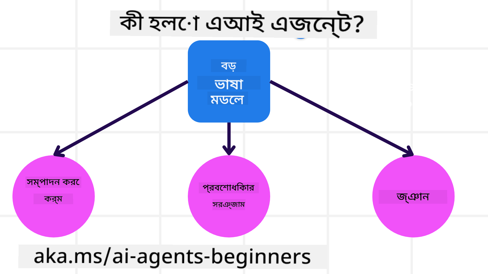
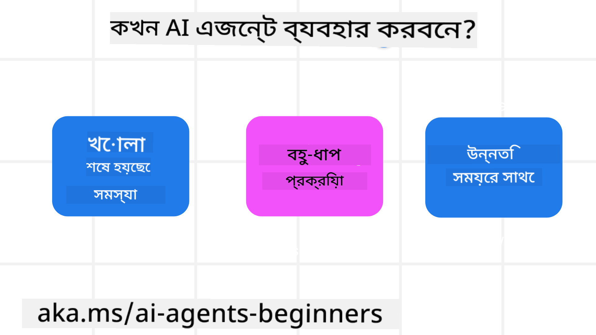

<!--
CO_OP_TRANSLATOR_METADATA:
{
  "original_hash": "d84943abc8f001ad4670418d32c2d899",
  "translation_date": "2025-07-12T08:04:09+00:00",
  "source_file": "01-intro-to-ai-agents/README.md",
  "language_code": "bn"
}
-->
অন্য শিক্ষার্থীদের এবং AI Agent নির্মাতাদের সাথে পরিচিত হতে এবং এই কোর্স সম্পর্কে আপনার যেকোনো প্রশ্ন জিজ্ঞাসা করতে এখানে যোগ দিন।

এই কোর্স শুরু করতে, আমরা প্রথমে AI Agents কী এবং আমরা যেসব অ্যাপ্লিকেশন ও ওয়ার্কফ্লো তৈরি করি সেগুলিতে কীভাবে এগুলো ব্যবহার করতে পারি তা ভালোভাবে বুঝতে শুরু করব।

## পরিচিতি

এই পাঠে আলোচনা করা হবে:

- AI Agents কী এবং এজেন্টের বিভিন্ন ধরনের কী কী?
- AI Agents-এর জন্য কোন কোন ব্যবহার ক্ষেত্র সবচেয়ে উপযোগী এবং এগুলো আমাদের কীভাবে সাহায্য করতে পারে?
- Agentic সমাধান ডিজাইনের সময় কিছু মৌলিক উপাদান কী কী?

## শেখার লক্ষ্য
এই পাঠ শেষ করার পর, আপনি সক্ষম হবেন:

- AI Agent ধারণাগুলো বুঝতে এবং এগুলো অন্যান্য AI সমাধান থেকে কীভাবে আলাদা তা জানতে।
- AI Agents সবচেয়ে কার্যকরভাবে প্রয়োগ করতে।
- ব্যবহারকারী এবং গ্রাহকদের জন্য Agentic সমাধান ফলপ্রসূভাবে ডিজাইন করতে।

## AI Agents সংজ্ঞা এবং AI Agents-এর ধরন

### AI Agents কী?

AI Agents হলো **সিস্টেম** যা **বড় ভাষা মডেল(LLMs)**-কে **কর্ম সম্পাদন করতে** সক্ষম করে, তাদের ক্ষমতা বাড়িয়ে LLMs-কে **টুলস** এবং **জ্ঞান**-এর অ্যাক্সেস দেয়।

চলুন এই সংজ্ঞাটি ছোট ছোট অংশে ভাগ করি:

- **সিস্টেম** - এজেন্টকে শুধুমাত্র একটি উপাদান হিসেবে নয়, বরং অনেক উপাদানের সমন্বয়ে গঠিত একটি সিস্টেম হিসেবে ভাবা গুরুত্বপূর্ণ। মৌলিক স্তরে, একটি AI Agent-এর উপাদানগুলো হলো:
  - **পরিবেশ** - নির্ধারিত স্থান যেখানে AI Agent কাজ করছে। উদাহরণস্বরূপ, যদি আমাদের একটি ট্রাভেল বুকিং AI Agent থাকে, তাহলে পরিবেশ হতে পারে সেই ট্রাভেল বুকিং সিস্টেম যা AI Agent কাজ সম্পন্ন করতে ব্যবহার করে।
  - **সেন্সর** - পরিবেশ তথ্য ধারণ করে এবং প্রতিক্রিয়া প্রদান করে। AI Agents সেন্সর ব্যবহার করে পরিবেশের বর্তমান অবস্থা সম্পর্কে তথ্য সংগ্রহ ও ব্যাখ্যা করে। ট্রাভেল বুকিং এজেন্টের উদাহরণে, বুকিং সিস্টেম হোটেল উপলব্ধতা বা ফ্লাইটের দাম সম্পর্কে তথ্য দিতে পারে।
  - **অ্যাকচুয়েটর** - AI Agent পরিবেশের বর্তমান অবস্থা পাওয়ার পর, বর্তমান কাজের জন্য পরিবেশ পরিবর্তনের জন্য কোন কাজটি করতে হবে তা নির্ধারণ করে। ট্রাভেল বুকিং এজেন্টের ক্ষেত্রে, এটি হতে পারে ব্যবহারকারীর জন্য একটি উপলব্ধ রুম বুক করা।

**বড় ভাষা মডেল** - এজেন্টের ধারণা LLMs তৈরি হওয়ার আগেও ছিল। LLMs দিয়ে AI Agents তৈরি করার সুবিধা হলো মানুষের ভাষা এবং ডেটা ব্যাখ্যা করার ক্ষমতা। এই ক্ষমতা LLMs-কে পরিবেশগত তথ্য ব্যাখ্যা করতে এবং পরিবেশ পরিবর্তনের জন্য পরিকল্পনা নির্ধারণ করতে সক্ষম করে।

**কর্ম সম্পাদন** - AI Agent সিস্টেমের বাইরে, LLMs সীমাবদ্ধ থাকে এমন পরিস্থিতিতে যেখানে কাজ হলো ব্যবহারকারীর প্রম্পট অনুযায়ী কন্টেন্ট বা তথ্য তৈরি করা। AI Agent সিস্টেমের ভিতরে, LLMs ব্যবহারকারীর অনুরোধ ব্যাখ্যা করে এবং তাদের পরিবেশে উপলব্ধ টুলস ব্যবহার করে কাজ সম্পন্ন করতে পারে।

**টুলসের অ্যাক্সেস** - LLM কোন টুলস ব্যবহার করতে পারবে তা নির্ধারিত হয় ১) যে পরিবেশে এটি কাজ করছে এবং ২) AI Agent-এর ডেভেলপার দ্বারা। আমাদের ট্রাভেল এজেন্ট উদাহরণে, এজেন্টের টুলস বুকিং সিস্টেমে উপলব্ধ অপারেশন দ্বারা সীমাবদ্ধ, এবং/অথবা ডেভেলপার এজেন্টের টুল অ্যাক্সেস ফ্লাইট পর্যন্ত সীমাবদ্ধ করতে পারে।

**মেমোরি+জ্ঞান** - মেমোরি হতে পারে সংলাপের প্রেক্ষাপটে স্বল্পমেয়াদী। দীর্ঘমেয়াদে, পরিবেশ থেকে প্রাপ্ত তথ্যের বাইরে, AI Agents অন্যান্য সিস্টেম, সার্ভিস, টুলস এবং এমনকি অন্যান্য এজেন্ট থেকে জ্ঞান আহরণ করতে পারে। ট্রাভেল এজেন্ট উদাহরণে, এই জ্ঞান হতে পারে ব্যবহারকারীর ভ্রমণ পছন্দ সম্পর্কিত তথ্য যা গ্রাহক ডাটাবেসে সংরক্ষিত।

### এজেন্টের বিভিন্ন ধরন

এখন যেহেতু আমাদের AI Agents-এর সাধারণ সংজ্ঞা রয়েছে, চলুন কিছু নির্দিষ্ট এজেন্টের ধরন দেখি এবং কীভাবে সেগুলো ট্রাভেল বুকিং AI Agent-এ প্রয়োগ করা যেতে পারে।

| **এজেন্টের ধরন**             | **বর্ণনা**                                                                                                                         | **উদাহরণ**                                                                                                                                                                                                                   |
| ----------------------------- | ---------------------------------------------------------------------------------------------------------------------------------- | ----------------------------------------------------------------------------------------------------------------------------------------------------------------------------------------------------------------------------- |
| **সিম্পল রিফ্লেক্স এজেন্ট**   | পূর্বনির্ধারিত নিয়ম অনুযায়ী তাৎক্ষণিক কাজ করে।                                                                                   | ট্রাভেল এজেন্ট ইমেইলের প্রসঙ্গ বুঝে ভ্রমণ অভিযোগ গ্রাহক সেবায় পাঠায়।                                                                                                                                                        |
| **মডেল-ভিত্তিক রিফ্লেক্স এজেন্ট** | বিশ্বের একটি মডেল এবং সেই মডেলের পরিবর্তনের ভিত্তিতে কাজ করে।                                                                     | ট্রাভেল এজেন্ট ঐতিহাসিক মূল্য তথ্যের ভিত্তিতে উল্লেখযোগ্য মূল্য পরিবর্তন সহ রুটগুলোকে অগ্রাধিকার দেয়।                                                                                                                        |
| **গোল-ভিত্তিক এজেন্ট**        | নির্দিষ্ট লক্ষ্য অর্জনের জন্য পরিকল্পনা তৈরি করে এবং সেই লক্ষ্য অর্জনের জন্য কাজ নির্ধারণ করে।                                        | ট্রাভেল এজেন্ট বর্তমান অবস্থান থেকে গন্তব্য পর্যন্ত প্রয়োজনীয় ভ্রমণ ব্যবস্থা (গাড়ি, পাবলিক ট্রানজিট, ফ্লাইট) নির্ধারণ করে যাত্রা বুক করে।                                                                                      |
| **ইউটিলিটি-ভিত্তিক এজেন্ট**   | পছন্দ বিবেচনা করে এবং লক্ষ্য অর্জনের জন্য সংখ্যাগতভাবে ট্রেডঅফ ওজন করে।                                                            | ট্রাভেল এজেন্ট ভ্রমণ বুকিংয়ের সময় সুবিধা বনাম খরচের মধ্যে ভারসাম্য রেখে সর্বোচ্চ সুবিধা অর্জন করে।                                                                                                                         |
| **লার্নিং এজেন্ট**            | প্রতিক্রিয়ার ভিত্তিতে সময়ের সাথে উন্নতি করে এবং কাজ সামঞ্জস্য করে।                                                               | ট্রাভেল এজেন্ট পরবর্তী বুকিংয়ের জন্য গ্রাহক প্রতিক্রিয়া ব্যবহার করে উন্নতি করে।                                                                                                                                              |
| **হায়ারার্কিক্যাল এজেন্ট**   | স্তরভিত্তিক সিস্টেমে একাধিক এজেন্ট থাকে, যেখানে উচ্চতর স্তরের এজেন্ট কাজগুলো ছোট ছোট অংশে ভাগ করে নিচু স্তরের এজেন্টদের সম্পন্ন করায়। | ট্রাভেল এজেন্ট একটি যাত্রা বাতিল করার কাজকে ছোট ছোট কাজ (যেমন নির্দিষ্ট বুকিং বাতিল) ভাগ করে নিচু স্তরের এজেন্টদের সম্পন্ন করায় এবং তাদের রিপোর্ট উচ্চতর স্তরের এজেন্টকে দেয়।                                               |
| **মাল্টি-এজেন্ট সিস্টেম (MAS)** | এজেন্টরা স্বাধীনভাবে কাজ সম্পন্ন করে, হয় সহযোগিতামূলক বা প্রতিযোগিতামূলকভাবে।                                                    | সহযোগিতামূলক: একাধিক এজেন্ট নির্দিষ্ট ভ্রমণ সেবা যেমন হোটেল, ফ্লাইট, বিনোদন বুক করে। প্রতিযোগিতামূলক: একাধিক এজেন্ট একটি শেয়ার্ড হোটেল বুকিং ক্যালেন্ডার নিয়ন্ত্রণ ও প্রতিযোগিতা করে গ্রাহকদের হোটেলে বুক করে।             |

## কখন AI Agents ব্যবহার করবেন

আগের অংশে, আমরা ট্রাভেল এজেন্ট ব্যবহার করে দেখিয়েছি কীভাবে বিভিন্ন ধরনের এজেন্ট ভিন্ন ভিন্ন ট্রাভেল বুকিং পরিস্থিতিতে ব্যবহার করা যায়। আমরা এই অ্যাপ্লিকেশনটি পুরো কোর্স জুড়ে ব্যবহার করব।

চলুন দেখি কোন ধরনের ব্যবহার ক্ষেত্র AI Agents-এর জন্য সবচেয়ে উপযোগী:

- **খোলা-শেষ সমস্যা** - LLM-কে কাজ সম্পন্ন করার জন্য প্রয়োজনীয় ধাপ নির্ধারণ করতে দেয়া, কারণ সবসময় ওয়ার্কফ্লোতে কঠোরভাবে কোড করা সম্ভব নয়।
- **বহু-ধাপ প্রক্রিয়া** - এমন কাজ যা জটিলতার একটি স্তর প্রয়োজন যেখানে AI Agent একক বার তথ্য আহরণের পরিবর্তে একাধিক ধাপে টুলস বা তথ্য ব্যবহার করে।
- **সময়ক্রমে উন্নতি** - এমন কাজ যেখানে এজেন্ট পরিবেশ বা ব্যবহারকারীর প্রতিক্রিয়া থেকে ফিডব্যাক পেয়ে সময়ের সাথে উন্নতি করতে পারে যাতে আরও ভালো সুবিধা প্রদান করা যায়।

আমরা AI Agents ব্যবহারের আরও বিবেচনা "Building Trustworthy AI Agents" পাঠে আলোচনা করব।

## Agentic সমাধানের মৌলিক বিষয়

### এজেন্ট উন্নয়ন

AI Agent সিস্টেম ডিজাইনের প্রথম ধাপ হলো টুলস, কাজ এবং আচরণ নির্ধারণ করা। এই কোর্সে, আমরা **Azure AI Agent Service** ব্যবহার করে আমাদের এজেন্ট নির্ধারণে মনোযোগ দেব। এটি নিম্নলিখিত বৈশিষ্ট্য প্রদান করে:

- OpenAI, Mistral, এবং Llama-এর মতো ওপেন মডেল নির্বাচন
- Tripadvisor-এর মতো প্রদানকারীর মাধ্যমে লাইসেন্সকৃত ডেটা ব্যবহার
- স্ট্যান্ডার্ডাইজড OpenAPI 3.0 টুলস ব্যবহার

### Agentic প্যাটার্ন

LLMs-এর সাথে যোগাযোগ প্রম্পটের মাধ্যমে হয়। AI Agents-এর আধা-স্বায়ত্তশাসিত প্রকৃতির কারণে, পরিবেশ পরিবর্তনের পর LLM-কে ম্যানুয়ালি পুনরায় প্রম্পট দেওয়া সবসময় সম্ভব বা প্রয়োজনীয় নয়। আমরা **Agentic প্যাটার্ন** ব্যবহার করি যা আমাদের LLM-কে একাধিক ধাপে আরও স্কেলযোগ্যভাবে প্রম্পট করতে দেয়।

এই কোর্সটি বর্তমান জনপ্রিয় Agentic প্যাটার্নগুলোর কিছুতে বিভক্ত।

### Agentic ফ্রেমওয়ার্ক

Agentic ফ্রেমওয়ার্ক ডেভেলপারদের কোডের মাধ্যমে agentic প্যাটার্ন বাস্তবায়ন করতে দেয়। এই ফ্রেমওয়ার্কগুলো উন্নত AI Agent সহযোগিতার জন্য টেমপ্লেট, প্লাগইন এবং টুলস প্রদান করে। এই সুবিধাগুলো AI Agent সিস্টেমের পর্যবেক্ষণ এবং সমস্যা সমাধানে সাহায্য করে।

এই কোর্সে, আমরা গবেষণাভিত্তিক AutoGen ফ্রেমওয়ার্ক এবং প্রোডাকশন-রেডি Semantic Kernel-এর Agent ফ্রেমওয়ার্ক অন্বেষণ করব।

## পূর্ববর্তী পাঠ

[Course Setup](../00-course-setup/README.md)

## পরবর্তী পাঠ

[Exploring Agentic Frameworks](../02-explore-agentic-frameworks/README.md)

**অস্বীকৃতি**:  
এই নথিটি AI অনুবাদ সেবা [Co-op Translator](https://github.com/Azure/co-op-translator) ব্যবহার করে অনূদিত হয়েছে। আমরা যথাসাধ্য সঠিকতার চেষ্টা করি, তবে স্বয়ংক্রিয় অনুবাদে ত্রুটি বা অসঙ্গতি থাকতে পারে। মূল নথিটি তার নিজস্ব ভাষায়ই কর্তৃত্বপূর্ণ উৎস হিসেবে বিবেচিত হওয়া উচিত। গুরুত্বপূর্ণ তথ্যের জন্য পেশাদার মানব অনুবাদ গ্রহণ করার পরামর্শ দেওয়া হয়। এই অনুবাদের ব্যবহারে সৃষ্ট কোনো ভুল বোঝাবুঝি বা ভুল ব্যাখ্যার জন্য আমরা দায়ী নই।