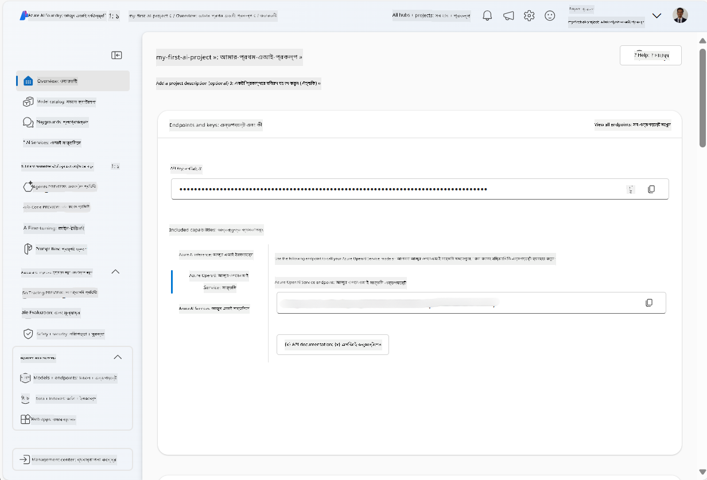
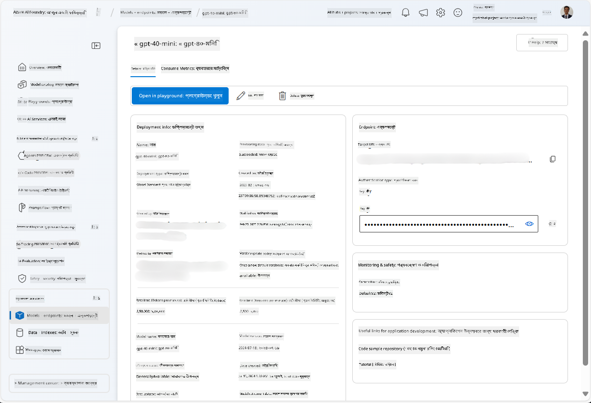
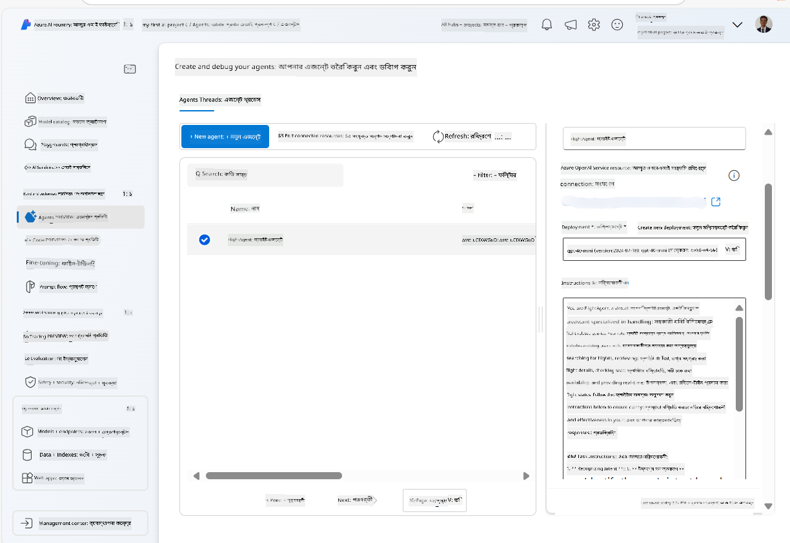

<!--
CO_OP_TRANSLATOR_METADATA:
{
  "original_hash": "7e92870dc0843e13d4dabc620c09d2d9",
  "translation_date": "2025-07-12T08:17:21+00:00",
  "source_file": "02-explore-agentic-frameworks/azure-ai-foundry-agent-creation.md",
  "language_code": "bn"
}
-->
# Azure AI Agent Service Development

এই অনুশীলনে, আপনি [Azure AI Foundry portal](https://ai.azure.com/?WT.mc_id=academic-105485-koreyst) এ Azure AI Agent সার্ভিস টুল ব্যবহার করে Flight Booking এর জন্য একটি এজেন্ট তৈরি করবেন। এই এজেন্ট ব্যবহারকারীদের সাথে যোগাযোগ করতে পারবে এবং ফ্লাইট সম্পর্কিত তথ্য প্রদান করবে।

## Prerequisites

এই অনুশীলন সম্পন্ন করতে আপনার নিম্নলিখিত জিনিসগুলো প্রয়োজন:
1. একটি Azure অ্যাকাউন্ট যার সক্রিয় সাবস্ক্রিপশন রয়েছে। [বিনামূল্যে একটি অ্যাকাউন্ট তৈরি করুন](https://azure.microsoft.com/free/?WT.mc_id=academic-105485-koreyst)।
2. Azure AI Foundry হাব তৈরি করার অনুমতি অথবা আপনার জন্য একটি হাব তৈরি করা হয়েছে।
    - যদি আপনার ভূমিকা Contributor বা Owner হয়, তাহলে আপনি এই টিউটোরিয়ালের ধাপগুলো অনুসরণ করতে পারেন।

## Create an Azure AI Foundry hub

> **Note:** Azure AI Foundry পূর্বে Azure AI Studio নামে পরিচিত ছিল।

1. Azure AI Foundry হাব তৈরি করার জন্য [Azure AI Foundry](https://learn.microsoft.com/en-us/azure/ai-studio/?WT.mc_id=academic-105485-koreyst) ব্লগ পোস্ট থেকে এই নির্দেশনাগুলো অনুসরণ করুন।
2. আপনার প্রজেক্ট তৈরি হলে, প্রদর্শিত টিপসগুলো বন্ধ করুন এবং Azure AI Foundry পোর্টালে প্রজেক্ট পেজটি পর্যালোচনা করুন, যা নিচের ছবির মতো দেখতে হবে:

    

## Deploy a model

1. আপনার প্রজেক্টের বাম পাশে, **My assets** সেকশনে যান এবং **Models + endpoints** পেজ নির্বাচন করুন।
2. **Models + endpoints** পেজে, **Model deployments** ট্যাবে, **+ Deploy model** মেনু থেকে **Deploy base model** নির্বাচন করুন।
3. তালিকায় `gpt-4o-mini` মডেলটি খুঁজে বের করুন, তারপর সেটি নির্বাচন করে নিশ্চিত করুন।

    > **Note**: TPM কমানো সাবস্ক্রিপশনে উপলব্ধ কোটার অতিরিক্ত ব্যবহার এড়াতে সাহায্য করে।

    

## Create an agent

এখন যেহেতু আপনি একটি মডেল ডিপ্লয় করেছেন, আপনি একটি এজেন্ট তৈরি করতে পারেন। একটি এজেন্ট হলো একটি কথোপকথনমূলক AI মডেল যা ব্যবহারকারীদের সাথে যোগাযোগ করতে পারে।

1. আপনার প্রজেক্টের বাম পাশে, **Build & Customize** সেকশনে যান এবং **Agents** পেজ নির্বাচন করুন।
2. নতুন একটি এজেন্ট তৈরি করতে **+ Create agent** ক্লিক করুন। **Agent Setup** ডায়ালগ বক্সে:
    - এজেন্টের জন্য একটি নাম দিন, যেমন `FlightAgent`।
    - নিশ্চিত করুন যে পূর্বে তৈরি করা `gpt-4o-mini` মডেল ডিপ্লয়মেন্টটি নির্বাচিত আছে।
    - এজেন্টকে অনুসরণ করার জন্য **Instructions** সেট করুন। উদাহরণস্বরূপ:
    ```
    You are FlightAgent, a virtual assistant specialized in handling flight-related queries. Your role includes assisting users with searching for flights, retrieving flight details, checking seat availability, and providing real-time flight status. Follow the instructions below to ensure clarity and effectiveness in your responses:

    ### Task Instructions:
    1. **Recognizing Intent**:
       - Identify the user's intent based on their request, focusing on one of the following categories:
         - Searching for flights
         - Retrieving flight details using a flight ID
         - Checking seat availability for a specified flight
         - Providing real-time flight status using a flight number
       - If the intent is unclear, politely ask users to clarify or provide more details.
        
    2. **Processing Requests**:
        - Depending on the identified intent, perform the required task:
        - For flight searches: Request details such as origin, destination, departure date, and optionally return date.
        - For flight details: Request a valid flight ID.
        - For seat availability: Request the flight ID and date and validate inputs.
        - For flight status: Request a valid flight number.
        - Perform validations on provided data (e.g., formats of dates, flight numbers, or IDs). If the information is incomplete or invalid, return a friendly request for clarification.

    3. **Generating Responses**:
    - Use a tone that is friendly, concise, and supportive.
    - Provide clear and actionable suggestions based on the output of each task.
    - If no data is found or an error occurs, explain it to the user gently and offer alternative actions (e.g., refine search, try another query).
    
    ```
> [!NOTE]
> বিস্তারিত প্রম্পটের জন্য, আপনি [এই রিপোজিটরি](https://github.com/ShivamGoyal03/RoamMind) দেখতে পারেন।

> এছাড়াও, আপনি এজেন্টের ক্ষমতা বাড়ানোর জন্য **Knowledge Base** এবং **Actions** যোগ করতে পারেন যাতে এটি ব্যবহারকারীর অনুরোধ অনুযায়ী আরও তথ্য দিতে এবং স্বয়ংক্রিয় কাজ করতে পারে। এই অনুশীলনের জন্য, আপনি এই ধাপগুলো এড়িয়ে যেতে পারেন।



3. নতুন একটি মাল্টি-AI এজেন্ট তৈরি করতে, শুধু **New Agent** ক্লিক করুন। নতুন তৈরি হওয়া এজেন্টটি Agents পেজে প্রদর্শিত হবে।

## Test the agent

এজেন্ট তৈরি করার পর, আপনি Azure AI Foundry পোর্টালের প্লেগ্রাউন্ডে এটি ব্যবহার করে দেখতে পারেন এটি ব্যবহারকারীর প্রশ্নের কীভাবে প্রতিক্রিয়া দেয়।

1. আপনার এজেন্টের **Setup** পেনের উপরে, **Try in playground** নির্বাচন করুন।
2. **Playground** পেনের মধ্যে, আপনি চ্যাট উইন্ডোতে প্রশ্ন টাইপ করে এজেন্টের সাথে যোগাযোগ করতে পারেন। উদাহরণস্বরূপ, আপনি এজেন্টকে ২৮ তারিখে সিয়াটল থেকে নিউ ইয়র্কের ফ্লাইট খুঁজে দিতে বলতে পারেন।

    > **Note**: এই অনুশীলনে কোনো রিয়েল-টাইম ডেটা ব্যবহার করা হচ্ছে না, তাই এজেন্ট সঠিক উত্তর নাও দিতে পারে। উদ্দেশ্য হলো এজেন্টের ব্যবহারকারীর প্রশ্ন বুঝতে এবং প্রদত্ত নির্দেশনা অনুযায়ী সাড়া দিতে সক্ষমতা পরীক্ষা করা।

    

3. এজেন্ট পরীক্ষা করার পর, আপনি আরও intents, training data, এবং actions যোগ করে এর ক্ষমতা বাড়াতে পারেন।

## Clean up resources

এজেন্ট পরীক্ষা শেষ হলে, অতিরিক্ত খরচ এড়াতে এটি মুছে ফেলতে পারেন।
1. [Azure portal](https://portal.azure.com) খুলুন এবং সেই রিসোর্স গ্রুপের বিষয়বস্তু দেখুন যেখানে আপনি এই অনুশীলনের জন্য হাব রিসোর্স ডিপ্লয় করেছেন।
2. টুলবার থেকে **Delete resource group** নির্বাচন করুন।
3. রিসোর্স গ্রুপের নাম লিখে নিশ্চিত করুন যে আপনি এটি মুছে ফেলতে চান।

## Resources

- [Azure AI Foundry documentation](https://learn.microsoft.com/en-us/azure/ai-studio/?WT.mc_id=academic-105485-koreyst)
- [Azure AI Foundry portal](https://ai.azure.com/?WT.mc_id=academic-105485-koreyst)
- [Getting Started with Azure AI Studio](https://techcommunity.microsoft.com/blog/educatordeveloperblog/getting-started-with-azure-ai-studio/4095602?WT.mc_id=academic-105485-koreyst)
- [Fundamentals of AI agents on Azure](https://learn.microsoft.com/en-us/training/modules/ai-agent-fundamentals/?WT.mc_id=academic-105485-koreyst)
- [Azure AI Discord](https://aka.ms/AzureAI/Discord)

**অস্বীকৃতি**:  
এই নথিটি AI অনুবাদ সেবা [Co-op Translator](https://github.com/Azure/co-op-translator) ব্যবহার করে অনূদিত হয়েছে। আমরা যথাসাধ্য সঠিকতার চেষ্টা করি, তবে স্বয়ংক্রিয় অনুবাদে ত্রুটি বা অসঙ্গতি থাকতে পারে। মূল নথিটি তার নিজস্ব ভাষায়ই কর্তৃত্বপূর্ণ উৎস হিসেবে বিবেচিত হওয়া উচিত। গুরুত্বপূর্ণ তথ্যের জন্য পেশাদার মানব অনুবাদ গ্রহণ করার পরামর্শ দেওয়া হয়। এই অনুবাদের ব্যবহারে সৃষ্ট কোনো ভুল বোঝাবুঝি বা ভুল ব্যাখ্যার জন্য আমরা দায়ী নই।