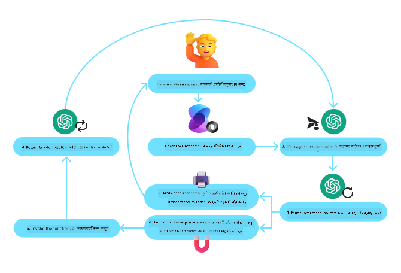
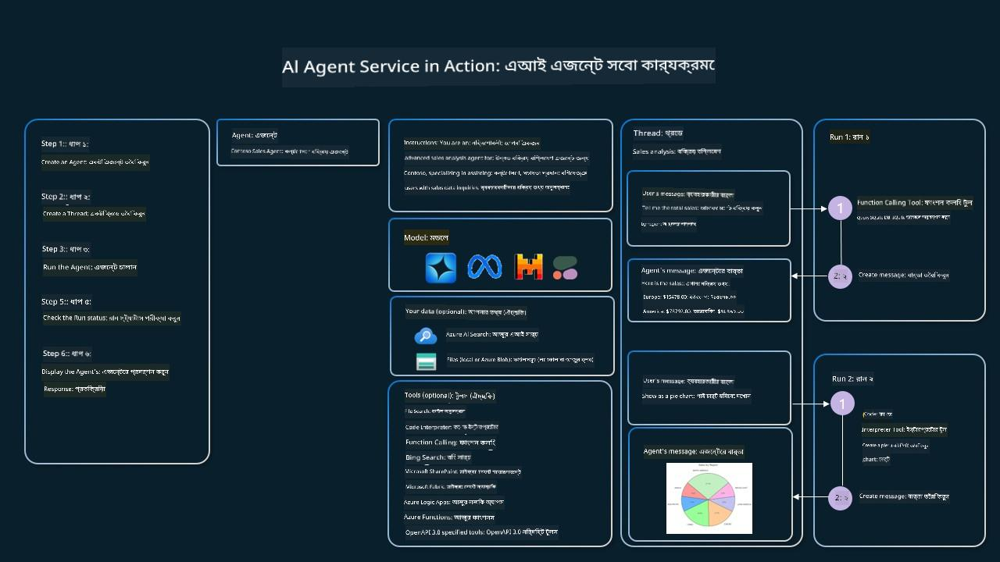

<!--
CO_OP_TRANSLATOR_METADATA:
{
  "original_hash": "88258b03f2893aa2e69eb8fb24baabbc",
  "translation_date": "2025-07-12T09:29:01+00:00",
  "source_file": "04-tool-use/README.md",
  "language_code": "bn"
}
-->
[](https://youtu.be/vieRiPRx-gI?si=cEZ8ApnT6Sus9rhn)

> _(উপরের ছবিতে ক্লিক করে এই পাঠের ভিডিও দেখুন)_

# টুল ইউজ ডিজাইন প্যাটার্ন

টুলগুলো আকর্ষণীয় কারণ এগুলো AI এজেন্টদের আরও বিস্তৃত ক্ষমতা দেয়। এজেন্টের কাছে সীমিত সংখ্যক কাজ করার ক্ষমতা থাকার পরিবর্তে, একটি টুল যোগ করার মাধ্যমে এজেন্ট এখন অনেক ধরনের কাজ করতে পারে। এই অধ্যায়ে আমরা টুল ইউজ ডিজাইন প্যাটার্ন সম্পর্কে জানব, যা বর্ণনা করে কিভাবে AI এজেন্টরা নির্দিষ্ট টুল ব্যবহার করে তাদের লক্ষ্য অর্জন করতে পারে।

## পরিচিতি

এই পাঠে আমরা নিম্নলিখিত প্রশ্নগুলোর উত্তর খুঁজব:

- টুল ইউজ ডিজাইন প্যাটার্ন কী?
- কোন কোন ক্ষেত্রে এটি প্রয়োগ করা যায়?
- ডিজাইন প্যাটার্ন বাস্তবায়নের জন্য কোন উপাদান/বিল্ডিং ব্লকগুলো প্রয়োজন?
- বিশ্বাসযোগ্য AI এজেন্ট তৈরির জন্য টুল ইউজ ডিজাইন প্যাটার্ন ব্যবহারে বিশেষ কোন বিষয়গুলো বিবেচনা করতে হয়?

## শেখার লক্ষ্য

এই পাঠ শেষ করার পর আপনি সক্ষম হবেন:

- টুল ইউজ ডিজাইন প্যাটার্ন এবং এর উদ্দেশ্য সংজ্ঞায়িত করতে।
- টুল ইউজ ডিজাইন প্যাটার্ন প্রযোজ্য এমন ব্যবহার ক্ষেত্রগুলো চিহ্নিত করতে।
- ডিজাইন প্যাটার্ন বাস্তবায়নের জন্য প্রয়োজনীয় মূল উপাদানগুলো বুঝতে।
- এই ডিজাইন প্যাটার্ন ব্যবহার করে AI এজেন্টদের বিশ্বাসযোগ্যতা নিশ্চিত করার জন্য বিবেচ্য বিষয়গুলো চিনতে।

## টুল ইউজ ডিজাইন প্যাটার্ন কী?

**টুল ইউজ ডিজাইন প্যাটার্ন** LLM-দের (বড় ভাষা মডেল) বাহ্যিক টুলের সাথে ইন্টারঅ্যাক্ট করার ক্ষমতা দেয় নির্দিষ্ট লক্ষ্য অর্জনের জন্য। টুল হলো এমন কোড যা এজেন্ট দ্বারা চালানো যায় কোনো কাজ সম্পাদনের জন্য। একটি টুল হতে পারে একটি সাধারণ ফাংশন যেমন ক্যালকুলেটর, অথবা তৃতীয় পক্ষের সার্ভিসের API কল যেমন স্টক প্রাইস লুকআপ বা আবহাওয়ার পূর্বাভাস। AI এজেন্টদের প্রসঙ্গে, টুলগুলো ডিজাইন করা হয় যাতে এজেন্টরা **মডেল-জেনারেটেড ফাংশন কল** এর প্রতিক্রিয়ায় এগুলো চালাতে পারে।

## কোন কোন ক্ষেত্রে এটি প্রয়োগ করা যায়?

AI এজেন্টরা টুল ব্যবহার করে জটিল কাজ সম্পন্ন করতে, তথ্য সংগ্রহ করতে, বা সিদ্ধান্ত নিতে পারে। টুল ইউজ ডিজাইন প্যাটার্ন সাধারণত এমন পরিস্থিতিতে ব্যবহৃত হয় যেখানে বাহ্যিক সিস্টেম যেমন ডাটাবেস, ওয়েব সার্ভিস, বা কোড ইন্টারপ্রেটারের সাথে গতিশীল ইন্টারঅ্যাকশন দরকার। এর কিছু ব্যবহার ক্ষেত্র হলো:

- **গতিশীল তথ্য সংগ্রহ:** এজেন্টরা বাহ্যিক API বা ডাটাবেস থেকে সর্বশেষ তথ্য সংগ্রহ করতে পারে (যেমন, SQLite ডাটাবেস থেকে ডেটা বিশ্লেষণ, স্টক প্রাইস বা আবহাওয়ার তথ্য সংগ্রহ)।
- **কোড এক্সিকিউশন ও ইন্টারপ্রিটেশন:** এজেন্টরা কোড বা স্ক্রিপ্ট চালিয়ে গাণিতিক সমস্যা সমাধান, রিপোর্ট তৈরি, বা সিমুলেশন করতে পারে।
- **ওয়ার্কফ্লো অটোমেশন:** টাস্ক শিডিউলার, ইমেইল সার্ভিস, বা ডেটা পাইপলাইন ইন্টিগ্রেট করে পুনরাবৃত্তিমূলক বা বহু-ধাপের কাজ অটোমেট করা।
- **কাস্টমার সাপোর্ট:** এজেন্টরা CRM সিস্টেম, টিকিটিং প্ল্যাটফর্ম, বা নলেজ বেসের সাথে ইন্টারঅ্যাক্ট করে ব্যবহারকারীর প্রশ্ন সমাধান করতে পারে।
- **কনটেন্ট জেনারেশন ও এডিটিং:** গ্রামার চেকার, টেক্সট সামারাইজার, বা কনটেন্ট সেফটি ইভ্যালুয়েটর মতো টুল ব্যবহার করে কনটেন্ট তৈরিতে সহায়তা করা।

## টুল ইউজ ডিজাইন প্যাটার্ন বাস্তবায়নের জন্য কোন উপাদান/বিল্ডিং ব্লকগুলো প্রয়োজন?

এই বিল্ডিং ব্লকগুলো AI এজেন্টকে বিস্তৃত কাজ করার সুযোগ দেয়। টুল ইউজ ডিজাইন প্যাটার্ন বাস্তবায়নের জন্য প্রয়োজনীয় মূল উপাদানগুলো হলো:

- **ফাংশন/টুল স্কিমা:** উপলব্ধ টুলগুলোর বিস্তারিত সংজ্ঞা, যার মধ্যে ফাংশনের নাম, উদ্দেশ্য, প্রয়োজনীয় প্যারামিটার, এবং প্রত্যাশিত আউটপুট থাকে। এই স্কিমাগুলো LLM-কে বুঝতে সাহায্য করে কোন টুলগুলো আছে এবং কীভাবে বৈধ অনুরোধ তৈরি করতে হয়।

- **ফাংশন এক্সিকিউশন লজিক:** ব্যবহারকারীর উদ্দেশ্য এবং কথোপকথনের প্রেক্ষাপট অনুযায়ী কখন এবং কিভাবে টুলগুলো চালানো হবে তা নিয়ন্ত্রণ করে। এতে প্ল্যানার মডিউল, রাউটিং মেকানিজম, বা শর্তাধীন প্রবাহ থাকতে পারে যা গতিশীলভাবে টুল ব্যবহারের সিদ্ধান্ত নেয়।

- **মেসেজ হ্যান্ডলিং সিস্টেম:** ব্যবহারকারীর ইনপুট, LLM এর প্রতিক্রিয়া, টুল কল, এবং টুল আউটপুটের মধ্যে কথোপকথনের প্রবাহ পরিচালনা করে।

- **টুল ইন্টিগ্রেশন ফ্রেমওয়ার্ক:** এজেন্টকে বিভিন্ন টুলের সাথে সংযুক্ত করে, তা হোক সাধারণ ফাংশন বা জটিল বাহ্যিক সার্ভিস।

- **এরর হ্যান্ডলিং ও ভ্যালিডেশন:** টুল এক্সিকিউশনে ব্যর্থতা মোকাবেলা, প্যারামিটার যাচাই, এবং অপ্রত্যাশিত প্রতিক্রিয়া পরিচালনার ব্যবস্থা।

- **স্টেট ম্যানেজমেন্ট:** কথোপকথনের প্রেক্ষাপট, পূর্ববর্তী টুল ইন্টারঅ্যাকশন, এবং স্থায়ী ডেটা ট্র্যাক করে যাতে বহু-বার্তালাপে সামঞ্জস্য থাকে।

এবার, ফাংশন/টুল কলিং সম্পর্কে বিস্তারিত জানি।

### ফাংশন/টুল কলিং

ফাংশন কলিং হলো প্রধান উপায় যার মাধ্যমে আমরা বড় ভাষা মডেলগুলোকে (LLM) টুলের সাথে ইন্টারঅ্যাক্ট করার সুযোগ দিই। প্রায়ই 'ফাংশন' এবং 'টুল' শব্দগুলো বিনিময়যোগ্যভাবে ব্যবহৃত হয় কারণ 'ফাংশন' (পুনঃব্যবহারযোগ্য কোড ব্লক) হলো সেই 'টুল' যা এজেন্টরা কাজ সম্পাদনের জন্য ব্যবহার করে। কোনো ফাংশনের কোড চালানোর জন্য, LLM-কে ব্যবহারকারীর অনুরোধের সাথে ফাংশনের বর্ণনা তুলনা করতে হয়। এজন্য সব উপলব্ধ ফাংশনের বর্ণনা সম্বলিত একটি স্কিমা LLM-কে পাঠানো হয়। এরপর LLM সবচেয়ে উপযুক্ত ফাংশন নির্বাচন করে তার নাম এবং আর্গুমেন্ট ফেরত দেয়। নির্বাচিত ফাংশনটি চালানো হয়, তার প্রতিক্রিয়া LLM-কে পাঠানো হয়, যা ব্যবহারকারীর অনুরোধের উত্তর দিতে ব্যবহার করা হয়।

ডেভেলপারদের জন্য ফাংশন কলিং বাস্তবায়নের জন্য প্রয়োজন:

1. ফাংশন কলিং সমর্থনকারী একটি LLM মডেল
2. ফাংশন বর্ণনাসম্পন্ন একটি স্কিমা
3. প্রতিটি বর্ণিত ফাংশনের কোড

চলুন একটি উদাহরণ দেখি, যেখানে একটি শহরের বর্তমান সময় পাওয়া হচ্ছে:

1. **ফাংশন কলিং সমর্থনকারী একটি LLM ইনিশিয়ালাইজ করুন:**

    সব মডেল ফাংশন কলিং সমর্থন করে না, তাই আপনার ব্যবহৃত LLM এ এটি আছে কিনা যাচাই করা জরুরি। <a href="https://learn.microsoft.com/azure/ai-services/openai/how-to/function-calling" target="_blank">Azure OpenAI</a> ফাংশন কলিং সমর্থন করে। আমরা Azure OpenAI ক্লায়েন্ট শুরু করব।

    ```python
    # Initialize the Azure OpenAI client
    client = AzureOpenAI(
        azure_endpoint = os.getenv("AZURE_OPENAI_ENDPOINT"), 
        api_key=os.getenv("AZURE_OPENAI_API_KEY"),  
        api_version="2024-05-01-preview"
    )
    ```

1. **একটি ফাংশন স্কিমা তৈরি করুন:**

    এরপর আমরা একটি JSON স্কিমা সংজ্ঞায়িত করব, যাতে ফাংশনের নাম, ফাংশনটি কী করে তার বর্ণনা, এবং ফাংশনের প্যারামিটারগুলোর নাম ও বর্ণনা থাকবে। তারপর এই স্কিমা ক্লায়েন্টকে পাঠানো হবে, ব্যবহারকারীর অনুরোধ (যেমন সান ফ্রান্সিসকোর সময় জানতে চাওয়া) সহ। গুরুত্বপূর্ণ হলো, **টুল কল** ফেরত আসে, প্রশ্নের চূড়ান্ত উত্তর নয়। আগেই বলা হয়েছে, LLM কাজের জন্য নির্বাচিত ফাংশনের নাম এবং আর্গুমেন্ট ফেরত দেয়।

    ```python
    # Function description for the model to read
    tools = [
        {
            "type": "function",
            "function": {
                "name": "get_current_time",
                "description": "Get the current time in a given location",
                "parameters": {
                    "type": "object",
                    "properties": {
                        "location": {
                            "type": "string",
                            "description": "The city name, e.g. San Francisco",
                        },
                    },
                    "required": ["location"],
                },
            }
        }
    ]
    ```
   
    ```python
  
    # Initial user message
    messages = [{"role": "user", "content": "What's the current time in San Francisco"}] 
  
    # First API call: Ask the model to use the function
      response = client.chat.completions.create(
          model=deployment_name,
          messages=messages,
          tools=tools,
          tool_choice="auto",
      )
  
      # Process the model's response
      response_message = response.choices[0].message
      messages.append(response_message)
  
      print("Model's response:")  

      print(response_message)
  
    ```

    ```bash
    Model's response:
    ChatCompletionMessage(content=None, role='assistant', function_call=None, tool_calls=[ChatCompletionMessageToolCall(id='call_pOsKdUlqvdyttYB67MOj434b', function=Function(arguments='{"location":"San Francisco"}', name='get_current_time'), type='function')])
    ```
  
1. **কাজটি সম্পাদনের জন্য প্রয়োজনীয় ফাংশন কোড:**

    এখন LLM কোন ফাংশন চালাতে হবে তা নির্বাচন করেছে, কাজটি সম্পাদনের কোড বাস্তবায়ন ও চালানো দরকার। আমরা পাইথনে বর্তমান সময় পাওয়ার কোড লিখব। এছাড়াও response_message থেকে নাম ও আর্গুমেন্ট বের করার কোড লিখতে হবে যাতে চূড়ান্ত ফলাফল পাওয়া যায়।

    ```python
      def get_current_time(location):
        """Get the current time for a given location"""
        print(f"get_current_time called with location: {location}")  
        location_lower = location.lower()
        
        for key, timezone in TIMEZONE_DATA.items():
            if key in location_lower:
                print(f"Timezone found for {key}")  
                current_time = datetime.now(ZoneInfo(timezone)).strftime("%I:%M %p")
                return json.dumps({
                    "location": location,
                    "current_time": current_time
                })
      
        print(f"No timezone data found for {location_lower}")  
        return json.dumps({"location": location, "current_time": "unknown"})
    ```

    ```python
     # Handle function calls
      if response_message.tool_calls:
          for tool_call in response_message.tool_calls:
              if tool_call.function.name == "get_current_time":
     
                  function_args = json.loads(tool_call.function.arguments)
     
                  time_response = get_current_time(
                      location=function_args.get("location")
                  )
     
                  messages.append({
                      "tool_call_id": tool_call.id,
                      "role": "tool",
                      "name": "get_current_time",
                      "content": time_response,
                  })
      else:
          print("No tool calls were made by the model.")  
  
      # Second API call: Get the final response from the model
      final_response = client.chat.completions.create(
          model=deployment_name,
          messages=messages,
      )
  
      return final_response.choices[0].message.content
     ```

    ```bash
      get_current_time called with location: San Francisco
      Timezone found for san francisco
      The current time in San Francisco is 09:24 AM.
     ```

ফাংশন কলিং অধিকাংশ এজেন্ট টুল ইউজ ডিজাইনের মূল, তবে এটি শূন্য থেকে বাস্তবায়ন করা মাঝে মাঝে চ্যালেঞ্জিং হতে পারে। আমরা [Lesson 2](../../../02-explore-agentic-frameworks) এ শিখেছি, এজেন্টিক ফ্রেমওয়ার্কগুলো টুল ইউজ বাস্তবায়নের জন্য পূর্বনির্মিত বিল্ডিং ব্লক সরবরাহ করে।

## এজেন্টিক ফ্রেমওয়ার্ক দিয়ে টুল ইউজ উদাহরণ

নিম্নলিখিত উদাহরণগুলো দেখায় কিভাবে বিভিন্ন এজেন্টিক ফ্রেমওয়ার্ক ব্যবহার করে টুল ইউজ ডিজাইন প্যাটার্ন বাস্তবায়ন করা যায়:

### Semantic Kernel

<a href="https://learn.microsoft.com/azure/ai-services/agents/overview" target="_blank">Semantic Kernel</a> হলো .NET, Python, এবং Java ডেভেলপারদের জন্য একটি ওপেন-সোর্স AI ফ্রেমওয়ার্ক যা বড় ভাষা মডেলের সাথে কাজ করে। এটি ফাংশন কলিং ব্যবহারের প্রক্রিয়া সহজ করে, কারণ এটি স্বয়ংক্রিয়ভাবে আপনার ফাংশন এবং তাদের প্যারামিটারগুলো মডেলের কাছে বর্ণনা করে <a href="https://learn.microsoft.com/semantic-kernel/concepts/ai-services/chat-completion/function-calling/?pivots=programming-language-python#1-serializing-the-functions" target="_blank">সিরিয়ালাইজিং</a> প্রক্রিয়ার মাধ্যমে। এটি মডেল এবং আপনার কোডের মধ্যে বার্তা আদান-প্রদানও পরিচালনা করে। Semantic Kernel এর মতো এজেন্টিক ফ্রেমওয়ার্ক ব্যবহারের আরেকটি সুবিধা হলো, এটি পূর্বনির্মিত টুল যেমন <a href="https://github.com/microsoft/semantic-kernel/blob/main/python/samples/getting_started_with_agents/openai_assistant/step4_assistant_tool_file_search.py" target="_blank">File Search</a> এবং <a href="https://github.com/microsoft/semantic-kernel/blob/main/python/samples/getting_started_with_agents/openai_assistant/step3_assistant_tool_code_interpreter.py" target="_blank">Code Interpreter</a> অ্যাক্সেস দেয়।

নিম্নলিখিত চিত্রটি Semantic Kernel এর ফাংশন কলিং প্রক্রিয়া দেখায়:



Semantic Kernel এ ফাংশন/টুলগুলোকে <a href="https://learn.microsoft.com/semantic-kernel/concepts/plugins/?pivots=programming-language-python" target="_blank">Plugins</a> বলা হয়। আমরা আগের `get_current_time` ফাংশনটিকে একটি ক্লাসে রূপান্তর করে প্লাগইন হিসেবে তৈরি করতে পারি। আমরা `kernel_function` ডেকোরেটরও ইমপোর্ট করতে পারি, যা ফাংশনের বর্ণনা নেয়। এরপর GetCurrentTimePlugin দিয়ে kernel তৈরি করলে, kernel স্বয়ংক্রিয়ভাবে ফাংশন ও প্যারামিটার সিরিয়ালাইজ করে, LLM-কে পাঠানোর জন্য স্কিমা তৈরি করে।

```python
from semantic_kernel.functions import kernel_function

class GetCurrentTimePlugin:
    async def __init__(self, location):
        self.location = location

    @kernel_function(
        description="Get the current time for a given location"
    )
    def get_current_time(location: str = ""):
        ...

```

```python 
from semantic_kernel import Kernel

# Create the kernel
kernel = Kernel()

# Create the plugin
get_current_time_plugin = GetCurrentTimePlugin(location)

# Add the plugin to the kernel
kernel.add_plugin(get_current_time_plugin)
```
  
### Azure AI Agent Service

<a href="https://learn.microsoft.com/azure/ai-services/agents/overview" target="_blank">Azure AI Agent Service</a> হলো একটি নতুন এজেন্টিক ফ্রেমওয়ার্ক যা ডেভেলপারদের নিরাপদে উচ্চমানের, সম্প্রসারিত AI এজেন্ট তৈরি, ডিপ্লয় এবং স্কেল করতে সাহায্য করে, যেখানে কম্পিউট ও স্টোরেজ রিসোর্স ম্যানেজ করার দরকার পড়ে না। এটি বিশেষ করে এন্টারপ্রাইজ অ্যাপ্লিকেশনের জন্য উপযোগী কারণ এটি সম্পূর্ণ ম্যানেজড সার্ভিস এবং এন্টারপ্রাইজ গ্রেড সিকিউরিটি প্রদান করে।

LLM API সরাসরি ব্যবহারের তুলনায় Azure AI Agent Service এর কিছু সুবিধা:

- স্বয়ংক্রিয় টুল কলিং – টুল কল পার্স, টুল চালানো, এবং রেসপন্স হ্যান্ডল করার দরকার নেই; সবকিছু সার্ভার-সাইডে হয়
- নিরাপদে পরিচালিত ডেটা – নিজের কথোপকথন স্টেট ম্যানেজ করার পরিবর্তে থ্রেড ব্যবহার করে সব তথ্য সংরক্ষণ করা যায়
- প্রস্তুত টুল – Bing, Azure AI Search, এবং Azure Functions এর মতো ডেটা সোর্সের সাথে ইন্টারঅ্যাক্ট করার জন্য টুল

Azure AI Agent Service এ উপলব্ধ টুলগুলো দুই ভাগে বিভক্ত:

1. জ্ঞান টুল:
    - <a href="https://learn.microsoft.com/azure/ai-services/agents/how-to/tools/bing-grounding?tabs=python&pivots=overview" target="_blank">Bing Search এর মাধ্যমে গ্রাউন্ডিং</a>
    - <a href="https://learn.microsoft.com/azure/ai-services/agents/how-to/tools/file-search?tabs=python&pivots=overview" target="_blank">File Search</a>
    - <a href="https://learn.microsoft.com/azure/ai-services/agents/how-to/tools/azure-ai-search?tabs=azurecli%2Cpython&pivots=overview-azure-ai-search" target="_blank">Azure AI Search</a>

2. অ্যাকশন টুল:
    - <a href="https://learn.microsoft.com/azure/ai-services/agents/how-to/tools/function-calling?tabs=python&pivots=overview" target="_blank">Function Calling</a>
    - <a href="https://learn.microsoft.com/azure/ai-services/agents/how-to/tools/code-interpreter?tabs=python&pivots=overview" target="_blank">Code Interpreter</a>
    - <a href="https://learn.microsoft.com/azure/ai-services/agents/how-to/tools/openapi-spec?tabs=python&pivots=overview" target="_blank">OpenAI নির্ধারিত টুল</a>
    - <a href="https://learn.microsoft.com/azure/ai-services/agents/how-to/tools/azure-functions?pivots=overview" target="_blank">Azure Functions</a>

Agent Service আমাদের এই টুলগুলোকে `toolset` হিসেবে একসাথে ব্যবহার করার সুযোগ দেয়। এটি `threads` ব্যবহার করে, যা নির্দিষ্ট কথোপকথনের বার্তাগুলোর ইতিহাস ট্র্যাক করে।

ধরা যাক আপনি Contoso নামের একটি কোম্পানির সেলস এজেন্ট। আপনি এমন একটি কথোপকথন এজেন্ট তৈরি করতে চান যা আপনার সেলস ডেটা সম্পর্কে প্রশ্নের উত্তর দিতে পারে।

নিম্নলিখিত ছবি দেখায় কিভাবে Azure AI Agent Service ব্যবহার করে আপনার সেলস ডেটা বিশ্লেষণ করা যায়:



এই সার্ভিসের সাথে যেকোনো টুল ব্যবহার করতে আমরা একটি ক্লায়েন্ট তৈরি করে টুল বা টুলসেট সংজ্ঞায়িত করতে পারি। বাস্তবায়নের জন্য নিচের পাইথন কোড ব্যবহার করা যেতে পারে। LLM টুলসেট দেখে ব্যবহারকারীর অনুরোধ অনুযায়ী ব্যবহারকারী তৈরি ফাংশন `fetch_sales_data_using_sqlite_query` অথবা পূর্বনির্মিত Code Interpreter ব্যবহার করার সিদ্ধান্ত নেবে।

```python 
import os
from azure.ai.projects import AIProjectClient
from azure.identity import DefaultAzureCredential
from fecth_sales_data_functions import fetch_sales_data_using_sqlite_query # fetch_sales_data_using_sqlite_query function which can be found in a fetch_sales_data_functions.py file.
from azure.ai.projects.models import ToolSet, FunctionTool, CodeInterpreterTool

project_client = AIProjectClient.from_connection_string(
    credential=DefaultAzureCredential(),
    conn_str=os.environ["PROJECT_CONNECTION_STRING"],
)

# Initialize function calling agent with the fetch_sales_data_using_sqlite_query function and adding it to the toolset
fetch_data_function = FunctionTool(fetch_sales_data_using_sqlite_query)
toolset = ToolSet()
toolset.add(fetch_data_function)

# Initialize Code Interpreter tool and adding it to the toolset. 
code_interpreter = code_interpreter = CodeInterpreterTool()
toolset = ToolSet()
toolset.add(code_interpreter)

agent = project_client.agents.create_agent(
    model="gpt-4o-mini", name="my-agent", instructions="You are helpful agent", 
    toolset=toolset
)
```

## বিশ্বাসযোগ্য AI এজেন্ট তৈরির জন্য টুল ইউজ ডিজাইন প্যাটার্ন ব্যবহারে বিশেষ বিবেচ্য বিষয়গুলো কী?

LLM দ্বারা গতিশীলভাবে তৈরি SQL নিয়ে সাধারণ উদ্বেগ হলো সিকিউরিটি, বিশেষ করে SQL ইনজেকশন বা ক্ষতিকর কাজের ঝুঁকি, যেমন ডাটাবেস ড্রপ বা পরিবর্তন। যদিও এই উদ্বেগগুলো যৌক্তিক, সেগুলো কার্যকরভাবে প্রতিরোধ করা যায় ডাটাবেস অ্যাক্সেস পারমিশন সঠিকভাবে কনফিগার করে। অধিকাংশ ডাটাবেসের জন্য এটি রিড-ওনলি কনফিগারেশন করা হয়। PostgreSQL বা Azure SQL এর মতো ডাটাবেস সার্ভিসে অ্যাপকে রিড-ওনলি (SELECT) রোল দেওয়া উচিত।

অ্যাপকে নিরাপদ পরিবেশে চালানো সুরক্ষা বাড়ায়। এন্টারপ্রাইজ ক্ষেত্রে, ডেটা সাধারণত অপারেশনাল সিস্টেম থেকে বের করে রিড-ওনলি ডাটাবেস বা ডেটা ওয়্যারহাউসে রূপান্তরিত করা হয়, যেখানে ব্যবহারকারী-বান্ধব স্কিমা থাকে। এই পদ্ধতি ডেটাকে সুরক্ষিত, পারফরম্যান্স ও অ্যাক্সেসযোগ্য করে তোলে এবং অ্যাপের অ্যাক্সেস সীমিত ও রিড-ওনলি রাখে।

## অতিরিক্ত সম্পদ

-
<a href="https://microsoft.github.io/build-your-first-agent-with-azure-ai-agent-service-workshop/" target="_blank">
Azure AI Agents Service Workshop</a>
- <a href="https://github.com/Azure-Samples/contoso-creative-writer/tree/main/docs/workshop" target="_blank">Contoso Creative Writer Multi-Agent Workshop</a>
- <a href="https://learn.microsoft.com/semantic-kernel/concepts/ai-services/chat-completion/function-calling/?pivots=programming-language-python#1-serializing-the-functions" target="_blank">Semantic Kernel Function Calling Tutorial</a>
- <a href="https://github.com/microsoft/semantic-kernel/blob/main/python/samples/getting_started_with_agents/openai_assistant/step3_assistant_tool_code_interpreter.py" target="_blank">Semantic Kernel Code Interpreter</a>
- <a href="https://microsoft.github.io/autogen/dev/user-guide/core-user-guide/components/tools.html" target="_blank">Autogen Tools</a>

## পূর্ববর্তী পাঠ

[Agentic Design Patterns বোঝা](../03-agentic-design-patterns/README.md)

## পরবর্তী পাঠ

[Agentic RAG](../05-agentic-rag/README.md)

**অস্বীকৃতি**:  
এই নথিটি AI অনুবাদ সেবা [Co-op Translator](https://github.com/Azure/co-op-translator) ব্যবহার করে অনূদিত হয়েছে। আমরা যথাসাধ্য সঠিকতার চেষ্টা করি, তবে স্বয়ংক্রিয় অনুবাদে ত্রুটি বা অসঙ্গতি থাকতে পারে। মূল নথিটি তার নিজস্ব ভাষায়ই কর্তৃত্বপূর্ণ উৎস হিসেবে বিবেচিত হওয়া উচিত। গুরুত্বপূর্ণ তথ্যের জন্য পেশাদার মানব অনুবাদ গ্রহণ করার পরামর্শ দেওয়া হয়। এই অনুবাদের ব্যবহারে সৃষ্ট কোনো ভুল বোঝাবুঝি বা ভুল ব্যাখ্যার জন্য আমরা দায়ী নই।