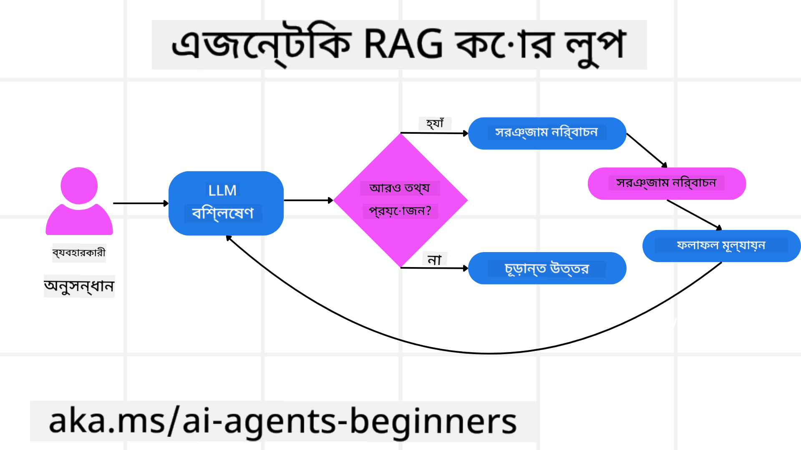
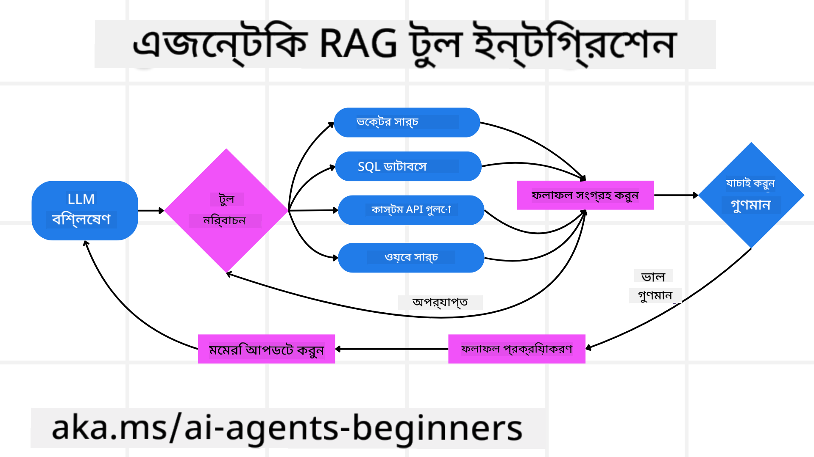
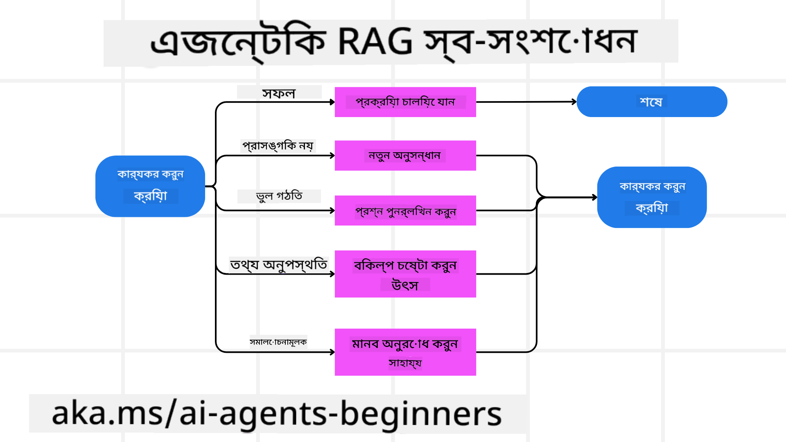
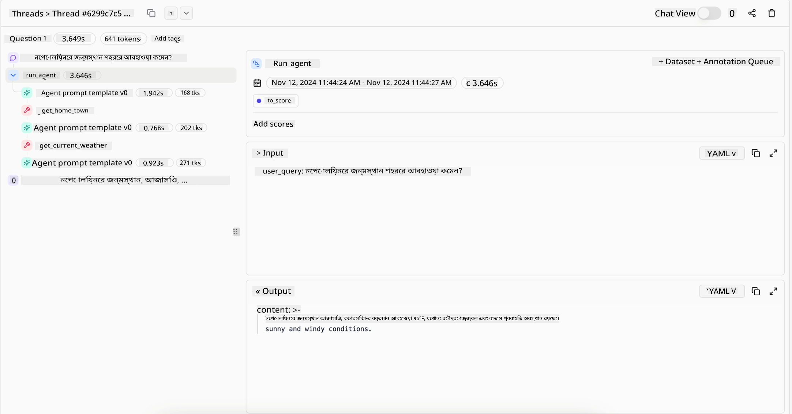
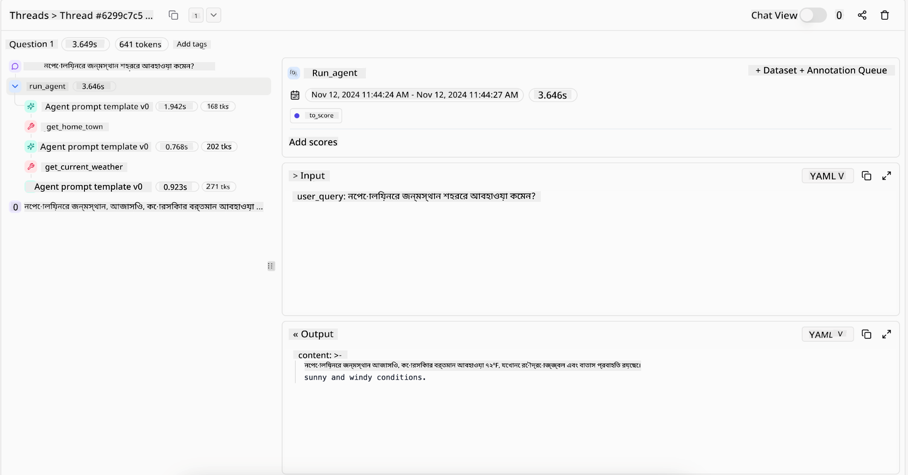

<!--
CO_OP_TRANSLATOR_METADATA:
{
  "original_hash": "7622aa72f9e676e593339f5f694ecd7d",
  "translation_date": "2025-07-12T09:56:46+00:00",
  "source_file": "05-agentic-rag/README.md",
  "language_code": "bn"
}
-->

> _(উপরের ছবিতে ক্লিক করে এই পাঠের ভিডিও দেখুন)_

# Agentic RAG

এই পাঠে Agentic Retrieval-Augmented Generation (Agentic RAG) সম্পর্কে বিস্তৃত ধারণা দেওয়া হয়েছে, যা একটি উদীয়মান AI প্যারাডাইম যেখানে বড় ভাষা মডেলগুলি (LLMs) স্বয়ংক্রিয়ভাবে তাদের পরবর্তী পদক্ষেপ পরিকল্পনা করে এবং বাহ্যিক উৎস থেকে তথ্য সংগ্রহ করে। স্থির retrieval-then-read প্যাটার্নের বিপরীতে, Agentic RAG iterative কলের মাধ্যমে কাজ করে, যেখানে টুল বা ফাংশন কল এবং কাঠামোবদ্ধ আউটপুট অন্তর্ভুক্ত থাকে। সিস্টেম ফলাফল মূল্যায়ন করে, প্রশ্ন পরিমার্জন করে, প্রয়োজনে অতিরিক্ত টুল ব্যবহার করে এবং এই চক্র চালিয়ে যায় যতক্ষণ না সন্তোষজনক সমাধান পাওয়া যায়।

## পরিচিতি

এই পাঠে আলোচনা করা হবে

- **Agentic RAG বোঝা:** AI-র উদীয়মান প্যারাডাইম সম্পর্কে জানুন যেখানে বড় ভাষা মডেলগুলি (LLMs) স্বয়ংক্রিয়ভাবে তাদের পরবর্তী পদক্ষেপ পরিকল্পনা করে এবং বাহ্যিক তথ্য উৎস থেকে তথ্য সংগ্রহ করে।
- **Iterative Maker-Checker স্টাইল বোঝা:** LLM-এ iterative কলের লুপ, টুল বা ফাংশন কল এবং কাঠামোবদ্ধ আউটপুটের মাধ্যমে সঠিকতা উন্নত করার এবং ভুল প্রশ্ন পরিচালনার পদ্ধতি বুঝুন।
- **প্রায়োগিক ব্যবহার ক্ষেত্র অন্বেষণ:** সঠিকতা-প্রথম পরিবেশ, জটিল ডাটাবেস ইন্টারঅ্যাকশন এবং দীর্ঘমেয়াদী ওয়ার্কফ্লো-তে Agentic RAG কোথায় কার্যকর তা চিহ্নিত করুন।

## শেখার লক্ষ্য

এই পাঠ শেষ করার পর, আপনি কীভাবে/কি বুঝবেন:

- **Agentic RAG বোঝা:** AI-র উদীয়মান প্যারাডাইম সম্পর্কে জানুন যেখানে বড় ভাষা মডেলগুলি (LLMs) স্বয়ংক্রিয়ভাবে তাদের পরবর্তী পদক্ষেপ পরিকল্পনা করে এবং বাহ্যিক তথ্য উৎস থেকে তথ্য সংগ্রহ করে।
- **Iterative Maker-Checker স্টাইল:** LLM-এ iterative কলের লুপ, টুল বা ফাংশন কল এবং কাঠামোবদ্ধ আউটপুটের মাধ্যমে সঠিকতা উন্নত করার এবং ভুল প্রশ্ন পরিচালনার পদ্ধতি বুঝুন।
- **যুক্তি প্রক্রিয়ার মালিকানা:** সিস্টেমের যুক্তি প্রক্রিয়া নিজেই পরিচালনা করার ক্ষমতা বুঝুন, যা পূর্বনির্ধারিত পথের উপর নির্ভর না করে সমস্যা সমাধানের পদ্ধতি নির্ধারণ করে।
- **ওয়ার্কফ্লো:** একটি agentic মডেল কীভাবে স্বাধীনভাবে বাজার প্রবণতা রিপোর্ট সংগ্রহ করে, প্রতিযোগী তথ্য সনাক্ত করে, অভ্যন্তরীণ বিক্রয় মেট্রিক্সের সাথে সম্পর্ক স্থাপন করে, ফলাফল সংকলন করে এবং কৌশল মূল্যায়ন করে তা বুঝুন।
- **Iterative লুপ, টুল ইন্টিগ্রেশন এবং মেমোরি:** সিস্টেমের লুপড ইন্টারঅ্যাকশন প্যাটার্ন, ধাপগুলোর মধ্যে অবস্থা ও স্মৃতি বজায় রাখার মাধ্যমে পুনরাবৃত্তি এড়ানো এবং তথ্যভিত্তিক সিদ্ধান্ত নেওয়ার পদ্ধতি জানুন।
- **ব্যর্থতা মোকাবেলা এবং স্ব-সংশোধন:** সিস্টেমের শক্তিশালী স্ব-সংশোধন প্রক্রিয়া, যেমন পুনরাবৃত্তি ও পুনরায় প্রশ্ন করা, ডায়াগনস্টিক টুল ব্যবহার এবং মানব তত্ত্বাবধানে ফিরে যাওয়ার পদ্ধতি অন্বেষণ করুন।
- **এজেন্সির সীমাবদ্ধতা:** Agentic RAG-এর সীমাবদ্ধতা বুঝুন, যা ডোমেইন-নির্দিষ্ট স্বায়ত্তশাসন, অবকাঠামো নির্ভরতা এবং গার্ডরেইল সম্মানকে কেন্দ্র করে।
- **প্রায়োগিক ব্যবহার ক্ষেত্র এবং মূল্য:** সঠিকতা-প্রথম পরিবেশ, জটিল ডাটাবেস ইন্টারঅ্যাকশন এবং দীর্ঘমেয়াদী ওয়ার্কফ্লো-তে Agentic RAG-এর কার্যকারিতা চিহ্নিত করুন।
- **শাসন, স্বচ্ছতা এবং বিশ্বাস:** শাসন ও স্বচ্ছতার গুরুত্ব জানুন, যার মধ্যে রয়েছে ব্যাখ্যাযোগ্য যুক্তি, পক্ষপাত নিয়ন্ত্রণ এবং মানব তত্ত্বাবধান।

## Agentic RAG কী?

Agentic Retrieval-Augmented Generation (Agentic RAG) একটি উদীয়মান AI প্যারাডাইম যেখানে বড় ভাষা মডেলগুলি (LLMs) স্বয়ংক্রিয়ভাবে তাদের পরবর্তী পদক্ষেপ পরিকল্পনা করে এবং বাহ্যিক উৎস থেকে তথ্য সংগ্রহ করে। স্থির retrieval-then-read প্যাটার্নের বিপরীতে, Agentic RAG iterative কলের মাধ্যমে কাজ করে, যেখানে টুল বা ফাংশন কল এবং কাঠামোবদ্ধ আউটপুট অন্তর্ভুক্ত থাকে। সিস্টেম ফলাফল মূল্যায়ন করে, প্রশ্ন পরিমার্জন করে, প্রয়োজনে অতিরিক্ত টুল ব্যবহার করে এবং এই চক্র চালিয়ে যায় যতক্ষণ না সন্তোষজনক সমাধান পাওয়া যায়। এই iterative “maker-checker” পদ্ধতি সঠিকতা উন্নত করে, ভুল প্রশ্ন পরিচালনা করে এবং উচ্চমানের ফলাফল নিশ্চিত করে।

সিস্টেম সক্রিয়ভাবে তার যুক্তি প্রক্রিয়া পরিচালনা করে, ব্যর্থ প্রশ্ন পুনর্লিখন করে, বিভিন্ন retrieval পদ্ধতি বেছে নেয় এবং একাধিক টুল যেমন Azure AI Search-এর ভেক্টর সার্চ, SQL ডাটাবেস, বা কাস্টম API ইন্টিগ্রেট করে উত্তর চূড়ান্ত করার আগে। একটি agentic সিস্টেমের প্রধান বৈশিষ্ট্য হলো তার যুক্তি প্রক্রিয়া নিজেই পরিচালনা করার ক্ষমতা। প্রচলিত RAG বাস্তবায়নগুলি পূর্বনির্ধারিত পথের উপর নির্ভর করে, কিন্তু একটি agentic সিস্টেম তথ্যের গুণগত মানের উপর ভিত্তি করে স্বয়ংক্রিয়ভাবে পদক্ষেপের ক্রম নির্ধারণ করে।

## Agentic Retrieval-Augmented Generation (Agentic RAG) সংজ্ঞায়িতকরণ

Agentic Retrieval-Augmented Generation (Agentic RAG) AI উন্নয়নের একটি উদীয়মান প্যারাডাইম যেখানে LLM গুলো শুধুমাত্র বাহ্যিক তথ্য উৎস থেকে তথ্য সংগ্রহ করে না, বরং স্বয়ংক্রিয়ভাবে তাদের পরবর্তী পদক্ষেপ পরিকল্পনা করে। স্থির retrieval-then-read প্যাটার্ন বা সাবধানে স্ক্রিপ্ট করা প্রম্পট সিকোয়েন্সের পরিবর্তে, Agentic RAG iterative কলের একটি লুপের মাধ্যমে কাজ করে, যেখানে টুল বা ফাংশন কল এবং কাঠামোবদ্ধ আউটপুট অন্তর্ভুক্ত থাকে। প্রতিটি ধাপে সিস্টেম প্রাপ্ত ফলাফল মূল্যায়ন করে, প্রশ্ন পরিমার্জন করার প্রয়োজন আছে কিনা সিদ্ধান্ত নেয়, প্রয়োজনে অতিরিক্ত টুল ব্যবহার করে এবং এই চক্র চালিয়ে যায় যতক্ষণ না সন্তোষজনক সমাধান পাওয়া যায়।

এই iterative “maker-checker” পদ্ধতি সঠিকতা উন্নত করার জন্য ডিজাইন করা হয়েছে, ভুল প্রশ্ন পরিচালনা করে (যেমন NL2SQL), এবং সুষম, উচ্চমানের ফলাফল নিশ্চিত করে। শুধুমাত্র সাবধানে ডিজাইন করা প্রম্পট চেইনের উপর নির্ভর না করে, সিস্টেম সক্রিয়ভাবে তার যুক্তি প্রক্রিয়া পরিচালনা করে। এটি ব্যর্থ প্রশ্ন পুনর্লিখন করতে পারে, বিভিন্ন retrieval পদ্ধতি বেছে নিতে পারে, এবং একাধিক টুল যেমন Azure AI Search-এর ভেক্টর সার্চ, SQL ডাটাবেস, বা কাস্টম API ইন্টিগ্রেট করতে পারে উত্তর চূড়ান্ত করার আগে। এর ফলে অতিরিক্ত জটিল অর্কেস্ট্রেশন ফ্রেমওয়ার্কের প্রয়োজন হয় না। বরং, একটি তুলনামূলক সহজ লুপ “LLM কল → টুল ব্যবহার → LLM কল → …” জটিল এবং ভিত্তিপ্রাপ্ত আউটপুট দিতে পারে।

## যুক্তি প্রক্রিয়ার মালিকানা

একটি সিস্টেমকে “agentic” করে তোলার মূল বৈশিষ্ট্য হলো তার যুক্তি প্রক্রিয়া নিজেই পরিচালনা করার ক্ষমতা। প্রচলিত RAG বাস্তবায়নগুলো প্রায়ই মানুষের দ্বারা পূর্বনির্ধারিত একটি পথের উপর নির্ভর করে: একটি chain-of-thought যা নির্ধারণ করে কী কখন সংগ্রহ করতে হবে।  
কিন্তু যখন একটি সিস্টেম সত্যিই agentic হয়, তখন এটি অভ্যন্তরীণভাবে সিদ্ধান্ত নেয় কীভাবে সমস্যার সমাধান করতে হবে। এটি শুধু একটি স্ক্রিপ্ট চালায় না; এটি তথ্যের গুণগত মানের উপর ভিত্তি করে পদক্ষেপের ক্রম স্বয়ংক্রিয়ভাবে নির্ধারণ করে।  
উদাহরণস্বরূপ, যদি এটি একটি পণ্য লঞ্চ কৌশল তৈরি করতে বলা হয়, তাহলে এটি শুধুমাত্র একটি প্রম্পটের উপর নির্ভর করে না যা পুরো গবেষণা ও সিদ্ধান্ত গ্রহণের ওয়ার্কফ্লো স্পষ্ট করে। বরং, agentic মডেল স্বাধীনভাবে সিদ্ধান্ত নেয়:

1. Bing Web Grounding ব্যবহার করে বর্তমান বাজার প্রবণতা রিপোর্ট সংগ্রহ করা  
2. Azure AI Search ব্যবহার করে প্রাসঙ্গিক প্রতিযোগী তথ্য সনাক্ত করা  
3. Azure SQL Database ব্যবহার করে ঐতিহাসিক অভ্যন্তরীণ বিক্রয় মেট্রিক্সের সাথে সম্পর্ক স্থাপন করা  
4. Azure OpenAI Service-এর মাধ্যমে ফলাফলগুলোকে একটি সমন্বিত কৌশলে রূপান্তর করা  
5. কৌশলটির ফাঁক বা অসঙ্গতি মূল্যায়ন করা, প্রয়োজনে আরেক দফা তথ্য সংগ্রহের জন্য অনুরোধ করা  

এই সমস্ত ধাপ—প্রশ্ন পরিমার্জন, উৎস নির্বাচন, উত্তর “সন্তোষজনক” না হওয়া পর্যন্ত পুনরাবৃত্তি—মডেল নিজেই নির্ধারণ করে, মানুষের দ্বারা পূর্বনির্ধারিত নয়।

## Iterative লুপ, টুল ইন্টিগ্রেশন এবং মেমোরি

একটি agentic সিস্টেম লুপড ইন্টারঅ্যাকশন প্যাটার্নের উপর নির্ভর করে:

- **প্রাথমিক কল:** ব্যবহারকারীর লক্ষ্য (অর্থাৎ ব্যবহারকারীর প্রম্পট) LLM-এ উপস্থাপন করা হয়।  
- **টুল আহ্বান:** যদি মডেল তথ্যের অভাব বা অস্পষ্ট নির্দেশনা সনাক্ত করে, তাহলে এটি একটি টুল বা retrieval পদ্ধতি নির্বাচন করে—যেমন ভেক্টর ডাটাবেস কোয়েরি (যেমন Azure AI Search Hybrid search প্রাইভেট ডেটার উপর) বা কাঠামোবদ্ধ SQL কল—অতিরিক্ত প্রেক্ষাপট সংগ্রহের জন্য।  
- **মূল্যায়ন ও পরিমার্জন:** প্রাপ্ত তথ্য পর্যালোচনা করে মডেল সিদ্ধান্ত নেয় তথ্য যথেষ্ট কিনা। যদি না হয়, তাহলে এটি প্রশ্ন পরিমার্জন করে, অন্য টুল চেষ্টা করে, বা পদ্ধতি পরিবর্তন করে।  
- **সন্তোষজনক না হওয়া পর্যন্ত পুনরাবৃত্তি:** এই চক্র চলতে থাকে যতক্ষণ না মডেল পর্যাপ্ত স্পষ্টতা ও প্রমাণ পেয়ে একটি চূড়ান্ত, যুক্তিযুক্ত উত্তর দিতে সক্ষম হয়।  
- **মেমোরি ও অবস্থা:** সিস্টেম ধাপগুলোর মধ্যে অবস্থা ও স্মৃতি বজায় রাখে, পূর্বের প্রচেষ্টা ও ফলাফল মনে রাখে, পুনরাবৃত্তি এড়ায় এবং আরও তথ্যভিত্তিক সিদ্ধান্ত নেয়।

সময়ের সাথে সাথে এটি একটি বিকাশমান বোঝাপড়ার অনুভূতি তৈরি করে, যা মডেলকে জটিল, বহু-ধাপের কাজগুলো পরিচালনা করতে সক্ষম করে, যেখানে মানুষের নিয়মিত হস্তক্ষেপ বা প্রম্পট পুনর্গঠন প্রয়োজন হয় না।

## ব্যর্থতা মোকাবেলা এবং স্ব-সংশোধন

Agentic RAG-এর স্বায়ত্তশাসন শক্তিশালী স্ব-সংশোধন প্রক্রিয়াও অন্তর্ভুক্ত করে। যখন সিস্টেম অপ্রাসঙ্গিক ডকুমেন্ট সংগ্রহ করে বা ভুল প্রশ্নের সম্মুখীন হয়, তখন এটি করতে পারে:

- **পুনরাবৃত্তি ও পুনরায় প্রশ্ন করা:** কম মানের উত্তর দেওয়ার পরিবর্তে, মডেল নতুন অনুসন্ধান কৌশল চেষ্টা করে, ডাটাবেস প্রশ্ন পুনর্লিখন করে, বা বিকল্প ডেটাসেট পরীক্ষা করে।  
- **ডায়াগনস্টিক টুল ব্যবহার:** সিস্টেম অতিরিক্ত ফাংশন আহ্বান করতে পারে যা যুক্তি ধাপগুলো ডিবাগ করতে বা প্রাপ্ত তথ্যের সঠিকতা নিশ্চিত করতে সাহায্য করে। Azure AI Tracing-এর মতো টুলগুলো দৃঢ় পর্যবেক্ষণ ও মনিটরিং সক্ষম করবে।  
- **মানব তত্ত্বাবধানে ফিরে যাওয়া:** উচ্চ-ঝুঁকিপূর্ণ বা বারবার ব্যর্থ হওয়া পরিস্থিতিতে, মডেল অনিশ্চয়তা চিহ্নিত করে মানব নির্দেশনা চায়। মানব সংশোধনমূলক প্রতিক্রিয়া প্রদান করলে, মডেল সেই শিক্ষা ভবিষ্যতে অন্তর্ভুক্ত করতে পারে।

এই iterative ও গতিশীল পদ্ধতি মডেলকে ক্রমাগত উন্নতি করতে দেয়, নিশ্চিত করে যে এটি শুধুমাত্র একবারের জন্য নয়, বরং একটি সেশন চলাকালীন তার ভুল থেকে শেখে।

## এজেন্সির সীমাবদ্ধতা

একটি কাজের মধ্যে স্বায়ত্তশাসন থাকা সত্ত্বেও, Agentic RAG কৃত্রিম সাধারণ বুদ্ধিমত্তার (AGI) সমতুল্য নয়। এর “agentic” ক্ষমতাগুলো সীমাবদ্ধ থাকে মানুষের দ্বারা প্রদত্ত টুল, ডেটা উৎস এবং নীতিমালার মধ্যে। এটি নিজস্ব টুল আবিষ্কার করতে পারে না বা নির্ধারিত ডোমেইন সীমানার বাইরে যেতে পারে না। বরং, এটি হাতে থাকা সম্পদগুলো গতিশীলভাবে পরিচালনায় দক্ষ।  
অগ্রসর AI ফর্মগুলোর থেকে মূল পার্থক্যগুলো হলো:

1. **ডোমেইন-নির্দিষ্ট স্বায়ত্তশাসন:** Agentic RAG সিস্টেমগুলো পরিচিত ডোমেইনের মধ্যে ব্যবহারকারীর নির্ধারিত লক্ষ্য অর্জনে মনোনিবেশ করে, যেমন প্রশ্ন পুনর্লিখন বা টুল নির্বাচন কৌশল ব্যবহার করে ফলাফল উন্নত করা।  
2. **অবকাঠামো নির্ভর:** সিস্টেমের ক্ষমতা নির্ভর করে ডেভেলপারদের দ্বারা ইন্টিগ্রেট করা টুল ও ডেটার উপর। এটি মানুষের হস্তক্ষেপ ছাড়া এই সীমানা অতিক্রম করতে পারে না।  
3. **গার্ডরেইল সম্মান:** নৈতিক নির্দেশিকা, সম্মতি নিয়ম এবং ব্যবসায়িক নীতি খুবই গুরুত্বপূর্ণ। এজেন্টের স্বাধীনতা সবসময় নিরাপত্তা ব্যবস্থা ও তত্ত্বাবধান প্রক্রিয়ার দ্বারা সীমাবদ্ধ থাকে (আশাকরি)।

## প্রায়োগিক ব্যবহার ক্ষেত্র এবং মূল্য

Agentic RAG iterative পরিমার্জন এবং নির্ভুলতা প্রয়োজন এমন পরিস্থিতিতে বিশেষভাবে কার্যকর:

1. **সঠিকতা-প্রথম পরিবেশ:** সম্মতি যাচাই, নিয়ন্ত্রক বিশ্লেষণ বা আইনি গবেষণায়, agentic মডেল বারবার তথ্য যাচাই করতে পারে, একাধিক উৎস পরামর্শ করতে পারে এবং প্রশ্ন পুনর্লিখন করতে পারে যতক্ষণ না একটি সম্পূর্ণ যাচাই করা উত্তর তৈরি হয়।  
2. **জটিল ডাটাবেস ইন্টারঅ্যাকশন:** কাঠামোবদ্ধ ডেটার ক্ষেত্রে যেখানে প্রশ্ন প্রায়ই ব্যর্থ হতে পারে বা সমন্বয় প্রয়োজন, সিস্টেম স্বয়ংক্রিয়ভাবে Azure SQL বা Microsoft Fabric OneLake ব্যবহার করে প্রশ্ন পরিমার্জন করতে পারে, নিশ্চিত করে চূড়ান্ত তথ্য সংগ্রহ ব্যবহারকারীর উদ্দেশ্যের সাথে সঙ্গতিপূর্ণ।  
3. **দীর্ঘমেয়াদী ওয়ার্কফ্লো:** দীর্ঘ সেশনগুলো নতুন তথ্য পাওয়ার সাথে সাথে বিকশিত হতে পারে। Agentic RAG ক্রমাগত নতুন তথ্য অন্তর্ভুক্ত করতে পারে, কৌশল পরিবর্তন করতে পারে এবং সমস্যা ক্ষেত্র সম্পর্কে আরও শিখতে পারে।

## শাসন, স্বচ্ছতা এবং বিশ্বাস

যেহেতু এই সিস্টেমগুলো তাদের যুক্তি প্রক্রিয়ায় আরও স্বায়ত্তশাসিত হচ্ছে, শাসন ও স্বচ্ছতা অপরিহার্য:

- **ব্যাখ্যাযোগ্য যুক্তি:** মডেল তার করা প্রশ্ন, পরামর্শকৃত উৎস এবং সিদ্ধান্ত গ্রহণের ধাপগুলোর একটি অডিট ট্রেইল প্রদান করতে পারে। Azure AI Content Safety এবং Azure AI Tracing / GenAIOps-এর মতো টুলগুলো স্বচ্ছতা বজায় রাখতে এবং ঝুঁকি কমাতে সাহায্য করবে।  
- **পক্ষপাত নিয়ন্ত্রণ এবং সুষম retrieval:** ডেভেলপাররা retrieval কৌশলগুলো টিউন করতে পারে যাতে সুষম, প্রতিনিধিত্বমূলক ডেটা উৎস বিবেচিত হয়, এবং নিয়মিত আউটপুট অডিট করে পক্ষপাত বা বিকৃত প্যাটার্ন শনাক্ত করতে পারে, বিশেষ করে Azure Machine Learning ব্যবহার করে উন্নত ডেটা সায়েন্স সংস্থাগুলোর জন্য কাস্টম মডেল ব্যবহার করে।  
- **মানব তত্ত্বাবধান এবং সম্মতি:** সংবেদনশীল কাজের জন্য মানব পর্যালোচনা অপরিহার্য। Agentic RAG উচ্চ-ঝুঁকিপূর্ণ সিদ্ধান্তে মানব বিচার প্রতিস্থাপন করে না—বরং আরও যাচাই করা বিকল্প সরবরাহ করে তা বাড়িয়ে তোলে।

কার্যকলাপের স্পষ্ট রেকর্ড প্রদানকারী টুল থাকা অপরিহার্য। এগুলো ছাড়া, বহু-ধাপের প্রক্রিয়া ডিবাগ করা খুব কঠিন হতে পারে। নিচের উদাহরণটি Literal AI (Chainlit-এর পেছনের কোম্পানি) থেকে একটি Agent রান দেখায়:

## উপসংহার

Agentic RAG AI সিস্টেমগুলোকে জটিল, তথ্য-নির্ভর কাজ
</a>
- <a href="https://learn.microsoft.com/azure/ai-studio/concepts/evaluation-approach-gen-ai" target="_blank">Azure AI Foundry-এর মাধ্যমে জেনারেটিভ AI অ্যাপ্লিকেশনগুলোর মূল্যায়ন: এই নিবন্ধে পাবলিকলি উপলব্ধ ডেটাসেটের উপর মডেলগুলোর মূল্যায়ন এবং তুলনা আলোচনা করা হয়েছে, যার মধ্যে রয়েছে Agentic AI অ্যাপ্লিকেশন এবং RAG আর্কিটেকচার</a>
- <a href="https://weaviate.io/blog/what-is-agentic-rag" target="_blank">Agentic RAG কী | Weaviate</a>
- <a href="https://ragaboutit.com/agentic-rag-a-complete-guide-to-agent-based-retrieval-augmented-generation/" target="_blank">Agentic RAG: এজেন্ট-ভিত্তিক রিট্রিভাল অগমেন্টেড জেনারেশনের সম্পূর্ণ গাইড – Generation RAG থেকে খবর</a>
- <a href="https://huggingface.co/learn/cookbook/agent_rag" target="_blank">Agentic RAG: কুয়েরি রিফর্মুলেশন এবং সেলফ-কুয়েরির মাধ্যমে আপনার RAG কে টার্বোচার্জ করুন! Hugging Face ওপেন-সোর্স AI কুকবুক</a>
- <a href="https://youtu.be/aQ4yQXeB1Ss?si=2HUqBzHoeB5tR04U" target="_blank">RAG-এ Agentic লেয়ার যোগ করা</a>
- <a href="https://www.youtube.com/watch?v=zeAyuLc_f3Q&t=244s" target="_blank">জ্ঞান সহায়কদের ভবিষ্যত: জেরি লিউ</a>
- <a href="https://www.youtube.com/watch?v=AOSjiXP1jmQ" target="_blank">কিভাবে Agentic RAG সিস্টেম তৈরি করবেন</a>
- <a href="https://ignite.microsoft.com/sessions/BRK102?source=sessions" target="_blank">Azure AI Foundry Agent Service ব্যবহার করে আপনার AI এজেন্টগুলোকে স্কেল করা</a>

### একাডেমিক পেপারসমূহ

- <a href="https://arxiv.org/abs/2303.17651" target="_blank">2303.17651 Self-Refine: সেলফ-ফিডব্যাকের মাধ্যমে পুনরাবৃত্তিমূলক পরিমার্জনা</a>
- <a href="https://arxiv.org/abs/2303.11366" target="_blank">2303.11366 Reflexion: মৌখিক রিইনফোর্সমেন্ট লার্নিং সহ ভাষা এজেন্ট</a>
- <a href="https://arxiv.org/abs/2305.11738" target="_blank">2305.11738 CRITIC: টুল-ইন্টারঅ্যাকটিভ ক্রিটিকিংয়ের মাধ্যমে বড় ভাষা মডেলগুলো নিজেই সংশোধন করতে পারে</a>
- <a href="https://arxiv.org/abs/2501.09136" target="_blank">2501.09136 Agentic Retrieval-Augmented Generation: Agentic RAG নিয়ে একটি সমীক্ষা</a>

## পূর্ববর্তী পাঠ

[Tool Use Design Pattern](../04-tool-use/README.md)

## পরবর্তী পাঠ

[Building Trustworthy AI Agents](../06-building-trustworthy-agents/README.md)

**অস্বীকৃতি**:  
এই নথিটি AI অনুবাদ সেবা [Co-op Translator](https://github.com/Azure/co-op-translator) ব্যবহার করে অনূদিত হয়েছে। আমরা যথাসাধ্য সঠিকতার চেষ্টা করি, তবে স্বয়ংক্রিয় অনুবাদে ত্রুটি বা অসঙ্গতি থাকতে পারে। মূল নথিটি তার নিজস্ব ভাষায়ই কর্তৃত্বপূর্ণ উৎস হিসেবে বিবেচিত হওয়া উচিত। গুরুত্বপূর্ণ তথ্যের জন্য পেশাদার মানব অনুবাদ গ্রহণ করার পরামর্শ দেওয়া হয়। এই অনুবাদের ব্যবহারে সৃষ্ট কোনো ভুল বোঝাবুঝি বা ভুল ব্যাখ্যার জন্য আমরা দায়ী নই।