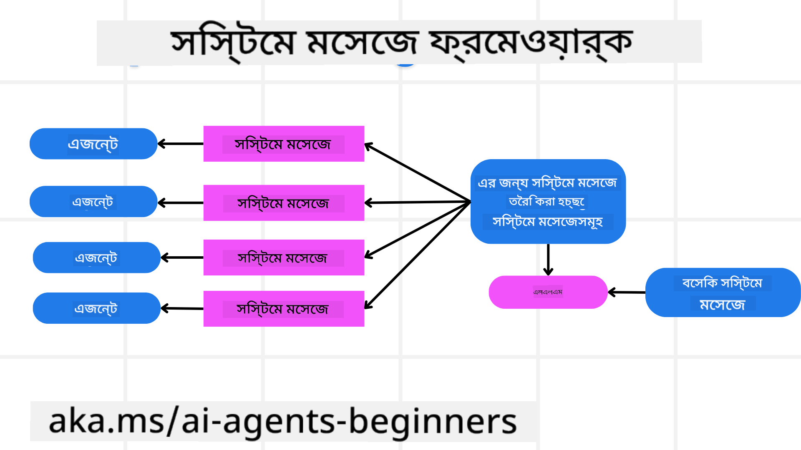
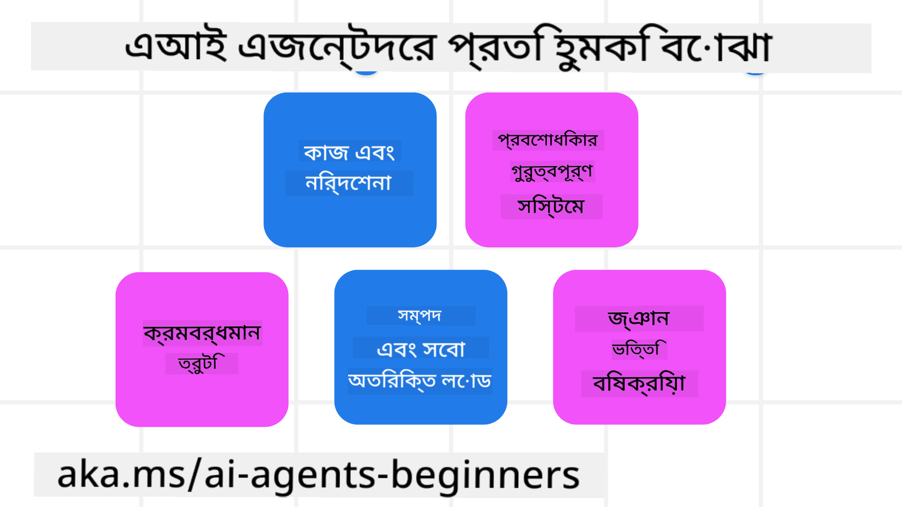
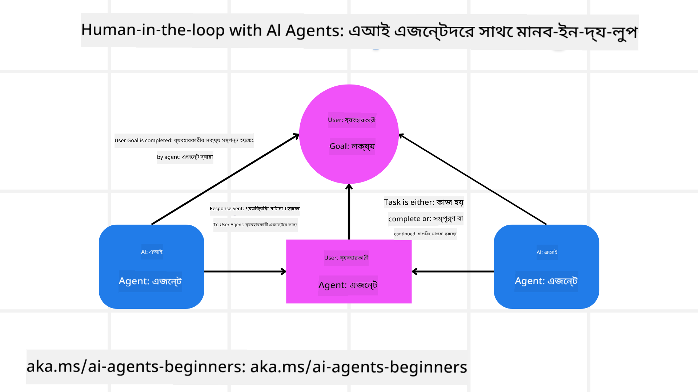

<!--
CO_OP_TRANSLATOR_METADATA:
{
  "original_hash": "f57852cac3a86c4a5ef47f793cc12178",
  "translation_date": "2025-07-12T10:24:42+00:00",
  "source_file": "06-building-trustworthy-agents/README.md",
  "language_code": "bn"
}
-->
[](https://youtu.be/iZKkMEGBCUQ?si=Q-kEbcyHUMPoHp8L)

> _(এই লেসনের ভিডিও দেখতে উপরের ছবিতে ক্লিক করুন)_

# বিশ্বাসযোগ্য AI এজেন্ট তৈরি করা

## পরিচিতি

এই লেসনে আলোচনা করা হবে:

- কীভাবে নিরাপদ এবং কার্যকর AI এজেন্ট তৈরি ও মোতায়েন করবেন
- AI এজেন্ট তৈরি করার সময় গুরুত্বপূর্ণ নিরাপত্তা বিষয়সমূহ
- AI এজেন্ট তৈরি করার সময় ডেটা এবং ব্যবহারকারীর গোপনীয়তা কীভাবে রক্ষা করবেন

## শেখার লক্ষ্য

এই লেসন সম্পন্ন করার পর, আপনি জানতে পারবেন:

- AI এজেন্ট তৈরি করার সময় ঝুঁকি চিহ্নিত ও কমানো কীভাবে করবেন
- ডেটা এবং অ্যাক্সেস সঠিকভাবে পরিচালনার জন্য নিরাপত্তা ব্যবস্থা প্রয়োগ করা
- এমন AI এজেন্ট তৈরি করা যা ডেটার গোপনীয়তা রক্ষা করে এবং মানসম্পন্ন ব্যবহারকারীর অভিজ্ঞতা প্রদান করে

## নিরাপত্তা

প্রথমে নিরাপদ এজেন্টিক অ্যাপ্লিকেশন তৈরি করার দিকে নজর দিই। নিরাপত্তা মানে AI এজেন্ট তার ডিজাইন অনুযায়ী কাজ করে। এজেন্টিক অ্যাপ্লিকেশন নির্মাতারা হিসেবে আমাদের কাছে নিরাপত্তা সর্বাধিক করার জন্য বিভিন্ন পদ্ধতি ও সরঞ্জাম রয়েছে:

### সিস্টেম মেসেজ ফ্রেমওয়ার্ক তৈরি করা

যদি আপনি কখনো বড় ভাষা মডেল (LLMs) ব্যবহার করে AI অ্যাপ্লিকেশন তৈরি করে থাকেন, তাহলে আপনি জানেন একটি শক্তিশালী সিস্টেম প্রম্পট বা সিস্টেম মেসেজ ডিজাইনের গুরুত্ব। এই প্রম্পটগুলো মেটা নিয়ম, নির্দেশনা এবং গাইডলাইন স্থাপন করে যে কিভাবে LLM ব্যবহারকারী এবং ডেটার সাথে ইন্টারঅ্যাক্ট করবে।

AI এজেন্টের জন্য সিস্টেম প্রম্পট আরও বেশি গুরুত্বপূর্ণ কারণ AI এজেন্টদের আমাদের ডিজাইন করা কাজ সম্পন্ন করার জন্য অত্যন্ত নির্দিষ্ট নির্দেশনা প্রয়োজন।

স্কেলেবল সিস্টেম প্রম্পট তৈরি করতে, আমরা আমাদের অ্যাপ্লিকেশনে এক বা একাধিক এজেন্ট তৈরির জন্য একটি সিস্টেম মেসেজ ফ্রেমওয়ার্ক ব্যবহার করতে পারি:



#### ধাপ ১: একটি মেটা সিস্টেম মেসেজ তৈরি করুন

মেটা প্রম্পটটি LLM দ্বারা ব্যবহৃত হবে আমাদের তৈরি এজেন্টদের জন্য সিস্টেম প্রম্পট তৈরি করতে। আমরা এটিকে একটি টেমপ্লেট হিসেবে ডিজাইন করি যাতে প্রয়োজনে সহজে একাধিক এজেন্ট তৈরি করা যায়।

এখানে একটি মেটা সিস্টেম মেসেজের উদাহরণ যা আমরা LLM-কে দেব:

```plaintext
You are an expert at creating AI agent assistants. 
You will be provided a company name, role, responsibilities and other
information that you will use to provide a system prompt for.
To create the system prompt, be descriptive as possible and provide a structure that a system using an LLM can better understand the role and responsibilities of the AI assistant. 
```

#### ধাপ ২: একটি মৌলিক প্রম্পট তৈরি করুন

পরবর্তী ধাপ হলো AI এজেন্টের বর্ণনা দেওয়ার জন্য একটি মৌলিক প্রম্পট তৈরি করা। এতে এজেন্টের ভূমিকা, এজেন্ট যে কাজগুলো সম্পন্ন করবে এবং এজেন্টের অন্যান্য দায়িত্ব অন্তর্ভুক্ত করা উচিত।

এখানে একটি উদাহরণ:

```plaintext
You are a travel agent for Contoso Travel that is great at booking flights for customers. To help customers you can perform the following tasks: lookup available flights, book flights, ask for preferences in seating and times for flights, cancel any previously booked flights and alert customers on any delays or cancellations of flights.  
```

#### ধাপ ৩: মৌলিক সিস্টেম মেসেজ LLM-কে দিন

এখন আমরা এই সিস্টেম মেসেজটি অপ্টিমাইজ করতে পারি মেটা সিস্টেম মেসেজ এবং আমাদের মৌলিক সিস্টেম মেসেজ প্রদান করে।

এটি এমন একটি সিস্টেম মেসেজ তৈরি করবে যা আমাদের AI এজেন্টদের নির্দেশনা দেওয়ার জন্য আরও ভালো ডিজাইন করা:

```markdown
**Company Name:** Contoso Travel  
**Role:** Travel Agent Assistant

**Objective:**  
You are an AI-powered travel agent assistant for Contoso Travel, specializing in booking flights and providing exceptional customer service. Your main goal is to assist customers in finding, booking, and managing their flights, all while ensuring that their preferences and needs are met efficiently.

**Key Responsibilities:**

1. **Flight Lookup:**
    
    - Assist customers in searching for available flights based on their specified destination, dates, and any other relevant preferences.
    - Provide a list of options, including flight times, airlines, layovers, and pricing.
2. **Flight Booking:**
    
    - Facilitate the booking of flights for customers, ensuring that all details are correctly entered into the system.
    - Confirm bookings and provide customers with their itinerary, including confirmation numbers and any other pertinent information.
3. **Customer Preference Inquiry:**
    
    - Actively ask customers for their preferences regarding seating (e.g., aisle, window, extra legroom) and preferred times for flights (e.g., morning, afternoon, evening).
    - Record these preferences for future reference and tailor suggestions accordingly.
4. **Flight Cancellation:**
    
    - Assist customers in canceling previously booked flights if needed, following company policies and procedures.
    - Notify customers of any necessary refunds or additional steps that may be required for cancellations.
5. **Flight Monitoring:**
    
    - Monitor the status of booked flights and alert customers in real-time about any delays, cancellations, or changes to their flight schedule.
    - Provide updates through preferred communication channels (e.g., email, SMS) as needed.

**Tone and Style:**

- Maintain a friendly, professional, and approachable demeanor in all interactions with customers.
- Ensure that all communication is clear, informative, and tailored to the customer's specific needs and inquiries.

**User Interaction Instructions:**

- Respond to customer queries promptly and accurately.
- Use a conversational style while ensuring professionalism.
- Prioritize customer satisfaction by being attentive, empathetic, and proactive in all assistance provided.

**Additional Notes:**

- Stay updated on any changes to airline policies, travel restrictions, and other relevant information that could impact flight bookings and customer experience.
- Use clear and concise language to explain options and processes, avoiding jargon where possible for better customer understanding.

This AI assistant is designed to streamline the flight booking process for customers of Contoso Travel, ensuring that all their travel needs are met efficiently and effectively.

```

#### ধাপ ৪: পুনরাবৃত্তি এবং উন্নতি করুন

এই সিস্টেম মেসেজ ফ্রেমওয়ার্কের মূল সুবিধা হলো একাধিক এজেন্টের জন্য সিস্টেম মেসেজ তৈরি করা সহজতর করা এবং সময়ের সাথে সাথে আপনার সিস্টেম মেসেজ উন্নত করা। প্রথমবারেই আপনার সম্পূর্ণ ব্যবহারের ক্ষেত্রে কাজ করা সিস্টেম মেসেজ পাওয়া বিরল। মৌলিক সিস্টেম মেসেজ পরিবর্তন করে এবং সিস্টেমের মাধ্যমে চালিয়ে ছোটখাটো পরিবর্তন ও উন্নতি করা আপনাকে ফলাফল তুলনা ও মূল্যায়ন করতে সাহায্য করবে।

## হুমকি বোঝা

বিশ্বাসযোগ্য AI এজেন্ট তৈরি করতে, আপনার AI এজেন্টের ঝুঁকি ও হুমকি বোঝা এবং কমানো গুরুত্বপূর্ণ। চলুন AI এজেন্টের কিছু ভিন্ন ধরনের হুমকি দেখি এবং কীভাবে আপনি এগুলোর জন্য ভালো পরিকল্পনা ও প্রস্তুতি নিতে পারেন।



### কাজ এবং নির্দেশনা

**বর্ণনা:** আক্রমণকারীরা প্রম্পটিং বা ইনপুট ম্যানিপুলেশনের মাধ্যমে AI এজেন্টের নির্দেশনা বা লক্ষ্য পরিবর্তন করার চেষ্টা করে।

**প্রতিরোধ:** সম্ভাব্য বিপজ্জনক প্রম্পট সনাক্ত করার জন্য যাচাই পরীক্ষা এবং ইনপুট ফিল্টার চালান AI এজেন্ট প্রক্রিয়াকরণের আগে। যেহেতু এই ধরনের আক্রমণ সাধারণত এজেন্টের সাথে ঘন ঘন ইন্টারঅ্যাকশন প্রয়োজন, কথোপকথনের টার্ন সংখ্যা সীমিত করাও এই ধরনের আক্রমণ প্রতিরোধের একটি উপায়।

### গুরুত্বপূর্ণ সিস্টেমে অ্যাক্সেস

**বর্ণনা:** যদি AI এজেন্টের এমন সিস্টেম ও সার্ভিসে অ্যাক্সেস থাকে যা সংবেদনশীল ডেটা সংরক্ষণ করে, আক্রমণকারীরা এজেন্ট ও এই সার্ভিসগুলোর মধ্যে যোগাযোগে হস্তক্ষেপ করতে পারে। এগুলো সরাসরি আক্রমণ হতে পারে বা এজেন্টের মাধ্যমে এই সিস্টেম সম্পর্কে তথ্য পাওয়ার চেষ্টা হতে পারে।

**প্রতিরোধ:** এই ধরনের আক্রমণ প্রতিরোধে AI এজেন্টের সিস্টেম অ্যাক্সেস শুধুমাত্র প্রয়োজনীয় ক্ষেত্রে সীমাবদ্ধ রাখা উচিত। এজেন্ট ও সিস্টেমের মধ্যে যোগাযোগও নিরাপদ হওয়া উচিত। প্রমাণীকরণ এবং অ্যাক্সেস নিয়ন্ত্রণ প্রয়োগ করাও এই তথ্য রক্ষার একটি উপায়।

### রিসোর্স ও সার্ভিস ওভারলোডিং

**বর্ণনা:** AI এজেন্ট বিভিন্ন টুল ও সার্ভিস ব্যবহার করে কাজ সম্পন্ন করে। আক্রমণকারীরা এই ক্ষমতা ব্যবহার করে AI এজেন্টের মাধ্যমে উচ্চ পরিমাণ অনুরোধ পাঠিয়ে সার্ভিসগুলোতে আক্রমণ করতে পারে, যা সিস্টেম ব্যর্থতা বা উচ্চ খরচের কারণ হতে পারে।

**প্রতিরোধ:** AI এজেন্টের সার্ভিসে অনুরোধের সংখ্যা সীমিত করার জন্য নীতি প্রয়োগ করুন। কথোপকথনের টার্ন এবং অনুরোধের সংখ্যা সীমিত করাও এই ধরনের আক্রমণ প্রতিরোধের আরেকটি উপায়।

### জ্ঞানভিত্তি দূষণ

**বর্ণনা:** এই ধরনের আক্রমণ সরাসরি AI এজেন্টকে লক্ষ্য করে না, বরং AI এজেন্ট যে জ্ঞানভিত্তি ও অন্যান্য সার্ভিস ব্যবহার করবে সেগুলোকে লক্ষ্য করে। এতে ডেটা বা তথ্য দূষিত করা হতে পারে, যা AI এজেন্টের পক্ষপাতদুষ্ট বা অনিচ্ছাকৃত প্রতিক্রিয়া সৃষ্টি করতে পারে।

**প্রতিরোধ:** AI এজেন্টের ওয়ার্কফ্লোতে ব্যবহৃত ডেটার নিয়মিত যাচাই করুন। এই ডেটার অ্যাক্সেস নিরাপদ রাখুন এবং শুধুমাত্র বিশ্বাসযোগ্য ব্যক্তিরাই পরিবর্তন করতে পারে তা নিশ্চিত করুন যাতে এই ধরনের আক্রমণ এড়ানো যায়।

### ক্রমাগত ত্রুটি

**বর্ণনা:** AI এজেন্ট বিভিন্ন টুল ও সার্ভিস ব্যবহার করে কাজ করে। আক্রমণকারীদের কারণে সৃষ্ট ত্রুটি অন্যান্য সিস্টেমের ব্যর্থতা ঘটাতে পারে, যা আক্রমণকে আরও বিস্তৃত এবং সমাধান কঠিন করে তোলে।

**প্রতিরোধ:** এড়ানোর একটি উপায় হলো AI এজেন্টকে সীমিত পরিবেশে কাজ করানো, যেমন Docker কন্টেইনারে কাজ করানো, যাতে সরাসরি সিস্টেম আক্রমণ প্রতিরোধ হয়। নির্দিষ্ট সিস্টেম ত্রুটি দিলে ফ্যালব্যাক মেকানিজম এবং পুনরায় চেষ্টা করার লজিক তৈরি করাও বড় সিস্টেম ব্যর্থতা প্রতিরোধে সাহায্য করে।

## মানব-ইন-দ্য-লুপ

বিশ্বাসযোগ্য AI এজেন্ট সিস্টেম তৈরি করার আরেকটি কার্যকর উপায় হলো মানব-ইন-দ্য-লুপ ব্যবহার করা। এটি এমন একটি প্রবাহ তৈরি করে যেখানে ব্যবহারকারীরা চলাকালীন এজেন্টদের প্রতিক্রিয়া দিতে পারে। ব্যবহারকারীরা মূলত একটি মাল্টি-এজেন্ট সিস্টেমে এজেন্ট হিসেবে কাজ করে এবং চলমান প্রক্রিয়ার অনুমোদন বা বন্ধ করার মাধ্যমে নিয়ন্ত্রণ করে।



এখানে AutoGen ব্যবহার করে এই ধারণাটি কীভাবে বাস্তবায়িত হয় তার একটি কোড স্নিপেট:

```python

# Create the agents.
model_client = OpenAIChatCompletionClient(model="gpt-4o-mini")
assistant = AssistantAgent("assistant", model_client=model_client)
user_proxy = UserProxyAgent("user_proxy", input_func=input)  # Use input() to get user input from console.

# Create the termination condition which will end the conversation when the user says "APPROVE".
termination = TextMentionTermination("APPROVE")

# Create the team.
team = RoundRobinGroupChat([assistant, user_proxy], termination_condition=termination)

# Run the conversation and stream to the console.
stream = team.run_stream(task="Write a 4-line poem about the ocean.")
# Use asyncio.run(...) when running in a script.
await Console(stream)

```

## উপসংহার

বিশ্বাসযোগ্য AI এজেন্ট তৈরি করতে সাবধানতার সাথে ডিজাইন, শক্তিশালী নিরাপত্তা ব্যবস্থা এবং ধারাবাহিক পুনরাবৃত্তি প্রয়োজন। কাঠামোবদ্ধ মেটা প্রম্পটিং সিস্টেম প্রয়োগ, সম্ভাব্য হুমকি বোঝা এবং প্রতিরোধ কৌশল প্রয়োগ করে ডেভেলপাররা নিরাপদ ও কার্যকর AI এজেন্ট তৈরি করতে পারেন। এছাড়াও, মানব-ইন-দ্য-লুপ পদ্ধতি অন্তর্ভুক্ত করলে AI এজেন্ট ব্যবহারকারীর চাহিদার সাথে সামঞ্জস্যপূর্ণ থাকে এবং ঝুঁকি কমে। AI ক্রমবর্ধমান উন্নত হওয়ার সাথে সাথে নিরাপত্তা, গোপনীয়তা এবং নৈতিক দিকগুলোতে সক্রিয় মনোভাব বজায় রাখা AI-চালিত সিস্টেমে বিশ্বাস ও নির্ভরযোগ্যতা গড়ে তোলার জন্য গুরুত্বপূর্ণ হবে।

## অতিরিক্ত সম্পদ

- <a href="https://learn.microsoft.com/azure/ai-studio/responsible-use-of-ai-overview" target="_blank">Responsible AI overview</a>
- <a href="https://learn.microsoft.com/azure/ai-studio/concepts/evaluation-approach-gen-ai" target="_blank">Evaluation of generative AI models and AI applications</a>
- <a href="https://learn.microsoft.com/azure/ai-services/openai/concepts/system-message?context=%2Fazure%2Fai-studio%2Fcontext%2Fcontext&tabs=top-techniques" target="_blank">Safety system messages</a>
- <a href="https://blogs.microsoft.com/wp-content/uploads/prod/sites/5/2022/06/Microsoft-RAI-Impact-Assessment-Template.pdf?culture=en-us&country=us" target="_blank">Risk Assessment Template</a>

## পূর্ববর্তী লেসন

[Agentic RAG](../05-agentic-rag/README.md)

## পরবর্তী লেসন

[Planning Design Pattern](../07-planning-design/README.md)

**অস্বীকৃতি**:  
এই নথিটি AI অনুবাদ সেবা [Co-op Translator](https://github.com/Azure/co-op-translator) ব্যবহার করে অনূদিত হয়েছে। আমরা যথাসাধ্য সঠিকতার চেষ্টা করি, তবে স্বয়ংক্রিয় অনুবাদে ত্রুটি বা অসঙ্গতি থাকতে পারে। মূল নথিটি তার নিজস্ব ভাষায়ই কর্তৃত্বপূর্ণ উৎস হিসেবে বিবেচিত হওয়া উচিত। গুরুত্বপূর্ণ তথ্যের জন্য পেশাদার মানব অনুবাদ গ্রহণ করার পরামর্শ দেওয়া হয়। এই অনুবাদের ব্যবহারে সৃষ্ট কোনো ভুল বোঝাবুঝি বা ভুল ব্যাখ্যার জন্য আমরা দায়ী নই।