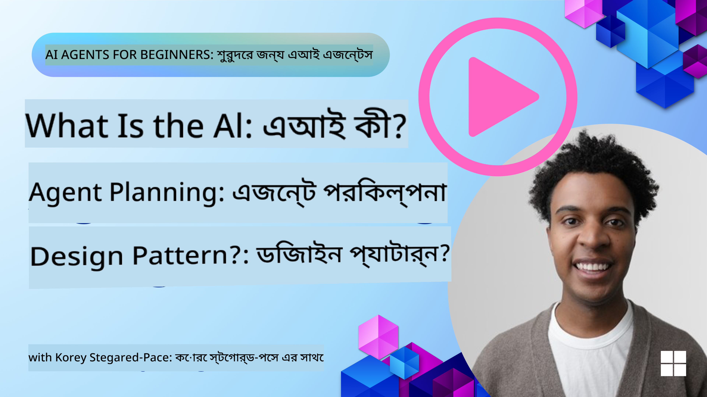
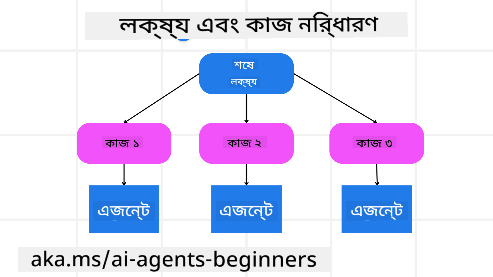

<!--
CO_OP_TRANSLATOR_METADATA:
{
  "original_hash": "e4e06d3b5d6207459a019c05fee5eb4b",
  "translation_date": "2025-07-12T10:38:46+00:00",
  "source_file": "07-planning-design/README.md",
  "language_code": "bn"
}
-->
[](https://youtu.be/kPfJ2BrBCMY?si=9pYpPXp0sSbK91Dr)

> _(এই পাঠের ভিডিও দেখতে উপরের ছবিতে ক্লিক করুন)_

# পরিকল্পনা ডিজাইন

## পরিচিতি

এই পাঠে আলোচনা করা হবে

* একটি স্পষ্ট সামগ্রিক লক্ষ্য নির্ধারণ এবং একটি জটিল কাজকে পরিচালনাযোগ্য কাজগুলিতে ভাগ করা।
* আরও নির্ভরযোগ্য এবং মেশিন-পঠনযোগ্য প্রতিক্রিয়ার জন্য কাঠামোবদ্ধ আউটপুট ব্যবহার করা।
* গতিশীল কাজ এবং অপ্রত্যাশিত ইনপুট পরিচালনার জন্য ইভেন্ট-চালিত পদ্ধতি প্রয়োগ করা।

## শেখার লক্ষ্য

এই পাঠ শেষ করার পর, আপনি বুঝতে পারবেন:

* একটি AI এজেন্টের জন্য একটি সামগ্রিক লক্ষ্য নির্ধারণ এবং সেট করা, যাতে এটি স্পষ্টভাবে জানে কী অর্জন করতে হবে।
* একটি জটিল কাজকে ছোট, পরিচালনাযোগ্য উপকাজে বিভক্ত করা এবং সেগুলোকে যৌক্তিক ক্রমে সাজানো।
* এজেন্টদের সঠিক সরঞ্জাম (যেমন, অনুসন্ধান সরঞ্জাম বা ডেটা বিশ্লেষণ সরঞ্জাম) দিয়ে সজ্জিত করা, কখন এবং কীভাবে সেগুলো ব্যবহার করা হবে তা নির্ধারণ করা, এবং অপ্রত্যাশিত পরিস্থিতি মোকাবেলা করা।
* উপকাজের ফলাফল মূল্যায়ন করা, কর্মক্ষমতা পরিমাপ করা, এবং চূড়ান্ত আউটপুট উন্নত করার জন্য পদক্ষেপ পুনরাবৃত্তি করা।

## সামগ্রিক লক্ষ্য নির্ধারণ এবং কাজ ভাঙা



বেশিরভাগ বাস্তব জীবনের কাজ এক ধাপে মোকাবেলা করার জন্য খুব জটিল। একটি AI এজেন্টের একটি সংক্ষিপ্ত উদ্দেশ্য থাকা দরকার যা তার পরিকল্পনা এবং কর্ম পরিচালনা করবে। উদাহরণস্বরূপ, লক্ষ্যটি বিবেচনা করুন:

    "৩ দিনের ভ্রমণ সূচি তৈরি করা।"

যদিও এটি সহজে বলা যায়, তবুও এটি আরও পরিমার্জন প্রয়োজন। লক্ষ্য যত স্পষ্ট হবে, এজেন্ট (এবং যেকোনো মানব সহযোগী) তত ভালোভাবে সঠিক ফলাফল অর্জনে মনোযোগ দিতে পারবে, যেমন একটি বিস্তৃত সূচি তৈরি করা যেখানে ফ্লাইট অপশন, হোটেল সুপারিশ এবং কার্যক্রমের পরামর্শ থাকবে।

### কাজ ভাঙা

বড় বা জটিল কাজগুলো ছোট, লক্ষ্যভিত্তিক উপকাজে ভাগ করলে সেগুলো পরিচালনাযোগ্য হয়।
ভ্রমণ সূচির উদাহরণে, আপনি লক্ষ্যটিকে নিম্নলিখিত উপকাজে ভাগ করতে পারেন:

* ফ্লাইট বুকিং
* হোটেল বুকিং
* গাড়ি ভাড়া
* ব্যক্তিগতকরণ

প্রত্যেক উপকাজ আলাদা এজেন্ট বা প্রক্রিয়ার মাধ্যমে সম্পন্ন করা যেতে পারে। একজন এজেন্ট ফ্লাইটের সেরা ডিল খোঁজার জন্য বিশেষজ্ঞ হতে পারে, অন্যজন হোটেল বুকিংয়ের জন্য, ইত্যাদি। একটি সমন্বয়কারী বা "ডাউনস্ট্রিম" এজেন্ট এই ফলাফলগুলো একত্রিত করে ব্যবহারকারীর জন্য একটি সমন্বিত সূচি তৈরি করতে পারে।

এই মডুলার পদ্ধতি ধাপে ধাপে উন্নতি করার সুযোগ দেয়। উদাহরণস্বরূপ, আপনি খাদ্য সুপারিশ বা স্থানীয় কার্যক্রমের পরামর্শের জন্য বিশেষায়িত এজেন্ট যোগ করতে পারেন এবং সময়ের সাথে সূচি উন্নত করতে পারেন।

### কাঠামোবদ্ধ আউটপুট

বড় ভাষা মডেল (LLMs) কাঠামোবদ্ধ আউটপুট (যেমন JSON) তৈরি করতে পারে যা ডাউনস্ট্রিম এজেন্ট বা সার্ভিসগুলো সহজে বিশ্লেষণ এবং প্রক্রিয়া করতে পারে। এটি বিশেষ করে মাল্টি-এজেন্ট প্রসঙ্গে উপকারী, যেখানে পরিকল্পনার আউটপুট পাওয়ার পর আমরা এই কাজগুলো কার্যকর করতে পারি। দ্রুত ওভারভিউর জন্য দেখুন।

নিম্নলিখিত পাইথন স্নিপেট একটি সাধারণ পরিকল্পনা এজেন্টকে দেখায় যা একটি লক্ষ্যকে উপকাজে ভাগ করে এবং একটি কাঠামোবদ্ধ পরিকল্পনা তৈরি করে:

```python
from pydantic import BaseModel
from enum import Enum
from typing import List, Optional, Union
import json
import os
from typing import Optional
from pprint import pprint
from autogen_core.models import UserMessage, SystemMessage, AssistantMessage
from autogen_ext.models.azure import AzureAIChatCompletionClient
from azure.core.credentials import AzureKeyCredential

class AgentEnum(str, Enum):
    FlightBooking = "flight_booking"
    HotelBooking = "hotel_booking"
    CarRental = "car_rental"
    ActivitiesBooking = "activities_booking"
    DestinationInfo = "destination_info"
    DefaultAgent = "default_agent"
    GroupChatManager = "group_chat_manager"

# Travel SubTask Model
class TravelSubTask(BaseModel):
    task_details: str
    assigned_agent: AgentEnum  # we want to assign the task to the agent

class TravelPlan(BaseModel):
    main_task: str
    subtasks: List[TravelSubTask]
    is_greeting: bool

client = AzureAIChatCompletionClient(
    model="gpt-4o-mini",
    endpoint="https://models.inference.ai.azure.com",
    # To authenticate with the model you will need to generate a personal access token (PAT) in your GitHub settings.
    # Create your PAT token by following instructions here: https://docs.github.com/en/authentication/keeping-your-account-and-data-secure/managing-your-personal-access-tokens
    credential=AzureKeyCredential(os.environ["GITHUB_TOKEN"]),
    model_info={
        "json_output": False,
        "function_calling": True,
        "vision": True,
        "family": "unknown",
    },
)

# Define the user message
messages = [
    SystemMessage(content="""You are an planner agent.
    Your job is to decide which agents to run based on the user's request.
                      Provide your response in JSON format with the following structure:
{'main_task': 'Plan a family trip from Singapore to Melbourne.',
 'subtasks': [{'assigned_agent': 'flight_booking',
               'task_details': 'Book round-trip flights from Singapore to '
                               'Melbourne.'}
    Below are the available agents specialised in different tasks:
    - FlightBooking: For booking flights and providing flight information
    - HotelBooking: For booking hotels and providing hotel information
    - CarRental: For booking cars and providing car rental information
    - ActivitiesBooking: For booking activities and providing activity information
    - DestinationInfo: For providing information about destinations
    - DefaultAgent: For handling general requests""", source="system"),
    UserMessage(
        content="Create a travel plan for a family of 2 kids from Singapore to Melboune", source="user"),
]

response = await client.create(messages=messages, extra_create_args={"response_format": 'json_object'})

response_content: Optional[str] = response.content if isinstance(
    response.content, str) else None
if response_content is None:
    raise ValueError("Response content is not a valid JSON string" )

pprint(json.loads(response_content))

# # Ensure the response content is a valid JSON string before loading it
# response_content: Optional[str] = response.content if isinstance(
#     response.content, str) else None
# if response_content is None:
#     raise ValueError("Response content is not a valid JSON string")

# # Print the response content after loading it as JSON
# pprint(json.loads(response_content))

# Validate the response content with the MathReasoning model
# TravelPlan.model_validate(json.loads(response_content))
```

### মাল্টি-এজেন্ট সমন্বয়ের সাথে পরিকল্পনা এজেন্ট

এই উদাহরণে, একটি Semantic Router Agent ব্যবহারকারীর অনুরোধ গ্রহণ করে (যেমন, "আমার ভ্রমণের জন্য একটি হোটেল পরিকল্পনা দরকার।")।

পরিকল্পনাকারী তারপর:

* হোটেল পরিকল্পনা গ্রহণ করে: ব্যবহারকারীর বার্তা নিয়ে, সিস্টেম প্রম্পট (যেখানে উপলব্ধ এজেন্টের বিবরণ থাকে) অনুযায়ী একটি কাঠামোবদ্ধ ভ্রমণ পরিকল্পনা তৈরি করে।
* এজেন্ট এবং তাদের সরঞ্জাম তালিকা করে: এজেন্ট রেজিস্ট্রি এজেন্টদের তালিকা রাখে (যেমন ফ্লাইট, হোটেল, গাড়ি ভাড়া, এবং কার্যক্রমের জন্য) এবং তারা যে ফাংশন বা সরঞ্জাম সরবরাহ করে তা।
* পরিকল্পনাটি সংশ্লিষ্ট এজেন্টদের কাছে পাঠায়: উপকাজের সংখ্যার উপর নির্ভর করে, পরিকল্পনাকারী বার্তাটি সরাসরি একটি নির্দিষ্ট এজেন্টকে পাঠায় (একক কাজের ক্ষেত্রে) অথবা মাল্টি-এজেন্ট সহযোগিতার জন্য গ্রুপ চ্যাট ম্যানেজারের মাধ্যমে সমন্বয় করে।
* ফলাফল সংক্ষেপ করে: অবশেষে, পরিকল্পনাকারী তৈরি করা পরিকল্পনাটি স্পষ্টতার জন্য সংক্ষেপ করে।
নিম্নলিখিত পাইথন কোড স্যাম্পল এই ধাপগুলো দেখায়:

```python

from pydantic import BaseModel

from enum import Enum
from typing import List, Optional, Union

class AgentEnum(str, Enum):
    FlightBooking = "flight_booking"
    HotelBooking = "hotel_booking"
    CarRental = "car_rental"
    ActivitiesBooking = "activities_booking"
    DestinationInfo = "destination_info"
    DefaultAgent = "default_agent"
    GroupChatManager = "group_chat_manager"

# Travel SubTask Model

class TravelSubTask(BaseModel):
    task_details: str
    assigned_agent: AgentEnum # we want to assign the task to the agent

class TravelPlan(BaseModel):
    main_task: str
    subtasks: List[TravelSubTask]
    is_greeting: bool
import json
import os
from typing import Optional

from autogen_core.models import UserMessage, SystemMessage, AssistantMessage
from autogen_ext.models.openai import AzureOpenAIChatCompletionClient

# Create the client with type-checked environment variables

client = AzureOpenAIChatCompletionClient(
    azure_deployment=os.getenv("AZURE_OPENAI_DEPLOYMENT_NAME"),
    model=os.getenv("AZURE_OPENAI_DEPLOYMENT_NAME"),
    api_version=os.getenv("AZURE_OPENAI_API_VERSION"),
    azure_endpoint=os.getenv("AZURE_OPENAI_ENDPOINT"),
    api_key=os.getenv("AZURE_OPENAI_API_KEY"),
)

from pprint import pprint

# Define the user message

messages = [
    SystemMessage(content="""You are an planner agent.
    Your job is to decide which agents to run based on the user's request.
    Below are the available agents specialized in different tasks:
    - FlightBooking: For booking flights and providing flight information
    - HotelBooking: For booking hotels and providing hotel information
    - CarRental: For booking cars and providing car rental information
    - ActivitiesBooking: For booking activities and providing activity information
    - DestinationInfo: For providing information about destinations
    - DefaultAgent: For handling general requests""", source="system"),
    UserMessage(content="Create a travel plan for a family of 2 kids from Singapore to Melbourne", source="user"),
]

response = await client.create(messages=messages, extra_create_args={"response_format": TravelPlan})

# Ensure the response content is a valid JSON string before loading it

response_content: Optional[str] = response.content if isinstance(response.content, str) else None
if response_content is None:
    raise ValueError("Response content is not a valid JSON string")

# Print the response content after loading it as JSON

pprint(json.loads(response_content))
```

এরপরের আউটপুটটি পূর্বের কোড থেকে এসেছে এবং আপনি এই কাঠামোবদ্ধ আউটপুট ব্যবহার করে `assigned_agent`-এ রুট করতে পারেন এবং ভ্রমণ পরিকল্পনাটি ব্যবহারকারীর কাছে সংক্ষেপ করতে পারেন।

```json
{
    "is_greeting": "False",
    "main_task": "Plan a family trip from Singapore to Melbourne.",
    "subtasks": [
        {
            "assigned_agent": "flight_booking",
            "task_details": "Book round-trip flights from Singapore to Melbourne."
        },
        {
            "assigned_agent": "hotel_booking",
            "task_details": "Find family-friendly hotels in Melbourne."
        },
        {
            "assigned_agent": "car_rental",
            "task_details": "Arrange a car rental suitable for a family of four in Melbourne."
        },
        {
            "assigned_agent": "activities_booking",
            "task_details": "List family-friendly activities in Melbourne."
        },
        {
            "assigned_agent": "destination_info",
            "task_details": "Provide information about Melbourne as a travel destination."
        }
    ]
}
```

পূর্বের কোড স্যাম্পলসহ একটি উদাহরণ নোটবুক পাওয়া যাবে [এখানে](../../../07-planning-design/07-autogen.ipynb)।

### পুনরাবৃত্তিমূলক পরিকল্পনা

কিছু কাজের জন্য বারবার যোগাযোগ বা পুনরায় পরিকল্পনা প্রয়োজন, যেখানে একটি উপকাজের ফলাফল পরবর্তী উপকাজকে প্রভাবিত করে। উদাহরণস্বরূপ, যদি এজেন্ট ফ্লাইট বুকিং করার সময় অপ্রত্যাশিত ডেটা ফরম্যাট খুঁজে পায়, তবে এটি হোটেল বুকিংয়ের আগে তার কৌশল পরিবর্তন করতে হতে পারে।

অতিরিক্তভাবে, ব্যবহারকারীর প্রতিক্রিয়া (যেমন একজন মানুষ আগের ফ্লাইট পছন্দ করলে) আংশিক পুনঃপরিকল্পনা শুরু করতে পারে। এই গতিশীল, পুনরাবৃত্তিমূলক পদ্ধতি নিশ্চিত করে যে চূড়ান্ত সমাধান বাস্তব জীবনের সীমাবদ্ধতা এবং পরিবর্তনশীল ব্যবহারকারীর পছন্দের সাথে সামঞ্জস্যপূর্ণ।

উদাহরণস্বরূপ কোড

```python
from autogen_core.models import UserMessage, SystemMessage, AssistantMessage
#.. same as previous code and pass on the user history, current plan
messages = [
    SystemMessage(content="""You are a planner agent to optimize the
    Your job is to decide which agents to run based on the user's request.
    Below are the available agents specialized in different tasks:
    - FlightBooking: For booking flights and providing flight information
    - HotelBooking: For booking hotels and providing hotel information
    - CarRental: For booking cars and providing car rental information
    - ActivitiesBooking: For booking activities and providing activity information
    - DestinationInfo: For providing information about destinations
    - DefaultAgent: For handling general requests""", source="system"),
    UserMessage(content="Create a travel plan for a family of 2 kids from Singapore to Melbourne", source="user"),
    AssistantMessage(content=f"Previous travel plan - {TravelPlan}", source="assistant")
]
# .. re-plan and send the tasks to respective agents
```

আরও বিস্তৃত পরিকল্পনার জন্য Magnetic One দেখুন।

## সারাংশ

এই প্রবন্ধে আমরা দেখেছি কিভাবে একটি পরিকল্পনাকারী তৈরি করা যায় যা গতিশীলভাবে উপলব্ধ এজেন্ট নির্বাচন করতে পারে। পরিকল্পনাকারীর আউটপুট কাজগুলো ভাঙে এবং এজেন্টদের নিয়োগ দেয় যাতে সেগুলো সম্পাদিত হতে পারে। ধরে নেওয়া হয় যে এজেন্টদের কাছে কাজ সম্পাদনের জন্য প্রয়োজনীয় ফাংশন/সরঞ্জাম রয়েছে। এজেন্টদের পাশাপাশি আপনি প্রতিফলন, সংক্ষেপকারী, এবং রাউন্ড রবিন চ্যাটের মতো অন্যান্য প্যাটার্নও অন্তর্ভুক্ত করতে পারেন আরও কাস্টমাইজেশনের জন্য।

## অতিরিক্ত সম্পদ

* AutoGen Magnetic One - একটি সাধারণ মাল্টি-এজেন্ট সিস্টেম যা জটিল কাজ সমাধানে সক্ষম এবং একাধিক চ্যালেঞ্জিং এজেন্টিক বেঞ্চমার্কে চমৎকার ফলাফল অর্জন করেছে। রেফারেন্স:

. এই বাস্তবায়নে, অর্কেস্ট্রেটর কাজ-নির্দিষ্ট পরিকল্পনা তৈরি করে এবং উপলব্ধ এজেন্টদের কাছে এই কাজগুলো দায়িত্ব দেয়। পরিকল্পনার পাশাপাশি, অর্কেস্ট্রেটর একটি ট্র্যাকিং মেকানিজমও ব্যবহার করে কাজের অগ্রগতি পর্যবেক্ষণ করে এবং প্রয়োজনে পুনরায় পরিকল্পনা করে।

## পূর্ববর্তী পাঠ

[বিশ্বাসযোগ্য AI এজেন্ট তৈরি](../06-building-trustworthy-agents/README.md)

## পরবর্তী পাঠ

[মাল্টি-এজেন্ট ডিজাইন প্যাটার্ন](../08-multi-agent/README.md)

**অস্বীকৃতি**:  
এই নথিটি AI অনুবাদ সেবা [Co-op Translator](https://github.com/Azure/co-op-translator) ব্যবহার করে অনূদিত হয়েছে। আমরা যথাসাধ্য সঠিকতার চেষ্টা করি, তবে স্বয়ংক্রিয় অনুবাদে ত্রুটি বা অসঙ্গতি থাকতে পারে। মূল নথিটি তার নিজস্ব ভাষায়ই কর্তৃত্বপূর্ণ উৎস হিসেবে বিবেচিত হওয়া উচিত। গুরুত্বপূর্ণ তথ্যের জন্য পেশাদার মানব অনুবাদ গ্রহণ করার পরামর্শ দেওয়া হয়। এই অনুবাদের ব্যবহারে সৃষ্ট কোনো ভুল বোঝাবুঝি বা ভুল ব্যাখ্যার জন্য আমরা দায়ী নই।