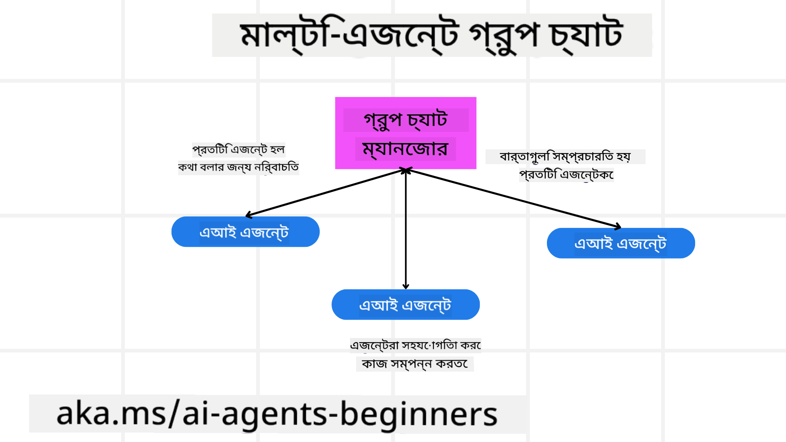
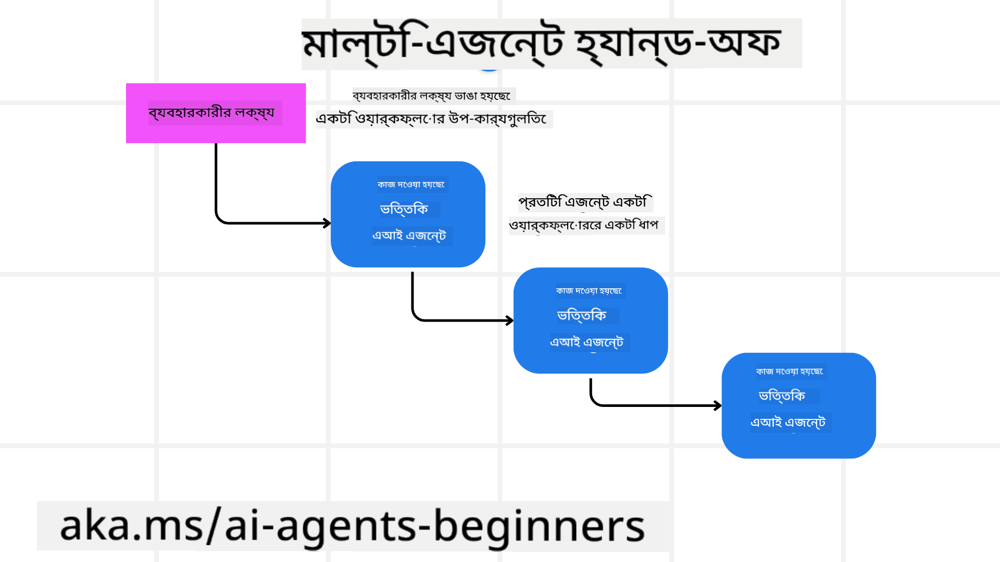
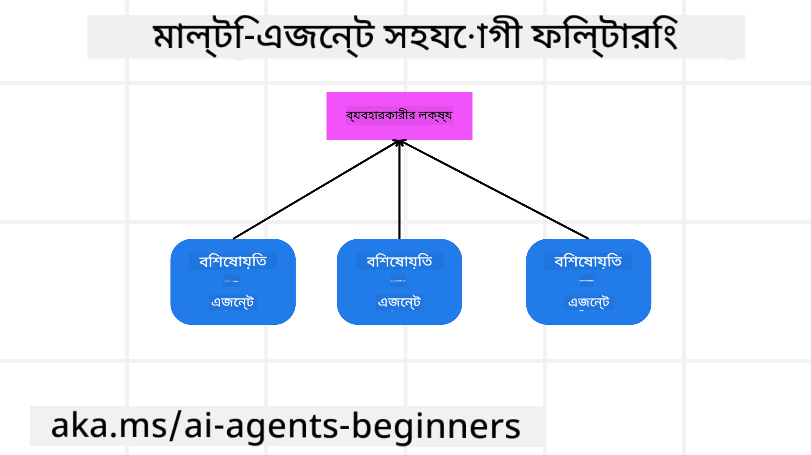

<!--
CO_OP_TRANSLATOR_METADATA:
{
  "original_hash": "c692a8975d7d5b99575a553de1c5e8a7",
  "translation_date": "2025-07-12T11:01:59+00:00",
  "source_file": "08-multi-agent/README.md",
  "language_code": "bn"
}
-->

> _(উপরের ছবিতে ক্লিক করে এই লেসনের ভিডিও দেখুন)_

# মাল্টি-এজেন্ট ডিজাইন প্যাটার্নস

যখনই আপনি এমন একটি প্রজেক্টে কাজ শুরু করবেন যেখানে একাধিক এজেন্ট জড়িত থাকবে, তখন মাল্টি-এজেন্ট ডিজাইন প্যাটার্ন বিবেচনা করা প্রয়োজন হবে। তবে কখন মাল্টি-এজেন্ট ব্যবহারে যাওয়া উচিত এবং এর সুবিধাগুলো কী, তা প্রথমে স্পষ্ট নাও হতে পারে।

## পরিচিতি

এই লেসনে আমরা নিম্নলিখিত প্রশ্নগুলোর উত্তর খুঁজব:

- কোন কোন পরিস্থিতিতে মাল্টি-এজেন্ট প্রযোজ্য?
- একক এজেন্টের পরিবর্তে মাল্টি-এজেন্ট ব্যবহারের সুবিধাগুলো কী?
- মাল্টি-এজেন্ট ডিজাইন প্যাটার্ন বাস্তবায়নের মূল উপাদানগুলো কী কী?
- একাধিক এজেন্ট কীভাবে একে অপরের সাথে ইন্টারঅ্যাক্ট করছে, তা আমরা কীভাবে দেখতে পারি?

## শেখার লক্ষ্য

এই লেসনের পর, আপনি সক্ষম হবেন:

- মাল্টি-এজেন্ট প্রযোজ্য এমন পরিস্থিতি চিহ্নিত করতে
- একক এজেন্টের তুলনায় মাল্টি-এজেন্ট ব্যবহারের সুবিধাগুলো বুঝতে
- মাল্টি-এজেন্ট ডিজাইন প্যাটার্ন বাস্তবায়নের মূল উপাদানগুলো সম্পর্কে ধারণা পেতে

বড় ছবিটা কী?

*মাল্টি-এজেন্ট হলো এমন একটি ডিজাইন প্যাটার্ন যা একাধিক এজেন্টকে একসাথে কাজ করতে দেয় একটি সাধারণ লক্ষ্য অর্জনের জন্য।*

এই প্যাটার্নটি রোবোটিক্স, স্বয়ংক্রিয় সিস্টেম, এবং বিতরণকৃত কম্পিউটিংসহ বিভিন্ন ক্ষেত্রে ব্যাপকভাবে ব্যবহৃত হয়।

## মাল্টি-এজেন্ট প্রযোজ্য এমন পরিস্থিতি

তাহলে কোন কোন পরিস্থিতিতে মাল্টি-এজেন্ট ব্যবহারের ভালো সুযোগ থাকে? উত্তর হলো, অনেক পরিস্থিতিতে একাধিক এজেন্ট ব্যবহার উপকারী, বিশেষ করে নিচের ক্ষেত্রে:

- **বড় কাজের পরিমাণ**: বড় কাজগুলো ছোট ছোট টাস্কে ভাগ করে বিভিন্ন এজেন্টকে দেওয়া যায়, যা সমান্তরাল প্রক্রিয়াকরণ এবং দ্রুত সমাপ্তি নিশ্চিত করে। এর একটি উদাহরণ হলো বড় ডেটা প্রসেসিং টাস্ক।
- **জটিল কাজ**: বড় কাজের মতোই জটিল কাজগুলো ছোট ছোট সাবটাস্কে ভাগ করে বিভিন্ন এজেন্টকে দেওয়া যায়, যারা প্রতিটি নির্দিষ্ট দিকের জন্য বিশেষজ্ঞ। উদাহরণস্বরূপ, স্বয়ংক্রিয় যানবাহনে বিভিন্ন এজেন্ট নেভিগেশন, বাধা সনাক্তকরণ, এবং অন্যান্য যানবাহনের সাথে যোগাযোগ পরিচালনা করে।
- **বিভিন্ন দক্ষতা**: বিভিন্ন এজেন্টের বিভিন্ন দক্ষতা থাকতে পারে, যা একক এজেন্টের চেয়ে কাজের বিভিন্ন দিক আরও কার্যকরভাবে পরিচালনা করতে সাহায্য করে। এর একটি ভালো উদাহরণ হলো স্বাস্থ্যসেবা, যেখানে এজেন্টরা ডায়াগনস্টিক, চিকিৎসা পরিকল্পনা, এবং রোগী পর্যবেক্ষণ পরিচালনা করে।

## একক এজেন্টের তুলনায় মাল্টি-এজেন্ট ব্যবহারের সুবিধা

সরল কাজের জন্য একক এজেন্ট সিস্টেম ভালো কাজ করতে পারে, কিন্তু জটিল কাজের জন্য একাধিক এজেন্ট ব্যবহারে অনেক সুবিধা পাওয়া যায়:

- **বিশেষায়ন**: প্রতিটি এজেন্ট নির্দিষ্ট কাজের জন্য বিশেষায়িত হতে পারে। একক এজেন্টে বিশেষায়নের অভাব থাকলে, এজেন্টটি সবকিছু করতে পারলেও জটিল কাজের মুখোমুখি হলে বিভ্রান্ত হতে পারে এবং এমন কাজ করতে পারে যা তার জন্য উপযুক্ত নয়।
- **স্কেলেবিলিটি**: একক এজেন্টের উপর অতিরিক্ত চাপ না দিয়ে সহজেই আরও এজেন্ট যোগ করে সিস্টেম বড় করা যায়।
- **ফল্ট টলারেন্স**: যদি একটি এজেন্ট ব্যর্থ হয়, অন্যরা কাজ চালিয়ে যেতে পারে, যা সিস্টেমের নির্ভরযোগ্যতা নিশ্চিত করে।

উদাহরণ হিসেবে ধরা যাক, আমরা একজন ব্যবহারকারীর জন্য একটি ট্রিপ বুক করতে চাই। একক এজেন্ট সিস্টেমে ট্রিপ বুকিংয়ের সব দিক যেমন ফ্লাইট খোঁজা, হোটেল এবং রেন্টাল কার বুকিং সবকিছুই এক এজেন্টকে করতে হবে। এর জন্য এজেন্টের কাছে সব কাজের জন্য টুল থাকতে হবে, যা একটি জটিল এবং একক সিস্টেম তৈরি করবে যা রক্ষণাবেক্ষণ এবং স্কেল করা কঠিন। অন্যদিকে, মাল্টি-এজেন্ট সিস্টেমে বিভিন্ন এজেন্ট ফ্লাইট খোঁজা, হোটেল বুকিং, এবং রেন্টাল কার বুকিংয়ে বিশেষায়িত থাকবে। এতে সিস্টেমটি আরও মডুলার, রক্ষণাবেক্ষণ সহজ এবং স্কেলযোগ্য হবে।

এটি তুলনা করা যেতে পারে একটি ছোট মোম-এন্ড-পপ ট্রাভেল এজেন্সি এবং একটি ফ্র্যাঞ্চাইজি ট্রাভেল এজেন্সির সাথে। মোম-এন্ড-পপ স্টোরে একক এজেন্ট ট্রিপ বুকিংয়ের সব দিক পরিচালনা করবে, আর ফ্র্যাঞ্চাইজিতে বিভিন্ন এজেন্ট বিভিন্ন দিক পরিচালনা করবে।

## মাল্টি-এজেন্ট ডিজাইন প্যাটার্ন বাস্তবায়নের মূল উপাদান

মাল্টি-এজেন্ট ডিজাইন প্যাটার্ন বাস্তবায়নের আগে, আপনাকে প্যাটার্নের মূল উপাদানগুলো বুঝতে হবে।

আবার ব্যবহারকারীর জন্য ট্রিপ বুকিং উদাহরণটি নিয়ে আসি। এই ক্ষেত্রে মূল উপাদানগুলো হলো:

- **এজেন্ট যোগাযোগ**: ফ্লাইট খোঁজা, হোটেল বুকিং, এবং রেন্টাল কার এজেন্টদের ব্যবহারকারীর পছন্দ এবং সীমাবদ্ধতা সম্পর্কে তথ্য আদান-প্রদান করতে হবে। এর জন্য যোগাযোগের প্রোটোকল এবং পদ্ধতি নির্ধারণ করতে হবে। উদাহরণস্বরূপ, ফ্লাইট খোঁজা এজেন্টকে হোটেল বুকিং এজেন্টের সাথে যোগাযোগ করতে হবে যাতে একই তারিখে হোটেল বুক করা হয়। অর্থাৎ, এজেন্টদের মধ্যে তথ্য শেয়ারিং কিভাবে হবে এবং কারা তথ্য শেয়ার করবে তা নির্ধারণ করতে হবে।
- **সমন্বয় প্রক্রিয়া**: এজেন্টদের কাজ সমন্বয় করতে হবে যাতে ব্যবহারকারীর পছন্দ এবং সীমাবদ্ধতা পূরণ হয়। যেমন, ব্যবহারকারী চাইতে পারে বিমানবন্দরের কাছে হোটেল, আর রেন্টাল কার শুধুমাত্র বিমানবন্দরে পাওয়া যায়। তাই হোটেল বুকিং এজেন্টকে রেন্টাল কার এজেন্টের সাথে সমন্বয় করতে হবে। অর্থাৎ, এজেন্টরা কীভাবে তাদের কাজ সমন্বয় করবে তা নির্ধারণ করতে হবে।
- **এজেন্ট আর্কিটেকচার**: এজেন্টদের অভ্যন্তরীণ কাঠামো থাকতে হবে যাতে তারা সিদ্ধান্ত নিতে এবং ব্যবহারকারীর সাথে ইন্টারঅ্যাকশন থেকে শিখতে পারে। যেমন, ফ্লাইট খোঁজা এজেন্টের এমন কাঠামো থাকতে হবে যা ব্যবহারকারীর অতীত পছন্দের ভিত্তিতে ফ্লাইট সুপারিশ করতে পারে। অর্থাৎ, এজেন্টরা কীভাবে সিদ্ধান্ত নেবে এবং শিখবে তা নির্ধারণ করতে হবে।
- **মাল্টি-এজেন্ট ইন্টারঅ্যাকশনে দৃশ্যমানতা**: একাধিক এজেন্ট কীভাবে একে অপরের সাথে ইন্টারঅ্যাক্ট করছে তা দেখতে হবে। এজন্য এজেন্ট কার্যক্রম এবং ইন্টারঅ্যাকশন ট্র্যাক করার টুলস এবং পদ্ধতি থাকা দরকার। যেমন লগিং, মনিটরিং, ভিজ্যুয়ালাইজেশন টুলস এবং পারফরম্যান্স মেট্রিক্স।
- **মাল্টি-এজেন্ট প্যাটার্নস**: মাল্টি-এজেন্ট সিস্টেম বাস্তবায়নের জন্য বিভিন্ন প্যাটার্ন আছে, যেমন কেন্দ্রীভূত, বিকেন্দ্রীভূত, এবং হাইব্রিড আর্কিটেকচার। আপনার ব্যবহারের জন্য সবচেয়ে উপযুক্ত প্যাটার্ন নির্বাচন করতে হবে।
- **মানব ইন দ্য লুপ**: বেশিরভাগ ক্ষেত্রে, একটি মানুষ সিস্টেমের অংশ থাকবে এবং এজেন্টদের নির্দেশ দিতে হবে কখন মানুষের হস্তক্ষেপ দরকার। যেমন, ব্যবহারকারী যদি কোনো নির্দিষ্ট হোটেল বা ফ্লাইট চায় যা এজেন্টরা সুপারিশ করেনি, অথবা বুকিংয়ের আগে নিশ্চিতকরণ চায়।

## মাল্টি-এজেন্ট ইন্টারঅ্যাকশনে দৃশ্যমানতা

একাধিক এজেন্ট কীভাবে একে অপরের সাথে ইন্টারঅ্যাক্ট করছে তা দেখা খুবই গুরুত্বপূর্ণ। এই দৃশ্যমানতা ডিবাগিং, অপ্টিমাইজেশন, এবং সিস্টেমের সামগ্রিক কার্যকারিতা নিশ্চিত করার জন্য অপরিহার্য। এজন্য এজেন্ট কার্যক্রম এবং ইন্টারঅ্যাকশন ট্র্যাক করার টুলস এবং পদ্ধতি থাকা দরকার। যেমন লগিং, মনিটরিং, ভিজ্যুয়ালাইজেশন টুলস এবং পারফরম্যান্স মেট্রিক্স।

উদাহরণস্বরূপ, একজন ব্যবহারকারীর জন্য ট্রিপ বুকিংয়ের ক্ষেত্রে একটি ড্যাশবোর্ড থাকতে পারে যা প্রতিটি এজেন্টের অবস্থা, ব্যবহারকারীর পছন্দ এবং সীমাবদ্ধতা, এবং এজেন্টদের মধ্যে ইন্টারঅ্যাকশন দেখায়। এই ড্যাশবোর্ডে ব্যবহারকারীর ভ্রমণের তারিখ, ফ্লাইট এজেন্টের সুপারিশকৃত ফ্লাইট, হোটেল এজেন্টের সুপারিশকৃত হোটেল, এবং রেন্টাল কার এজেন্টের সুপারিশকৃত গাড়ি দেখা যাবে। এতে স্পষ্টভাবে বোঝা যাবে এজেন্টরা কীভাবে একে অপরের সাথে কাজ করছে এবং ব্যবহারকারীর পছন্দ ও সীমাবদ্ধতা পূরণ হচ্ছে কিনা।

চলুন এই দিকগুলো আরও বিস্তারিত দেখি:

- **লগিং এবং মনিটরিং টুলস**: প্রতিটি এজেন্টের কার্যকলাপের জন্য লগিং করা উচিত। একটি লগ এন্ট্রিতে এজেন্টের নাম, নেওয়া কাজ, কাজের সময়, এবং ফলাফল সংরক্ষণ করা যেতে পারে। এই তথ্য ডিবাগিং, অপ্টিমাইজেশন ইত্যাদির জন্য ব্যবহার করা হয়।
- **ভিজ্যুয়ালাইজেশন টুলস**: ভিজ্যুয়ালাইজেশন টুলস এজেন্টদের মধ্যে তথ্য প্রবাহ এবং ইন্টারঅ্যাকশন আরও সহজে বোঝাতে সাহায্য করে। যেমন, একটি গ্রাফ যা এজেন্টদের মধ্যে তথ্যের গতি দেখায়। এটি সিস্টেমের বটলনেক, অকার্যকরতা এবং অন্যান্য সমস্যা চিহ্নিত করতে সাহায্য করে।
- **পারফরম্যান্স মেট্রিক্স**: পারফরম্যান্স মেট্রিক্স মাল্টি-এজেন্ট সিস্টেমের কার্যকারিতা ট্র্যাক করতে সাহায্য করে। যেমন, একটি কাজ সম্পন্ন করতে সময়, প্রতি ইউনিট সময়ে সম্পন্ন কাজের সংখ্যা, এবং এজেন্টদের সুপারিশের সঠিকতা। এই তথ্য উন্নতির ক্ষেত্র চিহ্নিত করতে এবং সিস্টেম অপ্টিমাইজ করতে সাহায্য করে।

## মাল্টি-এজেন্ট প্যাটার্নস

মাল্টি-এজেন্ট অ্যাপ তৈরি করার জন্য কিছু নির্দিষ্ট প্যাটার্ন আছে। এখানে কিছু গুরুত্বপূর্ণ প্যাটার্ন আলোচনা করা হলো:

### গ্রুপ চ্যাট

এই প্যাটার্নটি তখন কাজে লাগে যখন আপনি এমন একটি গ্রুপ চ্যাট অ্যাপ তৈরি করতে চান যেখানে একাধিক এজেন্ট একে অপরের সাথে যোগাযোগ করতে পারে। সাধারণ ব্যবহার ক্ষেত্র হলো টিম সহযোগিতা, গ্রাহক সেবা, এবং সামাজিক নেটওয়ার্কিং।

এই প্যাটার্নে, প্রতিটি এজেন্ট গ্রুপ চ্যাটের একজন ব্যবহারকারী হিসেবে কাজ করে এবং মেসেজ আদান-প্রদান মেসেজিং প্রোটোকল ব্যবহার করে হয়। এজেন্টরা গ্রুপ চ্যাটে মেসেজ পাঠাতে পারে, গ্রুপ চ্যাট থেকে মেসেজ পেতে পারে, এবং অন্য এজেন্টদের মেসেজের জবাব দিতে পারে।

এই প্যাটার্ন কেন্দ্রীভূত আর্কিটেকচারে বাস্তবায়িত হতে পারে যেখানে সব মেসেজ একটি কেন্দ্রীয় সার্ভারের মাধ্যমে যায়, অথবা বিকেন্দ্রীভূত আর্কিটেকচারে যেখানে মেসেজ সরাসরি বিনিময় হয়।

### হ্যান্ড-অফ

এই প্যাটার্নটি তখন কাজে লাগে যখন আপনি এমন একটি অ্যাপ তৈরি করতে চান যেখানে একাধিক এজেন্ট একে অপরকে কাজ হস্তান্তর করতে পারে।

সাধারণ ব্যবহার ক্ষেত্র হলো গ্রাহক সেবা, টাস্ক ম্যানেজমেন্ট, এবং ওয়ার্কফ্লো অটোমেশন।

এই প্যাটার্নে, প্রতিটি এজেন্ট একটি টাস্ক বা ওয়ার্কফ্লোর একটি ধাপ প্রতিনিধিত্ব করে, এবং পূর্বনির্ধারিত নিয়ম অনুযায়ী এজেন্টরা টাস্ক অন্য এজেন্টকে হস্তান্তর করতে পারে।

### সহযোগিতামূলক ফিল্টারিং

এই প্যাটার্নটি তখন কাজে লাগে যখন আপনি এমন একটি অ্যাপ তৈরি করতে চান যেখানে একাধিক এজেন্ট ব্যবহারকারীদের জন্য সুপারিশ তৈরি করতে একসাথে কাজ করে।

একাধিক এজেন্টের সহযোগিতা দরকার কারণ প্রতিটি এজেন্টের আলাদা দক্ষতা থাকে এবং তারা সুপারিশ প্রক্রিয়ায় বিভিন্নভাবে অবদান রাখতে পারে।

উদাহরণস্বরূপ, একজন ব্যবহারকারী স্টক মার্কেটে কোন স্টক কেনা উচিত সে সম্পর্কে সুপারিশ চায়।

- **শিল্প বিশেষজ্ঞ**: একজন এজেন্ট নির্দিষ্ট শিল্পের বিশেষজ্ঞ হতে পারে।
- **প্রযুক্তিগত বিশ্লেষণ**: অন্য একজন এজেন্ট প্রযুক্তিগত বিশ্লেষণে দক্ষ।
- **মূলগত বিশ্লেষণ**: আরেকজন এজেন্ট মূলগত বিশ্লেষণে পারদর্শী। এই এজেন্টরা একসাথে কাজ করে ব্যবহারকারীর জন্য আরও ব্যাপক সুপারিশ দিতে পারে।

## পরিস্থিতি: রিফান্ড প্রক্রিয়া

ধরা যাক, একজন গ্রাহক একটি পণ্যের জন্য রিফান্ড চাইছেন, এই প্রক্রিয়ায় অনেক এজেন্ট জড়িত থাকতে পারে। তবে চলুন এজেন্টগুলোকে দুই ভাগে ভাগ করি: রিফান্ড প্রক্রিয়ার জন্য নির্দিষ্ট এজেন্ট এবং সাধারণ এজেন্ট যারা অন্যান্য প্রক্রিয়াতেও ব্যবহার করা যায়।

**রিফান্ড প্রক্রিয়ার জন্য নির্দিষ্ট এজেন্ট**:

নিম্নলিখিত এজেন্টগুলো রিফান্ড প্রক্রিয়ায় জড়িত থাকতে পারে:

- **গ্রাহক এজেন্ট**: এই এজেন্ট গ্রাহককে প্রতিনিধিত্ব করে এবং রিফান্ড প্রক্রিয়া শুরু করে।
- **বিক্রেতা এজেন্ট**: এই এজেন্ট বিক্রেতাকে প্রতিনিধিত্ব করে এবং রিফান্ড প্রক্রিয়া সম্পন্ন করে।
- **পেমেন্ট এজেন্ট**: এই এজেন্ট পেমেন্ট প্রক্রিয়া পরিচালনা করে এবং গ্রাহকের টাকা ফেরত দেয়।
- **সমাধান এজেন্ট**: এই এজেন্ট সমস্যা সমাধানের জন্য দায়িত্বশীল, রিফান্ড প্রক্রিয়ায় উদ্ভূত যেকোনো সমস্যা সমাধান করে।
- **কমপ্লায়েন্স এজেন্ট**: এই এজেন্ট নিশ্চিত করে যে রিফান্ড প্রক্রিয়া নিয়মনীতি এবং নীতিমালা অনুসারে হচ্ছে।

**সাধারণ এজেন্ট**:

এই এজেন্টগুলো আপনার ব্যবসার অন্যান্য অংশেও ব্যবহার করা যেতে পারে।

- **শিপিং এজেন্ট**: এই এজেন্ট পণ্য বিক্রেতার কাছে ফেরত পাঠানোর শিপিং প্রক্রিয়া পরিচালনা করে। এটি রিফান্ড প্রক্রিয়া এবং সাধারণ পণ্য শিপিং উভয়ের জন্য ব্যবহারযোগ্য।
- **ফিডব্যাক এজেন্ট**: এই এজেন্ট গ্রাহকের ফিডব্যাক সংগ্রহ করে। ফিডব্যাক যেকোনো সময় নেওয়া যেতে পারে, শুধুমাত্র রিফান্ড প্রক্রিয়ার সময় নয়।
- **এস্কেলেশন এজেন্ট**: এই এজেন্ট সমস্যা উচ্চতর স্তরে নিয়ে যায়। যেকোনো প্রক্রিয়ায় সমস্যা এড়াতে এটি ব্যবহার করা যায়।
- **নোটিফিকেশন এজেন্ট**: এই এজেন্ট রিফান্ড প্রক্রিয়ার বিভিন্ন ধাপে গ্রাহককে নোটিফিকেশন পাঠায়।
- **অ্যানালিটিক্স এজেন্ট**: এই এজেন্ট রিফান্ড প্রক্রিয়ার ডেটা বিশ্লেষণ করে।
- **অডিট এজেন্ট**: এই এজেন্ট নিশ্চিত করে যে রিফান্ড প্রক্রিয়া সঠিকভাবে হচ্ছে কিনা।
- **রিপোর্টিং এজেন্ট**: এই এজেন্ট রিফান্ড প্রক্রিয়ার রিপোর্ট তৈরি করে।
- **নলেজ এজেন্ট**: এই এজেন্ট রিফান্ড এবং ব্যবসার অন্যান্য অংশের তথ্যভাণ্ডার রক্ষণাবেক্ষণ করে।
- **সিকিউরিটি এজেন্ট**: এই এজেন্ট রিফান্ড প্রক্রিয়ার নিরাপত্তা নিশ্চিত করে।
- **কোয়ালিটি এজেন্ট**: এই এজেন্ট রিফান্ড প্রক্রিয়ার গুণগত মান নিশ্চিত করে।

উপরের তালিকায় অনেক এজেন্ট রয়েছে, রিফান্ড প্রক্রিয়ার জন্য নির্দিষ্ট এবং সাধারণ এজেন্ট উভয়ই। আশা করি এটি আপনাকে ধারণা দেবে কিভাবে মাল্টি-এজেন্ট সিস্টেমে কোন এজেন্টগুলো ব্যবহার করবেন তা নির্ধারণ করতে পারেন।

## অ্যাসাইনমেন্ট
## পূর্ববর্তী পাঠ

[পরিকল্পনা ডিজাইন](../07-planning-design/README.md)

## পরবর্তী পাঠ

[AI এজেন্টে মেটাকগনিশন](../09-metacognition/README.md)

**অস্বীকৃতি**:  
এই নথিটি AI অনুবাদ সেবা [Co-op Translator](https://github.com/Azure/co-op-translator) ব্যবহার করে অনূদিত হয়েছে। আমরা যথাসাধ্য সঠিকতার চেষ্টা করি, তবে স্বয়ংক্রিয় অনুবাদে ত্রুটি বা অসঙ্গতি থাকতে পারে। মূল নথিটি তার নিজস্ব ভাষায়ই কর্তৃত্বপূর্ণ উৎস হিসেবে বিবেচিত হওয়া উচিত। গুরুত্বপূর্ণ তথ্যের জন্য পেশাদার মানব অনুবাদ গ্রহণ করার পরামর্শ দেওয়া হয়। এই অনুবাদের ব্যবহারে সৃষ্ট কোনো ভুল বোঝাবুঝি বা ভুল ব্যাখ্যার জন্য আমরা দায়ী নই।