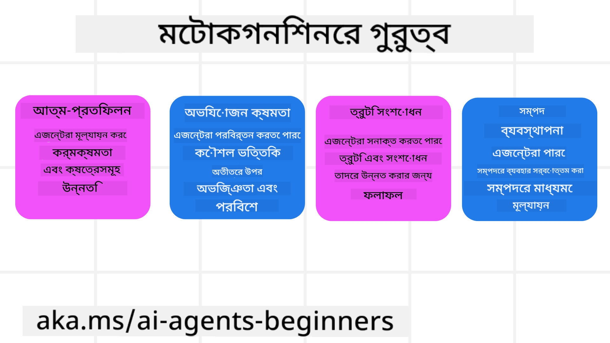
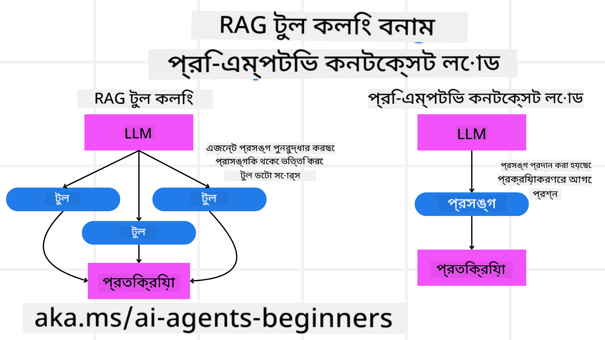

<!--
CO_OP_TRANSLATOR_METADATA:
{
  "original_hash": "8cbf460468c802c7994aa62e0e0779c9",
  "translation_date": "2025-07-12T12:15:19+00:00",
  "source_file": "09-metacognition/README.md",
  "language_code": "bn"
}
-->
[](https://youtu.be/His9R6gw6Ec?si=3_RMb8VprNvdLRhX)

> _(উপরের ছবিতে ক্লিক করে এই পাঠের ভিডিও দেখুন)_
# AI এজেন্টে মেটাকগনিশন

## পরিচিতি

AI এজেন্টে মেটাকগনিশন সম্পর্কে এই পাঠে আপনাকে স্বাগতম! এই অধ্যায়টি শুরু থেকে শেখার জন্য তৈরি, যারা জানতে আগ্রহী যে AI এজেন্টরা কীভাবে তাদের নিজের চিন্তার প্রক্রিয়া সম্পর্কে চিন্তা করতে পারে। এই পাঠ শেষ করার পর, আপনি মূল ধারণাগুলো বুঝতে পারবেন এবং মেটাকগনিশন AI এজেন্ট ডিজাইনে প্রয়োগ করার জন্য ব্যবহারিক উদাহরণ পাবেন।

## শেখার লক্ষ্যসমূহ

এই পাঠ শেষ করার পর, আপনি সক্ষম হবেন:

1. এজেন্ট সংজ্ঞায় রিজনিং লুপের প্রভাব বুঝতে।
2. পরিকল্পনা ও মূল্যায়ন কৌশল ব্যবহার করে স্ব-সংশোধনকারী এজেন্ট তৈরি করতে।
3. এমন এজেন্ট তৈরি করতে যা কোড পরিবর্তন করে কাজ সম্পন্ন করতে পারে।

## মেটাকগনিশনের পরিচিতি

মেটাকগনিশন হলো উচ্চতর মানসিক প্রক্রিয়া যা নিজের চিন্তা সম্পর্কে চিন্তা করার সাথে সম্পর্কিত। AI এজেন্টদের জন্য এর মানে হলো তারা নিজেদের কর্মসমূহ মূল্যায়ন ও সামঞ্জস্য করতে পারে স্ব-সচেতনতা এবং পূর্ব অভিজ্ঞতার ভিত্তিতে। মেটাকগনিশন বা "চিন্তা সম্পর্কে চিন্তা" হলো এজেন্টিক AI সিস্টেমের উন্নয়নে একটি গুরুত্বপূর্ণ ধারণা। এটি AI সিস্টেমকে তাদের অভ্যন্তরীণ প্রক্রিয়া সম্পর্কে সচেতন করে তোলে এবং তাদের আচরণ পর্যবেক্ষণ, নিয়ন্ত্রণ ও অভিযোজিত করার ক্ষমতা দেয়। যেমন আমরা যখন পরিস্থিতি বুঝি বা কোনো সমস্যা দেখি। এই স্ব-সচেতনতা AI সিস্টেমকে ভালো সিদ্ধান্ত নিতে, ভুল চিহ্নিত করতে এবং সময়ের সাথে তাদের কর্মক্ষমতা উন্নত করতে সাহায্য করে—যা আবার টুরিং টেস্ট এবং AI নিয়ন্ত্রণ নেওয়ার বিতর্কের সাথে যুক্ত।

এজেন্টিক AI সিস্টেমের প্রেক্ষাপটে, মেটাকগনিশন নিম্নলিখিত চ্যালেঞ্জগুলো মোকাবেলা করতে সাহায্য করে:
- Transparency: AI সিস্টেম তাদের যুক্তি ও সিদ্ধান্ত ব্যাখ্যা করতে পারে তা নিশ্চিত করা।
- Reasoning: AI সিস্টেমের তথ্য সংকলন ও সঠিক সিদ্ধান্ত গ্রহণের ক্ষমতা বৃদ্ধি করা।
- Adaptation: AI সিস্টেম নতুন পরিবেশ ও পরিবর্তিত পরিস্থিতিতে খাপ খাওয়াতে সক্ষম হওয়া।
- Perception: AI সিস্টেমের পরিবেশ থেকে তথ্য সঠিকভাবে চিনতে ও ব্যাখ্যা করতে সক্ষম হওয়া।

### মেটাকগনিশন কী?

মেটাকগনিশন বা "চিন্তা সম্পর্কে চিন্তা" হলো একটি উচ্চতর মানসিক প্রক্রিয়া যা নিজের চিন্তার প্রক্রিয়া সম্পর্কে সচেতনতা ও নিয়ন্ত্রণ জড়িত। AI ক্ষেত্রে, মেটাকগনিশন এজেন্টদের তাদের কৌশল ও কর্মসমূহ মূল্যায়ন ও অভিযোজিত করার ক্ষমতা দেয়, যা উন্নত সমস্যা সমাধান ও সিদ্ধান্ত গ্রহণে সাহায্য করে। মেটাকগনিশন বুঝে, আপনি এমন AI এজেন্ট ডিজাইন করতে পারবেন যা শুধু বুদ্ধিমান নয়, আরও অভিযোজিত ও দক্ষ। প্রকৃত মেটাকগনিশনে, AI স্পষ্টভাবে তার নিজের যুক্তি নিয়ে যুক্তি করে।

উদাহরণ: “আমি সস্তা ফ্লাইটকে অগ্রাধিকার দিয়েছি কারণ… হয়তো আমি সরাসরি ফ্লাইট মিস করছি, তাই আবার চেক করি।”  
কোন রুট কেন বা কিভাবে বেছে নিল তা ট্র্যাক করা।  
- লক্ষ্য করা যে পূর্বের ব্যবহারকারীর পছন্দের ওপর অতিরিক্ত নির্ভরতার কারণে ভুল হয়েছে, তাই শুধু চূড়ান্ত সুপারিশ নয়, সিদ্ধান্ত গ্রহণের কৌশলও পরিবর্তন করা।  
- এমন প্যাটার্ন নির্ণয় করা, যেমন “যখনই ব্যবহারকারী ‘অত্যন্ত ভিড়’ উল্লেখ করে, আমি শুধু কিছু আকর্ষণ বাদ দেব না, বরং বুঝব যে ‘শীর্ষ আকর্ষণ’ বাছাই করার পদ্ধতি যদি সবসময় জনপ্রিয়তার ওপর নির্ভর করে, তাহলে তা ভুল।”

### AI এজেন্টে মেটাকগনিশনের গুরুত্ব

মেটাকগনিশন AI এজেন্ট ডিজাইনে গুরুত্বপূর্ণ ভূমিকা পালন করে, কারণ:



- স্ব-প্রতিফলন: এজেন্টরা তাদের নিজস্ব কর্মক্ষমতা মূল্যায়ন করতে পারে এবং উন্নতির ক্ষেত্র চিহ্নিত করতে পারে।
- অভিযোজনশীলতা: পূর্ব অভিজ্ঞতা ও পরিবর্তিত পরিবেশের ভিত্তিতে কৌশল পরিবর্তন করতে পারে।
- ভুল সংশোধন: স্বয়ংক্রিয়ভাবে ভুল শনাক্ত ও সংশোধন করতে পারে, ফলে ফলাফল আরও সঠিক হয়।
- সম্পদ ব্যবস্থাপনা: সময় ও কম্পিউটেশনাল শক্তির মতো সম্পদ ব্যবহার পরিকল্পনা ও মূল্যায়নের মাধ্যমে অপ্টিমাইজ করতে পারে।

## AI এজেন্টের উপাদানসমূহ

মেটাকগনিটিভ প্রক্রিয়ায় প্রবেশ করার আগে, AI এজেন্টের মৌলিক উপাদানগুলো বোঝা জরুরি। একটি AI এজেন্ট সাধারণত নিম্নলিখিত উপাদান নিয়ে গঠিত:

- Persona: এজেন্টের ব্যক্তিত্ব ও বৈশিষ্ট্য, যা ব্যবহারকারীর সাথে তার যোগাযোগ নির্ধারণ করে।
- Tools: এজেন্টের ক্ষমতা ও কার্যাবলী।
- Skills: এজেন্টের জ্ঞান ও দক্ষতা।

এই উপাদানগুলো একসাথে কাজ করে একটি "বিশেষজ্ঞ ইউনিট" তৈরি করে যা নির্দিষ্ট কাজ সম্পাদন করতে পারে।

**উদাহরণ**:  
একজন ট্রাভেল এজেন্টের কথা ভাবুন, যিনি শুধু আপনার ছুটির পরিকল্পনা করেন না, বরং বাস্তব সময়ের তথ্য ও পূর্বের গ্রাহক যাত্রার অভিজ্ঞতার ভিত্তিতে তার পথও সামঞ্জস্য করেন।

### উদাহরণ: ট্রাভেল এজেন্ট সার্ভিসে মেটাকগনিশন

ধরুন আপনি একটি AI চালিত ট্রাভেল এজেন্ট সার্ভিস ডিজাইন করছেন। এই এজেন্ট, "Travel Agent," ব্যবহারকারীদের ছুটি পরিকল্পনায় সাহায্য করে। মেটাকগনিশন অন্তর্ভুক্ত করতে, Travel Agent কে তার কর্মসমূহ স্ব-সচেতনতা ও পূর্ব অভিজ্ঞতার ভিত্তিতে মূল্যায়ন ও সামঞ্জস্য করতে হবে। মেটাকগনিশন কীভাবে কাজ করতে পারে তা নিচে দেখুন:

#### বর্তমান কাজ

একজন ব্যবহারকারীর প্যারিস ভ্রমণের পরিকল্পনায় সাহায্য করা।

#### কাজ সম্পন্ন করার ধাপসমূহ

1. **ব্যবহারকারীর পছন্দ সংগ্রহ**: ভ্রমণের তারিখ, বাজেট, আগ্রহ (যেমন, মিউজিয়াম, খাবার, কেনাকাটা) এবং বিশেষ চাহিদা সম্পর্কে জিজ্ঞাসা করা।
2. **তথ্য সংগ্রহ**: ফ্লাইট, থাকার ব্যবস্থা, আকর্ষণীয় স্থান ও রেস্টুরেন্ট খোঁজা যা ব্যবহারকারীর পছন্দের সাথে মেলে।
3. **সুপারিশ তৈরি**: ব্যক্তিগতকৃত ভ্রমণসূচি প্রদান, যার মধ্যে ফ্লাইটের বিবরণ, হোটেল বুকিং এবং প্রস্তাবিত কার্যক্রম থাকবে।
4. **প্রতিক্রিয়া অনুযায়ী সামঞ্জস্য**: ব্যবহারকারীর মতামত নিয়ে প্রয়োজনীয় পরিবর্তন করা।

#### প্রয়োজনীয় সম্পদ

- ফ্লাইট ও হোটেল বুকিং ডাটাবেসে অ্যাক্সেস।
- প্যারিসের আকর্ষণীয় স্থান ও রেস্টুরেন্টের তথ্য।
- পূর্ববর্তী ব্যবহারকারীর মতামত ডেটা।

#### অভিজ্ঞতা ও স্ব-প্রতিফলন

Travel Agent মেটাকগনিশন ব্যবহার করে তার কর্মক্ষমতা মূল্যায়ন করে এবং পূর্ব অভিজ্ঞতা থেকে শেখে। উদাহরণস্বরূপ:

1. **ব্যবহারকারীর মতামত বিশ্লেষণ**: Travel Agent ব্যবহারকারীর মতামত পর্যালোচনা করে কোন সুপারিশ ভালো লেগেছে এবং কোনগুলো নয় তা নির্ধারণ করে। ভবিষ্যতে তার সুপারিশ সামঞ্জস্য করে।
2. **অভিযোজনশীলতা**: যদি ব্যবহারকারী আগে ভিড় বেশি পছন্দ না করে বলে থাকে, Travel Agent ভবিষ্যতে জনপ্রিয় পর্যটনস্থলগুলোকে পিক আওয়ারে সুপারিশ এড়াবে।
3. **ভুল সংশোধন**: যদি Travel Agent পূর্বে কোনো ভুল করে থাকে, যেমন সম্পূর্ণ বুকড হোটেল সুপারিশ করা, তাহলে ভবিষ্যতে সুপারিশ করার আগে আরও কঠোরভাবে উপলব্ধতা পরীক্ষা করবে।

#### ব্যবহারিক ডেভেলপার উদাহরণ

মেটাকগনিশন অন্তর্ভুক্ত করে Travel Agent এর কোডের একটি সরল উদাহরণ:

```python
class Travel_Agent:
    def __init__(self):
        self.user_preferences = {}
        self.experience_data = []

    def gather_preferences(self, preferences):
        self.user_preferences = preferences

    def retrieve_information(self):
        # Search for flights, hotels, and attractions based on preferences
        flights = search_flights(self.user_preferences)
        hotels = search_hotels(self.user_preferences)
        attractions = search_attractions(self.user_preferences)
        return flights, hotels, attractions

    def generate_recommendations(self):
        flights, hotels, attractions = self.retrieve_information()
        itinerary = create_itinerary(flights, hotels, attractions)
        return itinerary

    def adjust_based_on_feedback(self, feedback):
        self.experience_data.append(feedback)
        # Analyze feedback and adjust future recommendations
        self.user_preferences = adjust_preferences(self.user_preferences, feedback)

# Example usage
travel_agent = Travel_Agent()
preferences = {
    "destination": "Paris",
    "dates": "2025-04-01 to 2025-04-10",
    "budget": "moderate",
    "interests": ["museums", "cuisine"]
}
travel_agent.gather_preferences(preferences)
itinerary = travel_agent.generate_recommendations()
print("Suggested Itinerary:", itinerary)
feedback = {"liked": ["Louvre Museum"], "disliked": ["Eiffel Tower (too crowded)"]}
travel_agent.adjust_based_on_feedback(feedback)
```

#### মেটাকগনিশন কেন গুরুত্বপূর্ণ

- **স্ব-প্রতিফলন**: এজেন্টরা তাদের কর্মক্ষমতা বিশ্লেষণ করে উন্নতির ক্ষেত্র চিহ্নিত করতে পারে।
- **অভিযোজনশীলতা**: মতামত ও পরিবর্তিত পরিস্থিতির ভিত্তিতে কৌশল পরিবর্তন করতে পারে।
- **ভুল সংশোধন**: স্বয়ংক্রিয়ভাবে ভুল শনাক্ত ও সংশোধন করতে পারে।
- **সম্পদ ব্যবস্থাপনা**: সময় ও কম্পিউটেশনাল শক্তির মতো সম্পদ ব্যবহার অপ্টিমাইজ করতে পারে।

মেটাকগনিশন অন্তর্ভুক্ত করে, Travel Agent আরও ব্যক্তিগতকৃত ও সঠিক ভ্রমণ সুপারিশ দিতে পারে, যা ব্যবহারকারীর অভিজ্ঞতা উন্নত করে।

---

## ২. এজেন্টে পরিকল্পনা

পরিকল্পনা AI এজেন্টের আচরণের একটি গুরুত্বপূর্ণ উপাদান। এটি লক্ষ্য অর্জনের জন্য প্রয়োজনীয় ধাপগুলো নির্ধারণ করে, বর্তমান অবস্থা, সম্পদ এবং সম্ভাব্য বাধাগুলো বিবেচনা করে।

### পরিকল্পনার উপাদানসমূহ

- **বর্তমান কাজ**: কাজটি স্পষ্টভাবে সংজ্ঞায়িত করা।
- **কাজ সম্পন্ন করার ধাপসমূহ**: কাজটিকে ছোট ছোট ধাপে ভাগ করা।
- **প্রয়োজনীয় সম্পদ**: প্রয়োজনীয় সম্পদ চিহ্নিত করা।
- **অভিজ্ঞতা**: পূর্ব অভিজ্ঞতা ব্যবহার করে পরিকল্পনা করা।

**উদাহরণ**:  
নিচে Travel Agent কে ব্যবহারকারীর ভ্রমণ পরিকল্পনায় সাহায্য করার জন্য যে ধাপগুলো নিতে হবে তা দেওয়া হলো:

### Travel Agent এর ধাপসমূহ

1. **ব্যবহারকারীর পছন্দ সংগ্রহ**  
   - ব্যবহারকারীর ভ্রমণের তারিখ, বাজেট, আগ্রহ এবং বিশেষ চাহিদা সম্পর্কে জিজ্ঞাসা করা।  
   - উদাহরণ: "আপনি কখন ভ্রমণ করতে চান?" "আপনার বাজেট কত?" "আপনি ছুটিতে কী ধরনের কার্যক্রম পছন্দ করেন?"

2. **তথ্য সংগ্রহ**  
   - ব্যবহারকারীর পছন্দ অনুযায়ী প্রাসঙ্গিক ভ্রমণ বিকল্প খোঁজা।  
   - **ফ্লাইট**: বাজেট ও পছন্দের তারিখের মধ্যে ফ্লাইট খোঁজা।  
   - **থাকার ব্যবস্থা**: অবস্থান, মূল্য ও সুবিধার ভিত্তিতে হোটেল বা ভাড়া খোঁজা।  
   - **আকর্ষণ ও রেস্টুরেন্ট**: ব্যবহারকারীর আগ্রহের সাথে মেলে এমন জনপ্রিয় স্থান ও খাবারের জায়গা নির্ধারণ।

3. **সুপারিশ তৈরি**  
   - সংগৃহীত তথ্য থেকে ব্যক্তিগতকৃত ভ্রমণসূচি তৈরি।  
   - ফ্লাইট, হোটেল বুকিং ও প্রস্তাবিত কার্যক্রমের বিস্তারিত প্রদান।

4. **ভ্রমণসূচি ব্যবহারকারীর কাছে উপস্থাপন**  
   - প্রস্তাবিত ভ্রমণসূচি ব্যবহারকারীর পর্যালোচনার জন্য শেয়ার করা।  
   - উদাহরণ: "এখানে আপনার প্যারিস ভ্রমণের জন্য প্রস্তাবিত সূচি। এতে ফ্লাইটের বিবরণ, হোটেল বুকিং এবং কার্যক্রমের তালিকা রয়েছে। আপনার মতামত জানান।"

5. **মতামত সংগ্রহ**  
   - প্রস্তাবিত সূচি সম্পর্কে ব্যবহারকারীর মতামত নেওয়া।  
   - উদাহরণ: "আপনি ফ্লাইট অপশনগুলো পছন্দ করেছেন?" "হোটেল কি আপনার প্রয়োজন মেটায়?" "কোন কার্যক্রম যোগ বা বাদ দিতে চান?"

6. **মতামত অনুযায়ী সামঞ্জস্য**  
   - ব্যবহারকারীর মতামত অনুযায়ী সূচিতে পরিবর্তন আনা।  
   - ফ্লাইট, থাকার ব্যবস্থা ও কার্যক্রমের সুপারিশ পরিবর্তন করা।

7. **চূড়ান্ত নিশ্চিতকরণ**  
   - পরিবর্তিত সূচি ব্যবহারকারীর কাছে চূড়ান্ত অনুমোদনের জন্য উপস্থাপন।  
   - উদাহরণ: "আপনার মতামত অনুযায়ী পরিবর্তন করেছি। এখানে আপডেটেড সূচি। সব ঠিক আছে তো?"

8. **বুকিং ও নিশ্চিতকরণ**  
   - ব্যবহারকারীর অনুমোদনের পর ফ্লাইট, থাকার ব্যবস্থা ও পূর্বনির্ধারিত কার্যক্রম বুক করা।  
   - নিশ্চিতকরণ বিবরণ ব্যবহারকারীর কাছে পাঠানো।

9. **চলমান সহায়তা প্রদান**  
   - ভ্রমণের আগে ও চলাকালীন যেকোনো পরিবর্তন বা অতিরিক্ত অনুরোধে সাহায্য করতে প্রস্তুত থাকা।  
   - উদাহরণ: "আপনার ভ্রমণের সময় যদি কোনো সাহায্যের প্রয়োজন হয়, আমাকে যে কোনো সময় যোগাযোগ করুন!"

### উদাহরণ ইন্টারঅ্যাকশন

```python
class Travel_Agent:
    def __init__(self):
        self.user_preferences = {}
        self.experience_data = []

    def gather_preferences(self, preferences):
        self.user_preferences = preferences

    def retrieve_information(self):
        flights = search_flights(self.user_preferences)
        hotels = search_hotels(self.user_preferences)
        attractions = search_attractions(self.user_preferences)
        return flights, hotels, attractions

    def generate_recommendations(self):
        flights, hotels, attractions = self.retrieve_information()
        itinerary = create_itinerary(flights, hotels, attractions)
        return itinerary

    def adjust_based_on_feedback(self, feedback):
        self.experience_data.append(feedback)
        self.user_preferences = adjust_preferences(self.user_preferences, feedback)

# Example usage within a booing request
travel_agent = Travel_Agent()
preferences = {
    "destination": "Paris",
    "dates": "2025-04-01 to 2025-04-10",
    "budget": "moderate",
    "interests": ["museums", "cuisine"]
}
travel_agent.gather_preferences(preferences)
itinerary = travel_agent.generate_recommendations()
print("Suggested Itinerary:", itinerary)
feedback = {"liked": ["Louvre Museum"], "disliked": ["Eiffel Tower (too crowded)"]}
travel_agent.adjust_based_on_feedback(feedback)
```

## ৩. সংশোধনমূলক RAG সিস্টেম

প্রথমে RAG টুল এবং প্রি-এম্পটিভ কনটেক্সট লোডের মধ্যে পার্থক্য বুঝে নেওয়া যাক।



### Retrieval-Augmented Generation (RAG)

RAG হলো একটি রিট্রিভাল সিস্টেম এবং একটি জেনারেটিভ মডেলের সমন্বয়। যখন কোনো প্রশ্ন করা হয়, রিট্রিভাল সিস্টেম বাহ্যিক উৎস থেকে প্রাসঙ্গিক ডকুমেন্ট বা তথ্য সংগ্রহ করে, যা জেনারেটিভ মডেলের ইনপুট বাড়াতে ব্যবহৃত হয়। এটি মডেলকে আরও সঠিক ও প্রাসঙ্গিক উত্তর তৈরি করতে সাহায্য করে।

RAG সিস্টেমে, এজেন্ট একটি জ্ঞানভাণ্ডার থেকে প্রাসঙ্গিক তথ্য সংগ্রহ করে এবং তা ব্যবহার করে উপযুক্ত উত্তর বা কর্ম তৈরি করে।

### সংশোধনমূলক RAG পদ্ধতি

সংশোধনমূলক RAG পদ্ধতি RAG প্রযুক্তি ব্যবহার করে AI এজেন্টের ভুল সংশোধন ও সঠিকতা উন্নত করার উপর গুরুত্ব দেয়। এর মধ্যে রয়েছে:

1. **প্রম্পটিং কৌশল**: এজেন্টকে প্রাসঙ্গিক তথ্য সংগ্রহে নির্দিষ্ট প্রম্পট ব্যবহার করা।
2. **টুল**: এমন অ্যালগরিদম ও প্রক্রিয়া প্রয়োগ করা যা এজেন্টকে সংগৃহীত তথ্যের প্রাসঙ্গিকতা মূল্যায়ন ও সঠিক উত্তর তৈরি করতে সাহায্য করে।
3. **মূল্যায়ন**: এজেন্টের কর্মক্ষমতা নিয়মিত মূল্যায়ন ও উন্নতির জন্য পরিবর্তন আনা।

#### উদাহরণ: সার্চ এজেন্টে সংশোধনমূলক RAG

একটি সার্চ এজেন্টের কথা ভাবুন, যা ওয়েব থেকে তথ্য সংগ্রহ করে ব্যবহারকারীর প্রশ্নের উত্তর দেয়। সংশোধনমূলক RAG পদ্ধতিতে:

1. **প্রম্পটিং কৌশল**: ব্যবহারকারীর ইনপুট অনুযায়ী সার্চ প্রশ্ন তৈরি করা।
2. **টুল**: প্রাকৃতিক ভাষা প্রক্রিয়াকরণ ও মেশিন লার্নিং অ্যালগরিদম ব্যবহার করে সার্চ ফলাফল র‍্যাঙ্ক ও ফিল্টার করা।
3. **মূল্যায়ন**: ব্যবহারকারীর মতামত বিশ্লেষণ করে সংগৃহীত তথ্যের ভুল শনাক্ত ও সংশোধন করা।

### ট্রাভেল এজেন্টে সংশোধনমূলক RAG

সংশোধনমূলক RAG (Retrieval-Augmented Generation) AI এর তথ্য সংগ্রহ ও তৈরি করার ক্ষমতা বাড়ায় এবং ভুল সংশোধন করে। চলুন দেখি কিভাবে Travel Agent এই পদ্ধতি ব্যবহার করে আরও সঠিক ও প্রাসঙ্গিক ভ্রমণ সুপারিশ দিতে পারে।

এতে রয়েছে:

- **প্রম্পটিং কৌশল:** এজেন্টকে প্রাসঙ্গিক তথ্য সংগ্রহে নির্দিষ্ট প্রম্পট ব্যবহার করা।
- **টুল:** সংগৃহীত তথ্যের প্রাসঙ্গিকতা মূল্যায়ন ও সঠিক উত্তর তৈরি করার জন্য অ্যালগরিদম প্রয়োগ।
- **মূল্যায়ন:** এজেন্টের কর্মক্ষমতা নিয়মিত মূল্যায়ন ও উন্নতির জন্য পরিবর্তন আনা।

#### Travel Agent এ সংশোধনমূলক RAG প্রয়োগের ধাপসমূহ

1. **প্রাথমিক ব্যবহারকারী ইন্টারঅ্যাকশন**  
   - Travel Agent ব্যবহারকারীর প্রাথমিক পছন্দ যেমন গন্তব্য, ভ্রমণের তারিখ, বাজেট ও আগ্রহ সংগ্রহ করে।  
   - উদাহরণ:

     ```python
     preferences = {
         "destination": "Paris",
         "dates": "2025-04-01 to 2025-04-10",
         "budget": "moderate",
         "interests": ["museums", "cuisine"]
     }
     ```

2. **তথ্য সংগ্রহ**  
   - ব্যবহারকারীর পছন্দ অনুযায়ী ফ্লাইট, থাকার ব্যবস্থা, আকর্ষণীয় স্থান ও রেস্টুরেন্টের তথ্য সংগ্রহ।  
   - উদাহরণ:

     ```python
     flights = search_flights(preferences)
     hotels = search_hotels(preferences)
     attractions = search_attractions(preferences)
     ```

3. **প্রাথমিক সুপারিশ তৈরি**  
   - সংগৃহীত তথ্য ব্যবহার করে ব্যক্তিগতকৃত ভ্রমণসূচি তৈরি।  
   - উদাহরণ:

     ```python
     itinerary = create_itinerary(flights, hotels, attractions)
     print("Suggested Itinerary:", itinerary)
     ```

4. **ব্যবহারকারীর মতামত সংগ্রহ**  
   - প্রাথমিক সুপারিশ সম্পর্কে ব্যবহারকারীর মতামত নেওয়া।  
   - উদাহরণ:

     ```python
     feedback = {
         "liked": ["Louvre Museum"],
         "disliked": ["Eiffel Tower (too crowded)"]
     }
     ```

5. **সংশোধনমূলক RAG প্রক্রিয়া**  
   - **প্রম্পটিং কৌশল**: ব্যবহারকারীর মতামতের ভিত্তিতে
### প্রাক-প্রস্তুতিপূর্ণ প্রসঙ্গ লোড

প্রাক-প্রস্তুতিপূর্ণ প্রসঙ্গ লোড মানে হলো কোনো প্রশ্ন প্রক্রিয়াকরণের আগে মডেলে প্রাসঙ্গিক তথ্য বা পটভূমি তথ্য লোড করা। এর ফলে মডেল শুরু থেকেই এই তথ্যের অ্যাক্সেস পায়, যা অতিরিক্ত তথ্য অনুসন্ধানের প্রয়োজন ছাড়াই আরও তথ্যসমৃদ্ধ উত্তর তৈরি করতে সাহায্য করে।

নিচে একটি সরল উদাহরণ দেওয়া হলো, যেটি দেখায় কিভাবে একটি ট্রাভেল এজেন্ট অ্যাপ্লিকেশনে প্রাক-প্রস্তুতিপূর্ণ প্রসঙ্গ লোড করা যেতে পারে Python-এ:

```python
class TravelAgent:
    def __init__(self):
        # Pre-load popular destinations and their information
        self.context = {
            "Paris": {"country": "France", "currency": "Euro", "language": "French", "attractions": ["Eiffel Tower", "Louvre Museum"]},
            "Tokyo": {"country": "Japan", "currency": "Yen", "language": "Japanese", "attractions": ["Tokyo Tower", "Shibuya Crossing"]},
            "New York": {"country": "USA", "currency": "Dollar", "language": "English", "attractions": ["Statue of Liberty", "Times Square"]},
            "Sydney": {"country": "Australia", "currency": "Dollar", "language": "English", "attractions": ["Sydney Opera House", "Bondi Beach"]}
        }

    def get_destination_info(self, destination):
        # Fetch destination information from pre-loaded context
        info = self.context.get(destination)
        if info:
            return f"{destination}:\nCountry: {info['country']}\nCurrency: {info['currency']}\nLanguage: {info['language']}\nAttractions: {', '.join(info['attractions'])}"
        else:
            return f"Sorry, we don't have information on {destination}."

# Example usage
travel_agent = TravelAgent()
print(travel_agent.get_destination_info("Paris"))
print(travel_agent.get_destination_info("Tokyo"))
```

#### ব্যাখ্যা

1. **ইনিশিয়ালাইজেশন (`__init__` মেথড)**: `TravelAgent` ক্লাসটি একটি ডিকশনারি প্রি-লোড করে, যাতে জনপ্রিয় গন্তব্য যেমন প্যারিস, টোকিও, নিউ ইয়র্ক, এবং সিডনি সম্পর্কে তথ্য থাকে। এই ডিকশনারিতে প্রতিটি গন্তব্যের দেশ, মুদ্রা, ভাষা, এবং প্রধান আকর্ষণগুলোর বিবরণ থাকে।

2. **তথ্য আহরণ (`get_destination_info` মেথড)**: যখন ব্যবহারকারী কোনো নির্দিষ্ট গন্তব্য সম্পর্কে প্রশ্ন করে, তখন `get_destination_info` মেথডটি প্রি-লোড করা প্রসঙ্গ ডিকশনারি থেকে প্রাসঙ্গিক তথ্য নিয়ে আসে।

প্রসঙ্গ প্রি-লোড করার মাধ্যমে, ট্রাভেল এজেন্ট অ্যাপ্লিকেশনটি ব্যবহারকারীর প্রশ্নের দ্রুত উত্তর দিতে পারে, বাইরের কোনো উৎস থেকে রিয়েল-টাইমে তথ্য আনতে হয় না। এতে অ্যাপ্লিকেশনটি আরও দক্ষ এবং প্রতিক্রিয়াশীল হয়।

### লক্ষ্য নিয়ে পরিকল্পনা শুরু করে পুনরাবৃত্তি করা

লক্ষ্য নিয়ে পরিকল্পনা শুরু করা মানে হলো স্পষ্ট কোনো উদ্দেশ্য বা চূড়ান্ত ফলাফল মাথায় রেখে কাজ শুরু করা। এই লক্ষ্য আগে থেকেই নির্ধারণ করলে মডেল এটি গাইডলাইন হিসেবে ব্যবহার করতে পারে পুনরাবৃত্তিমূলক প্রক্রিয়ায়। এতে প্রতিটি পুনরাবৃত্তি কাঙ্ক্ষিত ফলাফলের দিকে এগিয়ে যায়, যা প্রক্রিয়াটিকে আরও কার্যকর এবং কেন্দ্রীভূত করে তোলে।

নিচে একটি উদাহরণ দেওয়া হলো, যেখানে ট্রাভেল এজেন্টের জন্য Python-এ লক্ষ্য নিয়ে পরিকল্পনা শুরু করে পুনরাবৃত্তি করা দেখানো হয়েছে:

### পরিস্থিতি

একজন ট্রাভেল এজেন্ট তার ক্লায়েন্টের জন্য একটি কাস্টমাইজড ছুটির পরিকল্পনা করতে চান। লক্ষ্য হলো ক্লায়েন্টের পছন্দ এবং বাজেট অনুযায়ী সর্বোচ্চ সন্তুষ্টি নিশ্চিত করে একটি ভ্রমণ সূচি তৈরি করা।

### ধাপসমূহ

1. ক্লায়েন্টের পছন্দ এবং বাজেট নির্ধারণ করা।
2. এই পছন্দ অনুযায়ী প্রাথমিক পরিকল্পনা তৈরি করা।
3. পরিকল্পনাটি পুনরাবৃত্তি করে উন্নত করা, যাতে ক্লায়েন্টের সন্তুষ্টি সর্বাধিক হয়।

#### Python কোড

```python
class TravelAgent:
    def __init__(self, destinations):
        self.destinations = destinations

    def bootstrap_plan(self, preferences, budget):
        plan = []
        total_cost = 0

        for destination in self.destinations:
            if total_cost + destination['cost'] <= budget and self.match_preferences(destination, preferences):
                plan.append(destination)
                total_cost += destination['cost']

        return plan

    def match_preferences(self, destination, preferences):
        for key, value in preferences.items():
            if destination.get(key) != value:
                return False
        return True

    def iterate_plan(self, plan, preferences, budget):
        for i in range(len(plan)):
            for destination in self.destinations:
                if destination not in plan and self.match_preferences(destination, preferences) and self.calculate_cost(plan, destination) <= budget:
                    plan[i] = destination
                    break
        return plan

    def calculate_cost(self, plan, new_destination):
        return sum(destination['cost'] for destination in plan) + new_destination['cost']

# Example usage
destinations = [
    {"name": "Paris", "cost": 1000, "activity": "sightseeing"},
    {"name": "Tokyo", "cost": 1200, "activity": "shopping"},
    {"name": "New York", "cost": 900, "activity": "sightseeing"},
    {"name": "Sydney", "cost": 1100, "activity": "beach"},
]

preferences = {"activity": "sightseeing"}
budget = 2000

travel_agent = TravelAgent(destinations)
initial_plan = travel_agent.bootstrap_plan(preferences, budget)
print("Initial Plan:", initial_plan)

refined_plan = travel_agent.iterate_plan(initial_plan, preferences, budget)
print("Refined Plan:", refined_plan)
```

#### কোড ব্যাখ্যা

1. **ইনিশিয়ালাইজেশন (`__init__` মেথড)**: `TravelAgent` ক্লাসটি সম্ভাব্য গন্তব্যের একটি তালিকা নিয়ে ইনিশিয়ালাইজ করা হয়, যেখানে প্রতিটি গন্তব্যের নাম, খরচ, এবং কার্যকলাপের ধরন থাকে।

2. **পরিকল্পনা শুরু করা (`bootstrap_plan` মেথড)**: এই মেথডটি ক্লায়েন্টের পছন্দ এবং বাজেট অনুযায়ী একটি প্রাথমিক ভ্রমণ পরিকল্পনা তৈরি করে। এটি গন্তব্য তালিকা থেকে পছন্দমতো গন্তব্য বেছে নিয়ে পরিকল্পনায় যোগ করে যদি বাজেটের মধ্যে থাকে।

3. **পছন্দ মিলানো (`match_preferences` মেথড)**: এই মেথডটি যাচাই করে গন্তব্যটি ক্লায়েন্টের পছন্দের সাথে মেলে কিনা।

4. **পরিকল্পনা পুনরাবৃত্তি করা (`iterate_plan` মেথড)**: এই মেথডটি প্রাথমিক পরিকল্পনাটি উন্নত করে, প্রতিটি গন্তব্যের পরিবর্তে আরও ভালো মেলানো গন্তব্য যোগ করার চেষ্টা করে, ক্লায়েন্টের পছন্দ এবং বাজেট বিবেচনা করে।

5. **খরচ হিসাব করা (`calculate_cost` মেথড)**: এই মেথডটি বর্তমান পরিকল্পনার মোট খরচ হিসাব করে, সম্ভাব্য নতুন গন্তব্যসহ।

#### উদাহরণ ব্যবহার

- **প্রাথমিক পরিকল্পনা**: ট্রাভেল এজেন্ট ক্লায়েন্টের দর্শনীয় স্থান পছন্দ এবং $২০০০ বাজেটের ভিত্তিতে একটি প্রাথমিক পরিকল্পনা তৈরি করে।
- **উন্নত পরিকল্পনা**: ট্রাভেল এজেন্ট পরিকল্পনাটি পুনরাবৃত্তি করে ক্লায়েন্টের পছন্দ এবং বাজেট অনুযায়ী অপ্টিমাইজ করে।

লক্ষ্য নিয়ে পরিকল্পনা শুরু করে এবং পুনরাবৃত্তি করে পরিকল্পনাটি উন্নত করার মাধ্যমে, ট্রাভেল এজেন্ট ক্লায়েন্টের পছন্দ এবং বাজেটের সাথে সামঞ্জস্যপূর্ণ একটি কাস্টমাইজড এবং অপ্টিমাইজড ভ্রমণ সূচি তৈরি করতে পারে। এই পদ্ধতিতে শুরু থেকেই পরিকল্পনাটি সঠিক দিকনির্দেশনা পায় এবং প্রতিটি পুনরাবৃত্তিতে উন্নত হয়।

### LLM ব্যবহার করে পুনঃর‌্যাঙ্কিং এবং স্কোরিংয়ের সুবিধা নেওয়া

বড় ভাষা মডেল (LLM) গুলো পুনঃর‌্যাঙ্কিং এবং স্কোরিংয়ের জন্য ব্যবহার করা যেতে পারে, যেখানে তারা প্রাসঙ্গিকতা এবং গুণগত মান যাচাই করে প্রাপ্ত ডকুমেন্ট বা তৈরি করা উত্তরগুলোর মান নির্ধারণ করে। এটি কিভাবে কাজ করে:

**আনয়ন:** প্রথম ধাপে প্রশ্নের ভিত্তিতে সম্ভাব্য ডকুমেন্ট বা উত্তর সংগ্রহ করা হয়।

**পুনঃর‌্যাঙ্কিং:** LLM এই প্রার্থীদের মূল্যায়ন করে এবং তাদের প্রাসঙ্গিকতা ও গুণগত মান অনুযায়ী পুনঃর‌্যাঙ্ক করে। এতে সবচেয়ে প্রাসঙ্গিক ও মানসম্পন্ন তথ্য প্রথমে উপস্থাপিত হয়।

**স্কোরিং:** LLM প্রতিটি প্রার্থীর জন্য একটি স্কোর নির্ধারণ করে, যা তাদের প্রাসঙ্গিকতা ও গুণমান প্রতিফলিত করে। এটি সেরা উত্তর বা ডকুমেন্ট নির্বাচন করতে সাহায্য করে।

LLM ব্যবহার করে পুনঃর‌্যাঙ্কিং এবং স্কোরিং করলে সিস্টেম আরও সঠিক এবং প্রাসঙ্গিক তথ্য দিতে পারে, যা ব্যবহারকারীর অভিজ্ঞতা উন্নত করে।

নিচে একটি উদাহরণ দেওয়া হলো, যেখানে ট্রাভেল এজেন্ট ব্যবহারকারীর পছন্দ অনুযায়ী গন্তব্য পুনঃর‌্যাঙ্ক এবং স্কোর করতে Azure OpenAI সার্ভিস ব্যবহার করছে Python-এ:

#### পরিস্থিতি - পছন্দ অনুযায়ী ভ্রমণ

একজন ট্রাভেল এজেন্ট তার ক্লায়েন্টের পছন্দ অনুযায়ী সেরা ভ্রমণ গন্তব্য সুপারিশ করতে চান। LLM গুলো গন্তব্যগুলো পুনঃর‌্যাঙ্ক এবং স্কোর করবে যাতে সবচেয়ে প্রাসঙ্গিক অপশনগুলো উপস্থাপন করা যায়।

#### ধাপসমূহ:

1. ব্যবহারকারীর পছন্দ সংগ্রহ করা।
2. সম্ভাব্য ভ্রমণ গন্তব্যের তালিকা আনা।
3. LLM ব্যবহার করে গন্তব্যগুলো পুনঃর‌্যাঙ্ক এবং স্কোর করা।

নিচে দেখানো হলো কিভাবে আগের উদাহরণটি Azure OpenAI সার্ভিস ব্যবহার করে আপডেট করা যায়:

#### প্রয়োজনীয়তা

1. আপনার কাছে Azure সাবস্ক্রিপশন থাকতে হবে।
2. Azure OpenAI রিসোর্স তৈরি করে API কী সংগ্রহ করতে হবে।

#### উদাহরণ Python কোড

```python
import requests
import json

class TravelAgent:
    def __init__(self, destinations):
        self.destinations = destinations

    def get_recommendations(self, preferences, api_key, endpoint):
        # Generate a prompt for the Azure OpenAI
        prompt = self.generate_prompt(preferences)
        
        # Define headers and payload for the request
        headers = {
            'Content-Type': 'application/json',
            'Authorization': f'Bearer {api_key}'
        }
        payload = {
            "prompt": prompt,
            "max_tokens": 150,
            "temperature": 0.7
        }
        
        # Call the Azure OpenAI API to get the re-ranked and scored destinations
        response = requests.post(endpoint, headers=headers, json=payload)
        response_data = response.json()
        
        # Extract and return the recommendations
        recommendations = response_data['choices'][0]['text'].strip().split('\n')
        return recommendations

    def generate_prompt(self, preferences):
        prompt = "Here are the travel destinations ranked and scored based on the following user preferences:\n"
        for key, value in preferences.items():
            prompt += f"{key}: {value}\n"
        prompt += "\nDestinations:\n"
        for destination in self.destinations:
            prompt += f"- {destination['name']}: {destination['description']}\n"
        return prompt

# Example usage
destinations = [
    {"name": "Paris", "description": "City of lights, known for its art, fashion, and culture."},
    {"name": "Tokyo", "description": "Vibrant city, famous for its modernity and traditional temples."},
    {"name": "New York", "description": "The city that never sleeps, with iconic landmarks and diverse culture."},
    {"name": "Sydney", "description": "Beautiful harbour city, known for its opera house and stunning beaches."},
]

preferences = {"activity": "sightseeing", "culture": "diverse"}
api_key = 'your_azure_openai_api_key'
endpoint = 'https://your-endpoint.com/openai/deployments/your-deployment-name/completions?api-version=2022-12-01'

travel_agent = TravelAgent(destinations)
recommendations = travel_agent.get_recommendations(preferences, api_key, endpoint)
print("Recommended Destinations:")
for rec in recommendations:
    print(rec)
```

#### কোড ব্যাখ্যা - Preference Booker

1. **ইনিশিয়ালাইজেশন**: `TravelAgent` ক্লাসটি সম্ভাব্য গন্তব্যের একটি তালিকা নিয়ে ইনিশিয়ালাইজ করা হয়, যেখানে প্রতিটি গন্তব্যের নাম এবং বর্ণনা থাকে।

2. **সুপারিশ পাওয়া (`get_recommendations` মেথড)**: এই মেথডটি ব্যবহারকারীর পছন্দ অনুযায়ী Azure OpenAI সার্ভিসের জন্য একটি প্রম্পট তৈরি করে এবং HTTP POST রিকোয়েস্ট পাঠিয়ে পুনঃর‌্যাঙ্ক এবং স্কোর করা গন্তব্য পায়।

3. **প্রম্পট তৈরি (`generate_prompt` মেথড)**: এই মেথডটি Azure OpenAI-এর জন্য একটি প্রম্পট তৈরি করে, যেখানে ব্যবহারকারীর পছন্দ এবং গন্তব্য তালিকা থাকে। প্রম্পটটি মডেলকে গন্তব্যগুলো পুনঃর‌্যাঙ্ক এবং স্কোর করতে নির্দেশ দেয়।

4. **API কল**: `requests` লাইব্রেরি ব্যবহার করে Azure OpenAI API এ HTTP POST রিকোয়েস্ট পাঠানো হয়। রেসপন্সে পুনঃর‌্যাঙ্ক এবং স্কোর করা গন্তব্য থাকে।

5. **উদাহরণ ব্যবহার**: ট্রাভেল এজেন্ট ব্যবহারকারীর পছন্দ (যেমন দর্শনীয় স্থান এবং বৈচিত্র্যময় সংস্কৃতি) সংগ্রহ করে Azure OpenAI সার্ভিস ব্যবহার করে পুনঃর‌্যাঙ্ক এবং স্কোর করা সুপারিশ পায়।

`your_azure_openai_api_key` এর জায়গায় আপনার প্রকৃত Azure OpenAI API কী এবং `https://your-endpoint.com/...` এর জায়গায় আপনার Azure OpenAI ডিপ্লয়মেন্টের প্রকৃত এন্ডপয়েন্ট URL ব্যবহার করতে ভুলবেন না।

LLM ব্যবহার করে পুনঃর‌্যাঙ্কিং এবং স্কোরিং করলে ট্রাভেল এজেন্ট ক্লায়েন্টদের জন্য আরও ব্যক্তিগতকৃত এবং প্রাসঙ্গিক ভ্রমণ সুপারিশ দিতে পারে, যা তাদের অভিজ্ঞতা উন্নত করে।

### RAG: প্রম্পটিং কৌশল বনাম টুল

Retrieval-Augmented Generation (RAG) হতে পারে প্রম্পটিং কৌশল এবং টুল উভয়ই, যা AI এজেন্ট উন্নয়নে ব্যবহৃত হয়। এই দুইয়ের পার্থক্য বোঝা আপনাকে RAG আরও কার্যকরভাবে ব্যবহার করতে সাহায্য করবে।

#### RAG প্রম্পটিং কৌশল হিসেবে

**এটি কী?**

- প্রম্পটিং কৌশল হিসেবে, RAG নির্দিষ্ট প্রশ্ন বা প্রম্পট তৈরি করে বড় তথ্যভাণ্ডার থেকে প্রাসঙ্গিক তথ্য আহরণে সাহায্য করে। এরপর সেই তথ্য ব্যবহার করে উত্তর বা কার্য সম্পাদন করা হয়।

**কিভাবে কাজ করে:**

1. **প্রম্পট তৈরি**: কাজ বা ব্যবহারকারীর ইনপুট অনুযায়ী সুসংগঠিত প্রম্পট বা প্রশ্ন তৈরি করা।
2. **তথ্য আহরণ**: প্রম্পট ব্যবহার করে বিদ্যমান ডেটাবেস বা তথ্যভাণ্ডার থেকে প্রাসঙ্গিক তথ্য অনুসন্ধান করা।
3. **উত্তর তৈরি**: প্রাপ্ত তথ্যকে জেনারেটিভ AI মডেলের সাথে মিলিয়ে একটি পূর্ণাঙ্গ এবং সঙ্গতিপূর্ণ উত্তর তৈরি করা।

**ট্রাভেল এজেন্টে উদাহরণ**:

- ব্যবহারকারী ইনপুট: "আমি প্যারিসে মিউজিয়াম দেখতে চাই।"
- প্রম্পট: "প্যারিসের শীর্ষ মিউজিয়ামগুলো খুঁজে বের করো।"
- প্রাপ্ত তথ্য: লুভর মিউজিয়াম, মিউজে দ'অর্সে ইত্যাদি।
- তৈরি উত্তর: "প্যারিসের কিছু শীর্ষ মিউজিয়াম হলো: লুভর মিউজিয়াম, মিউজে দ'অর্সে, এবং সেন্টার পম্পিদু।"

#### RAG টুল হিসেবে

**এটি কী?**

- টুল হিসেবে, RAG একটি ইন্টিগ্রেটেড সিস্টেম যা স্বয়ংক্রিয়ভাবে তথ্য আহরণ এবং জেনারেশন প্রক্রিয়া পরিচালনা করে, ডেভেলপারদের জন্য জটিল AI ফাংশনালিটি সহজ করে তোলে।

**কিভাবে কাজ করে:**

1. **ইন্টিগ্রেশন**: AI এজেন্টের আর্কিটেকচারে RAG এম্বেড করা হয়, যা স্বয়ংক্রিয়ভাবে তথ্য আহরণ এবং জেনারেশন পরিচালনা করে।
2. **স্বয়ংক্রিয়তা**: ব্যবহারকারীর ইনপুট পাওয়া থেকে শুরু করে চূড়ান্ত উত্তর তৈরি পর্যন্ত পুরো প্রক্রিয়া স্বয়ংক্রিয়ভাবে চলে, প্রতিটি ধাপে আলাদা প্রম্পটের প্রয়োজন হয় না।
3. **দক্ষতা**: তথ্য আহরণ এবং জেনারেশন প্রক্রিয়া দ্রুত এবং সঠিকভাবে সম্পন্ন হয়।

**ট্রাভেল এজেন্টে উদাহরণ**:

- ব্যবহারকারী ইনপুট: "আমি প্যারিসে মিউজিয়াম দেখতে চাই।"
- RAG টুল: স্বয়ংক্রিয়ভাবে মিউজিয়াম সম্পর্কিত তথ্য আহরণ করে উত্তর তৈরি করে।
- তৈরি উত্তর: "প্যারিসের কিছু শীর্ষ মিউজিয়াম হলো: লুভর মিউজিয়াম, মিউজে দ'অর্সে, এবং সেন্টার পম্পিদু।"

### তুলনা

| দিক                     | প্রম্পটিং কৌশল                                         | টুল                                                  |
|-------------------------|---------------------------------------------------------|-------------------------------------------------------|
| **ম্যানুয়াল বনাম স্বয়ংক্রিয়** | প্রতিটি প্রশ্নের জন্য ম্যানুয়ালি প্রম্পট তৈরি করা হয়।       | তথ্য আহরণ ও জেনারেশন স্বয়ংক্রিয়ভাবে সম্পন্ন হয়।       |
| **নিয়ন্ত্রণ**           | তথ্য আহরণের উপর বেশি নিয়ন্ত্রণ দেয়।                     | তথ্য আহরণ ও জেনারেশন প্রক্রিয়া সহজ ও স্বয়ংক্রিয়।     |
| **লচিলাত্ব**             | নির্দিষ্ট প্রয়োজন অনুযায়ী কাস্টমাইজড প্রম্পট তৈরি করা যায়। | বড় স্কেলের জন্য বেশি কার্যকর।                           |
| **জটিলতা**               | প্রম্পট তৈরি ও টুইক করতে হয়।                            | AI এজেন্টের আর্কিটেকচারে সহজে ইন্টিগ্রেট করা যায়।     |

### ব্যবহারিক উদাহরণ

**প্রম্পটিং কৌশল উদাহরণ:**

```python
def search_museums_in_paris():
    prompt = "Find top museums in Paris"
    search_results = search_web(prompt)
    return search_results

museums = search_museums_in_paris()
print("Top Museums in Paris:", museums)
```

**টুল উদাহরণ:**

```python
class Travel_Agent:
    def __init__(self):
        self.rag_tool = RAGTool()

    def get_museums_in_paris(self):
        user_input = "I want to visit museums in Paris."
        response = self.rag_tool.retrieve_and_generate(user_input)
        return response

travel_agent = Travel_Agent()
museums = travel_agent.get_museums_in_paris()
print("Top Museums in Paris:", museums)
```

### প্রাসঙ্গিকতা মূল্যায়ন

প্রাসঙ্গিকতা মূল্যায়ন AI এজেন্টের কর্মক্ষমতার একটি গুরুত্বপূর্ণ দিক। এটি নিশ্চিত করে যে এজেন্ট দ্বারা আহৃত এবং তৈরি তথ্য ব্যবহারকারীর জন্য যথাযথ, সঠিক এবং উপকারী। চলুন দেখি কিভাবে AI এজেন্টে প্রাসঙ্গিকতা মূল্যায়ন করা যায়, ব্যবহারিক উদাহরণ এবং কৌশলসহ।

#### প্রাসঙ্গিকতা মূল্যায়নের মূল ধারণা

1. **প্রসঙ্গ সচেতনতা**:
   - এজেন্টকে ব্যবহারকারীর প্রশ্নের প্রসঙ্গ বুঝতে হবে যাতে প্রাসঙ্গিক তথ্য আহরণ ও তৈরি করতে পারে।
   - উদাহরণ: "প্যারিসের সেরা রেস্টুরেন্ট" জিজ্ঞাসা করলে ব্যবহারকারীর পছন্দ যেমন খাবারের ধরন এবং বাজেট বিবেচনা করা।

2. **সঠিকতা**:
   - এজেন্টের দেওয়া তথ্য অবশ্যই সঠিক এবং আপডেটেড হতে হবে।
   - উদাহরণ: বর্তমানে খোলা এবং ভালো রিভিউ পাওয়া রেস্টুরেন্ট সুপারিশ করা, পুরনো বা বন্ধ রেস্টুরেন্ট নয়।

3. **ব্যবহারকারীর উদ্দেশ্য**:
   - এজেন্টকে ব্যবহারকারীর প্রশ্নের পেছনের উদ্দেশ্য বুঝতে হবে যাতে সবচেয়ে প্রাসঙ্গিক তথ্য দিতে পারে।
   - উদাহরণ: "বাজেট-ফ্রেন্ডলি হোটেল" চাইলে সাশ্রয়ী অপশনগুলো অগ্রাধিকার দেওয়া।

4. **ফিডব্যাক লুপ**:
   - ব্যবহারকারীর প্রতিক্রিয়া সংগ্রহ ও বিশ্লেষণ করে এজেন্ট তার প্রাসঙ্গিকতা মূল্যায়ন প্রক্রিয়া উন্নত করে।
   - উদাহরণ: পূর্বের সুপারিশের রেটিং ও ফিডব্যাক ব্যবহার করে ভবিষ্যতের উত্তর উন্নত করা।

#### প্রাসঙ্গিকতা মূল্যায়নের ব্যবহারিক কৌশল

1. **প্রাসঙ্গিকতা স্কোরিং**:
   - প্রতিটি প্রাপ্ত আইটেমকে ব্যবহারকারীর প্রশ্ন ও পছন্দের সাথে মিল অনুযায়ী একটি স্কোর দেওয়া।
   - উদাহরণ:

     ```python
     def relevance_score(item, query):
         score = 0
         if item['category'] in query['interests']:
             score += 1
         if item['price'] <= query['budget']:
             score += 1
         if item['location'] == query['destination']:
             score += 1
         return score
     ```

2. **ফিল্টারিং এবং র‌্যাঙ্কিং**:
   - অপ্রাসঙ্গিক আইটেম বাদ দিয়ে বাকি আইটেমগুলোকে স্কোর অনুযায়ী সাজানো।
   - উদাহরণ:

     ```python
     def filter_and_rank(items, query):
         ranked_items = sorted(items, key=lambda item: relevance_score(item, query), reverse=True)
         return ranked_items[:10]  # Return top 10 relevant items
     ```

3. **ন্যাচারাল ল্যাঙ্গুয়েজ প্রসেসিং (NLP)**:
   - ব্যবহারকারীর প্রশ্ন বুঝতে এবং প্রাসঙ্গিক তথ্য আহরণে NLP কৌশল ব্যবহার করা।
   - উদাহরণ:

     ```python
     def process_query(query):
         # Use NLP to extract key information from the user's query
         processed_query = nlp(query)
         return processed_query
     ```

4. **ব্যবহারকারী ফিডব্যাক ইন্টিগ্রেশন**:
   - দেওয়া সুপারিশের উপর ব্যবহারকারীর প্রতিক্রিয়া সংগ্রহ করে ভবিষ্যতের প্রাসঙ্গিকতা মূল্যায়নে ব্যবহার করা।
   - উদাহরণ:

     ```python
     def adjust_based_on_feedback(feedback, items):
         for item in items:
             if item['name'] in feedback['liked']:
                 item['relevance'] += 1
             if item['name'] in feedback['disliked']:
                 item['relevance'] -= 1
         return items
     ```

#### উদাহরণ: ট্রাভেল এজেন্টে প্রাসঙ্গিকতা মূল্যায়ন

নিচে একটি ব্যবহারিক উদাহরণ দেওয়া হলো, যেখানে ট্রাভেল এজেন্ট ভ্রমণ সুপারিশের প্রাসঙ্গিকতা মূল্যায়ন করে:

```python
class Travel_Agent:
    def __init__(self):
        self.user_preferences = {}
        self.experience_data = []

    def gather_preferences(self, preferences):
        self.user_preferences = preferences

    def retrieve_information(self):
        flights = search_flights(self.user_preferences)
        hotels = search_hotels(self.user_preferences)
        attractions = search_attractions(self.user_preferences)
        return flights, hotels, attractions

    def generate_recommendations(self):
        flights, hotels, attractions = self.retrieve_information()
        ranked_hotels = self.filter_and_rank(hotels, self.user_preferences)
        itinerary = create_itinerary(flights, ranked_hotels, attractions)
        return itinerary

    def filter_and_rank(self, items, query):
        ranked_items = sorted(items, key=lambda item: self.relevance_score(item, query), reverse=True)
        return ranked_items[:10]  # Return top 10 relevant items

    def relevance_score(self, item, query):
        score = 0
        if item['category'] in query['interests']:
            score += 1
        if item['price'] <= query['budget']:
            score += 1
        if item['location'] == query['destination']:
            score += 1
        return score

    def adjust_based_on_feedback(self, feedback, items):
        for item in items:
            if item['name'] in feedback['liked']:
                item['relevance'] += 1
            if item['name'] in feedback['disliked']:
                item['relevance'] -= 1
        return items

# Example usage
travel_agent = Travel_Agent()
preferences = {
    "destination": "Paris",
    "dates": "2025-04-01 to 2025-04-10",
    "budget": "moderate",
    "interests": ["museums", "cuisine"]
}
travel_agent.gather_preferences(preferences)
itinerary = travel_agent.generate_recommendations()
print("Suggested Itinerary:", itinerary)
feedback = {"liked": ["Louvre Museum"], "disliked": ["Eiffel Tower (too crowded)"]}
updated_items = travel_agent.adjust_based_on_feedback(feedback, itinerary['hotels'])
print("Updated Itinerary with Feedback:", updated_items)
```

### উদ্দেশ্য নিয়ে অনুসন্ধান

উদ্দেশ্য নিয়ে অনুসন্ধান মানে হলো ব্যবহারকারীর প্রশ্নের পেছনের প্রকৃত উদ্দেশ্য বা লক্ষ্য বুঝে সবচেয়ে প্রাসঙ্গিক এবং উপকারী তথ্য আহরণ ও তৈরি করা। এটি কেবল কীওয়ার্ড মিলানোর বাইরে গিয়ে ব্যবহারকারীর প্রকৃত চাহিদা ও প্রসঙ্গ বোঝার উপর গুরুত্ব দেয়।

#### উদ্দেশ্য নিয়ে অনুসন্ধানের মূল ধারণা

1. **ব্যবহারকারীর উদ্দেশ্য বোঝা**:
   - ব্যবহারকারীর উদ্দেশ্য প্রধানত তিন ধরনের হতে পারে: তথ্যগত, নেভিগেশনাল, এবং লেনদেনমূলক।
    
#### ব্যবহারিক উদাহরণ: ট্রাভেল এজেন্টে উদ্দেশ্যভিত্তিক অনুসন্ধান

চলুন ট্রাভেল এজেন্টকে উদাহরণ হিসেবে নিয়ে দেখি কীভাবে উদ্দেশ্যভিত্তিক অনুসন্ধান বাস্তবায়ন করা যায়।

1. **ব্যবহারকারীর পছন্দ সংগ্রহ করা**

   ```python
   class Travel_Agent:
       def __init__(self):
           self.user_preferences = {}

       def gather_preferences(self, preferences):
           self.user_preferences = preferences
   ```

2. **ব্যবহারকারীর উদ্দেশ্য বোঝা**

   ```python
   def identify_intent(query):
       if "book" in query or "purchase" in query:
           return "transactional"
       elif "website" in query or "official" in query:
           return "navigational"
       else:
           return "informational"
   ```

3. **প্রসঙ্গ সচেতনতা**

   ```python
   def analyze_context(query, user_history):
       # Combine current query with user history to understand context
       context = {
           "current_query": query,
           "user_history": user_history
       }
       return context
   ```

4. **অনুসন্ধান এবং ফলাফল ব্যক্তিগতকরণ**

   ```python
   def search_with_intent(query, preferences, user_history):
       intent = identify_intent(query)
       context = analyze_context(query, user_history)
       if intent == "informational":
           search_results = search_information(query, preferences)
       elif intent == "navigational":
           search_results = search_navigation(query)
       elif intent == "transactional":
           search_results = search_transaction(query, preferences)
       personalized_results = personalize_results(search_results, user_history)
       return personalized_results

   def search_information(query, preferences):
       # Example search logic for informational intent
       results = search_web(f"best {preferences['interests']} in {preferences['destination']}")
       return results

   def search_navigation(query):
       # Example search logic for navigational intent
       results = search_web(query)
       return results

   def search_transaction(query, preferences):
       # Example search logic for transactional intent
       results = search_web(f"book {query} to {preferences['destination']}")
       return results

   def personalize_results(results, user_history):
       # Example personalization logic
       personalized = [result for result in results if result not in user_history]
       return personalized[:10]  # Return top 10 personalized results
   ```

5. **উদাহরণ ব্যবহার**

   ```python
   travel_agent = Travel_Agent()
   preferences = {
       "destination": "Paris",
       "interests": ["museums", "cuisine"]
   }
   travel_agent.gather_preferences(preferences)
   user_history = ["Louvre Museum website", "Book flight to Paris"]
   query = "best museums in Paris"
   results = search_with_intent(query, preferences, user_history)
   print("Search Results:", results)
   ```

---

## ৪. টুল হিসেবে কোড তৈরি করা

কোড তৈরি করা এজেন্টরা AI মডেল ব্যবহার করে কোড লেখে এবং চালায়, জটিল সমস্যা সমাধান করে এবং কাজগুলো স্বয়ংক্রিয় করে।

### কোড তৈরি করা এজেন্ট

কোড তৈরি করা এজেন্টরা জেনারেটিভ AI মডেল ব্যবহার করে কোড লেখে এবং চালায়। এই এজেন্টরা বিভিন্ন প্রোগ্রামিং ভাষায় কোড তৈরি ও চালিয়ে জটিল সমস্যা সমাধান করতে পারে, কাজগুলো স্বয়ংক্রিয় করতে পারে এবং মূল্যবান অন্তর্দৃষ্টি প্রদান করতে পারে।

#### ব্যবহারিক প্রয়োগসমূহ

1. **স্বয়ংক্রিয় কোড তৈরি**: নির্দিষ্ট কাজের জন্য কোড স্নিপেট তৈরি করা, যেমন ডেটা বিশ্লেষণ, ওয়েব স্ক্র্যাপিং, বা মেশিন লার্নিং।
2. **SQL কে RAG হিসেবে ব্যবহার**: ডেটাবেস থেকে ডেটা আনার এবং পরিচালনার জন্য SQL কোয়েরি ব্যবহার।
3. **সমস্যা সমাধান**: নির্দিষ্ট সমস্যা সমাধানের জন্য কোড তৈরি ও চালানো, যেমন অ্যালগরিদম অপ্টিমাইজেশন বা ডেটা বিশ্লেষণ।

#### উদাহরণ: ডেটা বিশ্লেষণের জন্য কোড তৈরি করা এজেন্ট

ধরা যাক আপনি একটি কোড তৈরি করা এজেন্ট ডিজাইন করছেন। এটি কীভাবে কাজ করতে পারে:

1. **কাজ**: একটি ডেটাসেট বিশ্লেষণ করে প্রবণতা ও প্যাটার্ন চিহ্নিত করা।
2. **ধাপসমূহ**:
   - ডেটাসেটটি ডেটা বিশ্লেষণ টুলে লোড করা।
   - ডেটা ফিল্টার এবং অ্যাগ্রিগেট করার জন্য SQL কোয়েরি তৈরি করা।
   - কোয়েরি চালিয়ে ফলাফল আনা।
   - ফলাফল ব্যবহার করে ভিজ্যুয়ালাইজেশন এবং অন্তর্দৃষ্টি তৈরি করা।
3. **প্রয়োজনীয় সম্পদ**: ডেটাসেট অ্যাক্সেস, ডেটা বিশ্লেষণ টুল, এবং SQL সক্ষমতা।
4. **অভিজ্ঞতা**: পূর্বের বিশ্লেষণের ফলাফল ব্যবহার করে ভবিষ্যতের বিশ্লেষণ উন্নত করা।

### উদাহরণ: ট্রাভেল এজেন্টের জন্য কোড তৈরি করা এজেন্ট

এই উদাহরণে, আমরা একটি কোড তৈরি করা এজেন্ট, ট্রাভেল এজেন্ট ডিজাইন করব, যা ব্যবহারকারীদের ভ্রমণ পরিকল্পনায় সাহায্য করবে কোড তৈরি ও চালিয়ে। এই এজেন্টটি ভ্রমণ অপশন আনা, ফলাফল ফিল্টার করা, এবং জেনারেটিভ AI ব্যবহার করে একটি ভ্রমণসূচি তৈরি করার কাজ করতে পারবে।

#### কোড তৈরি করা এজেন্টের ওভারভিউ

1. **ব্যবহারকারীর পছন্দ সংগ্রহ**: গন্তব্য, ভ্রমণের তারিখ, বাজেট, এবং আগ্রহের মতো তথ্য সংগ্রহ করে।
2. **ডেটা আনার জন্য কোড তৈরি**: ফ্লাইট, হোটেল, এবং আকর্ষণ সম্পর্কে তথ্য আনার জন্য কোড স্নিপেট তৈরি করে।
3. **তৈরি কোড চালানো**: রিয়েল-টাইম তথ্য আনার জন্য কোড চালায়।
4. **ভ্রমণসূচি তৈরি**: আনা তথ্য থেকে ব্যক্তিগতকৃত ভ্রমণ পরিকল্পনা তৈরি করে।
5. **প্রতিক্রিয়া অনুযায়ী সমন্বয়**: ব্যবহারকারীর প্রতিক্রিয়া নিয়ে প্রয়োজনে কোড পুনরায় তৈরি করে ফলাফল উন্নত করে।

#### ধাপে ধাপে বাস্তবায়ন

1. **ব্যবহারকারীর পছন্দ সংগ্রহ**

   ```python
   class Travel_Agent:
       def __init__(self):
           self.user_preferences = {}

       def gather_preferences(self, preferences):
           self.user_preferences = preferences
   ```

2. **ডেটা আনার জন্য কোড তৈরি**

   ```python
   def generate_code_to_fetch_data(preferences):
       # Example: Generate code to search for flights based on user preferences
       code = f"""
       def search_flights():
           import requests
           response = requests.get('https://api.example.com/flights', params={preferences})
           return response.json()
       """
       return code

   def generate_code_to_fetch_hotels(preferences):
       # Example: Generate code to search for hotels
       code = f"""
       def search_hotels():
           import requests
           response = requests.get('https://api.example.com/hotels', params={preferences})
           return response.json()
       """
       return code
   ```

3. **তৈরি কোড চালানো**

   ```python
   def execute_code(code):
       # Execute the generated code using exec
       exec(code)
       result = locals()
       return result

   travel_agent = Travel_Agent()
   preferences = {
       "destination": "Paris",
       "dates": "2025-04-01 to 2025-04-10",
       "budget": "moderate",
       "interests": ["museums", "cuisine"]
   }
   travel_agent.gather_preferences(preferences)
   
   flight_code = generate_code_to_fetch_data(preferences)
   hotel_code = generate_code_to_fetch_hotels(preferences)
   
   flights = execute_code(flight_code)
   hotels = execute_code(hotel_code)

   print("Flight Options:", flights)
   print("Hotel Options:", hotels)
   ```

4. **ভ্রমণসূচি তৈরি**

   ```python
   def generate_itinerary(flights, hotels, attractions):
       itinerary = {
           "flights": flights,
           "hotels": hotels,
           "attractions": attractions
       }
       return itinerary

   attractions = search_attractions(preferences)
   itinerary = generate_itinerary(flights, hotels, attractions)
   print("Suggested Itinerary:", itinerary)
   ```

5. **প্রতিক্রিয়া অনুযায়ী সমন্বয়**

   ```python
   def adjust_based_on_feedback(feedback, preferences):
       # Adjust preferences based on user feedback
       if "liked" in feedback:
           preferences["favorites"] = feedback["liked"]
       if "disliked" in feedback:
           preferences["avoid"] = feedback["disliked"]
       return preferences

   feedback = {"liked": ["Louvre Museum"], "disliked": ["Eiffel Tower (too crowded)"]}
   updated_preferences = adjust_based_on_feedback(feedback, preferences)
   
   # Regenerate and execute code with updated preferences
   updated_flight_code = generate_code_to_fetch_data(updated_preferences)
   updated_hotel_code = generate_code_to_fetch_hotels(updated_preferences)
   
   updated_flights = execute_code(updated_flight_code)
   updated_hotels = execute_code(updated_hotel_code)
   
   updated_itinerary = generate_itinerary(updated_flights, updated_hotels, attractions)
   print("Updated Itinerary:", updated_itinerary)
   ```

### পরিবেশ সচেতনতা এবং যুক্তি ব্যবহার

টেবিলের স্কিমা ব্যবহার করে পরিবেশ সচেতনতা এবং যুক্তি প্রয়োগ করে কোয়েরি তৈরি প্রক্রিয়া উন্নত করা যায়।

এখানে একটি উদাহরণ দেওয়া হলো:

1. **স্কিমা বোঝা**: সিস্টেম টেবিলের স্কিমা বুঝবে এবং এই তথ্য ব্যবহার করে কোয়েরি তৈরি করবে।
2. **প্রতিক্রিয়া অনুযায়ী সমন্বয়**: সিস্টেম ব্যবহারকারীর প্রতিক্রিয়া অনুযায়ী পছন্দ পরিবর্তন করবে এবং স্কিমার কোন ফিল্ড আপডেট করতে হবে তা নির্ধারণ করবে।
3. **কোয়েরি তৈরি ও চালানো**: নতুন পছন্দ অনুযায়ী ফ্লাইট এবং হোটেল ডেটা আনার জন্য কোয়েরি তৈরি ও চালানো হবে।

নিচে একটি আপডেটেড পাইথন কোড উদাহরণ দেওয়া হলো যা এই ধারণাগুলো অন্তর্ভুক্ত করে:

```python
def adjust_based_on_feedback(feedback, preferences, schema):
    # Adjust preferences based on user feedback
    if "liked" in feedback:
        preferences["favorites"] = feedback["liked"]
    if "disliked" in feedback:
        preferences["avoid"] = feedback["disliked"]
    # Reasoning based on schema to adjust other related preferences
    for field in schema:
        if field in preferences:
            preferences[field] = adjust_based_on_environment(feedback, field, schema)
    return preferences

def adjust_based_on_environment(feedback, field, schema):
    # Custom logic to adjust preferences based on schema and feedback
    if field in feedback["liked"]:
        return schema[field]["positive_adjustment"]
    elif field in feedback["disliked"]:
        return schema[field]["negative_adjustment"]
    return schema[field]["default"]

def generate_code_to_fetch_data(preferences):
    # Generate code to fetch flight data based on updated preferences
    return f"fetch_flights(preferences={preferences})"

def generate_code_to_fetch_hotels(preferences):
    # Generate code to fetch hotel data based on updated preferences
    return f"fetch_hotels(preferences={preferences})"

def execute_code(code):
    # Simulate execution of code and return mock data
    return {"data": f"Executed: {code}"}

def generate_itinerary(flights, hotels, attractions):
    # Generate itinerary based on flights, hotels, and attractions
    return {"flights": flights, "hotels": hotels, "attractions": attractions}

# Example schema
schema = {
    "favorites": {"positive_adjustment": "increase", "negative_adjustment": "decrease", "default": "neutral"},
    "avoid": {"positive_adjustment": "decrease", "negative_adjustment": "increase", "default": "neutral"}
}

# Example usage
preferences = {"favorites": "sightseeing", "avoid": "crowded places"}
feedback = {"liked": ["Louvre Museum"], "disliked": ["Eiffel Tower (too crowded)"]}
updated_preferences = adjust_based_on_feedback(feedback, preferences, schema)

# Regenerate and execute code with updated preferences
updated_flight_code = generate_code_to_fetch_data(updated_preferences)
updated_hotel_code = generate_code_to_fetch_hotels(updated_preferences)

updated_flights = execute_code(updated_flight_code)
updated_hotels = execute_code(updated_hotel_code)

updated_itinerary = generate_itinerary(updated_flights, updated_hotels, feedback["liked"])
print("Updated Itinerary:", updated_itinerary)
```

#### ব্যাখ্যা - প্রতিক্রিয়া অনুযায়ী বুকিং

1. **স্কিমা সচেতনতা**: `schema` ডিকশনারি ব্যবহারকারীর প্রতিক্রিয়া অনুযায়ী পছন্দ কিভাবে পরিবর্তন হবে তা নির্ধারণ করে। এতে `favorites` এবং `avoid` এর মতো ফিল্ড এবং সংশ্লিষ্ট সমন্বয় থাকে।
2. **পছন্দ পরিবর্তন (`adjust_based_on_feedback` মেথড)**: এই মেথড ব্যবহারকারীর প্রতিক্রিয়া এবং স্কিমা অনুযায়ী পছন্দ পরিবর্তন করে।
3. **পরিবেশভিত্তিক সমন্বয় (`adjust_based_on_environment` মেথড)**: এই মেথড স্কিমা এবং প্রতিক্রিয়া অনুযায়ী সমন্বয় কাস্টমাইজ করে।
4. **কোয়েরি তৈরি ও চালানো**: সিস্টেম পরিবর্তিত পছন্দ অনুযায়ী ফ্লাইট এবং হোটেল ডেটা আনার কোড তৈরি করে এবং সেগুলো চালানোর সিমুলেশন করে।
5. **ভ্রমণসূচি তৈরি**: সিস্টেম নতুন ফ্লাইট, হোটেল, এবং আকর্ষণ ডেটা ব্যবহার করে আপডেটেড ভ্রমণসূচি তৈরি করে।

পরিবেশ সচেতনতা এবং স্কিমা ভিত্তিক যুক্তি প্রয়োগ করে সিস্টেম আরও সঠিক এবং প্রাসঙ্গিক কোয়েরি তৈরি করতে পারে, যা উন্নত ভ্রমণ পরামর্শ এবং ব্যক্তিগতকৃত ব্যবহারকারীর অভিজ্ঞতা নিশ্চিত করে।

### SQL কে Retrieval-Augmented Generation (RAG) কৌশল হিসেবে ব্যবহার

SQL (স্ট্রাকচার্ড কোয়েরি ল্যাঙ্গুয়েজ) ডেটাবেসের সাথে কাজ করার জন্য একটি শক্তিশালী টুল। যখন এটি Retrieval-Augmented Generation (RAG) পদ্ধতির অংশ হিসেবে ব্যবহৃত হয়, তখন SQL ডেটাবেস থেকে প্রাসঙ্গিক তথ্য এনে AI এজেন্টের প্রতিক্রিয়া বা কার্যক্রম তৈরি করতে সাহায্য করে। চলুন দেখি ট্রাভেল এজেন্টের প্রসঙ্গে SQL কে কিভাবে RAG কৌশল হিসেবে ব্যবহার করা যায়।

#### মূল ধারণা

1. **ডেটাবেস ইন্টারঅ্যাকশন**:
   - SQL ডেটাবেস থেকে তথ্য আনার, প্রাসঙ্গিক তথ্য অনুসন্ধান এবং ডেটা পরিচালনার জন্য ব্যবহৃত হয়।
   - উদাহরণ: ট্রাভেল ডেটাবেস থেকে ফ্লাইট, হোটেল, এবং আকর্ষণ সম্পর্কিত তথ্য আনা।

2. **RAG এর সাথে ইন্টিগ্রেশন**:
   - ব্যবহারকারীর ইনপুট এবং পছন্দ অনুযায়ী SQL কোয়েরি তৈরি করা হয়।
   - আনা তথ্য ব্যবহার করে ব্যক্তিগতকৃত সুপারিশ বা কার্যক্রম তৈরি করা হয়।

3. **ডায়নামিক কোয়েরি তৈরি**:
   - AI এজেন্ট প্রসঙ্গ এবং ব্যবহারকারীর চাহিদা অনুযায়ী ডায়নামিক SQL কোয়েরি তৈরি করে।
   - উদাহরণ: বাজেট, তারিখ, এবং আগ্রহ অনুযায়ী ফলাফল ফিল্টার করার জন্য SQL কোয়েরি কাস্টমাইজ করা।

#### প্রয়োগসমূহ

- **স্বয়ংক্রিয় কোড তৈরি**: নির্দিষ্ট কাজের জন্য কোড স্নিপেট তৈরি।
- **SQL কে RAG হিসেবে ব্যবহার**: ডেটা পরিচালনার জন্য SQL কোয়েরি ব্যবহার।
- **সমস্যা সমাধান**: সমস্যা সমাধানের জন্য কোড তৈরি ও চালানো।

**উদাহরণ**: একটি ডেটা বিশ্লেষণ এজেন্ট:

1. **কাজ**: ডেটাসেট বিশ্লেষণ করে প্রবণতা খুঁজে বের করা।
2. **ধাপসমূহ**:
   - ডেটাসেট লোড করা।
   - ডেটা ফিল্টার করার জন্য SQL কোয়েরি তৈরি।
   - কোয়েরি চালিয়ে ফলাফল আনা।
   - ভিজ্যুয়ালাইজেশন এবং অন্তর্দৃষ্টি তৈরি।
3. **সম্পদ**: ডেটাসেট অ্যাক্সেস, SQL সক্ষমতা।
4. **অভিজ্ঞতা**: পূর্বের ফলাফল ব্যবহার করে ভবিষ্যতের বিশ্লেষণ উন্নত করা।

#### ব্যবহারিক উদাহরণ: ট্রাভেল এজেন্টে SQL ব্যবহার

1. **ব্যবহারকারীর পছন্দ সংগ্রহ**

   ```python
   class Travel_Agent:
       def __init__(self):
           self.user_preferences = {}

       def gather_preferences(self, preferences):
           self.user_preferences = preferences
   ```

2. **SQL কোয়েরি তৈরি**

   ```python
   def generate_sql_query(table, preferences):
       query = f"SELECT * FROM {table} WHERE "
       conditions = []
       for key, value in preferences.items():
           conditions.append(f"{key}='{value}'")
       query += " AND ".join(conditions)
       return query
   ```

3. **SQL কোয়েরি চালানো**

   ```python
   import sqlite3

   def execute_sql_query(query, database="travel.db"):
       connection = sqlite3.connect(database)
       cursor = connection.cursor()
       cursor.execute(query)
       results = cursor.fetchall()
       connection.close()
       return results
   ```

4. **সুপারিশ তৈরি**

   ```python
   def generate_recommendations(preferences):
       flight_query = generate_sql_query("flights", preferences)
       hotel_query = generate_sql_query("hotels", preferences)
       attraction_query = generate_sql_query("attractions", preferences)
       
       flights = execute_sql_query(flight_query)
       hotels = execute_sql_query(hotel_query)
       attractions = execute_sql_query(attraction_query)
       
       itinerary = {
           "flights": flights,
           "hotels": hotels,
           "attractions": attractions
       }
       return itinerary

   travel_agent = Travel_Agent()
   preferences = {
       "destination": "Paris",
       "dates": "2025-04-01 to 2025-04-10",
       "budget": "moderate",
       "interests": ["museums", "cuisine"]
   }
   travel_agent.gather_preferences(preferences)
   itinerary = generate_recommendations(preferences)
   print("Suggested Itinerary:", itinerary)
   ```

#### উদাহরণ SQL কোয়েরি

1. **ফ্লাইট কোয়েরি**

   ```sql
   SELECT * FROM flights WHERE destination='Paris' AND dates='2025-04-01 to 2025-04-10' AND budget='moderate';
   ```

2. **হোটেল কোয়েরি**

   ```sql
   SELECT * FROM hotels WHERE destination='Paris' AND budget='moderate';
   ```

3. **আকর্ষণ কোয়েরি**

   ```sql
   SELECT * FROM attractions WHERE destination='Paris' AND interests='museums, cuisine';
   ```

Retrieval-Augmented Generation (RAG) কৌশলের অংশ হিসেবে SQL ব্যবহার করে, ট্রাভেল এজেন্টের মতো AI এজেন্টরা প্রাসঙ্গিক তথ্য ডায়নামিকভাবে এনে সঠিক এবং ব্যক্তিগতকৃত সুপারিশ দিতে পারে।

### মেটাকগনিশনের উদাহরণ

মেটাকগনিশনের একটি বাস্তবায়ন প্রদর্শনের জন্য, চলুন একটি সহজ এজেন্ট তৈরি করি যা *তার সিদ্ধান্ত গ্রহণ প্রক্রিয়া নিয়ে চিন্তা করে* যখন এটি কোনো সমস্যা সমাধান করে। এই উদাহরণে, আমরা এমন একটি সিস্টেম তৈরি করব যেখানে একটি এজেন্ট হোটেল নির্বাচন করার চেষ্টা করে, তারপর তার নিজের যুক্তি মূল্যায়ন করে এবং ভুল বা অপ্টিমাল নয় এমন সিদ্ধান্তের ক্ষেত্রে কৌশল পরিবর্তন করে।

আমরা একটি সহজ উদাহরণ ব্যবহার করব যেখানে এজেন্ট দাম এবং গুণগত মানের সমন্বয়ে হোটেল নির্বাচন করে, কিন্তু পরে তার সিদ্ধান্ত নিয়ে "প্রতিফলন" করে এবং প্রয়োজনে কৌশল পরিবর্তন করে।

#### মেটাকগনিশন কিভাবে প্রদর্শিত হয়:

1. **প্রাথমিক সিদ্ধান্ত**: এজেন্ট সবচেয়ে সস্তা হোটেল বেছে নেয়, গুণগত মান বিবেচনা না করে।
2. **প্রতিফলন এবং মূল্যায়ন**: প্রাথমিক সিদ্ধান্তের পরে, এজেন্ট ব্যবহারকারীর প্রতিক্রিয়া দেখে হোটেলটি "খারাপ" কিনা যাচাই করে। যদি গুণগত মান খুব কম হয়, তাহলে এজেন্ট তার যুক্তি নিয়ে চিন্তা করে।
3. **কৌশল পরিবর্তন**: এজেন্ট তার কৌশল পরিবর্তন করে, "সবচেয়ে সস্তা" থেকে "সর্বোচ্চ গুণগত মান" এ চলে যায়, ফলে ভবিষ্যতে সিদ্ধান্ত গ্রহণ প্রক্রিয়া উন্নত হয়।

এখানে একটি উদাহরণ:

```python
class HotelRecommendationAgent:
    def __init__(self):
        self.previous_choices = []  # Stores the hotels chosen previously
        self.corrected_choices = []  # Stores the corrected choices
        self.recommendation_strategies = ['cheapest', 'highest_quality']  # Available strategies

    def recommend_hotel(self, hotels, strategy):
        """
        Recommend a hotel based on the chosen strategy.
        The strategy can either be 'cheapest' or 'highest_quality'.
        """
        if strategy == 'cheapest':
            recommended = min(hotels, key=lambda x: x['price'])
        elif strategy == 'highest_quality':
            recommended = max(hotels, key=lambda x: x['quality'])
        else:
            recommended = None
        self.previous_choices.append((strategy, recommended))
        return recommended

    def reflect_on_choice(self):
        """
        Reflect on the last choice made and decide if the agent should adjust its strategy.
        The agent considers if the previous choice led to a poor outcome.
        """
        if not self.previous_choices:
            return "No choices made yet."

        last_choice_strategy, last_choice = self.previous_choices[-1]
        # Let's assume we have some user feedback that tells us whether the last choice was good or not
        user_feedback = self.get_user_feedback(last_choice)

        if user_feedback == "bad":
            # Adjust strategy if the previous choice was unsatisfactory
            new_strategy = 'highest_quality' if last_choice_strategy == 'cheapest' else 'cheapest'
            self.corrected_choices.append((new_strategy, last_choice))
            return f"Reflecting on choice. Adjusting strategy to {new_strategy}."
        else:
            return "The choice was good. No need to adjust."

    def get_user_feedback(self, hotel):
        """
        Simulate user feedback based on hotel attributes.
        For simplicity, assume if the hotel is too cheap, the feedback is "bad".
        If the hotel has quality less than 7, feedback is "bad".
        """
        if hotel['price'] < 100 or hotel['quality'] < 7:
            return "bad"
        return "good"

# Simulate a list of hotels (price and quality)
hotels = [
    {'name': 'Budget Inn', 'price': 80, 'quality': 6},
    {'name': 'Comfort Suites', 'price': 120, 'quality': 8},
    {'name': 'Luxury Stay', 'price': 200, 'quality': 9}
]

# Create an agent
agent = HotelRecommendationAgent()

# Step 1: The agent recommends a hotel using the "cheapest" strategy
recommended_hotel = agent.recommend_hotel(hotels, 'cheapest')
print(f"Recommended hotel (cheapest): {recommended_hotel['name']}")

# Step 2: The agent reflects on the choice and adjusts strategy if necessary
reflection_result = agent.reflect_on_choice()
print(reflection_result)

# Step 3: The agent recommends again, this time using the adjusted strategy
adjusted_recommendation = agent.recommend_hotel(hotels, 'highest_quality')
print(f"Adjusted hotel recommendation (highest_quality): {adjusted_recommendation['name']}")
```

#### এজেন্টের মেটাকগনিশন ক্ষমতা

এখানে মূল বিষয় হলো এজেন্টের ক্ষমতা:

- তার পূর্বের সিদ্ধান্ত এবং সিদ্ধান্ত গ্রহণ প্রক্রিয়া মূল্যায়ন করা।
- সেই প্রতিফলনের ভিত্তিতে কৌশল পরিবর্তন করা, অর্থাৎ মেটাকগনিশন কার্যকর করা।

এটি মেটাকগনিশনের একটি সহজ রূপ যেখানে সিস্টেম অভ্যন্তরীণ প্রতিক্রিয়া অনুযায়ী তার যুক্তি প্রক্রিয়া পরিবর্তন করতে সক্ষম।

### উপসংহার

মেটাকগনিশন একটি শক্তিশালী টুল যা AI এজেন্টের ক্ষমতা অনেক বাড়িয়ে দিতে পারে। মেটাকগনিটিভ প্রক্রিয়া অন্তর্ভুক্ত করে, আপনি এমন এজেন্ট ডিজাইন করতে পারেন যা আরও বুদ্ধিমান, অভিযোজিত এবং দক্ষ। অতিরিক্ত সম্পদ ব্যবহার করে AI এজেন্টে মেটাকগনিশনের চমৎকার জগৎ আরও অন্বেষণ করুন।

## পূর্ববর্তী পাঠ

[Multi-Agent Design Pattern](../08-multi-agent/README.md)

## পরবর্তী পাঠ

[AI Agents in Production](../10-ai-agents-production/README.md)

**অস্বীকৃতি**:  
এই নথিটি AI অনুবাদ সেবা [Co-op Translator](https://github.com/Azure/co-op-translator) ব্যবহার করে অনূদিত হয়েছে। আমরা যথাসাধ্য সঠিকতার চেষ্টা করি, তবে স্বয়ংক্রিয় অনুবাদে ত্রুটি বা অসঙ্গতি থাকতে পারে। মূল নথিটি তার নিজস্ব ভাষায়ই কর্তৃত্বপূর্ণ উৎস হিসেবে বিবেচিত হওয়া উচিত। গুরুত্বপূর্ণ তথ্যের জন্য পেশাদার মানব অনুবাদ গ্রহণ করার পরামর্শ দেওয়া হয়। এই অনুবাদের ব্যবহারে সৃষ্ট কোনো ভুল বোঝাবুঝি বা ভুল ব্যাখ্যার জন্য আমরা দায়ী নই।