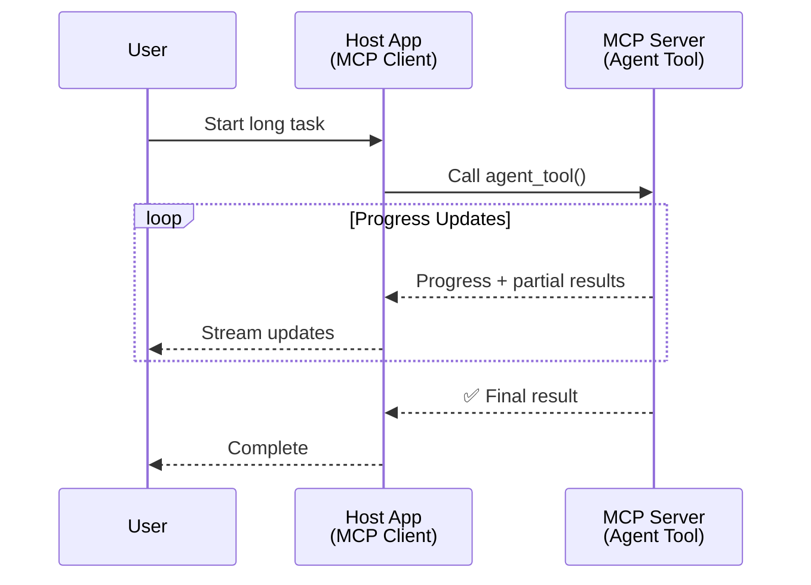
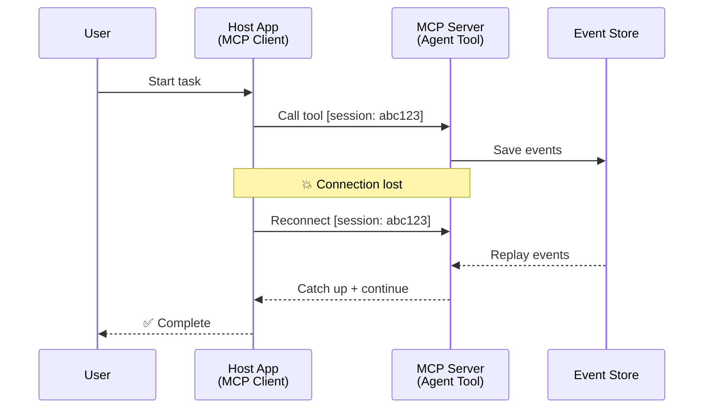
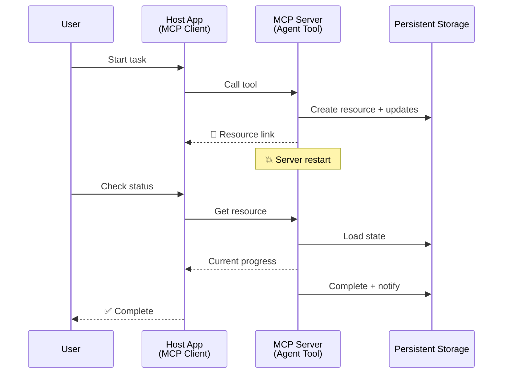
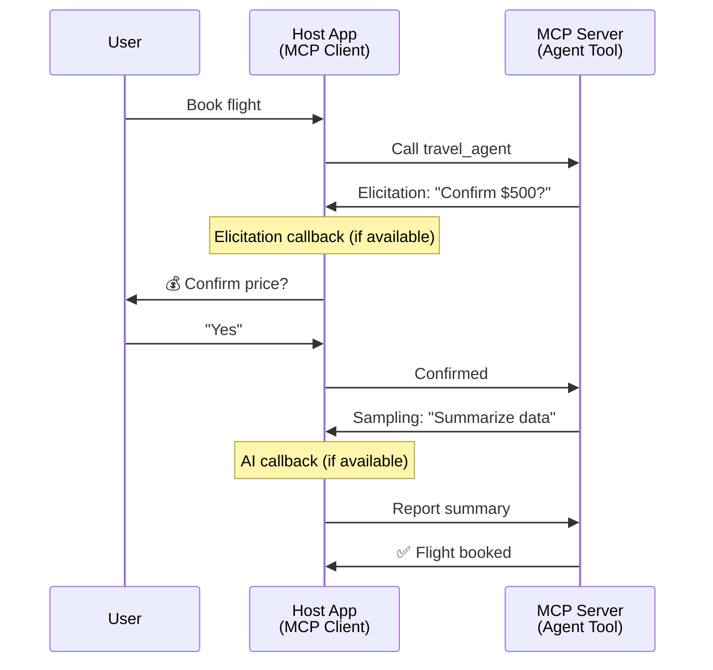

<!--
CO_OP_TRANSLATOR_METADATA:
{
  "original_hash": "5cc6836626047aa055e8960c8484a7d0",
  "translation_date": "2025-08-29T13:25:16+00:00",
  "source_file": "11-agentic-protocols/code_samples/mcp-agents/README.md",
  "language_code": "bn"
}
-->
# MCP ব্যবহার করে এজেন্ট-টু-এজেন্ট যোগাযোগ ব্যবস্থা তৈরি করা

> TL;DR - MCP-তে Agent2Agent যোগাযোগ তৈরি করা সম্ভব? হ্যাঁ!

MCP তার মূল লক্ষ্য "LLMs-কে প্রসঙ্গ প্রদান করা" থেকে অনেক দূর এগিয়েছে। সাম্প্রতিক উন্নয়ন যেমন [resumable streams](https://modelcontextprotocol.io/docs/concepts/transports#resumability-and-redelivery), [elicitation](https://modelcontextprotocol.io/specification/2025-06-18/client/elicitation), [sampling](https://modelcontextprotocol.io/specification/2025-06-18/client/sampling), এবং নোটিফিকেশন ([progress](https://modelcontextprotocol.io/specification/2025-06-18/basic/utilities/progress) এবং [resources](https://modelcontextprotocol.io/specification/2025-06-18/schema#resourceupdatednotification)) MCP-কে জটিল এজেন্ট-টু-এজেন্ট যোগাযোগ ব্যবস্থা তৈরির জন্য একটি শক্তিশালী ভিত্তি প্রদান করেছে।

## এজেন্ট/টুল সম্পর্কে ভুল ধারণা

যখন আরও বেশি ডেভেলপাররা এজেন্টিক আচরণযুক্ত টুল (দীর্ঘ সময় ধরে চলতে পারে, মাঝপথে অতিরিক্ত ইনপুট প্রয়োজন হতে পারে ইত্যাদি) অন্বেষণ করেন, তখন একটি সাধারণ ভুল ধারণা হয় যে MCP এই ধরনের ব্যবস্থার জন্য উপযুক্ত নয়। এর কারণ MCP-এর প্রাথমিক টুল প্রিমিটিভ উদাহরণগুলো সাধারণত সহজ অনুরোধ-প্রতিক্রিয়া প্যাটার্নের উপর ভিত্তি করে ছিল।

এই ধারণা এখন পুরনো। MCP স্পেসিফিকেশন গত কয়েক মাসে উল্লেখযোগ্যভাবে উন্নত হয়েছে, যা দীর্ঘমেয়াদী এজেন্টিক আচরণ তৈরির জন্য প্রয়োজনীয় ক্ষমতাগুলোর ফাঁক পূরণ করেছে:

- **স্ট্রিমিং এবং আংশিক ফলাফল**: কার্য সম্পাদনের সময় রিয়েল-টাইম অগ্রগতি আপডেট
- **পুনরায় সংযোগযোগ্যতা**: সংযোগ বিচ্ছিন্ন হওয়ার পর ক্লায়েন্ট পুনরায় সংযোগ করতে পারে এবং কাজ চালিয়ে যেতে পারে
- **টেকসইতা**: সার্ভার রিস্টার্টের পরেও ফলাফল টিকে থাকে (যেমন, রিসোর্স লিঙ্কের মাধ্যমে)
- **মাল্টি-টার্ন**: কার্য সম্পাদনের মাঝপথে ইন্টারঅ্যাকটিভ ইনপুট

এই বৈশিষ্ট্যগুলো MCP প্রোটোকলের উপর ভিত্তি করে জটিল এজেন্টিক এবং মাল্টি-এজেন্ট অ্যাপ্লিকেশন তৈরি করতে সক্ষম।

রেফারেন্সের জন্য, আমরা একটি এজেন্টকে "টুল" হিসেবে উল্লেখ করব যা MCP সার্ভারে উপলব্ধ। এর অর্থ একটি হোস্ট অ্যাপ্লিকেশনের অস্তিত্ব, যা MCP ক্লায়েন্ট বাস্তবায়ন করে, MCP সার্ভারের সাথে একটি সেশন স্থাপন করে এবং এজেন্টকে কল করতে পারে।

## MCP টুলকে "এজেন্টিক" কী করে তোলে?

বাস্তবায়নে যাওয়ার আগে, দীর্ঘমেয়াদী এজেন্টকে সমর্থন করার জন্য কী ধরনের অবকাঠামো ক্ষমতা প্রয়োজন তা নির্ধারণ করা যাক।

> আমরা একটি এজেন্টকে এমন একটি সত্তা হিসেবে সংজ্ঞায়িত করব যা দীর্ঘ সময় ধরে স্বয়ংক্রিয়ভাবে কাজ করতে পারে, জটিল কাজ পরিচালনা করতে সক্ষম যা একাধিক ইন্টারঅ্যাকশন বা রিয়েল-টাইম ফিডব্যাকের উপর ভিত্তি করে সমন্বয় প্রয়োজন হতে পারে।

### ১. স্ট্রিমিং এবং আংশিক ফলাফল

দীর্ঘমেয়াদী কাজের জন্য ঐতিহ্যবাহী অনুরোধ-প্রতিক্রিয়া প্যাটার্ন কাজ করে না। এজেন্টদের প্রয়োজন:

- রিয়েল-টাইম অগ্রগতি আপডেট
- মধ্যবর্তী ফলাফল

**MCP সমর্থন**: রিসোর্স আপডেট নোটিফিকেশন আংশিক ফলাফল স্ট্রিমিং সক্ষম করে, যদিও এটি JSON-RPC-এর ১:১ অনুরোধ/প্রতিক্রিয়া মডেলের সাথে সংঘর্ষ এড়াতে সাবধানে ডিজাইন করা প্রয়োজন।

| বৈশিষ্ট্য                  | ব্যবহার ক্ষেত্র                                                                                                                                                                       | MCP সমর্থন                                                                                |
| -------------------------- | ------------------------------------------------------------------------------------------------------------------------------------------------------------------------------ | ------------------------------------------------------------------------------------------ |
| রিয়েল-টাইম অগ্রগতি আপডেট | ব্যবহারকারী একটি কোডবেস মাইগ্রেশন কাজের অনুরোধ করে। এজেন্ট অগ্রগতি স্ট্রিম করে: "১০% - ডিপেন্ডেন্সি বিশ্লেষণ করা হচ্ছে... ২৫% - টাইপস্ক্রিপ্ট ফাইল রূপান্তর করা হচ্ছে... ৫০% - ইমপোর্ট আপডেট করা হচ্ছে..."          | ✅ অগ্রগতি নোটিফিকেশন                                                                  |
| আংশিক ফলাফল            | "একটি বই তৈরি করুন" কাজটি আংশিক ফলাফল স্ট্রিম করে, যেমন ১) গল্পের আর্ক আউটলাইন, ২) অধ্যায়ের তালিকা, ৩) প্রতিটি অধ্যায় সম্পন্ন হওয়ার সাথে সাথে। হোস্ট যে কোনো পর্যায়ে পরিদর্শন, বাতিল বা পুনঃনির্দেশ করতে পারে। | ✅ নোটিফিকেশন "বর্ধিত" হতে পারে আংশিক ফলাফল অন্তর্ভুক্ত করতে, PR 383, 776 প্রস্তাব দেখুন |

<div align="center" style="font-style: italic; font-size: 0.95em; margin-bottom: 0.5em;">
<strong>চিত্র ১:</strong> এই ডায়াগ্রামটি দেখায় কীভাবে MCP এজেন্ট দীর্ঘমেয়াদী কাজের সময় হোস্ট অ্যাপ্লিকেশনে রিয়েল-টাইম অগ্রগতি আপডেট এবং আংশিক ফলাফল স্ট্রিম করে, ব্যবহারকারীকে কার্য সম্পাদনের সময় পর্যবেক্ষণ করতে সক্ষম করে।
</div>



### ২. পুনরায় সংযোগযোগ্যতা

এজেন্টদের নেটওয়ার্ক বিঘ্নকে দক্ষতার সাথে পরিচালনা করতে হবে:

- সংযোগ বিচ্ছিন্ন হওয়ার পর পুনরায় সংযোগ
- যেখানে থেমেছিল সেখান থেকে চালিয়ে যাওয়া (বার্তা পুনঃপ্রেরণ)

**MCP সমর্থন**: MCP StreamableHTTP ট্রান্সপোর্ট বর্তমানে সেশন পুনরায় সংযোগ এবং বার্তা পুনঃপ্রেরণ সেশন আইডি এবং শেষ ইভেন্ট আইডি সহ সমর্থন করে। এখানে গুরুত্বপূর্ণ বিষয় হল সার্ভারকে একটি EventStore বাস্তবায়ন করতে হবে যা ক্লায়েন্ট পুনরায় সংযোগের সময় ইভেন্ট পুনরায় চালানোর অনুমতি দেয়।  
এখানে একটি সম্প্রদায় প্রস্তাব (PR #975) রয়েছে যা ট্রান্সপোর্ট-অ্যাগনস্টিক পুনরায় সংযোগযোগ্য স্ট্রিম অন্বেষণ করে।

| বৈশিষ্ট্য      | ব্যবহার ক্ষেত্র                                                                                                                                                   | MCP সমর্থন                                                                |
| ------------ | ---------------------------------------------------------------------------------------------------------------------------------------------------------- | -------------------------------------------------------------------------- |
| পুনরায় সংযোগযোগ্যতা | দীর্ঘমেয়াদী কাজের সময় ক্লায়েন্ট সংযোগ বিচ্ছিন্ন হয়। পুনরায় সংযোগের পর, সেশন পুনরায় শুরু হয় এবং মিস হওয়া ইভেন্টগুলো পুনরায় চালানো হয়, নির্বিঘ্নে যেখানে থেমেছিল সেখান থেকে চালিয়ে যায়। | ✅ StreamableHTTP ট্রান্সপোর্ট সেশন আইডি, ইভেন্ট পুনরায় চালানো এবং EventStore সহ |

<div align="center" style="font-style: italic; font-size: 0.95em; margin-bottom: 0.5em;">
<strong>চিত্র ২:</strong> এই ডায়াগ্রামটি দেখায় কীভাবে MCP-এর StreamableHTTP ট্রান্সপোর্ট এবং ইভেন্ট স্টোর সেশন পুনরায় সংযোগ সক্ষম করে: যদি ক্লায়েন্ট সংযোগ বিচ্ছিন্ন হয়, এটি পুনরায় সংযোগ করতে পারে এবং মিস হওয়া ইভেন্টগুলো পুনরায় চালাতে পারে, কার্যক্রমে কোনো অগ্রগতি হারানো ছাড়াই।
</div>



### ৩. টেকসইতা

দীর্ঘমেয়াদী এজেন্টদের স্থায়ী অবস্থা প্রয়োজন:

- ফলাফল সার্ভার রিস্টার্টের পরেও টিকে থাকে
- স্ট্যাটাস বাইরের মাধ্যমে পুনরুদ্ধার করা যায়
- সেশন জুড়ে অগ্রগতি ট্র্যাকিং

**MCP সমর্থন**: MCP এখন টুল কলের জন্য একটি রিসোর্স লিঙ্ক রিটার্ন টাইপ সমর্থন করে। আজ, একটি সম্ভাব্য প্যাটার্ন হল একটি টুল ডিজাইন করা যা একটি রিসোর্স তৈরি করে এবং তাৎক্ষণিকভাবে একটি রিসোর্স লিঙ্ক প্রদান করে। টুলটি ব্যাকগ্রাউন্ডে কাজ চালিয়ে যেতে পারে এবং রিসোর্স আপডেট করতে পারে। পরিবর্তে, ক্লায়েন্ট এই রিসোর্সের স্টেট পোল করতে পারে আংশিক বা সম্পূর্ণ ফলাফল পেতে (যে রিসোর্স আপডেটগুলো সার্ভার প্রদান করে তার উপর ভিত্তি করে) বা আপডেট নোটিফিকেশনের জন্য রিসোর্স সাবস্ক্রাইব করতে পারে।

এখানে একটি সীমাবদ্ধতা হল যে রিসোর্স পোলিং বা আপডেটের জন্য সাবস্ক্রাইব করা স্কেলে প্রভাব সহ সম্পদ ব্যবহার করতে পারে। এখানে একটি সম্প্রদায় প্রস্তাব (যেমন #992) রয়েছে যা ওয়েবহুক বা ট্রিগার অন্তর্ভুক্ত করার সম্ভাবনা অন্বেষণ করে যা সার্ভার ক্লায়েন্ট/হোস্ট অ্যাপ্লিকেশনকে আপডেটের জন্য কল করতে পারে।

| বৈশিষ্ট্য    | ব্যবহার ক্ষেত্র                                                                                                                                        | MCP সমর্থন                                                        |
| ---------- | ----------------------------------------------------------------------------------------------------------------------------------------------- | ------------------------------------------------------------------ |
| টেকসইতা | ডেটা মাইগ্রেশন কাজের সময় সার্ভার ক্র্যাশ করে। ফলাফল এবং অগ্রগতি রিস্টার্টের পরেও টিকে থাকে, ক্লায়েন্ট স্ট্যাটাস চেক করতে পারে এবং স্থায়ী রিসোর্স থেকে চালিয়ে যেতে পারে। | ✅ রিসোর্স লিঙ্ক স্থায়ী স্টোরেজ এবং স্ট্যাটাস নোটিফিকেশন সহ |

আজ, একটি সাধারণ প্যাটার্ন হল একটি টুল ডিজাইন করা যা একটি রিসোর্স তৈরি করে এবং তাৎক্ষণিকভাবে একটি রিসোর্স লিঙ্ক প্রদান করে। টুলটি ব্যাকগ্রাউন্ডে কাজ চালিয়ে যেতে পারে, রিসোর্স নোটিফিকেশন প্রদান করতে পারে যা অগ্রগতি আপডেট হিসেবে কাজ করে বা আংশিক ফলাফল অন্তর্ভুক্ত করতে পারে এবং প্রয়োজন অনুযায়ী রিসোর্সের বিষয়বস্তু আপডেট করতে পারে।

<div align="center" style="font-style: italic; font-size: 0.95em; margin-bottom: 0.5em;">
<strong>চিত্র ৩:</strong> এই ডায়াগ্রামটি দেখায় কীভাবে MCP এজেন্ট স্থায়ী রিসোর্স এবং স্ট্যাটাস নোটিফিকেশন ব্যবহার করে দীর্ঘমেয়াদী কাজগুলো সার্ভার রিস্টার্টের পরেও টিকে থাকে, ক্লায়েন্টকে অগ্রগতি চেক করতে এবং ব্যর্থতার পরেও ফলাফল পুনরুদ্ধার করতে সক্ষম করে।
</div>



### ৪. মাল্টি-টার্ন ইন্টারঅ্যাকশন

এজেন্টদের কার্য সম্পাদনের মাঝপথে অতিরিক্ত ইনপুট প্রয়োজন হতে পারে:

- মানব স্পষ্টীকরণ বা অনুমোদন
- জটিল সিদ্ধান্তের জন্য AI সহায়তা
- গতিশীল প্যারামিটার সমন্বয়

**MCP সমর্থন**: সম্পূর্ণভাবে সমর্থিত স্যাম্পলিং (AI ইনপুটের জন্য) এবং এলিসিটেশন (মানব ইনপুটের জন্য) এর মাধ্যমে।

| বৈশিষ্ট্য                 | ব্যবহার ক্ষেত্র                                                                                                                                     | MCP সমর্থন                                           |
| ----------------------- | -------------------------------------------------------------------------------------------------------------------------------------------- | ----------------------------------------------------- |
| মাল্টি-টার্ন ইন্টারঅ্যাকশন | ভ্রমণ বুকিং এজেন্ট ব্যবহারকারীর কাছ থেকে মূল্য নিশ্চিতকরণ অনুরোধ করে, তারপর AI-কে ভ্রমণ ডেটা সংক্ষিপ্ত করতে বলে, এবং তারপর বুকিং লেনদেন সম্পন্ন করে। | ✅ মানব ইনপুটের জন্য এলিসিটেশন, AI ইনপুটের জন্য স্যাম্পলিং |

<div align="center" style="font-style: italic; font-size: 0.95em; margin-bottom: 0.5em;">
<strong>চিত্র ৪:</strong> এই ডায়াগ্রামটি দেখায় কীভাবে MCP এজেন্ট কার্য সম্পাদনের মাঝপথে ইন্টারঅ্যাকটিভভাবে মানব ইনপুট সংগ্রহ করতে বা AI সহায়তা অনুরোধ করতে পারে, জটিল, মাল্টি-টার্ন ওয়ার্কফ্লো যেমন নিশ্চিতকরণ এবং গতিশীল সিদ্ধান্ত গ্রহণ সমর্থন করে।
</div>



## MCP-তে দীর্ঘমেয়াদী এজেন্ট বাস্তবায়ন - কোড ওভারভিউ

এই নিবন্ধের অংশ হিসেবে, আমরা একটি [কোড রিপোজিটরি](https://github.com/victordibia/ai-tutorials/tree/main/MCP%20Agents) প্রদান করেছি যা MCP Python SDK ব্যবহার করে StreamableHTTP ট্রান্সপোর্টের মাধ্যমে সেশন পুনরায় সংযোগ এবং বার্তা পুনঃপ্রেরণ সহ দীর্ঘমেয়াদী এজেন্ট বাস্তবায়নের সম্পূর্ণ উদাহরণ অন্তর্ভুক্ত করে। বাস্তবায়নটি দেখায় কীভাবে MCP ক্ষমতাগুলোকে সংযুক্ত করে উন্নত এজেন্ট-সদৃশ আচরণ সক্ষম করা যায়।

বিশেষভাবে, আমরা দুটি প্রধান এজেন্ট টুল সহ একটি সার্ভার বাস্তবায়ন করেছি:

- **ট্রাভেল এজেন্ট** - এলিসিটেশনের মাধ্যমে মূল্য নিশ্চিতকরণ সহ একটি ভ্রমণ বুকিং পরিষেবা অনুকরণ করে
- **রিসার্চ এজেন্ট** - স্যাম্পলিংয়ের মাধ্যমে AI-সহায়ক সারাংশ সহ গবেষণা কাজ সম্পাদন করে

উভয় এজেন্ট রিয়েল-টাইম অগ্রগতি আপডেট, ইন্টারঅ্যাকটিভ নিশ্চিতকরণ এবং সম্পূর্ণ সেশন পুনরায় সংযোগ সক্ষমতা প্রদর্শন করে।

### মূল বাস্তবায়ন ধারণা

নিম্নলিখিত বিভাগগুলো প্রতিটি ক্ষমতার জন্য সার্ভার-সাইড এজেন্ট বাস্তবায়ন এবং ক্লায়েন্ট-সাইড হোস্ট পরিচালনা দেখায়:

#### স্ট্রিমিং এবং অগ্রগতি আপডেট - রিয়েল-টাইম কাজের স্ট্যাটাস

স্ট্রিমিং এজেন্টদের দীর্ঘমেয়াদী কাজের সময় রিয়েল-টাইম অগ্রগতি আপডেট প্রদান করতে সক্ষম করে, ব্যবহারকারীদের কাজের স্ট্যাটাস এবং মধ্যবর্তী ফলাফল সম্পর্কে অবহিত রাখে।

**সার্ভার বাস্তবায়ন (এজেন্ট অগ্রগতি নোটিফিকেশন পাঠায়):**

```python
# From server/server.py - Travel agent sending progress updates
for i, step in enumerate(steps):
    await ctx.session.send_progress_notification(
        progress_token=ctx.request_id,
        progress=i * 25,
        total=100,
        message=step,
        related_request_id=str(ctx.request_id)
    )
    await anyio.sleep(2)  # Simulate work

# Alternative: Log messages for detailed step-by-step updates
await ctx.session.send_log_message(
    level="info",
    data=f"Processing step {current_step}/{steps} ({progress_percent}%)",
    logger="long_running_agent",
    related_request_id=ctx.request_id,
)
```

**ক্লায়েন্ট বাস্তবায়ন (হোস্ট অগ্রগতি আপডেট গ্রহণ করে):**

```python
# From client/client.py - Client handling real-time notifications
async def message_handler(message) -> None:
    if isinstance(message, types.ServerNotification):
        if isinstance(message.root, types.LoggingMessageNotification):
            console.print(f"📡 [dim]{message.root.params.data}[/dim]")
        elif isinstance(message.root, types.ProgressNotification):
            progress = message.root.params
            console.print(f"🔄 [yellow]{progress.message} ({progress.progress}/{progress.total})[/yellow]")

# Register message handler when creating session
async with ClientSession(
    read_stream, write_stream,
    message_handler=message_handler
) as session:
```

#### এলিসিটেশন - ব্যবহারকারীর ইনপুট অনুরোধ করা

এলিসিটেশন এজেন্টদের কার্য সম্পাদনের মাঝপথে ব্যবহারকারীর ইনপুট অনুরোধ করতে সক্ষম করে। এটি দীর্ঘমেয়াদী কাজের সময় নিশ্চিতকরণ, স্পষ্টীকরণ বা অনুমোদনের জন্য অপরিহ

## Getting Started

Ready to build your own agent2agent system? Follow these steps:

### 1. Run the Demo

```bash
# Start the server with event store for resumption
python -m server.server --port 8006

# In another terminal, run the interactive client
python -m client.client --url http://127.0.0.1:8006/mcp
```

**Available commands in interactive mode:**

- `travel_agent` - Book travel with price confirmation via elicitation
- `research_agent` - Research topics with AI-assisted summaries via sampling
- `list` - Show all available tools
- `clean-tokens` - Clear resumption tokens
- `help` - Show detailed command help
- `quit` - Exit the client

### 2. Test Resumption Capabilities

- Start a long-running agent (e.g., `travel_agent`)
- Interrupt the client during execution (Ctrl+C)
- Restart the client - it will automatically resume from where it left off

### 3. Explore and Extend

- **Explore the examples**: Check out this [mcp-agents](https://github.com/victordibia/ai-tutorials/tree/main/MCP%20Agents)
- **Join the community**: Participate in MCP discussions on GitHub
- **Experiment**: Start with a simple long-running task and gradually add streaming, resumability, and multi-agent coordination

This demonstrates how MCP enables intelligent agent behaviors while maintaining tool-based simplicity.

Overall, the MCP protocol spec is evolving rapidly; the reader is encouraged to review the official documentation website for the most recent updates - https://modelcontextprotocol.io/introduction

---

**অস্বীকৃতি**:  
এই নথিটি AI অনুবাদ পরিষেবা [Co-op Translator](https://github.com/Azure/co-op-translator) ব্যবহার করে অনুবাদ করা হয়েছে। আমরা যথাসম্ভব সঠিক অনুবাদের চেষ্টা করি, তবে অনুগ্রহ করে মনে রাখবেন যে স্বয়ংক্রিয় অনুবাদে ত্রুটি বা অসঙ্গতি থাকতে পারে। নথিটির মূল ভাষায় লেখা সংস্করণটিকেই প্রামাণিক উৎস হিসেবে বিবেচনা করা উচিত। গুরুত্বপূর্ণ তথ্যের জন্য, পেশাদার মানব অনুবাদ ব্যবহার করার পরামর্শ দেওয়া হচ্ছে। এই অনুবাদ ব্যবহারের ফলে সৃষ্ট কোনো ভুল বোঝাবুঝি বা ভুল ব্যাখ্যার জন্য আমরা দায়ী নই।