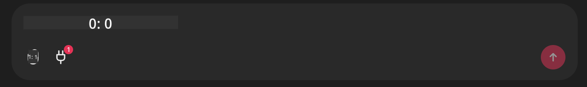

<!--
CO_OP_TRANSLATOR_METADATA:
{
  "original_hash": "9bf0395cbc541ce8db2a9699c8678dfc",
  "translation_date": "2025-07-12T14:21:20+00:00",
  "source_file": "11-mcp/code_samples/github-mcp/README.md",
  "language_code": "bn"
}
-->
# Github MCP সার্ভার উদাহরণ

## বর্ণনা

এটি Microsoft Reactor-এর মাধ্যমে আয়োজিত AI Agents Hackathon-এর জন্য তৈরি একটি ডেমো।

এই টুলটি ব্যবহারকারীর Github রিপোজিটরি অনুযায়ী হ্যাকাথন প্রকল্পের সুপারিশ করতে ব্যবহৃত হয়।  
এটি করা হয়:

1. **Github Agent** - Github MCP সার্ভার ব্যবহার করে রিপোজ এবং সেই রিপোজ সম্পর্কিত তথ্য সংগ্রহ করা।
2. **Hackathon Agent** - Github Agent থেকে প্রাপ্ত তথ্য নিয়ে ব্যবহারকারীর প্রকল্প, ব্যবহৃত ভাষা এবং AI Agents হ্যাকাথন প্রকল্প ট্র্যাকের ভিত্তিতে সৃজনশীল হ্যাকাথন প্রকল্পের আইডিয়া তৈরি করে।
3. **Events Agent** - Hackathon Agent-এর প্রস্তাবনার ভিত্তিতে, Events Agent AI Agent Hackathon সিরিজের প্রাসঙ্গিক ইভেন্টের সুপারিশ করে।

## কোড চালানো

### পরিবেশ ভেরিয়েবল

এই ডেমোতে Azure Open AI Service, Semantic Kernel, Github MCP Server এবং Azure AI Search ব্যবহার করা হয়েছে।

এই টুলগুলো ব্যবহার করার জন্য নিশ্চিত করুন যে আপনার সঠিক পরিবেশ ভেরিয়েবল সেট করা আছে:

```python
AZURE_OPENAI_CHAT_DEPLOYMENT_NAME=""
AZURE_OPENAI_EMBEDDING_DEPLOYMENT_NAME=""
AZURE_OPENAI_ENDPOINT=""
AZURE_OPENAI_API_KEY=""
AZURE_OPENAI_API_VERSION=""
AZURE_SEARCH_SERVICE_ENDPOINT=""
AZURE_SEARCH_API_KEY=""
```

## Chainlit সার্ভার চালানো

MCP সার্ভারের সাথে সংযোগ করার জন্য, এই ডেমোতে Chainlit কে চ্যাট ইন্টারফেস হিসেবে ব্যবহার করা হয়েছে।

সার্ভার চালানোর জন্য, আপনার টার্মিনালে নিচের কমান্ডটি ব্যবহার করুন:

```bash
chainlit run app.py -w
```

এটি আপনার Chainlit সার্ভার `localhost:8000` এ চালু করবে এবং একই সাথে Azure AI Search Index-এ `event-descriptions.md` এর বিষয়বস্তু আপলোড করবে।

## MCP সার্ভারের সাথে সংযোগ

Github MCP সার্ভারের সাথে সংযোগ করার জন্য, "Type your message here.." চ্যাট বক্সের নিচে থাকা "plug" আইকনে ক্লিক করুন:



সেখান থেকে "Connect an MCP" এ ক্লিক করে Github MCP সার্ভারের সাথে সংযোগের কমান্ড যোগ করুন:

```bash
npx -y @modelcontextprotocol/server-github --env GITHUB_PERSONAL_ACCESS_TOKEN=[YOUR PERSONAL ACCESS TOKEN]
```

"[YOUR PERSONAL ACCESS TOKEN]" এর জায়গায় আপনার প্রকৃত Personal Access Token বসান।

সংযোগ সফল হলে plug আইকনের পাশে (1) দেখা যাবে যা সংযোগ নিশ্চিত করবে। যদি না দেখে, তাহলে `chainlit run app.py -w` কমান্ড দিয়ে Chainlit সার্ভার রিস্টার্ট করার চেষ্টা করুন।

## ডেমো ব্যবহার

হ্যাকাথন প্রকল্পের সুপারিশের এজেন্ট ওয়ার্কফ্লো শুরু করতে, আপনি নিচের মতো একটি মেসেজ টাইপ করতে পারেন:

"Recommend hackathon projects for the Github user koreyspace"

Router Agent আপনার অনুরোধ বিশ্লেষণ করে নির্ধারণ করবে কোন এজেন্টের (GitHub, Hackathon, এবং Events) সমন্বয় আপনার প্রশ্নের জন্য সবচেয়ে উপযুক্ত। এজেন্টগুলো একসাথে কাজ করে GitHub রিপোজিটরি বিশ্লেষণ, প্রকল্প আইডিয়া এবং প্রাসঙ্গিক প্রযুক্তি ইভেন্টের ভিত্তিতে পূর্ণাঙ্গ সুপারিশ প্রদান করে।

**অস্বীকৃতি**:  
এই নথিটি AI অনুবাদ সেবা [Co-op Translator](https://github.com/Azure/co-op-translator) ব্যবহার করে অনূদিত হয়েছে। আমরা যথাসাধ্য সঠিকতার চেষ্টা করি, তবে স্বয়ংক্রিয় অনুবাদে ত্রুটি বা অসঙ্গতি থাকতে পারে। মূল নথিটি তার নিজস্ব ভাষায়ই কর্তৃত্বপূর্ণ উৎস হিসেবে বিবেচিত হওয়া উচিত। গুরুত্বপূর্ণ তথ্যের জন্য পেশাদার মানব অনুবাদ গ্রহণ করার পরামর্শ দেওয়া হয়। এই অনুবাদের ব্যবহারে সৃষ্ট কোনো ভুল বোঝাবুঝি বা ভুল ব্যাখ্যার জন্য আমরা দায়ী নই।