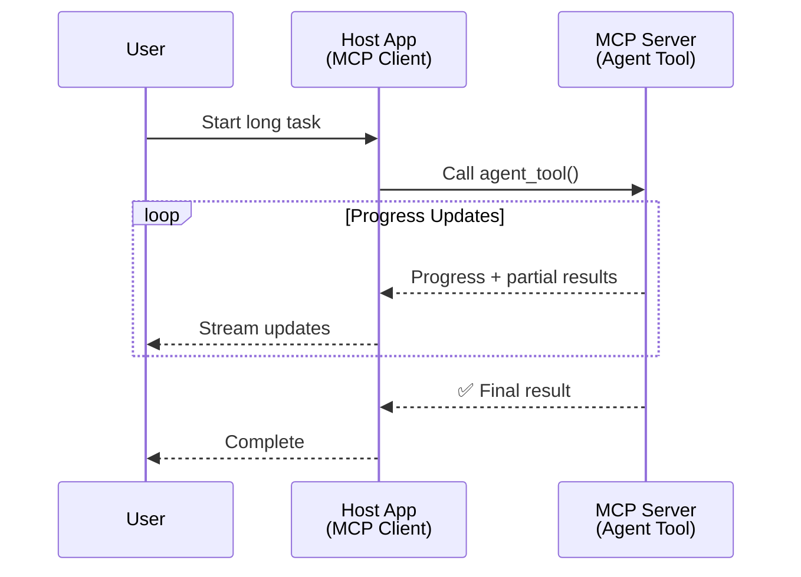
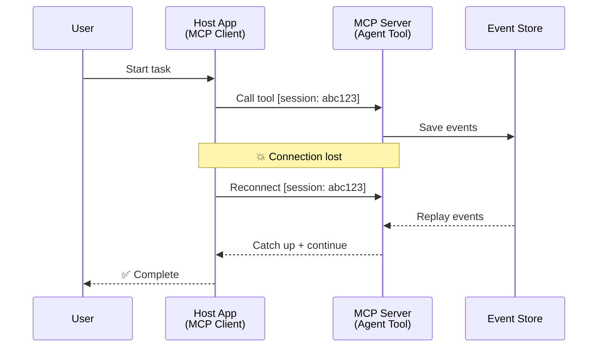
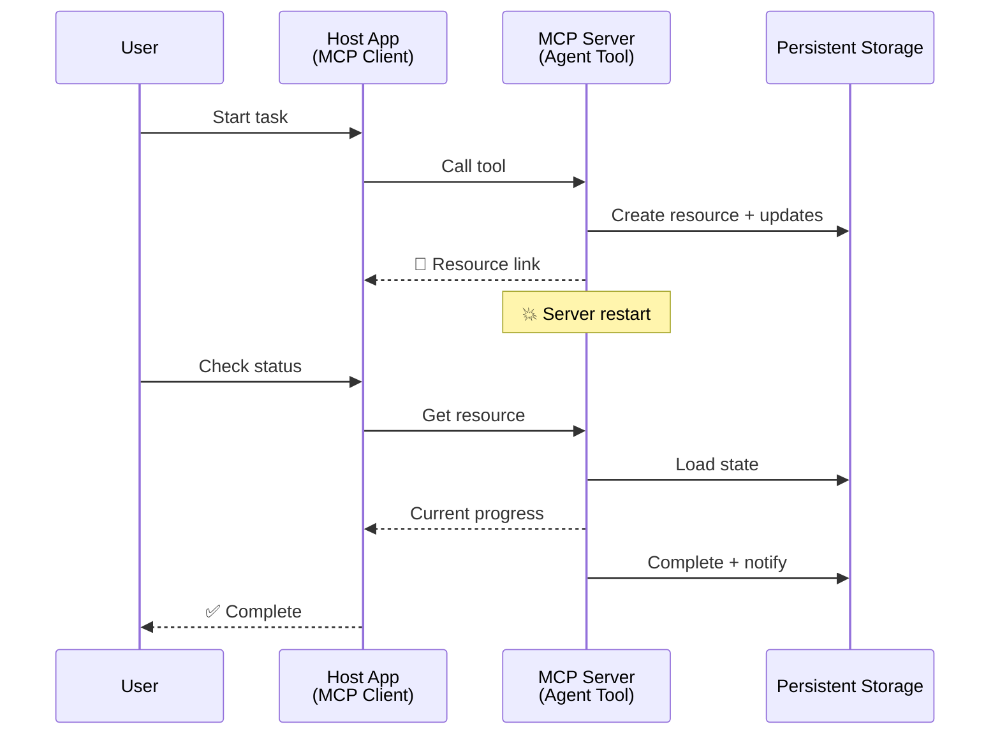
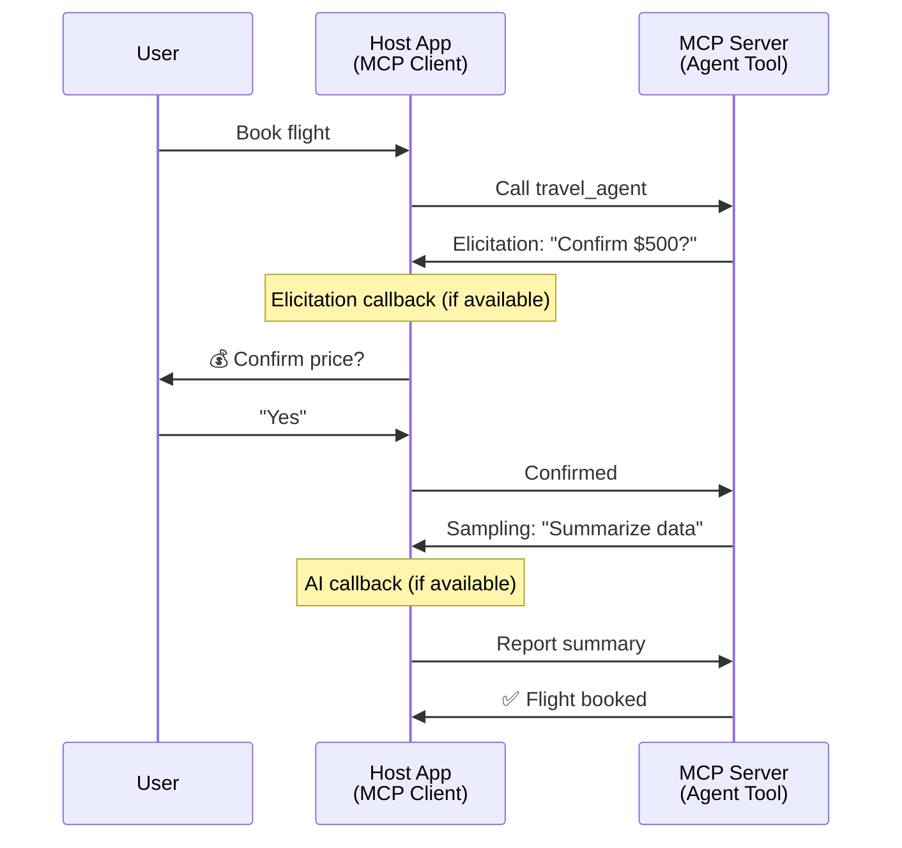

<!--
CO_OP_TRANSLATOR_METADATA:
{
  "original_hash": "5cc6836626047aa055e8960c8484a7d0",
  "translation_date": "2025-08-21T14:28:24+00:00",
  "source_file": "11-mcp/code_samples/mcp-agents/README.md",
  "language_code": "bn"
}
-->
# MCP দিয়ে এজেন্ট-টু-এজেন্ট যোগাযোগ ব্যবস্থা তৈরি করা

> সংক্ষেপে - MCP দিয়ে Agent2Agent যোগাযোগ তৈরি করা সম্ভব? হ্যাঁ!

MCP তার মূল লক্ষ্য "LLMs-কে প্রসঙ্গ প্রদান করা" থেকে অনেক দূর এগিয়েছে। সাম্প্রতিক উন্নয়ন যেমন [resumable streams](https://modelcontextprotocol.io/docs/concepts/transports#resumability-and-redelivery), [elicitation](https://modelcontextprotocol.io/specification/2025-06-18/client/elicitation), [sampling](https://modelcontextprotocol.io/specification/2025-06-18/client/sampling), এবং নোটিফিকেশন ([progress](https://modelcontextprotocol.io/specification/2025-06-18/basic/utilities/progress) এবং [resources](https://modelcontextprotocol.io/specification/2025-06-18/schema#resourceupdatednotification)) অন্তর্ভুক্ত করার মাধ্যমে, MCP এখন জটিল এজেন্ট-টু-এজেন্ট যোগাযোগ ব্যবস্থা তৈরির জন্য একটি শক্তিশালী ভিত্তি প্রদান করে।

## এজেন্ট/টুল নিয়ে ভুল ধারণা

যখন আরও বেশি ডেভেলপার এজেন্টিক আচরণযুক্ত টুল (যেমন দীর্ঘ সময় ধরে চলা, মাঝপথে অতিরিক্ত ইনপুট প্রয়োজন ইত্যাদি) নিয়ে পরীক্ষা করছেন, তখন একটি সাধারণ ভুল ধারণা হলো MCP এই ধরনের ব্যবস্থার জন্য উপযুক্ত নয়। এর কারণ প্রাথমিক উদাহরণগুলোতে এর টুল প্রিমিটিভ শুধুমাত্র সহজ অনুরোধ-উত্তর প্যাটার্নে সীমাবদ্ধ ছিল।

এই ধারণা এখন পুরনো। MCP স্পেসিফিকেশন সাম্প্রতিক মাসগুলোতে উল্লেখযোগ্যভাবে উন্নত হয়েছে, যা দীর্ঘমেয়াদী এজেন্টিক আচরণ তৈরির জন্য প্রয়োজনীয় ফিচারগুলো সরবরাহ করে:

- **স্ট্রিমিং এবং আংশিক ফলাফল**: কার্য সম্পাদনের সময় রিয়েল-টাইম অগ্রগতি আপডেট
- **পুনরায় সংযোগযোগ্যতা**: সংযোগ বিচ্ছিন্ন হওয়ার পর পুনরায় সংযোগ এবং কাজ চালিয়ে যাওয়া
- **টেকসইতা**: সার্ভার রিস্টার্টের পরেও ফলাফল টিকে থাকে (যেমন রিসোর্স লিঙ্কের মাধ্যমে)
- **মাল্টি-টার্ন**: কার্য সম্পাদনের মাঝপথে ইন্টারেক্টিভ ইনপুট

এই ফিচারগুলো একত্রিত করে জটিল এজেন্টিক এবং মাল্টি-এজেন্ট অ্যাপ্লিকেশন তৈরি করা সম্ভব, যা MCP প্রোটোকলে মোতায়েন করা যায়।

উল্লেখ্য, আমরা এখানে একটি এজেন্টকে "টুল" হিসেবে উল্লেখ করব, যা একটি MCP সার্ভারে উপলব্ধ। এর মানে হলো একটি হোস্ট অ্যাপ্লিকেশনের অস্তিত্ব, যা একটি MCP ক্লায়েন্ট হিসেবে কাজ করে, MCP সার্ভারের সাথে সেশন স্থাপন করে এবং এজেন্টকে কল করতে পারে।

## কীভাবে একটি MCP টুল "এজেন্টিক" হয়?

বাস্তবায়নে যাওয়ার আগে, দীর্ঘমেয়াদী এজেন্ট পরিচালনার জন্য কী ধরনের অবকাঠামোগত সক্ষমতা প্রয়োজন তা নির্ধারণ করা যাক।

> আমরা একটি এজেন্টকে এমন একটি সত্তা হিসেবে সংজ্ঞায়িত করব, যা দীর্ঘ সময় ধরে স্বয়ংক্রিয়ভাবে কাজ করতে পারে এবং জটিল কাজ সম্পাদন করতে সক্ষম, যা একাধিক ইন্টারঅ্যাকশন বা রিয়েল-টাইম ফিডব্যাকের ভিত্তিতে সমন্বয় প্রয়োজন হতে পারে।

### ১. স্ট্রিমিং এবং আংশিক ফলাফল

দীর্ঘমেয়াদী কাজের জন্য ঐতিহ্যবাহী অনুরোধ-উত্তর প্যাটার্ন কার্যকর নয়। এজেন্টদের প্রয়োজন:

- রিয়েল-টাইম অগ্রগতি আপডেট
- মধ্যবর্তী ফলাফল

**MCP সমর্থন**: রিসোর্স আপডেট নোটিফিকেশন স্ট্রিমিং আংশিক ফলাফল সক্ষম করে, যদিও এটি JSON-RPC-এর ১:১ অনুরোধ/উত্তর মডেলের সাথে সংঘর্ষ এড়াতে সতর্ক ডিজাইন প্রয়োজন।

| ফিচার                     | ব্যবহার ক্ষেত্র                                                                                                                                                                       | MCP সমর্থন                                                                                |
| -------------------------- | ----------------------------------------------------------------------------------------------------------------------------------------------------------------------------------- | ------------------------------------------------------------------------------------------ |
| রিয়েল-টাইম অগ্রগতি আপডেট | ব্যবহারকারী একটি কোডবেস মাইগ্রেশন কাজের অনুরোধ করে। এজেন্ট অগ্রগতি স্ট্রিম করে: "১০% - নির্ভরতা বিশ্লেষণ করা হচ্ছে... ২৫% - টাইপস্ক্রিপ্ট ফাইল রূপান্তর করা হচ্ছে... ৫০% - ইমপোর্ট আপডেট করা হচ্ছে..." | ✅ প্রগ্রেস নোটিফিকেশন                                                                  |
| আংশিক ফলাফল               | "একটি বই তৈরি করুন" কাজটি আংশিক ফলাফল স্ট্রিম করে, যেমন ১) গল্পের কাঠামো, ২) অধ্যায়ের তালিকা, ৩) প্রতিটি অধ্যায় সম্পন্ন হলে। হোস্ট যে কোনো পর্যায়ে পরিদর্শন, বাতিল বা পুনর্নির্দেশ করতে পারে। | ✅ নোটিফিকেশন "বর্ধিত" হতে পারে আংশিক ফলাফল অন্তর্ভুক্ত করতে, প্রস্তাবনা PR 383, 776 দেখুন |

<strong>চিত্র ১:</strong> এই ডায়াগ্রামটি দেখায় কীভাবে একটি MCP এজেন্ট দীর্ঘমেয়াদী কাজের সময় রিয়েল-টাইম অগ্রগতি আপডেট এবং আংশিক ফলাফল হোস্ট অ্যাপ্লিকেশনে স্ট্রিম করে, যা ব্যবহারকারীকে কার্য সম্পাদন রিয়েল-টাইমে পর্যবেক্ষণ করতে সক্ষম করে।

### ২. পুনরায় সংযোগযোগ্যতা

এজেন্টদের নেটওয়ার্ক বিঘ্নকে দক্ষতার সাথে পরিচালনা করতে হবে:

- সংযোগ বিচ্ছিন্ন হওয়ার পর পুনরায় সংযোগ
- যেখানে কাজ থেমে গিয়েছিল সেখান থেকে চালিয়ে যাওয়া (বার্তা পুনরায় ডেলিভারি)

**MCP সমর্থন**: MCP StreamableHTTP ট্রান্সপোর্ট বর্তমানে সেশন পুনরায় শুরু এবং বার্তা পুনরায় ডেলিভারি সমর্থন করে সেশন আইডি এবং শেষ ইভেন্ট আইডি ব্যবহার করে। এখানে গুরুত্বপূর্ণ বিষয় হলো সার্ভারকে একটি EventStore বাস্তবায়ন করতে হবে, যা ক্লায়েন্ট পুনরায় সংযোগের সময় ইভেন্ট রিপ্লে সক্ষম করে।  
উল্লেখ্য, একটি সম্প্রদায় প্রস্তাব (PR #975) রয়েছে যা ট্রান্সপোর্ট-অ্যাগনস্টিক পুনরায় সংযোগযোগ্য স্ট্রিম নিয়ে আলোচনা করে।

| ফিচার      | ব্যবহার ক্ষেত্র                                                                                                                                                   | MCP সমর্থন                                                                |
| ------------ | ---------------------------------------------------------------------------------------------------------------------------------------------------------- | -------------------------------------------------------------------------- |
| পুনরায় সংযোগযোগ্যতা | ক্লায়েন্ট দীর্ঘমেয়াদী কাজের সময় সংযোগ বিচ্ছিন্ন হয়। পুনরায় সংযোগের পর সেশন পুনরায় শুরু হয় এবং মিস হওয়া ইভেন্টগুলো রিপ্লে হয়, যেখানে কাজ থেমে গিয়েছিল সেখান থেকে নির্বিঘ্নে চালিয়ে যায়। | ✅ StreamableHTTP ট্রান্সপোর্ট সেশন আইডি, ইভেন্ট রিপ্লে এবং EventStore সহ |

<strong>চিত্র ২:</strong> এই ডায়াগ্রামটি দেখায় কীভাবে MCP-এর StreamableHTTP ট্রান্সপোর্ট এবং ইভেন্ট স্টোর সেশন পুনরায় শুরু সক্ষম করে: যদি ক্লায়েন্ট সংযোগ বিচ্ছিন্ন হয়, এটি পুনরায় সংযোগ করতে পারে এবং মিস হওয়া ইভেন্টগুলো রিপ্লে করতে পারে, কাজের অগ্রগতি হারানো ছাড়াই।

### ৩. টেকসইতা

দীর্ঘমেয়াদী এজেন্টদের স্থায়ী অবস্থা প্রয়োজন:

- ফলাফল সার্ভার রিস্টার্টের পরেও টিকে থাকে
- স্ট্যাটাস বাইরের মাধ্যমে পুনরুদ্ধার করা যায়
- সেশন জুড়ে অগ্রগতি ট্র্যাকিং

**MCP সমর্থন**: MCP এখন টুল কলের জন্য একটি রিসোর্স লিঙ্ক রিটার্ন টাইপ সমর্থন করে। আজকের দিনে একটি সম্ভাব্য প্যাটার্ন হলো এমন একটি টুল ডিজাইন করা যা একটি রিসোর্স তৈরি করে এবং সঙ্গে সঙ্গে একটি রিসোর্স লিঙ্ক রিটার্ন করে। টুলটি ব্যাকগ্রাউন্ডে কাজ চালিয়ে যেতে পারে এবং রিসোর্স আপডেট করতে পারে। অন্যদিকে, ক্লায়েন্ট এই রিসোর্সের স্টেট পোল করতে পারে আংশিক বা পূর্ণ ফলাফল পেতে (সার্ভার যে রিসোর্স আপডেট প্রদান করে তার উপর ভিত্তি করে) অথবা রিসোর্স আপডেটের জন্য সাবস্ক্রাইব করতে পারে।

এখানে একটি সীমাবদ্ধতা হলো রিসোর্স পোল করা বা আপডেটের জন্য সাবস্ক্রাইব করা স্কেলে প্রভাব ফেলতে পারে। একটি সম্প্রদায় প্রস্তাব (যেমন #992) রয়েছে যা সার্ভার ক্লায়েন্ট/হোস্ট অ্যাপ্লিকেশনকে আপডেটের জন্য নোটিফাই করতে ওয়েবহুক বা ট্রিগার অন্তর্ভুক্ত করার সম্ভাবনা নিয়ে আলোচনা করে।

| ফিচার    | ব্যবহার ক্ষেত্র                                                                                                                                        | MCP সমর্থন                                                        |
| ---------- | ----------------------------------------------------------------------------------------------------------------------------------------------- | ------------------------------------------------------------------ |
| টেকসইতা | সার্ভার ডেটা মাইগ্রেশন কাজের সময় ক্র্যাশ করে। ফলাফল এবং অগ্রগতি রিস্টার্টের পরেও টিকে থাকে, ক্লায়েন্ট স্ট্যাটাস চেক করতে পারে এবং স্থায়ী রিসোর্স থেকে কাজ চালিয়ে যেতে পারে। | ✅ রিসোর্স লিঙ্ক স্থায়ী স্টোরেজ এবং স্ট্যাটাস নোটিফিকেশন সহ |

আজকের দিনে একটি সাধারণ প্যাটার্ন হলো এমন একটি টুল ডিজাইন করা যা একটি রিসোর্স তৈরি করে এবং সঙ্গে সঙ্গে একটি রিসোর্স লিঙ্ক রিটার্ন করে। টুলটি ব্যাকগ্রাউন্ডে কাজ চালিয়ে যেতে পারে, রিসোর্স নোটিফিকেশন প্রদান করতে পারে যা অগ্রগতি আপডেট হিসেবে কাজ করে বা আংশিক ফলাফল অন্তর্ভুক্ত করতে পারে এবং প্রয়োজন অনুযায়ী রিসোর্সের কন্টেন্ট আপডেট করতে পারে।

<strong>চিত্র ৩:</strong> এই ডায়াগ্রামটি দেখায় কীভাবে MCP এজেন্টরা স্থায়ী রিসোর্স এবং স্ট্যাটাস নোটিফিকেশন ব্যবহার করে দীর্ঘমেয়াদী কাজ সার্ভার রিস্টার্টের পরেও টিকিয়ে রাখে, ক্লায়েন্টকে অগ্রগতি চেক করতে এবং ফলাফল পুনরুদ্ধার করতে সক্ষম করে।

### ৪. মাল্টি-টার্ন ইন্টারঅ্যাকশন

এজেন্টদের কার্য সম্পাদনের মাঝপথে অতিরিক্ত ইনপুট প্রয়োজন হতে পারে:

- মানবিক ব্যাখ্যা বা অনুমোদন
- জটিল সিদ্ধান্তের জন্য AI সহায়তা
- গতিশীল প্যারামিটার সমন্বয়

**MCP সমর্থন**: সম্পূর্ণ সমর্থিত স্যাম্পলিং (AI ইনপুটের জন্য) এবং এলিসিটেশন (মানব ইনপুটের জন্য) এর মাধ্যমে।

| ফিচার                 | ব্যবহার ক্ষেত্র                                                                                                                                     | MCP সমর্থন                                           |
| ----------------------- | -------------------------------------------------------------------------------------------------------------------------------------------- | ----------------------------------------------------- |
| মাল্টি-টার্ন ইন্টারঅ্যাকশন | ভ্রমণ বুকিং এজেন্ট ব্যবহারকারীর কাছ থেকে মূল্য নিশ্চিতকরণ চায়, তারপর বুকিং সম্পন্ন করার আগে ভ্রমণ ডেটা সংক্ষেপ করতে AI-কে অনুরোধ করে। | ✅ মানব ইনপুটের জন্য এলিসিটেশন, AI ইনপুটের জন্য স্যাম্পলিং |

<strong>চিত্র ৪:</strong> এই ডায়াগ্রামটি দেখায় কীভাবে MCP এজেন্টরা কার্য সম্পাদনের মাঝপথে মানব ইনপুট বা AI সহায়তা ইন্টারঅ্যাকটিভলি আহ্বান করতে পারে, যা জটিল, মাল্টি-টার্ন ওয়ার্কফ্লো যেমন নিশ্চিতকরণ এবং গতিশীল সিদ্ধান্ত গ্রহণ সমর্থন করে।

## MCP-তে দীর্ঘমেয়াদী এজেন্ট বাস্তবায়ন - কোড ওভারভিউ

এই নিবন্ধের অংশ হিসেবে, আমরা একটি [কোড রিপোজিটরি](https://github.com/victordibia/ai-tutorials/tree/main/MCP%20Agents) প্রদান করেছি, যা MCP Python SDK ব্যবহার করে StreamableHTTP ট্রান্সপোর্টের মাধ্যমে সেশন পুনরায় শুরু এবং বার্তা পুনরায় ডেলিভারি সহ দীর্ঘমেয়াদী এজেন্ট বাস্তবায়নের একটি সম্পূর্ণ উদাহরণ অন্তর্ভুক্ত করে। বাস্তবায়নটি দেখায় কীভাবে MCP সক্ষমতাগুলো একত্রিত করে উন্নত এজেন্টিক আচরণ সক্ষম করা যায়। 

... (অন্যান্য অংশ অনুবাদ করা হবে) ...

**অস্বীকৃতি**:  
এই নথিটি AI অনুবাদ পরিষেবা [Co-op Translator](https://github.com/Azure/co-op-translator) ব্যবহার করে অনুবাদ করা হয়েছে। আমরা যথাসম্ভব সঠিক অনুবাদের চেষ্টা করি, তবে অনুগ্রহ করে মনে রাখবেন যে স্বয়ংক্রিয় অনুবাদে ত্রুটি বা অসঙ্গতি থাকতে পারে। নথিটির মূল ভাষায় লেখা সংস্করণটিকেই প্রামাণিক উৎস হিসেবে বিবেচনা করা উচিত। গুরুত্বপূর্ণ তথ্যের জন্য, পেশাদার মানব অনুবাদ ব্যবহার করার পরামর্শ দেওয়া হচ্ছে। এই অনুবাদ ব্যবহারের ফলে সৃষ্ট কোনো ভুল বোঝাবুঝি বা ভুল ব্যাখ্যার জন্য আমরা দায়ী নই।