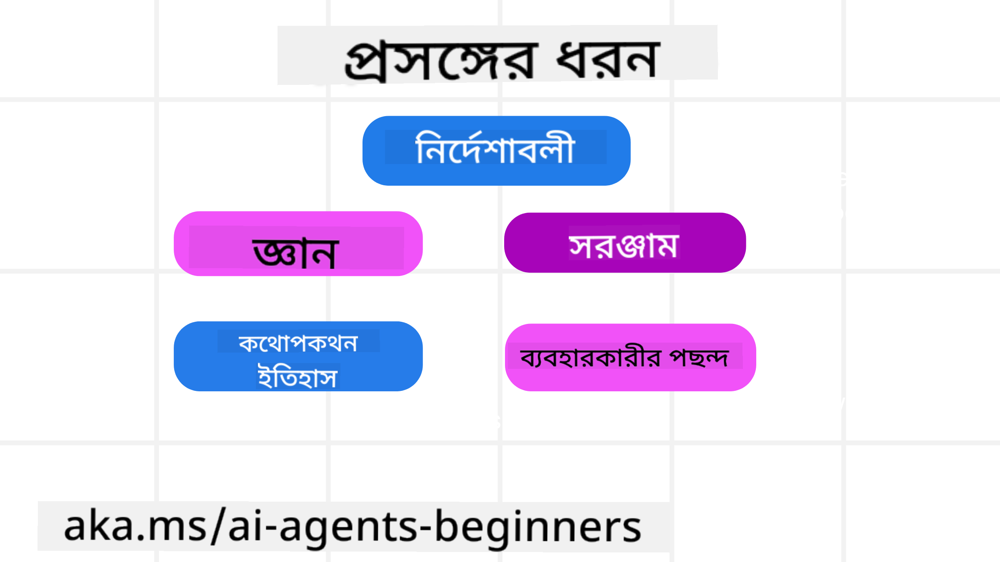
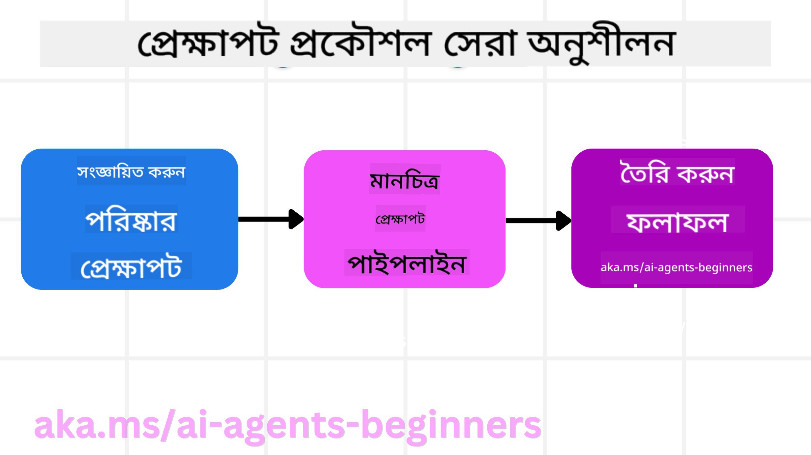

<!--
CO_OP_TRANSLATOR_METADATA:
{
  "original_hash": "cb7e50f471905ce6fdb92a30269a7a98",
  "translation_date": "2025-09-04T09:56:04+00:00",
  "source_file": "12-context-engineering/README.md",
  "language_code": "bn"
}
-->
# AI এজেন্টের জন্য কনটেক্সট ইঞ্জিনিয়ারিং

> _(উপরের ছবিতে ক্লিক করে এই পাঠের ভিডিও দেখুন)_

আপনি যে অ্যাপ্লিকেশনের জন্য AI এজেন্ট তৈরি করছেন তার জটিলতা বোঝা একটি নির্ভরযোগ্য এজেন্ট তৈরি করার জন্য গুরুত্বপূর্ণ। আমাদের এমন AI এজেন্ট তৈরি করতে হবে যা তথ্য কার্যকরভাবে পরিচালনা করতে পারে এবং প্রম্পট ইঞ্জিনিয়ারিংয়ের বাইরে জটিল চাহিদাগুলি পূরণ করতে পারে।

এই পাঠে, আমরা কনটেক্সট ইঞ্জিনিয়ারিং কী এবং AI এজেন্ট তৈরিতে এর ভূমিকা নিয়ে আলোচনা করব।

## পরিচিতি

এই পাঠে আলোচনা করা হবে:

• **কনটেক্সট ইঞ্জিনিয়ারিং কী** এবং এটি প্রম্পট ইঞ্জিনিয়ারিং থেকে কেন আলাদা।

• **কনটেক্সট ইঞ্জিনিয়ারিংয়ের কার্যকর কৌশল**, যার মধ্যে কীভাবে তথ্য লিখতে, নির্বাচন করতে, সংকুচিত করতে এবং আলাদা করতে হয়।

• **সাধারণ কনটেক্সট ব্যর্থতা** যা আপনার AI এজেন্টকে বিপথগামী করতে পারে এবং সেগুলি ঠিক করার উপায়।

## শেখার লক্ষ্য

এই পাঠ শেষ করার পর, আপনি জানতে পারবেন:

• **কনটেক্সট ইঞ্জিনিয়ারিং সংজ্ঞায়িত করতে** এবং এটি প্রম্পট ইঞ্জিনিয়ারিং থেকে আলাদা করতে।

• **বড় ভাষার মডেল (LLM) অ্যাপ্লিকেশনে কনটেক্সটের মূল উপাদানগুলি চিহ্নিত করতে।**

• **কনটেক্সট লিখতে, নির্বাচন করতে, সংকুচিত করতে এবং আলাদা করার কৌশল প্রয়োগ করতে** এজেন্টের কার্যকারিতা উন্নত করতে।

• **সাধারণ কনটেক্সট ব্যর্থতা যেমন বিষক্রিয়া, বিভ্রান্তি, অস্পষ্টতা এবং সংঘর্ষ চিহ্নিত করতে** এবং প্রতিরোধমূলক কৌশল বাস্তবায়ন করতে।

## কনটেক্সট ইঞ্জিনিয়ারিং কী?

AI এজেন্টের জন্য, কনটেক্সটই সেই উপাদান যা এজেন্টকে নির্দিষ্ট কাজ সম্পাদনের জন্য পরিকল্পনা করতে চালিত করে। কনটেক্সট ইঞ্জিনিয়ারিং হলো এজেন্টের কাছে সঠিক তথ্য নিশ্চিত করার প্রক্রিয়া যাতে এটি পরবর্তী ধাপ সম্পন্ন করতে পারে। কনটেক্সট উইন্ডোর আকার সীমিত, তাই এজেন্ট নির্মাতা হিসেবে আমাদের সিস্টেম এবং প্রক্রিয়া তৈরি করতে হবে যা কনটেক্সট উইন্ডোতে তথ্য যোগ, অপসারণ এবং সংকোচন পরিচালনা করতে পারে।

### প্রম্পট ইঞ্জিনিয়ারিং বনাম কনটেক্সট ইঞ্জিনিয়ারিং

প্রম্পট ইঞ্জিনিয়ারিং একটি স্থির নির্দেশনার সেটের উপর ভিত্তি করে AI এজেন্টকে নিয়মের মাধ্যমে কার্যকরভাবে পরিচালনা করার দিকে মনোযোগ দেয়। কনটেক্সট ইঞ্জিনিয়ারিং হলো একটি গতিশীল তথ্য সেট পরিচালনা করার প্রক্রিয়া, যার মধ্যে প্রাথমিক প্রম্পটও অন্তর্ভুক্ত, যাতে এজেন্টের প্রয়োজনীয় তথ্য সময়ের সাথে সাথে নিশ্চিত করা যায়। কনটেক্সট ইঞ্জিনিয়ারিংয়ের মূল ধারণা হলো এই প্রক্রিয়াকে পুনরাবৃত্তিযোগ্য এবং নির্ভরযোগ্য করা।

### কনটেক্সটের ধরন

মনে রাখা গুরুত্বপূর্ণ যে কনটেক্সট শুধুমাত্র একটি বিষয় নয়। AI এজেন্টের প্রয়োজনীয় তথ্য বিভিন্ন উৎস থেকে আসতে পারে এবং এজেন্টের কাছে এই উৎসগুলির অ্যাক্সেস নিশ্চিত করা আমাদের দায়িত্ব:

AI এজেন্টকে যে ধরনের কনটেক্সট পরিচালনা করতে হতে পারে তার মধ্যে রয়েছে:

• **নির্দেশনা:** এগুলো এজেন্টের "নিয়ম" – প্রম্পট, সিস্টেম বার্তা, ফিউ-শট উদাহরণ (AI কে কিছু শেখানোর পদ্ধতি দেখানো), এবং এটি ব্যবহার করতে পারে এমন টুলগুলির বিবরণ। এখানে প্রম্পট ইঞ্জিনিয়ারিং এবং কনটেক্সট ইঞ্জিনিয়ারিং একত্রিত হয়।

• **জ্ঞান:** এটি তথ্য, ডাটাবেস থেকে প্রাপ্ত তথ্য, বা এজেন্টের দীর্ঘমেয়াদী স্মৃতিগুলিকে অন্তর্ভুক্ত করে। যদি এজেন্টের বিভিন্ন জ্ঞানভাণ্ডার এবং ডাটাবেসে অ্যাক্সেসের প্রয়োজন হয়, তাহলে একটি Retrieval Augmented Generation (RAG) সিস্টেম একীভূত করা যেতে পারে।

• **টুলস:** এগুলো হলো বাইরের ফাংশন, API এবং MCP সার্ভারের সংজ্ঞা যা এজেন্ট কল করতে পারে এবং সেগুলি ব্যবহার করে প্রাপ্ত ফলাফল।

• **কথোপকথনের ইতিহাস:** ব্যবহারকারীর সাথে চলমান সংলাপ। সময়ের সাথে সাথে এই কথোপকথন দীর্ঘ এবং জটিল হয়ে ওঠে, যা কনটেক্সট উইন্ডোতে জায়গা নেয়।

• **ব্যবহারকারীর পছন্দ:** সময়ের সাথে ব্যবহারকারীর পছন্দ বা অপছন্দ সম্পর্কে শেখা তথ্য। এটি গুরুত্বপূর্ণ সিদ্ধান্ত নেওয়ার সময় ব্যবহারকারীর সাহায্যের জন্য সংরক্ষণ করা এবং ডাকা যেতে পারে।

## কার্যকর কনটেক্সট ইঞ্জিনিয়ারিংয়ের কৌশল

### পরিকল্পনার কৌশল

ভাল কনটেক্সট ইঞ্জিনিয়ারিং ভালো পরিকল্পনার মাধ্যমে শুরু হয়। এখানে একটি পদ্ধতি রয়েছে যা আপনাকে কনটেক্সট ইঞ্জিনিয়ারিংয়ের ধারণা প্রয়োগ করার বিষয়ে চিন্তা করতে সাহায্য করবে:

1. **স্পষ্ট ফলাফল নির্ধারণ করুন** - AI এজেন্টকে যে কাজগুলি দেওয়া হবে তার ফলাফল স্পষ্টভাবে নির্ধারণ করা উচিত। প্রশ্নের উত্তর দিন - "AI এজেন্ট তার কাজ শেষ করার পর পৃথিবী কেমন দেখাবে?" অর্থাৎ, ব্যবহারকারীর কাছে কী পরিবর্তন, তথ্য বা প্রতিক্রিয়া থাকা উচিত এজেন্টের সাথে যোগাযোগের পরে।

2. **কনটেক্সট ম্যাপ করুন** - একবার আপনি AI এজেন্টের ফলাফল নির্ধারণ করলে, আপনাকে প্রশ্নের উত্তর দিতে হবে "AI এজেন্টের এই কাজটি সম্পন্ন করার জন্য কী তথ্য প্রয়োজন?" এইভাবে আপনি সেই তথ্য কোথায় অবস্থিত তা ম্যাপ করতে শুরু করতে পারেন।

3. **কনটেক্সট পাইপলাইন তৈরি করুন** - এখন আপনি জানেন তথ্য কোথায় রয়েছে, আপনাকে প্রশ্নের উত্তর দিতে হবে "এজেন্ট কীভাবে এই তথ্য পাবে?" এটি বিভিন্ন উপায়ে করা যেতে পারে, যেমন RAG, MCP সার্ভার এবং অন্যান্য টুল ব্যবহার।

### ব্যবহারিক কৌশল

পরিকল্পনা গুরুত্বপূর্ণ, তবে একবার তথ্য আমাদের এজেন্টের কনটেক্সট উইন্ডোতে প্রবাহিত হতে শুরু করলে, আমাদের এটি পরিচালনা করার জন্য ব্যবহারিক কৌশল থাকতে হবে:

#### কনটেক্সট পরিচালনা

যদিও কিছু তথ্য স্বয়ংক্রিয়ভাবে কনটেক্সট উইন্ডোতে যোগ করা হবে, কনটেক্সট ইঞ্জিনিয়ারিং হলো এই তথ্যের একটি সক্রিয় ভূমিকা গ্রহণ করা, যা কয়েকটি কৌশলের মাধ্যমে করা যেতে পারে:

1. **এজেন্ট স্ক্র্যাচপ্যাড**
এটি AI এজেন্টকে একটি সেশনের সময় বর্তমান কাজ এবং ব্যবহারকারীর ইন্টারঅ্যাকশন সম্পর্কে প্রাসঙ্গিক তথ্য নোট করতে দেয়। এটি একটি ফাইল বা রানটাইম অবজেক্টে কনটেক্সট উইন্ডোর বাইরে থাকা উচিত যা এজেন্ট প্রয়োজনে পরে পুনরুদ্ধার করতে পারে।

2. **স্মৃতি**
স্ক্র্যাচপ্যাড একক সেশনের কনটেক্সট উইন্ডোর বাইরে তথ্য পরিচালনার জন্য ভালো। স্মৃতি এজেন্টকে একাধিক সেশনের মধ্যে প্রাসঙ্গিক তথ্য সংরক্ষণ এবং পুনরুদ্ধার করতে সক্ষম করে। এর মধ্যে সারাংশ, ব্যবহারকারীর পছন্দ এবং ভবিষ্যতের উন্নতির জন্য প্রতিক্রিয়া অন্তর্ভুক্ত থাকতে পারে।

3. **কনটেক্সট সংকুচিত করা**
যখন কনটেক্সট উইন্ডো বড় হয় এবং এর সীমার কাছাকাছি পৌঁছায়, তখন সারাংশ তৈরি এবং ছাঁটাইয়ের মতো কৌশল ব্যবহার করা যেতে পারে। এর মধ্যে শুধুমাত্র সবচেয়ে প্রাসঙ্গিক তথ্য রাখা বা পুরানো বার্তা সরানো অন্তর্ভুক্ত।

4. **মাল্টি-এজেন্ট সিস্টেম**
মাল্টি-এজেন্ট সিস্টেম তৈরি করা কনটেক্সট ইঞ্জিনিয়ারিংয়ের একটি রূপ কারণ প্রতিটি এজেন্টের নিজস্ব কনটেক্সট উইন্ডো থাকে। এই কনটেক্সট কীভাবে ভাগ করা হয় এবং বিভিন্ন এজেন্টের কাছে প্রেরণ করা হয় তা এই সিস্টেমগুলি তৈরি করার সময় পরিকল্পনা করা আরেকটি বিষয়।

5. **স্যান্ডবক্স পরিবেশ**
যদি এজেন্টকে কিছু কোড চালাতে বা একটি ডকুমেন্টে বড় পরিমাণ তথ্য প্রক্রিয়া করতে হয়, এটি ফলাফল প্রক্রিয়াকরণের জন্য প্রচুর টোকেন নিতে পারে। কনটেক্সট উইন্ডোতে এটি সংরক্ষণ করার পরিবর্তে, এজেন্ট একটি স্যান্ডবক্স পরিবেশ ব্যবহার করতে পারে যা এই কোড চালাতে সক্ষম এবং শুধুমাত্র ফলাফল এবং অন্যান্য প্রাসঙ্গিক তথ্য পড়তে পারে।

6. **রানটাইম স্টেট অবজেক্ট**
এটি এমন পরিস্থিতি পরিচালনা করার জন্য তথ্যের কন্টেইনার তৈরি করে যখন এজেন্টের নির্দিষ্ট তথ্যের অ্যাক্সেস প্রয়োজন হয়। একটি জটিল কাজের জন্য, এটি এজেন্টকে প্রতিটি সাবটাস্কের ফলাফল ধাপে ধাপে সংরক্ষণ করতে সক্ষম করবে, কনটেক্সটকে শুধুমাত্র সেই নির্দিষ্ট সাবটাস্কের সাথে সংযুক্ত রাখতে।

### কনটেক্সট ইঞ্জিনিয়ারিংয়ের উদাহরণ

ধরুন আমরা একটি AI এজেন্টকে **"আমার জন্য প্যারিসে একটি ট্রিপ বুক করুন।"** বলতে চাই।

• শুধুমাত্র প্রম্পট ইঞ্জিনিয়ারিং ব্যবহার করে একটি সাধারণ এজেন্ট হয়তো শুধু উত্তর দেবে: **"ঠিক আছে, আপনি কখন প্যারিসে যেতে চান?"**। এটি শুধুমাত্র ব্যবহারকারীর সরাসরি প্রশ্নটি প্রক্রিয়াকরণ করেছে।

• কনটেক্সট ইঞ্জিনিয়ারিংয়ের কৌশল ব্যবহার করে একটি এজেন্ট আরও অনেক কিছু করবে। উত্তর দেওয়ার আগে, এর সিস্টেম হয়তো:

  ◦ **আপনার ক্যালেন্ডার চেক করবে** উপলব্ধ তারিখের জন্য (রিয়েল-টাইম ডেটা পুনরুদ্ধার)।

 ◦ **পূর্ববর্তী ভ্রমণের পছন্দগুলি স্মরণ করবে** (দীর্ঘমেয়াদী স্মৃতি থেকে) যেমন আপনার পছন্দের এয়ারলাইন, বাজেট, বা আপনি সরাসরি ফ্লাইট পছন্দ করেন কিনা।

 ◦ **উপলব্ধ টুলগুলি চিহ্নিত করবে** ফ্লাইট এবং হোটেল বুকিংয়ের জন্য।

- তারপর একটি উদাহরণ উত্তর হতে পারে: **"হ্যালো [আপনার নাম]! আমি দেখছি আপনি অক্টোবরের প্রথম সপ্তাহে ফ্রি। আমি কি [পছন্দের এয়ারলাইন] এর সরাসরি ফ্লাইট খুঁজব আপনার সাধারণ বাজেট [বাজেট] এর মধ্যে?"**। এই সমৃদ্ধ, কনটেক্সট-সচেতন উত্তর কনটেক্সট ইঞ্জিনিয়ারিংয়ের শক্তি প্রদর্শন করে।

## সাধারণ কনটেক্সট ব্যর্থতা

### কনটেক্সট বিষক্রিয়া

**এটি কী:** যখন একটি ভুল তথ্য (LLM দ্বারা তৈরি মিথ্যা তথ্য) বা একটি ত্রুটি কনটেক্সটে প্রবেশ করে এবং বারবার উল্লেখ করা হয়, যার ফলে এজেন্ট অসম্ভব লক্ষ্য অনুসরণ করে বা অর্থহীন কৌশল তৈরি করে।

**কী করতে হবে:** **কনটেক্সট যাচাই** এবং **কোয়ারেন্টাইন** বাস্তবায়ন করুন। দীর্ঘমেয়াদী স্মৃতিতে যোগ করার আগে তথ্য যাচাই করুন। যদি সম্ভাব্য বিষক্রিয়া সনাক্ত করা হয়, তাহলে খারাপ তথ্য ছড়িয়ে পড়া রোধ করতে নতুন কনটেক্সট থ্রেড শুরু করুন।

**ট্রাভেল বুকিং উদাহরণ:** আপনার এজেন্ট একটি **ছোট স্থানীয় বিমানবন্দর থেকে একটি দূরবর্তী আন্তর্জাতিক শহরে সরাসরি ফ্লাইট** কল্পনা করে যা আসলে আন্তর্জাতিক ফ্লাইট সরবরাহ করে না। এই অস্তিত্বহীন ফ্লাইটের বিবরণ কনটেক্সটে সংরক্ষিত হয়। পরে, যখন আপনি এজেন্টকে বুক করতে বলেন, এটি এই অসম্ভব রুটের জন্য টিকিট খুঁজতে থাকে, যার ফলে বারবার ত্রুটি হয়।

**সমাধান:** একটি ধাপ বাস্তবায়ন করুন যা **রিয়েল-টাইম API দিয়ে ফ্লাইটের অস্তিত্ব এবং রুট যাচাই করে** _লম্বা_ কনটেক্সটে ফ্লাইটের বিবরণ যোগ করার আগে। যদি যাচাই ব্যর্থ হয়, ভুল তথ্য "কোয়ারেন্টাইন" করা হয় এবং আর ব্যবহার করা হয় না।

### কনটেক্সট বিভ্রান্তি

**এটি কী:** যখন কনটেক্সট এত বড় হয়ে যায় যে মডেল প্রশিক্ষণের সময় যা শিখেছে তার পরিবর্তে জমা হওয়া ইতিহাসের উপর খুব বেশি মনোযোগ দেয়, যার ফলে পুনরাবৃত্তি বা অপ্রাসঙ্গিক ক্রিয়া ঘটে। মডেলগুলি কনটেক্সট উইন্ডো পূর্ণ হওয়ার আগেই ভুল করতে শুরু করতে পারে।

**কী করতে হবে:** **কনটেক্সট সারাংশ তৈরি করুন।** সময়ে সময়ে জমা হওয়া তথ্যকে ছোট সারাংশে সংকুচিত করুন, গুরুত্বপূর্ণ বিবরণ রেখে অতিরিক্ত ইতিহাস সরিয়ে ফেলুন। এটি "ফোকাস পুনরায় সেট" করতে সাহায্য করে।

**ট্রাভেল বুকিং উদাহরণ:** আপনি দীর্ঘ সময় ধরে বিভিন্ন স্বপ্নের ভ্রমণ গন্তব্য নিয়ে আলোচনা করছেন, যার মধ্যে আপনার দুই বছর আগের ব্যাকপ্যাকিং ট্রিপের একটি বিস্তারিত বিবরণ রয়েছে। যখন আপনি অবশেষে বলেন **"আমার জন্য আগামী মাসের জন্য একটি সস্তা ফ্লাইট খুঁজুন,"** এজেন্ট পুরানো, অপ্রাসঙ্গিক বিবরণে আটকে যায় এবং আপনার ব্যাকপ্যাকিং গিয়ার বা অতীতের পরিকল্পনা সম্পর্কে জিজ্ঞাসা করতে থাকে, আপনার বর্তমান অনুরোধ উপেক্ষা করে।

**সমাধান:** নির্দিষ্ট সংখ্যক টার্নের পরে বা যখন কনটেক্সট খুব বড় হয়ে যায়, এজেন্ট **কথোপকথনের সবচেয়ে সাম্প্রতিক এবং প্রাসঙ্গিক অংশগুলির সারাংশ তৈরি করবে** – আপনার বর্তমান ভ্রমণের তারিখ এবং গন্তব্যের উপর ফোকাস করে – এবং পরবর্তী LLM কলের জন্য সেই সংক্ষিপ্ত সারাংশ ব্যবহার করবে, কম প্রাসঙ্গিক ঐতিহাসিক চ্যাট বাদ দিয়ে।

### কনটেক্সট অস্পষ্টতা

**এটি কী:** যখন অপ্রয়োজনীয় কনটেক্সট, প্রায়শই খুব বেশি উপলব্ধ টুলের আকারে, মডেলকে খারাপ প্রতিক্রিয়া তৈরি করতে বা অপ্রাসঙ্গিক টুল কল করতে বাধ্য করে। ছোট মডেলগুলি বিশেষভাবে এর প্রতি সংবেদনশীল।

**কী করতে হবে:** **টুল লোডআউট ম্যানেজমেন্ট** RAG কৌশল ব্যবহার করে বাস্তবায়ন করুন। টুলের বিবরণ একটি ভেক্টর ডাটাবেসে সংরক্ষণ করুন এবং প্রতিটি নির্দিষ্ট কাজের জন্য শুধুমাত্র সবচেয়ে প্রাসঙ্গিক টুল নির্বাচন করুন। গবেষণায় দেখা গেছে টুলের সংখ্যা ৩০ এর কম রাখা কার্যকর।

**ট্রাভেল বুকিং উদাহরণ:** আপনার এজেন্টের ডজনখানেক টুল রয়েছে: `book_flight`, `book_hotel`, `rent_car`, `find_tours`, `currency_converter`, `weather_forecast`, `restaurant_reservations`, ইত্যাদি। আপনি জিজ্ঞাসা করেন, **"প্যারিসে ঘোরার সেরা উপায় কী?"** টুলের বিশাল সংখ্যার কারণে, এজেন্ট বিভ্রান্ত হয়ে `book_flight` প্যারিসের মধ্যে কল করার চেষ্টা করে, অথবা `rent_car` ব্যবহার করে যদিও আপনি পাবলিক ট্রান্সপোর্ট পছন্দ করেন, কারণ টুলের বিবরণ ওভারল্যাপ করতে পারে বা এটি সেরা টুলটি চিহ্নিত করতে পারে না।

**সমাধান:** **টুলের বিবরণের উপর RAG ব্যবহার করুন।** যখন আপনি প্যারিসে ঘোরার বিষয়ে জিজ্ঞাসা করেন, সিস্টেমটি গতিশীলভাবে শুধুমাত্র সবচেয়ে প্রাসঙ্গিক টুল যেমন `rent_car` বা `public_transport_info` আপনার প্রশ্নের ভিত্তিতে পুনরুদ্ধার করে, LLM-কে একটি কেন্দ্রীভূত "লোডআউট" টুল উপস্থাপন করে।

### কনটেক্সট সংঘর্ষ

**এটি কী:** যখন কনটেক্সটে বিরোধপূর্ণ তথ্য থাকে, যার ফলে অসঙ্গত যুক্তি বা খারাপ চূড়ান্ত প্রতিক্রিয়া হয়। এটি প্রায়ই তখন ঘটে যখন তথ্য পর্যায়ক্রমে আসে এবং প্রাথমিক, ভুল অনুমানগুলি কনটেক্সটে রয়ে যায়।

**কী করতে হবে:** **কনটেক্সট ছাঁটাই** এবং **অফলোডিং** ব্যবহার করুন। ছাঁটাই মানে নতুন বিবরণ আসার সাথে সাথে পুরানো বা বিরোধপূর্ণ তথ্য সরিয়ে ফেলা। অফলোডিং এজেন্টকে প্রধান কনটেক্সটের জট না বাড়িয়ে আলাদা "স্ক্র্যাচপ্যাড" ওয়ার্কস্পেস দেয়।

**ট্রাভেল বুকিং উদাহরণ:** আপনি প্রথমে আপনার এজেন্টকে বলেন, **"আমি ইকোনমি ক্লাসে উড়তে চাই।"** পরে কথোপকথনে, আপনি মত পরিবর্তন করেন এবং বলেন, **"আসলে, এই ট্রিপের জন্য, চলুন বিজনেস ক্লাসে যাই।"** যদি উভয় নির্দেশনা কনটেক্সটে থাকে, এজেন্ট বির

---

**অস্বীকৃতি**:  
এই নথিটি AI অনুবাদ পরিষেবা [Co-op Translator](https://github.com/Azure/co-op-translator) ব্যবহার করে অনুবাদ করা হয়েছে। আমরা যথাসম্ভব সঠিক অনুবাদের চেষ্টা করি, তবে অনুগ্রহ করে মনে রাখবেন যে স্বয়ংক্রিয় অনুবাদে ত্রুটি বা অসঙ্গতি থাকতে পারে। নথিটির মূল ভাষায় লেখা সংস্করণটিকেই প্রামাণিক উৎস হিসেবে বিবেচনা করা উচিত। গুরুত্বপূর্ণ তথ্যের জন্য, পেশাদার মানব অনুবাদ ব্যবহার করার পরামর্শ দেওয়া হচ্ছে। এই অনুবাদ ব্যবহারের ফলে সৃষ্ট কোনো ভুল বোঝাবুঝি বা ভুল ব্যাখ্যার জন্য আমরা দায়ী নই।  