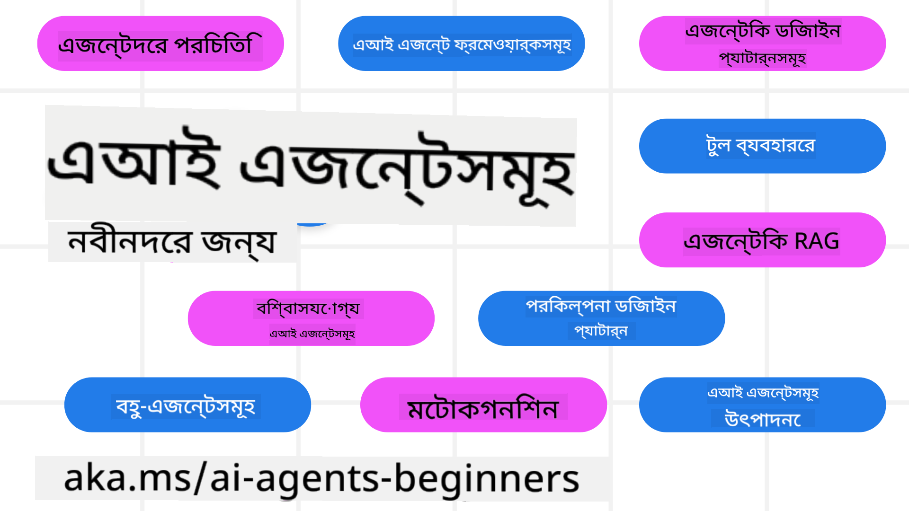

<!--
CO_OP_TRANSLATOR_METADATA:
{
  "original_hash": "6b07046397366e6f6f4524c9ddeba1e1",
  "translation_date": "2025-07-12T14:46:37+00:00",
  "source_file": "README.md",
  "language_code": "bn"
}
-->
# AI এজেন্টস ফর বিগিনার্স - একটি কোর্স

## ১১টি লেসন যা আপনাকে AI এজেন্ট তৈরি শুরু করার জন্য প্রয়োজনীয় সবকিছু শেখাবে

  
  
  
  

### 🌐 বহুভাষিক সমর্থন

#### GitHub Action এর মাধ্যমে সমর্থিত (স্বয়ংক্রিয় ও সর্বদা আপডেটেড)

[French](../fr/README.md) | [Spanish](../es/README.md) | [German](../de/README.md) | [Russian](../ru/README.md) | [Arabic](../ar/README.md) | [Persian (Farsi)](../fa/README.md) | [Urdu](../ur/README.md) | [Chinese (Simplified)](../zh/README.md) | [Chinese (Traditional, Macau)](../mo/README.md) | [Chinese (Traditional, Hong Kong)](../hk/README.md) | [Chinese (Traditional, Taiwan)](../tw/README.md) | [Japanese](../ja/README.md) | [Korean](../ko/README.md) | [Hindi](../hi/README.md) | [Bengali](./README.md) | [Marathi](../mr/README.md) | [Nepali](../ne/README.md) | [Punjabi (Gurmukhi)](../pa/README.md) | [Portuguese (Portugal)](../pt/README.md) | [Portuguese (Brazil)](../br/README.md) | [Italian](../it/README.md) | [Polish](../pl/README.md) | [Turkish](../tr/README.md) | [Greek](../el/README.md) | [Thai](../th/README.md) | [Swedish](../sv/README.md) | [Danish](../da/README.md) | [Norwegian](../no/README.md) | [Finnish](../fi/README.md) | [Dutch](../nl/README.md) | [Hebrew](../he/README.md) | [Vietnamese](../vi/README.md) | [Indonesian](../id/README.md) | [Malay](../ms/README.md) | [Tagalog (Filipino)](../tl/README.md) | [Swahili](../sw/README.md) | [Hungarian](../hu/README.md) | [Czech](../cs/README.md) | [Slovak](../sk/README.md) | [Romanian](../ro/README.md) | [Bulgarian](../bg/README.md) | [Serbian (Cyrillic)](../sr/README.md) | [Croatian](../hr/README.md) | [Slovenian](../sl/README.md) | [Ukrainian](../uk/README.md) | [Burmese (Myanmar)](../my/README.md)

**আপনি যদি অতিরিক্ত ভাষার অনুবাদ চান, সেগুলো এখানে তালিকাভুক্ত আছে [here](https://github.com/Azure/co-op-translator/blob/main/getting_started/supported-languages.md)**

  
  

## 🌱 শুরু করা যাক

এই কোর্সে ১১টি লেসন রয়েছে যা AI এজেন্ট তৈরি করার মৌলিক বিষয়গুলো কভার করে। প্রতিটি লেসন আলাদা টপিক নিয়ে, তাই আপনি যেখান থেকে ইচ্ছা শুরু করতে পারেন!

এই কোর্সের জন্য বহুভাষিক সমর্থন রয়েছে। আমাদের [উপলব্ধ ভাষাগুলো এখানে দেখুন](../..)।

আপনি যদি প্রথমবার Generative AI মডেল দিয়ে কাজ শুরু করতে চান, তাহলে আমাদের [Generative AI For Beginners](https://aka.ms/genai-beginners) কোর্সটি দেখুন, যেখানে ২১টি লেসন রয়েছে GenAI নিয়ে কাজ করার জন্য।

এই রিপোটি [স্টার (🌟) দিতে](https://docs.github.com/en/get-started/exploring-projects-on-github/saving-repositories-with-stars?WT.mc_id=academic-105485-koreyst) এবং [ফর্ক করতে](https://github.com/microsoft/ai-agents-for-beginners/fork) ভুলবেন না, যাতে আপনি কোড রান করতে পারেন।

### আপনার যা প্রয়োজন

এই কোর্সের প্রতিটি লেসনে কোড উদাহরণ রয়েছে, যা code_samples ফোল্ডারে পাওয়া যাবে। আপনি [এই রিপোটি ফর্ক](https://github.com/microsoft/ai-agents-for-beginners/fork) করে নিজের কপি তৈরি করতে পারেন।

এই উদাহরণগুলোতে Azure AI Foundry এবং GitHub Model Catalogs ব্যবহার করা হয়েছে Language Models এর সাথে ইন্টারঅ্যাক্ট করার জন্য:

- [Github Models](https://aka.ms/ai-agents-beginners/github-models) - ফ্রি / সীমিত  
- [Azure AI Foundry](https://aka.ms/ai-agents-beginners/ai-foundry) - Azure অ্যাকাউন্ট প্রয়োজন

এই কোর্সে Microsoft এর নিম্নলিখিত AI Agent ফ্রেমওয়ার্ক এবং সার্ভিসগুলোও ব্যবহার করা হয়েছে:

- [Azure AI Agent Service](https://aka.ms/ai-agents-beginners/ai-agent-service)  
- [Semantic Kernel](https://aka.ms/ai-agents-beginners/semantic-kernel)  
- [AutoGen](https://aka.ms/ai-agents/autogen)

এই কোর্সের কোড চালানোর বিস্তারিত জানতে [Course Setup](./00-course-setup/README.md) দেখুন।

## 🙏 সাহায্য করতে চান?

আপনার কোনো পরামর্শ আছে বা বানান বা কোডে ভুল পেয়েছেন? [ইস্যু তুলুন](https://github.com/microsoft/ai-agents-for-beginners/issues?WT.mc_id=academic-105485-koreyst) অথবা [পুল রিকোয়েস্ট তৈরি করুন](https://github.com/microsoft/ai-agents-for-beginners/pulls?WT.mc_id=academic-105485-koreyst)

যদি আটকে যান বা AI এজেন্ট তৈরি নিয়ে কোনো প্রশ্ন থাকে, আমাদের [Azure AI Foundry Community Discord](https://discord.gg/kzRShWzttr) এ যোগ দিন।

প্রোডাক্ট ফিডব্যাক বা বিল্ডিংয়ের সময় কোনো ত্রুটি পেলে আমাদের [Azure AI Foundry Developer Forum](https://aka.ms/azureaifoundry/forum) দেখুন।

## 📂 প্রতিটি লেসনে রয়েছে

- README তে লেখা লেসন এবং একটি সংক্ষিপ্ত ভিডিও  
- Azure AI Foundry এবং Github Models (ফ্রি) সমর্থিত পাইথন কোড উদাহরণ  
- শেখার জন্য অতিরিক্ত রিসোর্সের লিঙ্ক

## 🗃️ লেসনসমূহ

| **লেসন**                                | **টেক্সট ও কোড**                                   | **ভিডিও**                                                  | **অতিরিক্ত শেখার লিঙ্ক**                                                             |
|------------------------------------------|----------------------------------------------------|------------------------------------------------------------|----------------------------------------------------------------------------------------|
| AI এজেন্টস ও এজেন্ট ব্যবহারের পরিচিতি  | [লিঙ্ক](./01-intro-to-ai-agents/README.md)          | [ভিডিও](https://youtu.be/3zgm60bXmQk?si=z8QygFvYQv-9WtO1)  | [লিঙ্ক](https://aka.ms/ai-agents-beginners/collection?WT.mc_id=academic-105485-koreyst) |
| AI Agentic Frameworks অন্বেষণ             | [লিঙ্ক](./02-explore-agentic-frameworks/README.md)  | [ভিডিও](https://youtu.be/ODwF-EZo_O8?si=Vawth4hzVaHv-u0H)  | [লিঙ্ক](https://aka.ms/ai-agents-beginners/collection?WT.mc_id=academic-105485-koreyst) |
| AI Agentic Design Patterns বোঝা          | [লিঙ্ক](./03-agentic-design-patterns/README.md)     | [ভিডিও](https://youtu.be/m9lM8qqoOEA?si=BIzHwzstTPL8o9GF)  | [লিঙ্ক](https://aka.ms/ai-agents-beginners/collection?WT.mc_id=academic-105485-koreyst) |
| Tool Use Design Pattern                   | [লিঙ্ক](./04-tool-use/README.md)                    | [ভিডিও](https://youtu.be/vieRiPRx-gI?si=2z6O2Xu2cu_Jz46N)  | [লিঙ্ক](https://aka.ms/ai-agents-beginners/collection?WT.mc_id=academic-105485-koreyst) |
| Agentic RAG                              | [লিঙ্ক](./05-agentic-rag/README.md)                 | [ভিডিও](https://youtu.be/WcjAARvdL7I?si=gKPWsQpKiIlDH9A3)  | [লিঙ্ক](https://aka.ms/ai-agents-beginners/collection?WT.mc_id=academic-105485-koreyst) |
| বিশ্বাসযোগ্য AI এজেন্ট তৈরি করা          | [লিঙ্ক](./06-building-trustworthy-agents/README.md) | [ভিডিও](https://youtu.be/iZKkMEGBCUQ?si=jZjpiMnGFOE9L8OK ) | [লিঙ্ক](https://aka.ms/ai-agents-beginners/collection?WT.mc_id=academic-105485-koreyst) |
| Planning Design Pattern                   | [লিঙ্ক](./07-planning-design/README.md)             | [ভিডিও](https://youtu.be/kPfJ2BrBCMY?si=6SC_iv_E5-mzucnC)  | [লিঙ্ক](https://aka.ms/ai-agents-beginners/collection?WT.mc_id=academic-105485-koreyst) |
| Multi-Agent Design Pattern                | [লিঙ্ক](./08-multi-agent/README.md)                 | [ভিডিও](https://youtu.be/V6HpE9hZEx0?si=rMgDhEu7wXo2uo6g)  | [লিঙ্ক](https://aka.ms/ai-agents-beginners/collection?WT.mc_id=academic-105485-koreyst) |
| Metacognition Design Pattern              | [লিঙ্ক](./09-metacognition/README.md)               | [ভিডিও](https://youtu.be/His9R6gw6Ec?si=8gck6vvdSNCt6OcF)  | [লিঙ্ক](https://aka.ms/ai-agents-beginners/collection?WT.mc_id=academic-105485-koreyst) |
| প্রোডাকশনে AI এজেন্টস                   | [লিঙ্ক](./10-ai-agents-production/README.md)        | [ভিডিও](https://youtu.be/l4TP6IyJxmQ?si=31dnhexRo6yLRJDl)  | [লিঙ্ক](https://aka.ms/ai-agents-beginners/collection?WT.mc_id=academic-105485-koreyst) |
| MCP সহ AI এজেন্টস                       | [লিঙ্ক](./11-mcp/README.md)                         |                                                            | [লিঙ্ক](https://aka.ms/mcp-for-beginners)                                               |

## 🎒 অন্যান্য কোর্সসমূহ

আমাদের টিম অন্যান্য কোর্সও তৈরি করে! দেখুন:
- [**নতুন** Model Context Protocol (MCP) শুরু করার জন্য](https://github.com/microsoft/mcp-for-beginners?WT.mc_id=academic-105485-koreyst)
- [.NET ব্যবহার করে শুরু করার জন্য Generative AI](https://github.com/microsoft/Generative-AI-for-beginners-dotnet?WT.mc_id=academic-105485-koreyst)
- [শুরু করার জন্য Generative AI](https://github.com/microsoft/generative-ai-for-beginners?WT.mc_id=academic-105485-koreyst)
- [শুরু করার জন্য ML](https://aka.ms/ml-beginners?WT.mc_id=academic-105485-koreyst)
- [শুরু করার জন্য Data Science](https://aka.ms/datascience-beginners?WT.mc_id=academic-105485-koreyst)
- [শুরু করার জন্য AI](https://aka.ms/ai-beginners?WT.mc_id=academic-105485-koreyst)
- [শুরু করার জন্য Cybersecurity](https://github.com/microsoft/Security-101??WT.mc_id=academic-96948-sayoung)
- [শুরু করার জন্য Web Dev](https://aka.ms/webdev-beginners?WT.mc_id=academic-105485-koreyst)
- [শুরু করার জন্য IoT](https://aka.ms/iot-beginners?WT.mc_id=academic-105485-koreyst)
- [শুরু করার জন্য XR Development](https://github.com/microsoft/xr-development-for-beginners?WT.mc_id=academic-105485-koreyst)
- [AI Paired Programming এর জন্য GitHub Copilot দক্ষতা অর্জন](https://aka.ms/GitHubCopilotAI?WT.mc_id=academic-105485-koreyst)
- [C#/.NET ডেভেলপারদের জন্য GitHub Copilot দক্ষতা অর্জন](https://github.com/microsoft/mastering-github-copilot-for-dotnet-csharp-developers?WT.mc_id=academic-105485-koreyst)
- [নিজের Copilot অ্যাডভেঞ্চার বেছে নিন](https://github.com/microsoft/CopilotAdventures?WT.mc_id=academic-105485-koreyst)

## 🌟 কমিউনিটির ধন্যবাদ

Agentic RAG প্রদর্শন করে গুরুত্বপূর্ণ কোড স্যাম্পল দেওয়ার জন্য [Shivam Goyal](https://www.linkedin.com/in/shivam2003/) কে ধন্যবাদ।

## অবদান রাখা

এই প্রকল্পে অবদান এবং পরামর্শ স্বাগত। বেশিরভাগ অবদানের জন্য আপনাকে একটি Contributor License Agreement (CLA) মেনে নিতে হবে, যা ঘোষণা করে যে আপনি আপনার অবদান ব্যবহারের অধিকার রাখেন এবং তা আমাদের প্রদান করছেন। বিস্তারিত জানতে ভিজিট করুন  
<https://cla.opensource.microsoft.com>।

যখন আপনি একটি pull request জমা দেবেন, একটি CLA বট স্বয়ংক্রিয়ভাবে নির্ধারণ করবে আপনি CLA প্রদান করতে হবে কিনা এবং PR-কে উপযুক্তভাবে সাজাবে (যেমন, স্ট্যাটাস চেক, মন্তব্য)। বটের নির্দেশনা অনুসরণ করুন। আমাদের CLA ব্যবহার করা সব রেপোতে আপনাকে একবারই এটি করতে হবে।

এই প্রকল্পে [Microsoft Open Source Code of Conduct](https://opensource.microsoft.com/codeofconduct/) গ্রহণ করা হয়েছে।  
আরও তথ্যের জন্য দেখুন [Code of Conduct FAQ](https://opensource.microsoft.com/codeofconduct/faq/) অথবা  
যেকোনো অতিরিক্ত প্রশ্ন বা মন্তব্যের জন্য যোগাযোগ করুন [opencode@microsoft.com](mailto:opencode@microsoft.com) এ।

## ট্রেডমার্ক

এই প্রকল্পে প্রকল্প, পণ্য বা সেবার ট্রেডমার্ক বা লোগো থাকতে পারে। Microsoft ট্রেডমার্ক বা লোগোর অনুমোদিত ব্যবহার অবশ্যই [Microsoft's Trademark & Brand Guidelines](https://www.microsoft.com/legal/intellectualproperty/trademarks/usage/general) অনুসরণ করতে হবে।  
এই প্রকল্পের পরিবর্তিত সংস্করণে Microsoft ট্রেডমার্ক বা লোগোর ব্যবহার বিভ্রান্তি সৃষ্টি করা বা Microsoft স্পন্সরশিপ বোঝানো উচিত নয়।  
তৃতীয় পক্ষের ট্রেডমার্ক বা লোগোর যেকোনো ব্যবহার সংশ্লিষ্ট পক্ষের নীতিমালা অনুসারে হতে হবে।

**অস্বীকৃতি**:  
এই নথিটি AI অনুবাদ সেবা [Co-op Translator](https://github.com/Azure/co-op-translator) ব্যবহার করে অনূদিত হয়েছে। আমরা যথাসাধ্য সঠিকতার চেষ্টা করি, তবে স্বয়ংক্রিয় অনুবাদে ত্রুটি বা অসঙ্গতি থাকতে পারে। মূল নথিটি তার নিজস্ব ভাষায়ই কর্তৃত্বপূর্ণ উৎস হিসেবে বিবেচিত হওয়া উচিত। গুরুত্বপূর্ণ তথ্যের জন্য পেশাদার মানব অনুবাদ গ্রহণ করার পরামর্শ দেওয়া হয়। এই অনুবাদের ব্যবহারে সৃষ্ট কোনো ভুল বোঝাবুঝি বা ভুল ব্যাখ্যার জন্য আমরা দায়ী নই।